# Batch Normalization

[李宏毅](https://www.youtube.com/watch?v=BZh1ltr5Rkg&t=49s)  
[李沐](https://www.bilibili.com/video/BV1X44y1r77r?spm_id_from=333.788.recommend_more_video.0&vd_source=4e1dceccc918063def66c9d643674c6a)

## Feature Scaling

>Make different features have the same scaling

假设 x1 的 scale 非常小、x2 的 scale 非常大。当 x1 和 x2 变动时，由于 x2 的 scale 比较大，而 x2 要和 W2 相乘，因此 W2 的变动相对于 W1 会对 Loss 产生更多影响（gradient在横的方向上和纵的方向上变化很不一样，让train变得很不容易，因为不同方向上需要不同的learning rate），也因此会产生下面这种图。

如果对不同的feature做normalization（右图）使得error surface 变成正圆，可以让training变得容易很多

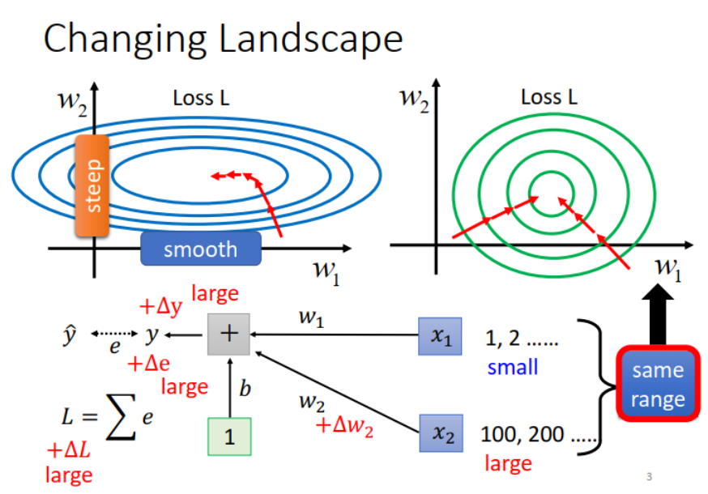

**Feature Normalization**  
假设 $x^1$, $x^2$, ...,$x^R$表示一组输入 samples，把它们在每个维度 (feature) 上减去相应的均值 (mean)，除以对应的方差 (variance)，如下图中公式所示。做完 normalization 之后，输入 samples 每个维度上的均值都是 0，方差是 1。

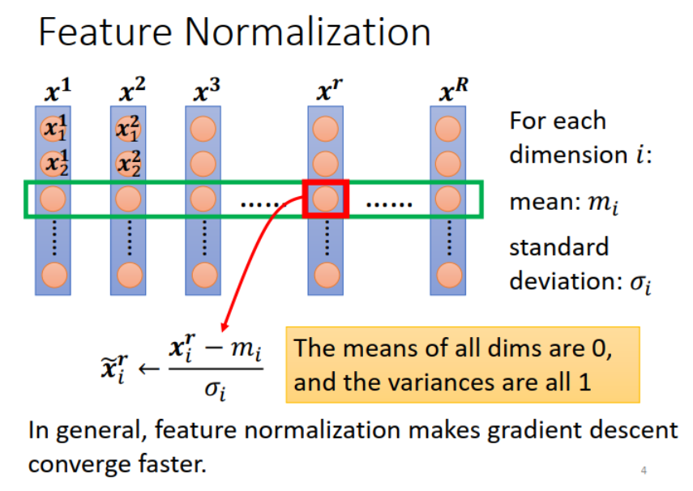

做了feature normalization之后往往会让training变得更加快速

*思考：对于deep learning中的每一层是不是都可以做feature normalization 让结果learn的更好*

可以，解决**内部协变量偏移**(Internal Covariate Shift)问题。
>内部协变量偏移: 下图为例，有四个人，每个人代表一个Layer，中间利用话筒来做讯息的传递，线直了代表沟通顺畅，观察左二的人，左手话筒高，右手话筒低，这时候左一的人跟他说，左手话筒低一点，右二的人跟他说，右手话筒高一点，然后左二照做就可以变下图那样，左手过低，右手过高。  两个都变化，结果反而坏掉了。

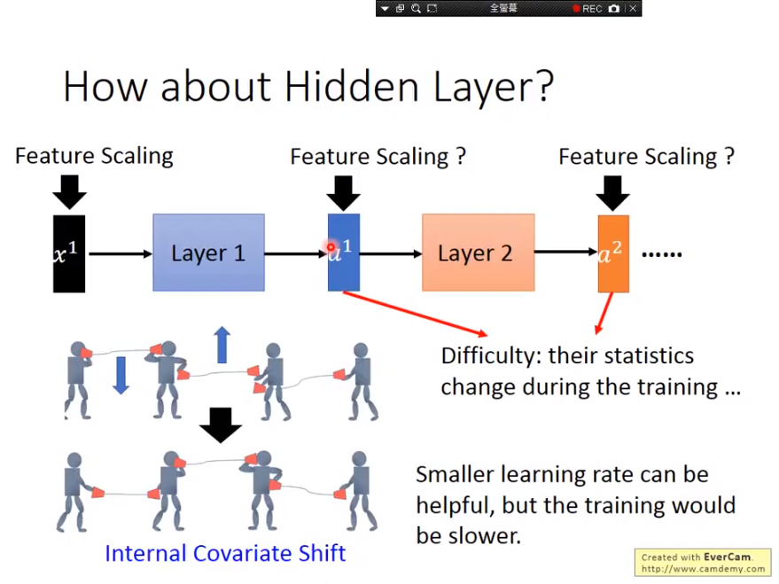

传统方法，learning rate小一点，但是会慢很多

当网络很深的时候，反向传播传到前面时gradient往往会逐渐变小，这导致后面层很快就收敛了，但是前面的层变化很小，收敛很慢。同时一旦前面的层发生改变，后面的层又需要跟着重新train。  
前面训练慢，后面训练快，但前面一改变，后面需要重新跟着训练。

能否在底部训练的时候避免变化顶部?

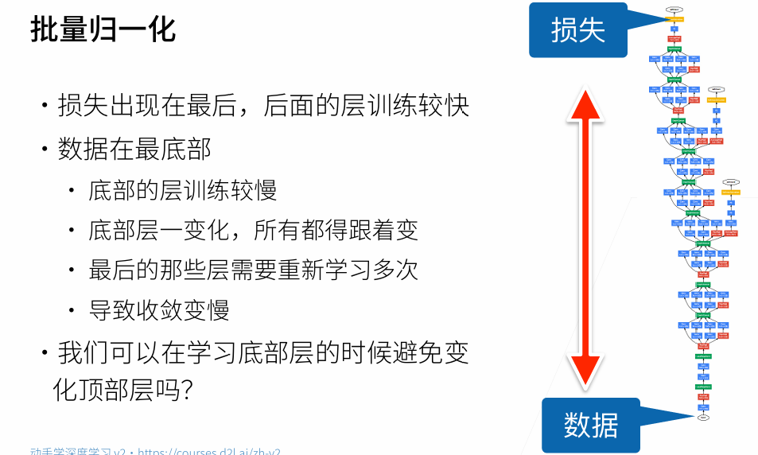

如果可以对每一层都Featuer Scaling，让它们的均值、方差皆缩放至一个值域内，那对下一个Layer而言，它的Statistics就是固定而不会上下飘动，训练上可能就可以更加的容易。  
保证层间输出和梯度符合某一特定分布，以提高数据和损失的稳定性。
Feature Normalization对输入数据很有用，因为输入数据不会改变，但是对隐藏层就不管用了。每一个Layer的Output都是一直变化的，因为模型参数是不断变化。

所以发明了Batch Normalization解决这个问题。

## Batch Normalization

### Batch（批）

Batch意指在训练过程中每次取一把出来计算，下图范例一次取三笔数据出来平行运算，但在GPU计算中会将三个Vector转成Matrix，以此加速计算速度。
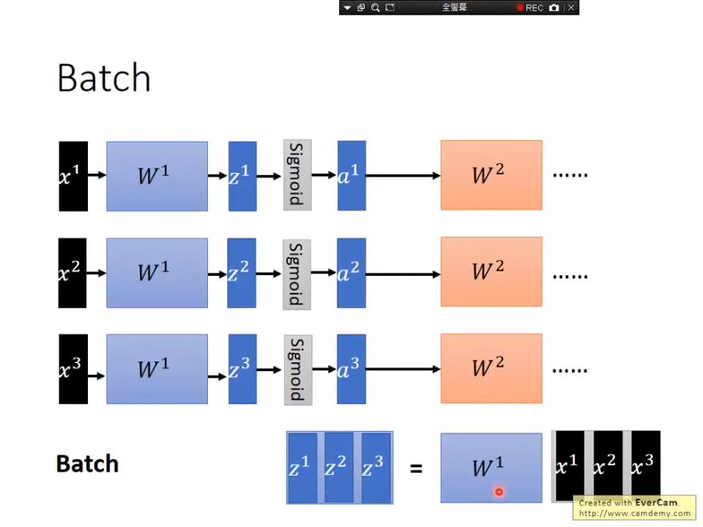

### BN

Batch normalization可以实作在activation function的input或output，但论文较多是作在input，也就是在计算出z之后就先经过BN再执行activation function，这么做的好处在于可以确保不会让值域落在微分值较小的地方， 以为Sigmoid例，如果值域落在两端极值，那微分值太小，不好收敛。

注意到一点，在实作BN的时候我们希望$\mu$ $\sigma$所代表的是全体资料集的随机性，但是计算整个资料集的随机性是非常耗费时间的一件事，而且权重的数值会不断改变，不可能每一次迭代之后就重新再计算整个资料集，因此在实作BN的时候我们只会以计算该Batch， 这代表所使用的Batch Size必须要够大，这样子才有办法从Batch去估测整个资料集。batch size 很小，比如说等于 1 时，求不了均值和方差，没有意义。
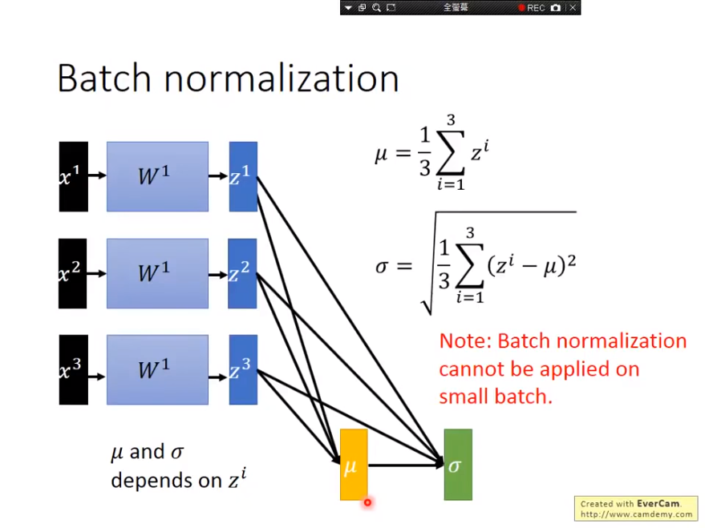

把输入 samples 的各个维度都调整成均值为 0，方差为 1的分布，有时可能不好解决问题，此时可以做一点改变（学到一个新的均值β，新的方差γ）。如下图右上角的公式所示。注意： **γ  和 β 的值通过学习得到**，也就是根据模型和数据的情况调整。 γ  初始设为全 1 向量， β  初始设为全 0 向量。
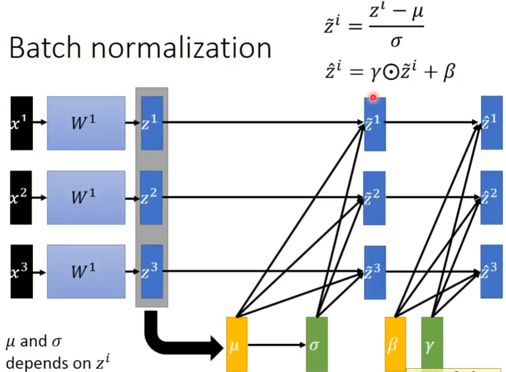

m个样本，每个样本n个特征，就是一个m*n的矩阵，BN就是对每一列（共n个列）分别求均值和方差  
每个像素点（通道数为100）作为一个样本，相当于它是一个具有100维特征的样本  
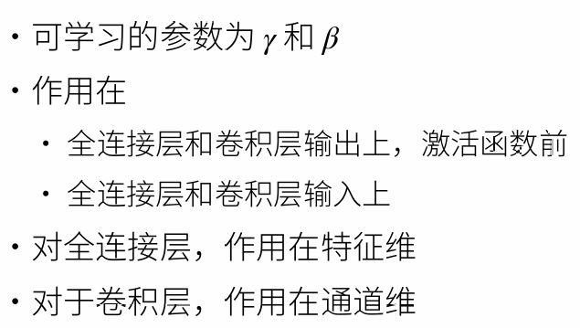

### 如何测试

但在测试过程中的一个问题在于，训练过程可能是Batch，但测试的时候却可能是一笔资料，只有一笔资料是估不出$\mu$ $\sigma$，怎么办？

* 一种作法是在训练结束之后，参数已经确定不再变动更新，这时候估算整个资料集的$\mu$ $\sigma$，但如果资料集过大或是online training，数据根本没有留存的情况下是无法这么执行的。  
* 另一种作法是将过程中的$\mu$ $\sigma$计算平均，但训练过程中的参数不断变化，得到的$\mu$ $\sigma$也差异过大，因此较能执行的作法是让训练结束前的区间有较大的权重，初始训练过程中的区间给予较小的权重， 如RMSProp
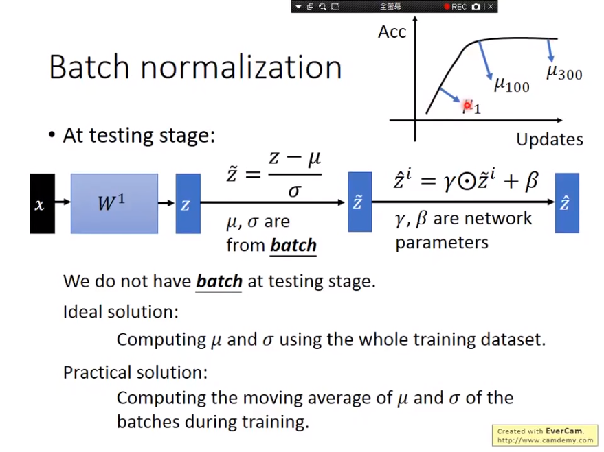

## 代码实现

```python
import torch
from torch import nn
from d2l import torch as d2l

# 对哪一个纬度求均值，对应的那个纬度就会变成1，dim=0 表示求完均值之后会生成一个（1*列数）的向量，所以也就是给每一列求均值
# mean = X.mean(dim=0)
# dim＝(0,2,3)，输出1*n*1*1的特征矩阵，通道的维度是保留着的
# dim等于哪一维，就相当于把那一维揉成一坨

def batch_norm(X, gamma, beta, moving_mean, moving_var, eps, momentum):
    """
    X: 这一层的输入
    gamma, beta: 可以学习到的参数
    moving_mean, moving_var: 全局的均值和方差，在做推理的时候用到
    eps: 为了避免除0
    momentum: 更新moving_mean, moving_var，一般取0.8，0.9
    """
    
    # 通过is_grad_enabled来判断当前模式是训练模式还是预测模式
    if not torch.is_grad_enabled():
        # 如果是在预测模式下，直接使用传入的移动平均所得的均值和方差
        X_hat = (X - moving_mean) / torch.sqrt(moving_var + eps)
    else:
        assert len(X.shape) in (2, 4)
        if len(X.shape) == 2:
            # 使用全连接层的情况，计算特征维上的均值和方差
            
            var = ((X - mean) ** 2).mean(dim=0)
        else:
            # 使用二维卷积层的情况，计算通道维上（axis=1）的均值和方差。
            # 这里我们需要保持X的形状以便后面可以做广播运算
            mean = X.mean(dim=(0, 2, 3), keepdim=True)
            var = ((X - mean) ** 2).mean(dim=(0, 2, 3), keepdim=True)
        # 训练模式下，用当前的均值和方差做标准化
        X_hat = (X - mean) / torch.sqrt(var + eps)
        # 更新移动平均的均值和方差
        moving_mean = momentum * moving_mean + (1.0 - momentum) * mean
        moving_var = momentum * moving_var + (1.0 - momentum) * var
    Y = gamma * X_hat + beta  # 缩放和移位
    return Y, moving_mean.data, moving_var.data

class BatchNorm(nn.Module):
    # num_features：完全连接层的输出数量或卷积层的输出通道数。
    # num_dims：2表示完全连接层，4表示卷积层
    def __init__(self, num_features, num_dims):
        super().__init__()
        if num_dims == 2:
            shape = (1, num_features)
        else:
            shape = (1, num_features, 1, 1)
        # 参与求梯度和迭代的拉伸和偏移参数，分别初始化成1和0
        self.gamma = nn.Parameter(torch.ones(shape))
        self.beta = nn.Parameter(torch.zeros(shape))
        # 非模型参数的变量初始化为0和1
        self.moving_mean = torch.zeros(shape)
        self.moving_var = torch.ones(shape)

    def forward(self, X):
        # 如果X不在内存上，将moving_mean和moving_var
        # 复制到X所在显存上
        if self.moving_mean.device != X.device:
            self.moving_mean = self.moving_mean.to(X.device)
            self.moving_var = self.moving_var.to(X.device)
        # 保存更新过的moving_mean和moving_var
        Y, self.moving_mean, self.moving_var = batch_norm(
            X, self.gamma, self.beta, self.moving_mean,
            self.moving_var, eps=1e-5, momentum=0.9)
        return Y
```

## 优点

* 解決Internal Covariate Shift的問題，从此不再只能设非常小的值lr
* 有效解決geadient 消失/爆炸，确保Output都在0的附近（斜率较大的地方）
* 模型受权重初始化的影响较小，当权重乘上k倍，$\mu$ $\sigma$也都有k倍的影响，分子分母皆有k倍影响就代表什么没有影响。
* 有人说，BN可以减少overfitting的问题（如果数据有偏移，可以把他normalization回来），有正规化的效果。
  
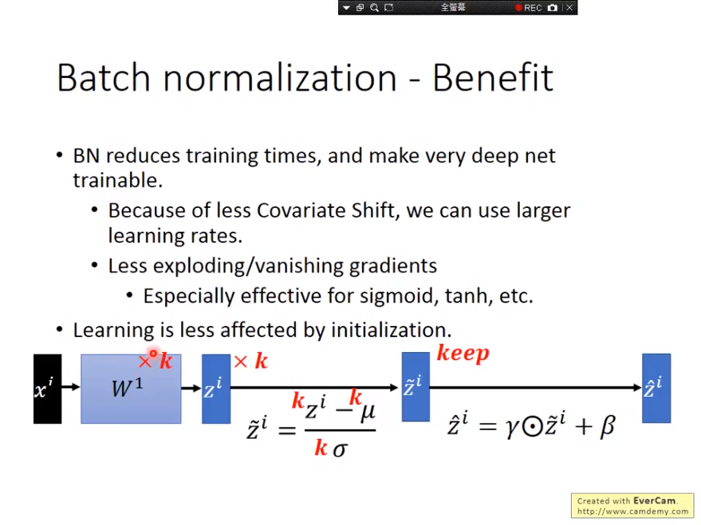

对随机的小偏量内部添加噪音，确保学习的健壮性
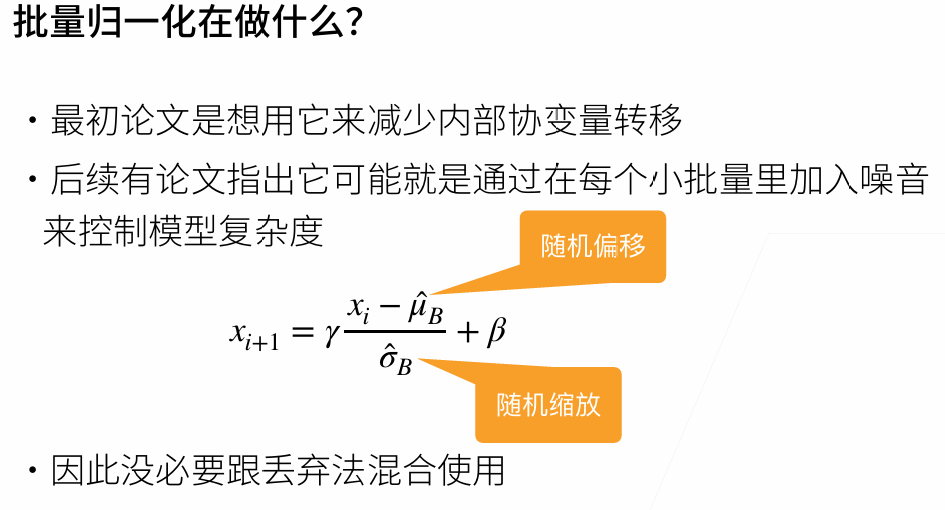

## 总结

* 一般用在较深的网络中
* 批量归一化固定小批量中的均值和方差，然 后学习出适合的偏移和缩放
* 可以加速收敛速度（学习率可以调大），但一般不改变模型精度
