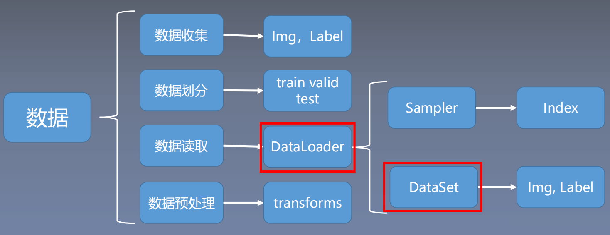
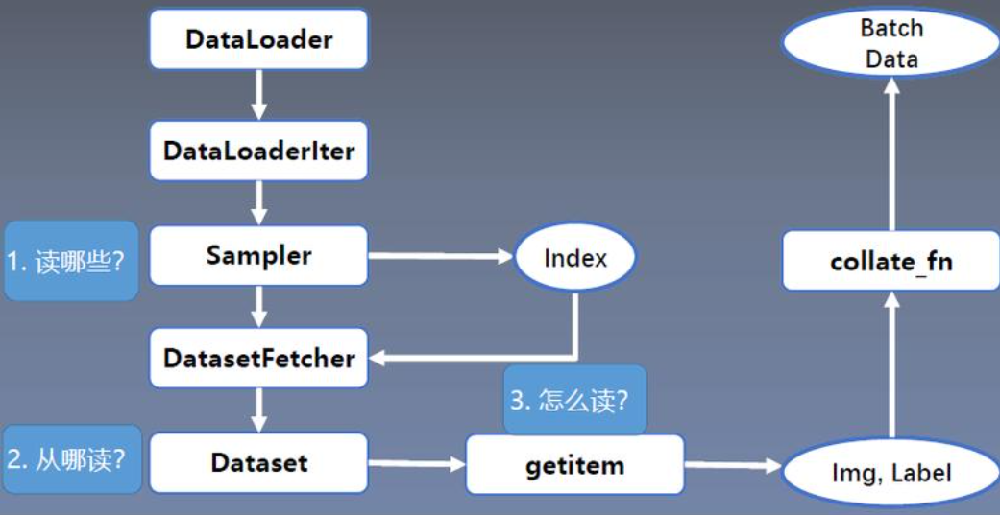

# DataLoader Dataset

在学习孪生神经网络的时候需要对通用数据集进行处理变成`(img1_path, img2_path, label)`格式，不太了解DataLoader Dataset内部是如何处理数据的，因此进行学习

## 读取机制



数据读取主要包含以下 3 个方面：

* **读取哪些数据**：每个 Iteration 读取一个 Batchsize 大小的数据，每个Iteration 应该读取哪些数据。
* **从哪里读取数据**：如何找到硬盘中的数据，应该在哪里设置文件路径参数
* **如何读取数据**：不同的文件需要使用不同的读取方法和库。
  


DataLoader的用于构建数据装载器， 根据batch_size的大小， 将数据样本分成若干batch去训练模型，而数据分配的过程需要读取数据，这个过程就是借助Dataset的**getitem**方法实现的。

使用Pytorch读取数据，首先应该新建一个类MyDataset，这个类要继承Dataset类并且实现里面的__getitem__方法，该方法用于定义如何接收一个索引idx（示例的SiameseFaceDataset类是动态样本生成，所以没有使用index）， 返回一个样本对应的data和label。 此外还需要实现__len__，该方法用于计算样本数据，__len__返回总的样本的个数。

## Dataset：数据存储与单样本访问

* ​Dataset：数据存储与单样本访问
* 作用：负责存储数据样本及其标签，并提供按索引访问的接口。  
  
**​核心方法：**

* `__init__`:初始化函数。在初始化过程中，应该输入数据目录信息和其他允许访问的信息。例如从csv文件加载数据，也可以使用加载文件名列表，其中每个文件名代表一个数据。**注意：在该过程中还未加载数据**。
* `__getitem__(self, index)`：根据索引返回**单个样本**（如张量、图像、文本等）。
* `__len__(self)`：返回数据集的总大小。PyTorch的DataLoader会根据`__len__`的返回值决定每个epoch的迭代次数
* 数据增强：transform通常在`__getitem__`中应用，确保多进程下每个样本的增强是独立的。

**Epoch、Iteration、Batchsize之间的关系:**

1. 所有的样本数据都输入到模型中，称为一个epoch
2. 一个Batch的样本输入到模型中，称为一个Iteration
3. 一个批次的大小，一个Epoch=Batchsize*Iteration

下面的SiameseFaceDataset类，实现了动态样本生成。  
`__getitem__`中每次请求dataset[i]时：随机选择正/负样本类型（50%概率）根据选择类型实时生成新样本对  
静态预生成需要在`__init__`中生成所有样本对

```python
class SiameseFaceDataset(Dataset):
    def __init__(self, data_root, num_pairs_per_epoch=10000):
        self.data_root = data_root
        self.num_pairs = num_pairs_per_epoch
        
        # 收集所有类别和图像路径
        self.classes = sorted([d for d in os.listdir(data_root) 
                             if os.path.isdir(os.path.join(data_root, d))])
        self.class_to_images = {}
        for cls in self.classes:
            cls_path = os.path.join(data_root, cls)
            self.class_to_images[cls] = [
                os.path.join(cls_path, img) 
                for img in os.listdir(cls_path) 
                if img.endswith('.pgm')
            ]
            
        # 数据预处理
        self.transform = transforms.Compose([
            transforms.Grayscale(),
            transforms.Resize((96, 96)),  # 统一图像尺寸
            transforms.ToTensor(),
            transforms.Normalize(mean=[0.5], std=[0.5])
        ])
    
    # 返回每个epoch生成的样本数量
    def __len__(self): 
        return self.num_pairs
    
    # 随机生成样本对
    def __getitem__(self, index):
        # 50%概率生成正样本对，50%生成负样本对
        if random.random() < 0.5:
            return self._create_positive_pair()
        else:
            return self._create_negative_pair()
    
    def _create_positive_pair(self):
        # 随机选择一个类别
        cls = random.choice(self.classes)
        # 随机选择该类别中的两张不同图片
        img_path1, img_path2 = random.sample(self.class_to_images[cls], 2)
        
        # 加载并预处理图像
        img1 = self.transform(Image.open(img_path1))
        img2 = self.transform(Image.open(img_path2))
        
        return img1, img2, torch.tensor(0.0, dtype=torch.float32)
    
    def _create_negative_pair(self):
        # 随机选择两个不同的类别
        cls1, cls2 = random.sample(self.classes, 2)
        # 从每个类别中各选一张图片
        img_path1 = random.choice(self.class_to_images[cls1])
        img_path2 = random.choice(self.class_to_images[cls2])
        
        # 加载并预处理图像
        img1 = self.transform(Image.open(img_path1))
        img2 = self.transform(Image.open(img_path2))
        
        return img1, img2, torch.tensor(1.0, dtype=torch.float32)
```

## DataLoader

**DataLoader：批量加载与多进程管理**

* **作用**：从`Dataset`中按批次加载数据，支持多进程、打乱顺序等功能。
* **关键参数**：
  * `batch_size`：每批的样本数。
  * `shuffle`：是否打乱数据顺序（通过`Sampler`实现）。
  * `num_workers`：子进程数，用于并行加载数据。
  * `collate_fn`：将多个样本合并为批次（默认处理张量拼接）。
  * `pin_memory`：将数据复制到锁页内存，加速GPU传输。
  * `drop_last`：是否丢弃最后一个样本数量不足batch_size批次数据

---

## **底层原理与流程**

### **数据加载流程**

1. **索引分配**：
   * `Sampler`生成批次索引（如`RandomSampler`打乱顺序，`SequentialSampler`顺序采样）。
   * 每个Worker进程通过索引从`Dataset`中获取数据。
  
2. **多进程协作**：
   * **Worker进程**：每个Worker预加载多个批次到队列，避免主进程等待。
   * **主进程**：从队列中取数据，进行训练。
   * **进程安全**：每个Worker复制`Dataset`实例，需确保文件读取等操作是线程/进程安全的（如为每个Worker设置不同随机种子）。

### **collate_fn的作用**

* 默认行为：将样本张量按第0维度拼接（如`[batch_size, ...]`）。
* 自定义场景：处理变长序列时，需自定义填充逻辑：

  ```python
  def collate_fn(batch):
      # 假设每个样本是(x, y)，x是变长序列
      xs = [item[0] for item in batch]
      ys = [item[1] for item in batch]
      padded_xs = pad_sequence(xs, batch_first=True)
      return padded_xs, torch.tensor(ys)
  ```

---

## **多进程数据加载细节**

* **Worker初始化**：每个Worker进程会复制`Dataset`对象，独立初始化（如打开不同的文件句柄）。
* **避免冲突**：PyTorch自动为每个Worker设置不同的随机种子（通过`base_seed + worker_id`），确保数据增强的随机性。
* **队列机制**：使用`multiprocessing.Queue`或共享内存传递数据，减少主进程阻塞。

---

## **内存管理与大数据集**

* **按需加载**：在`__getitem__`中从磁盘读取数据（如使用`Image.open()`），避免一次性加载到内存。
* **高效读取**：结合`num_workers`并行加载，减少I/O瓶颈。

---

## 参考

[Pytorch：数据读取机制（DataLoader与Dataset）](https://blog.csdn.net/weixin_47255403/article/details/134775561?ops_request_misc=&request_id=&biz_id=102&utm_term=dataloder%20dataset&utm_medium=distribute.pc_search_result.none-task-blog-2~all~sobaiduweb~default-0-134775561.142^v102^control&spm=1018.2226.3001.4187)
