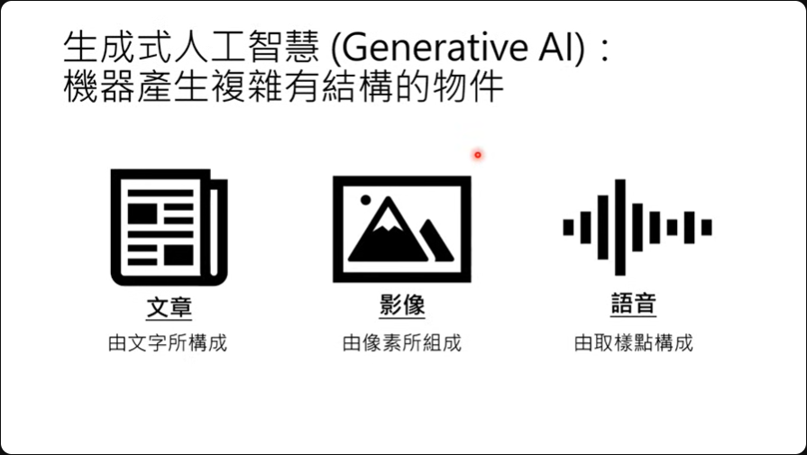
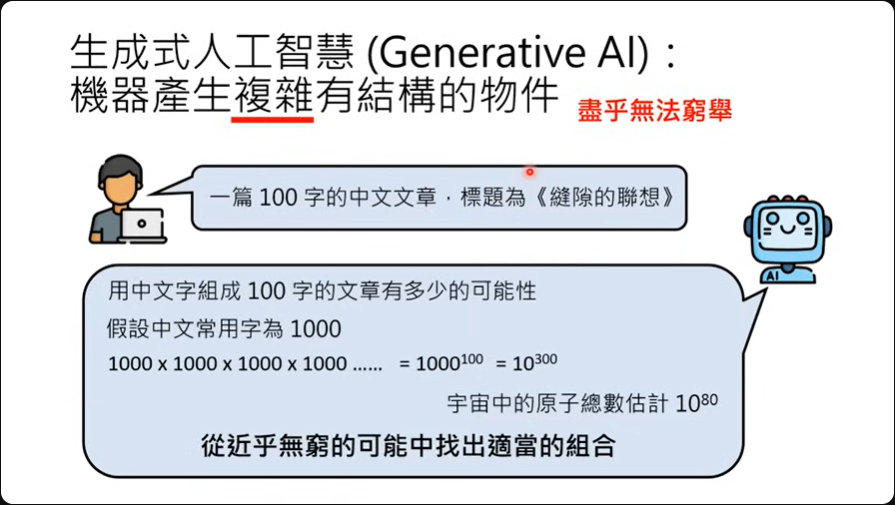
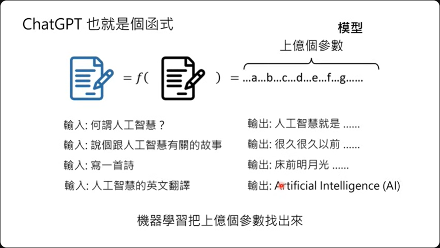
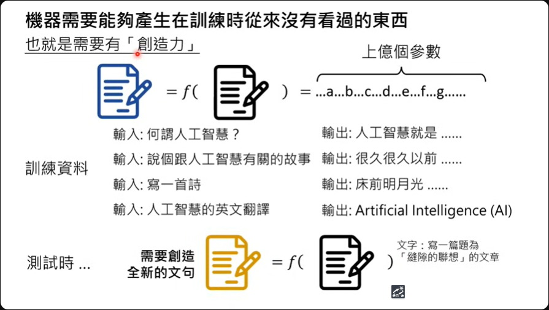
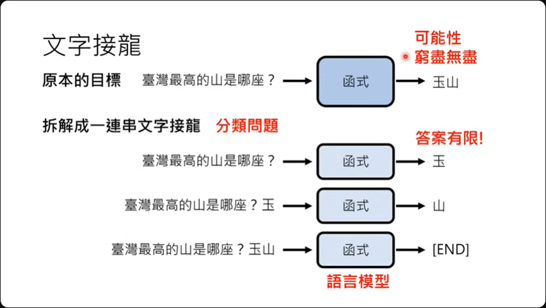
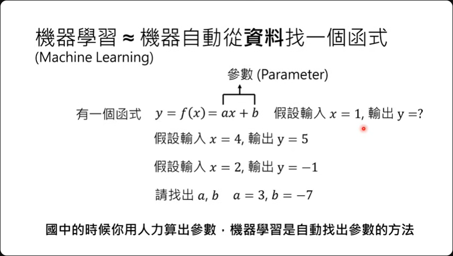
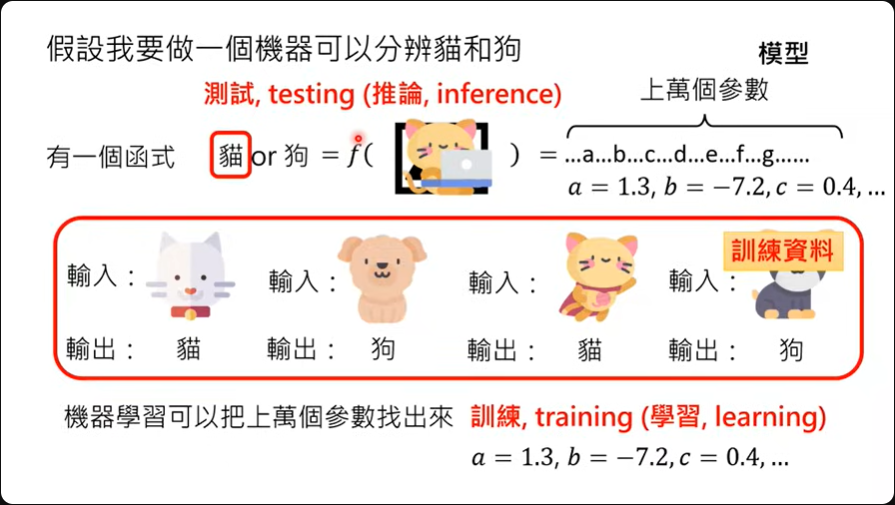
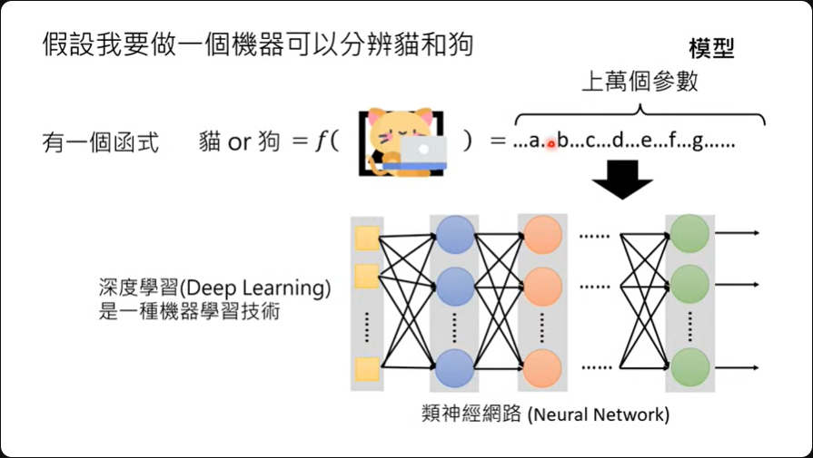
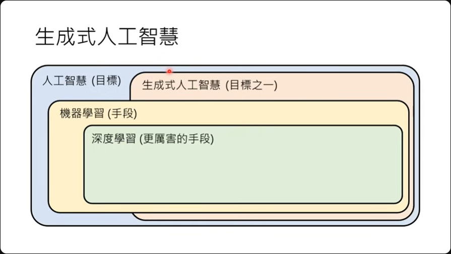
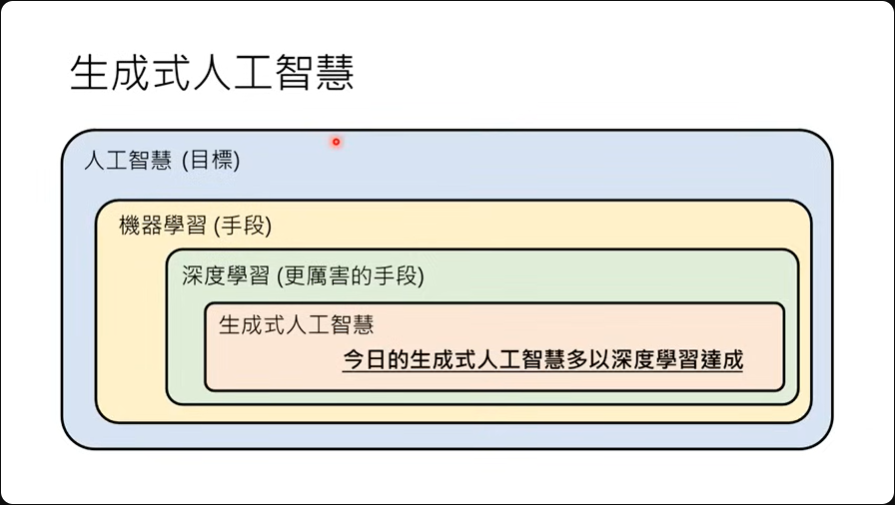

# 第1讲：生成式AI是什么？

## Generative AI

生成式人工智能（Generative AI）是一种让机器产生**复杂而有结构**的对象。文章由文字组成，影像由像素组成，语音则是由取样点所组成。

至于这个'复杂'所指的，就是尽乎无法穷举。 举例来说，我们希望机器产生一个100个字的中文文章。

这对机器来说，整个文字的排列组合有太多了，如果我们的常用中文字设置为1000，那这整个排列组合就是把1000连乘100次，也就是$1000^100$，也就是$10^300$。

这样我们就知道，机器必需从一个几近无穷的可能中去找出一个适当的组合来表述一篇文章。

如果是垃圾邮件侦测或是猫狗分类的这种事情就不属于生成式人工智能。 这是一种**分类classification**，只是单纯的从有限的选项中做出一个选择。

也就是说，**从有限的选项中做出选择就不属于生成式人工智能**。

生成式人工智能是人工智能的**众多目标之一**，可以让机器产生复杂而有结构的对象。

事实上我们也可以把ChatGPT想象成是一个函数，给定一个输出，然后函数再给我们输出，只是这个函数可能有上亿个参数，才有办法有问必答的这么厉害。

::: tip 重点理解：
**机器需要能够产生在训练时从来没有看过的东西**
:::

ChatGPT的核心精神就是文字接龙，大概的原理如上投影片所说明：

1. 它主要会去预测『台湾最高的山是那座？』后面应该接那一个字，然后函式给出'玉'
2. 接着预测'台湾最高的山是那座？ 玉'后面接那一个字，然后函式给出'山'
3. 在得到'台湾最高的山是那座？ 玉山'之后也许机器觉得没什么好说了，那就给出'END'
这种能做出文字接龙的函数又称为语言模型。 **这种文字接龙的好处在于给出的答案不再是无穷无尽，而是有限答案，那就变成是一种分类问题。**

## 机器学习

让机器自己从资料里面找出一个方程，有个函式是$y=f(x)=ax+b$，给出x、y然后要求计算出a、b。 其中a、b这两个未知数在机器学习中就是参数。

如果要做一个分辨猫、狗的机器，那需要的参数就可能是成千上万，这个带有成千上万的函式就是课程中会提到的模型。

接下来只要给定机器输入跟输出之间的关系，机器就可以透过学习把这成千上万的参数找出来，这个过程又称为训练（training）。

所以当课程中提到机器学习的时候就是把这成千上万参数找出来的过程。 给定的资料称为训练数据。 找出参数之后带入新的照片看输出会是什么的这个行为就称为测试（testing），或称为推论（inference）。

这个成千上万参数的函数通常会被以类神经网络来表示，解这个参数的技术就是深度学习，这是一种机器学习的技术。

