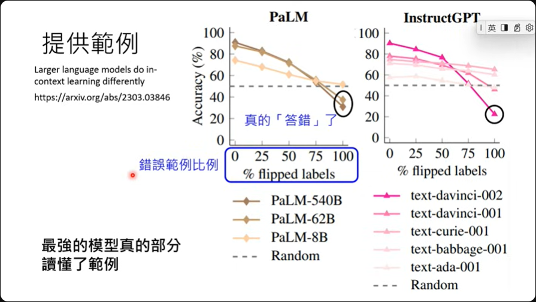

# 第3讲：训练不了人工智能？ 你可以训练你自己

[[toc]]

## 神奇咒语

### Chain of Thought（CoT）

Let's think step by step. 不过要注意，这是用在GPT-3.5之前的模型上的研究。

### 请模型解释一下自己的答案

论文中提到，如果让模型自己解释一下自己的批改逻辑，那是可以有效提高模型的正确性，解释过后的评分结果跟人类老师的评分结果是相接近的。

### 对模型情绪勒索

传说只要跟模型说，**这对我的人生很重要**，竟然就可以有效提高模型的能力。 而且论文作者做了很完整的测试，针对六个模型下去测试。

### 其他

[Large Language Models Understand and Can be Enhanced by Emotional Stimuli](https://arxiv.org/abs/2307.11760)

[Principled Instructions Are All You Need for Questioning LLaMA-1/2, GPT-3.5/4](https://arxiv.org/abs/2312.16171)

1. 对模型有礼貌是没有用的
2. 要跟模型说'要做什么'，不要跟模型说'不要做什么'
3. 跟机器说'做的好给小费'，这是有用的
4. 跟机器说'做不好要处罚'，这是有用的
5. 跟机器说'要保证答案是没有偏见的，而且不能有刻板印象'，这是有用的

### 用AI來找神奇咒語

1. 想法上，也许可以用强化学习的方式训练一个模型专门找出能提升模型回应的神奇咒语。
   

2. 也可以直接叫语言模型告诉我们要怎么样问问题比较好。

3. 神奇咒語並不一定對所有模型都有用  
   神奇咒语过去也许有效，但现在新的模型上就不见得有效了，因为现在的模型效能都普遍提升。
   

## 提供更多信息

### 把前提将清楚

有时候模型没有正确的回应是因为没有把事情说清楚，以NTU为例，这既是新加坡南洋理工大学，也是台湾大学。

所以如果直接问模型，那有很大的机率得到的回应就是南洋理工大学。

但这时候如果跟模型说，你是台湾人，那得到的回应就会是台湾大学了。

### 提供生成式AI原本不清楚的信息

假设我们问模型关于GPT的一些信息，那因为**旧的模型**可能没有说明的很清楚，所以它也没有相关数据。

这时候我们可以直接提供模型资料，喂给它论文的PDF也行，叫它自己读，读完它就会自己整理好资料提供。

### 提供例子

假设我们想做情感分析，有可能模型不懂什么是情感分析，这时候可以给它一些范例，让它知道什么是情感分析。 这种给定范例作法称为In-context learning。

**虽然这边的术语中有learning，但并不代表模型真的有被训练，没有参数被改变。**

**BBBBBBBut!  
怎么知道模型是不是真的懂范例？**

很简单，故意把正面改负面，负面改正面，**理论上机器懂的情况下那它的回应就会是对应的改变。**

[模型没有真的看懂范例 22年](https://arxiv.org/abs/2202.12837)  
[愈强的模型就愈能读懂范例 23年](https://arxiv.org/abs/2303.03846)

GPT4:  

故意在政治跟财经的部份给出错误的类别范例，然后问模型问题，根据范例这应该是政治才对，但模型仍然是给出财经  

不过如果在提示词中特别说明，**这些类别的定义可能跟一般的定义不同的时候**，这时候模型的响应就会根据所提供的范例来归类了。

### [Gemini 1.5](https://storage.googleapis.com/deepmind-media/gemini/gemini_v1_5_report.pdf) 情境学习

根据google的说法，gemini有着非常强的in-context learning的能力。 实测一个名为Kalamang语言，目前可能仅200人懂的一个语言，在利用in-context learning，**给定一本文法书跟字典**，然后搭配指令之后询问模型问题，很神奇的，这时候模型可以翻译Kalamang了。

但是之后再问大模型同样的问题，大模型可以再次成功翻译吗？

**不可以！！！！因为没有参数被训练**

## 拆解問題與使用工具
