# 数学

## 高等数学

#### 什么是极限

在函数中，当自变量趋近于某个特定值时，函数的取值可能会逼近某个确定的数值，这个确定的数值就被称为函数的极限。

**定义**：给定一个函数$f(x)$，当自变量$x$趋近于某个特定值$x_0$时，如果函数的取值$f(x)$随着$x$的趋近逼近一个确定的数$A$，那么我们称$A$是函数$f(x)$在$x$趋近于$x_0$时的极限。

>  计算复杂度时用到了极限

#### 罗尔中值定理

 如果一个函数在闭区间上连续，在开区间内可导，并且在区间的两个端点处取相同的值，那么在这个区间内，必然存在至少一个导数为零的点。

**定义**：设函数f(x)满足以下条件：

1. 在闭区间[a, b]上连续
2. 在开区间(a, b)内可导
3. f(a) = f(b)

则在(a, b)内至少存在一点ξ，使得f'(ξ) = 0。

> 在优化算法中，罗尔定理保证在极值点导数为零，这是梯度下降等算法的基础

#### 拉格朗日中值定理

如果一个函数在闭区间上连续，在开区间内可导，则至少存在一个点，**该点的导数等于函数在区间端点的斜率**。

**定义**：设函数f(x)满足：

1. 在闭区间[a, b]上连续
2. 在开区间(a, b)内可导

则在(a, b)内至少存在一点ξ，使得：f'(ξ) = [f(b) - f(a)] / (b - a)

#### 柯西中值定理

对于函数f(x)和g(x)，如果它们在闭区间[a, b]上连续，并且在开区间(a, b)内可导，那么存在一个点c∈(a, b)使得：

​    [f(b) - f(a)]/[g(b) - g(a)] = f'(c)/g'(c)

​    存在一个点c，使得函数f(x)和 g(x)在区间[a, b]上的平均变化率等于它们在点c处的瞬时变化率的比值。

> 拉格朗日：如果你一小时跑了5km，你的平均速度就是5km/h。那么在这一小时以内，要么一直保持5km/h，要么一部分比这个速度快，一部分比这个速度慢。在快慢转换的点，你的速度就是5km/h。
>
>  柯西：我一小时跑了5km，你一小时跑了20km。要么你的速度一直是我的20/5=4倍，要么你一部分比我四倍还快，一部分比我四倍慢，在这转换的这一点，你的速度是我的四倍

### 三个中值定理的区别、联系和应用

  罗尔中值定理适用于闭区间内连续的函数。当函数在闭区间的端点上取相同的值时，罗尔中值定理保证函数在开区间内至少有一个导数为零的点。

​    拉格朗日中值定理适用于闭区间内连续且可导的函数。它*是罗尔中值定理的推广*，保证函数在开区间内至少有一个导数等于平均变化率的点。拉格朗日中值定理应用：在某个时间点，质点的瞬时速度等于它在某个时间段内的平均速度。相当于把罗尔中值定理的坐标系旋转一下，转到了斜率为[f(b) - f(a)] / (b - a)的地方。

​    柯西中值定理适用于两个函数在闭区间内连续且可导。它*是拉格朗日中值定理的推广*，表示两个函数在开区间内的平均变化率等于它们在开区间内某个点的瞬时变化率的比值。假如柯西中值定理的分母是f(x)=x，则就相当于拉格朗日中值定理。

### 泰勒公式

泰勒公式简单来讲就是用**一个多项式函数去逼近一个给定的函数**(即尽量使多项式函数图像拟合给定的函数图像)，注意，逼近的时候一定是**从函数图像上的某个点展开**。如果一个非常复杂函数，想求其某点的值，直接求无法实现，这时候可以使用泰勒公式去近似的求该值，这是泰勒公式的应用之一。泰勒公式在机器学习中主要应用于梯度迭代。

​    泰勒公式可用于将一个函数在某个点附近展开成无穷级数的形式。

​    泰勒公式的一般形式如下：

​    f(x) = f(a) + f'(a)(x - a)/1! + f''(a)(x - a)²/2! + f'''(a)(x - a)³/3! + ...

​    f(x) 是要近似的函数，a 是展开点。

### 泰勒展开中皮亚诺余项和拉格朗日余项的区别

皮亚诺余项**描述了余项的阶数**；而拉格朗日余项**给出了余项的具体表达式**。在计算机科学中，皮亚诺余项常用于算法复杂度分析，而拉格朗日余项在数值计算误差分析中更为有用。

|    特性    |    皮亚诺余项    |       拉格朗日余项        |
| :--------: | :--------------: | :-----------------------: |
|   表达式   |    o((x-a)ⁿ)     | f⁽ⁿ⁺¹⁾(ξ)/(n+1)!·(x-a)ⁿ⁺¹ |
|    精度    | 定性描述余项阶数 |    定量给出余项表达式     |
| 光滑性要求 |     n阶可导      |         n+1阶可导         |
|  适用场景  |   局部近似分析   |       全局误差估计        |
|  使用频率  |   理论分析常用   |       实际计算常用        |

### 一阶导和二阶导的物理意义和几何意义是什么

​    一阶导数表示函数的变化率或切线的斜率，二阶导数表示一阶导数的变化率。

​    在物理上，一阶导数可以表示**速度**，二阶导数可以表示**加速度**。

​    在几何上，一阶导数可以表示**切线斜率**，二阶导数可以表示**曲线的凸性和凹性**。

### 一元函数和多元函数可导、可微、连续和可积的关系

[**一元函数**](./连续可导可微可积.md)：可导和可微等价。可导一定连续，连续不一定可导（y=|x|，在x=0处不可导）。

**多元函数**：可微一定可导，可微一定连续，偏导连续一定可微，偏导存在不一定连续。

可偏导不能推出连续：偏导只能管住当前偏导方向的数（该点极限趋近于某个数），其他方向管不到

同理，可偏导推不出可微：可微是全增量，跟一领域内的点上函数值都是有关系的，但是偏导只能（例如二元函数，偏导只跟两个方向上那两条线有关，决定不了其他临近点的变化趋势）。一元函数可以是因为X方向导数可以决定领域内所有函数

函数可微性：在某点附近局部很平（无论怎么放大放大再放大都不“尖”），光滑===>附近的坡度多大方向导数就多大，光滑说明所有方向上导数存在，但是多元偏导只能保证多个方向上（几元几个方向）的光滑。

例如下图原点，x、y、z三个方向均可导，有方向导数：

### [方向导数和梯度](./梯度.md)

**方向导数**是一个标量。方向导数可以理解为函数**在某个点的某个方向上的变化速率**。

**梯度**是一个**向量**。它包含了函数在**每个方向上变化最快的信息**。对于一个多变量函数 f(x, y, z)，其梯度定义为：
$$
∇f = (∂f/∂x, ∂f/∂y, ∂f/∂z)
$$
   梯度的方向是函数在某一点上**变化最快**的方向，而**梯度的模长表示了函数在该点上的变化速率**（或**最大方向导数**）。

**梯度的几何意义**：函数变化增加最快的地方。沿着梯度向量的方向，更容易找到函数的最大值。反过来说，沿着梯度向量相反的方向，更容易找到函数的最小值。

梯度的应用：势场：在物理场的描述中，梯度常常用来表示场的强度和方向。例如，在电场中，梯度表示电势场的变化率。

**最速下降法**：梯度在优化问题中发挥重要作用。它利用梯度的负方向来搜索函数的最小值。根据最速下降法，沿着梯度的负方向进行迭代更新可以逐步接近函数的最小值。

**方向导数和梯度的关系**：如果我们知道了函数在某一点的梯度向量，以及一个表示方向的单位向量，就可以计算出函数在这个方向上的方向导数。

   方向导数=某点的梯度与给定方向的方向余弦做内积（点乘）。

* 导数 对应一元(单变量)函数，表示一元函数在该点的变化率.
* 偏导数 对应多元(多变量)函数，表示多元函数在该点沿坐标轴方向的变化率.
* 方向导数 是偏导数概念的推广，表示多元函数在该点沿某一方向的变化率.
* 梯度 是特殊的方向导数，表示多元函数在该点沿该方向变化率最大(该方向为梯度的方向，变化率为梯度的模长

### 傅里叶级数和傅里叶变换 

迪利克雷条件:

1. 函数在一个周期内不能无限震荡或无限高
2. 不能有无限多个断点
3. 函数在一个周期内的面积（绝对值的积分）必须是有限的

傅里叶级数：任何**周期性函数**若满足狄利克雷条件，那么该函数可以**用正弦函数和余弦函数构成的无穷级数来表示**。

傅里叶变换：可以处理**非周期性信号**（一个信号可以看成一个周期性无穷大T->∞的信号）。傅里叶变换将一个信号从时域转换到频域，得到该信号的频谱。

应用：通过傅里叶变换，我们可以对信号进行滤波、降噪、压缩、频谱估计等操作。这些技术在音频处理、图像处理、视频压缩、通信系统等领域都有广泛应用。

* 

## 线性代数

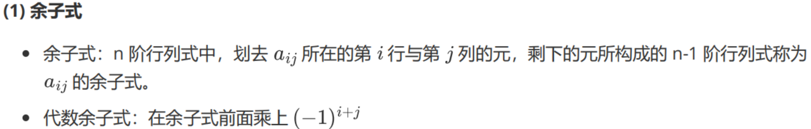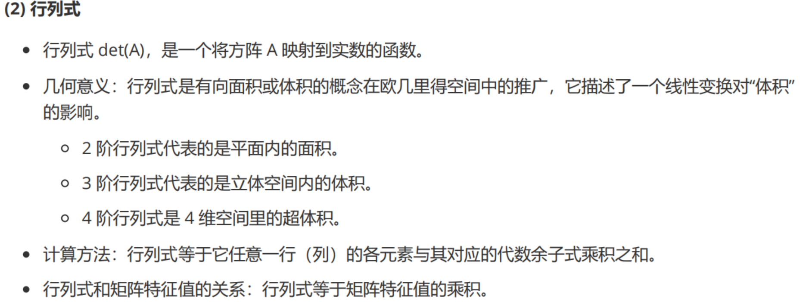

### 什么是矩阵的秩？★★★

   k 阶子式：在一个矩阵或行列式中取k行k列，交叉处的k²个元素按原顺序构成的行列式。

- 从子式的角度定义：矩阵的秩就是矩阵中**非零子式的最高阶数**。（行列式表示线性变换后面积变化的比例，因此当行列式为0时即代表面积变为0，此时必然出现三维变成二维、一维（体积变成一个面，一条线等等））

- 从极大线性无关组的角度定义：矩阵的所有行向量中极大线性无关组的元素个数。

- 从标准型的角度定义：求一个矩阵的秩，可以先将其化为行阶梯型，非零行的个数即为矩阵的秩。

- 满秩：一个秩为 n 的矩阵满秩意味着存在一个 n 阶子式不为 0。

  不满秩：假设其秩为 r，意味着存在一个 r 阶子式不为 0 ，其所有阶数大于 r 的子式都为 0

### 什么是线性相关和线性无关？★★★

 线性相关（Linear Dependence）

对于向量组 $\alpha_{1}, \alpha_{2}, \cdots, \alpha_{m}$，若存在**一组不全为零**的数 $k_{1}, k_{2}, \cdots, k_{m}$，使得：

$$
k_{1}\alpha_{1} + k_{2}\alpha_{2} + \cdots + k_{m}\alpha_{m} = \mathbf{0}
$$

成立，则称该向量组是**线性相关**的。

$\alpha_1 = \begin{bmatrix}1\\2\end{bmatrix}, \alpha_2 = \begin{bmatrix}2\\4\end{bmatrix}$  
∵ $2\alpha_1 - \alpha_2 = 0$（存在非零系数组合）

#### 线性无关（Linear Independence）

对于向量组 $\alpha_{1}, \alpha_{2}, \cdots, \alpha_{m}$，若**仅当** $k_{1} = k_{2} = \cdots = k_{m} = 0$ 时，才有：

$$
k_{1}\alpha_{1} + k_{2}\alpha_{2} + \cdots + k_{m}\alpha_{m} = \mathbf{0}
$$

成立，则称该向量组是**线性无关**的。

$\alpha_1 = \begin{bmatrix}1\\0\end{bmatrix}, \alpha_2 = \begin{bmatrix}0\\1\end{bmatrix}$  
∵ 仅当$k_1=k_2=0$时$k_1\alpha_1 + k_2\alpha_2=0$

| 性质         | 线性相关                         | 线性无关                             |
| ------------ | -------------------------------- | ------------------------------------ |
| **定义**     | 存在非全零系数使线性组合为零向量 | 仅当系数全零时线性组合为零向量       |
| **方程组**   | 齐次方程组有非零解               | 齐次方程组仅有零解                   |
| **矩阵秩**   | $r(A) < m$（向量个数）           | $r(A) = m$                           |
| **几何意义** | 至少一个向量可被其余向量表示     | 任意一个向量都不能被其余向量线性表示 |

### 一个矩阵线性无关的等价定义有什么？

   非奇异矩阵（行列式不为0）、矩阵可逆、矩阵满秩、特征值没有 0。

- 如果矩阵 *A*的列向量线性相关，意味着至少一个列向量可以表示为其他列向量的线性组合。此时 *A*会将某些非零向量 **x**映射到 **0**（即 *A***x**=**0**），因此 *A*不是单射，不可逆。
- 如果列向量线性无关，则 *A*是一个双射（一一且满射），因此可逆。

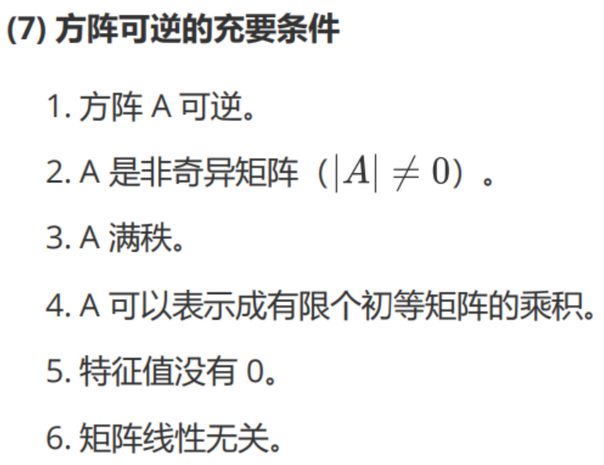

### 向量组的极大无关组和向量组的秩是什么。

   极大无关组是指在向量组中选择尽可能多的**线性无关向量，使得这个子集仍然保持线性无关**，并且再添加任何其他向量，就会使得它变得线性相关。

   向量组的秩等于它的极大无关组合中向量的个数。

### 向量空间（线性空间），向量空间的基与维数是什么。

向量空间：所有 n 维向量构成的集合称为 n 维向量空间。

基==>极大无关组
维数（区别于向量的维数）==>秩

基：在向量空间 V 中可以找到 n 个向量，这 n 个向量线性无关，并且线性空间 V 中的任意一个向量都和这 n 个向量线性相关，那么这 n 个向量就称作线性空间 V 的一个基。
维数：基中所含向量个数。

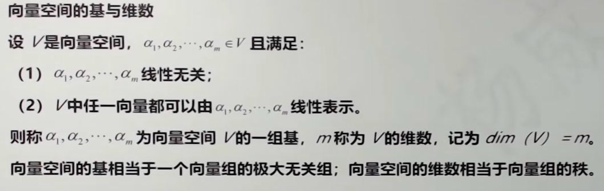

### 什么是矩阵的特征值与特征向量？特征值有什么应用？★★★★

#### 1. 特征值与特征向量

对于n阶方阵A，若存在：

- **非零向量** $\alpha \neq \mathbf{0}$
- **标量** $\lambda \in \mathbb{C}$

使得：
$$ A\alpha = \lambda\alpha $$
则称：

- $\lambda$ 为A的**特征值**
- $\alpha$ 为对应$\lambda$的**特征向量**

特征向量是那些经过特征变换后仍然在张成空间上自己原本处于的直线上，没有被旋转。**特征向量x在经过矩阵 A 的线性变换后，只会改变长度但不会改变方向，而特征值则表示该变换的缩放比例。**
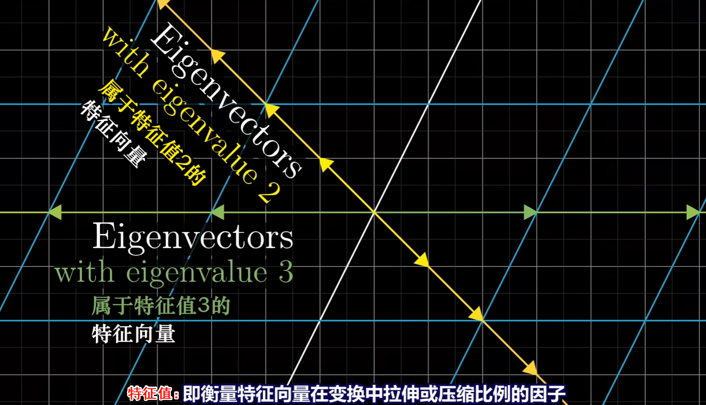

#### 2. 特征多项式

$$ f(\lambda) = \det(\lambda E - A) $$

- 是$\lambda$的n次多项式
- 根即为特征值

#### 3. 特征方程

$$ \det(\lambda E - A) = 0 $$

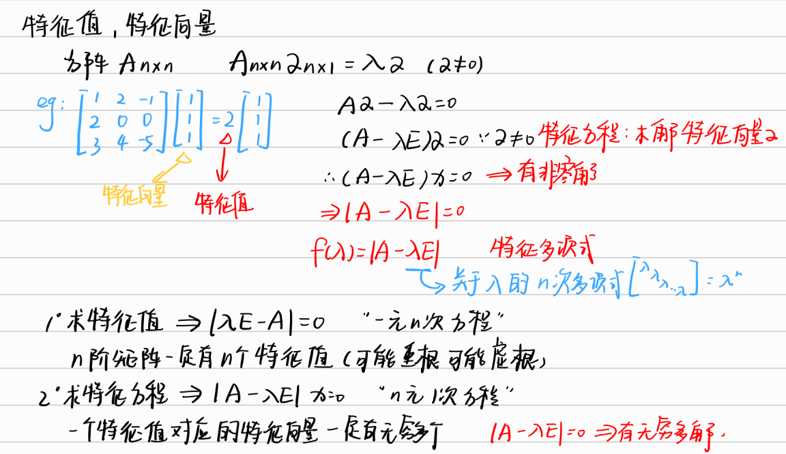

   性质：   所有特征值的积是该矩阵的行列式（行列式的本质是特征值的乘积），所有特征值的和是该矩阵的迹。

   应用：

1.    特征空间变换：特征向量可以用于将矩阵对角化，从而简化线性变换的描述。这在计算中能够提高效率。

2.    图像处理：特征值和特征向量可以用于图像压缩、降噪和特征提取等领域。例如，主成分分析（PCA）方法就利用了特征向量来提取图像中的关键特征。

3.    数据分析：特征值可以用于降维和数据拟合。例如，在主成分分析中，我们可以通过保留最大的特征值对应的特征向量进行数据降维，从而捕捉数据的主要变化趋势。

### 特征值为0和矩阵的秩的关系。★★

   如果 λ = 0，则有以下结论：  A的秩小于n

如果 A 的某个特征值为 0，那么 A 的秩必定小于 n。这是因为特征值为 0 表明 A 不是满秩矩阵，存在线性相关的列向量，导致 A 的秩小于 n。

       A的行向量和列向量中至少有一个线性相关
    
       如果 λ = 0，那么对应的特征向量 x 满足 Ax = 0。由于 x ≠ 0，说明存在一个非零的向量使得 A 与它的乘积为零。这意味着 A 的行向量和列向量中至少有一个线性相关。
    
       特征值为 0 并不意味着矩阵 A 的秩一定为 0。

### 什么是相似矩阵和相似对角化？★★

相似矩阵中的相似，指的是（不同基坐标下）相似的线性变换
总的来说，每当你看到这样一个表达式：**A逆乘以M乘以A**，这就暗示着一种数学上的转移作用
中间的矩阵代表一种你所见的变换
而外侧两个矩阵代表着转移作用，也就是视角上的转化
矩阵乘积仍然代表着同一个变换，只不过是从其他人的角度来看的

   相似矩阵定义：两个n×n的矩阵A和B称为相似矩阵，如果存在一个可逆矩阵P，使得B = P^(-1) AP。

   相似矩阵性质：

1.    相似矩阵具有相同的特征值、秩、行列式。

2.    相似矩阵的特征向量可以通过相似变换得到。

   相似对角化定义：

   相似对角化是指将一个矩阵A通过相似变换P^(-1) AP转化为对角矩阵D的过程。D 的对角线上的元素就是 A 的特征值，P 的列向量就是 A 的特征向量。

   并不是所有的矩阵都可以相似对角化。**一个矩阵可对角化的充要条件是它具有n个线性无关的特征向量**。

### 什么是对称矩阵？对称矩阵有什么性质？★★★

   定义：

   方阵A中，aij = aji，则A为对称矩阵，或A^T = A。若A还是实矩阵，则A为实对称矩阵。

   性质：

1.    特征值都是实数，特征向量都是实向量。

2.    不同特征值对应的特征向量正交。

3.    对称矩阵可以通过正交相似变换对角化，即存在正交矩阵P，使得 (P^T)AP = D，D 是对角矩阵。

（补充：正交矩阵就是满足PP^T=E）

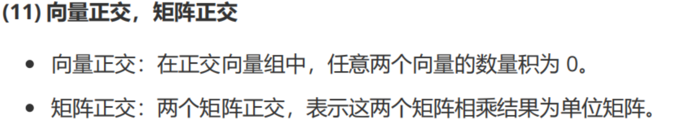

### 什么是二次型？什么是正定矩阵？正定矩阵的性质是什么？★

   二次型：   二次型是一个关于变量的二次多项式表达式。对于 n 维向量 x = [x₁, x₂, ..., xₙ]，二次型可以表示为 Q(x) = (x^T )A x，其中 A 是一个对称矩阵。

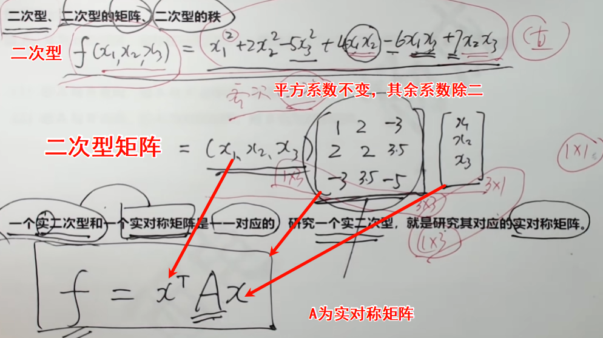

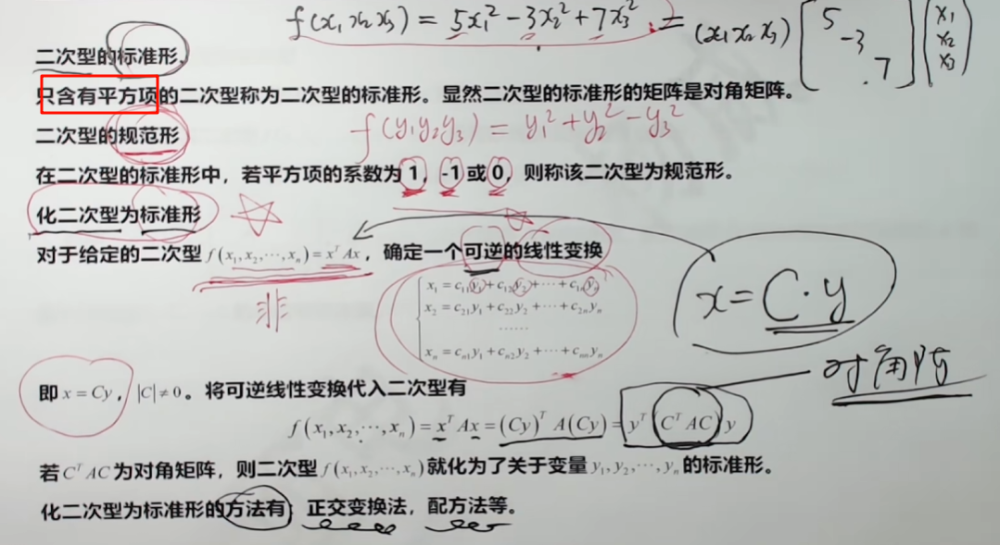

   **正定矩阵**：给定一个n阶实对称矩阵，若对于任意长度n的非零向量x，有(x^T)Ax>0恒成立，则A是一个正定矩阵。

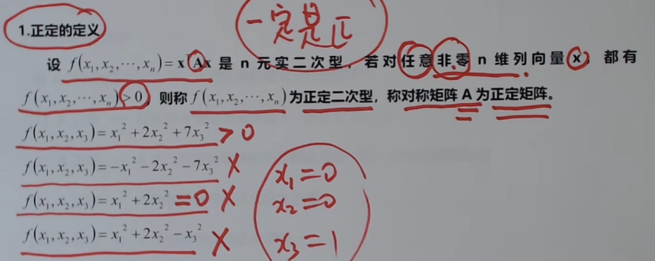

   正定矩阵的性质：

正定矩阵是实对称矩阵，即 A = A^T。这意味着矩阵的元素关于主对角线对称。
所有特征值都大于0，行列式|A| > 0，r（A）= n，为满秩矩阵；正定矩阵是可逆的，其逆矩阵也是正定的。
如果两个矩阵A和B都是正定矩阵，A+B和AB也是正定的。
正定矩阵的n次方仍然是正定矩阵。
       半正定矩阵：

       给定一个n阶实对称矩阵，若对于任意长度n的非零向量x，有(x^T)Ax≥0恒成立，则A是一个半正定矩阵。所有特征值都大于等于0。

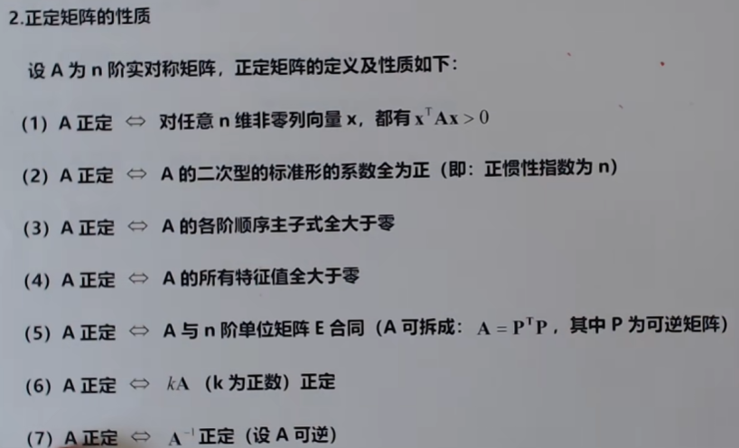

### 什么是矩阵合同？★

   设 *A*和 *B*是 *n*×*n*的**实对称矩阵**（或复Hermite矩阵），如果存在一个**可逆矩阵** *P*，使得：$B=P^⊤AP$

则称 *A*和 *B*是**合同的**（congruent），记作 *A*≃*B*。

正惯性指数：正平方项个数

负惯性指数：负平方项个数

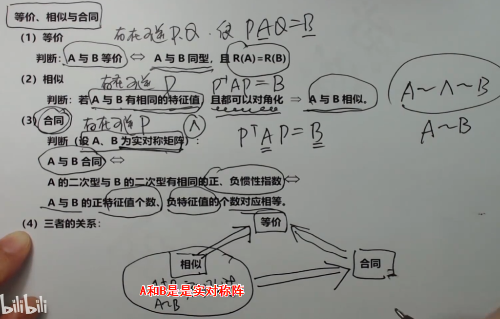

## 概率论

### 什么是条件概率？

在事件 B 发生的条件下，事件 A 发生的概率记为 P(A|B)，读作 “A 在 B 条件下发生的概率”。

条件概率的计算公式如下： P(A|B) = P(AB) / P(B)

P(AB)表示事件A和事件B同时发生的概率。

### 什么是全概率公式和贝叶斯公式？★★★★★★        

   **全概率公式**：如果有一些**互斥**事件A1,A2,……,An，它们的并集是全集，则任何事件B发生的概率可以拆分为每一个Ai∩B的概率和。

   P(B)=P(A1)*P(B|A1)+P(A2)*P(B|A2)+...+P(An)*P(B|An)

​	由因推果。造成某种结果，有多种原因，求发生这种结果的概率是多少？

   **机器学习中的贝叶斯公式**：   P(A|B) = (P(B|A) * P(A)) / P(B)

   P(A|B) 是后验概率，P(B|A) 是似然度，P(A) 表示事件 A 的先验概率，P(B) 表示事件 B 的先验概率。

​	由果推因。已知某结果的发生概率，求造成该结果的第 i 个原因的概率是多少？

   **贝叶斯公式的实际意义**：贝叶斯公式将我们对于事件A发生的先验概率与新获得的证据（似然度）相结合，从而得到在给定证据的情况下事件 A 发生的后验概率。

   例如：
   P(咳嗽患支气管炎)=P(支气管炎有咳嗽症状)*P(支气管炎)/P(咳嗽)
   P(支气管炎有咳嗽症状)是似然度，容易求得。P(支气管炎)和P(咳嗽)是先验概率。这样帮助医生根据症状预测患者患某种病的概率。

**贝叶斯公式应用**：

1.    机器学习中贝叶斯分类器：根据**已有的训练样本**（先验概率）和**特征信息**（似然估计，可能性），利用贝叶斯公式计算不同类别的后验概率，从而进行分类任务。

2.    医学诊断与预测：通过将病人的先验概率与各种医学测试的似然度相结合，可以计算出某种疾病的后验概率，辅助医生进行诊断和预测。

### **什么是先验概率和后验概率？**★★★★★

-    先验概率：事情未发生，只根据以往数据统计，分析事情发生的可能性，即先验概率。

-    后验概率（贝叶斯公式）： 事情已发生，已有结果，求引起这事发生的因素的可能性，由果求因，即后验概率。

-    后验概率和先验概率的关系：   后验概率的计算，是以先验概率为前提条件的。如果只知道事情结果，而不知道先验概率，是无法计算后验概率的。

- P(H):  `Prior 先验概率` 考虑新证据之前，假设成立的可能性（人群中图书管理员和农民，图书管理员的占比）

- P(E|H): `Likelihood 似然概率` 在假设成立的条件下看到证据的比例 （图书管理员中符合这个描述的比例）

- P(H|E): `Posterior 后验概率` 看到证据后，假设成立的概率

### 正态分布有什么性质？

1. 对称性：正态分布是概率密度函数关于其均值μ的对称分布，即在平均值两侧呈镜像对称。

2. 唯一峰值：正态分布的概率密度函数呈现单峰形状，只有一个最高峰值。
3. 分布范围无界：正态分布的取值范围是负无穷到正无穷，没有明确的上下界限。
4. 标准差决定形状：正态分布的形状由其标准差σ决定。较小的标准差会使曲线更加陡峭，较大的标准差会使曲线更加平坦。
5. 68-95-99.7 规则：在正态分布中，约有68%的观测值落在均值的一个标准差范围内，约有95%的观测值落在两个标准差范围内，约有99.7%的观测值落在三个标准差范围内。
6. 中心极限定理：多个随机变量的总和（或平均值）趋向于正态分布，即使原始随机变量不满足正态分布，这是中心极限定理的重要推论。

### 什么是二元正态分布？有什么性质？

   二元正态分布是由两个连续随机变量组成的概率分布。它通常用来描述两个变量之间的关系和相互依赖性。每个变量都服从正态分布，而二元正态分布则描述了这两个变量之间的联合分布。

   性质：

1. 边缘分布：在二元正态分布中，每个随机变量的边缘分布都是正态分布。也就是说，如果我们只考虑其中一个变量，将另一个变量积分或求和消除，所得到的分布将是单个变量的正态分布。
2. 条件分布：二元正态分布中的每个随机变量的条件分布也是正态分布。条件分布是指在已知另一个变量的取值后，考虑该变量的分布。换句话说，给定一个变量的取值后，另一个变量的条件分布仍然是正态分布。
3. 相关性：二元正态分布中的两个变量之间存在线性相关性。相关系数 ρ 衡量了这种相关性的强度，它的取值范围为 -1 到 1。当相关系数为 0 时，表示两个变量相互独立；当相关系数为正值时，表示两个变量呈正相关关系；当相关系数为负值时，表示两个变量呈负相关关系。
4. 协方差：二元正态分布中的两个变量之间存在协方差。协方差描述了两个变量的线性关系程度，它的值可以为正、负或零。当协方差为正值时，表示两个变量呈正相关关系；当协方差为负值时，表示两个变量呈负相关关系；当协方差为零时，表示两个变量无线性相关性。

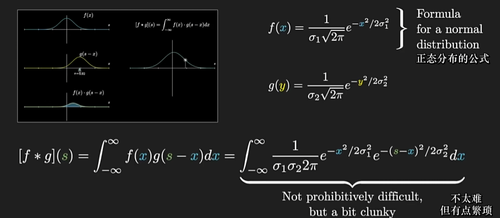

### 协方差和相关系数？★★

   协方差： 协方差是用来衡量两个随机变量之间的总体线性关系强度和方向的指标。对于随机变量X和Y，其协方差记为$Cov(X,Y)$。协方差的计算公式如下：$Cov(X,Y)=E[(X-E(X))(Y-E(Y))]$。

   **相关系数**（皮尔逊相关系数）：相关系数是通过归一化协方差得到的，用来度量两个变量之间线性**相关程度的指标**。把协方差范围缩到-1和1之间，消除不同数据的量纲差异

   $$ρ=\frac{Cov(X,Y)}{\sigma x \sigma y}$$，σx 和 σy 分别表示 X 和 Y 的标准差。

   相关系数的取值范围在 -1 到 1 之间，-1 代表完全的负相关，1 代表完全的正相关，0 代表无线性相关。相关系数绝对值越接近1，相关程度就越强。

   其他：独立一定不相关，不相关不一定独立。

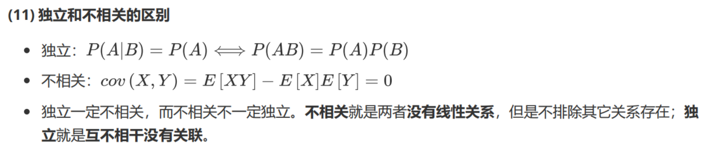

### 什么是概率密度函数？★★

   概率密度函数是用来描述连续型随机变量的概率分布的函数。对于一个连续型随机变量 X，其概率密度函数 f(x) 定义了在给定区间内，随机变量 X 取某个特定取值的概率密度。

   概率密度函数 f(x) 是一个非负函数，并且满足以下两个性质：

1.    非负性：对于任意实数x，概率密度函数满足f(x)≥0。

2.    归一性：概率密度函数的总体积分等于1，即∫f(x)dx=1。

- 连续型随机变量的取值有无穷多个实数，无法用分布列表示，所以用概率密度函数来表示。
- 概率密度函数不是概率，乘以区间长度微元后就表示概率的近似值。
- 概率密度函数在一段区间上的积分就是随机变量 X 在这段区间上取值的概率。

   EX=∫ xf(x)dx，DX=∫ x²f(x)dx

### 什么是切比雪夫不等式？★★

  切比雪夫不等式给出了随机变量与其期望值之间的偏离程度的一个上界。

$P(∣X−μ∣≥kσ)≤\frac{1}{k^2}$

这个公式说的是：“数据点离均值超过 *k*个标准差的概率，绝对不会大于 $\frac{1}{k^2}$。”

1. **当 k=2时：**
   - 不等式告诉我们：**至少有$1−\frac{1}{2^2}=1−\frac{1}{4}=0.75 $** 的数据点落在距离平均值 2 个标准差的范围内（即 (*μ*−2*σ*,*μ*+2*σ*)）。
2. **当 k=3时：**
   - 不等式告诉我们：**至少有 $1−\frac{1}{3^2}=1−\frac{1}{9}=0.889$** 的数据点落在距离平均值 3 个标准差的范围内（即 (*μ*−3*σ*,*μ*+3*σ*)）。

它提供的是一个“至少”、“最少”的概念，是一个**下限保证**。对于像正态分布这样集中性很好的分布，实际落在 (*μ*−2*σ*,*μ*+2*σ*)范围内的数据约有95%，远比切比雪夫不等式给出的75%要多。所以切比雪夫不等式是一个很“保守”或者说“悲观”的估计，但它绝对正确。

   ### 什么是大数定律和中心极限定理？★★★★★★

  **大数定律**：对于**独立同分布**的随机变量序列 {X1, X2, X3, ..., Xn}，随着样本容量 n 的增大，**样本均值**的极限将**趋于随机变量的期望值**。换句话说，样本均值在大样本情况下趋于稳定并接近总体均值。

当重复试验的次数很大时，随机变量的**均值**依概率收敛于自己的**期望**，“偶然中包含着某种必然”。

  三种大数定律（了解即可）：

1.   切比雪夫大数定律：样本数量n充分大时，n个是独立随机变量的平均数的离散程度很小。

2.   伯努利大数定律：将试验进行多次，随机事件的频率接近概率。

3.   辛钦大数定律：只要验证数学期望是否存在，就可判断其是否服从大数定律。

  **中心极限定理**：如果随机变量 X1, X2, ..., Xn 是**独立同分布**的，当样本容量 n 足够大时，样本的均值将近似地服从正态分布，即使原始总体并不服从正态分布。

  例如：10000人参加保险，一年内参加投保的人死亡的概率是0.006。设一年内参加投保的死亡人数X，X~B(10000，0.006)

- **均值（期望）** μ：$ μ=n⋅p=10000×0.006=60$
- **方差** σ2： $σ^2=n⋅p⋅(1−p)=10000×0.006×0.994=59.64$
  - **方差的性质**：对于**相互独立的**随机变量，它们**和的方差等于方差的和**。
- **标准差** σ： $σ=n⋅p⋅(1−p)=59.64≈7.723$

$X∼N(μ,σ2)$即$X∼N(60,59.64)$

或者写作：$X∼N(60,(7.723)^2)$

### 什么是最大似然估计（极大似然估计）？★★★★

最大似然估计就是一种参数估计方法。

原理：

利用**已知的样本结果**，反推最大概率导致这样结果的参数值。（根据结果推出参数）

方程的解θ只是一个估计值，只有在样本数趋于无限多的时候，它才会接近于真实值。

求最大似然估计量θ的一般步骤：

1. **写出似然函数**：基于你的概率模型（比如二项分布、正态分布）和观测到的数据，建立一个关于未知参数的函数。
2. **最大化似然函数**：通过数学方法（如求导）找到使这个函数值最大的参数值。
3. **得出结论**：“这个参数值就是最可能产生我们手中数据的那个值。”

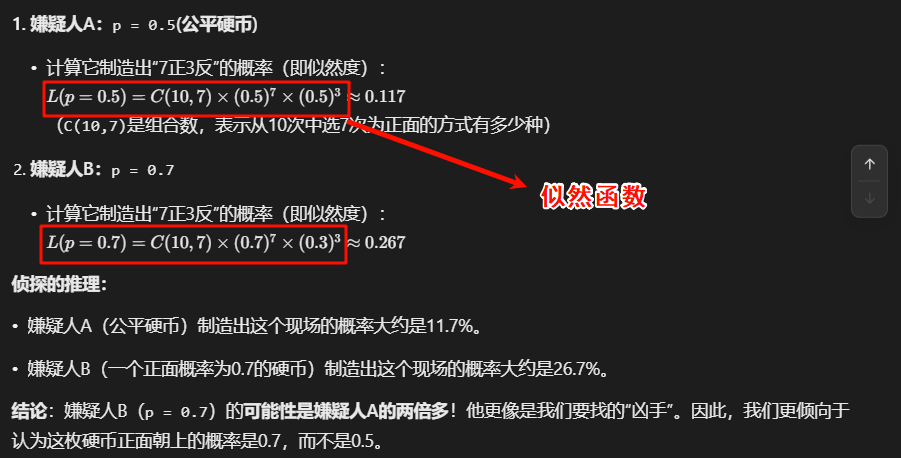

应用：最大似然估计被用于参数估计、模型选择、假设检验等许多问题

### **联合概率、边缘概率、条件概率**

- 联合概率：两个事件共同发生的概率，P(A, B)
- 边缘概率：某个事件发生的概率，与其它事件无关，P(A)
- 条件概率：在事件 B 已经发生的条件下，事件 A 发生的概率，P(A|B)

### 若干个高斯分布相加/相乘后得到的分布是什么

假设多个随机变量分别服从不同的高斯分布，如果这些随机变量彼此独立，那么这些随机变量的和也服从高斯分布，乘积为高斯分布乘以常数。

### **期望和方差**

- 期望：随机变量的每个取值与其概率的乘积的累加和，它描述了随机变量的集中特性。
- 方差：随机变量的每个取值减去期望的平方与其概率的乘积的累加和，它描述了随机变量的离散特性。

### **机器学习为什么要使用概率？**

- 机器学习的是由**数据驱动**的方法，它的学习对象是数据，从数据出发提取数据特征抽象出数据模型又从数据中发现知识，最后回到数据的分析和预测中去。
- 机器学习的**算法设计**通常依赖于对数据的概率假设。
- 机器学习模型的训练和预测过程的**评价指标**——模型误差，其本身就是概率的形式。

**不均匀硬币产生等概率**

已知一随机发生器，产生 0 的概率是 p，产生 1 的概率是 1-p，现在要你构造一个发生器，使得它构造0 和 1 的概率均为 1/2。

* 连续随机生成两次，可能的情况有：
  00：pp
  01：p(1-p)
  10：(1-p)p
  11：(1-p)(1-p)
  所以 2 次 1 组，认为 01 表示 0，10 表示 1，等概率，其他情况放弃。

* 扩展到 3, 4, ..., n 同理，以 3 为例，构造一个发生器，使得它构造 1, 2, 3 的概率均为 1/3：认为 001 表示 1，010 表示 2，100表示3，等概率，其他情况放弃。

## Reference

[如何形象直观的理解柯西中值定理_bilibili](https://www.bilibili.com/video/BV1if4y1y7tB/?spm_id_from=333.337.search-card.all.click&vd_source=4e1dceccc918063def66c9d643674c6a)

[计算机保研/考研面试题——数学篇_面试数理题-CSDN博客](https://blog.csdn.net/m0_53140426/article/details/140248482)
