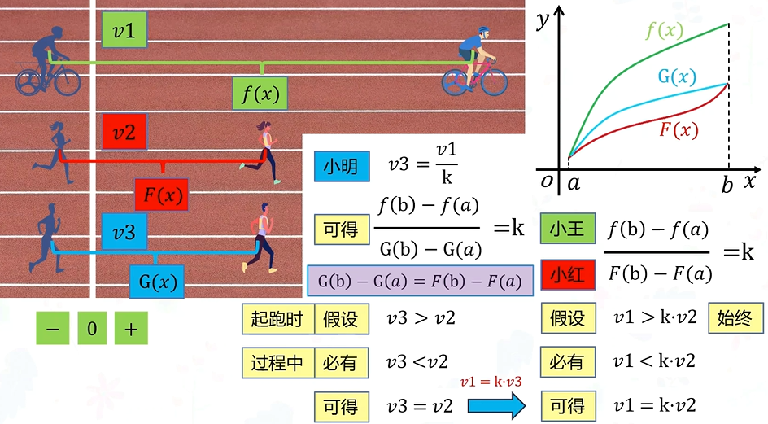
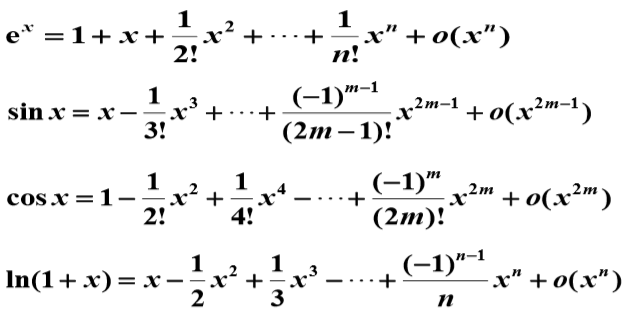
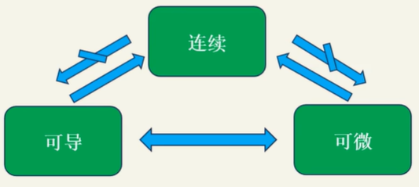
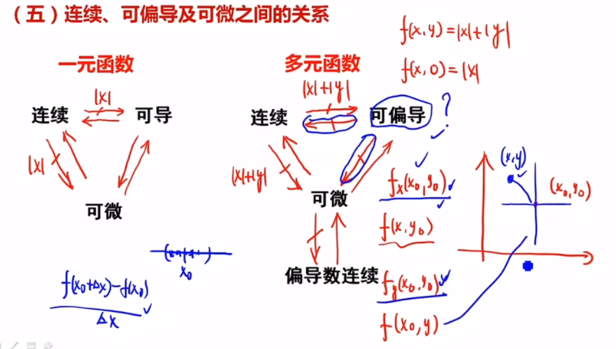

---
aliases:
  - 保研数学
tags:
  - 基础知识
---
# 数学

## 高等数学

#### 什么是极限

在函数中，当自变量趋近于某个特定值时，函数的取值可能会逼近某个确定的数值，这个确定的数值就被称为函数的极限。

**定义**：给定一个函数$f(x)$，当自变量$x$趋近于某个特定值$x_0$时，如果函数的取值$f(x)$随着$x$的趋近逼近一个确定的数$A$，那么我们称$A$是函数$f(x)$在$x$趋近于$x_0$时的极限。

>  计算复杂度时用到了极限

#### 罗尔中值定理

 如果一个函数在闭区间上连续，在开区间内可导，并且在区间的两个端点处取相同的值，那么在这个区间内，必然存在至少一个导数为零的点。

**定义**：设函数f(x)满足以下条件：

1. 在闭区间[a, b]上连续
2. 在开区间(a, b)内可导
3. f(a) = f(b)

则在(a, b)内至少存在一点ξ，使得f'(ξ) = 0。

> 在优化算法中，罗尔定理保证在极值点导数为零，这是梯度下降等算法的基础

#### 拉格朗日中值定理

如果一个函数在闭区间上连续，在开区间内可导，则至少存在一个点，**该点的导数等于函数在区间端点的斜率**。

**定义**：设函数f(x)满足：

1. 在闭区间[a, b]上连续
2. 在开区间(a, b)内可导

则在(a, b)内至少存在一点ξ，使得：f'(ξ) = [f(b) - f(a)] / (b - a)

#### 柯西中值定理

对于函数f(x)和g(x)，如果它们在闭区间[a, b]上连续，并且在开区间(a, b)内可导，那么存在一个点c∈(a, b)使得：

​    [f(b) - f(a)]/[g(b) - g(a)] = f'(c)/g'(c)

​    存在一个点c，使得函数f(x)和 g(x)在区间[a, b]上的平均变化率等于它们在点c处的瞬时变化率的比值。

> 拉格朗日：如果你一小时跑了5km，你的平均速度就是5km/h。那么在这一小时以内，要么一直保持5km/h，要么一部分比这个速度快，一部分比这个速度慢。在快慢转换的点，你的速度就是5km/h。
>
>  柯西：我一小时跑了5km，你一小时跑了20km。要么你的速度一直是我的20/5=4倍，要么你一部分比我四倍还快，一部分比我四倍慢，在这转换的这一点，你的速度是我的四倍

### 三个中值定理的区别、联系和应用

  罗尔中值定理适用于闭区间内连续的函数。当函数在闭区间的端点上取相同的值时，罗尔中值定理保证函数在开区间内至少有一个导数为零的点。

​    拉格朗日中值定理适用于闭区间内连续且可导的函数。它*是罗尔中值定理的推广*，保证函数在开区间内至少有一个导数等于平均变化率的点。拉格朗日中值定理应用：在某个时间点，质点的瞬时速度等于它在某个时间段内的平均速度。相当于把罗尔中值定理的坐标系旋转一下，转到了斜率为[f(b) - f(a)] / (b - a)的地方。

​    柯西中值定理适用于两个函数在闭区间内连续且可导。它*是拉格朗日中值定理的推广*，表示两个函数在开区间内的平均变化率等于它们在开区间内某个点的瞬时变化率的比值。假如柯西中值定理的分母是f(x)=x，则就相当于拉格朗日中值定理。

### 泰勒公式

泰勒公式简单来讲就是用**一个多项式函数去逼近一个给定的函数**(即尽量使多项式函数图像拟合给定的函数图像)，注意，逼近的时候一定是**从函数图像上的某个点展开**。如果一个非常复杂函数，想求其某点的值，直接求无法实现，这时候可以使用泰勒公式去近似的求该值，这是泰勒公式的应用之一。泰勒公式在机器学习中主要应用于梯度迭代。

​    泰勒公式可用于将一个函数在某个点附近展开成无穷级数的形式。

​    泰勒公式的一般形式如下：

​    f(x) = f(a) + f'(a)(x - a)/1! + f''(a)(x - a)²/2! + f'''(a)(x - a)³/3! + ...

​    f(x) 是要近似的函数，a 是展开点。

### 泰勒展开中皮亚诺余项和拉格朗日余项的区别

皮亚诺余项**描述了余项的阶数**；而拉格朗日余项**给出了余项的具体表达式**。在计算机科学中，皮亚诺余项常用于算法复杂度分析，而拉格朗日余项在数值计算误差分析中更为有用。

|    特性    |    皮亚诺余项    |       拉格朗日余项        |
| :--------: | :--------------: | :-----------------------: |
|   表达式   |    o((x-a)ⁿ)     | f⁽ⁿ⁺¹⁾(ξ)/(n+1)!·(x-a)ⁿ⁺¹ |
|    精度    | 定性描述余项阶数 |    定量给出余项表达式     |
| 光滑性要求 |     n阶可导      |         n+1阶可导         |
|  适用场景  |   局部近似分析   |       全局误差估计        |
|  使用频率  |   理论分析常用   |       实际计算常用        |

### 一阶导和二阶导的物理意义和几何意义是什么

​    一阶导数表示函数的变化率或切线的斜率，二阶导数表示一阶导数的变化率。

​    在物理上，一阶导数可以表示**速度**，二阶导数可以表示**加速度**。

​    在几何上，一阶导数可以表示**切线斜率**，二阶导数可以表示**曲线的凸性和凹性**。

### 一元函数和多元函数可导、可微、连续和可积的关系

[**一元函数**](./连续可导可微可积.md)：可导和可微等价。可导一定连续，连续不一定可导（y=|x|，在x=0处不可导）。

**多元函数**：可微一定可导，可微一定连续，偏导连续一定可微，偏导存在不一定连续。

可偏导不能推出连续：偏导只能管住当前偏导方向的数（该点极限趋近于某个数），其他方向管不到

同理，可偏导推不出可微：可微是全增量，跟一领域内的点上函数值都是有关系的，但是偏导只能（例如二元函数，偏导只跟两个方向上那两条线有关，决定不了其他临近点的变化趋势）。一元函数可以是因为X方向导数可以决定领域内所有函数

函数可微性：在某点附近局部很平（无论怎么放大放大再放大都不“尖”），光滑===>附近的坡度多大方向导数就多大，光滑说明所有方向上导数存在，但是多元偏导只能保证多个方向上（几元几个方向）的光滑。

例如下图原点，x、y、z三个方向均可导，有方向导数：

### [什么是方向导数和梯度](./梯度.md)

**方向导数**是一个标量。方向导数可以理解为函数**在某个点的某个方向上的变化速率**。

**梯度**是一个**向量**。它包含了函数在**每个方向上变化最快的信息**。对于一个多变量函数 f(x, y, z)，其梯度定义为：
$$
∇f = (∂f/∂x, ∂f/∂y, ∂f/∂z)
$$
   梯度的方向是函数在某一点上**变化最快**的方向，而**梯度的模长表示了函数在该点上的变化速率**（或**最大方向导数**）。

**梯度的几何意义**：函数变化增加最快的地方。沿着梯度向量的方向，更容易找到函数的最大值。反过来说，沿着梯度向量相反的方向，更容易找到函数的最小值。

梯度的应用：势场：在物理场的描述中，梯度常常用来表示场的强度和方向。例如，在电场中，梯度表示电势场的变化率。

**最速下降法**：梯度在优化问题中发挥重要作用。它利用梯度的负方向来搜索函数的最小值。根据最速下降法，沿着梯度的负方向进行迭代更新可以逐步接近函数的最小值。

**方向导数和梯度的关系**：如果我们知道了函数在某一点的梯度向量，以及一个表示方向的单位向量，就可以计算出函数在这个方向上的方向导数。

   方向导数=某点的梯度与给定方向的方向余弦做内积（点乘）。

### 什么是傅里叶级数和傅里叶变换 

迪利克雷条件:

1. 函数在一个周期内不能无限震荡或无限高
2. 不能有无限多个断点
3. 函数在一个周期内的面积（绝对值的积分）必须是有限的

傅里叶级数：任何**周期性函数**若满足狄利克雷条件，那么该函数可以**用正弦函数和余弦函数构成的无穷级数来表示**。

傅里叶变换：可以处理**非周期性信号**（一个信号可以看成一个周期性无穷大T->∞的信号）。傅里叶变换将一个信号从时域转换到频域，得到该信号的频谱。

应用：通过傅里叶变换，我们可以对信号进行滤波、降噪、压缩、频谱估计等操作。这些技术在音频处理、图像处理、视频压缩、通信系统等领域都有广泛应用。

## 线性代数

### 什么是矩阵的秩？★★★

   k 阶子式：在一个矩阵或行列式中取k行k列，交叉处的k²个元素按原顺序构成的行列式。

- 从子式的角度定义：矩阵的秩就是矩阵中**非零子式的最高阶数**。（行列式表示线性变换后面积变化的比例，因此当行列式为0时即代表面积变为0，此时必然出现三维变成二维、一维（体积变成一个面，一条线等等））

- 从极大线性无关组的角度定义：矩阵的所有行向量中极大线性无关组的元素个数。

- 从标准型的角度定义：求一个矩阵的秩，可以先将其化为行阶梯型，非零行的个数即为矩阵的秩。

### 什么是线性相关和线性无关？★★★

   线性相关：

   如果存在不全为零的系数，使得向量集合果中的某些向量的线性组合等于零向量，那么这些向量就被称为线性相关的。换句话说，如有向量v₁、v₂、v₃、...、vₙ，并且存在不全为零的标量c₁、c₂、c₃、...、cₙ，使得c₁v₁+ c₂v₂+ c₃v₃+ ... + cₙvₙ= 0，则这些向量就是线性相关的。

   线性无关：

   如果向量集合中的向量无法通过任何非平凡的线性组合（即非所有系数都为零）得到零向量，那么这些向量就是线性无关的。换句话说，如果 c₁v₁ + c₂v₂ + c₃v₃ + ... + cₙvₙ = 0 的唯一解是 c₁=c₂=...=cₙ=0，则这些向量就是线性无关的。

12. 一个矩阵线性无关的等价定义有什么？
       非奇异矩阵（行列式不为0）、矩阵可逆、矩阵满秩、特征值没有 0。

13. 向量组的极大无关组和向量组的秩是什么。
       极大无关组是指在向量组中选择尽可能多的线性无关向量，使得这个子集仍然保持线性无关，并且再添加任何其他向量，就会使得它变得线性相关。

       向量组的秩等于它的极大无关组合中向量的个数。

14. 向量空间（线性空间），向量空间的基与维数是什么。
       n 维向量构成的非空集合V，对于向量加法和数乘两种运算封闭。则这个V是向量空间。

       基：

       设 V是一向量空间，a1,a2,...,ar∈V 且满足:

       a) a1,a2,...,ar线性无关;

       b) V中向量均可由 a1,a2,..., ar 线性表示

       则称 a1,a2,...,ar 为V 的一个基。

       维数

       基中所含向量个数 r 称为向量空间的维数

15. 什么是矩阵的特征值与特征向量？特征值有什么应用？★★★★
       定义：

       给定一个n×n的方阵A，若非零向量x满足Ax = λx，那么λ称为A的特征值。非零向量x称为A的特征向量。

       也就是说，特征向量x在经过矩阵 A 的线性变换后，只会改变长度但不会改变方向，而特征值则表示该变换的缩放比例。

       计算：

       |λE-A|=0从而求得所有λ。将λi带回(λiE-A)x=0那么可求得方程组的基础解系，特征值为λi的特征向量就是基础解系的线性组合。

       性质：

       所有特征值的积是该矩阵的行列式（行列式的本质是特征值的乘积），所有特征值的和是该矩阵的迹。

       应用：

       特征空间变换：特征向量可以用于将矩阵对角化，从而简化线性变换的描述。这在计算中能够提高效率。

       图像处理：特征值和特征向量可以用于图像压缩、降噪和特征提取等领域。例如，主成分分析（PCA）方法就利用了特征向量来提取图像中的关键特征。

       数据分析：特征值可以用于降维和数据拟合。例如，在主成分分析中，我们可以通过保留最大的特征值对应的特征向量进行数据降维，从而捕捉数据的主要变化趋势。

16. 特征值为0和矩阵的秩的关系。★★
       如果 λ = 0，则有以下结论：

       A的秩小于n

如果 A 的某个特征值为 0，那么 A 的秩必定小于 n。这是因为特征值为 0 表明 A 不是满秩矩阵，存在线性相关的列向量，导致 A 的秩小于 n。

       A的行向量和列向量中至少有一个线性相关
    
       如果 λ = 0，那么对应的特征向量 x 满足 Ax = 0。由于 x ≠ 0，说明存在一个非零的向量使得 A 与它的乘积为零。这意味着 A 的行向量和列向量中至少有一个线性相关。
    
       特征值为 0 并不意味着矩阵 A 的秩一定为 0。

19. 什么是相似矩阵和相似对角化？★★
       相似矩阵定义：

       两个n×n的矩阵A和B称为相似矩阵，如果存在一个可逆矩阵P，使得B = P^(-1) AP。

       相似矩阵性质：

       相似矩阵具有相同的特征值、秩、行列式。

       相似矩阵的特征向量可以通过相似变换得到。

       相似对角化定义：

       相似对角化是指将一个矩阵A通过相似变换P^(-1) AP转化为对角矩阵D的过程。D 的对角线上的元素就是 A 的特征值，P 的列向量就是 A 的特征向量。

       并不是所有的矩阵都可以相似对角化。一个矩阵可对角化的充要条件是它具有n个线性无关的特征向量。

20. 什么是对称矩阵？对称矩阵有什么性质？★★★
       定义：

       方阵A中，aij = aji，则A为对称矩阵，或A^T = A。若A还是实矩阵，则A为实对称矩阵。

       性质：

       特征值都是实数，特征向量都是实向量。

       不同特征值对应的特征向量正交。

       对称矩阵可以通过正交相似变换对角化，即存在正交矩阵P，使得 (P^T)AP = D，D 是对角矩阵。

（补充：正交矩阵就是满足PP^T=E）

21. 什么是二次型？什么是正定矩阵？正定矩阵的性质是什么？★
       二次型：

       二次型是一个关于变量的二次多项式表达式。对于 n 维向量 x = [x₁, x₂, ..., xₙ]，二次型可以表示为 Q(x) = (x^T )A x，其中 A 是一个对称矩阵。

       正定矩阵：

       给定一个n阶实对称矩阵，若对于任意长度n的非零向量x，有(x^T)Ax>0恒成立，则A是一个正定矩阵。

       正定矩阵的性质：

正定矩阵是实对称矩阵，即 A = A^T。这意味着矩阵的元素关于主对角线对称。
所有特征值都大于0，行列式|A| > 0，r（A）= n，为满秩矩阵；正定矩阵是可逆的，其逆矩阵也是正定的。
如果两个矩阵A和B都是正定矩阵，A+B和AB也是正定的。
正定矩阵的n次方仍然是正定矩阵。
       半正定矩阵：

       给定一个n阶实对称矩阵，若对于任意长度n的非零向量x，有(x^T)Ax≥0恒成立，则A是一个半正定矩阵。所有特征值都大于等于0。

22. 什么是矩阵合同？★
       若A和B是两个方阵，若存在可逆矩阵Q，使得B=(Q^T)AQ成立，则A与B合同。

       合同的充要条件：对A和行和列施以相同的初等变换变成B。

## Reference

[如何形象直观的理解柯西中值定理_bilibili](https://www.bilibili.com/video/BV1if4y1y7tB/?spm_id_from=333.337.search-card.all.click&vd_source=4e1dceccc918063def66c9d643674c6a)

