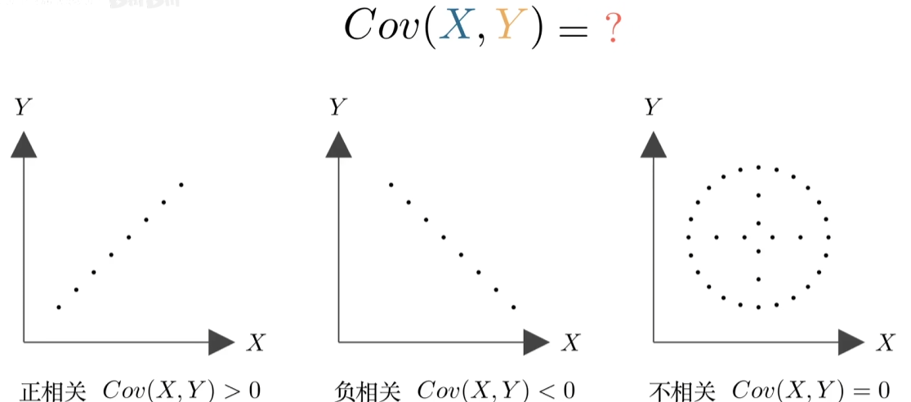
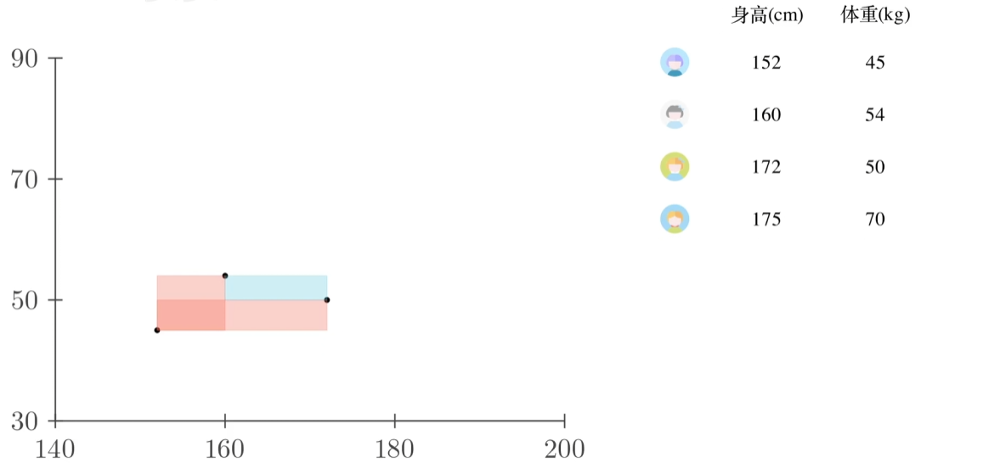
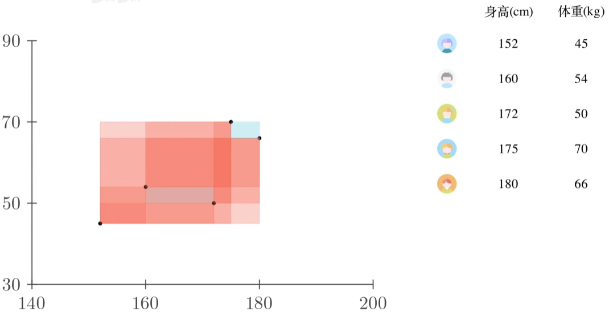
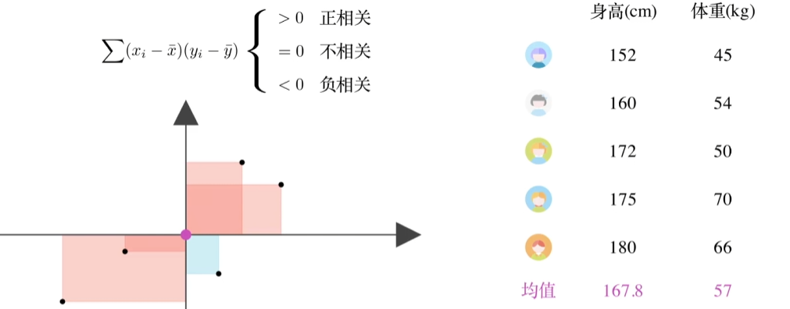
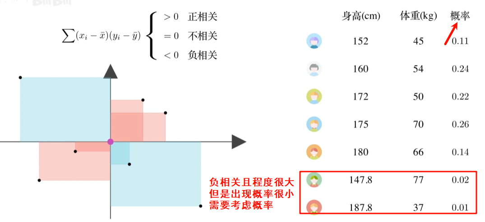
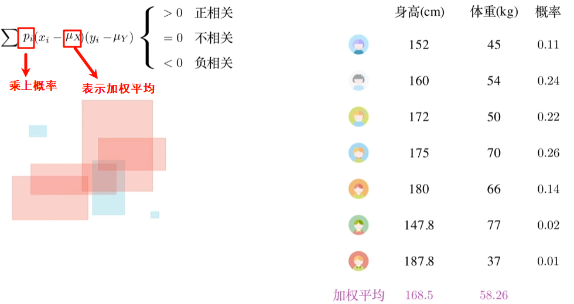

# 协方差

协方差衡量的是“两个变量如何一起变化”

如何根据数据判断这两个数据是如何变化的呢？

下图中我们来判断**每两个点之间的相关性**，如果x,y同时增加即为正相关用红色矩形面积表示其程度，负相关则用蓝色

下图中红色矩形面积大于蓝色，总体呈现正相关，但是每两个点之间都计算一遍（$n^2$）,可以简化。求一个点和其他所有点的面积，等于**该点到均值的面积乘n**

因此我们找到均值点，计算每个点到均值的相关性程度。同时，一三象限表示正相关，二四象限表示负相关。

改写为期望形式：

协方差公式：

协方差的大小（数字的绝对值）很难解释。比如，*C**o**v*(*A*,*B*)=500和 *C**o**v*(*C*,*D*)=1000，我们能说C和D的相关性比A和B强一倍吗？**不能。**

因为协方差的大小受变量本身**量纲**和**取值范围**的影响很大。比如，如果你把“气温”的单位从摄氏度改成华氏度，协方差的值会立刻变大，但变量间的关系丝毫没变。

**这就引出了“相关系数”。**

## 相关系数

为了解决量纲问题，我们将协方差“标准化”。方法就是用协方差除以两个变量各自的标准差。

**相关系数公式：**$$ρ=\frac{Cov(X,Y)}{\sigma x \sigma y}$$

相关系数（通常记为 *ρ*或 *r*）的值被限制在 **-1 到 1** 之间：

- **1**：完全正相关
- **-1**：完全负相关
- **0**：无线性相关