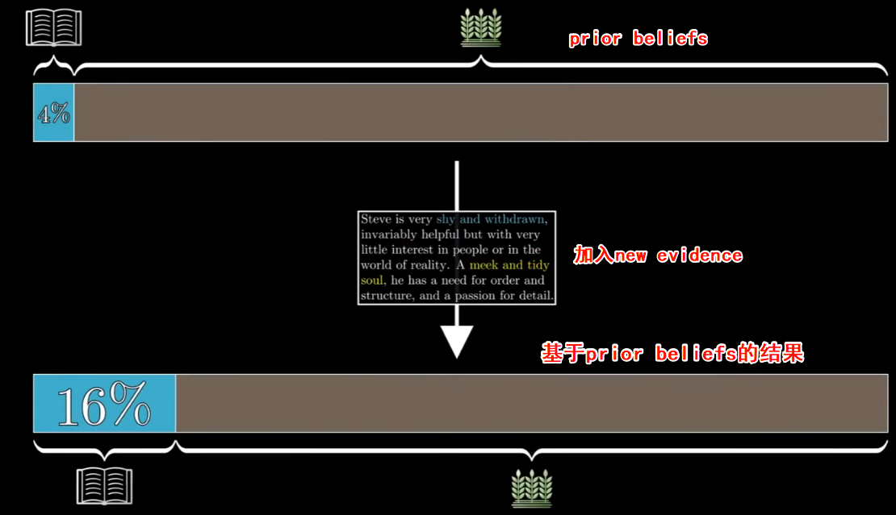
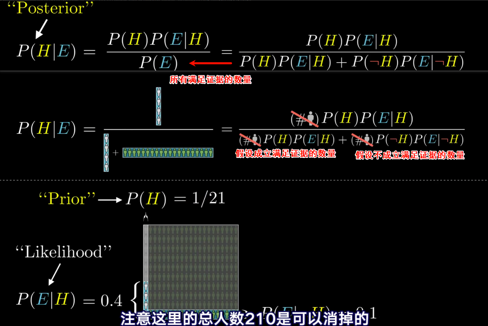
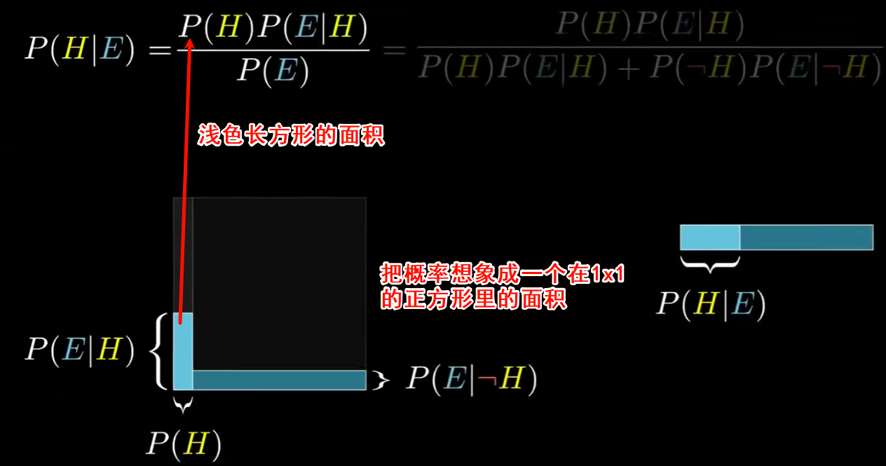
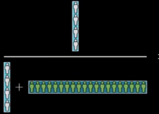

# 贝叶斯公式

> New evidence does not completely determine your beliefs in a vacuum,it should update prior beliefs.
>
> 理性判断需结合证据（特征）和先验概率（基础比率），避免忽视统计基础而过度依赖直观特征

Steve性格内向、细致且不爱社交，然后让人们判断他更可能是图书管理员还是农民。尽管从性格特征看似乎更像图书管理员，但实际农民的人口基数远大于图书管理员，因此结合先验概率（农民数量更多），Steve是农民的可能性反而更高。

**贝叶斯公式解读：**

1. **先验概率**：图书管理员在总人口中占比极低（如1%），农民占比很高（如99%）。
2. **似然度**：假设“内向细致”特征在图书管理员中出现的概率（如80%）高于农民（如10%）。
3. **后验概率**：通过贝叶斯公式计算后，即使特征更匹配图书管理员，但受先验概率影响，最终后验概率可能仍倾向于农民。

P(H|E) 

H:hypothesis

E:evidence

|:given 在一个限制条件下

P(H):  `Prior 先验概率` 考虑新证据之前，假设成立的可能性（人群中图书管理员和农民，图书管理员的占比）

P(E|H): `Likelihood 似然概率` 在假设成立的条件下看到证据的比例 （图书管理员中符合这个描述的比例）

P(H|E): `Posterior 后验概率` 看到证据后，假设成立的概率

画一个正方形，横轴表示先验概率即满足假设和不满足假设的比例，纵轴表示似然概率（可能性），在当前限制条件下（满足还是不满足假设）符合证据的可能性，然后计算面积。求比例

