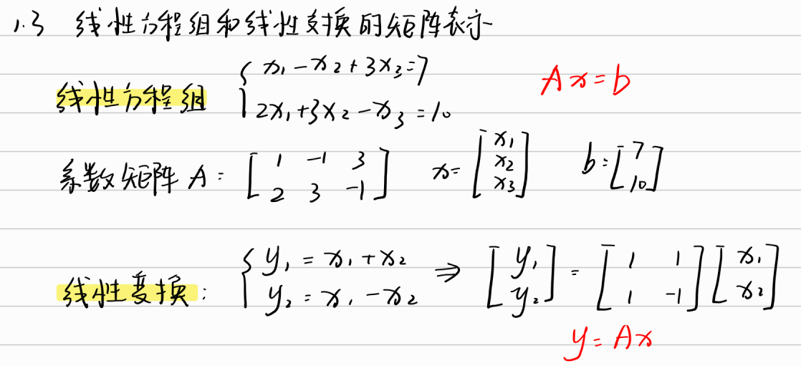
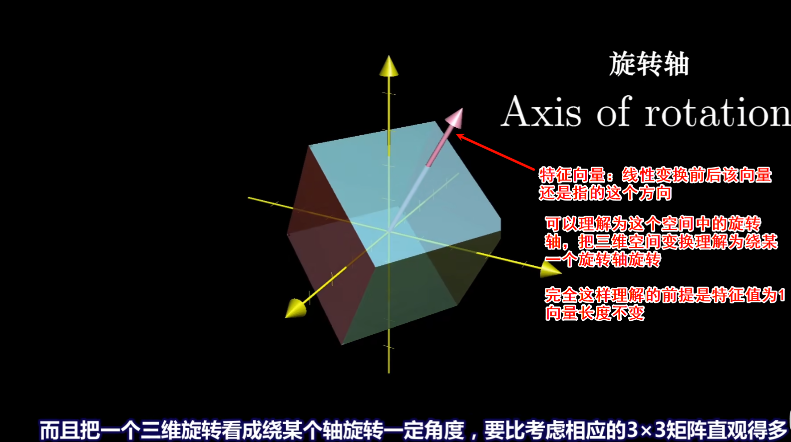
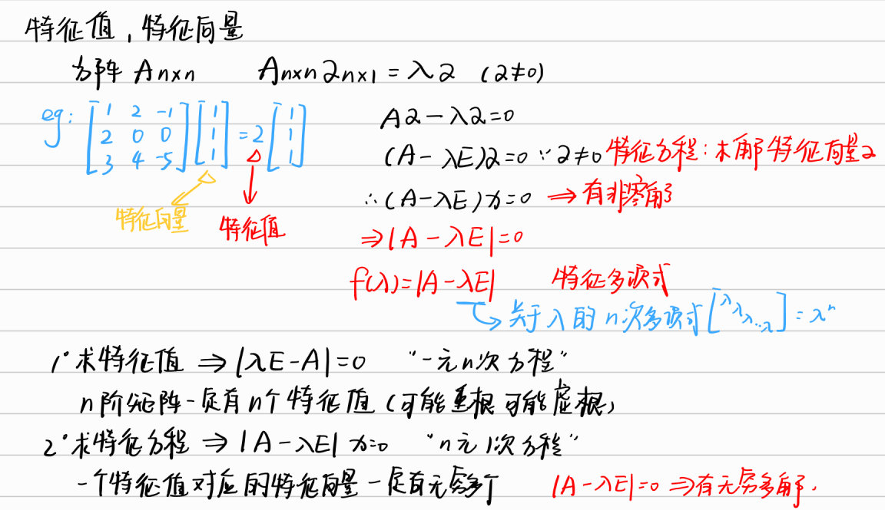
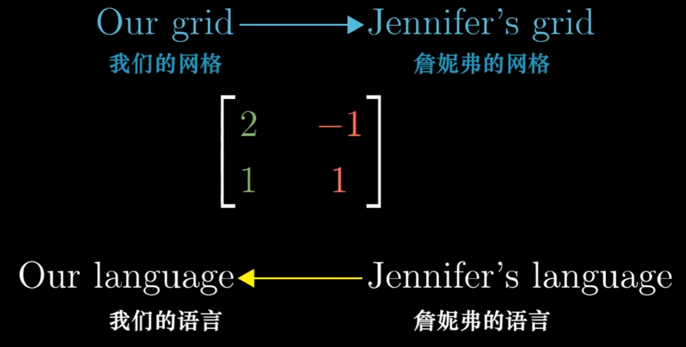

# 线性代数基本概念

## What is 向量

## 线性组合、张成空间与基

具体详见：[向量组线性相关与线性无关](#向量组线性相关与线性无关)

## 矩阵和线性变换

## 矩阵乘法与线性变换复合

## 行列式determinant

行列式为0不可逆，det(A)=0 意味着变换将空间压缩到了一个更低的维度（例如，把平面压缩成一条线或一个点），面积/体积变成了0。这种“降维”打击导致信息丢失，所以无法找到逆变换还原回去。

## 逆矩阵、列空间与零向量

## 点积与对偶性

## 叉积

[特征值特征向量](#特征值、特征向量)

## 矩阵

### 矩阵的概念

### 矩阵的初步运算

### 线性方程和线性变换的矩阵表示

### 易错公式

### 矩阵的转置

### 矩阵的逆

### 初等变换

### 矩阵逆的求法

## 行列式

### 伴随矩阵

#### 伴随矩阵的性质

#### 伴随矩阵的重要公式

这里计算伴随矩阵的易错点在于：行的余子式到伴随矩阵变成了列

#### 用伴随矩阵求逆矩阵

### 克莱姆法则 (Cramer's Rule)

#### 适用条件

- **线性方程组**：包含n个方程和n个未知数（否则无法计算行列式）
- **系数矩阵可逆**：系数矩阵的行列式不为零 (det(A) ≠ 0)

#### 核心公式

对于线性方程组 **A**x = **b**：

$$
x_i = \frac{\det(A_i)}{\det(A)} \quad (i = 1,2,\dots,n)
$$

其中：

- $A$ = 系数矩阵
- $A_i$ = 将$A$的第$i$列替换为常数列**b**后的矩阵
- $\det(\cdot)$表示矩阵的行列式

#### 二元方程组示例

方程组：
$$
\begin{cases}
a_{11}x_1 + a_{12}x_2 = b_1 \\
a_{21}x_1 + a_{22}x_2 = b_2
\end{cases}
$$

解为：
$$
x_1 = \frac{
\begin{vmatrix}
b_1 & a_{12} \\
b_2 & a_{22}
\end{vmatrix}
}{
\begin{vmatrix}
a_{11} & a_{12} \\
a_{21} & a_{22}
\end{vmatrix}
}, \quad
x_2 = \frac{
\begin{vmatrix}
a_{11} & b_1 \\
a_{21} & b_2
\end{vmatrix}
}{
\begin{vmatrix}
a_{11} & a_{12} \\
a_{21} & a_{22}
\end{vmatrix}
}
$$

#### 三元方程组示例

方程组：
$$
\begin{cases}
a_{11}x_1 + a_{12}x_2 + a_{13}x_3 = b_1 \\
a_{21}x_1 + a_{22}x_2 + a_{23}x_3 = b_2 \\
a_{31}x_1 + a_{32}x_2 + a_{33}x_3 = b_3
\end{cases}
$$

解为：
$$
x_1 = \frac{\det(A_1)}{\det(A)}, \quad
x_2 = \frac{\det(A_2)}{\det(A)}, \quad
x_3 = \frac{\det(A_3)}{\det(A)}
$$

其中$A_1$, $A_2$, $A_3$分别是将$A$的第1、2、3列替换为**b**后的矩阵。

## 矩阵的秩

### 矩阵秩的定义与相关概念

**矩阵的秩**：矩阵A中最高阶非零子式的阶数，记作rank(A)或r(A)

#### 1️⃣ k阶子式

- 从m×n矩阵中任取k行k列(k ≤ min(m,n))  
- 交叉处元素按原顺序排列构成的k阶行列式  
- **非零子式**：行列式值不为零的子矩阵

#### 2️⃣ 秩的分类

| 类型 | 条件 | 说明 |
|------|------|------|
| **行满秩矩阵** | r(A) = 行数 | 行向量线性无关 |
| **列满秩矩阵** | r(A) = 列数 | 列向量线性无关 |
| **满秩矩阵** | r(A) = min(行数,列数) | 方阵时⇔行列式≠0 |
| **降秩矩阵** | r(A) < min(行数,列数) | 方阵时⇔行列式=0 |

#### 3️⃣ 特殊矩阵

**行阶梯矩阵**：

- 零行位于非零行下方
- 非零行的首非零元**严格右于**上行首非零元
- 秩 = 非零行行数

**行最简形矩阵**（Reduced Row Echelon Form）：

- 满足行阶梯矩阵条件
- 非零行首元必须为1
- 首元所在列其他元素全为0

#### 🧮 重要性质

1. `0 ≤ rank(A) ≤ min(m,n)`
2. `rank(Aᵀ) = rank(A)`
3. 初等变换不改变矩阵的秩
4. 满秩方阵是可逆矩阵

### 矩阵秩的性质

**初等变换不改变矩阵的秩**  
三种初等变换：

1. 交换两行（列）
2. 某行（列）乘以非零常数
3. 某行（列）加上另一行（列）的倍数

#### 🔍 求矩阵秩的方法

1. **子式法**：寻找最高阶非零子式
2. **初等变换法**（最常用）：
   - 通过初等行变换化为**行阶梯形**
   - 非零行数即为矩阵的秩
3. **标准形法**：化为$\begin{bmatrix} E_r & O \\ O & O \end{bmatrix}$形式

#### 秩的性质

1. **非负性**：$r(A) \geq 0$
2. **零矩阵**：$r(O) = 0$ 如果一个矩阵的秩为0则一定是零矩阵
3. **尺寸限制**：$r(A)_{m×n} \leq \min(m,n)$
4. **转置与数乘**：
   - $r(A^T) = r(A)$
   - $r(kA) = \begin{cases}
     r(A) & (k \neq 0) \\
     0 & (k = 0)
     \end{cases}$
5. **初等变换不变性**：初等变换不改变秩
6. **整体与部分**：
   - 子矩阵的秩 ≤ 原矩阵的秩
   - $r\begin{pmatrix} A & O \\ O & B \end{pmatrix} = r(A) + r(B)$
7. **和的秩**：$r(A+B) \leq r(A) + r(B)$
8. **合并矩阵**：$r([A,B]) \leq r(A) + r(B)$
9. **乘积的秩**：
   - $r(AB) \leq \min(r(A), r(B))$ 矩阵越乘越小
   - 若A列满秩：$r(AB) = r(B)$
   - 若B行满秩：$r(AB) = r(A)$
10. **零积关系**：若$A_{m*n}B_{n*l}=O$，则$r(AB) \geq r(A) + r(B)$ -n；若$A_{m*n}B_{n*l}=0$，则$r(A) + r(B) \leq n$  
11. **方阵的秩**：
    - $|A| \neq 0 \Leftrightarrow r(A) = n$
    - $A$可逆 $\Leftrightarrow r(A) = n$

12. **伴随矩阵**：
    $$ r(A^*) = \begin{cases}
    n & r(A) = n \\
    1 & r(A) = n-1 \\
    0 & r(A) < n-1
    \end{cases} $$

### 利用初等行变换解线性方程组

**同解原理**：

- **初等行变换不改变方程组的解集**
- **行最简形矩阵**对应的方程组**与原方程组同解**

#### 非齐次方程组

方程组：
$$
\begin{cases}
x_1 + 2x_2 = 3 \\
4x_1 + 5x_2 = 6
\end{cases}
$$

（非齐次线性方程组对应增广矩阵）增广矩阵变换：
$$
\left[\begin{array}{cc|c}
1 & 2 & 3 \\
4 & 5 & 6
\end{array}\right]
\rightarrow
\left[\begin{array}{cc|c}
1 & 0 & -1 \\
0 & 1 & 2
\end{array}\right]
$$

解：x₁ = -1，x₂ = 2

#### 齐次方程组

方程组：
$$
\begin{cases}
x_1 + x_2 + x_3 = 0 \\
2x_1 + 2x_2 + 2x_3 = 0
\end{cases}
$$

（齐次线性方程组对应系数矩阵）行最简形：
$$
\left[\begin{array}{ccc}
1 & 1 & 1 \\
0 & 0 & 0
\end{array}\right]
$$

通解：x = k₁[-1,1,0]ᵀ + k₂[-1,0,1]ᵀ

### 线性方程组解的判定

可以将秩理解为约束条件，约束条件越大，解越唯一

列满秩可以理解为未知数与方程数相等

#### 齐次线性方程组 Ax=0

齐次线性方程组一定有解===>即全部为0

| 条件 | 解的情况 | 几何意义 |
|------|----------|----------|
| `r(A) = A列数（列满秩）` | **唯一零解** | 解空间维度为0 |
| `r(A) <  A列数` | **无穷多非零解** | 解空间维度=n-r(A) |
| `行数小于列数`（行数可以相当于秩） | **有非零解** ||

#### 非齐次线性方程组 Ax=b

| 条件 | 解的情况 | 几何意义 |
|------|----------|----------|
| `r(A) < r([A\|b]` | **无解** | 方程组矛盾 |
| `r(A) = r([A\|b]) = 列数` | **唯一解** | 解点唯一 |
| `r(A) = r([A\|b]) < 列数` | **无穷多解** | 解空间=特解+齐次解空 |

## 向量

### 基本概念

### 向量组之间的向量表示

### 线性方程组的5种表示方法

### 向量组线性相关与线性无关

#### 线性相关（Linear Dependence）

对于向量组 $\alpha_{1}, \alpha_{2}, \cdots, \alpha_{m}$，若存在**一组不全为零**的数 $k_{1}, k_{2}, \cdots, k_{m}$，使得：

$$
k_{1}\alpha_{1} + k_{2}\alpha_{2} + \cdots + k_{m}\alpha_{m} = \mathbf{0}
$$

成立，则称该向量组是**线性相关**的。

$\alpha_1 = \begin{bmatrix}1\\2\end{bmatrix}, \alpha_2 = \begin{bmatrix}2\\4\end{bmatrix}$  
∵ $2\alpha_1 - \alpha_2 = 0$（存在非零系数组合）

#### 线性无关（Linear Independence）

对于向量组 $\alpha_{1}, \alpha_{2}, \cdots, \alpha_{m}$，若**仅当** $k_{1} = k_{2} = \cdots = k_{m} = 0$ 时，才有：

$$
k_{1}\alpha_{1} + k_{2}\alpha_{2} + \cdots + k_{m}\alpha_{m} = \mathbf{0}
$$

成立，则称该向量组是**线性无关**的。

$\alpha_1 = \begin{bmatrix}1\\0\end{bmatrix}, \alpha_2 = \begin{bmatrix}0\\1\end{bmatrix}$  
∵ 仅当$k_1=k_2=0$时$k_1\alpha_1 + k_2\alpha_2=0$

#### 对比总结

| 性质        | 线性相关                          | 线性无关                          |
|-------------|----------------------------------|----------------------------------|
| **定义**    | 存在非全零系数使线性组合为零向量  | 仅当系数全零时线性组合为零向量    |
| **方程组**  | 齐次方程组有非零解               | 齐次方程组仅有零解               |
| **矩阵秩**  | $r(A) < m$（向量个数）           | $r(A) = m$                      |
| **几何意义**| 至少一个向量可被其余向量表示      | 任意一个向量都不能被其余向量线性表示           |

#### 记忆要点

1. 相关 ⇔ 存在"冗余"向量
2. 无关 ⇔ 向量彼此"独立"
3. n+1个n维向量必相关
4. 含零向量的组必相关

### 特殊向量组的线性相关性分析

#### 1. n维基本单位向量组

$$ \mathbf{e}_1 = \begin{pmatrix}1\\0\\\vdots\\0\end{pmatrix}, \mathbf{e}_2 = \begin{pmatrix}0\\1\\\vdots\\0\end{pmatrix}, \cdots, \mathbf{e}_n = \begin{pmatrix}0\\0\\\vdots\\1\end{pmatrix} $$

- **性质**：线性无关
- **判定依据**：
  - 行列式 $|E_n|=1 \neq 0$
  - 无法找到非零组合使其线性组合为零向量

#### 2. 含有零向量的向量组

$$ \{\mathbf{0}, \alpha_1, \alpha_2, \cdots, \alpha_k\} $$

- **性质**：必定线性相关
- **证明**：0向量之前的系数可以为任意值
  $$ 1\cdot\mathbf{0} + 0\cdot\alpha_1 + \cdots + 0\cdot\alpha_k = \mathbf{0} $$
  存在非零系数1

#### 3. 单向量构成的向量组

$$ \{\alpha\} $$

- **判定**：
  - $\alpha \neq \mathbf{0}$ ⇒ 线性无关
  - $\alpha = \mathbf{0}$ ⇒ 线性相关
- **解释**：非零向量的唯一组合 $k\alpha=0$ 仅当 $k=0$ 时成立

#### 4. 双向量构成的向量组

$$ \{\alpha, \beta\} $$

- **相关条件**：
  - 存在**比例关系** $\beta = k\alpha$（共线）
- **无关条件**：
  - 两向量不成比例（不共线）

#### 5. n个n维向量组

$$ \{\alpha_1, \alpha_2, \cdots, \alpha_n\} \quad (\alpha_i \in \mathbb{R}^n) $$

- **判定方法**：
  - 计算行列式 $|A|$（矩阵 $A=[\alpha_1 \cdots \alpha_n]$）
    - $|A|=0$ ⇒ 线性相关
    - $|A|\neq0$ ⇒ 线性无关
- **几何意义**：
  - 行列式非零 ⇔ 向量构成n维空间的基

#### 总结表

| 向量组类型 | 典型示例 | 相关性 | 判定依据 |
|-----------|----------|--------|----------|
| 基本单位向量组 | $\mathbf{e}_1,\mathbf{e}_2$ | 无关 | 行列式=1 |
| 含零向量组 | $\{0,\alpha\}$ | 相关 | 零向量存在 |
| 单向量组 | $\{\alpha\}$ | $\alpha=0$时相关 | 非零性 |
| 双向量组 | $\{\alpha,k\alpha\}$ | 相关 | 成比例 |
| n维n向量组 | 任意n个n维向量 | 行列式判据 | $|A|=0$时相关 |

### 向量组的部分与整体、延伸与缩短定理

#### 部分与整体定理

##### 定理1（整体→部分）

**整体线性无关 ⇒ 部分线性无关**  

- 若向量组 $\alpha_1,\alpha_2,...,\alpha_m$ 线性无关  
- 则其任意子集 $\alpha_{i_1},\alpha_{i_2},...,\alpha_{i_k}$（$k \leq m$）必线性无关

##### 定理2（部分→整体）

**部分线性相关 ⇒ 整体线性相关**  

- 若向量组中存在某个子集线性相关  
- 则整个向量组必线性相关

#### 延伸与缩短定理

##### 定理1（短→长）

**"短"线性无关 ⇒ "长"线性无关**  （限制条件变得更多）

- 设向量组 $\alpha_1,...,\alpha_m$ 各向量前n个分量构成"短"向量组  
- 若短组线性无关 ⇒ 原长向量组必线性无关

##### 定理2（长→短）

**"长"线性相关 ⇒ "短"线性相关**  （限制条件变得更少）

- 若长向量组线性相关 ⇒ 其对应的短向量组必线性相关

### 向量组线性表示唯一性定理

设向量组 $\alpha_1, \alpha_2, \cdots, \alpha_n$ **线性无关**，但加入新向量 $\beta$ 后形成的扩展组 $\alpha_1, \alpha_2, \cdots, \alpha_n, \beta$ **线性相关**，则：

1. $\beta$ 可由 $\alpha_1, \alpha_2, \cdots, \alpha_n$ **线性表示**
2. 这种表示方法是**唯一**的

### 极大线性无关组与向量组的秩

#### 一、极大线性无关组（极大无关组）

**极大线性无关组**：向量组中满足以下两个条件的子集：

1. 自身线性无关
2. 再添加原组中任意其他向量后都变为线性相关/其他向量都可以用极大线性无关组线性表示

#### 极大无关组不唯一

#### 向量组的秩

向量组的秩 = 其极大无关组所含向量的个数，记作 R(·)

#### 特殊向量组的秩

| 向量组类型 | 秩 | 说明 |
|-----------|----|------|
| **零向量组** | 0 | 无线性无关向量 |
| **n维基本单位向量组** | n | $\{\mathbf{e}_1,...,\mathbf{e}_n\}$ 线性无关 |

### 向量组的秩与线性相关性判定

#### 向量组的秩与向量个数关系

向量组的秩（约束条件）与未知数个数

1. **线性相关判定**：
   $$ r(\alpha_1,\alpha_2,\cdots,\alpha_m) < m \Leftrightarrow \text{向量组线性相关} $$

   约束条件少于向量个数，约束条件少

2. **线性无关判定**：
   $$ r(\alpha_1,\alpha_2,\cdots,\alpha_m) = m \Leftrightarrow \text{向量组线性无关} $$

   约束条件等于向量个数

3. **秩的上界**：
   $$ r(\alpha_1,\alpha_2,\cdots,\alpha_m) \leq m $$

#### 向量个数与维数的关系

设 $A$ 为 $m$ 个 $n$ 维列向量构成的向量组：

n维可以理解为n个约束条件，m个是未知数个数，当未知数个数大于约束条件时，线性相关

| 情况 | 判定条件 | 结论 |
|------|----------|------|
| **m > n** | - | 必线性相关 |
| **m = n** | $\det(A)=0$ | 线性相关 |
|  | $\det(A)\neq0$ | 线性无关 |
| **m < n** | $r(A)<m$ | 线性相关 |
|  | $r(A)=m$ | 线性无关 |

### 三秩相等定理解析

对于任意矩阵 $A$，以下三个秩相等：

1. **矩阵的秩** $r(A)$
2. **行向量组的秩**（矩阵各行作为向量组的秩）
3. **列向量组的秩**（矩阵各列作为向量组的秩）

数学表达式：
$$ r(A) = r(\text{行向量组}) = r(\text{列向量组}) $$

#### 应用示例

设矩阵：
$$ A = \begin{bmatrix}
1 & 2 & 3 \\
4 & 5 & 6 \\
7 & 8 & 9
\end{bmatrix} $$

1. **行向量组**：$\{(1,2,3),(4,5,6),(7,8,9)\}$
   - 经初等变换得秩=2

2. **列向量组**：$\left\{\begin{pmatrix}1\\4\\7\end{pmatrix},\begin{pmatrix}2\\5\\8\end{pmatrix},\begin{pmatrix}3\\6\\9\end{pmatrix}\right\}$
   - 同样可得秩=2

3. **矩阵秩**：通过行/列变换得$r(A)=2$

### 向量组等价性

#### 向量组等价定义
两个向量组$\alpha_1,\alpha_2,...,\alpha_m$与$\beta_1,\beta_2,...,\beta_n$称为**等价**，如果：
1. 每个$\alpha_i$可由$\beta_1,...,\beta_n$线性表示
2. 每个$\beta_j$可由$\alpha_1,...,\alpha_m$线性表示

数学表述：
$$ \langle \alpha_1,...,\alpha_m \rangle = \langle \beta_1,...,\beta_n \rangle $$

#### 核心定理

- 定理1：向量组与其极大无关组的等价
- 定理2：不同极大无关组间的等价性

### 向量组的秩与线性表示定理

#### 定理1（秩不等式定理）

若向量组 $\alpha_{1},\alpha_{2},\cdots,\alpha_{m}$ 可由$\beta_{1},\beta_{2},\cdots,\beta_{n}$线性表示，则：
$$ r(\alpha_{1},\alpha_{2},\cdots,\alpha_{m}) \leq r(\beta_{1},\beta_{2},\cdots,\beta_{n}) $$

**几何解释**：
- 被表示向量组的秩 ≤ 表示向量组的秩
- 可以把秩想象成*能力*，一个向量组可以由另一个向量组线性表示，可以说明该向量组的能力小于另一个向量组

#### 定理2（等价秩等定理）
若两向量组等价（互相线性表示），则：
$$ r(\alpha_{1},\alpha_{2},\cdots,\alpha_{m}) = r(\beta_{1},\beta_{2},\cdots,\beta_{n}) $$

**核心理解**：
- 等价向量组生成相同的线性空间
- 因此它们基的维数（即秩）必然相同
  
### 向量组的"臃肿性"与"紧凑性"定理

若线性相关即表示有**多余**的向量可以由别的向量表示

#### 定理1（臃肿性定理）
若向量组$\beta_{1},\beta_{2},\cdots,\beta_{t}$可由$\alpha_{1},\alpha_{2},\cdots,\alpha_{s}$线性表示，且$s < t$，则$\beta$-组**必线性相关**。

#### 定理2（紧凑性定理）
若$\beta_{1},\beta_{2},\cdots,\beta_{t}$可由$\alpha_{1},\alpha_{2},\cdots,\alpha_{s}$表示，且$\beta$-组**线性无关**，则$s \geq t$。

#### 定理3（等维定理）
若$\alpha$-组与$\beta$-组**可互相表示**且都**线性无关**，则$s = t$。

### 向量组秩与极大无关组求解

1. 构造矩阵 → 2. 化为阶梯形 → 3. 确定秩（非零行的行数即为向量组的秩r） → 4. 化为最简形 → 5. 选取极大组（每行首个非零元所在列对应的原向量） → 6. 表示其余向量

### 向量空间

#### 向量空间公理化定义

#### 向量空间基与维数

基==>极大无关组
维数（区别于向量的维数）==>秩

#### n维实向量空间ℝⁿ

#### 向量在基下的坐标

#### 过渡矩阵

### 向量内积与正交性

#### 1. 内积定义
对于向量 $\alpha=(a_1,...,a_n)^T$ 和 $\beta=(b_1,...,b_n)^T$：
$$ (\alpha,\beta) = \sum_{i=1}^n a_ib_i = \alpha^T\beta $$

#### 2. 范数定义（向量长度）
$$ \|\alpha\| = \sqrt{(\alpha,\alpha)} = \sqrt{\sum_{i=1}^n a_i^2} $$

单位化：对非零向量$\alpha$，其单位向量：
$$ \alpha^\circ = \frac{\alpha}{\|\alpha\|} $$

$\alpha=(3,4)^T$ 的单位化：
$$ \alpha^\circ = \frac{1}{5}(3,4)^T $$

### 正交性理论
#### 1. 夹角公式
$$ \theta = \arccos\left( \frac{(\alpha,\beta)}{\|\alpha\|\|\beta\|} \right) $$
$$
\text{内积} (\alpha,\beta) = \sum_{i=1}^n a_ib_i = \alpha^T\beta = \|\alpha\|\|\beta\|\cos\theta
$$

#### 2. 正交判定
$$ \alpha \perp \beta \iff (\alpha,\beta)=0 $$

**特殊约定**：

- 零向量与所有向量正交
- 零向量与自身夹角未定义

**正交向量组**：两两正交的非零向量组称为正交向量组。
正交向量组必线性无关

#### 正交基与规范正交基
- 若向量空间V的基$α_1,α_2,....,α_m$为正交向量组，则该基称为正交基；
- 若向量空间V的基$α_1,α_2,....,α_m$为正交基，且基中每个向量都是单位向量，那么该基称为标准正交基（或规范正交基）

#### 施密特正交化方法
设$α_1,α_2,....,α_m$是向量空间V的一组基，从基$α_1,α_2,....,α_m$出发，找出空间V的一组规范正交基$\beta_1,\beta_2,....,\beta_m$这个过程称为规范正交化。

**施密特正交化**:

$$
\beta_{1}=\alpha_{1}
$$

$$
\beta_{2}=\alpha_{2} - \frac{\left(\alpha_{2}, \beta_{1}\right)}{\left(\beta_{1}, \beta_{1}\right)} \beta_{1},
$$

$$
\beta_{m}=\alpha_{m} - \frac{\left(\alpha_{m}, \beta_{1}\right)}{\left(\beta_{1}, \beta_{1}\right)} \beta_{1} - \frac{\left(\alpha_{m}, \beta_{2}\right)}{\left(\beta_{2}, \beta_{2}\right)} \beta_{2} - \cdots - \frac{\left(\alpha_{m}, \beta_{m-1}\right)}{\left(\beta_{m-1}, \beta_{m-1}\right)} \beta_{m-1}.
$$

### 正交矩阵

### 解向量和自由变量

#### 1. 解向量
**定义**：齐次线性方程组 $A\mathbf{x}=\mathbf{0}$ 的解构成的向量  
**性质**：
- 解向量的线性组合仍是解向量
- 解空间是向量子空间（称为**零空间**或**核空间**）

#### 2. 自由变量
**定义**：在阶梯形矩阵中不包含主元的变量  
**特点**：
- 可任意赋值
- 个数 = $n - r(A)$（n为变量总数）

#### 齐次线性方程组Ax=0解向量的性质

#### 齐次线性方程组

##### 基础解系

##### 通解

##### 解空间

#### 非其次线性方程

##### 解的性质

##### 通解

## 特征值、特征向量

### 一、核心定义

#### 1. 特征值与特征向量

对于n阶方阵A，若存在：

- **非零向量** $\alpha \neq \mathbf{0}$
- **标量** $\lambda \in \mathbb{C}$

使得：
$$ A\alpha = \lambda\alpha $$
则称：

- $\lambda$ 为A的**特征值**
- $\alpha$ 为对应$\lambda$的**特征向量**

特征向量是那些经过特征变换后仍然在张成空间上自己原本处于的直线上，没有被旋转。特征向量x在经过矩阵 A 的线性变换后，只会改变长度但不会改变方向，而特征值则表示该变换的缩放比例。

#### 2. 特征多项式

$$ f(\lambda) = \det(\lambda E - A) $$

- 是$\lambda$的n次多项式
- 根即为特征值

#### 3. 特征方程

$$ \det(\lambda E - A) = 0 $$

没有实数解表明没有特征向量
这里是将整个坐标旋转九十度，每个向量都发生了旋转，没有特征向量

### 二、计算步骤

#### 1. 求特征值

1. 构造特征矩阵 $\lambda I - A$
2. 计算行列式 $\det(\lambda I - A)$
3. 解特征方程得特征值

**示例**：
对于 $A = \begin{bmatrix}3&1\\1&3\end{bmatrix}$：
$$
\det\begin{bmatrix}\lambda-3&-1\\-1&\lambda-3\end{bmatrix} = (\lambda-3)^2 -1 = 0 \\
\Rightarrow \lambda_1=2,\ \lambda_2=4
$$

#### 2. 求特征向量

对每个特征值$\lambda_i$，解齐次方程组：
$$ (\lambda_i I - A)\alpha = \mathbf{0} $$

**接上例**：

- 对$\lambda=2$：
  $$\begin{bmatrix}-1&-1\\-1&-1\end{bmatrix}\begin{bmatrix}x_1\\x_2\end{bmatrix}=\mathbf{0} \Rightarrow \alpha_1=k\begin{bmatrix}1\\-1\end{bmatrix}$$
- 对$\lambda=4$：
  $$\begin{bmatrix}1&-1\\-1&1\end{bmatrix}\begin{bmatrix}x_1\\x_2\end{bmatrix}=\mathbf{0} \Rightarrow \alpha_2=k\begin{bmatrix}1\\1\end{bmatrix}$$

### 三、重要性质

| 性质 | 数学表述 |
|------|----------|
| 特征和 | $\sum\lambda_i = \text{tr}(A)$ |
| 特征积 | $\prod\lambda_i = \det(A)$ |
| 可对角化条件 | 线性无关特征向量数=n |
| 不同特征值的特征向量 | 线性无关 |

代数重数：特征值重复的数量
几何重数：线性无关的特称向量个数

### 四、特殊矩阵

1. **对角矩阵**：特征值=对角元
基向量为特征向量，对应的值即为特征值（向量拉伸的长度）

如果特征向量是基向量会很好计算

因此我们可以努力让特征向量作为基向量（前提是特征向量的个数满足可以选出一个张成空间）===>基变换（具体变换规则看相似矩阵）

不是所有矩阵都能对角化：有些变换的特征向量不够多，无法张成全空间。
但是如果能够得到一组特征基（选取作为基向量的特征向量），矩阵运算就会变得很轻松

**三角矩阵**：特征值=对角元  
**幂等矩阵**($A^2=A$)：特征值∈{0,1}  
**正交矩阵**：特征值模长=1  

### 相似矩阵

相似的矩阵是同一个线性变换在不同基/坐标系下的不同描述

相似矩阵中的相似，指的是（不同基坐标下）相似的线性变换
总的来说，每当你看到这样一个表达式：**A逆乘以M乘以A**，这就暗示着一种数学上的转移作用
中间的矩阵代表一种你所见的变换
而外侧两个矩阵代表着转移作用，也就是视角上的转化
矩阵乘积仍然代表着同一个变换，只不过是从其他人的角度来看的

将用Jenifer基向量表示的向量和矩阵相乘，可以得到用我们基向量表示该向量的结果

将用我们基向量表示的向量和逆矩阵相乘，可以得到用Jenifer基向量表示该向量的结果

因此先乘矩阵得到在我基向量空间的表示，然后乘A线性变换（我们基向量表示的），最后再乘逆矩阵变回Jenifer基向量表示的空间。最终可以得到Jenifer空间内做相同变换A得到的结果

#### 相似对角化

找到特征向量，让其作为基向量，特征值为向量变化的倍数。原始的变换（在最初的基向量张成空间上的变换）就会变成在新基向量上的变换，计算变得更简单

### 二次型

平方项系数不变
交叉项系数除2且在$a_{ij}$和$a_{ji}$处都填

### 矩阵的合同

### 惯性定理

正惯性指数：正平方项个数

负惯性指数：负平方项个数

### 正定

### 等价、相似、合同

## Reference

[线性代数（3）—— 逆矩阵、伴随矩阵、初等矩阵](https://blog.csdn.net/wxc971231/article/details/119748030?ops_request_misc=&request_id=&biz_id=102&utm_term=%E4%BC%B4%E9%9A%8F%E7%9F%A9%E9%98%B5&utm_medium=distribute.pc_search_result.none-task-blog-2~all~sobaiduweb~default-5-119748030.142^v102^pc_search_result_base1&spm=1018.2226.3001.4187)

[满分线性代数——之概念篇_西安电子科技大学_杨威](https://www.bilibili.com/video/BV187411h7De/?spm_id_from=333.337.search-card.all.click&vd_source=4e1dceccc918063def66c9d643674c6a)

[UP主汉语配音-【线性代数的本质】](https://www.bilibili.com/video/BV1ib411t7YR/?spm_id_from=333.1391.0.0&p=4)
