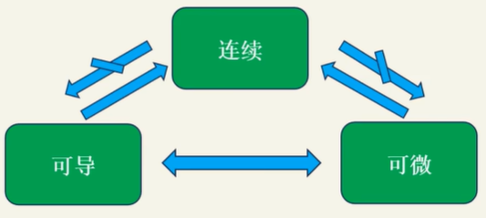
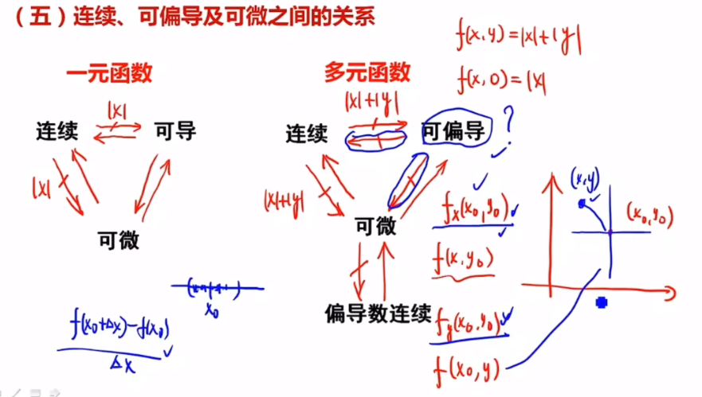

# 连续/可导/可微/可积

## 连续

> 对图像的直观理解：图像是连续不断的。
>
> 该点极限存在且和该点函数值相同。

### 定义
设函数 $f$ 在 $U(x_{0})$ 邻域内有定义，若满足：
$$
\lim_{x \to x_{0}} f(x) = f(x_{0})
$$
则称 $f$ 在点 $x_{0}$ 连续。

### 增量形式定义
记：
- 自变量增量 $\Delta x = x - x_{0}$
- 函数值增量 $\Delta y = f(x_{0}+\Delta x) - f(x_{0})$

当 $\Delta x \to 0$ 时，若满足：
$$
\lim_{\Delta x \to 0} \Delta y = 0
$$
则称 $f$ 在点 $x_{0}$ 连续。  *（与极限定义等价）*

### 连续性的三个判定条件

函数 $f$ 在 $x_{0}$ 处连续需同时满足：

1. $\lim\limits_{x \to x_{0}} f(x)$ 存在（$x_{0}$ 处有极限）
2. $f(x_{0})$ 存在（$x_{0}$ 处有定义）
3. $\lim\limits_{x \to x_{0}} f(x) = f(x_{0})$（极限值等于函数值）

### 增量形式定义

记：
- 自变量增量 $\Delta x = x - x_{0}$
- 函数值增量 $\Delta y = f(x_{0}+\Delta x) - f(x_{0})$

当 $\Delta x \to 0$ 时，若满足：
$$\lim_{\Delta x \to 0} \Delta y = 0$$
则称 $f$ 在点 $x_{0}$ 连续。*（与极限定义等价）*

### 连续性的三个判定条件
函数 $f$ 在 $x_{0}$ 处连续需同时满足：
1. $\lim\limits_{x \to x_{0}} f(x)$ 存在（$x_{0}$ 处有极限）
2. $f(x_{0})$ 存在（$x_{0}$ 处有定义）
3. $\lim\limits_{x \to x_{0}} f(x) = f(x_{0})$（极限值等于函数值）

## 可导

> 对图像的理解：图像是光滑的。
>
> 不严谨：存在垂直切线（导数无穷）

### 定义
设函数 $y=f(x)$ 在点 $x_{0}$ 的某邻域 $U(x_{0})$ 内有定义，若极限：
$$
\lim_{x \to x_0} \frac{f(x) - f(x_0)}{x - x_0}
$$
存在，则称 $f$ 在点 $x_{0}$ **可导**，该极限称为 $f$ 在 $x_{0}$ 处的**导数**，记作 $f'(x_0)$。若极限不存在，则称 $f$ 在 $x_0$ 处**不可导**。

### 增量形式定义
记：
- 自变量增量 $\Delta x = x - x_0$
- 函数值增量 $\Delta y = f(x_0 + \Delta x) - f(x_0)$

导数可表示为：
$$
f'(x_0) = \lim_{\Delta x \to 0} \frac{\Delta y}{\Delta x} = \lim_{\Delta x \to 0} \frac{f(x_0 + \Delta x) - f(x_0)}{\Delta x}
$$

### 导数的三种等价定义形式
① 标准形式：
$$
\lim_{x \to x_0} \frac{f(x) - f(x_0)}{x - x_0}
$$
② 增量形式：
$$
\lim_{\Delta x \to 0} \frac{f(x_0 + \Delta x) - f(x_0)}{\Delta x}
$$
③ 变量替换形式（令 $h = x - x_0$）：
$$
\lim_{h \to 0} \frac{f(x_0 + h) - f(x_0)}{h}
$$

### 几何意义
导数 $f'(x_0)$ 表示曲线 $y=f(x)$ 在点 $(x_0, f(x_0))$ 处切线的斜率：
- $\Delta x$ 为自变量的变化量
- $\Delta y$ 为函数值的变化量
- 当 $\Delta x \to 0$ 时，$\frac{\Delta y}{\Delta x}$ 的极限即为切线斜率

### 可导和连续的关系

#### **结论1**：**可导一定连续，连续不一定可导**

##### 图像直观理解

可导：光滑

连续：连绵不断

##### 定义直观理解

函数连续定义：$$\lim_{\Delta x \to 0} \Delta y = 0$$

函数可导的定义：$$\lim_{\Delta x \to 0} \frac{\Delta y}{\Delta x} \text{ 极限存在}$$

**可导一定连续**：假如$$\frac{\Delta y}{\Delta x}$$分子不为0，当分母趋近于0时，极限一定不存在，趋近于正无穷或者负无穷因此分母一定为0，即函数连续。

**连续不一定可导**：$$\Delta{y}$$为0，$$\frac{\Delta y}{\Delta x}$$零比零型极限不一定存在

#### 严格证明

##### 可导 ⇒ 连续

设 $f(x)$ 在 $x_0$ 处可导，即存在 $f'(x_0)$ 满足：
$$
\lim_{\Delta x \to 0} \frac{\Delta y}{\Delta x} = f'(x_0)
$$
其中 $\Delta y = f(x_0 + \Delta x) - f(x_0)$

构造无穷小量：
$$
\varepsilon = \frac{\Delta y}{\Delta x} - f'(x_0) \quad (\Delta x \to 0 \text{时} \ \varepsilon \to 0)
$$

两边同时乘$$\Delta x$$变形得函数增量表达式：
$$
\Delta y = f'(x_0)\Delta x + \varepsilon \Delta x
$$

当 $\Delta x \to 0$ 时：
$$
\lim_{\Delta x \to 0} \Delta y = 0 \implies \lim_{x \to x_0} f(x) = f(x_0)
$$
故 $f$ 在 $x_0$ 处连续。

##### 反例说明（连续 ⇏ 可导）
以 $y = \sqrt[3]{x}$ 在 $x=0$ 处为例：

1. **连续性验证**：
   $$
   \lim_{x \to 0} \sqrt[3]{x} = 0 = f(0)
   $$
   满足连续定义。

2. **不可导性验证**：
   $$
   f'(0) = \lim_{h \to 0} \frac{\sqrt[3]{h} - 0}{h} = \lim_{h \to 0} \frac{1}{h^{2/3}} = +\infty
   $$
   导数趋向无穷，故不可导。

 以下情形会导致连续但不可导：
   - 存在垂直切线（导数无穷）
   - 存在尖点（左右导数不相等）
   - 振荡间断（如 $y=x\sin(1/x)$ 在 $x=0$ 处）

## 可微

### 概念引入

设一边长为 $x_{0}$ 的正方形，它的面积 $S = x_{0}^{2}$。  
若边长增量为 $\Delta x$，则面积增量：
$$
\Delta S = (x_{0} + \Delta x)^{2} - x_{0}^{2} = 2x_{0}\Delta x + (\Delta x)^{2}
$$

**直观理解**：  
当 $x_{0}$ 有微小增量 $\Delta x$ 时，面积增量 $\Delta S$ 可近似用第一部分 $2x_{0}\Delta x$ 代替，误差为 $(\Delta x)^{2}$（关于 $\Delta x$ 的高阶无穷小量）。

### 定义

设函数 $y = f(x)$ 在点 $x_{0}$ 的某邻域 $U(x_{0})$ 内有定义。当 $x_{0}$ 有增量 $\Delta x$（$x_{0} + \Delta x \in U(x_{0})$）时，函数增量为：
$$
\Delta y = f(x_{0} + \Delta x) - f(x_{0})
$$

**可微的判定**：  
若存在常数 $A$，使得 $\Delta y$ 可表示为：
$$
\Delta y = A\Delta x + o(\Delta x)
$$
则称 $f$ 在点 $x_{0}$ **可微**，并称 $A\Delta x$ 为 $f$ 在 $x_{0}$ 的**微分**，记作 $dy$，即：
$$
dy = A\Delta x
$$

**关键性质**：  
- 微分 $dy$ 与增量 $\Delta y$ 仅相差一个高阶无穷小量。  
- 当 $A \neq 0$ 时，$dy$ 是 $\Delta y$ 的**线性主部**（$\Delta x$ 的线性函数）。  

### 可微和可导的关系

**结论**2：  函数 $ f $ 在点 $x_{0} $ 处可微的**充要条件**是 $ f $ 在 $ x_{0} $ 处可导，且微分系数 $ A = f'(x_{0}) $。

#### 证明

##### 必要性（可微 ⇒ 可导）
若 $ f $ 在 $ x_{0} $ 可微，由定义：  
$$
\Delta y = A\Delta x + o(\Delta x)
$$
两边除以 $ \Delta x $：  
$$
\frac{\Delta y}{\Delta x} = A + \frac{o(\Delta x)}{\Delta x}
$$
取极限 $ \Delta x \to 0 $：  
$$
f'(x_{0}) = \lim_{\Delta x \to 0} \frac{\Delta y}{\Delta x} = A
$$
即 $ f $ 在 $ x_{0} $ 可导，且 $ A = f'(x_{0}) $。

##### 充分性（可导 ⇒ 可微）
若 $ f $ 在 $ x_{0} $ 可导，即极限存在：  
$$
\lim_{\Delta x \to 0} \frac{\Delta y}{\Delta x} = f'(x_{0})
$$
由极限定义，可设：  
$$
\frac{\Delta y}{\Delta x} = f'(x_{0}) + \varepsilon \quad (\varepsilon \to 0 \text{ 当 } \Delta x \to 0)
$$
整理得：  
$$
\Delta y = f'(x_{0})\Delta x + \varepsilon \Delta x
$$
其中 $ \varepsilon \Delta x = o(\Delta x) $，故满足可微定义：  
$$
\Delta y = f'(x_{0})\Delta x + o(\Delta x)
$$
因此 $ f $ 在 $ x_{0} $ 可微，且 $ dy = f'(x_{0})\Delta x $。

#### 总结
1. **可微 ⇔ 可导**：函数在某点可微与可导等价，且微分系数 $ A $ 即为导数 $ f'(x_{0}) $。
2. **微分表达式**：  
   $$
   dy = f'(x_{0})\Delta x
   $$
   或写作 $ dy = f'(x_{0})dx $（当 $ \Delta x $ 记为 $ dx $ 时）。
3. **几何意义**：==微分 $ dy $ （近似值）是函数增量 $ \Delta y $（准确值） 的线性主部，用切线近似代替函数变化==。

 ### 连续、可导、可微之间的关系

## 可积

### 定义

#### 分割（定义1）

设闭区间 $[a,b]$ 上有 $n-1$ 个点，依次为：
$$
a = x_{0} < x_{1} < x_{2} < \cdots < x_{n-1} < x_{n} = b
$$
这些点将 $[a,b]$ 划分为 $n$ 个小区间 $\Delta_i = [x_{i-1}, x_{i}]$（$i=1,2,\ldots,n$）。  
- **分割表示**：记为 $T = \{x_{0}, x_{1}, \ldots, x_{n}\}$ 或 $\Delta_1, \Delta_2, \ldots, \Delta_n$。  
- **小区间长度**：$\Delta x_i = x_i - x_{i-1}$。  
- **分割模**：$\|T\| = \max\limits_{1 \leq i \leq n} \{\Delta x_i\}$，表示最大子区间长度。

---

#### 积分和（定义2）

设 $f(x)$ 是定义在 $[a,b]$ 上的函数，对于分割 $T = \{\Delta_1, \Delta_2, \ldots, \Delta_n\}$，任取点 $\xi_i \in \Delta_i$（$i=1,2,\ldots,n$），作和式：
$$
\sum_{i=1}^{n} f(\xi_i) \Delta x_i
$$
称为 $f(x)$ 在 $[a,b]$ 上的**积分和**（黎曼和）。

---

#### 可积性（定义3）

设 $f(x)$ 定义在 $[a,b]$ 上，$J$ 为确定的实数。若对任意 $\varepsilon > 0$，存在 $\delta > 0$，使得对 $[a,b]$ 的任意分割 $T$ 及任意选取的点集 $\{\xi_i\}$，只要 $\|T\| < \delta$，就有：
$$
\left| \sum_{i=1}^{n} f(\xi_i) \Delta x_i - J \right| < \varepsilon
$$
则称 $f(x)$ 在 $[a,b]$ 上**可积**（黎曼可积），$J$ 称为 $f(x)$ 在 $[a,b]$ 上的**定积分**（黎曼积分），记作：
$$
J = \int_{a}^{b} f(x) \, dx
$$

### 极限表示
定积分也可用极限符号表示：
$$
J = \lim_{\|T\| \to 0} \sum_{i=1}^{n} f(\xi_i) \Delta x_i = \int_{a}^{b} f(x) \, dx
$$

### 关于可积的几个重要结论

#### 1. 可积的充分条件
① **连续函数可积**：  
   设 $ f $ 为 $[a,b]$ 上的连续函数，则 $ f $ 在 $[a,b]$ 上必可积。  
   *（连续函数在闭区间内一致连续，保证振幅可控）*

② **有限间断点的有界函数可积**：  
   若 $ f $ 在 $[a,b]$ 上有界，且只有有限个第一类间断点（跳跃间断点），则 $ f $ 在 $[a,b]$ 上可积。  
   *（间断点贡献的积分和误差可被限制）*

#### 2. 可积的必要条件
**有界性要求**：  
若函数 $ f $ 在 $[a,b]$ 上可积，则 $ f $ 在 $[a,b]$ 上必定有界。  
*（无界函数的积分和会发散，无法收敛到有限值）*

---

#### 3. 可积的充要条件（可积准则）
**定理表述**：  
函数 $ f $ 在 $[a,b]$ 上可积的充要条件是：  
对任意 $ \varepsilon > 0 $，存在分割 $ T $，使得上和 $ S(T) $ 与下和 $ s(T) $ 满足：  
$$
S(T) - s(T) < \varepsilon
$$

**关键概念**：  
- **上和 $ S(T) $**：取每个子区间上 $ f(x) $ 的上确界 $ M_i $，求和 $ \sum M_i \Delta x_i $。  
- **下和 $ s(T) $**：取每个子区间上 $ f(x) $ 的下确界 $ m_i $，求和 $ \sum m_i \Delta x_i $。  

## 多元函数

**多元函数**：可微一定可导，可微一定连续，偏导连续一定可微，偏导存在不一定连续。

可偏导不能推出连续：偏导只能管住当前偏导方向的数（该点极限趋近于某个数），其他方向管不到

同理，可偏导推不出可微：可微是全增量，跟一领域内的点上函数值都是有关系的，但是偏导只能（例如二元函数，偏导只跟两个方向上那两条线有关，决定不了其他临近点的变化趋势）。一元函数可以是因为X方向导数可以决定领域内所有函数

==连续：一维：可微<=>可导=>连续=>可积，多维：可微=>偏导数存在=>连续=>可积==

函数可微性：在某点附近局部很平（无论怎么放大放大再放大都不“尖”），光滑===>附近的坡度多大方向导数就多大，光滑说明所有方向上导数存在，但是多元偏导只能保证多个方向上（几元几个方向）的光滑。

例如下图原点，x、y、z三个方向均可导，有方向导数：

## **可微**和**可导**的区别与联系

### 一句话结论

对于**一元函数**（只有一个自变量的函数）：**可导 ⇔ 可微**。这两个概念是完全等价的，可以不加区分。

对于**多元函数**（有多个自变量的函数）：**可导 ⇒ 可微**。可微比可导的要求更严格，是可导的“升级版”。

------

### 详细解释

#### 1. 一元函数的情况 (𝑓: ℝ → ℝ)

在一元函数中，我们研究的是平面曲线（比如 𝑓(𝑥) = 𝑥²）。

- **可导**

  - **定义**：函数在某点 𝑥₀ 的**导数存在**。
  - **几何意义**：函数图像在该点存在**切线**（不能是垂直切线）。
  - **数学表达**：极限 `lim[ℎ→0] (𝑓(𝑥₀+ℎ) - 𝑓(𝑥₀)) / ℎ`存在（且有限），这个极限值就是导数 𝑓‘(𝑥₀)。

- **可微**

  - **定义**：函数在某点 𝑥₀ 的**增量（Δ𝑦）** 可以表示为**关于自变量增量（Δ𝑥）的线性函数**加上一个比 Δ𝑥 更高阶的无穷小。

  - **几何意义**：在点 𝑥₀ 附近，可以用一条直线（即切线）来**非常“好”地近似**函数本身，近似误差是 Δ𝑥 的高阶无穷小。

  - **数学表达**：存在一个常数 𝐴，使得

    `Δ𝑦 = 𝑓(𝑥₀+Δ𝑥) - 𝑓(𝑥₀) = 𝐴 · Δ𝑥 + 𝑜(Δ𝑥)`

    其中 `𝑜(Δ𝑥)`是比 Δ𝑥 更高阶的无穷小，即 `lim[Δ𝑥→0] 𝑜(Δ𝑥)/Δ𝑥 = 0`。

**为什么在一元函数中两者等价？**

因为可以证明，上面可微定义中的那个常数 `𝐴`不是别的，正好就是导数 `𝑓'(𝑥₀)`。

即：`Δ𝑦 = 𝑓'(𝑥₀) · Δ𝑥 + 𝑜(Δ𝑥)`

所以，一元函数可导就是可微，可微就是可导。**你完全可以把它俩当成一回事。**

------

#### 2. 多元函数的情况 (𝑓: ℝⁿ → ℝ)

在多元函数中，我们研究的是曲面或超曲面（比如 𝑓(𝑥, 𝑦) = 𝑥² + 𝑦²）。情况变得复杂起来。

- **可导（偏导数存在）**

  - **定义**：函数在某点 (𝑥₀, 𝑦₀) 的**所有偏导数都存在**。
  - **几何意义**：函数图像在该点沿各个坐标轴方向（𝑥轴、𝑦轴方向）都存在**切线**。
  - **数学表达**：极限 `∂𝑓/∂𝑥 = lim[ℎ→0] (𝑓(𝑥₀+ℎ, 𝑦₀) - 𝑓(𝑥₀, 𝑦₀)) / ℎ`和 `∂𝑓/∂𝑦 = lim[ℎ→0] (𝑓(𝑥₀, 𝑦₀+ℎ) - 𝑓(𝑥₀, 𝑦₀)) / ℎ`都存在。

- **可微**

  - **定义**：是一元函数可微概念的**自然推广**。函数在某点 (𝑥₀, 𝑦₀) 的**全增量（Δ𝑧）** 可以表示为**关于各自变量增量（Δ𝑥, Δ𝑦）的线性组合**加上一个比 `ρ`更高阶的无穷小，其中 `ρ = √[(Δ𝑥)² + (Δ𝑦)²]`（即动点到定点的距离）。

  - **几何意义**：在点 (𝑥₀, 𝑦₀) 附近，可以用一个**平面**（即切平面）来**非常“好”地近似**函数本身，近似误差是距离 `ρ`的高阶无穷小。这是比“存在切线”强得多的条件。

  - **数学表达**：存在常数 𝐴, 𝐵，使得

    `Δ𝑧 = 𝑓(𝑥₀+Δ𝑥, 𝑦₀+Δ𝑦) - 𝑓(𝑥₀, 𝑦₀) = 𝐴·Δ𝑥 + 𝐵·Δ𝑦 + 𝑜(ρ)`

**为什么在多元函数中两者不等价？**

可微定义中的常数 `𝐴`和 `𝐵`正好就是偏导数 `∂𝑓/∂𝑥`和 `∂𝑓/∂𝑦`。所以，**可微必然可导**（即所有偏导数必然存在）。

但是，**可导（偏导数存在）不一定可微！**

仅仅保证沿坐标轴方向的变化规律是良好的，并不能保证在所有方向（尤其是任意方向）的变化规律都是良好的。可微要求函数在点的邻域内沿**所有方向**的变化都可以用那个线性部分（切平面）来很好地描述。

**反例**：存在这样的多元函数，它在某点的所有偏导数都存在，但它在该点却**不可微**。这种函数通常看起来在这一点非常“怪异”，可能沿不同方向逼近该点会得到不同的极限。

**可微的充分条件**：如果函数在某点的**偏导数不仅存在，而且连续**，那么该函数在该点一定可微。

------

### 总结对比表

| 特征         | 可导                   | 可微                   |
| ------------ | ---------------------- | ---------------------- |
| **一元函数** | **等价**               | **等价**               |
| **多元函数** | **偏导数存在**         | **存在切平面**         |
| **关系**     | **可微 ⇒ 可导**        | **可导 ⇏ 可微**        |
| **几何意义** | 沿坐标轴方向存在切线   | 在点附近可用切平面近似 |
| **层次**     | 较低要求，**单向性质** | 较高要求，**全局性质** |

### 记忆技巧

- **一元函数**：**可微=可导**。不用担心，随便用。
- **多元函数**：**可微 ⊂ 可导**。可微是可导的子集。可微是“高级的可导”，它要求函数在一点附近不仅要有切线，还要“足够光滑”以至于能形成一个切平面。

简单来说，**可微是可导的“高级版”或“强化版”**。在多元情况下，可导是一个相对容易满足的条件，而可微则揭示了函数更深刻的局部线性性质。

## Reference

[连续/可导/可微/可积，一个视频理解清楚bilibili](https://www.bilibili.com/video/BV1Fm4y1g7Z8/?spm_id_from=333.337.search-card.all.click&vd_source=4e1dceccc918063def66c9d643674c6a)

[6分钟速通可微和可导[直观理解\]_哔哩哔哩_bilibili](https://www.bilibili.com/video/BV1CRjuzsEh9/?spm_id_from=333.337.search-card.all.click&vd_source=4e1dceccc918063def66c9d643674c6a)