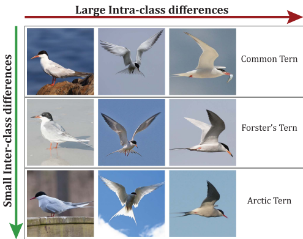
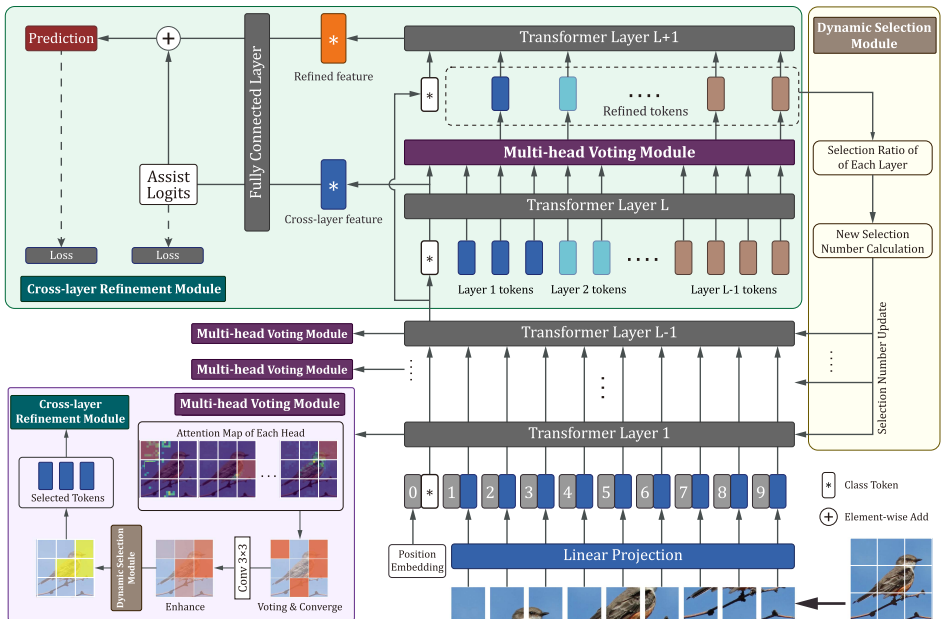
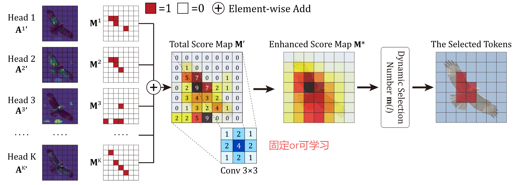
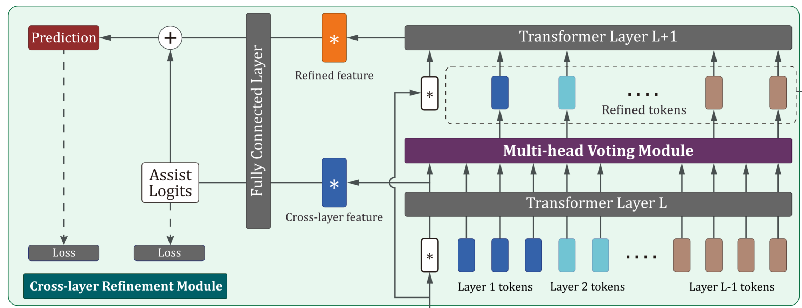
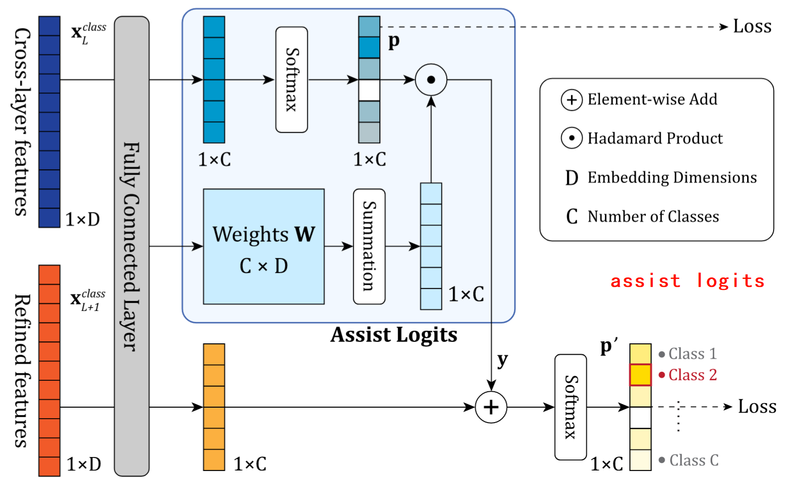
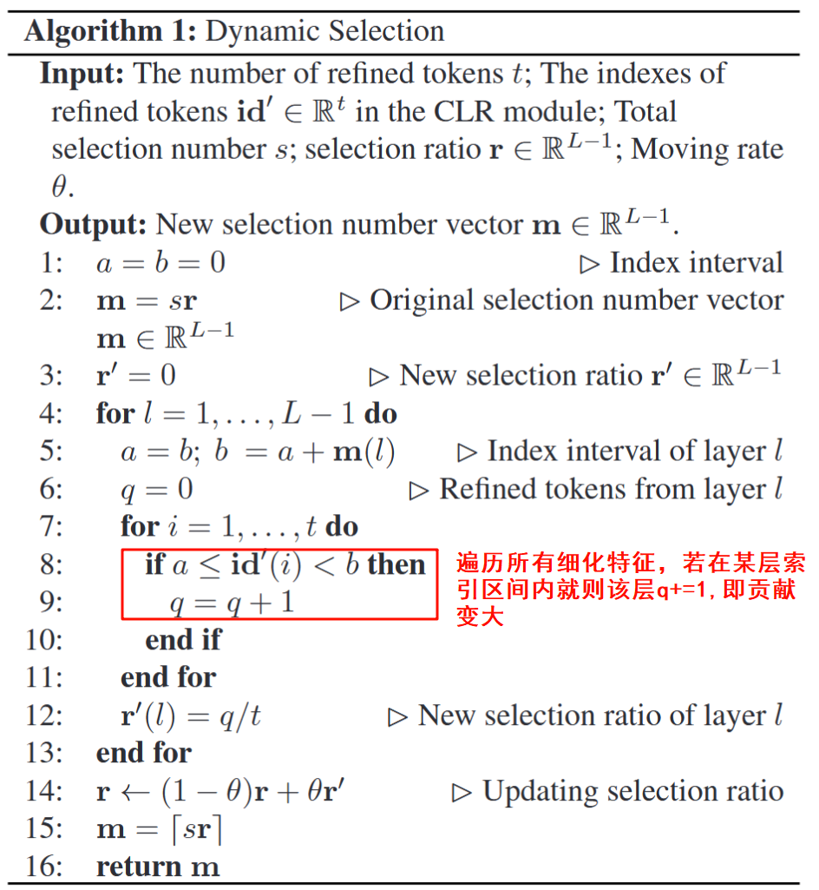
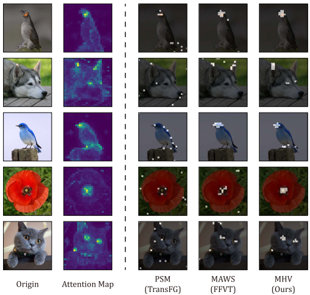
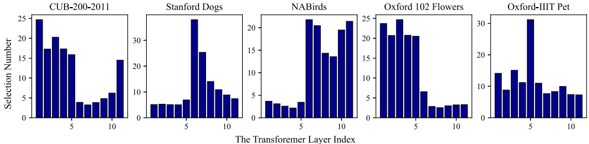

# Fine-Grained Visual Classification via Internal  Ensemble Learning Transformer

| 文章类型  | 期刊论文                                                     |
| --------- | ------------------------------------------------------------ |
| Authors   | Qin Xu 、Jiahui Wang、Bo Jiang 、Bin Luo                     |
| 作者单位  | 安徽大学智能计算与信号处理教育部重点实验室                   |
| Journal   | IEEE Transactions on Multimedia (TMM)                        |
| IF        | 7.3                                                          |
| Year      | 2023.2.13                                                    |
| citations | 72                                                           |
| DOI       | 10.1109/TMM.2023.3244340                                     |
| 源码      | <https://github.com/mobulan/IELT>                              |
| Keywords  | Ensemble learning、 Fine-grained visual classification、 Multi-head self-attention、 Vision transformer |

## 研究目的

ViT 在细粒度图像分类(FGVC) 表现不错，但忽视了 MHSA 中不同 head 的表现差异。

The abilities of estimating discriminative regions are different among different layers and heads of MHSA in ViTs

### 挑战

1. 类内差异大（鸟姿态不同）。
2. 类间差异小（外观极其相似）。
3. 标注成本高，训练困难。

## **贡献**

- 在 ViT 中引入内部集成学习框架，解决 MHSA 不同 head 和 layer 的性能差异问题。
- 投票机制（MHV），提升判别区域选择的准确性。---> 层内heads间性能不均衡问题
- 跨层融合（CLR）抑制噪声，增强特征表达。 --->层间融合性能问题
- 动态选择模块（DS）根据贡献自动调整层的权重，提升稳定性与性能。--->哪一层更重要

## 方法

|  模块   |        设计思想        |                             实现                             |                             原因                             | 其他                                                      |
| :-----: | :--------------------: | :----------------------------------------------------------: | :----------------------------------------------------------: | --------------------------------------------------------- |
| **MHV** | 多头注意力弱学习器集成 | 1. 各注意力头投票选Top-v响应区域 2. 高斯卷积抑制噪声 3. 动态选择token数量 | 不同头定位的discriminative regions 不一样，有的在图像上，有的在背景上，通过投票 的方式选出top-V | 识别图像更多的局部关键部位，找到重要的关键的特征          |
| **CLR** |      跨层特征去噪      | 1. 拼接L-1层特征 2. 二次筛选精炼token 3. 辅助Logits引导预测  | 融合跨层特征和细化特征可以减少噪声、加强特征表达能力（个人理解感觉和U-Net的跳跃连接有点像？） | 跨层特征容融合可以增强给特征表达（transformer中的每一层） |
| **DS**  |     层贡献度自适应     |  1. 根据精炼token比例计算层权重 2. 动态调整各层token选择量   | 不同Transformer层对特征学习的贡献不均衡 高层通常学习更抽象的语义特征，低层捕捉更多细节特征 通过动态调整各层的token选择数量，可以增强表现好的层，抑制表现差的层 | 每层初始分配的指标一样，迭代更新                          |

- MHSA解决头间性能不均衡问题
- DS解决层间性能不均衡问题

### MHV

### CLR

### DS

## 实验

### 消融实验

|      配置       |  CUB-200-2011  | Stanford Dogs  |  Oxford Pets   |
| :-------------: | :------------: | :------------: | :------------: |
|    基线(ViT)    |     91.04%     |     90.57%     |     93.84%     |
|    +MHV模块     | 91.48% (+0.44) | 91.75% (+1.18) | 95.04% (+1.20) |
|    +MHV+CLR     | 91.67% (+0.19) | 91.82% (+0.07) | 94.99% (-0.05) |
|     +MHV+DS     | 91.59% (+0.11) | 91.82% (+0.07) | 95.07% (+0.03) |
| **+MHV+CLR+DS** |   **91.81%**   |   **91.84%**   |   **95.29%**   |

1. MHV模块贡献最大，多头投票机制有效
2. CLR在大型数据集提升较为显著（小型数据集底层特征主导），但在小型数据集需配合DS模块才行
3. DS模块使Oxford Pets提升0.22%，可以解决小数据集的特征选择偏差问题

#### MHV

- PSM(TransFG)：区域分散导致信息冗余----->哪都看
- MAWS(FFVT)：会过度聚焦高响应区--->只看鸟头
- **MHV(Ours)**：均衡折中--->看关键且多个

## DS

1. 小型数据集(Oxford Pets)：底层特征主导（Layer1-3占比78%）
2. 大型数据集(NABirds)：高层语义主导（Layer9-11占比63%）
3. 类内差异大(Stanford Dogs)：层级分布极化（Layer6独占51%）

## 不足

1. 参数增多
2. 小规模数据CLR模块不太行
3. 超参数太多
4. 兼容性差
