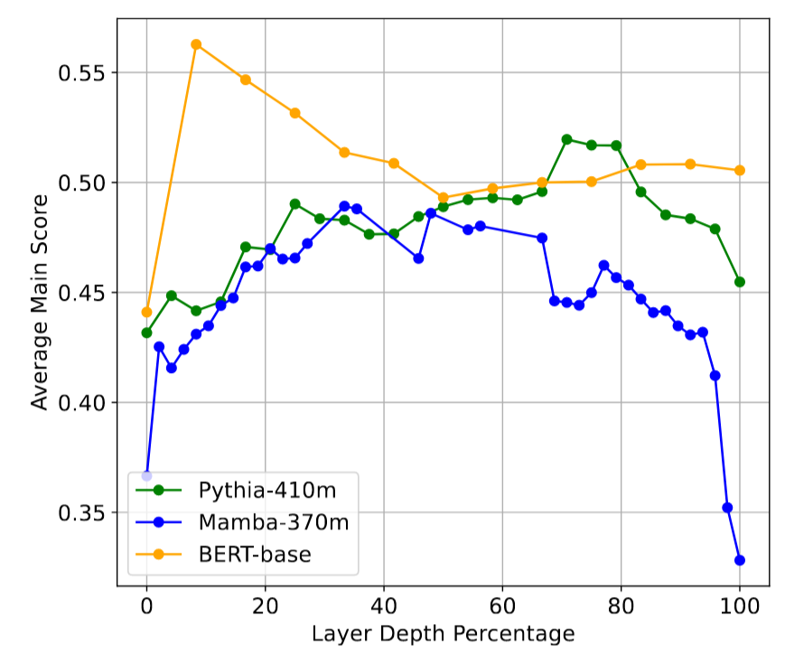
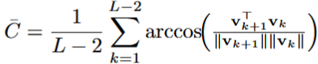
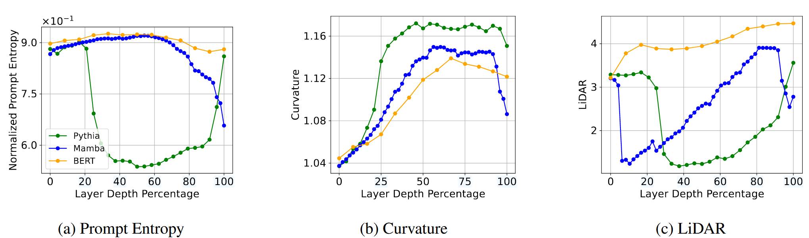
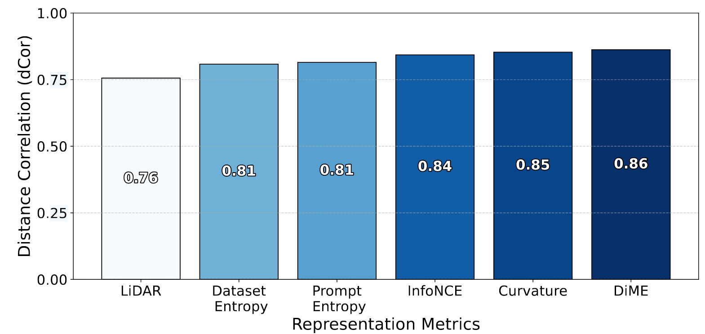
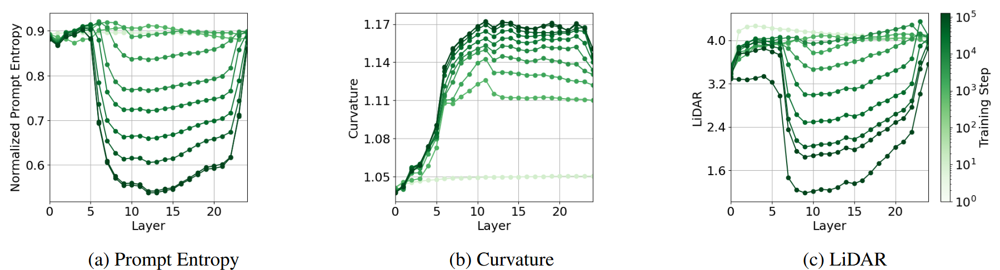
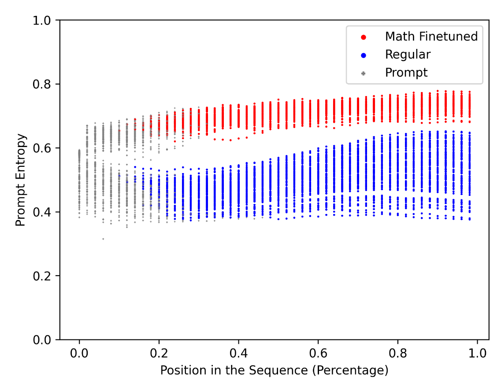
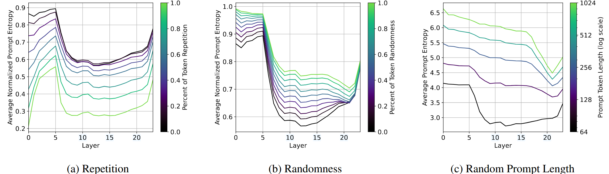

# Layer by Layer Uncovering Hidden Representations in Language Models

| 文章类型   | 会议论文                                                     |
| ---------- | ------------------------------------------------------------ |
| Authors    | Oscar Skean 、Md Rifat Arefin、Dan Zhao 、 Niket Patel 、Jalal Naghiyev 、Yann LeCun 、Ravid Shwartz-Ziv |
| Conference | university of Kentucky                                       |
| Journal    | International Conference on Machine Learning (ICML) 2025     |
| Year       | 2025.2.13                                                    |
| DOI        | 10.48550/arXiv.2502.02013                                    |

## Intro

> A common assumption: final-layer representations are the most useful for downstream tasks.
>
> Yet a fundamental question remains: **does the final layer always yield the best representation?**

### 实验结果

通过系统性分析，发现中间层在多种下游任务中往往表现出更优的性能。

中间层的下游准确率通常比最后一层高出 16%。下图表示中等深度层提供了特别强的表示（中间层在**信息压缩和噪声抑制方面**找到了更好的平衡点），而最后一层可能会变得过于专业化于预训练目标。

*上图展示了三种不同模型架构（Pythia-410m、Mamba-370m和BERT-base）在下游任务上的表现，通过使用每一层模型输出作为嵌入来计算32个MTEB任务的平均得分。从图中可以看出，中间层通常在下游任务上表现出色，优于最终层。*

### 统一架构：更好地了解中间层的有效性，结合三个互补观点

统一的视角有助于理解中间层如何在**保留特征(retaining features)**和**丢弃噪声(discarding noise)**之间取得平衡

#### 信息论视角 Information-theoretic

关注模型对语义信息的压缩和保留程度

#### 几何学视角 Geometric

分析token嵌入在高维空间中的展开方式

#### 不变性视角 Invariance

评估嵌入对输入扰动的鲁棒性

### Key findings and contributions

> The results challenge the default reliance on final layer embeddings and **highlight intermediate layers as potentially underutilized sources of meaningful features.**

#### 中间层持续超越最终层

在Transformer和SSM等不同架构中均观察到此现象。

#### 自回归模型的"压缩谷"(compression valley)

自回归模型在中间层表现出显著的"压缩谷"，而掩码或双向模型则变化平缓。

#### 领域通用性

视觉模型也呈现类似现象，表明训练目标是关键驱动因素。

#### CoT微调的影响

CoT微调可以重塑中间层熵，为多步推理保留潜在上下文。

## Related Work

### Understanding Neural Representations

> How deep neural networks encode and organize information.

早期研究：线性探针分析中间层表征、SVCCA等方法比较不同架构和训练模式下的特征。

局限性：多关注视觉模型或浅层网络。

**This paper:** 将分层分析扩展到大规模语言模型，强调中间层在不同架构中的特定行为。

### Layer-wise Analysis in Language Models

> Which transformer layers encode different types of information.

早期研究：BERT中间层编码语言学特征。

近期研究：中间层可能包含更鲁棒的特征，挑战最终层表征的主导地位。

**注意力下沉现象:** 注意力机制过度集中于某个词上。

中间层解码器反而不容易出现这个现象，表明中间层处理信息比更浅层或更深层可以更分散均匀。

### Compression and Generalization

> Multiple lines of research link compression and generalization performance.

1. 压缩有助于泛化。
2. 移除自监督编码器的某些层可以提高下游精度。
3. LLM嵌入常位于低维流形中。

**This paper:** 中间层瓶颈在平衡"信号"和"噪声"方面的重要性，尤其是自回归模型。

## A Unified Framework for Neural Representations

### 统一框架：矩阵熵

> **Key Takeaway:** Matrix-based entropy unifies seemingly disparate metrics of representation quality, providing a single theoretical lens for **analyzing compression, geometry, and invariance**.  
>
> 关键要点： 基于矩阵的熵统一了看似不同的表示质量指标，为分析压缩、几何和不变性提供了一个单一的理论镜头。

> inputs $x$ (e.g., tokens in a sequence) to internal hidden states $Z$. We denote $Z ∈ R^{N×D}$ as a matrix of N data samples (or tokens) in D dimensions.

矩阵熵提供了一个统一的视角来评估表征质量，并突出了局部细节和全局模式的组织方式。

> Bridging geometry, invariance, and feature locality

**$S_α(Z) = (1/(1-α)) log(∑(λ_i(K)/tr(K))^α)$**

**直观理解:** 矩阵熵衡量了Gram矩阵$K=ZZ^⊤$ 的特征值分布。

**Compression**:

少数特征占主导--->低熵--->表示高度压缩的表征  
特征值分布在多数方向上--->高熵--->表示更丰富的特征

#### 评估指标

> **Key Takeaway:** Information-theoretic, geometric, and invariance-based metrics offer complementary perspectives on representation quality that can all be understood through matrix-based entropy.
>
> 关键要点： 信息论、几何和基于不变性的指标提供了关于表示质量的互补观点，这些都可以通过基于矩阵的熵来理解。

##### INFORMATION-THEORETIC METRICS 信息论

**Prompt Entropy**：提示熵量化了 token 在嵌入空间中的传播范围。较高的熵表示更多样化、冗余更少的 token 级特征;较低的熵意味着更强的压缩。

**Dataset Entropy**：数据集层面的全局多样性度量。

**Effective Rank**：有效秩，熵的下界，反映维度缩减。

##### GEOMETRIC METRICS 几何学

**高曲率：**局部特征，方向突变
**低曲率**：全局特征，轨迹平滑
曲率高可能意味着模型关注的是词与词之间的细微差别，曲率低则可能意味着它捕捉到了更宏观的结构。

##### AUGMENTATION INVARIANCE METRICS 扰动不变性

InfoNCE：对比学习目标，鼓励匹配样本靠近，不匹配样本远离。

LiDAR：线性判别分析，衡量类内和类间散度。

DIME：基于矩阵熵，比较真实配对和随机配对

#### 核心理论结果

> **Key Takeaway**: Our theoretical framework establishes concrete connections between representation entropy and downstream performance through properties like effective rank and invariance.  
> 关键要点：我们的理论框架通过有效秩和不变性等特性在表示、熵和下游性能之间建立了具体的联系。

检查不同层的这些指标可以准确揭示网络在何处“修剪”冗余（低熵）与保留基本区别（高熵）。

##### Theorem 1 (Lower Bound via Effective Rank)

$Effective Rank(Z)≤exp(S_1(Z))$

较大的有效秩意味着较高的熵

##### Theorem 2 (Informal)

高Prompt熵促进Dataset熵增长

单个词的多样性越高，整个数据集的多样性也越好，而更好的多样性通常意味着更好的不变性（Theorem 3）和更高的下游任务性能。

##### Theorem 3 (Dataset Entropy Bounds InfoNCE)

$log(N ) − InfoNCE ≤ I(X; Z) ≤ H(Z)$ N是样本数

## Empirical Results

> **Key Takeaway**: Intermediate layers of language models consistently outperform final layers across all architectures and tasks, challenging the conventional wisdom of using final-layer representations.  
>
> 关键要点：语言模型的中间层在所有架构和任务中始终优于最终层，这挑战了使用最终层表示的传统智慧。

**实验设置:** 多种架构 (Pythia, Llama3, Mamba, BERT, LLM2Vec) 和32个MTEB任务。

**中间层在几乎在所有架构和任务中均优于最终层，平均提升2%-16%，最佳层通常位于网络中间深度。**

> **Why do these layers matter?**
>
> Intermediate layers appear to **strike a balance between retaining sufficient information (avoiding overcompression) and discarding low-level noise**.

### 架构和规模差异

> **Key Takeaway**: Different architectures exhibit distinct patterns of information compression. Autoregressive models show mid-layer bottlenecks while bidirectional models maintain more uniform trends.
> 关键要点：不同的架构表现出不同的信息压缩模式。自回归模型显示中间层瓶颈，而双向模型保持更一致的趋势。

**Encoder vs. Decoder vs. SSM**

仅解码器的 Pythia 表现出强烈的中间层熵下降，反映了其自回归目标倾向于过滤或修剪网络中间的非局部细节。明显的"压缩谷"现象。

Pythia 410M 各层平均表示指标与任务性能之间的关系。

1. 所有指标均与下游性能呈强相关性。
2. 曲率、DiME、InfoNCE相关性最强。
3. 可利用指标选择高性能层，无需任务标签。

**模型规模效应:** 更大模型中间层压缩更明显，更平滑的轨迹，更强的不变性。

**微调效应:** 微调改善增强不变性，影响Prompt熵。

**子组件分析:** 残差连接驱动中间层压缩。

### 训练过程中的变化

> **Takeaway:** Significant changes during training occur in intermediate layers and early layers stabilize quickly, supporting the detokenization hypothesis.  
>
> 要点：训练期间的重大变化发生在中间层，早期层迅速稳定下来，支持去标记化假设。

训练期间出现中间行为的强烈趋势

1. **中间层变化显著:** 中间层在训练过程中发生最大变化。
2. **Prompt熵下降:** 中间层Prompt熵随训练稳步下降。
3. **LiDAR最低:** 中间层LiDAR值最低。
4. **曲率更平滑:** 中间层曲率更平滑。
5. **早期层稳定快速:** 早期层在初始阶段后变化很小。
   - **脱token化假设:** 早期层主要负责将原始token转换为基本嵌入空间。

### CoT微调的影响

> **Key Takeaway:** CoT finetuning enables models to maintain richer context throughout their layers.
>
> 关键要点： CoT 微调使模型能够在整个层中保持更丰富的上下文。

Qwen 2.5 基础模型

Qwen 2.5-Math 经过CoT微调的模型

微调模型 （Qwen 2.5-Math） 具有更高的熵，表明信息保留率更高。

**Token级Prompt熵:** 微调模型在整个序列中保持更高熵。

### 极端输入条件下的表现

**Token重复**：中间层熵降低

**随机token**：早期层熵增加

**提示长度**：非标准化Prompt熵随提示长度增加而增加

**实验结果:** 在不同极端输入条件下，中间层表现出不同的熵变化模式。

**结论:** 中间层在处理复杂或异常输入时起重要作用，选择性压缩或过滤重复模式。

## Future

进一步研究中间层压缩的潜在原因，并进行显式微调以控制压缩。

利用中间层表征可能影响fairness and bias considerations，放大潜在偏差，导致现实世界应用中的unintended disparities。要探索确保中间层表征不不成比例地强化bias的方法。
