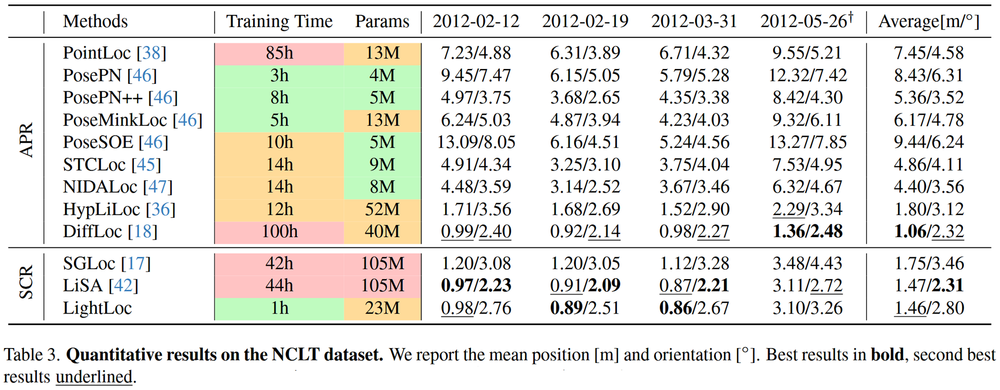

# LightLoc Learning Outdoor LiDAR Localization at Light Speed

## 任务背景

### **LiDAR Localization**

- **LiDAR定位**：通过激光雷达（LiDAR）点云数据，实时确定设备在环境中的6自由度位姿（ 6-DoF pose ）。简单来说就是让系统感知“我在世界中的哪个位置、面向哪个方向
  - 是自动驾驶、无人机、机器人等系统的核心任务
- 传统方法基于预构建3D地图（Map-based Methods），通过把当前查询点和地图匹配来估计位置
  - 存储成本
  - 通信开销

因此，越来越多研究希望用深度学习方法“记住场景”，在推理过程中，这些方法消除了对预构建地图的需求，从而降低了存储和通信要求。它们不再依赖地图，而是用深度网络学习，更适合部署在自动驾驶、机器人等设备上。

**用深度学习替代地图 →通过网络记住特定场景**

## **Regression-based Methods**

| 方法类型                                | 回归内容                                        | 优点         | 缺点     | 代表方法                  |
| --------------------------------------- | ----------------------------------------------- | ------------ | -------- | ------------------------- |
| **APR**（Absolute  Pose Regression）    | 直接从输入点云回归位置与朝向                    | 快速端到端   | 精度较差 | PointLoc, PosePN          |
| **SCR**（Scene  Coordinate Regression） | 预测点和世界坐标的对应关系     再用RANSAC求位姿 | 精度高、鲁棒 | 训练耗时 | SGLoc, LiSA, **LightLoc** |

### Challenge 

首先，大范围户外场景中，许多位置的点云非常相似。使得回归模型很难区分，这会导致模型训练很慢，甚至不收敛。LightLoc通过构建一个快速训练的分类网络，将这些相似样本区分开来，指导回归任务，提升效率。

其次，数据量大，这导致了大量的计算和存储需求。LightLoc设计了一个冗余样本下采样算法（RSD），把那些“模型已经学会了”的样本移除，专注训练困难样本，从而节省大量训练时间。

## LightLoc

LightLoc的整体框架由两部分组成：

- 右边a部分训练一个通用的“Backbone” 这里用了很多不同的场景数据一起训练，目的是让这个主干网络学到尽可能通用的特征表示，不管以后遇到什么场景，应用都能提取出有用的特征。
- 右边b部分是针对新场景的训练。我们把前面训练好的、通用的主干网络参数冻结住，不再更新，然后只训练一个新的、专门针对当前场景的预测头。
  这个阶段引I入了我们刚才提到的两个技术：SCG和RSD。

**Backbone Training**

- 使用多个场景并行训练，得到一个通用的、场景无关的特征提取器。

- 本文主干采用的是作者之前的工作SGLoc，以最大限度地减少参数数量并缩短训练时间，相应的减少了特征维度和残差层。

- 然后并行训练 N 个回归头，每个头对应 N 个场景中的一个。这种并行训练策略迫使主干学习在各种场景中有效泛化的特征。

- 作者是用 nuScenes 数据集  中的 18 个场景上用 350K 帧训练主干 f，训练了 2 天，得到 16M 的权重，可用于为新场景提取描述符。

- 在获得通用的特征主干后，按照之前的工作 ，冻结了主干网络参数，只训练特定于场景的预测头。

### **Sample Classification Guidance**

核心思想：与其让网络直接去猜一个精确的坐标，不如先让它搞清楚自己大概在哪个区域。
告诉回归模型：“**这个点可能属于哪个区域**”，引导其学习相应空间的回归分布

**定义标签：**
根据点云数据位置信息，使用 K-Means 聚类 将训练样本分成 k1 个簇。标签生成成本低且快。
一是生成标签的成本几乎为零，二是基于位置聚类比基于点云聚类要快得多。

然后冻结好的通用主干网络提取特征，然后做一个**全局最大池化**（Global max pooling），再接一个MLP多层感知机，输出一个概率分布，表示这个点云属于哪个簇的概率最大。训练这个分类器用的是**交叉损失**，还加了一个平滑因子ε，防止模型过于自信，有助于提高泛化能力。

将分类得到的概率分布添加噪声 (σ=0.1) 并归一化，再拼接到点云特征中加入SCR训练。
通过SCG技术，网络在学习回归的同时，**也得到了一个关于自己所处区域的先验信息**，有效引导学习，有助于它更快、更准确地收敛，尤其是在那些视觉相似的区域。

### **Redundant Sample Downsampling**

**目标**: 加速训练，避免在已学得很好的样本上浪费时间

**原理**: 利用滑动窗口 S内损失 ($L_m$) 的方差 (V) 来衡量样本的收敛程度

激光雷达扫得非常快快，每秒几十上白帧，而且覆盖范围又广，**很多地方的数据其实是重复的**，有些样本已经被网络学得差不多了，再反复喂给它，不仅浪费时间，还可能让模型陷入局部最优。
所以本文又提出了RSG技术RSD的作用把**那些已经学得很好的、没啥挑战性的样本暂时清理出去**，让网络可以集中精力去攻克那些难啃的硬骨头

核心思想是利用损失函数的方差来衡量一个样本的难易程度。我们通过计算滑动窗口 S 内$L_m$的方差 V 来评估样本收敛性。如果一个样本的损失方差很小，说明它已经被学得差不多了，变化不大；反之，说明网络对它的预测还不稳定，需要重点关注。

RSD主要分为四个阶段:

## **Experimental**

### **Experimental Setup**

**数据集**

- **Oxford Radar** **RobotCar**: 大规模城市环境 (约10km轨迹, 2km²)。
- **QEOxford**: Oxford数据集的高质量版本 (GPS/INS误差更小)。
- **NCLT**: 校园环境 (约5.5km轨迹, 0.45km²)，包含室内外复杂场景。

**评估指标**

- 平均位置误差 (Mean Position Error) [m]
- 平均方向误差 (Mean Orientation Error) [°]

**对比方法**

- APR (单帧/多帧): PointLoc, PosePN, DiffLoc等。
- SCR: SGLoc, LiSA。

**关键参数配置**

- **SCG**: k=25
- **RSD**: 降采样比r_d =0.25，起始比例 r_st =0.25, 停止比例 r_sp =0.85。
- **训练细节**: AdamW优化器, One-Cycle学习率策略。

### **Comparison with State-of-the-art Methods**

看表格，它的平均位置误差是0.83米，方向误差是1.12度，这两个指标在所有方法中分别排第一第二
训练时间是一小时。
最先进的Lisa方法相比，速度提高了五十倍，参数减少了四倍
再看看DiffLoc，它用了100个小时才训练完，精度也不如LightLoc。
同时LightLoc是单帧输入，而DiffLoc是多帧输入，这意味着LightLoc在实时性上更有优势。
虽然DiffLoc的方向精度更高，但综合来看，LightLoc在精度、效率和模型大小之间取得了非常好的平衡。

再来看原始的Oxford数据集，LightLoc的平均位置误差是2.67米，方向误差是1.25度，位置误差仍然是最好的，方向误差排第三。训练一小时。这说明LightLoc在不同质量的数据集上都能保持其高效性和准确性。

### **Speed**

- Oxford: 平均运行时间 29ms (LiDAR 20Hz)。
- NCLT: 平均运行时间 48ms (LiDAR 10Hz)。
- 满足实时性要求 (< 50ms / < 100ms)。

### **Ablation Study**

