# TransIFC Invariant Cues-Aware Feature  Concentration Learning for Efficient Fine-Grained  Bird Image Classification

| **文章类型**  | 期刊论文（IEEE Transactions on Multimedia）                  |
| ------------- | ------------------------------------------------------------ |
| **Authors**   | Hai Liu (Senior Member, IEEE), Cheng Zhang, Yongjian Deng, Bochen Xie, Tingting Liu (Member, IEEE), You-Fu Li (Fellow, IEEE) |
| **作者单位**  | Central China Normal University (Hai Liu, Cheng Zhang) Beijing University of Technology (Yongjian Deng)City University of Hong Kong (Bochen Xie, You-Fu Li)Hubei University (Tingting Liu) |
| **Journal**   | IEEE Transactions on Multimedia (TMM)                        |
| **IF**        |                                                              |
| **Year**      | 2023.1                                                       |
| **Citations** | 163                                                          |
| **DOI**       | 10.1109/TMM.2023.3238548                                     |
| **源码**      |                                                              |
| **Keywords**  | Deep learning, feature extraction, image classification, invariant cues, transformer |

## Intro

### 研究背景与意义

- **细粒度鸟类图像分类 (Fine-grained bird image classification, FBIC)** 是计算机视觉的基础问题。
- **目标**: 为鸟类研究者提供高精度的鸟类图像分类预测。

**重要性**:

- 全球近半数鸟类物种数量下降，保护濒危鸟类至关重要。
- FBIC有助于自动监测、数据分析和物种保护。

**挑战**: 类内差异大，类间差异小。

### FBIC面临的挑战

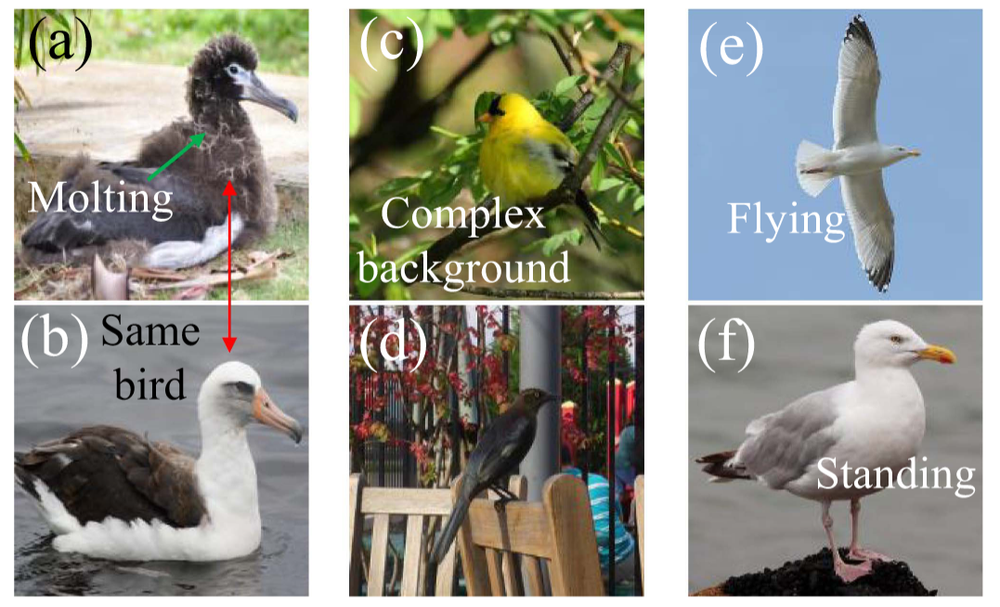

**鸟类换羽 (Molting)**：季节变化导致外观显著不同 (图1a, b)，同一鸟类在换羽期和换羽后识别困难。

**复杂背景 (Complex Background)**：自然环境或现代场景中背景复杂 (图1c, d)，树枝、树叶等遮挡目标，难以定位和识别。

**任意姿态 (Arbitrary Posture)**：鸟类姿态多样 (站立、飞行等) (图1e, f)，不同视角下的特征变化大，核心特征不易捕捉。

> ​ 个人理解：对于换羽毛和不同姿态这两种情况，从全局整体特征去识别鸟类必然会不精确，唯一解法似乎只能是找到最关键的特征（整个鸟生都不会改变的，像鸟眼睛、鸟喙、鸟脚丫）。
>
> ​ 但是其实感觉大多数鸟的眼睛都长得差不多呢？两个黑豆豆。大概是能够捕捉到更多关键信息，相对于传统的方法能够再更多的识别到一些细致的信息。  
>
> ​ 所以对于问题首先要着重思考数据对象的特征，而不是脱离数据特征去想方法。  

### 观察与动机：不变线索与细微差异

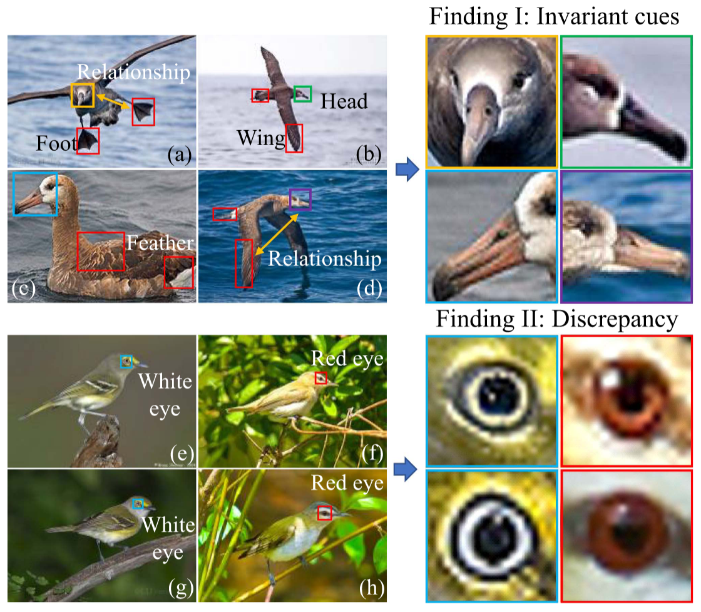

**Finding I**: 特定鸟类的**不变线索**--->**咋判断是不变特征嘞**

- 一种鸟的不同姿态会有很对中不同的特征，*如果这些特征都考虑的话会对分类结果造成干扰*
- 不同姿态下，鸟类存在核心不变特征（如头部与翅膀、喙的关系）。--->长距离语义关系，加上位置编码。

>这里应该对应后面的FFA模块，只保留前K个关键特征。
>
>(25.7.6)这个不变线索感觉怪怪的，不变线索感觉是相对于多张同一类别的图片进行分析，但是实际操作下来还是只是一张图片进行分析。也不对，每学习一个图片对应的参数会修改，如果同一类别都有这个特征，这个特征就会强化。

**Finding II**: 不同鸟类的**细微差异**

- 某些鸟类外观相似，但关键特征（如眼睛颜色）存在细微差别。
- 忽略这些微小但决定性的特征会导致误判。

核心动机：设计一种能**有效识别不变线索和细微差异**的方法，以提高FBIC性能。

> 我一开始感觉这两个发现好像讲的是一个东西，就是都关注关键部位，只不过分别从类内和类间换了个讲法，但是仔细想想发现并不是。
>
> 1. 不变线索：应该是相对于经常变化的线索、不重要的线索，关键思路应该是如何在一堆特征中找到能够不变的特征。经过Transformer处理后，虽然得到了很多特征，但有些特征可能只是背景的一部分，或者是一些干扰性的细 节，对分类没啥帮助，反而可能误导模型。
> 2. 细微差异：重点落脚在于如何关注细粒度的信息，更加细化的特征。
>
> 所以两个东西它上升来看像是一个意思，找到最核心关键的部位，但是思考的方向、实现却是不同的。

### 贡献

**核心思想**: 利用观察到的**不变线索**和**细微差异**进行高效细粒度分类。

**主要贡献**:

1. 提出TransIFC模型，首次揭示并利用鸟类图像中的**不变线索**和**长距离语义关系**。
2. 设计**HSFA** (层次化阶段特征聚合) 和 **FFA** (特征中特征抽象) 两个新模块。
3. 在CUB-200-2011和NABirds数据集上取得SOTA性能。

## tranIFC

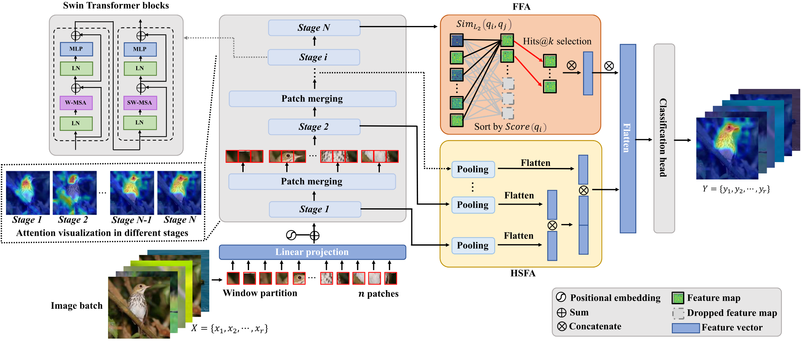

**模型架构**:

1. **特征提取主干**: Swin Transformer (处理长距离语义依赖)--->eyes and breast, shifted windowing scheme。
2. **HSFA模块**: 聚合多尺度信息。
3. **FFA模块**: 提取不变核心特征。
4. **分类头**: 最终预测。

### Feature Map Generation

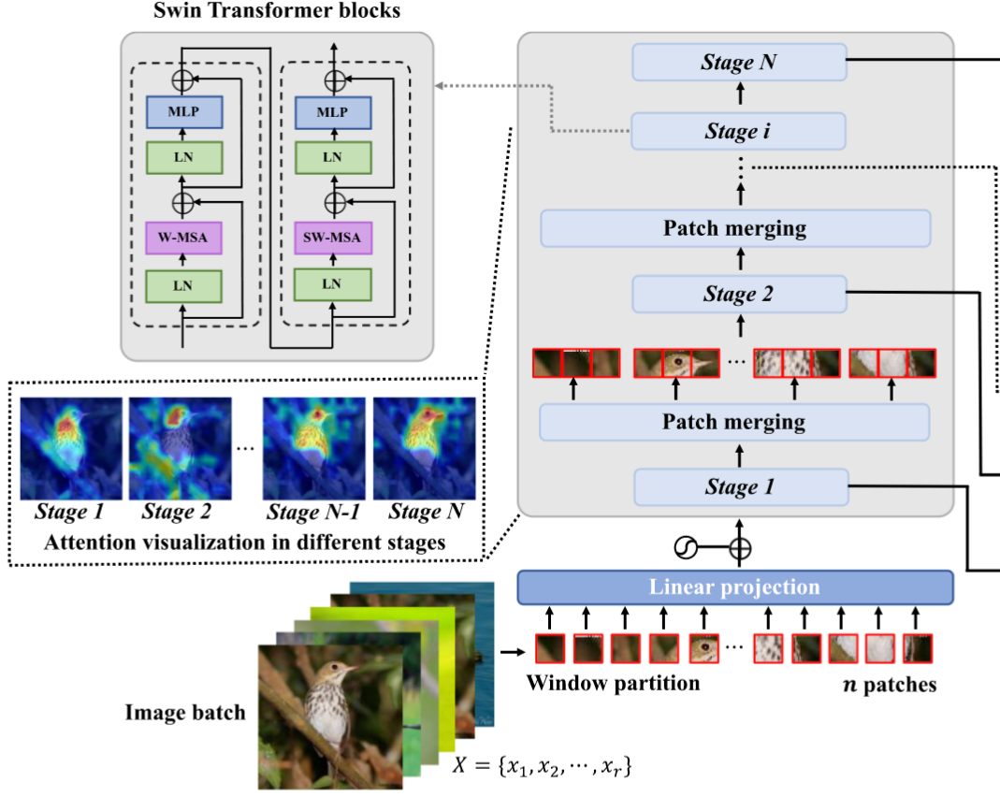

#### Phase I: 切割图像为块 (Patches)

- 输入图像 $x \in R^{H \times W \times C}$ 被分割成 $n$ 个非重叠块 $p_{i}$
- 计算公式：  
  $$
  n = \frac{H}{P_{h}} \times \frac{W}{P_{w}}
  $$
  
- 每个块 $p_{i}\in R^{P_h \times P_w \times C}$ 展平为一维向量，并通过线性投影 $E\in R^{(P_h \times P_w \times C)\times d}$ 得到 $d$-维向量 $p_{i}^{\prime}\in R^{d}$：  
  $$
  p_{i}^{\prime} = p_{i} \cdot E, \quad i \in 1,2,\ldots, n
  $$

#### Phase II: 位置嵌入 (Positional Embedding)

- Transformer对输入序列顺序不敏感，需添加位置信息
- 将块向量 $p_{i}^{\prime}$与位置嵌入 $E_{pos}$ 相加得到 $c_{0}$：  
  $$
  c_{0} = \left[ p_{1}^{\prime}, p_{2}^{\prime}, \ldots, p_{n}^{\prime} \right] + E_{pos}
  $$

- 嵌入类型可选：2D sine, learnable, relative。

#### Phase III: 通过Transformer块 (DPG策略)

- 使用 M 个 Swin Transformer 块处理 $c_0 \in R^{n \times d}$。每个块包含 W-MSA (窗口内多头自注意力) 和 SW-MSA (移位窗口多头自注意力) 以及 MLP (多层感知机)。

  $$
   \left\{\begin{array}{l}\hat{c}^{l} = \text{WMSA}\left[\text{LN}\left(c^{l-1}\right)\right] + c^{l-1}, \\c^{l} = \text{MLP}\left[\text{LN}\left(\hat{c}^{l}\right)\right] + \hat{c}^{l}, \\\hat{c}^{l+1} = \text{SWMSA}\left[\text{LN}\left(c^{l}\right)\right] + c^{l}, \\c^{l+1} = \text{MLP}\left[\text{LN}\left(\hat{c}^{l+1}\right)\right] + \hat{c}^{l+1},\end{array}\right.
  $$

- 通过 N 个stages的 Patch Merging 层分层处理。

- 最后一层输出经平均池化后与低层特征融合。

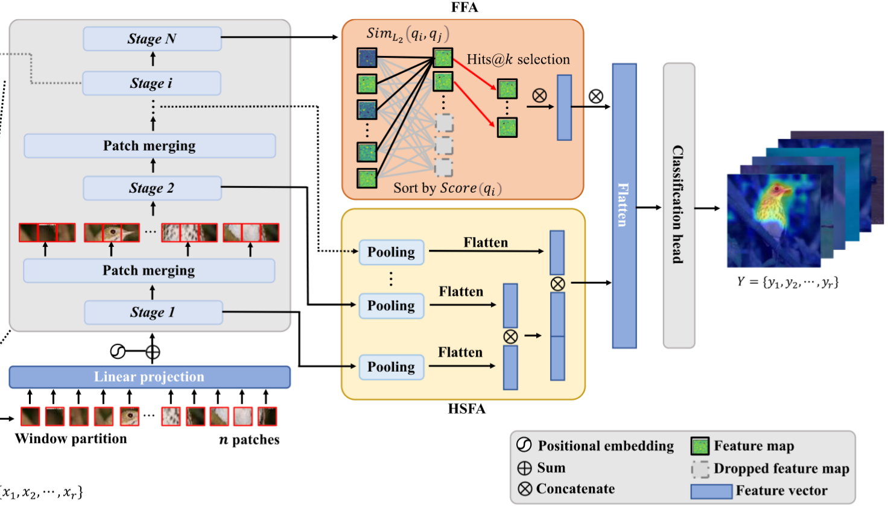

### FFA Module  {#FFA}

经过Transformer处理后，虽然得到了很多特征，但有些特征可能只是背景的一部分，或者是一些干扰性的细节，对分类没啥帮助，反而可能误导模型。FFA 的功能就是去掉这些干扰特征，提取出更具有区分度的特征。---> 不变线索

首先，FFA模块先计算当前阶段所有特征向量之间的相似度。它会给每个特征向量打一个分数discrimination score（该特征向量和其他所有特征向量的相似度总和的倒数），*如果一个特征向量跟其他所有特征都长得差不多，那它的得分就低，说明它比较普通，没啥特色；反之，如果它跟其他特征都差别很大，那它的得分就高，说明它很独特，很有价值*。最后，FFA会选出得分最高的前k个特征向量，扔掉剩下的。这样就只保留了那些最能代表当前图像内容、最具区分性的核心特征了。

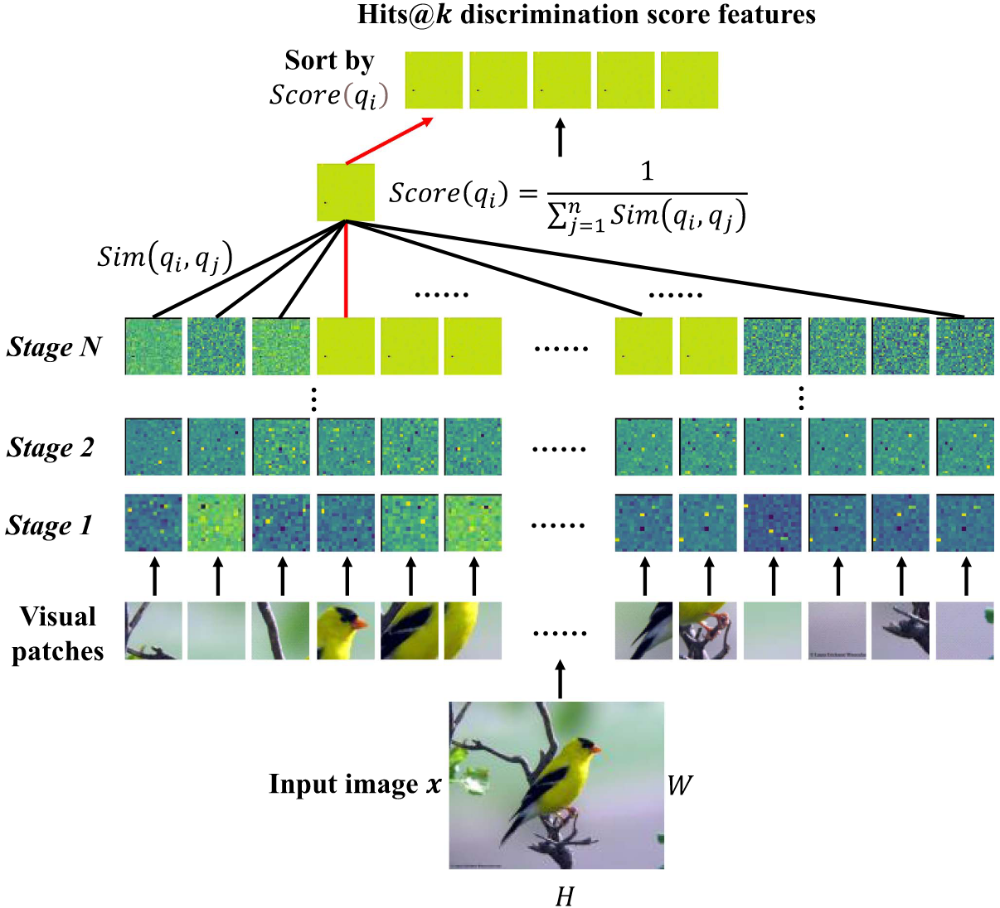

#### 1. 计算块向量间的相似度

**输入**：同一阶段中的 $n$ 个块向量 $q_i$

**方法一**：余弦相似度（Cosine Similarity）
$$
\text{Sim}_{\cos}(q_i, q_j) = \frac{q_i \cdot q_j}{\|q_i\| \cdot \|q_j\|}
$$

**方法二**：逆L2距离（Inversed L2 Distance）
$$
\text{Sim}_{L_2}(q_i, q_j) = \frac{1}{\sqrt{\sum_{k=1}^d (q_{i,k} - q_{j,k})^2}}
$$

#### 2. 计算区分度得分（Discrimination Score）

**定义**：向量 $q_i$ 与其他所有向量相似度之和的倒数
$$
\text{Score}(q_i) = \frac{1}{\sum_{j=1}^n \text{Sim}(q_i, q_j)}
$$

#### 3. 选择得分最高的 k 个 (Hits@k) 块向量作为下一阶段的输入，其余丢弃

### HSFA Module  {#HSFA}

直接将低层（包含更多细节）和高层（包含更多语义）的信息融合，帮助模型学习更精细的表示。

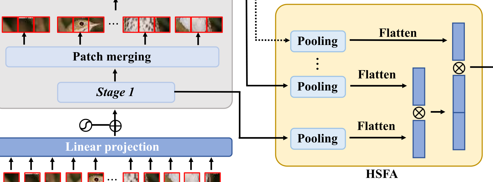

#### 1. 特征图降维处理

**操作**：对每个阶段 $i$ 的输出特征图 $M_i$ 应用最大池化（Max Pooling）  
$$
M_{i}^{\prime} = \phi(M_{i})
$$

- $\phi(\cdot)$ 表示最大池化操作  
- 输出降维后的特征图 $M_{i}^{\prime}$

---

#### 2 特征聚合  

**操作**：展平并拼接所有阶段的特征图  
$$
A = \left[ \varphi(M_{1}^{\prime}), \varphi(M_{2}^{\prime}), \ldots, \varphi(M_{N}^{\prime}) \right]
$$

- $\varphi(\cdot)$ 表示Flatten操作  
- $[\cdot]$ 为拼接操作  
- 输出聚合特征向量 $A$

---

#### 3. 分类预测  

**操作**：将聚合特征输入分类头（两层全连接 + GELU激活）
$$
\hat{y} = \text{GELU}(A \cdot W_1 + b_1) W_2 + b_2
**说明**：
$$

- $W_1, W_2$ 为可学习权重矩阵  
- $b_1, b_2$ 为偏置项  
- 输出预测结果 $\hat{y}$

### MAP-Based FBIC Model

**最大后验估计（Maximum A Posteriori Estimation, MAP）**为模型的参数训练引入了一种**贝叶斯推断的方式**，既考虑数据的拟合度，也考虑参数的先验约束，从而增强模型的泛化能力，减少过拟合风险。

#### MAP

目标是找到使得后验概率 $p(\theta | x_i, y_i)$ 最大的参数 $\theta$：
$$
\theta^* = \arg\max_\theta \prod_{i=1}^r p(\theta | x_i, y_i)
$$
根据贝叶斯公式：
$$
p(\theta | x_i, y_i) = \frac{p(x_i, y_i | \theta)p(\theta)}{p(x_i, y_i)}
$$
因为分母 $p(x_i, y_i)$与参数无关，可略去，等价于最大化：
$$
\theta^* = \arg\max_\theta \prod_{i=1}^r p(x_i, y_i | \theta) \cdot p(\theta)
$$
再取对数方便优化：
$$
\theta^* = \arg\max_\theta \left( \sum_{i=1}^r \log p(x_i, y_i | \theta) + \log p(\theta) \right)
$$

#### 结合数据

1. **似然项（拟合数据）**
    假设模型预测值 $\hat{y}_i$ 和真实标签 $y_i$ 的误差符合高斯分布：
   $$
   p(x_i, y_i | \theta) \propto \exp\left( -\frac{(y_i - \hat{y}_i)^2}{2\sigma^2} \right)
   $$
   ⇒ 损失项为：
   $$
   \sum_{i=1}^r \frac{1}{2}(y_i - \hat{y}_i)^2
   $$

2. **先验项（限制参数大小）**
    假设参数符合零均值的高斯分布，即：
   $$
   p(\theta) \propto \exp(-\|\theta\|^2)
   $$
   ⇒ 损失项为：
   $$
   \eta \|\theta\|^2
   $$

3. **总目标函数（MAP优化）**：
   $$
   L(\theta) = \frac{1}{2} \sum_{i=1}^r (y_i - \hat{y}_i)^2 + \eta \|\theta\|^2
   $$

   - 第一项是回归损失；
   - 第二项是正则化项（相当于L2正则）；
   - η 控制正则化强度。

#### 优化方法

使用的是 **AdamW** 优化器，它是对 Adam 的改进版本，能够更好地与权重衰减项（即正则项）配合，从而更稳健地训练深层神经网络。

## Experiment Results and Discussion

### 实验设置

#### 数据集

1. **CUB-200-2011**: 200类，11788张图片，鸟类小巧，特征细微。
2. **NABirds**: 700类（含性别、年龄），48000张图片，类别多，背景复杂。
3. **扩展实验**: Stanford Cars (验证方法泛化性)。

#### 对比方法

1. 传统方法: RA-CNN, MaxEnt, StackedLSTM, FixSENet-154
2. CNN-based: Cross-X, PMG-V2, API-Net
3. Transformer-based: ViT, Swin-B
4. This paper: TransIFC(只在最后一阶段使用FFA), TransIFC+ (将每一层HSFA中的max-pooling改为FFA，**既能降维又能集中重要特征**)

#### 评估指标

##### 1. 准确率 (Accuracy)

模型预测正确的样本占总样本的比例
$$
ACC = \frac{1}{r}\sum_{i=1}^{r} \mathbb{1}(y_i, \hat{y}_i)
$$

- $y_i$：第 $i$ 个样本的真实标签
- $\hat{y}_i$：第 $i$ 个样本的预测标签
- $\mathbb{1}(\cdot)$：指示函数（预测正确时为1，否则为0）
- $r$：总样本数

##### 2. 混淆矩阵 (Confusion Matrix)

分析模型在不同类别间的错误分布

### 参数设置

- 输入尺寸: 448x448 (公平比较), 224x224 (消融研究)。
- Batch Size: 8。
- 优化器: AdamW, Weight Decay: 0.05。
- 学习率: 0.0001。

### 结果

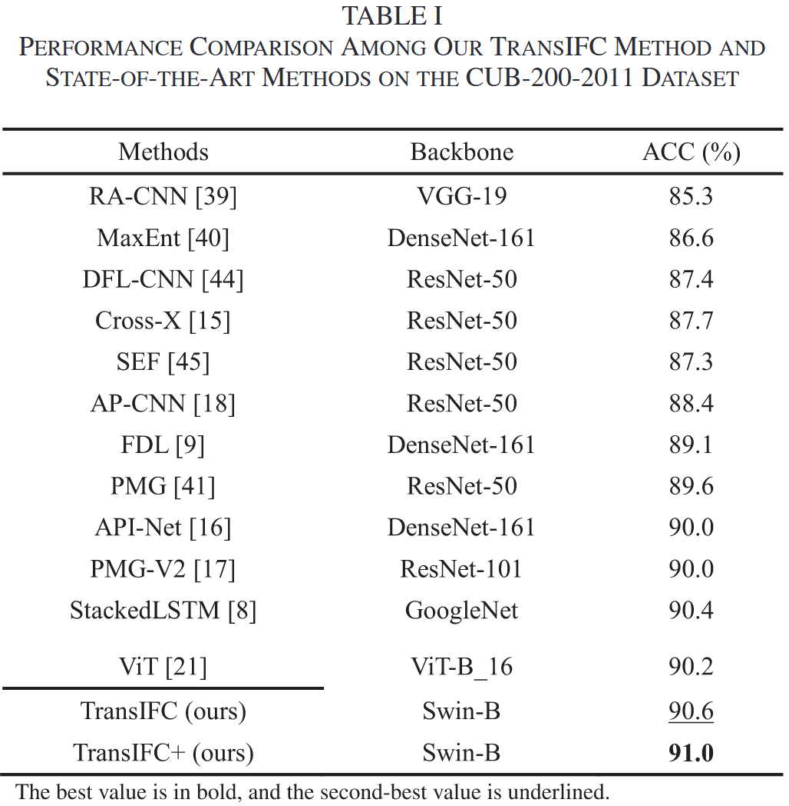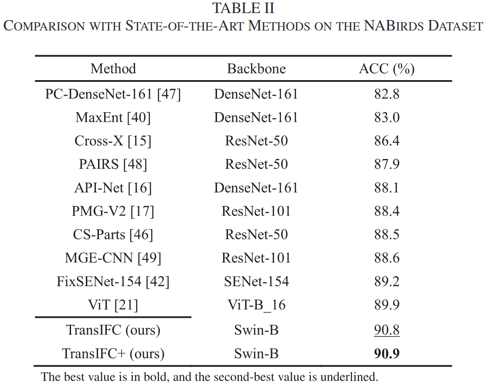

1. Transformer-based 方法通常优于 CNN-based 方法。
2. TransIFC 相比 SOTA CNN 方法提升了 0.6%。
3. TransIFC+ 相比基线 Transformer (ViT) 提升了 1.0%。
4. 证明了 HSFA 和 FFA 模块的有效性。

### 可视化

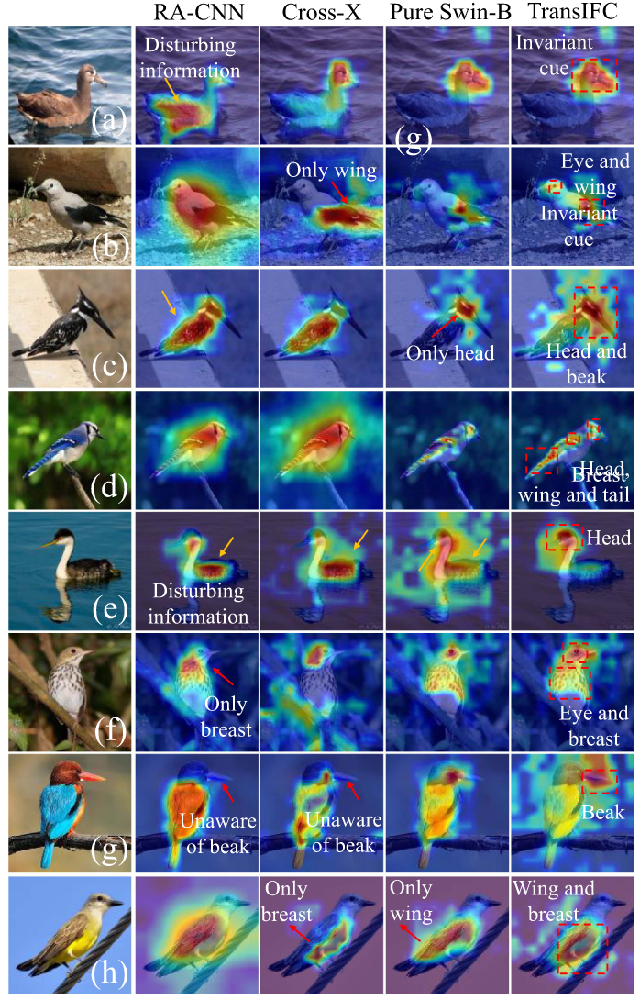

1. CNN方法 (RA-CNN, Cross-X): 易受干扰信息影响 (黄色箭头)，或关注错误区域 (如翅膀)。

2. Pure Swin-B: 关注头部等关键区域，但可能不够全面。

3. TransIFC:

   - 能识别**头部**为核心特征 (红色虚线框)。

   - 能学习**长距离依赖关系** (如眼睛与翅膀, 头部与尾部)。

   - 能有效区分**细微差异** (如翠鸟的喙, 鹦鹉的翅膀与黄色胸部)。

   - 能忽略背景干扰 (如水面倒影)。

### 混淆矩阵

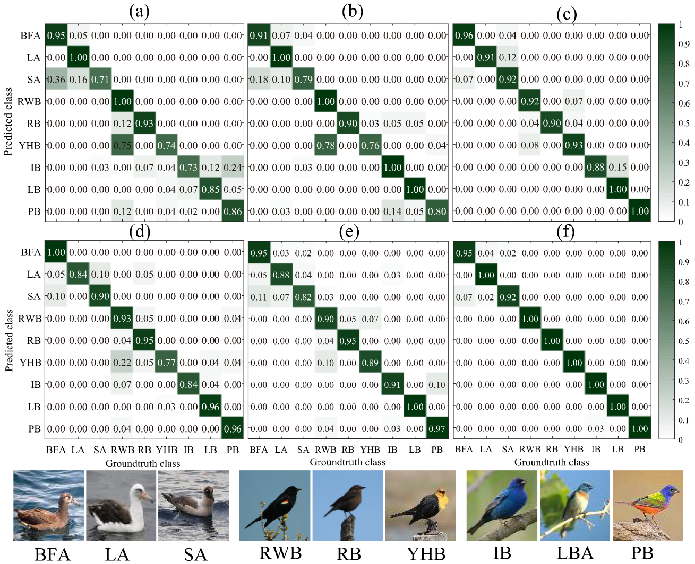

1. CNN方法 (a-c): 在相似类别间混淆较多，对角线外颜色较浅。
2. Transformer方法 (d-f): 混淆程度相对较低。
3. TransIFC (f): 对角线颜色最亮，表明在区分相似类别方面表现最佳。

### 消融实验

#### 超参数与位置嵌入

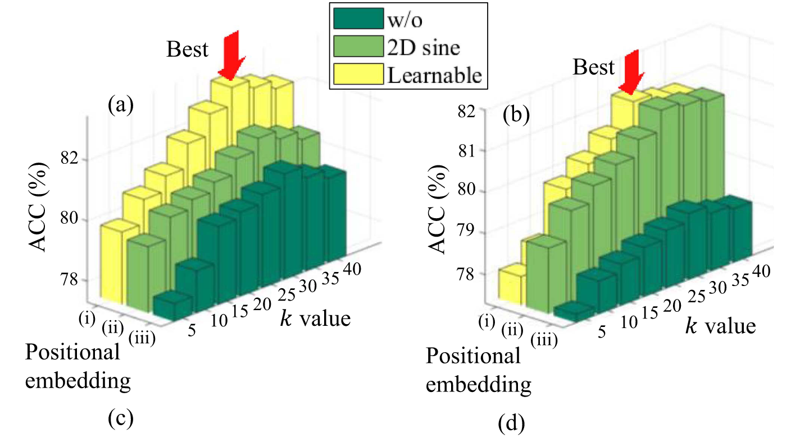

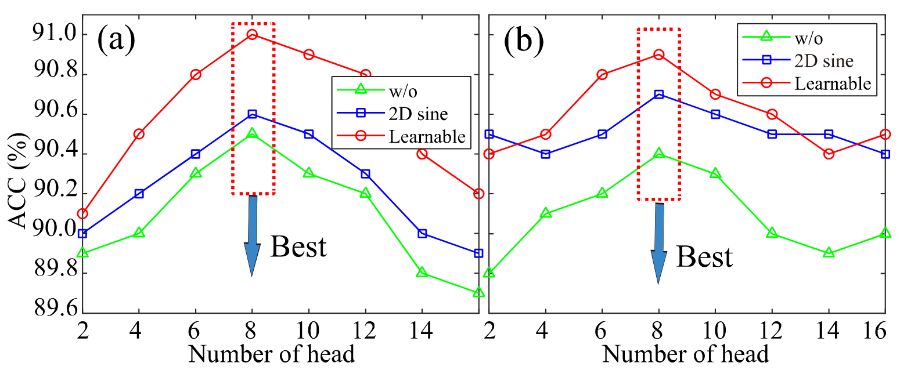

1. FFA模块中 k 值 (选择Top-k特征) 的影响。 **k 值**: 存在最优值，本文选择 k=30。
2. 自注意力机制中头数 (Head Number) 的影响。**头数**: 存在最优值，本文选择 8。
3. 不同位置嵌入方式的影响 (Learnable, 2D Sine, None)。**位置嵌入**: 存在重要性，Learnable PE 性能最佳。

#### HSFA与FFA模块效果

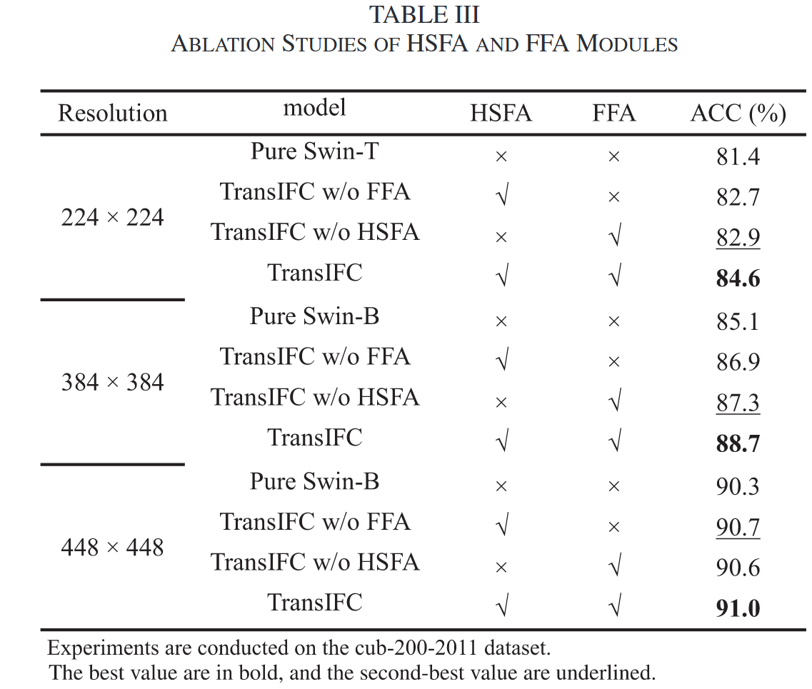

### 分辨率

提高输入分辨率有助于捕捉更多细节，从而提升分类精度。对于NABirds数据集，高分辨率带来的提升更为显著。

### Stanford Cars数据集

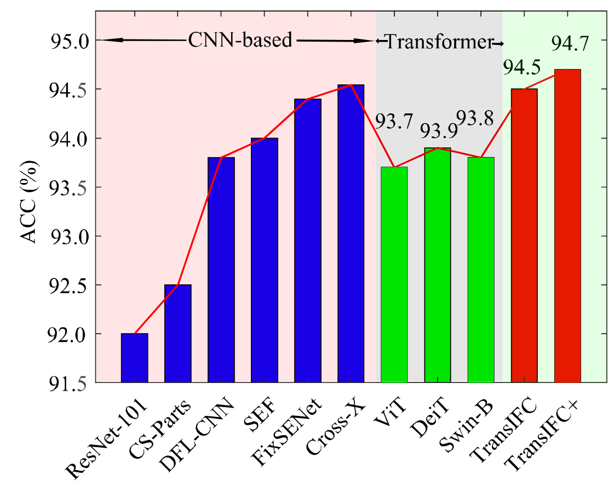

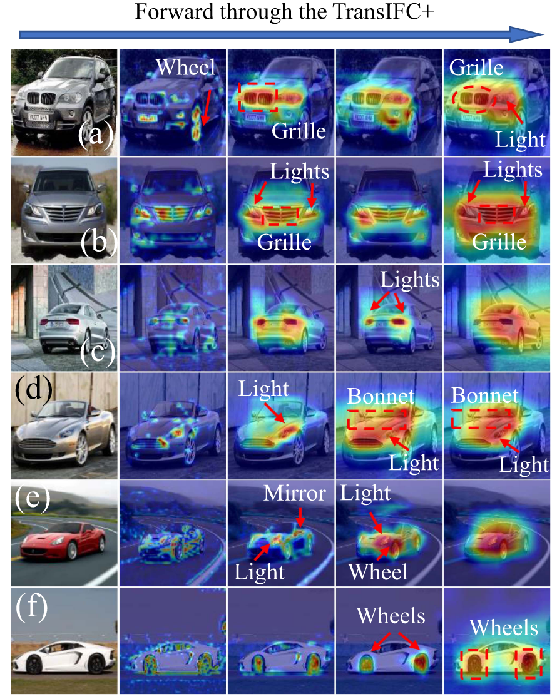

1. TransIFC+ 能识别汽车的关键部件 (灯, 格栅, 轮胎)。
2. 能学习长距离依赖关系 (两侧车灯, 前后轮)。
3. 与鸟类图像类似，汽车识别也依赖于**不变线索**和**长距离关系**。

## Future

1. 更轻量级的版本
2. 视频场景下的应用
