# CML-bench: A framework for evaluating and enhancing LLM-powered movie scripts generation

| **期刊 :**                                                   |
| ------------------------------------------------------------ |
| **发表日期: 2025-10-01 **                                    |
| **作者**: Mingzhe Zheng; Dingjie Song; Guanyu Zhou; Jun You; Jiahao Zhan; Xuran Ma; Xinyuan Song; Ser-Nam Lim; Qifeng Chen; Harry Yang |
| **摘要**: *Large Language Models (LLMs) have demonstrated remarkable proficiency in generating highly structured texts. However, while exhibiting a high degree of structural organization, movie scripts demand an additional layer of nuanced storytelling and emotional depth-the 'soul' of compelling cinema-that LLMs often fail to capture. To investigate this deficiency, we first curated CML-Dataset, a dataset comprising (summary, content) pairs for Cinematic Markup Language (CML), where 'content' consists of segments from esteemed, high-quality movie scripts and 'summary' is a concise description of the content. Through an in-depth analysis of the intrinsic multi-shot continuity and narrative structures within these authentic scripts, we identified three pivotal dimensions for quality assessment: Dialogue Coherence (DC), Character Consistency (CC), and Plot Reasonableness (PR). Informed by these findings, we propose the CML-Bench, featuring quantitative metrics across these dimensions. CML-Bench effectively assigns high scores to well-crafted, human-written scripts while concurrently pinpointing the weaknesses in screenplays generated by LLMs. To further validate our benchmark, we introduce CML-Instruction, a prompting strategy with detailed instructions on character dialogue and event logic, to guide LLMs to generate more structured and cinematically sound scripts. Extensive experiments validate the effectiveness of our benchmark and demonstrate that LLMs guided by CML-Instruction generate higher-quality screenplays, with results aligned with human preferences.* |
| **摘要翻译**:                                                |
| **期刊分区**:                                                |
| **DOI:** [10.48550/arXiv.2510.06231](https://doi.org/10.48550/arXiv.2510.06231) |
| **Tags:**                                                    |

## 文章基本框架

### 背景

大型语言模型 (LLMs) 在结构化文本生成方面表现出色，但在捕捉电影剧本所需的"灵魂"（微妙的叙事和情感深度）方面存在不足。

电影剧本的特殊性：

- **严格结构**: 需遵循特定格式规则（场景标题、动作描述、对话块）。
- **要素组织**: 需精心安排故事元素、角色发展和情节推进。
- 当前 LLMs 生成的剧本常缺乏：
  - 情感深度 (Emotional depth)
  - 主题意义 (Thematic meaning)
  - 叙事连贯性 (Narrative coherence)

### 目的

探索评估和改进 LLM 生成剧本的新方法

### 结论

- 构建 CML-Dataset
- 通过分析发现三个关键质量维度：对话连贯性 (DC)、角色一致性 (CC)、情节合理性 (PR)。
- 提出 CML-Bench: 一个基于上述三个维度的量化评估框架。

## 结果与讨论

### 构建数据集 CML-Dataset

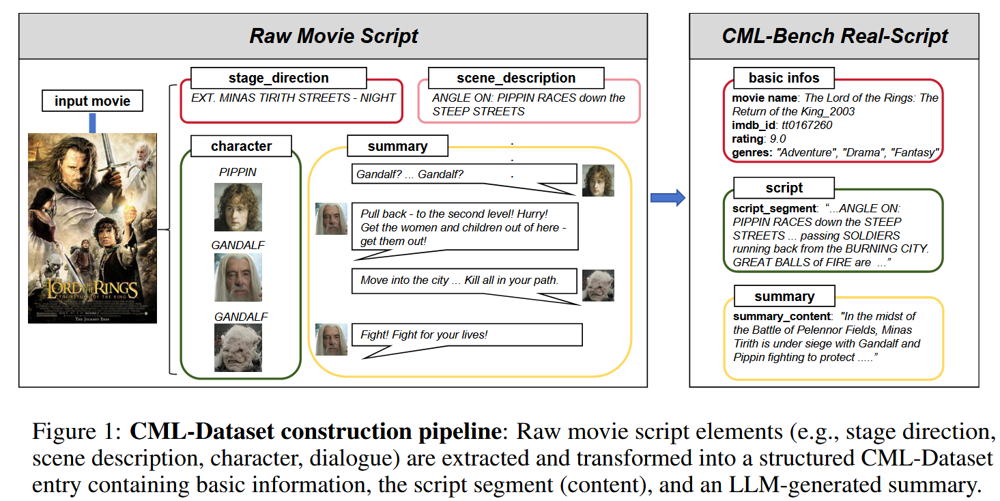

- 源数据：MovieSum 训练集 (1800 部剧本) → IMDb 高分筛选 100 部经典影片，覆盖多类型
- 处理：用 Qwen 抽取每部 15–20 场连贯片段(约6k tokens)，再为片段生成 200 tokens 摘要(主要事件、人物和行动)
- 输出：100 组 (片名$m_i$,IMDbID$s_i$, 剧本片段$c_i$, 摘要$a_i$) (60 万 tokens)

使用：讲摘要$a_i$输入给大模型，然后使用本文提出的评估指标将生成的剧本与真实内容 $c_i$ 进行比较.

### CML-Bench

| 维度                      | 子指标             | 计算                             | 输入                                              | 计算                                                         |
| ------------------------- | ------------------ | -------------------------------- | ------------------------------------------------- | ------------------------------------------------------------ |
| **Dialogue Coherence**    | DC1 相邻话题相似度 | 余弦相似度                       | 有序对白序列 $D=[d₁…d_N]$                         | ① Gemma Embed($d_i$) → $e_i$ ② $\cos(e_i , e_{i+1})$ ③ 取平均 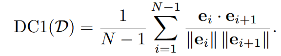 |
|                           | DC2 对话主题集中度 | 归一化熵：关键词分布熵越小越好   | 有序对白序列 $D=[d₁…d_N]$                         | ① Gemma 关键词提取 $K_i$ ② 全局词分布 $P(w)$ ③ 归一化熵  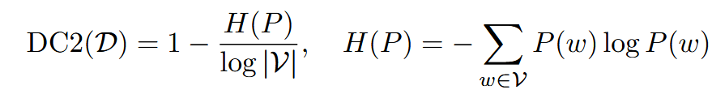 |
|                           | DC3 语言创造性     | 创意特征分析嵌入的相似度越小越好 | 创意语言特征集 $F=[f₁…f_L]$                       | ① Gemma 提取 F（隐喻、新奇搭配等） ② Qwen 生成分析句 $a_i$ ③ Embed($a_i$) → $ea_i$ ④ 平均两两 cos 相似度 $S$；得分 $1-S$ 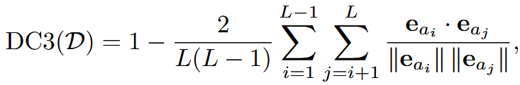 |
| **Character Consistency** | CC1 情绪稳定性     | 情绪序列变化幅度                 | 每角色 c 情绪序列 $E_c=[e₁…e_{Nc}]$，$e∈{-1,0,1}$ | ① 相邻情绪差绝对值和 $\frac{\sum|e_{t+1}-e_t|}{2}$ ② $1-\text{平均差值}$  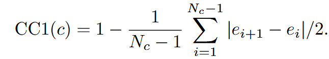 |
|                           | CC2 角色原创性     | 角色语言独特度 + 自身一致性      | 每角色 distinctive-utterance 集 → $u_c$ 嵌入      | ① inter-char 不相似度：$1-\text{mean}_{i<j}\cos(u_i,u_j)$ ② intra-char 自一致性 $S_c$（同角色句间平均 cos） ③ 加权组合  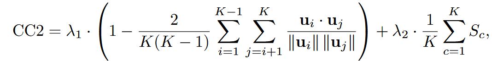 |
|                           | CC3 言行匹配度     | 意图-后续动作嵌入相似度          | 意图句 $I=[i₁…i_L]$ & 后续动作 $A$                | ① Embed($i_k$)→$u_k$ ② Embed($a$)→$w_a$ ③ 每意图取 $\max_a \cos(u_k,w_a)$ ④ 平均所有意图 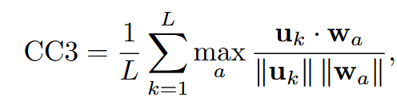 |
| **Plot Reasonableness**   | PR1 事件序列连贯   | 相邻事件的余弦相似度             | 关键事件/场景描述 $S=[s₁…s_K]$                    | ① Embed($s_i$) ② 相邻 cos 相似度平均 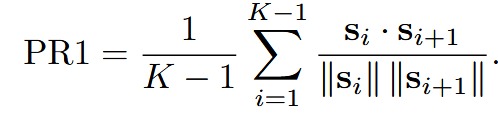 |
|                           | PR2 因果密度       | 事件间显式因果数量               |                                                   | ==文中好像前后矛盾，正文里写的是PR1的概念，附录写的是因果密度== |
|                           | PR3 叙事创新性     | 叙事模式嵌入相似度越低越好       | 叙事模式集 $P=[p₁…p_P]$（倒叙、多线等）           | ① Gemma 提取 $p_i$ ② Qwen 分析创新度 → $n_i$ 嵌入 ③ 两两相似度 $S$ 与 centroid 相似度 $\bar{S}$ ④ 得分加权 $1-(\lambda_3S+\lambda_4\bar{S})$ 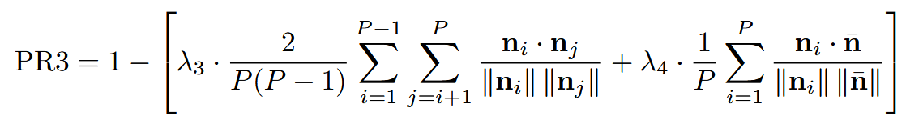 |

- **Gemma-2-2B** 做轻量特征提取，**Qwen-32B** 做复杂语义/因果推理
- 指标值域 [0,1]，越高越好

### CML-Instruction

剧本生成的结构化提示

1. **prompt_start_llm**  

   开头设定

   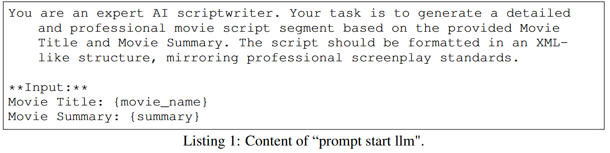

2. **prompt_instructions_content**  

   ​	内容细节

   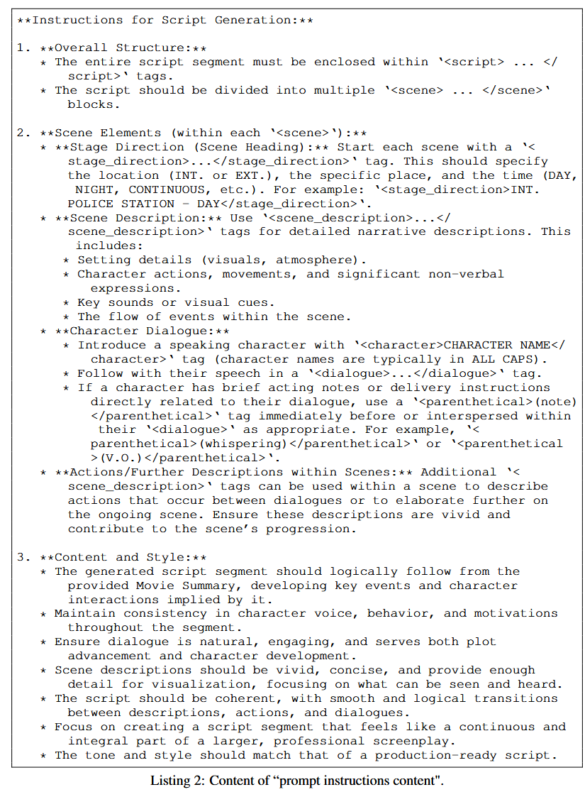

3. **prompt_example**  

   给 2 场完整 XML 示例

4. **prompt_end_llm**  
   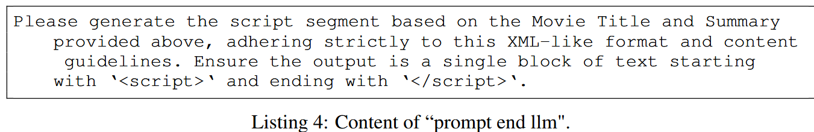

## 实验

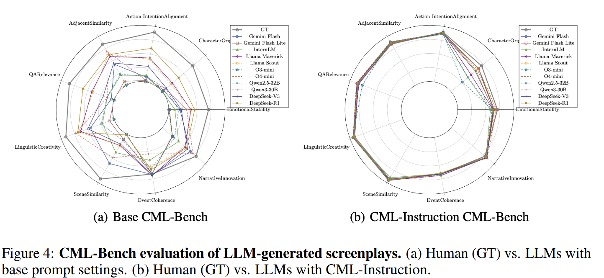

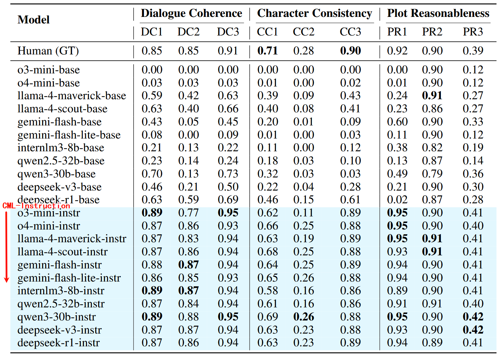

> 很多基础模型生成的剧本缺乏结构化元素（例如场景、角色、对话标签），但是指标计算依赖这些结构，缺失导致得分为 0，使用 CML-Instruction 后，模型输出结构更规范，得分会显著提升

1. 基础提示下所有模型在 DC/CC 多数指标远低于人类
2. CML-Instruction 使各模型 DC1/CC1/PR1 等指标显著提升
3. CC2**原创性**依旧很低，是 LLM 短板

**人工验证**

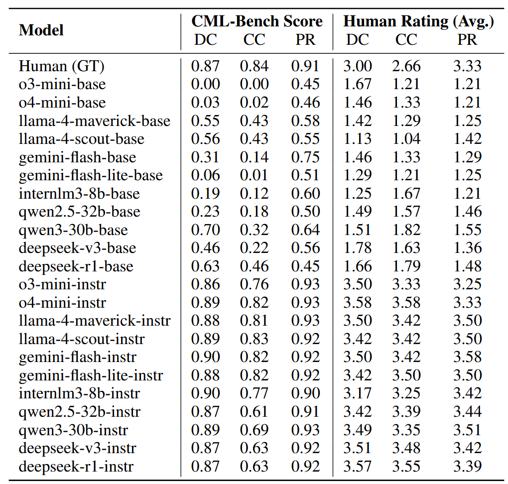

CML-Bench 与人工平均 Spearman ρ = 0.80，显著相关

## 文章亮点思考

> 1、本文有什么优缺点？你是否对某些内容产生了疑问？
> 2、你是否认为某些研究方式可以改进，如何改进？
> 3、这篇文章好在哪里，只有当自己理解这篇文章好在哪里，为什么能发在顶刊上，那么你也就基本理解了全篇文章的基本内容。

## 借鉴学习（125）

> “125”原则

### 1个思路

> 该文章可能为自己未来研究带来的新思路，不论是实验方法，还是研究思路上。

### 2个绘图

> 选取并分析文章中设计精良的图表，学习其形式和色彩搭配。

### 5个句式

> 提炼并记录文章中的五个优秀句式，并尝试在未来的写作中模仿使用。

This quality gap drives our research into new methods for evaluating and improving LLM-generated screenplays.

这种质量差距推动了我们对评估和改进 LLM 生成剧本的新方法的研究。