# Understanding Adversarial Robustness from Feature  Maps of Convolutional Layers

| **期刊:**IEEE Transactions on Neural Networks and Learning Systems (**IEEE TNNLS**) (Full Paper) |
| ------------------------------------------------------------ |
| **作者: **Cong Xu; Wei Zhang; Jun Wang; Min Yang             |
| **发表日期: **2024-01-29                                     |
| **摘要:** *The adversarial robustness of a neural network mainly relies on two factors: model capacity and antiperturbation ability. In this paper, we study the anti-perturbation ability of the network from the feature maps of convolutional layers. Our theoretical analysis discovers that larger convolutional feature maps before average pooling can contribute to better resistance to perturbations, but the conclusion is not true for max pooling. It brings new inspiration to the design of robust neural networks and urges us to apply these findings to improve existing architectures. The proposed modifications are very simple and only require upsampling the inputs or slightly modifying the stride configurations of downsampling operators. We verify our approaches on several benchmark neural network architectures, including AlexNet, VGG, RestNet18, and PreActResNet18. Non-trivial improvements in terms of both natural accuracy and adversarial robustness can be achieved under various attack and defense mechanisms. The code is available at https://github.com/MTandHJ/rcm.* |
| **摘要翻译:**神经网络的对抗鲁棒性主要取决于两个因素：模型容量和抗扰动能力。本文从卷积层特征图的角度研究了网络的抗扰动能力。理论分析表明：在平均池化前采用更大尺寸的卷积特征图可增强抗扰能力，但该结论对最大池化层不成立。这为鲁棒神经网络设计提供了新思路，并促使我们应用这些发现改进现有架构。所提出的改进方案极为简便，仅需对输入进行上采样或微调下采样操作符的步长配置。我们在多个基准神经网络架构（包括AlexNet、VGG、ResNet18和PreActResNet18）上验证了这些方法。在多种攻击与防御机制下，我们实现了自然准确率和对抗鲁棒性方面的显著提升。 |
| **期刊分区:**一区                                            |
| **DOI:** [10.1109/TNNLS.2024.3360463](https://doi.org/10.1109/TNNLS.2024.3360463) |
| **笔记创建日期:** 2025/10/13 11:22:39                        |

## 1️⃣ 文章基本框架

### 背景

* 深度神经网络对微小扰动非常敏感
* 神经网络的对抗鲁棒性（Adversarial Robustness）取决于
  * 模型容量
  * 抗扰动能力
* 有时候会出现自然准确度提升，但是鲁棒性下降，表明模型容量增加并不一定增强其抗干扰能力

### 目的

从**抗扰动能力**角度提高模型的对抗鲁棒性

### 结论

* 对于平均池化层，扩大其特征图可以增强对抗鲁棒性；最大池化层不行
* 扩大特征图的方法
  * 上采样（特征冗余使得效率低）
  * 减小步长（效果更加）

## 2️⃣ 结果与讨论

> 对于文章中出现的关键图表及其说明、关键机理解释以及文章的重点内容，进行详细记录和解读。

### 数据以及数据来源

数据集：CIFAR-10, CIFAR-100, CIFAR-10-C (常见语义不变扰动)

基线防御：AT, ALP, TRADES, MART, FAT, AWP, DAJAT

评估指标：

- **自然精度 (Natural Accuracy)**: 模型容量的体现。
- **一致精度 (Consistent Accuracy)**: 抗扰动能力的体现 (扰动后分类不变的比例)。
- **对抗鲁棒性 (Adversarial Robustness)**: 自然精度和一致精度的交集。

攻击：FGSM, PGD, DeepFool, AutoAttack (主要评估指标)

架构：ResNet18, AlexNet, VGG16, PreActResNet18 (及其他)

### 思路

#### 通过理论分析和简单实验证明

> 证明：在平均池化层中，特征图放大，对抗鲁棒性越好；最大池化层不满足

1. 如何定义对抗鲁棒性

   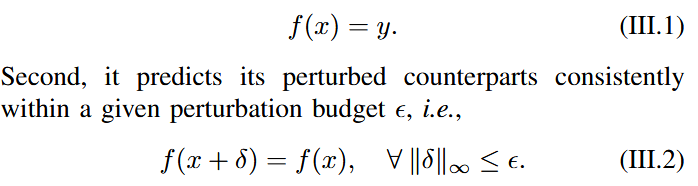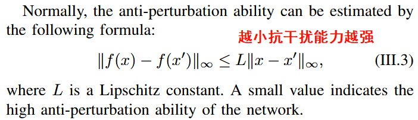

2. 如何在卷积中体现对抗鲁棒性

   1. 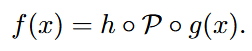卷积操作：卷积+池化+激活

   2. 卷积+池化占主导 

      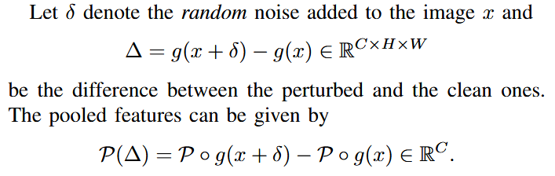

   3. $$γ$$越小抗干扰能力越强，p是概率

      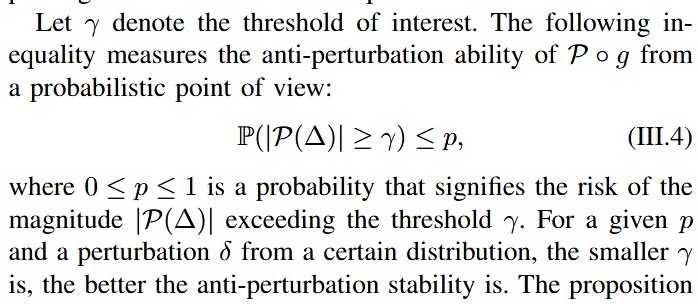

3. 通过不等式得出特征图大小和$$\gamma$$的关系

   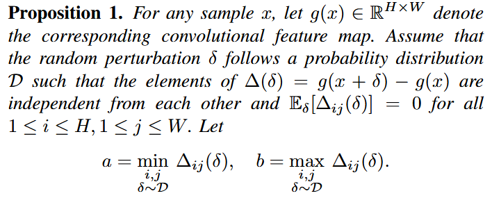

   1. 平均池化层：特征图越大$$\gamma$$越小，抗干扰能力越强

      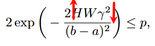

   2. 最大池化层：特征图越大$$\gamma$$越大，抗干扰能力越弱

      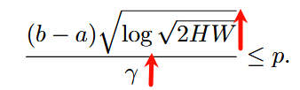

4. 简单小实验证明：在平均池化层中，特征图放大，对抗鲁棒性越好；最大池化层不满足

   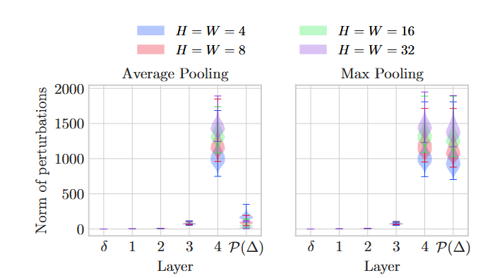

#### 提出将特征图放大方法

1. 上采样
   1. 最邻近插值
   2. 双线性插值
2. 缩短步长

#### 实验

##### 上采样 versus 缩短步长

1. 上采样和缩短步长不同放缩比较：缩放因子不超过2成立。对于上采样缩放因子较多可能时因为上采样时特征冗余较多

   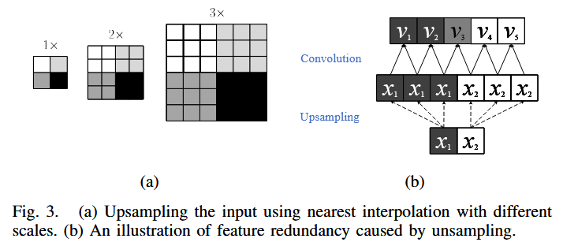

   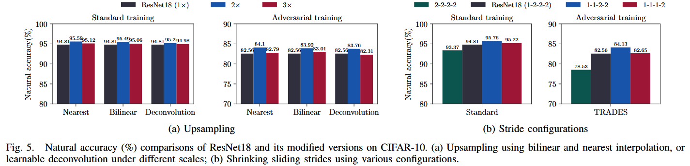

2. 多种缩短步长方式比较：过度收缩会导致感受野对全局信息了解滞后，进一步解释上一个实验结果图

   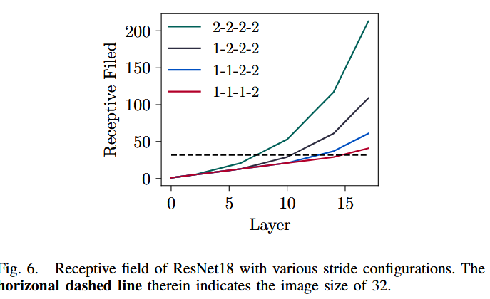

3. 上采样和缩短步长内存消耗对比：缩短步长方法更好：上采样消耗内存大——上采样会产生很多冗余特征、效率低

   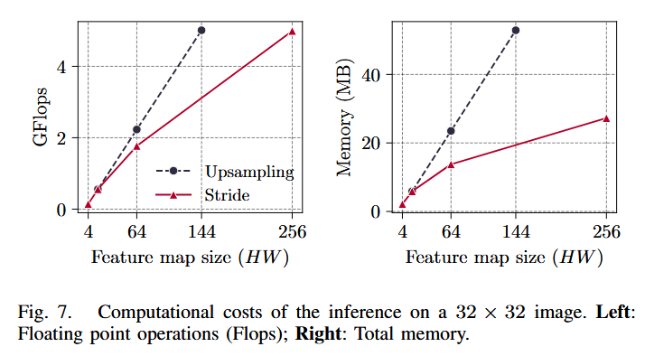

4. 上采样和缩短步长总精度对比：不同缩放因子

   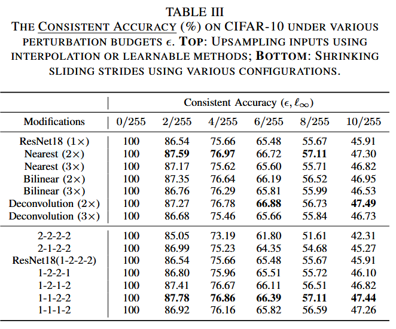

##### 平均池化 versus 最大池化

1. 放大特征图，平均池化和最大池化扰动范数对比：仅平均池化满足特征图变大抗鲁棒性越好

   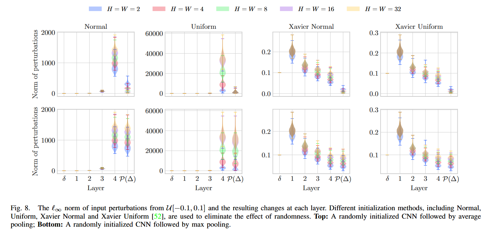

2. 真实数据上效果：较小的特征图尺寸更适合最大池化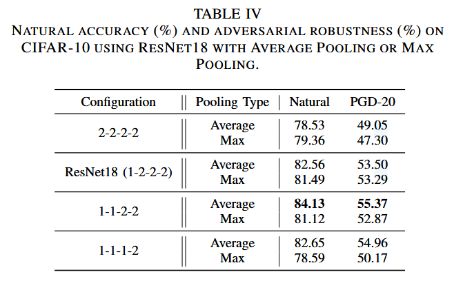

   可视化：特征大的分的更好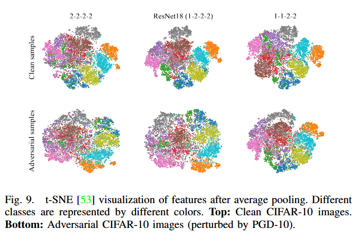

   ==但是这个可视化好像跟`平均池化 versus 最大池化`没啥关系应该不能放到这里吧==

##### 作用与不同架构上

1. cnns

   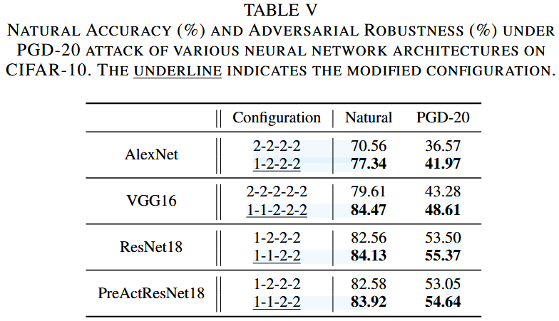

2. vits

   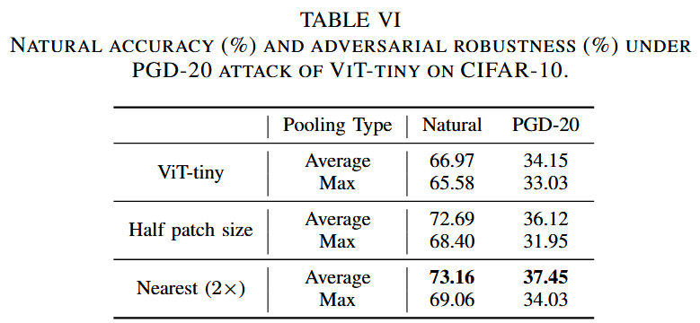

##### 和不同防御方式结合

1. 几乎都上升

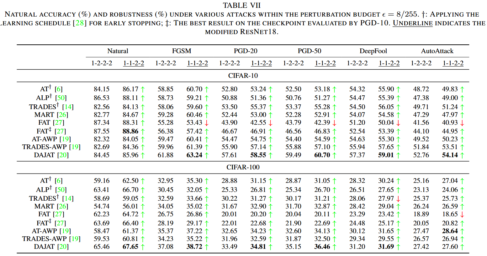	

2.多次实验验证统计意义

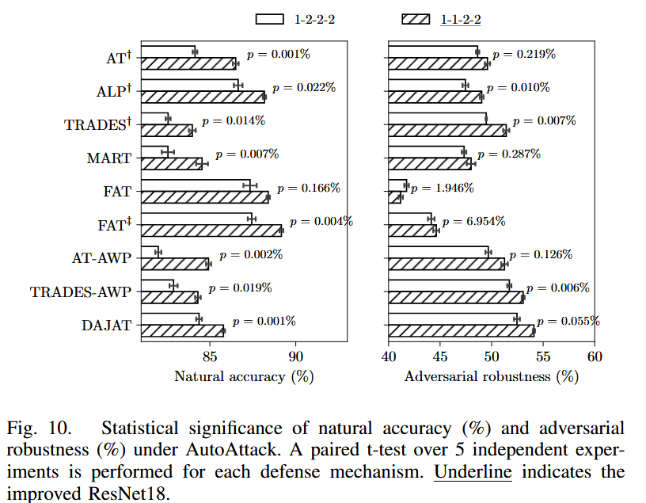

3. CIFAR-10-C常见扰动数据集

   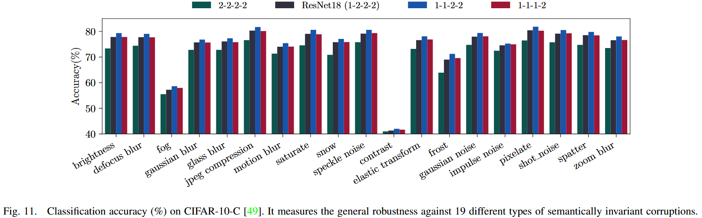

##### 补充:梯度混淆比较

> 说明我的方法不是因为别的原因导致的精度提生

防止精度上升是因为改进方式导致攻击失效：

1. 随着预算的增加，修改后的 ResNet18 的鲁棒性可以成功降至零。===>证明攻击有效

   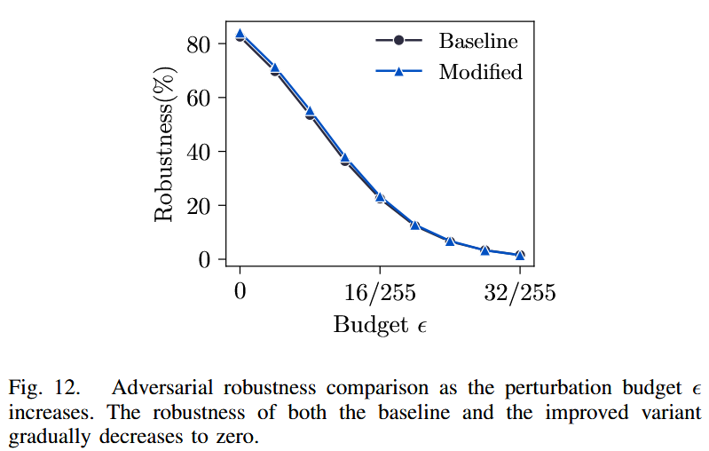

2. 针对性设计攻击，保证攻击绝对有效

   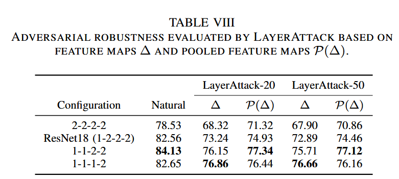

### 结论	

1. 缩短步长方式由于上采样
2. 平均池化满足：当特征图增大时抗干扰能力提升；最大池化不满足
3. 放大特征图方法在不同框架上依然起作用
4. 放大特征图方法与其他防御方法结合可以提升抗干扰能力

## 3️⃣ 文章亮点思考

#### 优点：

方法很简单，并从多个角度分析验证实验证明方法的有效性，实验说服力强

#### 缺点：

#### 可改进的地方：

## 4️⃣ 借鉴学习（125）

> “125”原则

### 1个思路

可以通过理论分析和一个简单的小实验证明方法的有效性

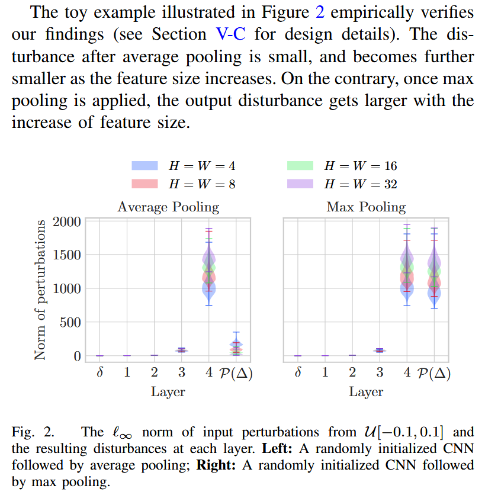

### 2个绘图

> 选取并分析文章中设计精良的图表，学习其形式和色彩搭配。

### 5个句式

We implement the baselines including AT [6], ALP [50], TRADES [14], MART [26], FAT [27], AWP [19] and DAJAT [20], **identically following the settings suggested in the original papers**.

我们实现的基线包括 AT [6]、ALP [50]、TRADES [14]、MART [26]、FAT [27]、AWP [19] 和 DAJAT [20]，**完全遵循原始论文中建议的设置**。

**Although** a further increase in size **hurts the performance slightly**, this degradation in consistency accuracy **is much more acceptable than that** in natural accuracy.

尽管尺寸的进一步增加会稍微损害性能，但一致性精度的下降比自然精度的下降更容易接受。