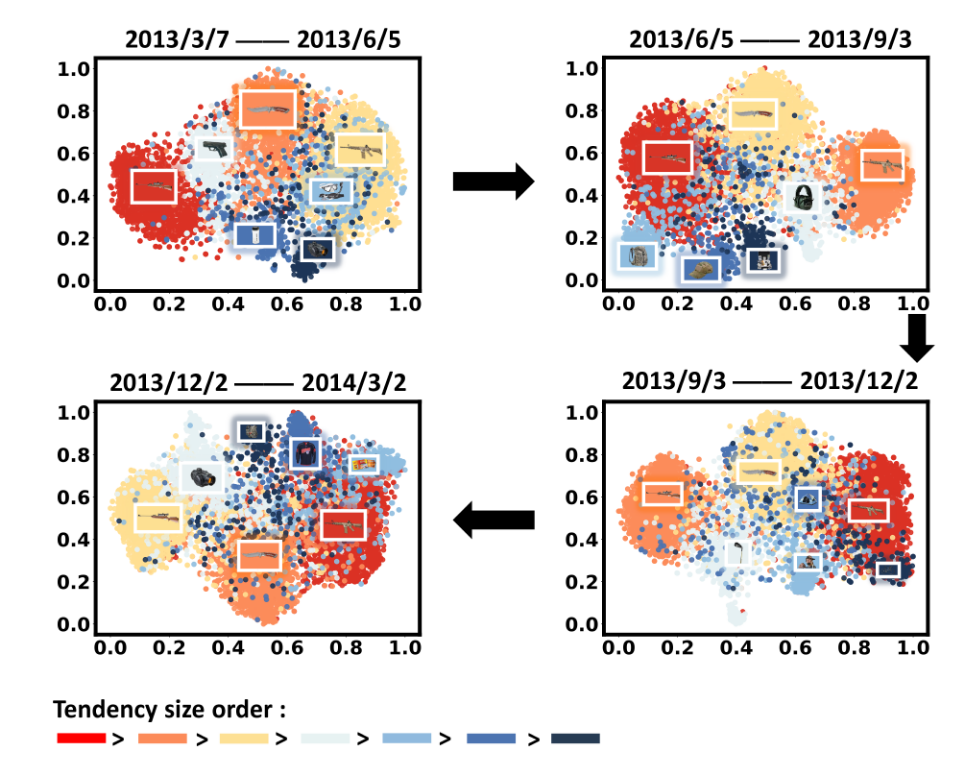
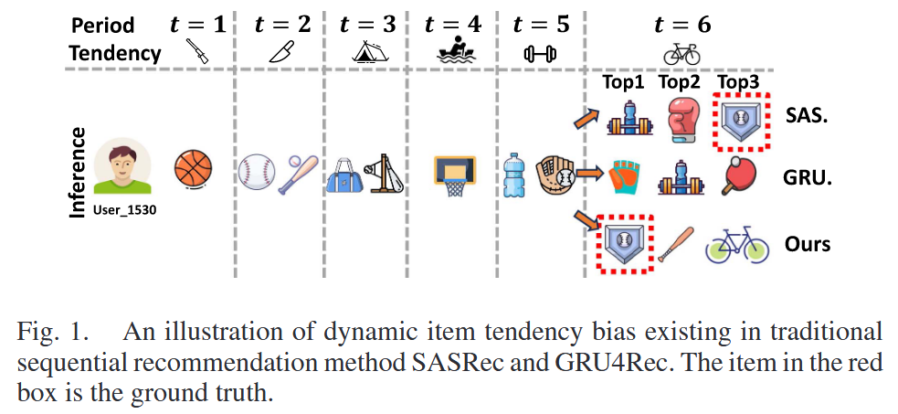
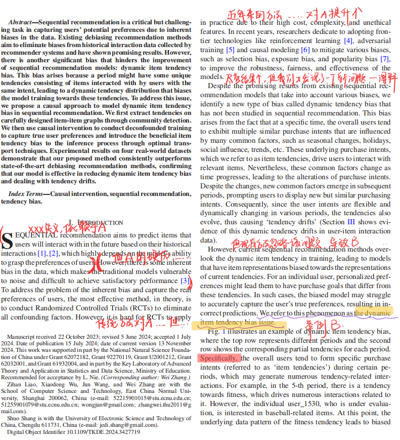
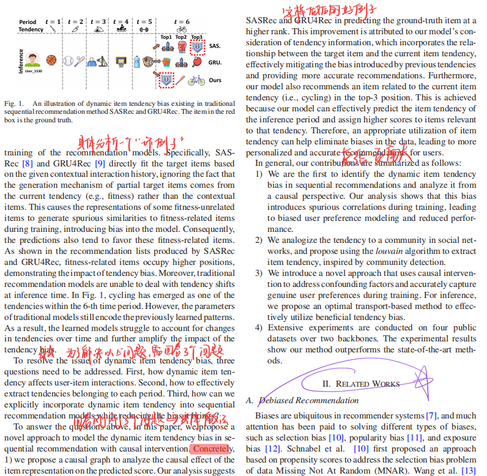

------

## Modeling dynamic item tendency bias in sequential recommendation with causal intervention

| **期刊**: IEEE Transactions on Knowledge and Data Engineering（发表日期: **12/2024**） **作者**: Zihan Liao; Xiaodong Wu; Shuo Shang; Jun Wang; Wei Zhang |
| ------------------------------------------------------------ |
| **摘要:** *Sequential recommendation is a critical but challenging task in capturing users’ potential preferences due to inherent biases in the data. Existing debiasing recommendation methods aim to eliminate biases from historical interaction data collected by recommender systems and have shown promising results. However, there is another significant bias that hinders the improvement of sequential recommendation models: dynamic item tendency bias. This bias arises because a period might have some unique tendencies consisting of items interacted with by users with the same intent, leading to a dynamic tendency distribution that biases the model training towards these tendencies. To address this issue, we propose a causal approach to model dynamic item tendency bias in sequential recommendation. We first extract tendencies on carefully designed item-item graphs through community detection. We then use causal intervention to conduct deconfounded training to capture true user preferences and introduce the beneficial item tendency bias to the inference process through optimal transport techniques. Experimental results on four real-world datasets demonstrate that our proposed method consistently outperforms state-of-the-art debiasing recommendation methods, confirming that our model is effective in reducing dynamic item tendency bias and dealing with tendency drifts.* |
| **摘要翻译:** 由于数据中固有的偏差，顺序推荐在捕捉用户潜在偏好方面是一项至关重要但又极具挑战性的任务。**现有的去偏推荐方法旨在消除推荐系统收集的历史交互数据中的偏差**，并取得了良好的效果。然而，还有一个显著的偏差阻碍了顺序推荐模型的改进：动态项目趋势偏差。产生这种偏差的原因是，一个时间段可能会有一些独特的倾向，这些倾向由具有相同意图的用户交互过的项目组成，从而导致动态倾向分布，使模型训练偏向于这些倾向。为了解决这个问题，**我们提出了一种因果方法来模拟顺序推荐中的动态项目趋势偏差。**我们首先通过社群检测在精心设计的项目-项目图上提取倾向。然后，我们利用因果干预来进行去约束训练，以捕捉真实的用户偏好，并通过最优传输技术将有益的项目倾向偏差引入推理过程。在四个真实数据集上的实验结果表明，我们提出的方法始终优于最先进的去偏差推荐方法，证明我们的模型能有效减少动态项目倾向偏差并处理倾向漂移。 |
| **期刊分区:**                                                |
| **笔记创建日期:** 2025/10/15 17:13:55                        |

## 1️⃣ 文章基本框架

### 背景

序列推荐面临数据固有偏见，现有去偏方法效果有限。

本文提出“动态项目倾向偏差”，但现有模型忽略此动态倾向，导致训练偏向当前倾向，难以捕捉用户真实偏好。

### 目的

去除推荐序列中的动态项目倾向偏差

### 结论

**识别新偏见**: 发现并定义了序列推荐中的"动态项目倾向偏见"。

**分析原因**: 从因果角度分析该偏见如何产生虚假相关性，干扰真实偏好学习。

**提出方法**: 设计因果干预框架，结合社区检测和最优传输，实现去偏训练和有益倾向注入。

## 2️⃣ 结果与讨论

> 对于文章中出现的关键图表及其说明、关键机理解释以及文章的重点内容，进行详细记录和解读。

### 数据以及数据来源

### 方法

### 结论

## 3️⃣ 文章亮点思考

> 1、本文有什么优缺点？你是否对某些内容产生了疑问？
> 2、你是否认为某些研究方式可以改进，如何改进？
> 3、这篇文章好在哪里，只有当自己理解这篇文章好在哪里，为什么能发在顶刊上，那么你也就基本理解了全篇文章的基本内容。

## 4️⃣ 借鉴学习（125）

> “125”原则

### 1个思路

> 该文章可能为自己未来研究带来的新思路，不论是实验方法，还是研究思路上。

### 2个绘图

配色好看

### 5个句式

#### 图表解释

**Fig. 1 illustrates** an example of dynamic item tendency bias, w**here the top row represents** different periods and the second row shows the corresponding partial tendencies for each period. **Specifically,** the overall users tend to form specific purchase intents (referred to as ‘item tendencies’) during certain periods, which may generate numerous tendency-related interactions. **For example**……**As a result,**……

#### 引言——提出现象与问题并解决

