# Explainable Session-based Recommendation  via Path Reasoning

| **期刊:**IEEE Transactions on Knowledge and Data Engineering (**IEEE TKDE**) |
| ------------------------------------------------------------ |
| **发表日期: 2024-02-28 **                                    |
| **作者:** Yang Cao; Shuo Shang; Jun Wang; Wei Zhang          |
| **摘要:** *This paper explores providing explainability for session-based recommendation (SR) by path reasoning. Current SR models emphasize accuracy but lack explainability, while traditional path reasoning prioritizes knowledge graph exploration, ignoring sequential patterns present in the session history. Therefore, we propose a generalized hierarchical reinforcement learning framework for SR, which improves the explainability of existing SR models via Path Reasoning, namely PR4SR. Considering the different importance of items to the session, we design the session-level agent to select the items in the session as the starting point for path reasoning and the path-level agent to perform path reasoning. In particular, we design a multi-target reward mechanism to adapt to the skip behaviors of sequential patterns in SR, and introduce path midpoint reward to enhance the exploration efficiency in knowledge graphs. To improve the completeness of the knowledge graph and to diversify the paths of explanation, we incorporate extracted feature information from images into the knowledge graph. We instantiate PR4SR in five state-of-the-art SR models (i.e., GRU4REC, NARM, GCSAN, SR-GNN, SASRec) and compare it with other explainable SR frameworks, to demonstrate the effectiveness of PR4SR for recommendation and explanation tasks through extensive experiments with these approaches on four datasets.* |
| **摘要翻译:** 本文探讨通过路径推理为基于会话的推荐（SR）提供可解释性。当前的SR模型强调准确性但缺乏可解释性，而传统的路径推理优先考虑知识图探索，忽略会话历史中存在的顺序模式。因此，我们提出了一种通用的SR分**层强化学习框架**，通过**路径推理**提高了现有SR模型的可解释性，即PR4SR。考虑到项目对会话的重要性不同，我们设计了会话级代理来选择会话中的项目作为路径推理的起点，并设计路径级代理来执行路径推理。特别是，我们**设计了一种多目标奖励机制来适应SR中顺序模式的跳跃行为**，并引入**路径中点奖励**来提高知识图谱的探索效率。为了提高知识图谱的完整性并丰富解释路径，我们将**从图像中提取的特征信息合并到知识图谱中**。我们在五个最先进的 SR 模型（即 GRU4REC、NARM、GCSAN、SR-GNN、SASRec）中实例化 PR4SR，并将其与其他可解释的 SR 框架进行比较，通过在四个数据集上使用这些方法进行广泛的实验来证明 PR4SR 对于推荐和解释任务的有效性。 |
| **期刊分区:**                                                |
| **DOI:** [10.48550/arXiv.2403.00832](https://doi.org/10.48550/arXiv.2403.00832) |
| **Tags:** explainable recommendation, session-based recommendation, hierarchical reinforcement learning, knowledge graph |

## 文章基本框架

### 背景

当前大多数SR模型注重提高准确度却忽略了可解释性；

**核心思想**: 在知识图谱 (KG) 上显式建模实体间路径，提供推荐依据。
**结合强化学习 (RL)**: 提升 KG 探索效率。

但是现有方法

1. 起点单一：多以**用户或会话最后一个物品**为起点忽略会话中其他重要物品
2. 奖励函数缺陷：未充分考虑序列模式中的跳跃行为 (skip behaviors)
3. 知识图谱信息不足：未充分利用产品图像等异构信息

### 目的

设计一个可解释的SR模型解决上述问题

### 结论

1. 首个通用分层强化学习框架（当前市面上两种做法融合）
   - 会话级智能体：选择会话中重要物品作为路径推理起点。（解决起点单一）
   - 路径级智能体：执行知识图谱中的路径推理。
2. 首个结合跳跃行为的奖励机制
   - 多目标奖励 (Multi-Target Reward)。
   - 路径中点奖励 (Path Midpoint Reward) 提升探索效率。
3. **知识图谱构建新方法**：融入产品图像特征信息，提升实体关联性与解释多样性。
4. 良好的泛化性和可解释性和精度

## 结果与讨论

> 对于文章中出现的关键图表及其说明、关键机理解释以及文章的重点内容，进行详细记录和解读。

### 数据以及数据来源

**数据集**

- 亚马逊 (Amazon): Beauty, Cellphones, Baby (电商)
- 豆瓣 (Douban): movie (电影)
- 会话定义: 一天内的用户交互
- 过滤: 交互 < 5 次的物品，长度 < 2 的会话
- 划分: 训练集 75%, 验证集 10%, 测试集 15%

**评估指标**

- **推荐**: HR@k, NDCG@k (k=5, 10, 20)
- **解释**: 用户问卷调查 (User Study)

**基线模型 (Baselines)**

- 五种 SOTA SR 模型: GRU4Rec, NARM, GCSAN, SR-GNN, SASRec
- 一种可解释 SR 框架: REKS [24]

**超参数设置 **

学习率, α,β, 折扣因子 γ, 路径长度 T, 动作空间大小等

### 方法

#### :star:构建知识图谱

1. **提取图像特征 (Extract Image Feature)**  

- 使用百度 AI 云 API 提取图片 Top-5 特征 (置信度 > 50%)。
- 通过 `image_sim` 关系连接到物品。

**作用**: **补充缺失的产品属性信息**，增加解释路径多样性。

2. 按领域拆分关系 (Split Relations)

- 例如 `also_viewed` / `also_bought` 区分同领域 (如 Beauty) 和跨领域 (如 Beauty vs Baby)。
- 生成 `also_viewed_same`, `also_viewed_diff`, `also_bought_same`, `also_bought_diff` 等。

**作用**: 使关系含义更具体，提升解释准确性。

3. 合并重复实体 (Merge Duplicate Entities)

- 识别并合并同时出现在 `also_viewed` 和 `also_bought` 中的实体。
- 例如用 `viewed_bought` 替代双重连接。

**作用**: 减少冗余连接，提升路径推理效率。

#### 分层强化学习

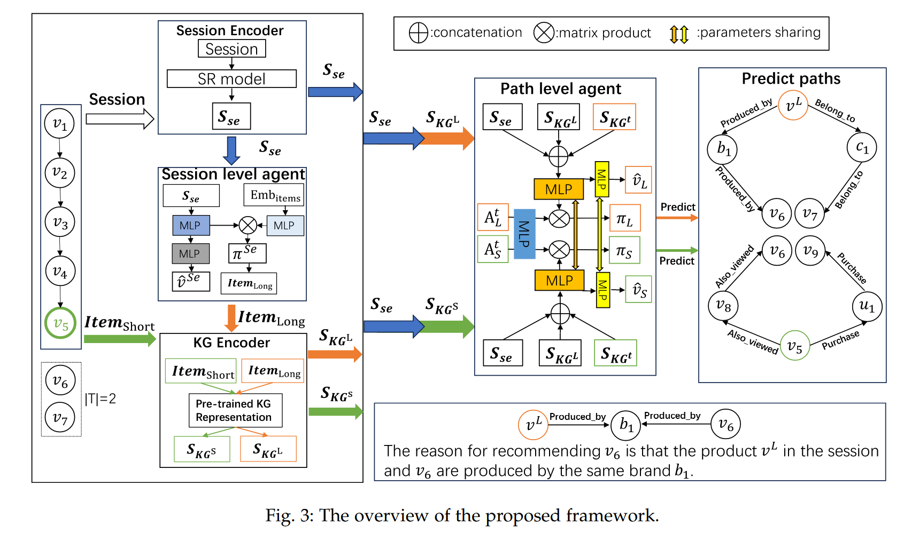

1. 会话级智能体 (Session-level Agent): 从会话中选择重要物品作为路径推理起点
2. 路径级智能体 (Path-level Agent)：从 $$Item_{Long}$$ 或 $$Item_{short}$$  开始，在 KG 中探索路径。

#### 奖励函数设计

1. 多目标奖励 (Multi-Target Reward)

   **动机**: 序列模式存在跳跃行为 。仅奖励最后一个物品到目标的路径不合理。

   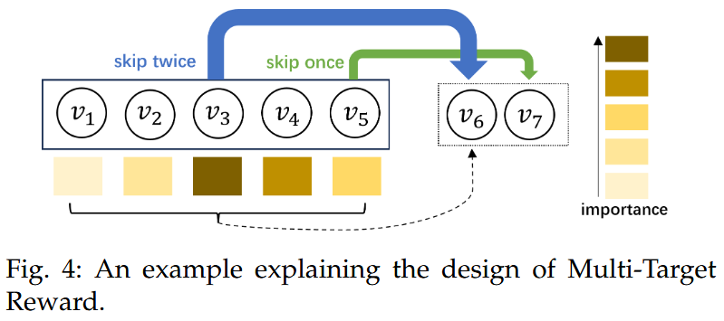

   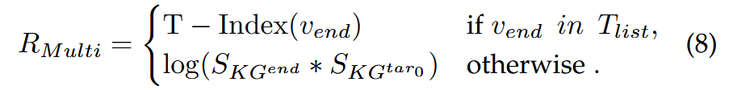

   * 设定 T 个连续的目标 Tlist=[tar0,tar1,...,tarT−1]
   * 若路径终点 $$v_{end}$$ 在 $$T_{list}$$ 中，则 R=T−Index( $$v_{end}$$ ) (越早命中目标奖励越高)
   * 若 $$v_{end}$$ 不在$$T_{list}$$ 中，则 $$R=log⁡(S_{KG^{end}} ⋅S_{KG^{tar0}})$$ (基于终点与第一个目标的相似度)

2. 路径中点奖励 (Path Midpoint Reward, RPMid)

   **动机**: 仅靠终点奖励可能导致探索效率低下 。即使路径错误，如果中间**经过了接近目标的节点也应给予鼓励**。

   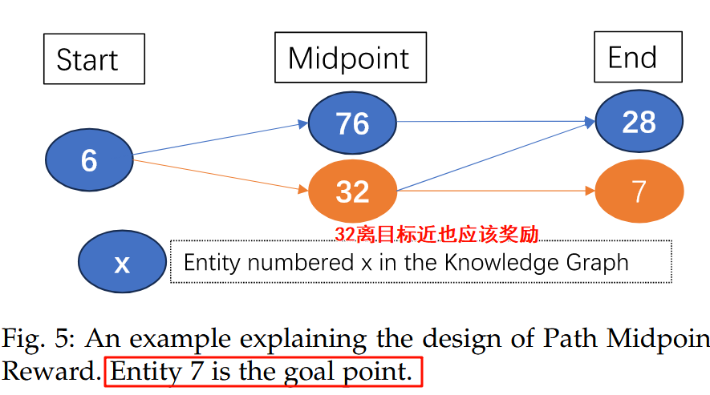

   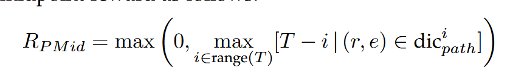

### 实验

先提出四个问题，然后依次回答四个问题，也就正好对应着后面的四个实验设计

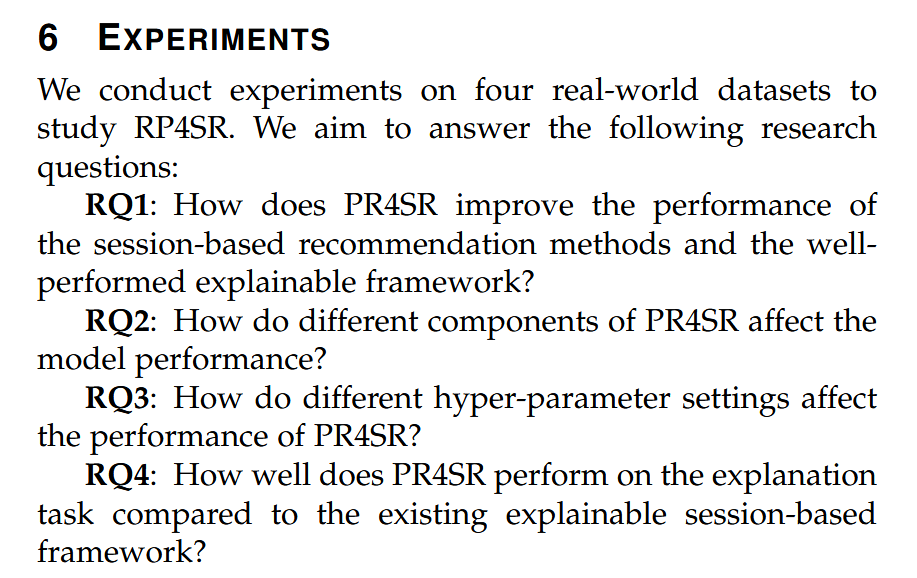

#### 整体性能

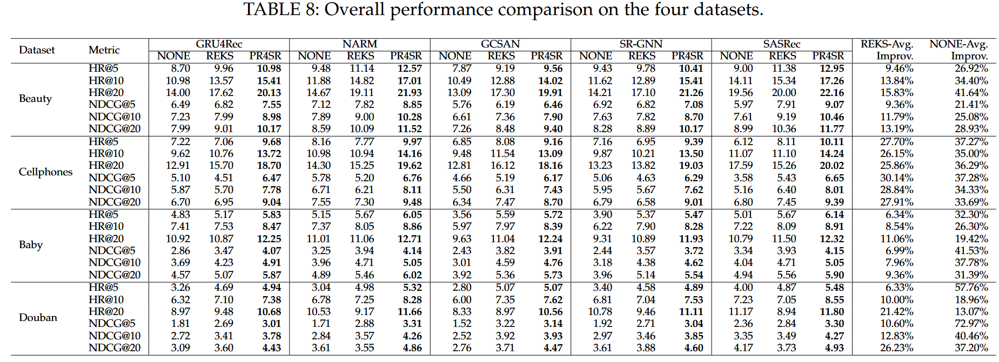

#### 组件消融实验

#### 超参数敏感性

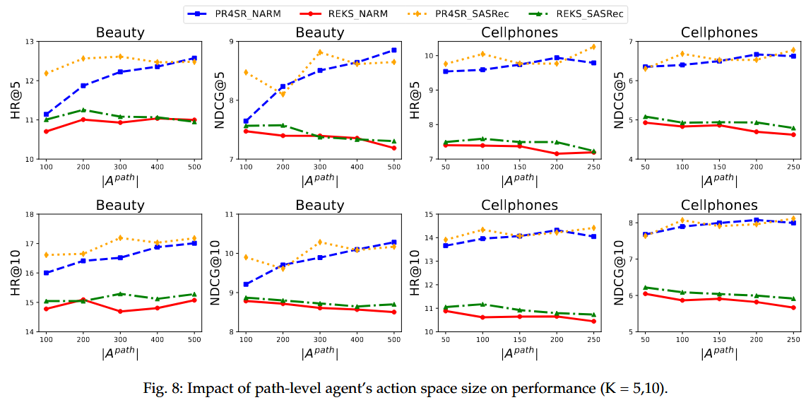

#### 可解释性

举例+问卷调查

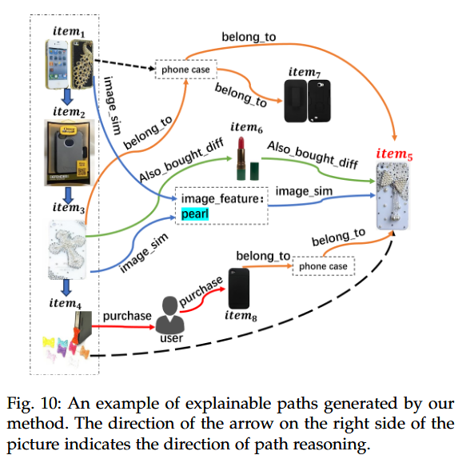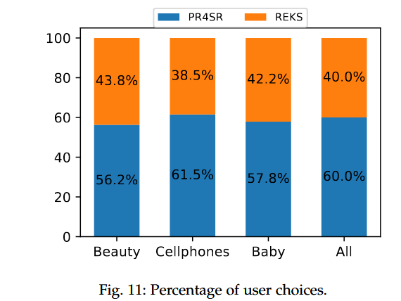

## 文章亮点思考

实验做的好、改进的观点很合理很有说服力

对于图像如果没有利用上可以利用ai提取特征加入新信息

## 借鉴学习（125）

> “125”原则

### 1个思路

[构建知识图谱三步走：](#构建知识图谱)

1. 对图像或文字内容可以利用API提取特征，丰富图谱信息
2. 细分关系，更具体
3. 合并冗余关系

对于构建一个多个模块组成的新模型，如何设计实验，可以仿照该篇

强化学习的奖励函数根据数据特征合理修改

当前市面上的方法可以各个有利有弊===>使用分层xxx，直接将各个方法融合，只取优点

### 2个绘图

实验的四个图都可以

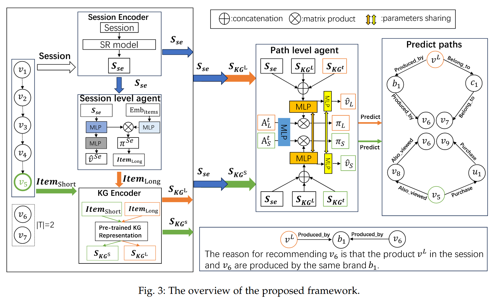

### 5个句式

实验先提出四个问题，再解答