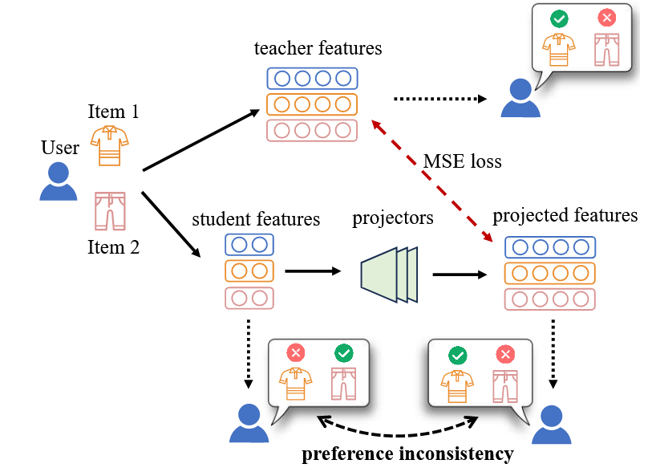
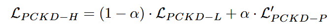

# Preference-consistent knowledge distillation for recommender system

| 期刊:IEEE Transactions on Knowledge and Data Engineering     |
| ------------------------------------------------------------ |
| **发表日期: 2025-01-13 **                                    |
| **作者:** Zhangchi Zhu; Wei Zhang                            |
| **摘要:** *Feature-based knowledge distillation has been applied to compress modern recommendation models, usually with projectors that align student (small) recommendation models’ dimensions with teacher dimensions. However, existing studies have only focused on making the projected features (i.e., student features after projectors) similar to teacher features, overlooking investigating whether the user preference can be transferred to student features (i.e., student features before projectors) in this manner. In this paper, we find that due to the lack of restrictions on projectors, the process of transferring user preferences will likely be interfered with. We refer to this phenomenon as preference inconsistency. It greatly wastes the power of featurebased knowledge distillation. To mitigate preference inconsistency, we propose PCKD, which consists of two regularization terms for projectors. We also propose a hybrid method that combines the two regularization terms. We focus on items with high preference scores and significantly mitigate preference inconsistency, improving the performance of feature-based knowledge distillation. Extensive experiments on three public datasets and three backbones demonstrate the effectiveness of PCKD. The code of our method is provided in https://github.com/woriazzc/KDs.* |
| **摘要翻译:**基于特征的知识蒸馏已被应用于压缩现代推荐模型，通常使用投影仪将学生（小型）推荐模型的维度与教师的维度对齐。然而，现有的研究仅集中于使投影特征（即投影仪之后的学生特征）与教师特征相似，而忽略了研究用户偏好是否可以通过这种方式转移到学生特征（即投影仪之前的学生特征）。在本文中，我们发现由于缺乏对投影仪的限制，传输用户偏好的过程可能会受到干扰。我们将这种现象称为偏好不一致。它极大地浪费了基于特征的知识蒸馏的力量。为了减轻偏好不一致，我们提出了 PCKD，它由投影仪的两个正则化项组成。我们还提出了一种结合了两个正则化项的混合方法。我们专注于具有高偏好分数的项目，并显着减轻偏好不一致，从而提高基于特征的知识蒸馏的性能。对三个公共数据集和三个主干网的广泛实验证明了 PCKD 的有效性。 |
| **期刊分区:**                                                |
| **DOI:** [10.48550/arXiv.2311.04549](https://doi.org/10.48550/arXiv.2311.04549) |
| **Tags:**                                                    |

## 文章基本框架

### 背景

用户物品数量激增，用户偏好多样化，传统小模型容量不足。增加模型嵌入维度虽能提升性能，但导致参数量巨大，存储成本高、推理延迟大。

解决方案：知识蒸馏 (Knowledge Distillation, KD) - 将大型"教师"模型的知识转移给小型"学生"模型。

现有方法：基于特征的知识蒸馏——利用教师模型**中间层的特征**进行知识传递。

训练小型学生模型时，除了使用原始数据，还利用教师模型的中间层特征和输出层预测；引入**投影器 (Projector)** 对齐学生和教师特征维度；使用MSE损失使投影后的学生特征接近教师特征。

投影后的**学生特征可能与教师特征相似**，但学生**自身特征推导**出的用户偏好却与教师模型不同。

投影器在对齐特征的同时，可能扭曲了学生模型对用户偏好的学习；**学生模型未能真正学到教师关于用户偏好的知识**，导致知识蒸馏效果打折扣。

### 目的

解决上述的偏好不一致性

### 结论

通过两种正则化项缓解偏好不一致，显著提升性能。采用 Rank-aware Sampling，优先采样高分项，以减轻其偏好不一致性。

Pair-wise PCKD：使投影后特征的得分差异与学生自身特征的**得分差异方向一致**。

List-wise PCKD：使投影后特征计算出的偏好分布与学生自身特征计算出的**偏好分布**尽可能一致。

Hybrid PCKD：

## 结果与讨论

> 对于文章中出现的关键图表及其说明、关键机理解释以及文章的重点内容，进行详细记录和解读。

### 数据以及数据来源

### 方法

### 结论

## 文章亮点思考

> 1、本文有什么优缺点？你是否对某些内容产生了疑问？
> 2、你是否认为某些研究方式可以改进，如何改进？
> 3、这篇文章好在哪里，只有当自己理解这篇文章好在哪里，为什么能发在顶刊上，那么你也就基本理解了全篇文章的基本内容。

## 借鉴学习（125）

> “125”原则

### 1个思路

> 该文章可能为自己未来研究带来的新思路，不论是实验方法，还是研究思路上。

额外加入的方法要考虑他的**效率**

### 2个绘图

> 选取并分析文章中设计精良的图表，学习其形式和色彩搭配。

### 5个句式

> 提炼并记录文章中的五个优秀句式，并尝试在未来的写作中模仿使用。