# Pattern-wise transparent sequential recommendation

| **期刊: IEEE Transactions on Knowledge and Data Engineering（IEEE TKDE） |
| ------------------------------------------------------------ |
| **发表日期: 2025-03-04 **                                    |
| **作者:** Kun Ma; Cong Xu; Zeyuan Chen; Wei Zhang            |
| **摘要:** *A transparent decision-making process is essential for developing reliable and trustworthy recommender systems. For sequential recommendation, it means that the model can identify key items that account for its recommendation results. However, achieving both interpretability and recommendation performance simultaneously is challenging, especially for models that take the entire sequence of items as input without screening. In this paper, we propose an interpretable framework (named PTSR) that enables a pattern-wise transparent decision-making process without extra features. It breaks the sequence of items into multi-level patterns that serve as atomic units throughout the recommendation process. The contribution of each pattern to the outcome is quantified in the probability space. With a carefully designed score correction mechanism, the pattern contribution can be implicitly learned in the absence of ground-truth key patterns. The final recommended items are those that most key patterns strongly endorse. Extensive experiments on five public datasets demonstrate remarkable recommendation performance, while statistical analysis and case studies validate the model interpretability.* |
| **摘要翻译:**透明的决策过程对于开发可靠且值得信赖的推荐系统至关重要。对于顺序推荐，这意味着模型可以识别解释其推荐结果的关键项。然而，同时实现可解释性和推荐性能具有挑战性，特别是对于**将整个项目序列作为输入而不进行筛选的模型**。在本文中，我们提出了一个可解释的框架（名为 PTSR），该框架无需额外功能即可实现模式透明的决策过程。**它将项目序列分解为多级模式**，这些模式在整个推荐过程中充当原子单元。**每种模式对结果的贡献在概率空间中量化**。通过精心设计的分数校正机制，可以在**没有真实关键模式的情况下隐式学习模式贡献**。最终推荐的项目是那些大多数关键模式强烈认可的项目。对五个公共数据集的广泛实验证明了卓越的推荐性能，而统计分析和案例研究验证了模型的可解释性。 |
| **期刊分区:**                                                |
| **DOI:** [10.48550/arXiv.2402.11480](https://doi.org/10.48550/arXiv.2402.11480) |
| **Tags:**                                                    |

## 文章基本框架

### 背景

> 概要说明研究所处领域的现状及其重要性。

序列推荐的可解释性很重要，有助于用户信任，每一个推荐的物品都有理有据；同时有助于帮助工程师诊断差评案例的原因。但是现在的推荐系统在保证高准确度的同时无法其可解释性。

性能 vs 可解释性

对于联盟级（多个物品组合）池化或者图网络方式建模后，每个独立组件的贡献值会模糊不清，如何对模式级物品进行建模，保证其内部组件的可提取

- 网络深度越深--->可解释性越差--->模型尽量简单
- 物品组合要体现其内部关系，可分解--->不能使用transformer的直接嵌入融合
- 缺少真实的组合集推荐数据集

### 目的

> 明确列出文章旨在解决的科学问题和研究目标。

保证模型性能的同时提高其可解释性，同时利用物品组合集进行解释

### 结论

> 简明扼要地归纳出文章的主要发现与结论。

PTSR

模型简单--要让其性能好于黑盒的模型-->**更加准确的建模方式**：

1. 将物品直接表示为空间中的一个固定点无法捕捉一般差异--->**概率嵌入**代替一般嵌入
2. 使用关系运算符的方式捕捉项目之间的共性
3. 没有真实组合集相关的推荐数据集--->使用加权策略达到自适应

## 结果与讨论

> 对于文章中出现的关键图表及其说明、关键机理解释以及文章的重点内容，进行详细记录和解读。

### 数据以及数据来源

- **Amazon** (Beauty, Toys, Tools, Sports): 高稀疏性
- **Yelp**: 商户评论
- **预处理**: 过滤低频用户/物品，留一法划分 (验证集/测试集)

### 方法

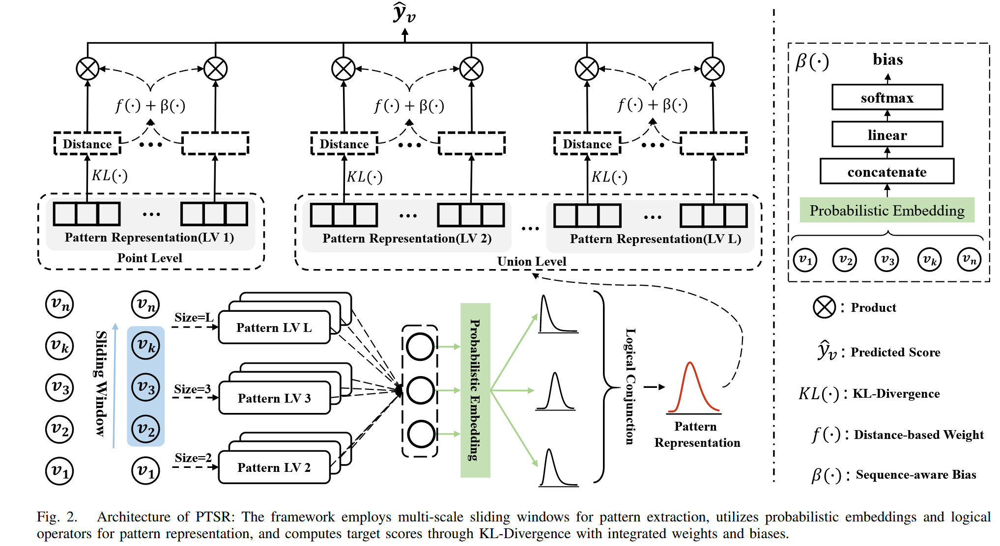

1. 多级模式提取：使用不同大小的**滑动窗口**，捕获点级和联盟级模式

2. 模式表示建模：概率嵌入 + 逻辑"与"运算，精细化表示模式

   1. **概率嵌入**: 使用概率分布 (如 Gamma, Beta) 参数化物品表示 v=(α,β)--->表达能力更强；而且很适合逻辑运和KL散度计算
   2. **逻辑"与"运算 (Conjunction)**: 融合模式内的物品表示--->更好的表达物品之间的复杂关系

   

   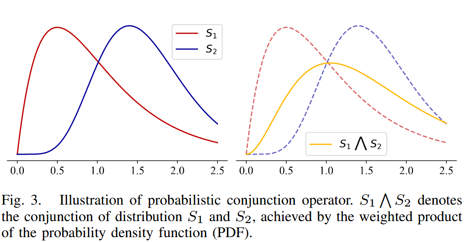

   

3. 模式贡献估计：KL 散度 + 权重 + 偏置，量化模式对推荐的影响

   KL散度来表示当前项目到目标物品距离，距离越小越相关

   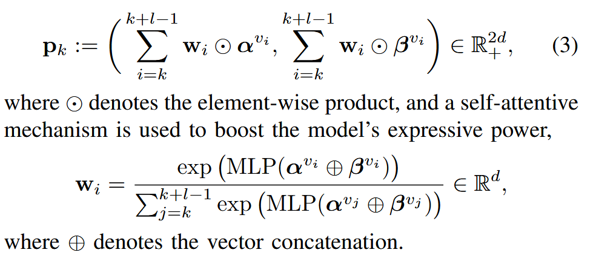

   **问题**：目标是最小化关键物品到目标物品的距离，但是没有真实数据，不知道真正的关键项目，无法正确最小化；简单加和距离不合适，[0.2, 8] 和 [4.1, 4.1] 明显前者更相关

   **解决**： 

   1. 基于距离权重：强调距离小的物品：

      通过取负值 ，**距离越小 → 负距离越大 → Softmax权重越大**，从而确保与目标物品更相似的模式获得更高的权重

      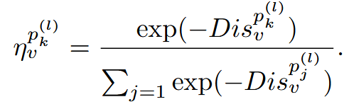

   2. 序列感知偏置：使用 MLP **从整体序列顺序中提取信息**，调整权重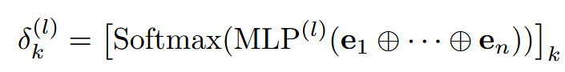

   最终得分计算                                                                                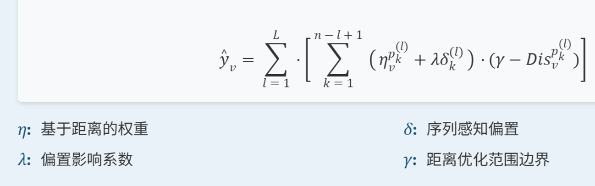

   通过最大化正样本得分、最小化负样本得分，隐式学习关键模式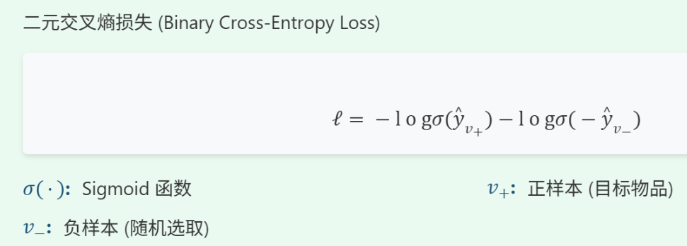

### 实验

性能对比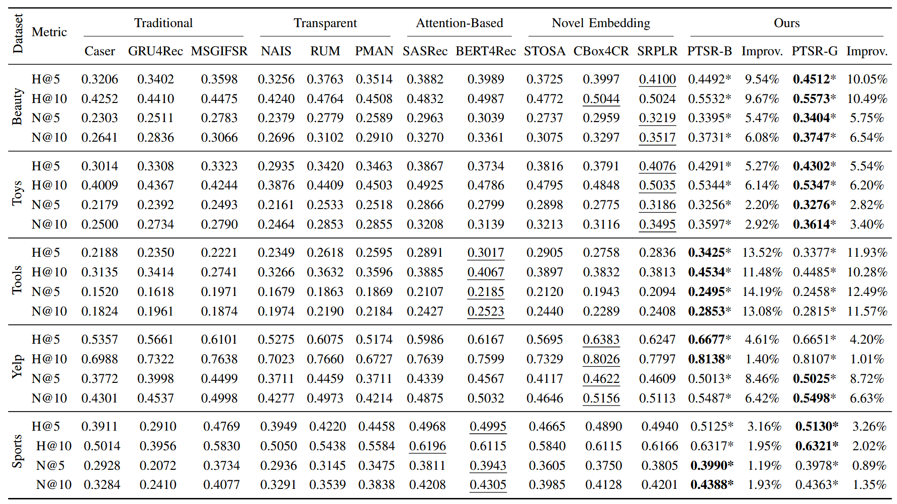

消融实验：对模型影响最大，说明如何建模数据非常重要

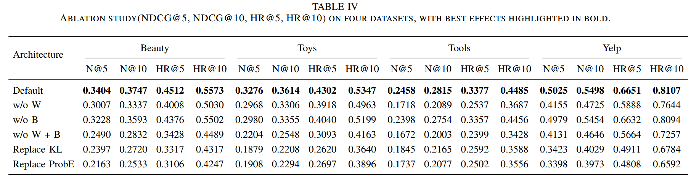

项目集组合对比

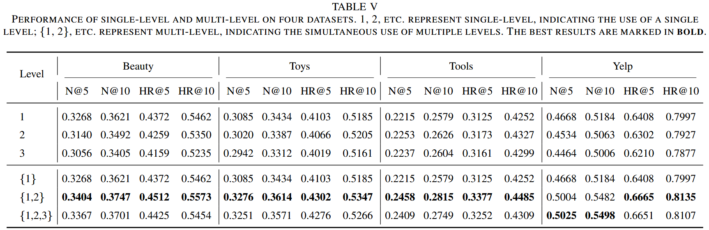

可解释性展示

案例演示：

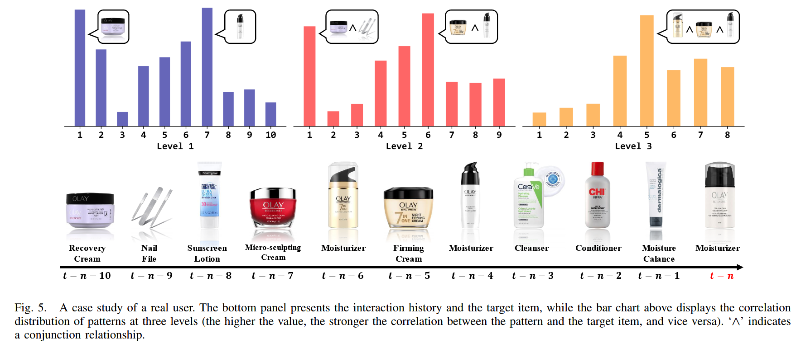

统计对比：

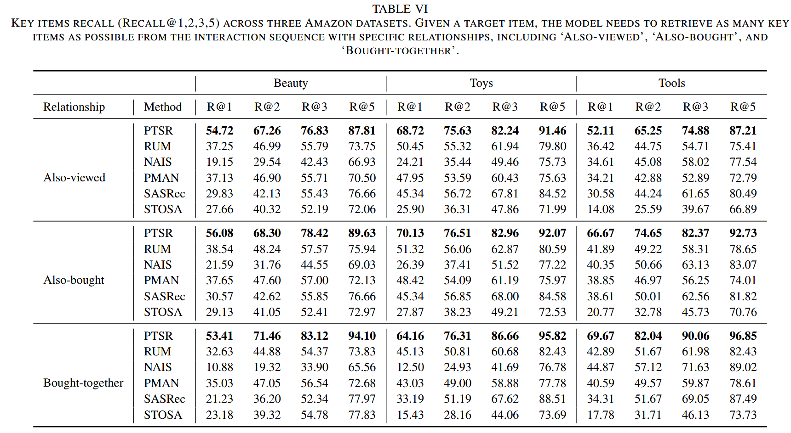

### 结论

局限与未来方向

- **非连续模式**: 当前只能建模连续物品的联盟级模式，未来可探索动态选择序列中物品形成模式。
- **逻辑推理增强**: 当前仅使用"与"运算，未来可引入"非"运算等，建模否定反馈。
- **长序列问题**: Softmax 获取权重可能导致长序列中权重区分度下降，需改进。

## 文章亮点思考

实验设计很好，方法说服力强

## 借鉴学习（125）

> “125”原则

### 1个思路

1. 对于序列数据不仅可以考虑单个数据和所有数据之间的关系，也可以可虑多个连续数据之间的关系
2. 当模型很简单时，让数据嵌入的方式可以表达更多信息，以此来提高精度

### 2个绘图

### 5个句式

> 提炼并记录文章中的五个优秀句式，并尝试在未来的写作中模仿使用。