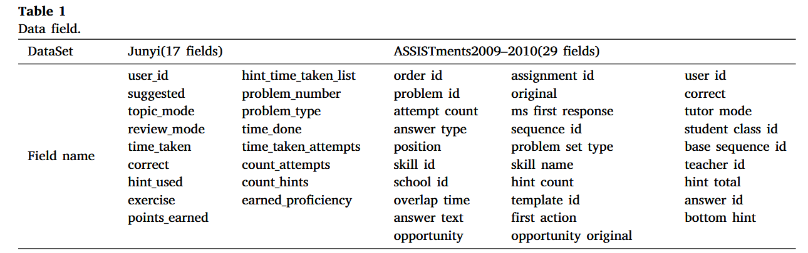
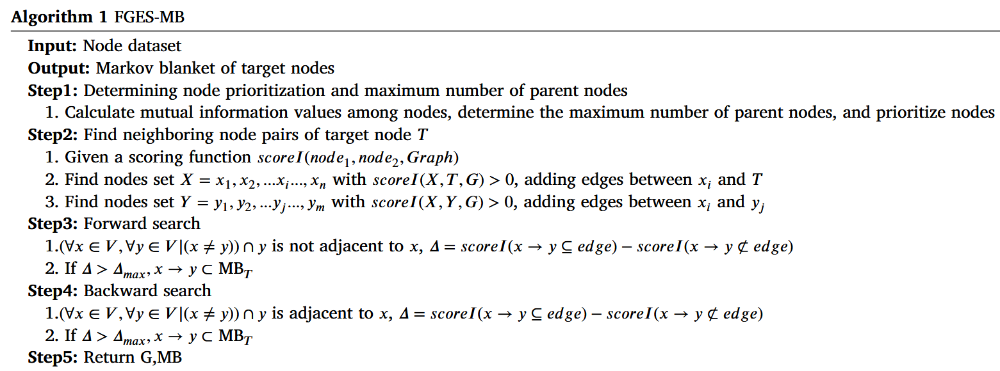
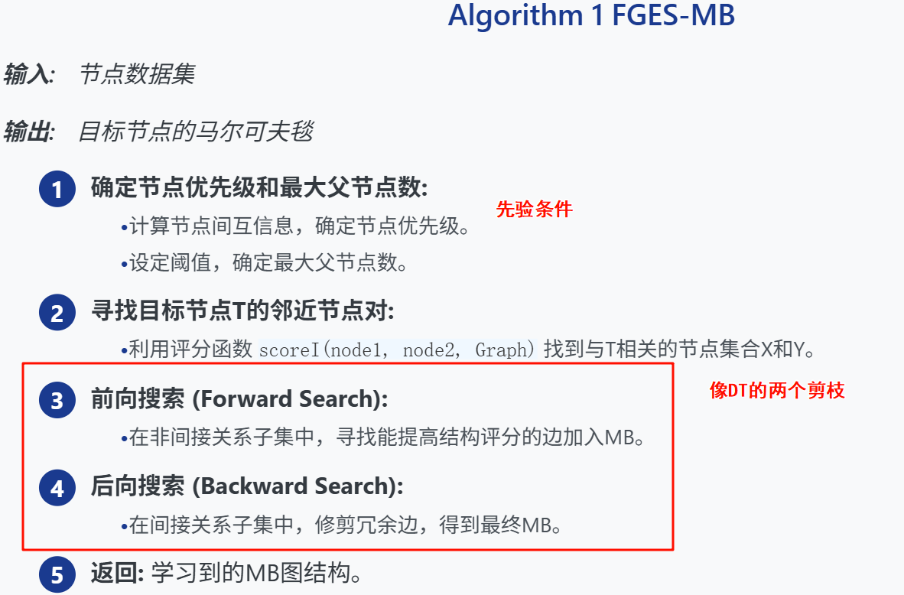
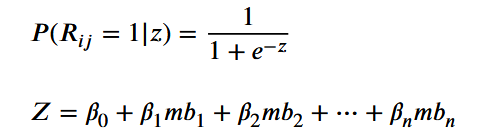
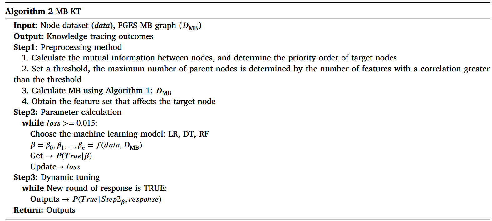
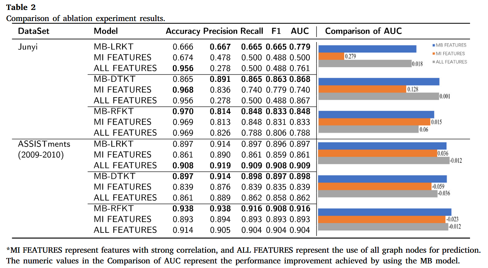
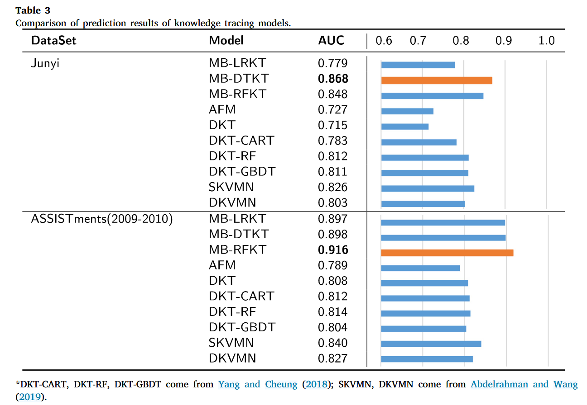
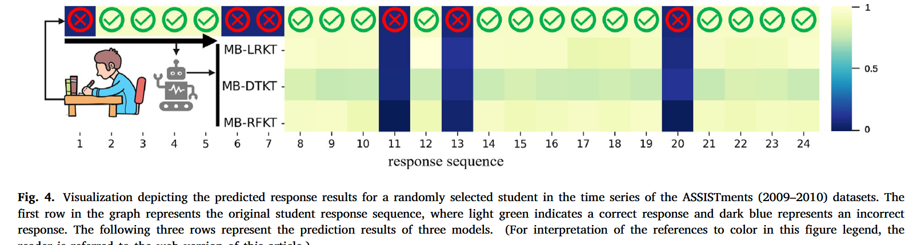
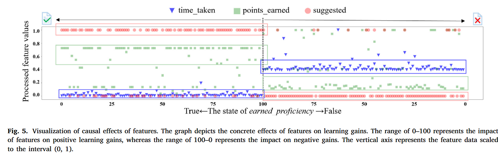

## Improving the performance and explainability of knowledge tracing via markov blanket

| **期刊: Information Processing & Management**（发表日期: **05/2024**） **作者:** Bo Jiang; Yuang Wei; Ting Zhang; Wei Zhang |
| ------------------------------------------------------------ |
| **摘要:** *Knowledge tracing predicts student knowledge acquisition states during learning. Traditional knowledge tracing methods suffer from poor prediction performance; however, recent studies have significantly improved prediction performance through the incorporation of deep neural networks. However, prediction results generated from deep knowledge tracing methods are typically difficult to explain. To solve this issue, a knowledge tracing model using Markov blankets was proposed to improve the interpretability of knowledge tracing. The proposed method uses the Markov blanket of the target variable as a subset of features and applies interpretable machine learning techniques to knowledge tracing. The results from the ablation experiments demonstrate that the feature subspace created by the Markov blanket is substantially effective for prediction. The proposed model also performs better than several other knowledge tracing models on two widely used datasets, i.e., Junyi and ASSISTments. Furthermore, the use of Markov blanket-based features provides high interpretability for predicting knowledge mastery states, elucidating the impact of these features on student knowledge acquisition. Moreover, this enables the use of previously considered low-correlation features, which may possess important latent causal relationships.* |
| **摘要翻译:**知识追踪可以预测学生在学习过程中的知识获取状态。传统的知识追踪方法预测效果不佳；然而，最近的研究通过结合深度神经网络，显著提高了预测效果。然而，深度知识追踪方法产生的预测结果通常难以解释。为了解决这个问题，我们提出了一种使用马尔可夫毯的知识追踪模型，以提高知识追踪的可解释性。所提出的方法将目标变量的马尔可夫毯作为特征子集，并将可解释的机器学习技术应用于知识追踪。消融实验结果表明，马尔可夫毯创建的特征子空间对预测非常有效。在两个广泛使用的数据集（即 "俊逸 "和 "ASSISTments"）上，所提出的模型也比其他几个知识追踪模型表现得更好。此外，基于马尔可夫毛毯特征的使用为预测知识掌握状态提供了较高的可解释性，阐明了这些特征对学生知识获取的影响。此外，这使得以前被认为是低相关性的特征得以使用，这些特征可能具有重要的潜在因果关系。 |
| **期刊分区:**                                                |
| **笔记创建日期:** 2025/10/14 12:00:13                        |

## 1️⃣ 文章基本框架

### 背景

知识追踪（Knowledge tracing）：**动态追踪和预测学生在学习过程中对知识点的掌握状态**

传统方法：可解释性强，预测能力有限

深度学习方法：预测能力强，可解释性差

### 目的

找到一种预测能力强且可解释能力好的方法

### 结论

提出了一种基于markov blanket和FGES框架的算法，提取出对目标参数的一个因果特征子集（MB）（有**因果关系**），将该自己输入到一些可解释性强的模型（LR、RF、DT）进行知识追踪，最终结果优于其他模型，且有较强的可解释性

## 2️⃣ 结果与讨论

> 对于文章中出现的关键图表及其说明、关键机理解释以及文章的重点内容，进行详细记录和解读。

### 数据以及数据来源

[unyi 数据集](https://pslcdatashop.web.cmu.edu/DatasetInfo?datasetId=1198)

特点：24万+学生，两年学习日志，数学课程为主，含多次练习、提示使用、个性化推荐等

[ASSISTments (2009-2010) 数据集](https://sites.google.com/site/assistmentsdata/home/assistment2009-2010-data/skill-builder-data-2009-2010)

特点2009-2010学年数学课程学习记录，含答题、提示、正确性等

选择理由：2015版字段少，2017版字段过多且含情感因素，2009-2010版最适合作为因果关系探索的基础

### 方法

**Markov blanket**

| **核心定义** | 一个变量的最小节点集，使得给定该集合，该变量与图中所有其他变量条件独立。 |
| ------------ | ------------------------------------------------------------ |
| **组成部分** | $$MB(X)=Parents(X)∪Children(X)∪Parents(Children(X))$$        |
| **主流算法** | 基于条件独立性检验；基于评分函数 缺点： 大多数算法输出的是无向图或等价类，无法确定因果方向；传统评分函数方法可能需要学习整个网络，耗时 |

提出

#### FGES-MB 算法

目标：结合独立性检验与评分函数，学习有向的MB，并利用先验知识减少搜索空间。

核心思想

1. **利用先验知识:** 通过节点排序算法 (如基于互信息) 和领域知识，确定节点优先级和最大父节点数，作为约束。
2. **基于FGES框架:** FGES (Fast Greedy Equivalence Search) 是一种高效的全局BN学习算法，将其应用于局部MB结构学习。
3. **评分函数:** 使用BIC (Bayesian Information Criterion) 评分函数评估网络结构，平衡模型复杂度与拟合度。

优势：能够学习到有向的MB，提供潜在的因果关系；利用先验知识降低计算成本。

#### MB-KT 模型构建

核心思想：将通过FGES-MB算法发现的因果特征子集 (MB) 作为**输入特征**，用于构建知识追踪模型。

模型选择：选用具有良好可解释性和性能的机器学习分类器。

- LR逻辑回归
- DT决策树
- RF随机森林

MB-LRKT （逻辑回归）模型公式：

### 实验

#### 消融实验===>证明方法有效

使用强相关特征（协方差）和全部特征作比较

##### 结果分析

Comparing the results from two datasets and three types of models, totaling six groups of experimental data, **reveals that** the performance of features with calculated mutual information (MI FEATURES) **does not always surpass the baseline model** that considers all features. First, we examine the MI features in the Junyi dataset, which comprises six strongly correlated features. Compared with the baseline model using all features, the performance is weak. **This result may occur because** there is more latent information within the additional features, and the strongly correlated features may also introduce confusion into the predictions. Similarly, in the ASSISTments dataset, the MI FEATURES, which includes six strongly correlated features, also exhibit weaker performance than the baseline model using all features. **This further confirms that** including more features introduces additional latent information, which leads to improved accuracy in prediction. However, when comparing the results obtained using causal features, the baseline model using all features performs poorly. This indirectly indicates that different features have varying effects on model prediction results, which can be positive or negative. **This highlights the necessity of our study.**

比较两个数据集和三种类型模型的结果，总共六组实验数据，表明具有计算互信息（MI FEATURES）的特征的性能并不总是超过考虑所有特征的基线模型。首先，我们检查 Junyi 数据集中的 MI 特征，其中包含六个强相关特征。与使用所有特征的基线模型相比，性能较弱。出现这种结果的原因可能是附加特征中存在更多潜在信息，并且强相关特征也可能会给预测带来混乱。同样，在 ASSISTments 数据集中，包含六个强相关特征的 MI FEATURES 也表现出比使用所有特征的基线模型更弱的性能。这进一步证实了包含更多特征会引入额外的潜在信息，从而提高预测的准确性。然而，当比较使用因果特征获得的结果时，使用所有特征的基线模型表现不佳。这间接表明不同的特征对模型预测结果有不同的影响，可以是正向的，也可以是负向的。这凸显了我们研究的必要性。

**A more specific analysis revealed that** models using MB features for KT outperformed models using ALL FEATURES in the Junyi dataset. However, in the case of the KT model built using LR on the ASSISTments dataset, the performance of the model using MB features did not significantly surpass the performance of the model using ALL FEATURES. This result can be attributed to the limitations of LR in adapting to different data and scenarios, compared with tree-based algorithms, which exhibit stronger adaptability. This adaptability may increase with the addition of more features, leading to a slight improvement in performance.

更具体的分析表明，使用 MB 特征进行 KT 的模型优于使用 Junyi 数据集中所有特征的模型。然而，在 ASSISTments 数据集上使用 LR 构建的 KT 模型的情况下，使用 MB 特征的模型的性能并没有显着超过使用 ALL FEATURES 的模型的性能。这一结果可以归因于LR在适应不同数据和场景方面的局限性，与具有更强适应性的基于树的算法相比。这种适应性可能会随着更多功能的添加而增强，从而导致性能略有提高。

#### 对比实验

#### 性能结果可视化

#### 特征解释可视化

### 结论

MB特征在保持甚至提升性能的同时，大幅降低了计算成本，更具实用价值

可解释性的体现：markov blanket（本身可解释性就很强）+可解释能力强的机器学习方法

## 3️⃣ 文章亮点思考

> 1、本文有什么优缺点？你是否对某些内容产生了疑问？
> 2、你是否认为某些研究方式可以改进，如何改进？
> 3、这篇文章好在哪里，只有当自己理解这篇文章好在哪里，为什么能发在顶刊上，那么你也就基本理解了全篇文章的基本内容。

文中的实验数据分析和讨论（Discussion）部分写的很好，有理有据，严谨不啰嗦

感觉这篇文章实际内容比较少，就是一个特征提取的方法。ds说因为**将特征选择从==相关性层面==提升到==因果性层面==**，其次可解释性强

在相关工作中只介绍了具体工作，而其对应的缺点放在了方法之前，用于引出本文的方法

## 4️⃣ 借鉴学习（125）

> “125”原则

### 1个思路

### 2个绘图

比较数据较少时可以再右侧加一个竖状图撑场面

箭头引导体现时序性

### 5个句式

This algorithm combines independence tests and scoring methods to identify causal feature subsets, **with its effectiveness evaluated through ablation experiments.**

该算法结合独立性测试和评分方法来识别因果特征子集，并通过消融实验评估其有效性。

[本文对数据结果的分析很好，可以学习](#结果分析)

Discussion部分

