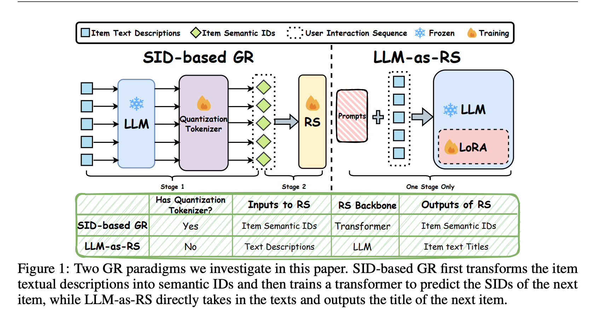
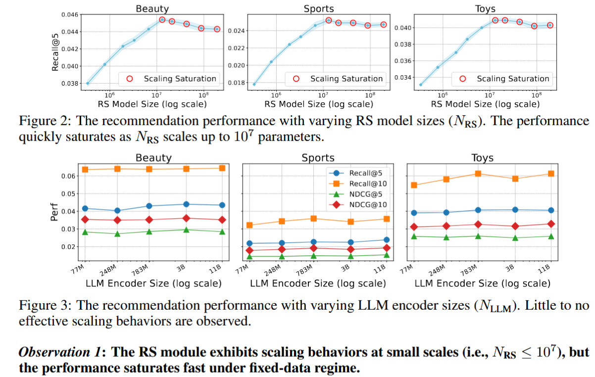
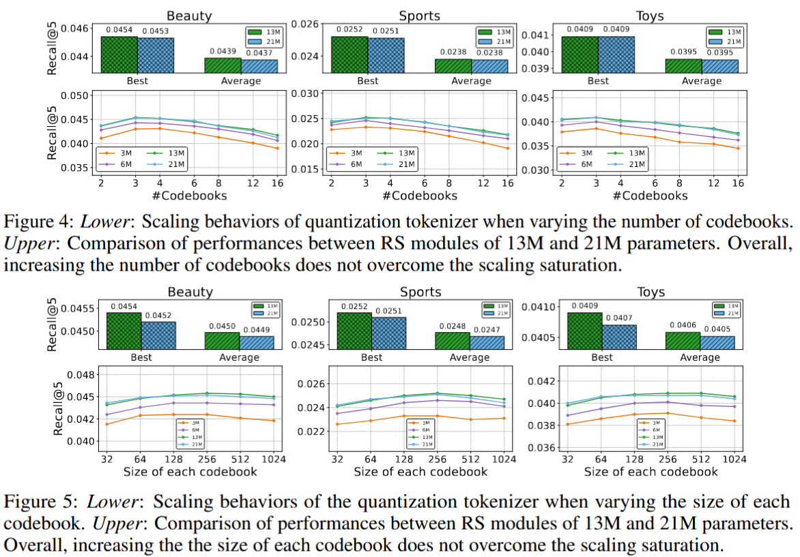
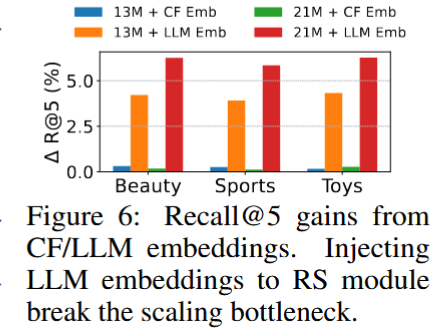
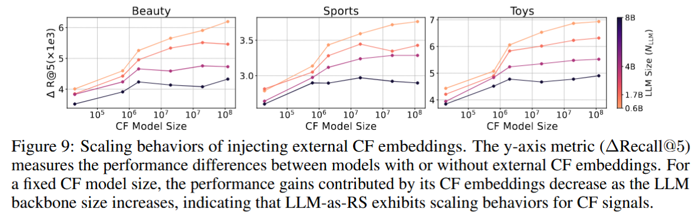

# UNDERSTANDING GENERATIVE RECOMMENDATION  WITH SEMANTIC IDS FROM A MODEL-SCALING VIEW

https://arxiv.org/pdf/2509.25522

> 当我们**通过增加模型规模**来提升推荐系统性能时，不同的生成式推荐方法表现如何？

## 生成式推荐范式

### SID-based GR

> 结合预训练模型的语义知识和用户行为（协同过滤）信号。

物品文本/图像 → LLM编码器（frozen）生成语义嵌入 → 量化分词器（Quantization Tokenizer，如RQ-VAE）转换为离散SID → 序列推荐器（Transformer）基于用户SID序列自回归预测下一个SID。

优势：统一SI（Semantic Information）和CF；SID重叠捕捉语义相似性，下一个物品预测学习用户行为。

### LLM-as-RS

> 大模型直接学习并生成推荐

流程：直接输入物品文本描述和用户交互序列 → LLM（LoRA微调）输出下一个物品标题。

优势：无量化瓶颈，直接利用LLMs的语义能力；论文证明LLMs能捕捉CF，且随规模增大CF能力提升。

## 实验

### SID-based GR

尝试通过增加 SID-based GR 的各个组件规模（编码器 $N_{LLM}$、量化器 $N_{QT}$、推荐器 $N_{RS}$）来提升性能时：
效果并没有像别的领域一样随着模型规模增大预测想过变好，反而出现饱和的现象，性能不再提升甚至下降。

瓶颈可能不在于模型的各个组件，而在于基于SID的GR本身的架构设计

#### 猜想

密集的**LLM嵌入**提取到**离散的SID**中会丢弃大量的语义信息，从而阻止RS充分利用LLM的知识

- 量化信息丢失：SID通过RQ-VAE从连续LLM嵌入量化成离散码，过程不可避免丢失细粒度语义信息。即使空间大，也无法完全捕捉LLM的丰富连续表示，导致语义信息（SI）传输不充分。
- SID长度与复杂度增加学习难度：多个codebook使每个item的SID变长（e.g., 长度=codebook数=3），序列推荐器（RS）需处理更长的序列和更大词汇表（总SID组合数），增大优化难度。论文实验（图4-5）显示，超出最佳配置（3x256）后，性能不升反降，因为RS学习负担加重，无法从更大空间获益。

##### 消融实验验证

将外部嵌入集成到RS模块中，具体如下：对于项i的SID，通过RS嵌入表后，我们获得项嵌入$e_i$。然后通过可训练的MLP适配器处理相应的CF或LLM嵌入并将其添加到$e_i$

- 注入协同过滤 (CF) 嵌入：效果甚微，说明模型很好的捕获了CF信号。
- 注入 LLM 原始嵌入：显著提升性能，且对大型推荐器 (NRS=21M) 效果更佳。

===>当加入更多语义时将缓解饱和，验证假设SIDs丢弃大量语义导致结果饱和

### LLM-as-RS

随着模型扩展，LLM-as-RS的效果并不会出现饱和现象===>直接输入文本给LLM，没有丢弃任何语义信息

传统观念：LLM 缺乏对用户行为模式（CF）的学习能力

#### 打假

横轴表示注入CF信息大小，随着模型规模的增大，注入CF信息对模型精度提升的效果不断减少，说明模型本身也学习到了CF信息。因为更大的 LLM 本身已经学会了更多的 CF 信号，因此外部 CF 的补充作用相对变小

> 感觉这里解释有点牵强，精度越好可能存在边际效益，精度越好越难提升

## 总结

- SID-based GR 因其对语义信息编码能力的限制，存在根本性的扩展瓶颈。
- LLM-as-RS 展现出优越的扩展性，能够同时有效学习协同过滤和语义信息，并且其性能随模型规模增长而持续提升
- 当预算受限且效率至关重要时，基于SID的GR仍然是优选的，而当性能优先且资源充足时，LLM-as-RS更适合

> 数据集很小，做scaling-law 有点不太合理

## 协同过滤（Collaborative Filtering）

 **利用“相似的人喜欢相似的物品”或“相似的物品会吸引相似的人”来做推荐，不依赖内容特征。**

CF分两大类：

- **User-based CF**（基于用户相似度）
- **Item-based CF**（基于物品相似度）

### 数据形式

- 用户–物品交互矩阵$R \in \mathbb{R}^{m \times n}$
- $m$是用户数，$n$是物品数， $R_{u,i}$通常是评分、点击、浏览、购买等。
- 矩阵非常稀疏，这也是推荐系统绕不开的问题。

------

### 基于相似度的协同过滤

#### 1. User-based CF

目标：为用户$u$推荐他没看过的物品$i$。

步骤：

##### (1) 找“相似用户”

相似度常用**余弦相似度**：$$ \text{sim}(u, v) = \frac{R_u \cdot R_v}{|R_u||R_v|}$$

也可用皮尔逊相关系数（更适合评分偏置大的场景）。

##### (2) 用相似用户的行为预测评分/偏好

$$
\hat{R}*{u,i} = \frac{\sum*{v \in N_k(u)} \text{sim}(u,v) R_{v,i}}{\sum_{v \in N_k(u)} |\text{sim}(u,v)|}
$$

直观解释：看与$u$最像的$k$个用户，他们对物品$i$的反馈加权平均。

##### 适用场景

- 用户行为相对密集（社区、电商高黏性）
- 用户数比物品数少

##### 痛点

- 用户量大时，相似度计算昂贵
- 用户兴趣会变化，需频繁更新相似度
- 新用户冷启动

#### 2. Item-based CF

思路完全一样，只是换成“找相似物品”。

##### (1) 物品相似度

$$

$$
$$
\text{sim}(i,j)=\frac{R_{\cdot i}\cdot R_{\cdot j}}{|R_{\cdot i}||R_{\cdot j}|}
$$

##### (2) 预测用户偏好

$$
\hat{R}*{u,i} = \frac{\sum*{j \in N_k(i)} \text{sim}(i,j) R_{u,j}}{\sum_{j \in N_k(i)} |\text{sim}(i,j)|}
$$

##### 优点

- 物品相对稳定，因此相似度容易缓存
- 工业界更常用（Amazon 经典论文）

##### 缺点

- 新物品冷启动

### 矩阵分解（协同过滤的核心思想延伸）

思想： 把**稀疏矩阵**$R$表示成两个低维隐向量矩阵的乘积：$$ R \approx PQ^\top $$

- $P_u$：用户$u$的隐向量
- $Q_i$：物品$i$的隐向量

预测：$\hat{R}_{u,i} = P_u^\top Q_i$

优化目标（最经典的MF）： $$ \min_{P,Q} \sum_{(u,i)\in \Omega} (R_{u,i}-P_u^\top Q_i)^2 + \lambda(|P_u|^2+|Q_i|^2) $$

比如，假设有一个 `m×n` 的用户 - 物品交互矩阵 `R`（`m` 个用户、`n` 个物品，矩阵中元素 `R[u][i]` 是用户 `u` 对物品 `i` 的交互记录，稀疏且可能有缺失），矩阵分解会将其拆为：

- 用户矩阵 `U`（`m×k`，`k` 是自定义的低维维度，`U[u]` 是用户 `u` 的 `k` 维 “偏好向量”，比如包含对 “喜剧”“动作” 的偏好权重）；
- 物品矩阵 `V`（`n×k`，`V[i]` 是物品 `i` 的 `k` 维 “特征向量”，比如包含 “喜剧元素占比”“动作元素占比”）。

拆解后，用户 `u` 对物品 `i` 的交互预测值（如预测评分）可通过 `U[u]` 与 `V[i]` 的内积计算，模型通过**最小化 “预测值与真实交互值的误差”** 来学习 `U` 和 `V` 的参数。

优势：

- 利用隐语义，效果远优于纯相似度法
- 可处理大规模稀疏矩阵
- 可扩展到神经网络（NCF）、加side information（FM/DeepFM）

------

### 协同过滤的核心优点与缺点

#### 优点

- 不需手工特征或内容信息
- 直接捕捉“人–物品”交互的真实兴趣
- 易解释（尤其是基于相似度的方法）

#### 缺点

- **稀疏性问题**：新用户、新物品都难
- **可扩展性问题**：相似度计算代价高
- **冷启动**：没有行为就没法推荐
- **受噪声影响**：评分偏置、恶意用户

##  scaling-law

在机器学习和深度学习领域， **scaling-law（缩放定律）**‍ 指的是模型性能（如准确率、召回率等）与模型规模（参数量）、数据量或计算资源之间存在的可预测的数学关系。具体表现为：

**定义**：当模型参数、训练数据或计算预算按比例增加时，模型性能通常遵循幂律关系提升（例如 ，其中 为常数）。这一规律在自然语言处理（如GPT系列）和计算机视觉等领域已被广泛验证。