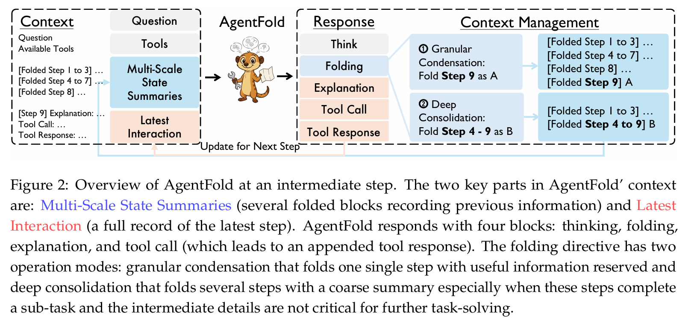

# sketch

**AgentFold：具有主动上下文管理的长时域网页智能体**

**标题：**AgentFold: Long-Horizon Web Agents with Proactive Context Management

**链接：**https://www.arxiv.org/abs/2510.24699v1

**作者：**Rui Ye, Zhongwang Zhang, Kuan Li, Huifeng Yin, Zhengwei Tao, Yida Zhao, Liangcai Su, Liwen Zhang, Zile Qiao, Xinyu Wang, Pengjun Xie, Fei Huang, Siheng Chen, Jingren Zhou, Yong Jiang

**单位：**阿里巴巴通义实验室

**全历史摘要===>多尺度摘要**

**摘要：**基于大型语言模型的网页智能体在信息检索领域展现出巨大潜力，但其在**长程任务中的效能受到上下文管理固有矛盾的制约**。当前主流的基于 ReAct 框架的智能体因持续积累噪声原始历史记录而导致上下文饱和，而**固定式全历史摘要方法**又可能造成关键细节的不可逆丢失。针对这一难题，研究者受**人类回顾性整合认知**过程启发，提出 **AgentFold——一种以主动式上下文管理为核心的新型智能体范式**。该框架将上下文视为可**主动塑造的动态认知工作空间**，而非被动填充的日志记录。在每一步推理中，智能体通过学习执行「折叠」操作，实现**多尺度历史轨迹管理**：**既可进行细粒度压缩以保留关键细节（Folded Step 8）**，也可实施**深度整合以抽象多步骤子任务（Folded Step 1 to 3）**。在主流基准测试中，该方法展现出显著优势：仅通过简单的监督微调（无需持续预训练或强化学习），AgentFold-30B-A3B 智能体即在 BrowseComp 上达到 36.2% 的准确率，在 BrowseComp-ZH 上达到 47.3%。尤为值得注意的是，其性能不仅超越或匹配了规模大得多的开源模型（如 DeepSeek-V3.1-671B-A37B），甚至超越了 OpenAI o4-mini 等领先的专有智能体系统。

