# KD字典不一致

| 分类                               | 方法             | 总结                                                         |
| ---------------------------------- | ---------------- | ------------------------------------------------------------ |
| **概率分布对齐**                   | **ULD**          | 用**最优传输**（Optimal Transport）的 Wasserstein 距离直接比较教师与学生的**输出分布**，即直接让学生去学校教师的概率分布 |
|                                    | **DSKD**         | 学教师的**概率分布**，还学教师隐藏层里的**语义关系**，从教师与学生的**隐藏层**提取语义嵌入 |
| **多层次对齐（概率、结构、语义）** | **MultiLevelOT** | **多层次 最优传输** 在 token 层（概率分布差异和比例差异）和句子层（语义）同时对齐， **Sinkhorn Distance**加快计算 |
|                                    | **CMD **         | 用**Dynamic Time Warping**自动对齐局部（加权重要的token），再构建上下文相关的动态语义映射矩阵，映射函数基于相邻上下文token的语义表示（全局语义） |
|                                    | **EMO**          | **注意力结构相似度**（结构相似） ， 最后一层隐藏状态进行**语义对齐**（语义相似）， **最优传输**计算从教师分布到学生分布的最小代价 |
| **推理对齐**                       | **CoT2Align **   | 学生学老师思考的过程（**Chain of Thought**），把推理链条也蒸馏下来 |
| **文本对齐**                       | **VocAgnoLM**    | 直接对齐原文字符位置，通过**字符偏移**找到教师和学生的对应 token |
|                                    | **ALM**          | 把不同 tokenizer 切出来的文本分成语义相同的块，对齐在**相同意思的文本片段上**的概率 |

##  概率分布对齐

### [ Towards Cross-Tokenizer Distillation: the Universal Logit Distillation Loss for LLMs](https://arxiv.org/abs/2402.12030)

[Nicolas Boizard](https://arxiv.org/search/cs?searchtype=author&query=Boizard,+N), [Kevin El Haddad](https://arxiv.org/search/cs?searchtype=author&query=Haddad,+K+E), [Céline Hudelot](https://arxiv.org/search/cs?searchtype=author&query=Hudelot,+C), [Pierre Colombo](https://arxiv.org/search/cs?searchtype=author&query=Colombo,+P)

#### 方法 ULD

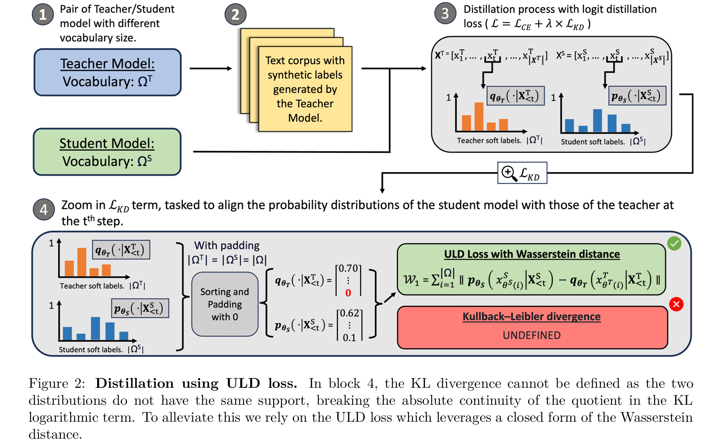

提出基于 **最优传输（Optimal Transport, OT）理论** 的通用蒸馏损失函数，通过计算 **Wasserstein 距离** 来衡量教师与学生输出概率分布之间的差异， 从而不再依赖 token 对齐。

(1) 传统KD公式 $$L = L_{CE} + \lambda L_{KD}$$

(2) ULD损失  $$L_{ULD} = \sum_{t=1}^{|x|} CE(t) + \lambda W_1[p_{\theta_S}(\cdot|x_S^{<t}), q_{\theta_T}(\cdot|x_T^{<t})]$$
 其中：

- $W_1$ Wasserstein 距离；
- 通过排序后的概率差计算闭式形式，复杂度降至 $O(n \log n)$。

(3) 计算优化

为避免 ($O(n^3)$) 复杂度的OT求解，论文提出：

- **Uniform Support Length**：填充词表使维度一致；
- **Uniform Cost Matrix**：假设所有 token 间传输成本相同；
- **闭式快速解**：$ W_1(p,q) = \sum_i |p_{\sigma_S(i)} - q_{\sigma_T(i)}|$ （σ 表示按概率从高到低排序）

这样ULD Loss 可以在标准 GPU 上高效计算.

#### 效果

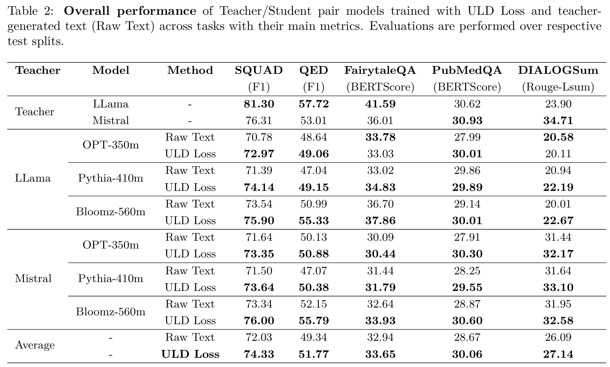

### [Dual-Space Knowledge Distillation for Large Language Models](https://arxiv.org/abs/2406.17328)

 EMNLP 2024，Songming Zhang, Xue Zhang, Zengkui Sun, Yufeng Chen, Jinan Xu

#### 方法 DSKD

 它在 **两个空间（dual-space）** 中实现教师与学生的知识对齐：

1. 概率空间蒸馏（Probability-space Distillation）,**基于相似度分布的跨词表对齐机制**：

   - 对教师输出进行 softmax 得到概率分布 $P_T$；

   - 对学生输出进行 softmax 得到$ P_S $；

   - 将二者通过**分布间相似性投影**映射到一个共享的“分布嵌入空间”；

   - 再计算它们之间的 **KL散度** 或 **交叉熵损失**。

> “不同词表但相似语义”下建立柔性对齐。

2. 语义空间蒸馏（Embedding-space Distillation）为了让学生不仅模仿输出概率，还能学习教师的上下文语义结构,DSKD 在**词级别嵌入空间**中进行额外的知识对齐。

   - 从教师与学生的**隐藏层**提取语义嵌入；

   - 对应位置的嵌入向量通过 **cosine similarity 损失** 对齐；

   - 并引入**动态权重机制**：在重要语义位置（如实体、关键词）加大对齐权重。

> 这让学生在语义层面接近教师

3. Dual-Space 整体损失函数 $ \mathcal{L}*{DSKD} = \lambda_1 \mathcal{L}*{prob} + \lambda_2 \mathcal{L}_{emb}$  λ₁, λ₂ 为权重超参数。

#### 效果

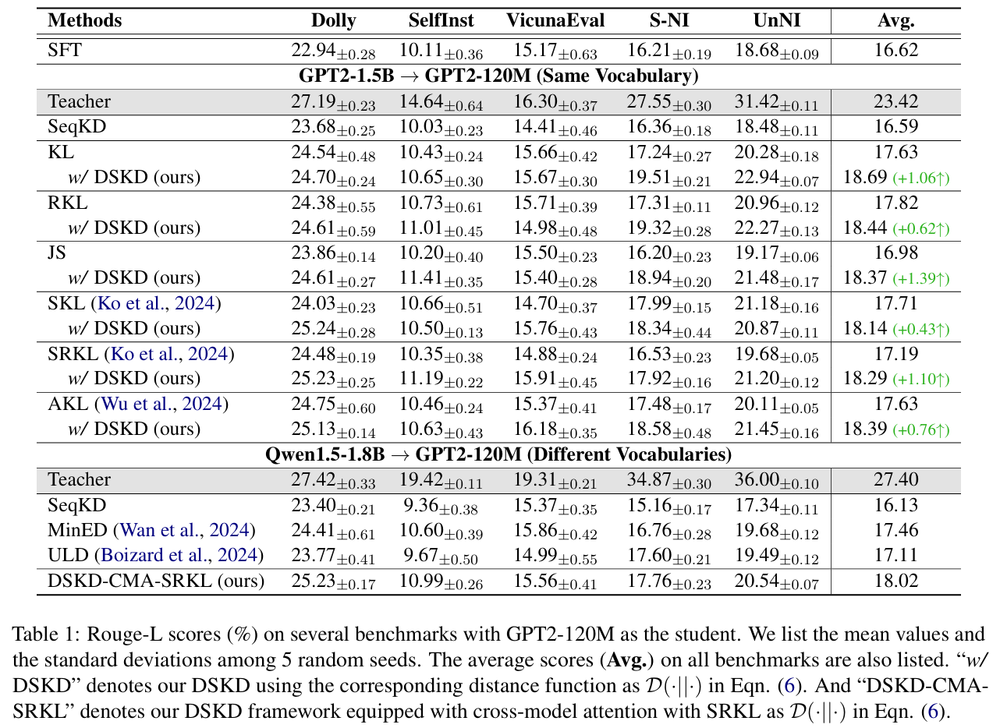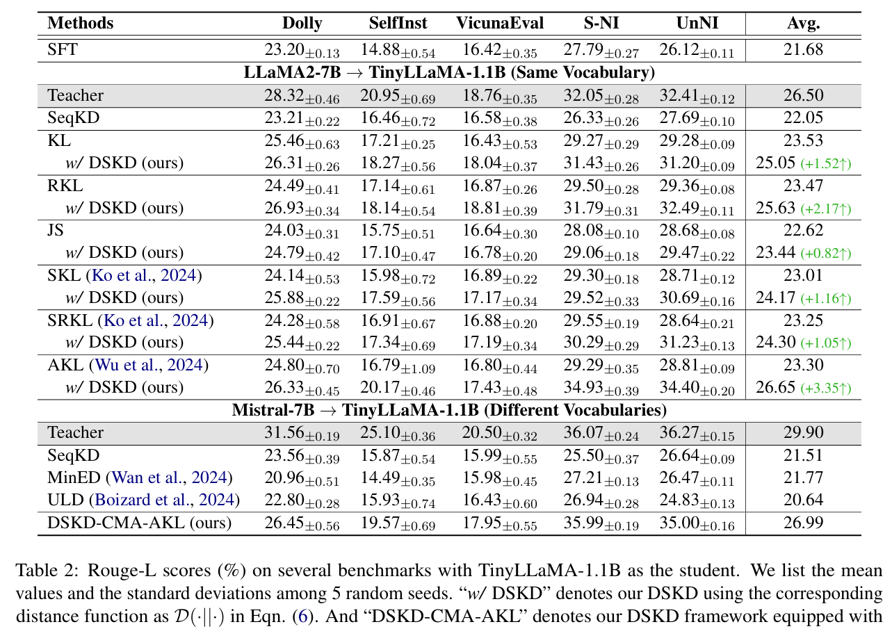

##  多层次对齐

### [Multi-Level Optimal Transport for Universal Cross-Tokenizer Knowledge Distillation on Language Models ](https://ojs.aaai.org/index.php/AAAI/article/view/34543)

AAAI 2025 (Oral)，Xiao Cui, Mo Zhu, Yulei Qin, Liang Xie, Wengang Zhou, Houqiang Li

#### 方法 MultiLevelOT
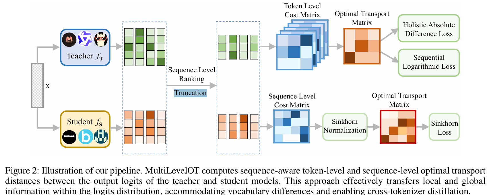

**MultiLevelOT** 两个层次的对齐：

1. **Token-level OT（词元层面）**：对每个句子的所有词一起计算分布差异，而不是逐个 token。它使用两种互补的代价矩阵：
   - **绝对差代价矩阵（L1距离，衡量直接差异）**：直接比较教师和学生输出的差异
   - **对数差代价矩阵（Log-diff，捕捉比例关系）**：捕获相对差异，对不同量级的输出更加敏感
2. **Sequence-level OT（句子层面）**：在整个序列范围上，再用最优传输度量整体语义差异， 能自动应对不同token切分方式造成的错位问题。

同时使用 **Sinkhorn Distance**（一种高效的Wasserstein距离近似）加快计算， 在保持语义结构信息的同时显著降低计算量。

#### 效果

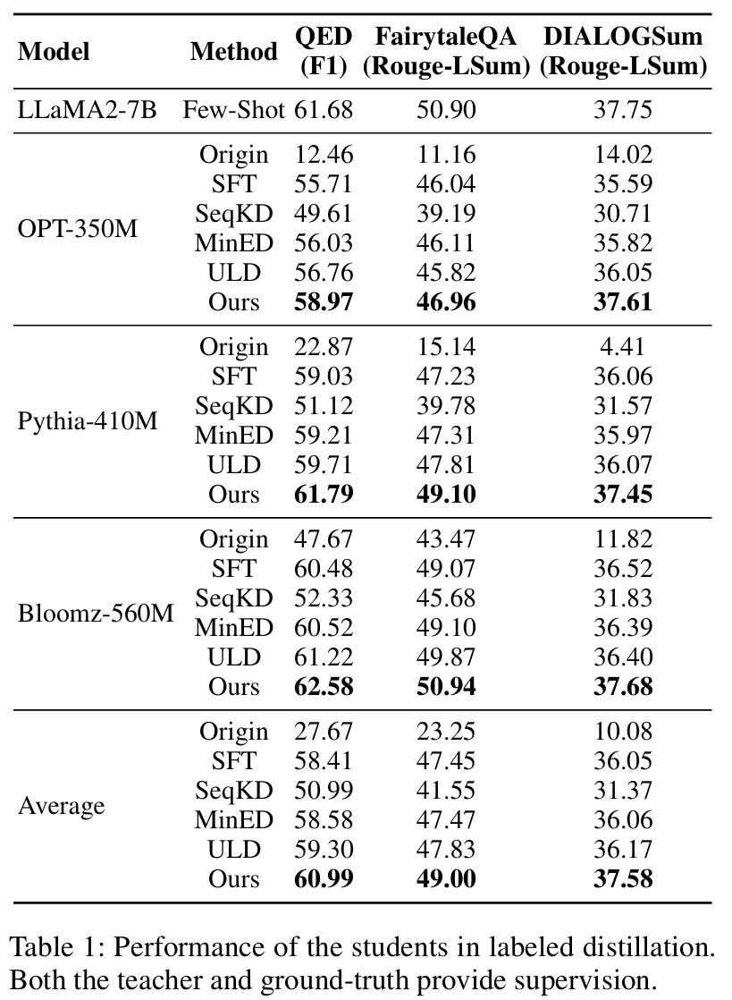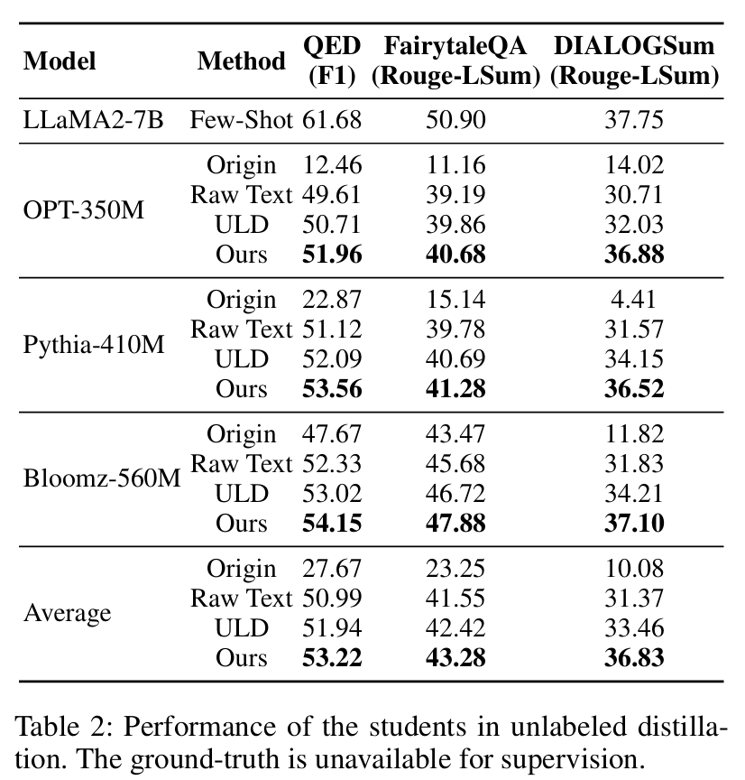

### [Enhancing Cross-Tokenizer Knowledge Distillation with Contextual Dynamical Mapping](https://arxiv.org/abs/2502.11104)

#### 方法 CMD

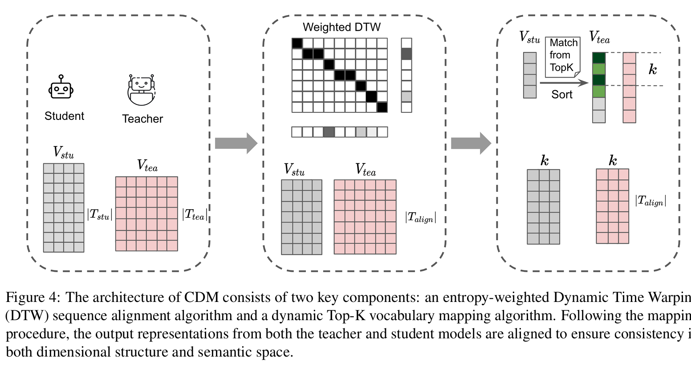

1.  动态时间规整（Dynamic Time Warping, DTW）使用 DTW 来匹配教师和学生在时间维度（token序列）上的**语义变化轨迹**，**自动对齐**不同分词方式下语义相近的部分；

- 引入 **熵加权机制**（Entropy-weighted DTW）：
  - 对教师输出**分布的不确定性**（entropy）加权，
  - 使得**语义更清晰的token**在对齐中占更大权重；
  - 提升对齐稳定性和鲁棒性。

2. 上下文动态映射（Contextual Dynamical Mapping, CDM）进一步构建 **上下文相关的动态语义映射矩阵**

- 该矩阵在训练中**自动学习每个教师token对应学生token的语义相关性**；
- 映射函数基于相邻上下文token的语义表示，动态调整；
- 形式上为：$M_{i,j} = f(h_i^T, h_j^S, C_i, C_j)$
   其中 $C_i, C_j$ 表示局部上下文表示，$h_i^T, h_j^S$分别为教师与学生的隐藏状态。

> CDM 让学生不需要知道教师具体的token，而是学习教师在上下文语义层面上的模式。

3. 语义一致性蒸馏损失（Contextual Distillation Loss）$L_{CDM} = L_{CE} + \lambda_1 L_{DTW} + \lambda_2 L_{CM}$

#### 效果

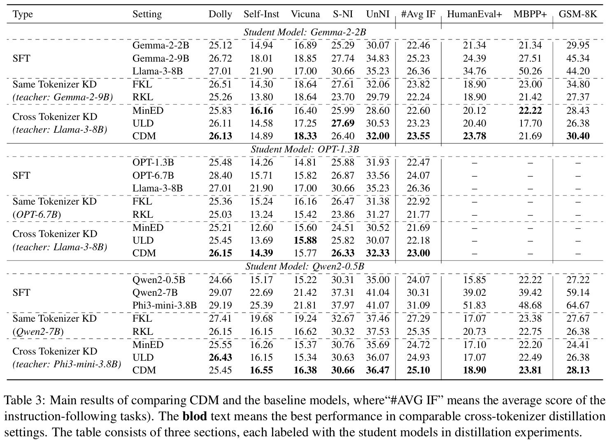

好的，下面是对论文 **Universal Cross‑Tokenizer Distillation via Approximate Likelihood Matching**（arXiv: 2503.20083）的方法与效果的详细说明。

------

### [EMO: Embedding Model Distillation via Intra-Model Relation and Optimal Transport Alignments - ACL Anthology](https://aclanthology.org/2025.emnlp-main.385/)

 EMNLP 2025，[Minh-Phuc Truong](https://aclanthology.org/people/minh-phuc-truong/), [Hai An Vu](https://aclanthology.org/people/hai-an-vu/), [Tu Vu](https://aclanthology.org/people/tu-vu/), [Nguyen Thi Ngoc Diep](https://aclanthology.org/people/nguyen-thi-ngoc-diep/), [Linh Ngo Van](https://aclanthology.org/people/linh-ngo-van/), [Thien Huu Nguyen](https://aclanthology.org/people/thien-huu-nguyen/), [Trung Le](https://aclanthology.org/people/trung-le/)

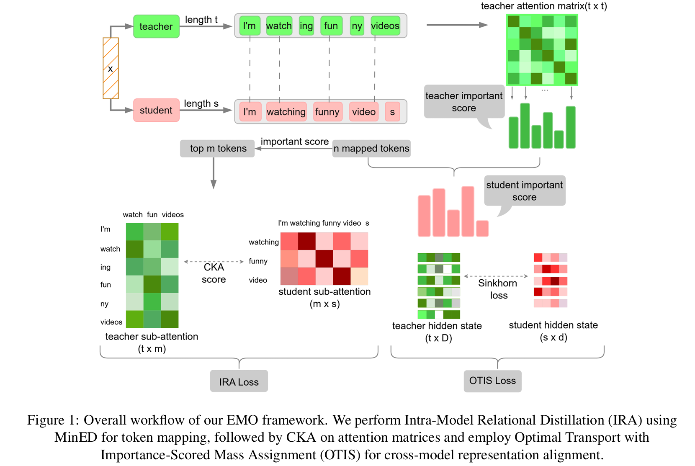

#### 方法 EMO

让学生模型在**语义与结构层面**对齐教师模型。

1. 使用 Minimum Edit Distance (MinED) 找到教师与学生序列中**“最相似”的 token 对**，建立基础的 **1-1 token 映射**。
2. 内部结构关系蒸馏（Intra-Model Relation Alignment, IRA）
   1. 对已匹配的 token，利用教师模型的**注意力矩阵）*计算哪些 token 最重要；
   2. 选取其中 **top-m 个最关键 token**；
   3. 通过 Centered Kernel Alignment (CKA) 比较教师与学生的**注意力结构相似度**；
   4. 使学生在内部层级上**学习教师的结构关系**（即哪些词关注哪些词）。

> 保留教师模型在**上下文理解和注意力分布**上的结构知识

3. 跨模型语义对齐（Optimal Transport with Importance-Scored Mass Assignment, OTIS）
   1. 对教师和学生的**最后一层隐藏状态**进行语义对齐；
   2. 使用 **Optimal Transport（最优传输）** 计算从教师分布到学生分布的最小代价；
   3. 并根据注意力权重赋予 token “重要性分数”，让重要的 token 在传输中占更大权重。

> 学生能学到教师**语义空间**的分布

4. 最终训练目标结合三部分：$$L_{EMO} = \alpha L_{CE} + (1 - \alpha)(L_{IRA} + L_{OTIS})$$

#### 效果

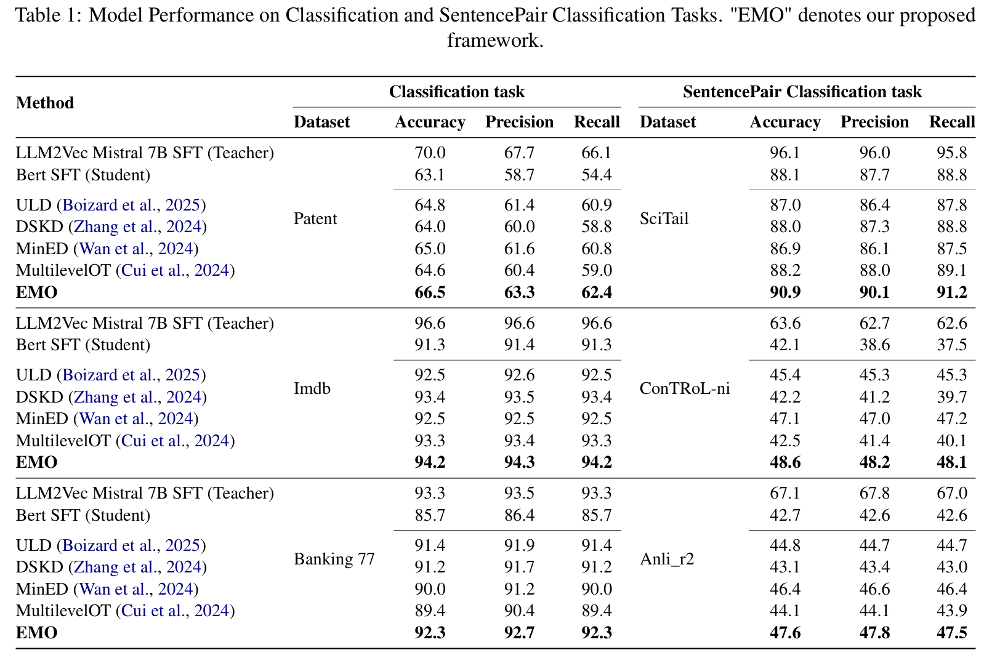

### 

## 文本对齐

### [Overcoming Vocabulary Mismatch: Vocabulary-agnostic Teacher Guided Language Modeling](https://arxiv.org/abs/2503.19123)

Haebin Shin, Lei Ji, Xiao Liu, Yeyun Gong

#### 方法 VocAgnoLM

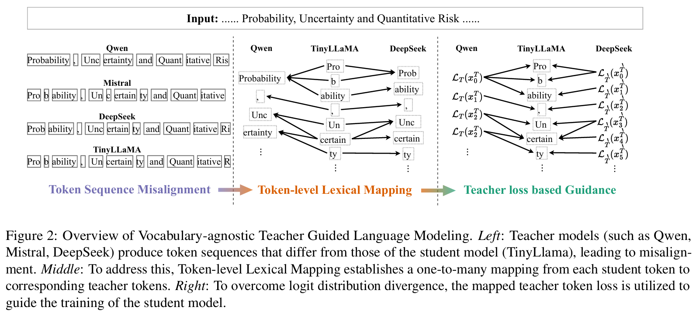

1. **Token-level Lexical Alignment（词元级词汇对齐）**
   - 首先使用**字符级偏移**（character-offsets）来定位学生模型和教师模型各自的 token 在原文中的起止位置。
   - 对于每一个学生 token，找出教师模型中覆盖同一原文片段（或几乎同一片段）的一个或多个 token。也就是“一个学生 token ↔ 多个教师 token”的映射关系（one-to-many）。。
2. **Teacher Guided Loss（教师引导损失）**
   - 在建立 token 映射之后，学生模型训练时会参照教师模型在对应 token（或 token 块）上的行为。
   - 教师模型在其 token 输出上有一个损失（比如标准语言建模损失），学生通过映射机制，借助教师的损失/输出作为信号来训练。

#### 效果

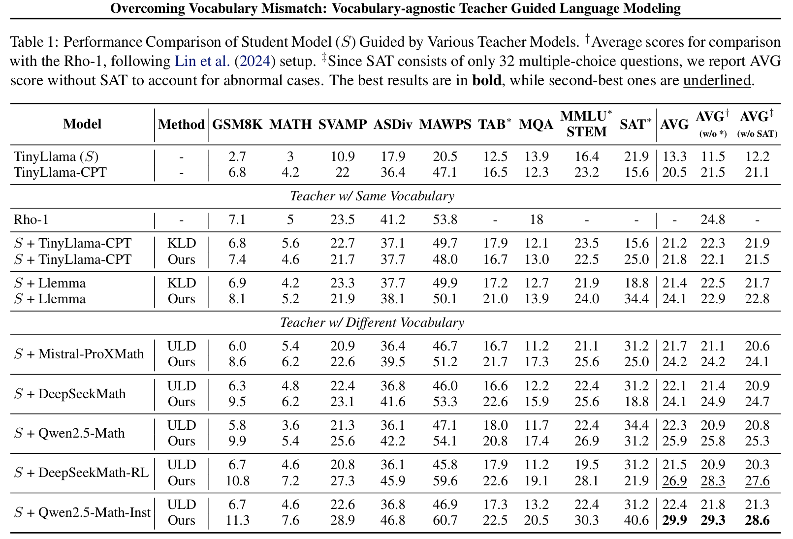

### [Universal Cross-Tokenizer Distillation via Approximate Likelihood Matching](https://arxiv.org/abs/2503.20083)

Benjamin Minixhofer, Ivan Vulić, Edoardo Maria Ponti

#### 方法 AML

对齐在“相同意思的文本片段”上的概率

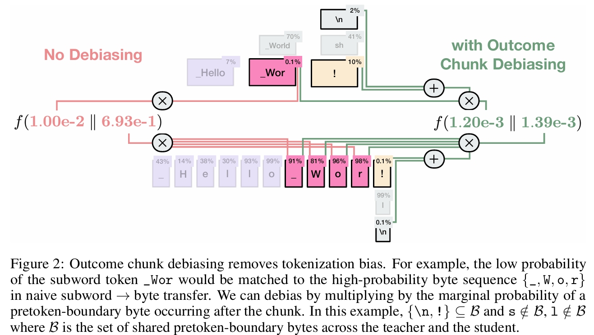

1. **识别可比 token-chunk 对齐 (chunk alignment)**

   - 给定输入文本 (x)，分别使用教师模型和学生模型的 tokenizer 得到两个 token 序列。
   - 在这两个 token 化序列中，寻找“语义上对应”的子序列块 (chunks)，即教师序列中 token (i:j) 与学生序列中 token (k:l) 对应同一原文片段。公式表示为：
     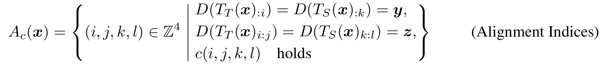
   - $T_T, T_S$是教师／学生的 tokenization 函数，$D$ 是解码函数。这样就建立了一组可用于比较的“chunk”对。

2. **Chunk-level 概率对齐**

   - 对于每个 chunk 对 $(i,j,k,l)$，定义教师在该老师 token 块上的概率（teacher likelihood）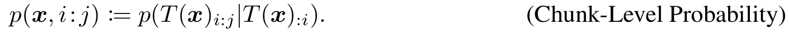学生类似地$p_S(x,k:l)$ 。 

   - 目标是最小化教师与学生在这些 chunk 上的差异。由于 chunk 的可能数量几乎无限，作者采用一种 **二元 (binarised) f-divergence** 的近似方式：
     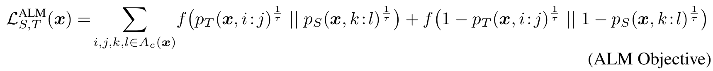

      其中 (τ) 是温度超参数，$f$ 是某个 f-divergence 函数。

   - 这种方式不需要词表一致，也不要求输出维度匹配，因为它只考虑对应 chunk 的概率，而不是整个词表维度的对齐。

3. **Outcome Chunk 去偏差 (Debiasing)**

   - 由于不同 tokenizer 在分词偏差上不同 (“tokenization bias”)，教学-学生在 chunk 对齐中可能带有偏差。作者提出 “outcome chunk debiasing” 机制：在计算 chunk 概率时，额外乘以某些边界字符出现概率，以减轻 tokenization bias 的影响。

4. **隐状态对齐可选 (Hidden-State Distillation)**

   - 为了进一步增强学生模型的内部语义结构学习，作者还可选地加入隐藏层状态对齐损失：将教师与学生隐藏层（hidden states）在已对齐 token/chunk 处进行距离最小化（例如用 L2 距离）:
     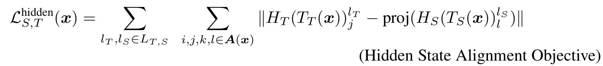
      其中 $proj(·)$ 是学生隐藏状态向教师维度的投影函数。

5. **总体损失与训练**

   - 最终训练目标可为混合蒸馏 (hybrid) 或纯蒸馏 (pure) 模式。在混合模式中，加入标准 next-token 预测任务；而在纯模式中，仅用上述 ALM + 隐状态对齐作为目标。作者还提出一种梯度权重机制 (GradMag) 来平衡不同损失组件。

   #### 效果

   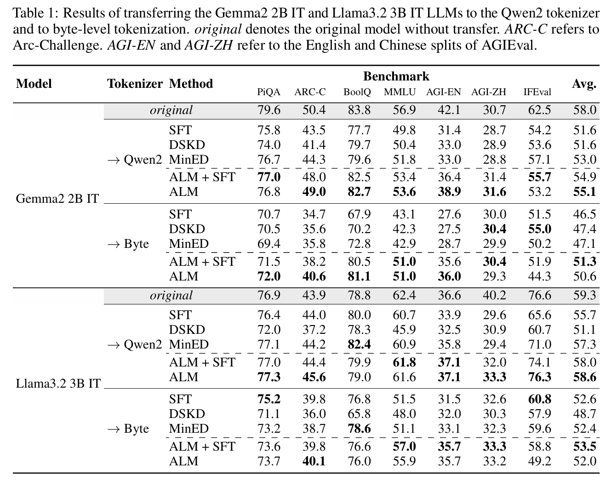

## 推理对齐

### [CoT2Align: Cross-Chain of Thought Distillation via Optimal Transport Alignment for Language Models with Different Tokenizers](https://arxiv.org/abs/2502.16806)

Anh Duc Le, Tu Vu, Nam Le Hai, Nguyen Thi Ngoc Diep, Linh Ngo Van, Trung Le, Thien Huu Nguyen

#### 方法 COT2ALIGN

现有方法如 Universal Logit Distillation (ULD) 与 Dual‑Space Knowledge Distillation (DSKD) 已经部分解决了词典不匹配的问题，但 **往往忽视了模型的“推理能力（reasoning capability）”** 的迁移。本文认为：教师模型不仅输出答案，而且输出推理过程

 COT2ALIGN 框架:

1. **Chain-of-Thought (CoT) 增强**
   - 在教师模型生成数据时，除了标准输出（直接答案）之外，还生成带有 CoT 的推理过程（即“思路/步骤 + 答案”）作为训练素材。
   - 学生模型在蒸馏中不仅学习标准输出，还学习 CoT 输出，从而增强其推理能力。
2. **Cross-CoT Alignment（跨 CoT 对齐）**
   - 定义两类对齐损失：
     - $L_{CRC}$：将学生的标准输出与教师的 CoT 输出对齐。
     - $L_{CST}$：将学生的 CoT 输出与教师的 CoT 输出对齐。
   - 通过这两者，使学生模型能“模仿教师的推理过程”而不仅仅是最终答案。
3. **序列级与层级级的最优传输对齐 (Optimal Transport, OT)**
   - 现有 token-wise 对齐（例如 ULD 用 Wasserstein 距离对齐不同词典下的概率分布）有其局限，因为长度不同、词典不同导致 token 对齐困难。
   - 本文将 OT 扩展至 **“序列级（sequence-level）”** 和 **“层级级（layer-wise）”** 对齐：
     - 将教师与学生在 embedding 层、最后隐藏层（last hidden states）作为两个序列分布进行对齐。
     - 构造成本矩阵（cost matrix）基于教师／学生 token 表示的相似度（通过投影、规范化等）计算。
     - 求解熵正则化的 OT 以获得最优运输计划 $T^*$，从而定义 OT 损失$L_{OT}$。
   - 这种方式不要求两者使用同一维度词典，也不要求输出长度相同，有效支持跨词典蒸馏。
4. **整体损失函数**$ L = (1 - \alpha),L_{CE} + \alpha,(L_{CRC} + L_{CST} + L_{OT} + L_{KD}$
   - 其中$L_{CE}$ 是标准交叉熵监督损失，$L_{KD}$是传统蒸馏损失，(\alpha) 控制蒸馏 vs 监督之间比例。
   - 通过上述机制，学生既从教师获取答案，也学习其推理“链条”，同时跨词典对齐其隐藏表示。

#### 效果

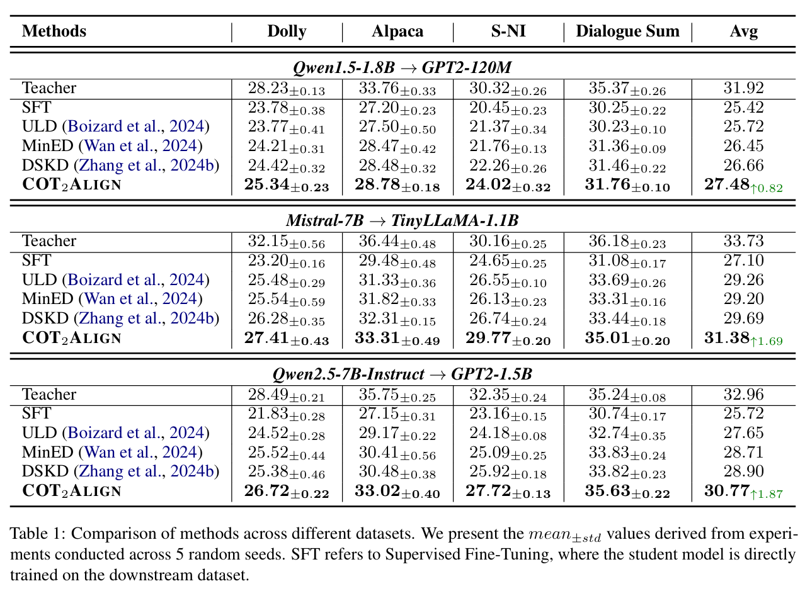