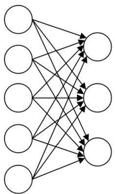
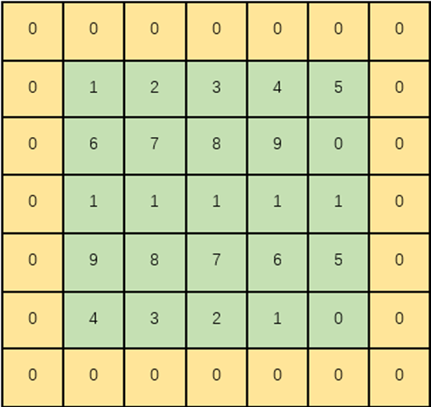

# Convolutional Neural Network

## 卷积神经网络概述

### 引例——图像边界检测

假设我们有这样的一张图片，大小8×8，图的中间两个颜色的分界线就是要检测的边界。怎么检测这个边界呢？
  
图片中的数字代表该位置的像素值，像素值越大，颜色越亮，所以为了示意，我们把右边小像素的地方画成深色。  
设计一个 滤波器（filter，也称为kernel），大小3×3：  
  
**“卷积”过程**：用filter，往原图片上覆盖，对应元素相乘，然后求和。计算一个区域之后，就向其他区域挪动，接着计算，直到把原图片的每一个角落都覆盖到了为止。  
  
上面的例子是检测竖直边界，我们也可以设计出检测水平边界的，只用把刚刚的filter旋转90°即可。对于其他的特征，理论上只要我们经过精细的设计，总是可以设计出合适的filter的。

**卷积神经网络（convolutional neural network,CNN ）**是一种包含**卷积运算**的**前馈神经网络**，它的人工神经元可以响应一部分覆盖范围内的周围单元，对于大型图像处理有出色表现，是深度学习的代表算法之一。  
主要就是通过一个个的filter，不断地提取特征，从局部的特征到总体的特征，从而进行图像识别等等功能；  每个filter中的各个数字就是参数，可以通过大量的数据，来**让机器自己去“学习”这些参数**。这就是CNN的基本原理。

### CNN发展历史

* 1960s， Hubel 和 Wiesel通过对 **猫视觉皮层细胞** 的研究，提出了 **感受野** 这个概念。
* 1980s， Kunihiko Fukushima 在 **感受野** 概念的基础之上提出了 **神经认知机** (neocognitron )的概念，可以看作是卷积神经网络的第一个实现网络。
* 1990s， Yann LeCun 等人发表论文**LeNet**，确立了 CNN的现代结构，后来又对其进行完善。
* 2012，更深层次的 **AlexNet**网络 取得成功，此后卷积神经网络蓬勃发展，被广泛用于各个领域，在很多问题上都取得了当前最好的性能

### CNN基本结构

ＣＮＮ的基本结构由**输入层**、**隐藏层**、**输出层**构成。其中隐藏层又包括**卷积层**、**池化层** 、**全连接层**。  
卷积层和池化层一般会取若干个，采用**卷积层和池化层交替设置**，即一个卷积层连接一个池化层，池化层后再连接一个卷积层，依此类推。由于卷积层中输出特征面的每个神经元与其输入进行局部连接，并通过对应的连接权值与局部输入进行加权求和再加上偏置值，得到该神经元输入值，该过程等同于卷积过程，ＣＮＮ 也由此而得名。  
  

* **卷积层**
  * 局部特征提取
  * 训练中进行参数学习
  * 每个卷积核提取特定模式的特征  
* **池化层**
  * 降低数据维度，避免过拟合
  * 增强局部感受野
  * 提高平移不变性
* **全连接层**
  * 特征提取到分类的桥梁
  * 用于输出结果
  
会在卷积层和全连接层后增加Dropout层，随机让部分结点停止工作，防止过拟合现象的产生，提高模型的泛化能力。

### 卷积神经网络与全连接神经网络对比

#### 1. 局部连接

传统的前馈神经网络，前一层的结点 与后一层的结点全部连接起来，这种连接方式称为全连接，如图所示。
  
如果前一层有m 个结点，后一层有n个结点，就会有m×n个连接权重，完成一次反向传播更新权重时，要对这些权重进行重新计算，造成了O(m×n)=O(n2) 的计算开销和存储开销。  

局部连接的思想是两层之间只有相邻的结点才进行连接，即连接都是“局部”的，如图所示。
  
以图像处理为例，图像的某一个局部的像素组合在一起共同呈现一些特征，而图像中距离比较远的像素组合起来则没有实际意义，因此这种局部连 接的方式可以在图像处理问题上有较好的表现。  
如果把连接限制在空间中相邻的C个结点，就 可把连接权重降低至C×n, 计算开销和存储开销就 降低至0(C×n)=O(n)。

#### 2. 权重共享

在全连接神经网络中，当计算从输入层经隐藏层到输出层，权重矩阵中的每个元素都只使用
过一次，即每个元素与输入矩阵中的一个元素相乘，之后不会再重复利用。  
卷积神经网络是在输入图像的不同位置使用同一个卷积核进行计算。对于每一个卷积核，它的核内参数在计算过程中都是不变的。  

**卷积核内部的值就是权重**，卷积运算是将卷积核的权重与对应的输入图像矩阵元素按位相乘，最后将结果相加，卷积神经网络的权重参数 量显然比全连接神经网络的参数量减少了很多。参数量减少的同时，也 有效地避免了过拟合现象的产生。

## 卷积层

### 为什么使用卷积

SVM分类步骤：

* **人工提取特征**，比如说大小，形状，重量，颜色等；
* 根据上述特征，把每一张图片映射到空间中的一个点，空间的维度和特征的数量相等；
* 相同类别的物体具有类似的特征，所以空间中标记为草莓的点肯定是聚在一起的，香蕉和橘子也是同理。  
图像分类任务的瓶颈出现在**特征选择**上

除了橘子橙子问题，我们还有猫狗如何区分，狗品种如何识别等一系列问题。我想对于大部分人来说，狗狗品种的识别是非常有难度的。转了一圈回来，突然发现，图像分类任务的瓶颈竟然出现在特征选择上。（诚然目前有SIFT、HOG、LBP、LDP等自动提取特征的算法，但是效果并不理想，有局限性。）

如果我们用神经网络直接对猫狗进行分类呢？这样不就避开了特征提取这一步了吗？假设输入图片大小为30*30，那么设置900个输入神经元，隐含层设置1000个神经元，输出神经元个数对应需要的输出数量不久好了吗？甚至用SVM也可以这样做，把一张30×30的图看作900维空间中的一个点，代表猫的点和代表狗的点在这个900维的空间中必然是相聚于两个簇，然后我们就又可以使用SVM来划出分界线了。

手写数字辨识的几何空间解释  
  
手写字28*28=784，每一张图片在784维空间都是一个点，所有的图片映射到784维空间解释一个点云。每种数字图像都会在784维空间的点会形成一个聚类，同一个数字就会聚在一块。

但是这样计算开销就太大了，对于30×30的图片我们也许可以这样做，对于1000×1000的图片我们这样做的话就需要至少一百万个隐层神经元，这样我们就至少要更新10^12个参数。而SVM的话，则相当于在一百万维的空间中运行了。运算量将会大的难以估计。另外，图片中并不是所有的信息都和是我们需要的。背景对我们的分类毫无价值，然而在这种一股脑全部拿来做输入的情况下，背景也被当成了特征进入了模型当中，准确度自然会有所下降。

总之，如果不人工提取特征，那么计算量会非常大，精确度也无法保证。而人工提取特征的方式又会在某些问题下难以进行，比如狗狗品种分类。  
而CNN通过他独有的方式，成功解决了这两个问题。也就是说，CNN是一个可以自动提取特征，而且待训练参数相对不那么多的神经网络，这就是CNN在图像分类任务中的决定性优势。

**卷积的两个主要优势在于**：稀疏连接（sparse connectivity）和参数共享(parameter sharing)

* 稀疏连接：每一个神经元不需要去感受全局图像，只需要感受局部的图像区域
* 参数共享：卷积层中的卷积核正是充当着共享感受野的角色。一个卷积核提取一个特定的图像特征，想要得到图像的多个特征，只需要使用多个卷积核

### 卷积运算

卷积层接收到图像后，会对图像进行卷积运算。  
卷积运算就是使用一个特征检测器，在图像上进行扫描，不断地检测图像的每一个区域，**与特征检测器的模式越相似，它的激活值就越高，从而实现了特征提取功能**。在卷积运算中，特征检测器就是卷积核，也称为滤波器。
使用的卷积核大小为3×3矩阵，如下图左侧所示。对输入图像进行卷积操作后的得到的矩阵如图中间所示。同样的，矩阵中的数值代表图像的亮度，数值越大，对应像素的亮度更强。卷积得到的矩阵对应的图像如图右侧所示。由图可见，通过使用这个卷积核，我们很好的得到输入图像中间的垂直边缘这一特征。事实上，卷积神经网络正是通过设置和调整卷积核的参数来获取输入的特征。

例如，输入图像尺寸为4×4,使用尺寸为3×3的卷积核进行卷积运算，可得到2×2的特征图，如图一所示。  
  
卷积核的尺寸通常设置为3×3 、5×5 、7×7  等。卷积核的权重不需要提前设计，只需要初始化，然后即可在卷积运算中经梯度下降算法和反向传播算法得到优化。  
输入图像与卷积核进行卷积运算的步骤如下：  
(1)将卷积核置于输入图像的左上角，然后将对应元素相乘求和。  
(2)将卷积核向右**移动一个步长**，重复步骤(1),即可输出同一行的第二个值。  
(3)重复步骤(2),每次向右移动一个步长，直到卷积核的右侧边缘到达输入图像的右侧边缘，即完成特征图的一行。  
(4)回到输入图像的最左侧且向下移动一个步长，重复步骤(2)和步骤(3)计算特征图的下一行。  
(5)重复步骤(4),直到卷积核的下方边缘到达输入图像的下方边缘。  

### 多通道卷积

彩色图像有R，G，B三个通道，这是我们该如何实现卷积呢？  

  
对于输入的图像，我们不仅仅想要得到图像中垂直边缘的特征，同时还想得到更多的特征如水平边缘，边角，弧线等。这个时候应该怎么办呢？答案是**增加卷积核的个数**。  

**卷积层的卷积核和输入/输出通道数关系如下：**  
(1)卷积层的输入通道数视输入图像而定，如RGB图的通道数为3,灰度图的通道数为1。  
(2)卷积核的通道数和卷积层的输入通道数相同。  
(3)卷积层的输出通道数需视卷积核的数量而定，而且卷积层的输出通道数就是下一层卷积层的输入通道数。  

### 卷积计算的思考

* 特征图的尺寸变化
* 图片边缘数据被利用的次数（在卷积核滑动的过程中，图像边缘的像素点参与的卷积计算远少于图像内部的像素点，导致图像边缘的大部分信息丢失）  

#### 填充（padding）

为了尽可能多地保留原始输入图像的边缘信息，可在输入图像周围填入固定的数据，称为填充，
一般情况下都填0,故也称为补零操作。  
例如，尺寸为4×4的输入图像，可先在其周围加上一圈1个像素的0作为填充，再进行卷积运算

根据填充操作的不同，常用的卷积填充方式可分为VALID卷积和SAME卷积。  
  

* valid卷积（valid convolutions）：如果输入是n×n的图像，用一个f×f的卷积核卷积，那么得到的输出是（n-f+1）×（n-f+1）的特征图。
* same卷积（same convolutions）：填充后输出和输入图像的大小是相同的。如果输入是n×n的图像，当你填充p个像素点后，n就变成了n+2p。根据n+2p-f+1=n便可计算p的值。

所以最佳的填充方式是**同时使用VALID卷积和SAME卷积**，当输入过大时可以采用VALID卷积，想要挖掘更多特征时可以采用SAME卷积。

**为什么添加的是0而不是其他数值呢？**  
因为在卷积时，如果添加了其他数也会在运算的时候对结果产生影响，我们只需要利用被“拯救”的边缘数据，其他部分的0与滤波器中对应的数据相乘还等于0。  

**不使用Padding的缺点**

* 经过卷积操作后图像会缩小。
* 如果你注意角落边的像素，则此像素点只会被卷积核触碰一次。即只会在第一次卷积操作时被卷积核扫描。这意味着会丢失图像边缘的很多信息。
* 但是对于原始图像中心的像素点，在每次卷积操作时都会被扫描。卷积核的感受野会扫描此位置多次。

#### 步长（stride）

卷积神经网络中的步长指的是在一次卷积计算完成后，**卷积核在输入图上移动的距离**。假设输入是5×5的图像，卷积核大小为3×3，使用valid卷积，步长为2，那么卷积的结果如下图所示  

#### 激活函数

在使用卷积核对输入进行卷积运算得到特征图之后，往往需要使用激活函数对特征图进行激活，卷积神经网络激活函数首选为ReLU。  
ReLU激活函数的优势：  

* 反向传播时，可以避免梯度消失；
* Relu会将一部分神经元的输出置为0，这样就造成了网络的稀疏性，并且减少了参数的相互依存关系，缓解了过拟合问题的发生；
* 相对于sigmoid激活函数，tanh激活函数，求导简单。

#### 卷积核

## 池化层

池化层紧跟在卷积层之后，同样由多个特征面组成，它的每一个特征面唯一对应于其上一层的一个特征面，不会改变特征面的个数。卷积层是池化层的输入层，卷积层的一个特征面与池化层中的一个特征面唯一对应。**池化层旨在通过降低特征面的分辨率来获得具有空间不变性的特征 。池化层起到二次提取特征的作用，它的每个神经元对局部接受域进行池化操作。**

上图显示，池化就是对特征图进行特征压缩，池化层也被称为下采样层。

### 作用

* 减少参数数量，提高计算效率
* 提高局部平移不变性，大大提高了图像分类的准确性
* 降低了数据维度，有效地避免了过拟合
* 增强网络对输入图像中的小变形、扭曲、平移的鲁棒性

### 池化方法

* 最大池化（max pooling）：取局部接受域中值最大的点；
* 平均值池化（average pooling）：对局部接受域中的所有值求均值。
使用时仅需要指定池化方法的类型（max pooling或average pooling等）、池化的核大小（**kernel size**）和池化的步长（**stride**）等超参数。

### 池化层和卷积层不同

池化层**没有要学习的参数**，池化只是从目标区域中取最大值或者平均值。经过池化运算，输入数据和输出数据的通道数也不会发生变化。  
特征图会因为池化运算而压缩变小，可以使用调整步长和填充补零的方法，来达到 池化运算后的特征图不会缩得太小的目的。

Pytorch中常用的池化层

## 全连接层

## CNN应用案例

将AlexNet、VGG和NiN的模型参数大小与GoogLeNet进行比较。后两个网络架构是如何显著减少模型参数大小的？

* **模型参数规模对比**

    | 网络架构   | 参数量（约） | 特点                     |
    |------------|--------------|--------------------------|
    | **AlexNet**| 60 million   | 全连接层占90%以上参数     |
    | **VGG16**  | 138 million  | 深层小卷积核，全连接层庞大 |
    | **NiN**    | 1-3 million  | 全局平均池化替代全连接层  |
    | **GoogLeNet**| 5-7 million| Inception模块 + 1x1卷积降维 |

---

* **NiN和GoogLeNet减少参数的核心方法**
  * **1. NiN（Network in Network）**

    * **全局平均池化（Global Average Pooling）**：  
       直接对最后一个卷积层的每个通道取全局平均值，生成一个与类别数相同的向量（如1000类）。**避免了全连接层**，参数减少90%以上（例如，AlexNet的FC层有约4000万参数，而NiN此部分参数几乎为0）。

    * **MLP卷积层（1x1卷积）**：  
       用多层1x1卷积替代传统卷积层，增强非线性能力的同时减少参数。例如：  
      * 传统3x3卷积：输入256通道→输出256通道，参数为 $3×3×256×256=589,824$。  
      * 1x1卷积：参数仅为 $1×1×256×256=65,536$，减少近9倍。

  * **2. GoogLeNet（Inception v1）**

    * **Inception模块的1x1卷积降维**：  
       在3x3和5x5卷积前插入1x1卷积，减少输入通道数。例如：  
      * 输入256通道 → 1x1卷积降维到64通道 → 3x3卷积输出128通道。  
      * 参数：$1×1×256×64+3×3×64×128=16,384+73,728=90,112$。  
      * 若不用1x1降维，参数为 $3×3×256×128=294,912$，减少约70%。

    * **无全连接层，全局平均池化**：  
       与NiN类似，GoogLeNet也使用全局平均池化代替全连接层，进一步压缩参数。

    * **并行多尺度卷积（Inception结构）**：  
       通过并行不同尺寸的卷积核（如1x1、3x3、5x5）提取多尺度特征，避免堆叠单一卷积导致的参数膨胀。

---

* **总结**

  * **NiN**：通过1x1卷积和全局池化，直接消除全连接层，参数降至百万级。  

  * **GoogLeNet**：利用Inception模块中的1x1降维和全局池化，参数控制在百万级，同时保持高性能。  
  * **对比VGG/AlexNet**：两者仍依赖庞大的全连接层和未优化的卷积结构，导致参数规模显著更大。
