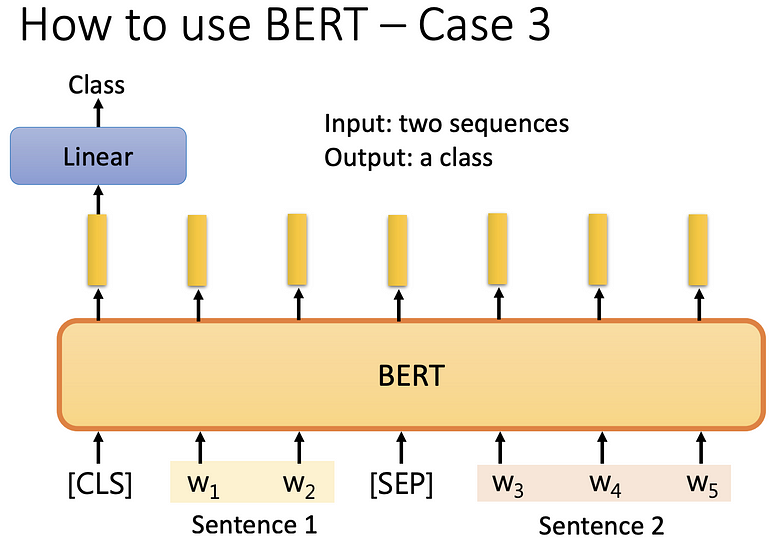

# Bert

ELMO 最早的监督学习 → 再来是 BERT →ERNIE → 大鸟  

模型参数比例比较:

- ELMO(94M)
- BERT(340M)
- GPT-2(1542M)
- Megatron(8B)
- T5(11B, google 做的 model)
- Turing NRG(17TB)
- GPT-3(175B)
- [Switch Transfer](https://arxiv.org/pdf/2101.03961.pdf)(1.6T, google 做的 model)

## 什么是Self-supervised Learning

而 self-supervised learning 是在没有 label 的情况下，将数据分为两部分，一部分当作 label（标注），一部分当作训练 neuron model 输入的数据，例如将数据 x，一部分作为 x'，一部分作为 x''，将 x' 输入到模型中，输出 y，我们要将 y 和 x''（label 或标注） 越接近越好。

self-supervised learning 可看作是一种 unsupervised learning（没有 label 的训练方法），但因 unsupervised learning 是比较大的 family，有很多种不同的方法，为了比较明确的说明，所以称为 self-supervised learning，这句话最早是 Yann LeCun 说的。

## 以 BERT 作为说明

BERT 是 transformer encoder （self-attention. residual. normalization...），也就是说输入一排矢量，输出 sequence 长度=输入 sequence 长度，通常用于 NLP ，但不只可以用于文字， 声音. 图像都可以被当作 sequence。只是最早用于文字，这里先用 NLP 来做介绍  

### 屏蔽输入

随机决定一些**文字要盖住**或是**换成其他随机的文字**，盖住也就是替换为一个非中文字，换成其他随机文字，就是随意填一个文字。    

再来将盖住的部份，所输出的**矢量做 linear transform** （也就是乘以的矩阵），再做 softmax 输出得到一个分布（因为有做 Softmax），输出一个很长的向量，包含所有想要处理的文字，每字都对应到一个分数。      

但我们知道盖住的文字应该是什么，比如说是“湾”，输出与这个 **ground truth 越接近越好（minimize cross entropy）**，就像是做分类，只是多少类别与感兴趣的文字一样多。

### next sentence prediction

通常做 BERT，同时ˇ也会做 next sentence prediction 从数据库中拿出两个句子，**中间加入 [SEP] 表示分隔**，**开头加入 [CLS] 表示起点**，丢入 BERT，**只看这两个句子是否相接**，但 RoBERTa 说这方法不太有用，因为看两个句子是否是接起来的，可能太**简单**了，但有另种方法和 next sentence prediction 很像，称 **SOP**，文献上说比较好用，方法是**将一个句子拆两个个部分，顺序可能是颠倒的，丢入 BERT 问句子是否先后顺序是怎么样，会将 SOP 用于 ALBERT。**（可能因为做这个判断比较难，因此效果比较好）

### Pre-train+fine-tune

这样看来 BERT 只能做两件事，一是做填空题，二是看句子是否接在一起，但二看起来不太有用，所以实际上只做填空题？ 这是不对的  

BERT 会被实际运用会于无关填空题的地方，例如 downstream task，所谓 downstream task 就是我们真正实际在意的任务，也就是说，做完 BERT 后，在拿来去做各式各样的事情，所以 **BERT 就像胚胎干细胞，之后可以分化为各式各样的细胞，此称为 fine-tune（将 BERT 做微调）**，而**产生 BERT 的过程称为 Pre-train**。  

因通常会将 BERT 做多种任务，其中的标竿任务集为 GLUE （General language understanding evaluation），要评估做的 BERT 好不好，就会将它分别微调到九个任务上，所以会得到九个模型，再算平均的准确率，表示 self-supervised learning 的好坏  

GLUE 与人类判断做比较，黑色线为人类，蓝色虚线为 GLUE 平均，平均比较好可能只是代表这个数据集被完坏了，所以后来有其他的任务集被提出。

## How to use BERT

### 分类问题（情感分析）

输入一个 sequence，输出一个类别，例如判断一个句子是正面或负面。 首先将一个 sequence 头加入 [CLS]，丢入 BERT 中，会得到 n+1 个输出，现在只看 [CLS] 的输出，做 linear+softmax，得到一个分类，**linear 是随机初始化的，BERT 是 init by pre-train**（要得到 BERT model 之前，需要有大量标注过的资料，去训练才能得到），会使用 init by pre-train 是因为比随机初始化好，最后 BERT 和 Linear 都要做 gradient descent 来得到结果结果。

我们会说一个完成的 sentiment analysis model 就是 linear transformer+ BERT 的结果。

比较 BERT 有去做 pre-train 和随机初始化的差异

### 输入输出长度一致（词性标注）

输入一个 sequence，输入相同长度的 sequence。  

[CLS]+sequence 输入 BERT ，每个 token （在中文中，就是每个字）输入到 BERT ，输出向量，做 linear transform（乘上一个矩阵），再做 softmax，得到每个字属于哪个词性。 此 BERT 不是随机初始化，在 pre-train 中已经做过训练。

### 自然语言推理（NLI）

输入两个 sequence，输出一个类别。

例如：给机器前提（premise）和架设（hypothesis）的两个句子，推出这两个句子之间的关系。 premise 是 A person on a horse jumps over a broken down airplane，hypothesis 是 A person is at a diner，推测这两个句子是

- contradiction：冲突
- entailment：有因果关系
- neutral：不冲突也没有因果关系

将两个句子丢到 BERT，两个句子中间**用 [SEP] 连起**来，最前面放 [CLS] 的这个符号， 将一整串丢到 BERT，BERT 输出一整串东西，**只取 [CLS] 的输出**，做 linear transform （矩阵相乘），再做 softmax 的到一个分类 ，在 NLI 中就是两个句子是否矛盾的三种情况，我们一样需要一些标注资料才能训练此模型，BERT 是经过 pre-train 的，而非随机初始化的。

### Extraction-base Question Answering (QA) 也就是问答系統

给机器一篇文章，问限制性的问题（extraction-base question 就是**答案一定在文章中**），机器给答案，输入有 D（文章）、Q（问题） 的 Sequence，如果是中文的话 D 和 Q 皆表示中文的字，将 D 和 Q 丢到 QA model （经过 BERT pre-train 过的）中得到 s 和 e 的正整数的答案，**s 和 e 表示答案在文章中词汇第 s 个到第 e 个字**。

讲个更具体一点，将问题和文章用 [SEP] 相连，前放 [CLS]，放到一个 pre-train 过的 BERT，会得到一连串的向量，**拿 random initialized 的橙色向量（表示 answer 的起点）**去与 document 经过 BERT 所得到的向量去做 inner product，再做 softmax，得到 n 个数值 （与 document 数量相同），数值最大的即为答案起点。    

BERT 输入长度理论没有限制，但实际上运算量很大，例如 512 个字的文章，其中要做 inner product，就是 512*512。  

相同的也拿蓝色矢量（是 random initialized，表示 answer 的终点）做相同的事情。  

### Seq2Seq

上面介绍的部分皆没有包含 Seq2Seq 的 model，如果要做 Seq2Seq 的 model 的 pre-train，先将 encoder 的输入 corrupted （弄坏），期望 decoder 的输出，与 encoder 的输入的 corrupted 之前的结果相同。

**如何做 Corrupted 呢？**   

MASS 最先提出的方法是用 mask，将 encorder 的输入盖掉，之后还有删除. 颠倒句子. 旋转. mask+delete 的方法，后来有个方法称为 BART，将上述所有方法都弄过一遍，认为这样效果最好。

T5 是 transfer text-to-text transformer 的缩写，因为有 5 个 T 所以称为 T5，将所有上述所有的方法都做过一遍，T5 是训练在 C4 上的 dataset，C4 有 7T，C4 去做前处理要做 300 天以上？！

 

## Why does BERT work?

BERT 如何运作的？  

因一字多义，同为“果”，向量却差很远。  

评断两个果的相异程度 ，颜色越黄代表越相近，自己与自己比较是黄色。发现BERT可以学习到“果”不同上下问的不同含义的。    

一个字个意思取决于上下文，BERT = word embedding 的 CBOW 的 deep learning version，此时 BERT 又称为 contextualized word embedding。  

  

  

## Reference

[【機器學習2021】自督導式學習 (Self-supervised Learning) (二) – BERT簡介](https://www.youtube.com/watch?v=gh0hewYkjgo)

[【機器學習2021】自督導式學習 (Self-supervised Learning) (三) – BERT的奇聞軼事](https://www.youtube.com/watch?v=ExXA05i8DEQ)

[自督導式學習 (Self-supervised Learning)_李弘毅_ML2021#8 | by Z.H. Shen | Medium ](https://medium.com/@ZH_Shen/自督導式學習-self-supervised-learning-李弘毅-ml2021-8-51b5c9fde97)