# Self-attention

## 引入

前面学到的内容输入都是一个向量，假如输入是一排向量（并且长度不一样），又应如何处理。  

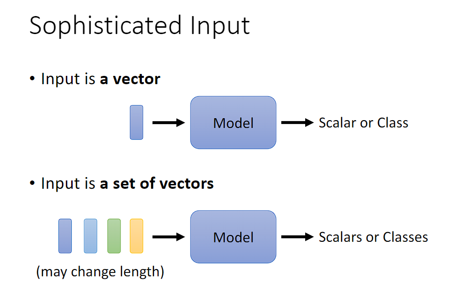

### 输入

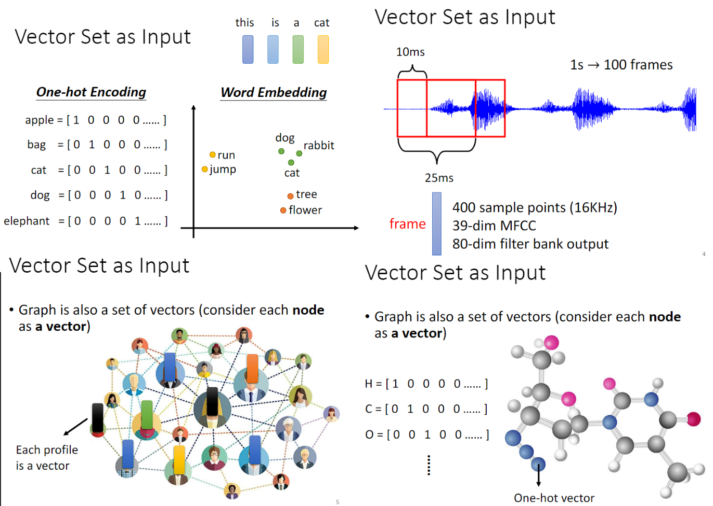  

#### 文字处理

输入是一个句子，将句子的每一个词汇表示成一个向量。  

##### One-hot Encoding

向量的长度就是世界上所有词汇的数目，用不同位的1（其余位置为0）表示一个词汇。  

问题： 但是它并不能区分出同类别的词汇，里面没有任何语义的信息。

##### Word Embedding

给单词一个向量，这个向量有语义的信息，一个句子就是一排长度不一的向量。将Word Embedding画出来，就会发现同类的单词就会聚集，因此它能区分出类别。  

#### 声音信号

取一段语音信号作为窗口，把其中的信息描述为一个向量（帧），滑动这个窗口就得到这段语音的所有向量。  

#### Graph

* **社交网络**的每个节点就是一个人，节点之间的关系用线连接。每一个人就是一个向量，可以将这个人的各种信息（如性别、年龄、他说过的话等等）都用向量来表示。
* **分子**上的每个原子就是一个向量（每个元素可用One-hot编码表示），分子就是一堆向量。

### 输出

#### 一对一（Sequence Labeling）

每个输入向量对应一个输出标签。

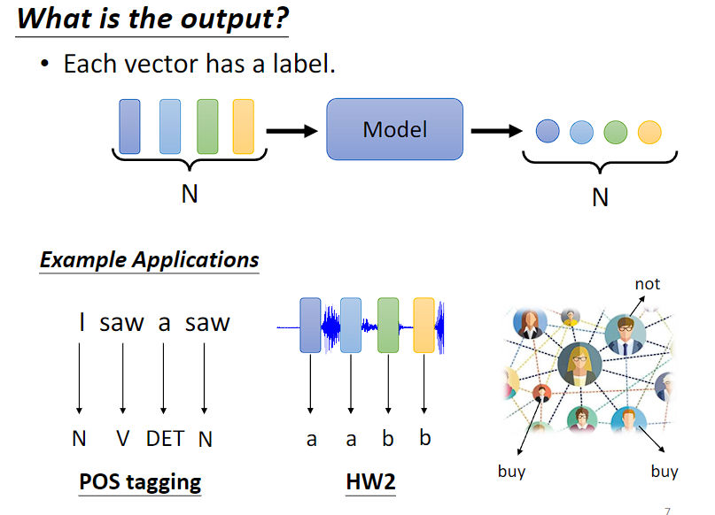

* 文字处理：词性标注（每个输入的单词都输出对应的词性）。
* 语音处理：一段声音信号里面有一串向量，每个向量对应一个音标。
* 图像处理：在社交网络中，推荐某个用户商品（可能会买或者不买）。

#### 多对一

多个输入向量对应一个输出标签。

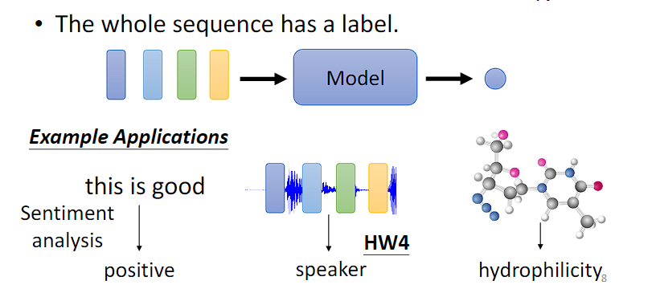

* 语义分析：正面评价、负面评价。
* 语音识别：识别某人的音色。
* 图像：给出分子的结构，判断其亲水性。

#### 由模型自定（seq2seq）

不知道应该输出多少个标签，机器自行决定。

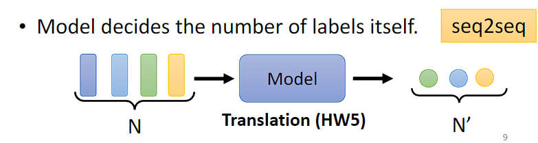

* 翻译：语言A到语言B，单词字符数目不同
* 语音识别

### Sequence Labeling

假如现在要做词性分析，简单的想法是给将每个输入向量都单独丢入一个全连接层（以下简称 FC）中，然后生成一个 label。  

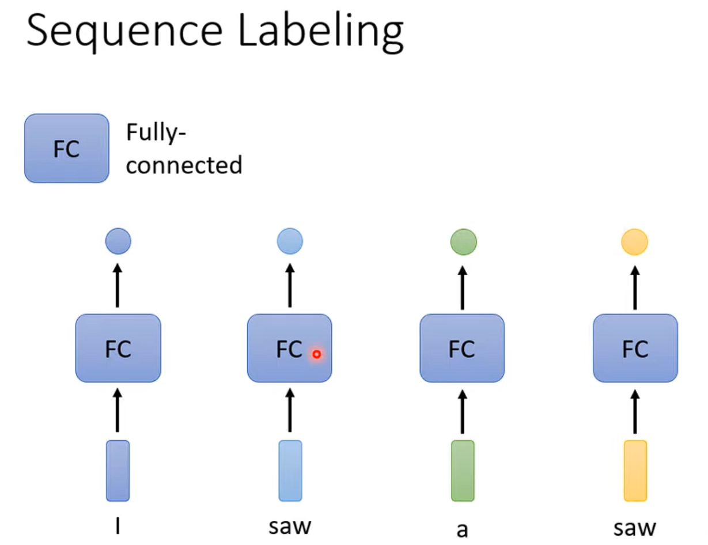

当这会带来一个问题，对于 saw 这个词来说，第一个 saw 是动词，第二个 saw 是名词，但是对于 FC 来说它俩并无区别。  

要区分 saw 是动词还是名词，显然要**根据上下文信息决定**，所以可以考虑**把上下文信息一起丢入 FC**，如此一来即可对 saw 进行区分。  

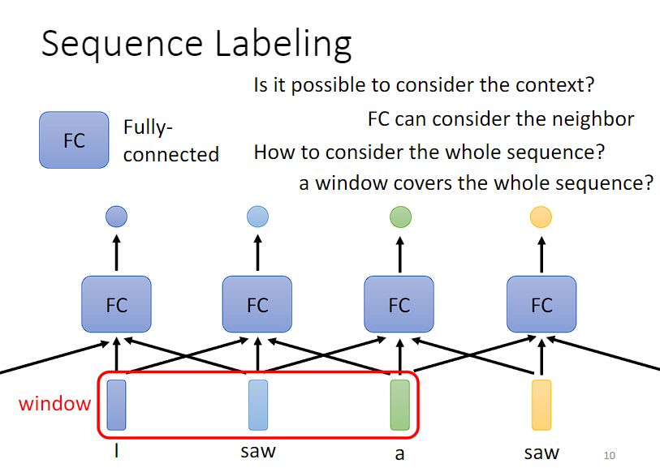

这个例子中考虑的上下文并不长，假如有一个待解决问题要考虑整个 Sequence 才能够解决，一个直接的想法是把 window 开大点，直到包括整个 Sequence，但是 **Sequence 的大小是不固定**的，你需要统计出最长的 sequence，并且 window 开大了，就意味着 **FC 需要非常多的参数**，不**仅运算量很大，还容易导致 overfitting**。  

这就引出了 Self-attention 技术

## Self-attention

Self-attention 会吃一整个 input sequence，然后输出同等长度的 sequence，输出的每个向量都是考虑了整个 input sequence 才得到的。然后再将 Self-attention的输出丢入 FC，如此一来 FC 就考虑整个 input sequence 的资讯再来决定应该输出什么样的结果。  

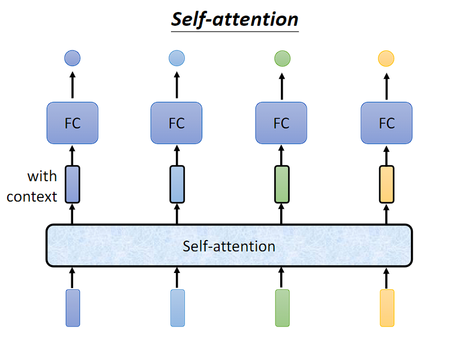

Self-attention 可以叠加很多次：FC 输出后可以再丢入 Self-attention，再考虑一次整个 sequence 的资讯。可以把 Self-attention 和 FC 交替使用，Self-attention 处理整个 sequence 的资讯，FC 专注于处理某个位置的资讯。  

​    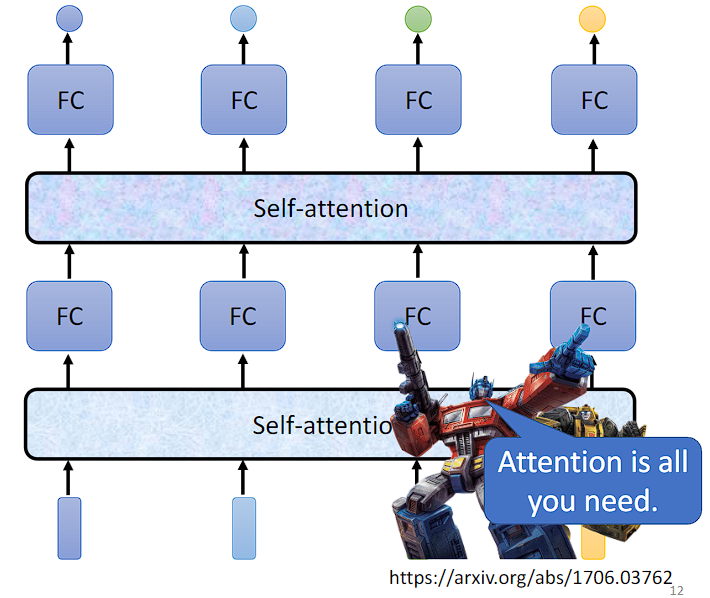

### 内部实现

由于 Self-attention 可以叠加，所以它的输入不仅来自训练数据还可能来自隐藏层。  

**Sequence labeling 的输出 $b^1$ (考虑整个 input sequence )如何产生？**

$α$：表示输入的 $a^1$跟其他输入矢量之间的**相关性**，它会去考虑其他矢量里面，有没有哪些信息是$a^1$输出到 $b^1$会用到的。  

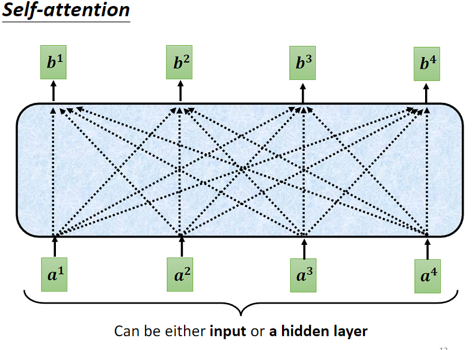

#### 注意力分数 $α$

这个模块有许多实现，其中两种实现方式分别是 `Dot-product` 和 `Additive`。  

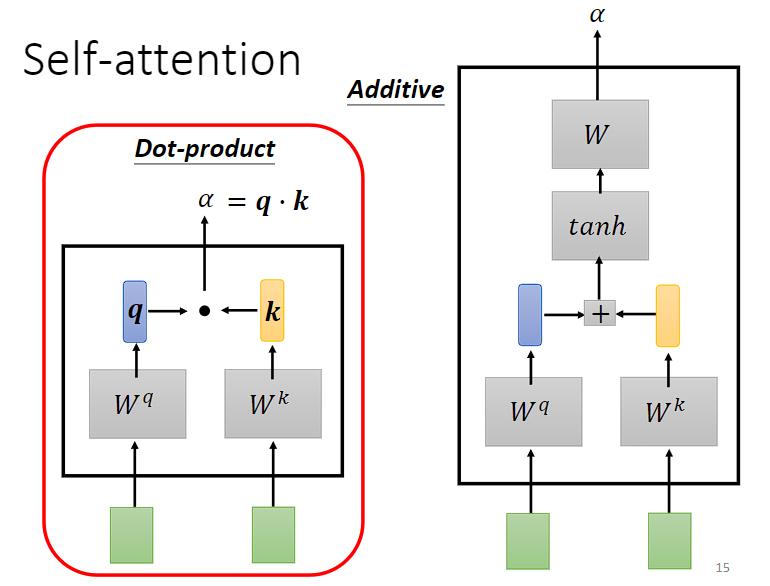

`Dot-product `是对两个输入向量分别做线性变换（乘上可学习的矩阵 W）得到查询向量 $\vec{q}$和 键向量  $\vec{k}$（这样做的目的是将原始输入映射到一个更高维度的表示空间中，以增加模型的表达能力），然后将 $\vec{q}$ 和  $\vec{k}$进行点积操作即可得到注意力分数 $α$。  

`Additv` 是将  $\vec{q}$  和  $\vec{k}$  串起来，然后丢入 `tanh` 函数，最后经过线性变换得到 $\alpha$。  

其中 Dot-product 简单有效，被用于 transformer 中，接下来将以 Dot-product 为例了解 Self-attention 的内部实现。  

##### 计算流程

- $\vec{q}$: query（查询向量）
- $\vec{k}$: key（键向量）

1. **线性变换**
   - $q_1 = W^q \cdot a_1$
   - $k_2 = W^k \cdot a_2$
   - $k_3 = W^k \cdot a_3$
   - $k_4 = W^k \cdot a_4$

2. **计算注意力分数**
   - $\alpha_{1,2} = q_1 \cdot k_2$
   - $\alpha_{1,3} = q_1 \cdot k_3$
   - $\alpha_{1,4} = q_1 \cdot k_4$
   - $\alpha_{1,1} = q_1 \cdot k_1$ (自注意力)

3.  activation function
   - 通常使用 `softmax`(其实用什么都可以啦，用`ReLU`结果也不错)：$$\text{softmax}(\alpha_{1,i}) = \frac{e^{\alpha_{1,i}}}{\sum_j e^{\alpha_{1,j}}}$$

计算每个向量和 $\vec{a}$的注意力分数，还要经过 `Soft-max `归一化处理，将注意力分数转换为概率分布，表示了对应位置的重要程度。这样可以避免某些位置的注意力权重过大或过小，提高了注意力机制的稳定性和有效性。并且将注意力分数进行 Soft-max 归一化后，得到的注意力权重可以看作是对应位置的输入的加权平均，其中权重表示了每个位置对于当前位置的重要程度。这样可以更好地捕捉输入序列中不同位置的相关性，提高了模型的性能。

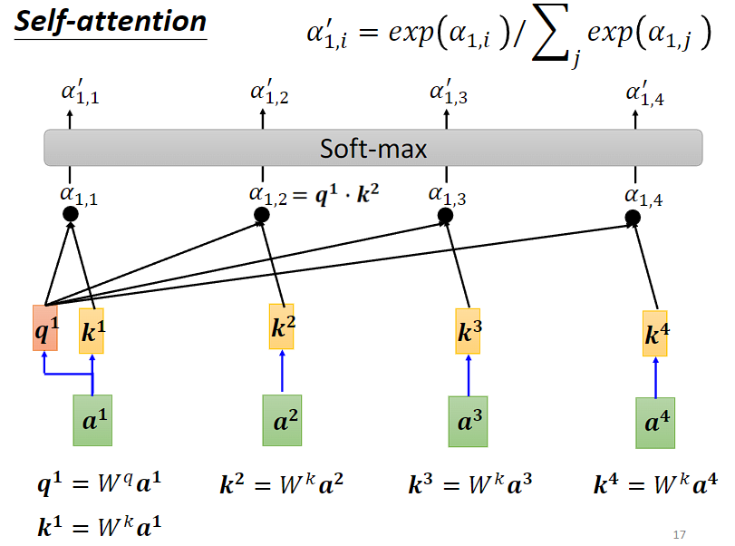

#### 计算$a^1$ 的输出 $b^1$

根据计算出来的$α$，我们已经知道哪些输入的矢量，跟 $a^i$ 最有关系，接着要透过 attention score 来抽取 sequence 中重要的信息。  

1. 将 $a^1$，$a^2$， $a^3$， $a^4$ 乘上一组新的矩阵（$W^v$），得到$v^1$， $v^2$， $v^3$， $v^4$。
2. 接着将 $α_{1,1}$ 乘上 $v^1$， $α_{1,2}$ 乘上 $v^2$，以此类推，最后加总起来得到 $b^1$。

因此谁的 attention score 比较大，也就是哪个向量跟$a^1$的相关性比较大，就更会影响到$b^1$，而这样的结果也符合我们的预期。

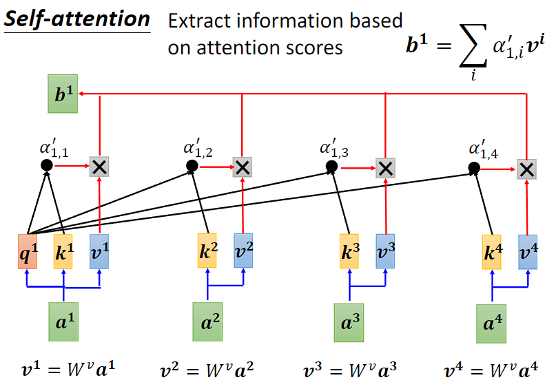

### 矩阵角度

每一个输入向量都要经过线性变换产生查询向量、键向量和数值向量，将这些向量分别组合成矩阵 I、Q、K 和 V，运算操作如下图。  

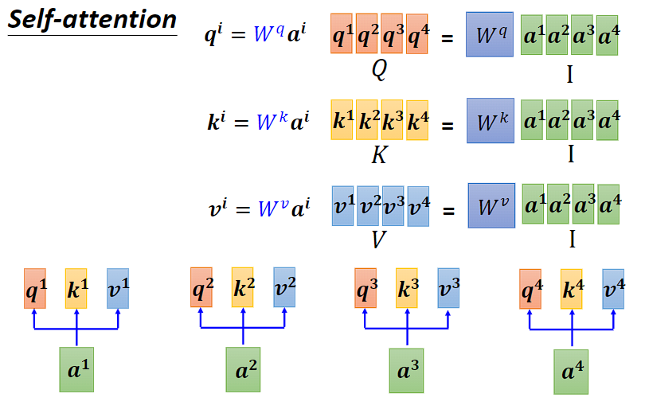  

注意力分数矩阵 $A=K^TQ$。然后将 A 经过 Soft-max 得到注意力权重矩阵 $A′$ 。

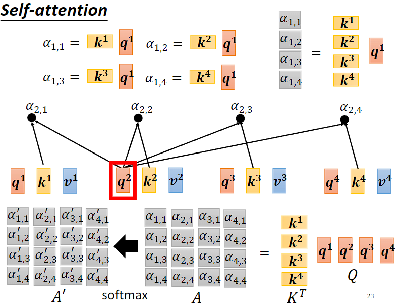

  Self-attention 的输出矩阵 $O=VA′$。

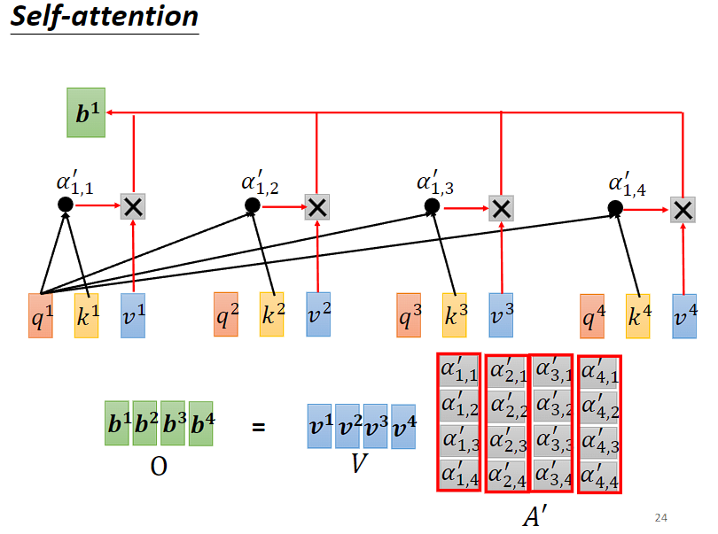

Self-attention 的总体计算流程  :

其中，只有 $W^q$,$W^k$,$W^v$是未知的，是需要学习的。

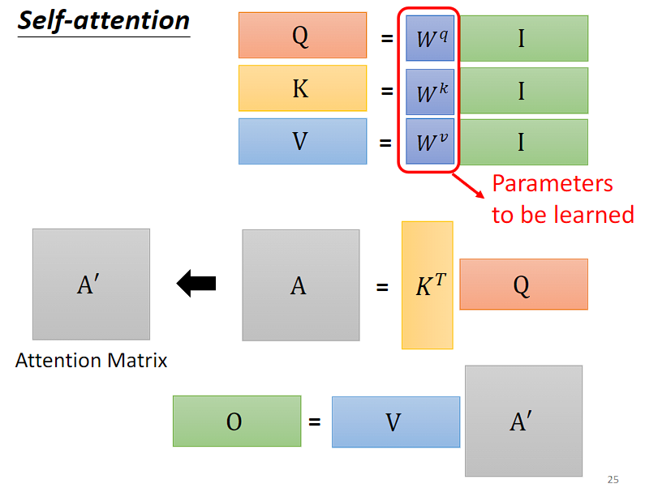

### Multi-head  Self-attention

Multi-head Self-attention 是 Self-attention 的进阶版本。前面所讲的 Self-attention 计算两个向量之间的注意力分数只用了一个 $\vec{q}$ 和 $\vec{k}$，相当于**只从一个角度观察两个向量的关联**，Multi-head Self-attention 则是**同时从不同的角度进行观察**，用不同的 $\vec{q}$ 来负责不同的观察角度。 

相关这件事情可能有很多种形式，可以把它想象成，为了要找到资料中不同种类的相关性，所以才会设定多个 multi-head 的 self-attention。而需要用多少个 head，是一个 hyperparameter。  

在语音识别、翻译等任务中，可能会需要用到比较多个 head。  

假设 multi-head 设定为 2，代表想要找到的相关性的种类有两个，因此 query， key， value 这些要学的参数也会有两种。   

以 2 头为例，每个头的计算方式与 Self-attention 一致。  

第一个头的输出：

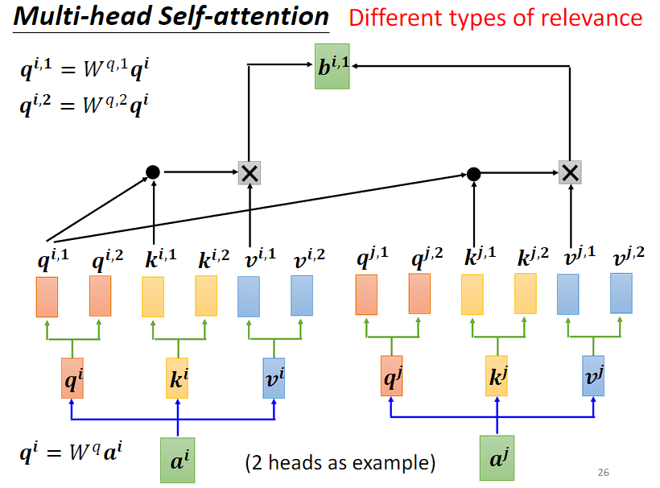

第二个头的输出：  

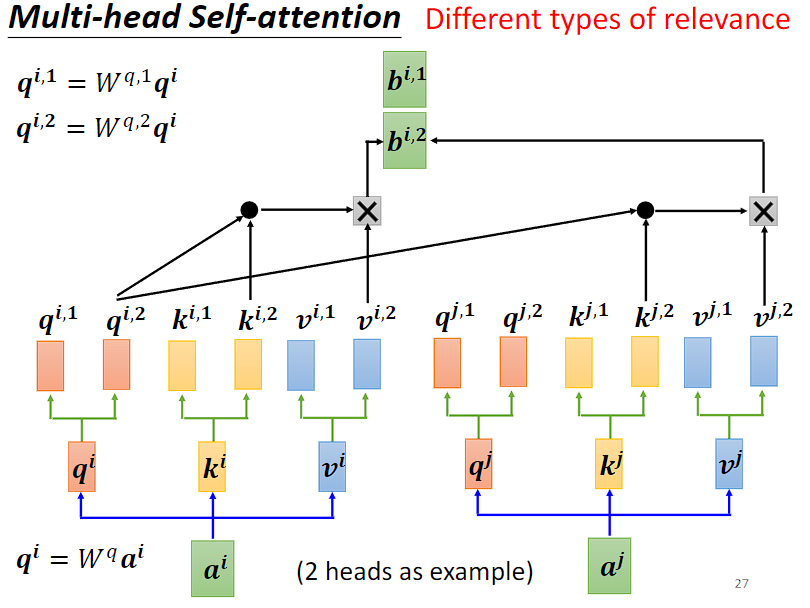

将每个头的输出拼接起来，得到多头自注意力的最终输出。通常会再进行一次线性变换，将多头输出映射到期望的输出维度上。    

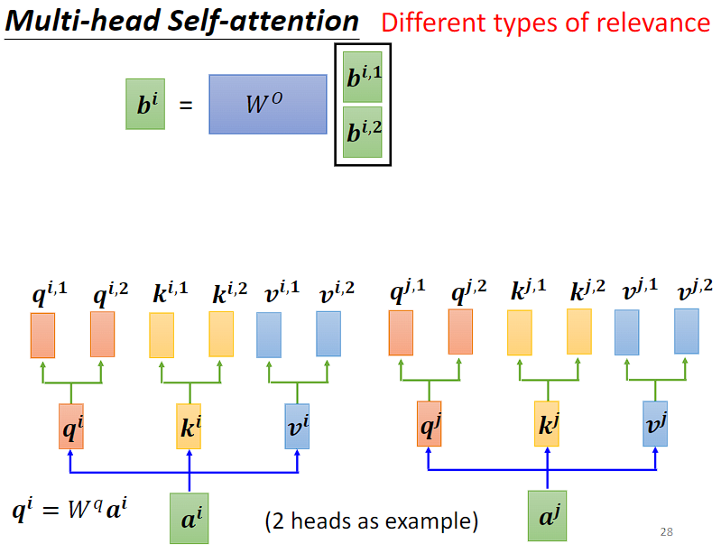

通过多个头并行计算注意力，模型能够从不同的角度对输入序列进行关注，捕捉更丰富的信息，提高模型的性能和表现力。

### Position Encoding

到目前为止还缺少一个也许很重要的资讯，即位置的资讯。对于 Self-attention 而言，对每一个输入的操作是一模一样的，输入向量是出现在 sequence 的哪个位置，它是完全不知道的。例如，在做词性标注时动词比较不容易出现句首，那么位置资讯可能就很有用。  

> “天涯若比邻”

如何为输入向量塞入位置资讯呢？Position Encoding 为每个输入向量设置一个唯一的位置向量 $\vec{e}$，将位置向量加上输入向量即可让 Self-attention 了解到位置资讯。  

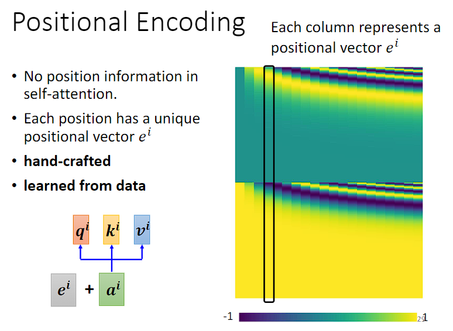

有各种方法产生位置向量，可以人工设置、Sinusoidal、通过学习得到。

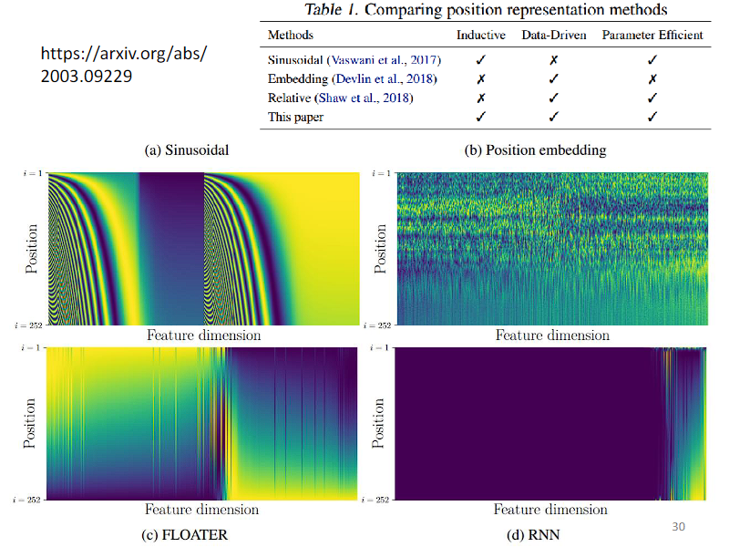

通常使用 Sinusoidal 来计算，位置编码矩阵中的每一行对应一个位置，每一列对应一个位置编码维度。

## 应用

Self-attention 广泛用于 NLP 领域
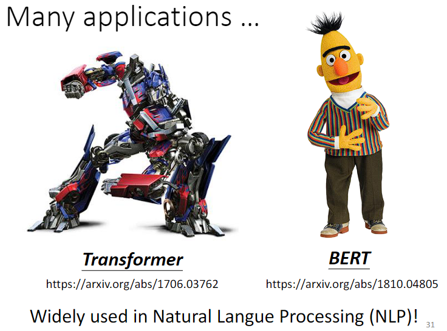

Self-attention 应用于语音，不过要经过一些小小改动，通常语音的每一个向量只代表了 10ms 的长度，一段语音的 sequence 太长了，可能会导致计算和内存开销过大的问题。  

**截断自注意力（Truncated Self-attention）**是一种用于处理长序列的自注意力机制的技术。截断自注意力通过限制每个位置只与其周围的一部分位置进行交互来解决这个问题，而不是与整个序列进行交互。具体来说，对于每个位置，只选择**与其距离不超过一定阈值的邻近位置进行注意力计算**，忽略超出阈值的远距离位置。  

通过截断自注意力，可以减少计算和内存开销，并且更适合处理长序列。然而，截断自注意力也可能会损失一些长距离依赖性信息，因此需要根据具体任务和序列性质来进行权衡和选择。

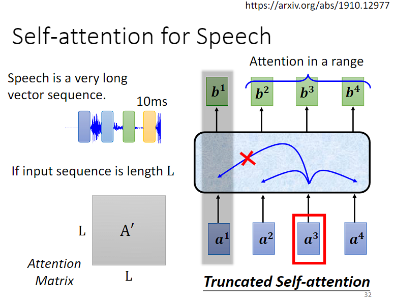

将图片的每一个像素看成是一个三维的向量，下面这张图片就有 5∗10个向量。从这个角度看待图片，当然也可以用 Self-attention 处理图片。

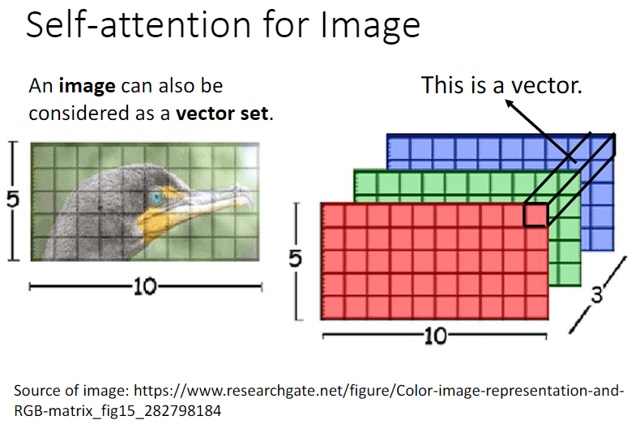

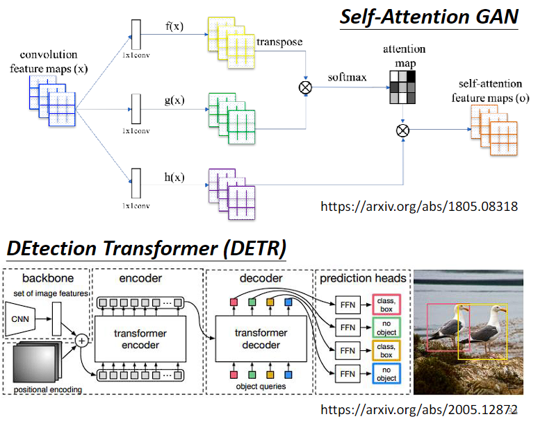

Self-attention 可以用于 Graph 上。之前做 Self-attention 时关联性都是要找出来的，Graph 中的边保存着关联信息，就不再需要通过机器寻找 node 之间的关联性。把 Self-attention 用在 Graph 上是 GNN 的某一种类型。  

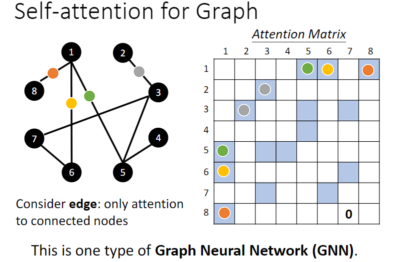

## Self-attention vs CNN

我们来看下 Self-attention 与 CNN 的对比。在图片识别中，CNN 只考虑感受域里的资讯，而 Self-attention 考虑整张图片的资讯。Self-attention 就好像是一个**复杂版的 CNN**，用 attention 找出相关的像素，就好像是**感受域是自动被学习出来的**，network 自己决定感受域是什么样子。  

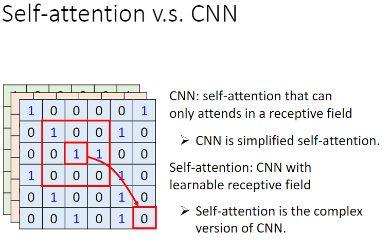  

在《On the Relationship between Self-Attention and Convolutional Layers》这篇论文上用数学的方式说明了 CNN 就是 Self-attention 的特例，只要设置合适的参数，Self-attention 可以做到和 CNN 一模一样的事。  

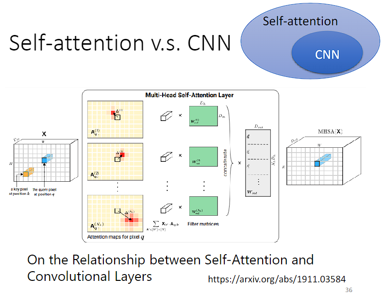

所以，Self-attention 是更 flexible 的 CNN，CNN 是有限制的 Self-attention。

**越 flexible 的模型需要越多的训练数据，否则有可能 overfitting。下面实验用不同量级的训练数据训练 Self-attention 和 CNN，观察下会发现所言不虚。**    

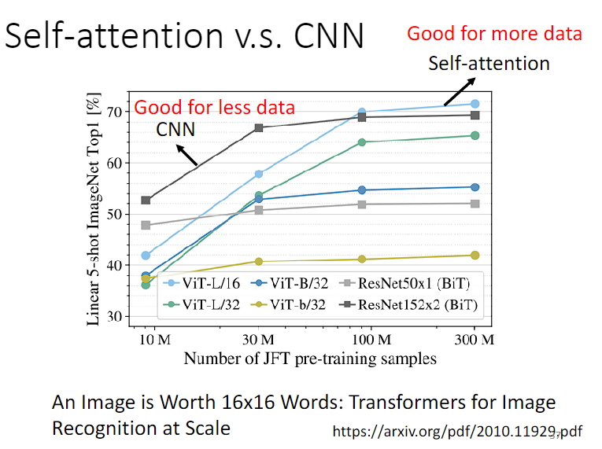

CNN 弹性较小，在比较少的训练数据上表现较 Self-attention 好；训练数据较多时，Self-attention 弹性大，能更拟合数据，而 CNN 没有办法从更大量的训练数据获取好处，效果自然不如 Self-attention。

## Self-attention vs RNN

RNN 是循环神经网络（Recurrent Neural Network）的缩写，是一种经典的神经网络结构，和 Self-attention 一样用于**处理序列数据**。  

RNN 在每个时间步接收输入数据和上一个时间步的隐藏状态，计算当前时间步的隐藏状态和输出，并将隐藏状态保存用于下一个时间步的计算。这样就能够在序列数据中**建模时间上的依赖关系**，并进行各种任务的预测和分析。  

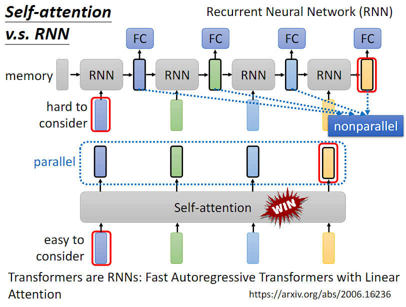

Self-attention 和 RNN 的区别：

- 并行性：由于 RNN 是逐步处理序列数据的，因此在训练和推理过程中，很难实现并行计算，导致计算效率较低。**自注意力机制中，元素之间的相关性可以并行计算**，因此可以更有效地利用硬件资源，提高计算效率。
- 长期依赖关系：传统的 RNN 在处理长序列数据时容易出现梯度消失或梯度爆炸的问题，难以捕捉长期依赖关系。自注意力机制可以直接捕捉序列中不同位置之间的关系，**不受距离限制**，因此可以更好地处理长期依赖关系。

## 未来研究方向

Self-attention 最大的问题是运算量非常大，怎么减少运算量是研究的重点。  

《Long Range Arena: A Benchmark for Efficient Transformers》比较了各种不同的 Self-attention 的变形，可以看到快的速度带来的是表现变差了。

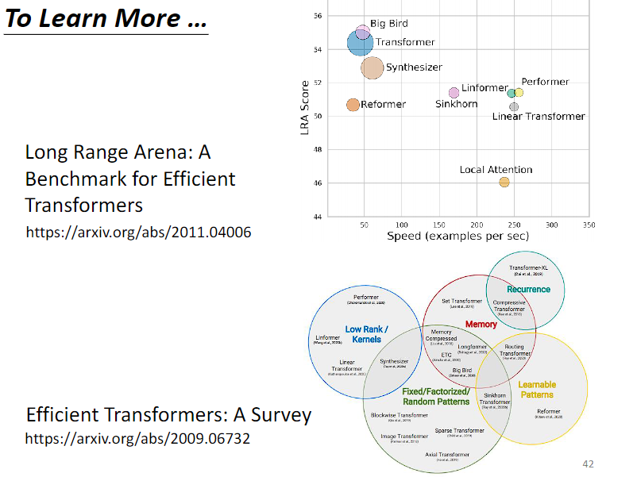

《Efficient Transformers: A Survey》是一篇综述性论文，主要介绍了关于如何提高Transformer模型的效率的各种方法和技术。   

## Reference

[【機器學習2021】自注意力機制 (Self-attention) (上)](https://www.youtube.com/watch?v=hYdO9CscNes)

[李宏毅《深度学习》- Self-attention 自注意力机制_李宏毅《深度学习》-self-attension自注意力机制-CSDN博客](https://blog.csdn.net/kkm09/article/details/120855658)

[【李宏毅机器学习2021】（四）Self-attention - hzyuan - 博客园](https://www.cnblogs.com/hzyuan/p/18048084)

[【李宏毅老师 2021 系列】自注意力机制 （Self-attention） | by 追客 Fredrick Hong | Medium --- 【李宏毅老師2021系列】自注意力機制 (Self-attention) | by 追客 Fredrick Hong | Medium](https://fredrick84823.medium.com/李宏毅老師2021系列-自注意力機制-self-attention-b4cf8f9ff7d9)