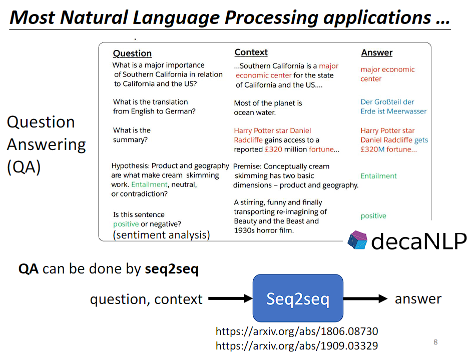
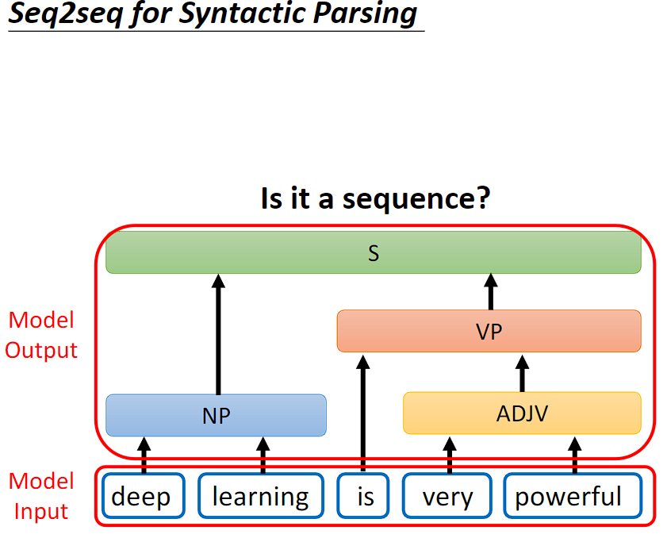
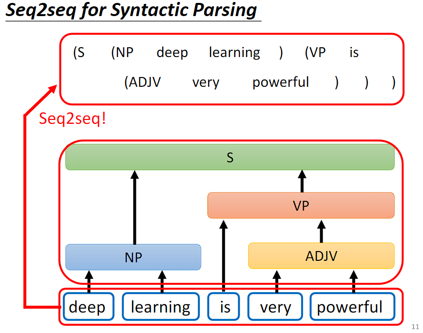
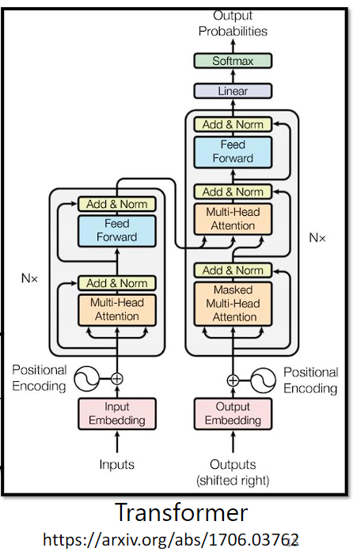
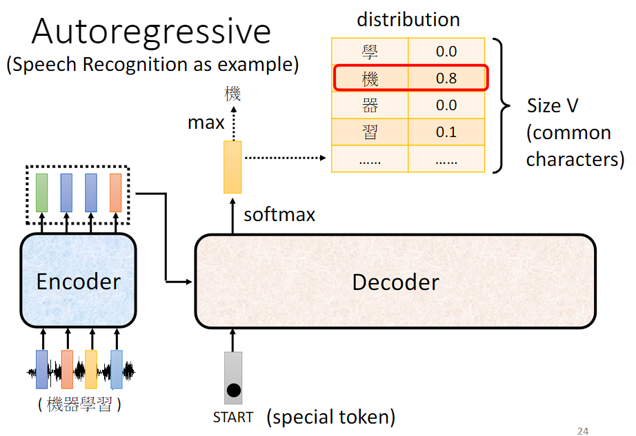

# Transformer

 Transformer 是一个 seq2seq 的模型，输入是序列数据，输出也是序列数据，输出的序列数据长度由模型决定。  

## Seq2Seq's model 应用

语音辨识、机器翻译、语音翻译都是 Seq2Seq's model 的应用。  

很多 nlp 任务都可以当成 QA 任务来做，而 QA 的问题又可以用 Seq2Seq's model 来解。所谓的 QA 任务就是给机器一段文字，然后问机器一个问题，机器给出回答。  

需要注意的是，Seq2Seq's model 虽然能解决大多数 nlp 任务，但为任务设置专门的客制化模型也许会取得更好的效果。  

刚才讲了 Seq2Seq's model 在语音和 nlp 上的应用，其实有很多应用不觉得是 Seq2Seq's model 的问题，但都可以用 Seq2Seq's model 硬解，例如语法剖析。  

语法剖析任务是给机器一段文字，机器产生语法剖析树。输入是 sequence，但是输出是一个树状的结构。  

但是**树状的结构可以通过添加括号转换成 sequence**，我们就可以用 Seq2Seq's model 来做语法剖析。

------

Seq2Seq's model 还能用于解决 Multi-label Classification 问题。  

注意区分 Multi-label Classification 和 Multi-class Classification。Multi-class Classification 即有多个分类，我们要决定一个对象属于哪个分类。**Multi-label Classification 则是一个对象可能属于多个不同的分类**。  

Multi-label Classification 能否当作 Multi-class Classification 的问题来解呢？Multi-class Classification 的问题是将输出分数最高的那个答案，现在我输出分数前几高的答案看看能不能解 Multi-label Classification 的问题，显而易见，这是行不通的，因为每个对象对应的分类个数并不确定。  

Multi-label Classification 可以用 Seq2Seq's model 硬做，输入是一个对象，输出是分类，分类的个数由机器自己决定。  

Seq2Seq's model 甚至能用在目标检测上。

具体如何实现可以参考图片中的文章链接。  

讲这么多 Seq2Seq's model 的应用，是为了告诉你 Seq2Seq's model 是多么的 powerful。  

## Seq2Seq's model 的实现

一般的 Seq2Seq's model 的实现会分成两部分：Encoder 和 Decoder。**Encoder 负责处理 input sequence，然后将处理好的结果传给 Decoder，Decoder 决定要输出什么样的 sequence**。

来看下 Transformer 架构的内部实现：

### Encoder

Encoder 的任务是**输入一排向量，然后输出同样长度的一排向量**，这个任务很多模型都能做到，如 RNN、CNN、Self-attention。**Transformer 的 Encoder 用的是 Self-attention**。

接下来将用另外的图解释 Transformer 的 Encoder 实现，再与原始的 Transformer 论文里面的图进行比对。  

Encoder 里会**有很多的 Block**，**每一个 Block 都是输入一排向量，输出一排等长度的向量**。最后一个 Block 的输出作为 Encoder 的输出。  

**每一个 Block 并不是 neural network 的一层**，是因为每一个 Block 里是好几个 layer 在做事。    

（简单版）Block 先**做一个 Self-attention**，考虑整个 sequence 的资讯，输出一排向量，**丢入全连接前馈网络**，得到 Block 的输出。     

实际上 Transformer 里做的事情是更复杂的，在每个子层（自注意力层和全连接前馈网络）的输入和输出之间应用残差连接（**Residual Connection**），并对输出进行层归一化（[**Layer Normalization**](../Batch Normalization vs Layer Normalization)）。

$$Output=LayerNorm(Input+Sublayer(Input))$$

其中，$\text{Sublayer} $代表子层（如自注意力层或全连接前馈网络），$\text{LayerNorm} $表示层归一化操作。

Residual Connection 是指将输入直接添加到层的输出上，从而形成了一个“跳跃连接”。这样做的主要目的是使得梯度能够更容易地在网络中传播。在反向传播过程中，由于存在这样的跳跃连接，即使层的输出对于梯度的影响较小，梯度也可以直接通过残差连接回传到输入处，从而减轻了梯度消失的问题。

Layer Normalization 是针对单个样本中的每个特征维度进行归一化。

------

经过上面的学习，再来看下原始的 Transformer 论文里面的图：

输入序列首先通过一个嵌入层，将每个单词或标记转换为其对应的向量表示。这些向量可能被加上位置编码，以表示单词在序列中的位置。

Nx 表示有 N 个 Block，Add & Norm 表示 Residual Connection 和 Layer Normalization。

------

这时候你可能会有个疑问，为什么要这样设计？不这样设计行不行呢？

(a) 是原始 Transformer 的设计，(b) 是《On Layer Normalization in the Transformer Architecture》改进的设计。

在《PowerNorm: Rethinking Batch Normalization in Transformers》中回答了为什么用 Layer Normalization 而不是 Batch Normalization，然后还提出了一个 Power Normalization。

### Decoder

Decoder 分为 **AT（Autoregressive Transformer） Decoder** 和 **NAT（Non-Autoregressive Transformer）Decoder**。

AT Decoder 和 NAT Decoder 在生成输出序列时的方式和效果有所不同。AT Decoder 是自回归的，每个位置的生成都依赖于之前的输出，因此能够保持生成的顺序和准确性；而 NAT Decoder 是非自回归的，并行生成所有位置的输出，因此生成速度更快，但可能会损失一些生成的准确性。

#### AT Decoder

以语音辨识为例，将语音序列输入到 Encoder 得到处理过的 vector sequence，Decoder 读入 **Encoder 的输出**和**一个开始符号**得到一个输出向量，然后通过 soft-max 将最终的表示映射到**目标词汇表（Vocabulary）**的概率分布上，以生成下一个单词的预测结果。

将**新生成的结果加入到 Decoder 的输入序列中形成新的输入序列**，继续生成下一个单词。  

但是又有可能看到自己产生的错误结果，导致一步错步步错。  

忽略来自 Encoder 的部分，来看下 Decoder 的内部实现：

可以看到与 Encoder 的内部实现是很类似的。接下来将详细解释 "shift right" 操作、**Masked** Multi-Head Attention、Decoder 如何停止输出。  

------

"shift right" 操作是指将序列向右移动一个位置。在 Transformer 架构中，"shift right" 主要用于**处理自注意力机制中的位置信息**，特别是在处理生成式任务（如语言建模或文本生成）时。  

假设我们有一个序列：[A, B, C, D]，要进行自注意力操作以生成每个位置的输出。在自注意力机制中，模型在计算每个位置的输出时需要考虑所有位置的信息，包括当前位置及之前的位置。但是，在生成序列时，我们是逐步生成的，即我们要依次生成序列的每个位置，从第一个位置开始直到最后一个位置。为了确保模型按照正确的顺序生成每个位置的输出，**在计算某个位置的输出时，我们应该只关注该位置及之前的位置，而不应该关注之后的位 置**。因此，在自注意力计算时，我们需要对输入序列进行 "shift right" 操作。即在输入序列的开头插入一个特殊的起始标记（如 BEGIN 标记），使得序列变为 [BEGIN , A, B, C, D]。这样，当模型生成第一个词语时，它只能看到 "BEGIN" ；生成第二个词语时，它只能看到 "BEGIN" 和第一个词语；以此类推。

------

与 Self-attention 计算注意力分数考虑整个 input sequence 不同，**Masked Self-Attention** 在计算**注意力分数时只能考虑到之前的位置，而不能考虑到未来的位置**，用于确保在训练时模型只能关注到当前位置之前的信息，从而保持自回归性质。

------

Decoder 如何停止输出呢？  

可以准备一个特殊符号作为结束符号——** **，期待当需要停止输出时会输出 END。

#### NAT Decoder

NAT Decoder 通过输入一排开始符号，并行生成所有位置的输出。

需要解决的问题：

- 如何知道输出的长度？
  - 方法一：通过另一个网络预测输出的长度。
  - 方法二：给一个非常长的开始符号序列，假设输出的长度最大为300，就给300个开始符号，然后就会产生300个输出，取结束符号之前的输出序列为最终输出序列。

更多有关 NAT Decoder 的内容可参考 https://youtu.be/jvyKmU4OM3c。

------

**AT Decoder**：

- 优势：
  - 具有自回归性质：AT Decoder 是自回归的，即生成目标序列时每个位置的输出都依赖于之前生成的部分。这使得生成的序列更加连贯和合理，适用于对生成顺序有严格要求的任务，如语言建模、机器翻译等。
  - 准确性高：由于每个位置的输出都依赖于之前生成的部分，因此可以保证生成的序列具有较高的准确性。
- 劣势：
  - 速度较慢：由于是自回归的，因此生成目标序列的速度比较慢，特别是对于长序列来说，生成的时间可能会较长。
  - 并行性差：由于每个位置的输出都依赖于之前生成的部分，因此难以进行有效的并行计算，导致在一定程度上降低了训练和推断的效率。

**NAT Decoder**：

- 优势：
  - 速度快：NAT Decoder 是非自回归的，它可以同时生成所有位置的输出，因此生成目标序列的速度比较快。
  - 并行性好：由于不需要考虑生成顺序，因此可以进行更有效的并行计算，提高了训练和推断的效率。
- 劣势：
  - 生成顺序不确定：由于是非自回归的，生成目标序列时不依赖于之前生成的部分，因此生成的顺序可能是随机的，这可能会影响到生成的准确性和连贯性。
  - 准确性较低：由于生成的顺序不确定，并且每个位置的输出都独立生成，因此可能会导致生成的序列质量较低，尤其是对于复杂的任务和长序列来说，准确性可能会有所下降。

因此，选择 AT Decoder 还是 NAT Decoder 取决于具体的任务需求和性能要求。如果对生成顺序有严格要求，并且更注重准确性，则可以选择 AT Decoder；如果对生成速度和效率要求较高，并且可以接受一定的准确性损失，则可以选择 NAT Decoder。

### Cross attention

Cross attention 是连接 Encoder 和 Decoder 之间的桥梁。

产生第一个位置的输出时 Cross attention 运作的过程：

产生第二个位置的输出时 Cross attention 运作的过程：

------

拓展：

在传统的 Transformer 中，不管哪一层 Decoder，在 Cross Attention 中用的都是最后一层 Encoder 的输出。

但是我们完全可以研究不同层 Encoder 和 不同层 Decoder 的各种各样的连接。

## Traning

> "Ground Truth" 这个术语最初来源于地图制图领域，它指的是地图制作者在制作地图时所使用的真实地理数据。在机器学习中，我们通常使用 Ground Truth 来表示我们希望模型预测的目标，它是我们想要模型学习的正确答案或真实情况。

上面所讲的内容都是假设模型训练好以后它是如何运作的，接下来将讲解如何训练模型。

假如做语音辨识，首先要收集一大堆的声音讯号，每一段声音讯号都要有其对应的语句，即 label。  

将声音序列丢入到 Transformer 模型中会生成一个**目标词汇表（Vocabulary）的概率分布**，期望这个**概率分布与 Ground truth 越接近越好**，因此计算它们之间的 cross entropy，希望这个值越小越好。这个训练过程与 **classification** 的训练过程很像，每产生一次词汇就好像在做一个分类的问题。

> "Teacher Forcing" 是一种训练深度学习模型的技术，特别是在生成式模型中常用。"Teacher Forcing" 技术的核心思想是在训练时，**将模型的真实输出（通常是目标序列或标签序列）作为下一个时间步的输入，而不是使用模型自身生成的输出**。

虽然在训练过程中使用 "Teacher Forcing" 可以加速模型的训练和提高模型的稳定性，但需要注意的是，**模型在训练和测试阶段的行为可能会有所不同**。**在推断阶段，由于模型无法直接获取到真实的目标输出，因此可能会产生累积误差或错误传播，导致生成的序列质量下降**。

## Tips of seq2seq model

### Scheduled Sampling

> Exposure bias（曝光偏差）在序列生成任务中，模型在训练和推断（或测试）阶段所面临的差异性。这种差异性是由于训练阶段使用了已知的目标序列（ground truth）来指导模型生成下一个符号，而推断阶段则是模型自身生成下一个符号并将其作为输入。
>
> 曝光偏差的主要原因包括：
>
> 1. **训练-测试差异**：**在训练阶段，模型通常会使用真实目标序列来引导生成**，这意味着模型在每个时间步都可以看到真实的下一个符号。而在**测试阶段，模型需要依靠自身生成的符号作为输入**，因此可能会面临不准确的情况。
> 2. **误差累积**：由于序列生成是逐步进行的，模型在**生成每个符号时都会引入一定程度的误差。在训练阶段，这些误差通常可以被真实目标序列纠正**，但在推断阶段，模型自身生成的误差可能会累积导致生成结果的质量下降。（一步错步步错）
>
> 曝光偏差可能会导致模型在测试阶段产生不准确的结果，特别是在面对模型从未见过的情况或数据分布发生变化时。

前面所说的在训练过程中使用 "Teacher Forcing" 会导致 exposure bias。

在训练集中也加入一些错误噪音。  

为了减轻曝光偏差的影响，研究人员提出了一些解决方案，如Scheduled Sampling、Teacher Forcing 和Curriculum Learning等。这些方法通过在**训练阶段模拟推断**的情况，帮助模型更好地适应测试阶段的情况，从而提高模型的泛化能力和生成结果的质量。

Scheduled Sampling 在训练的早期阶段，通常会使用较高的教师强制概率，使模型更容易学习到正确的序列生成方式。随着训练的进行，教师强制概率逐渐减小，模型逐渐开始依赖自身生成的序列，从而更好地适应测试时的情况。

Scheduled Sampling 的一些论文链接如下：

### Copy Mechanism

Copy Mechanism 是指在生成式模型中的一种机制，用于**处理生成序列中可能需要直接从输入序列中复制信息的情况**。在某些任务中，生成的序列可能包含输入序列中的某些词语或短语，**而不是完全生成全新的词语**。Copy Mechanism 的引入就是为了处理这种情况。

具体来说，Copy Mechanism 允许模型在生成序列时，根据输入序列中的**内容动态地选择是否复制输入序列中的某些部分**，并将其直接插入到生成序列中。这样，模型就可以在生成序列时直接利用输入序列中的信息，而不仅仅是依赖于模型已学习到的知识。这对于处理诸如**命名实体识别**、翻译中的**专有名词、稀有词语、摘要**等情况非常有用。

Copy Mechanism 的实现通常包括以下几个步骤：

1. **计算注意力分布**：与传统的自注意力机制类似，模型首先计算输入序列与当前生成位置之间的注意力分布。这个注意力分布用于确定哪些部分的输入序列是与当前位置最相关的。
2. **计算复制概率**：根据注意力分布，模型计算每个输入位置的复制概率，即该位置的词语是否应该被复制到生成序列中。
3. **生成序列**：在生成序列时，模型根据计算得到的复制概率和注意力分布，决定是否复制输入序列中的某些部分，并将其插入到生成序列中。

具体实现可以看最早具有复制机制的模型 [Pointer Network](https://youtu.be/VdOyqNQ9aww) 和将复制机制引入到 seq2seq model 的论文 [Incorporating Copying Mechanism in Sequence-to-Sequence Learning](https://arxiv.org/abs/1603.06393)。

### Guided Attention

在生成式模型中，比如文本生成，模型需要从输入序列中学习到一些信息，然后生成一个新的序列。在这个过程中，**模型需要决定在每一步中要注意哪些部分的输入**。

Guided Attention（引导注意力）是一种注意力机制的变体，它可以帮助模型更好地做出这些决定。它通过提供额外的信息，**告诉模型应该关注哪些部分，从而让模型更准确地生成序列**。

这个额外的信息可以是与任务相关的内容，也可以是人为设计的规则。总之，Guided Attention 帮助模型更聪明地选择要注意的内容，从而提高了模型的性能。

以下是一些主要应用领域：

1. **机器翻译**：在机器翻译任务中，模型需要根据源语言句子生成目标语言句子。Guided Attention 可以帮助模型更好地**对齐源语言和目标语言之间的单词**，从而提高翻译质量。
2. **文本摘要**：在文本摘要任务中，模型需要从输入文本中提取关键信息并生成简洁的摘要。Guided Attention 可以帮助模型在**生成摘要时更好地关注重要的内容**，从而生成更准确的摘要。
3. **问答系统**：在问答系统中，模型需要根据问题和上下文生成答案。Guided Attention 可以帮助模型在生成答案时更好地**关注问题和相关的上下文信息**，从而提高答案的质量。
4. **对话生成**：在对话生成任务中，模型需要根据上下文生成自然流畅的对话。Guided Attention 可以帮助模型更好地**关注对话历史和当前上下文**，从而生成更连贯和相关的回复。

### Beam Search

Beam Search（束搜索）是一种用于生成式模型中的搜索算法，特别是在序列生成任务中常用，如机器翻译。

在生成序列时，模型通常在**每个时间步都需要决定下一个最可能的单词或符号**。而 Beam Search 算法则是一种启**发式搜索方法**，它在每个时间步选择**一组概率最高的候选项**，然后继续扩展这些候选项，直到生成完整的序列。

Beam Search 的工作方式如下：

1. **任务背景**：假设我们有一个机器翻译模型，它需要将英文句子翻译成法文句子。模型在每个时间步需要决定选择哪个法文单词来构成翻译后的句子。
2. **选择候选项**：在每个时间步，模型会生成一组可能的翻译候选项，每个候选项都包含一个法文单词以及该单词的概率。这些候选项通常根据模型输出的概率分布来确定。
3. **扩展候选项**：对于每个候选项，模型会考虑它的下一个可能的词汇，并生成一组新的候选项。这些新的候选项会考虑当前候选项的概率以及下一个词汇的概率，并选择最有希望的一些候选项。
4. **剪枝**：在生成了新的候选项后，模型会根据某种标准（通常是总体得分或概率）对候选项进行排序，并保留得分最高的一部分。这样可以防止候选项数量过多，提高搜索效率。
5. **重复步骤 3 和 4**：模型会重复生成新的候选项并进行剪枝，直到生成完整的翻译句子为止。通常情况下，模型会设置一个搜索深度或者一个终止条件，以确保搜索的效率和结果的质量。

通过这种方式，Beam Search 帮助模型在生成式任务中找到最有希望的翻译序列，从而提高了生成结果的质量和准确性。  

Beam Search 的主要优点是可以在生成过程中保持较高的效率，并且通常能够找到较优的解决方案。然而，它也存在一些缺点：

- **局部最优解**：Beam Search 只会保留一组候选项，并在每个时间步选择概率最高的几个。这种策略可能**导致模型陷入局部最优解**，因为它只能考虑到有限数量的候选项，而可能错过全局最优解。
- **缺乏多样性**：由于 Beam Search 倾向于选择概率最高的候选项，因此生成的**序列可能缺乏多样性，即生成的结果过于相似**。这可能会导致生成的文本缺乏变化，不够丰富和有趣。
- **搜索空间限制**：Beam Search 的搜索**空间通常是有限的**，因为它只会保留一定数量的候选项。这意味着模型可能会错过一些低概率但正确的选择，尤其是在面对复杂任务或较长序列时。
- **长度偏差**：Beam Search 在每个时间步只选择概率最高的几个候选项，因此生成的序列长度可能会偏向于较短的一侧。这可能会导致生成的文本长度偏短，无法充分表达出输入的内容。

如机器翻译、语音辨识等**答案非常明确的任务**，Beam Search 就十分有帮助。  

Beam Search 缺乏多样性，不适合如句子补全、语音合成这种机器**需要一些创造力的任务，甚至这种需要创造力的任务加入 noise 之后结果会更好**。  

## Reference

[【機器學習2021】Transformer (上) ](https://www.youtube.com/watch?v=n9TlOhRjYoc)

[【機器學習2021】Transformer (下)](https://www.youtube.com/watch?v=N6aRv06iv2g)

[【李宏毅机器学习2021】（五）Transformer - hzyuan - 博客园](https://www.cnblogs.com/hzyuan/p/18054836)