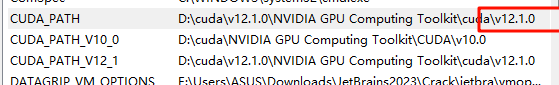

# cuda环境切换

因为目前本人平时切换cuda环境的情况比较少，所以切换的方式是下载多个版本的cuda，需要使用哪个就改变环境变量

## 切换环境

当前的cuda版本是10.0  
path中10.0在12.1之上
  

现在要改为12.1  
首先把12.1的两个路径上移  


把CUDA_PATH的路径改为12.1  
  
  

还有一个路径，但是下载12.1的时候没有这个路径，好奇怪  
  
然后我就没改  

之后再次查看版本切换成功


## 安装

### 查看查看显卡型号与驱动版本（Driver Version）

```  shell
nvidia-smi
```


[cuda和pytorch版本对应关系](https://pytorch.org/get-started/previous-versions/)

### cuda下载

[地址](https://developer.nvidia.com/cuda-toolkit-archive)  
找到对应版本并下载  
  
