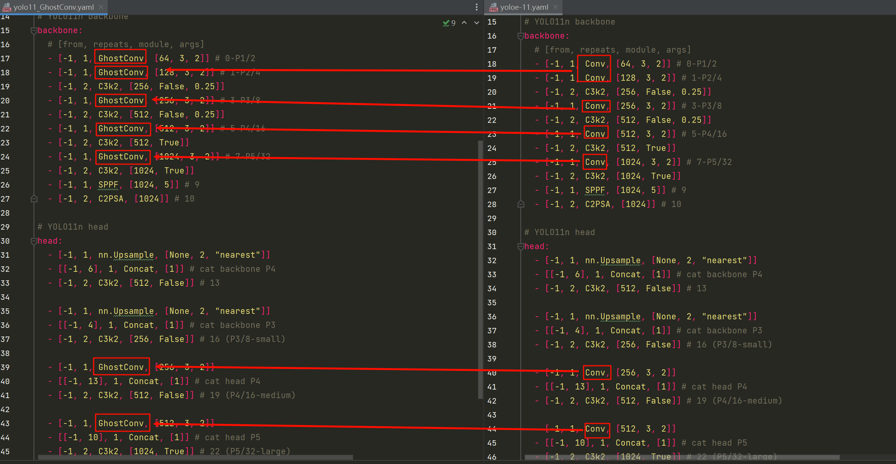
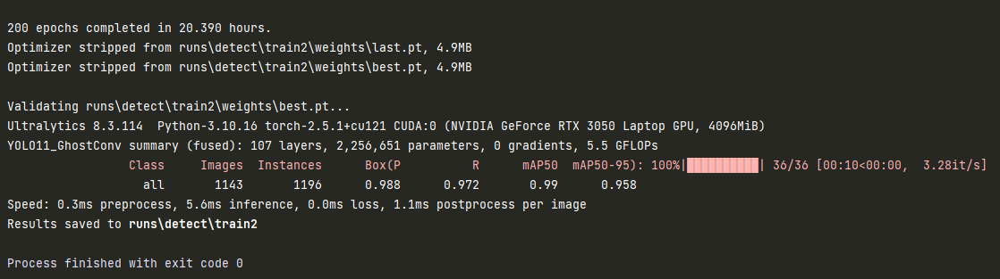
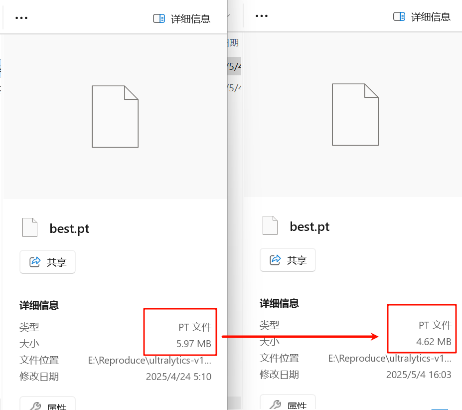

# GhostNet卷积轻量化改进

[参考文章]([YOLO11改进 | 卷积模块 | 用Ghost卷积轻量化网络【详细步骤】_ghost轻量化-CSDN博客](https://blog.csdn.net/m0_67647321/article/details/142713172))

## 修改

1. 在`/ultralytics  /ultralytics/nn/modules/conv.py`中增加GhostConve类，并修改对应`__init__.py`文件(导入函数名并在`__all__`中声明)  

   ```python
   class GhostConv(nn.Module):
       # Ghost Convolution https://github.com/huawei-noah/ghostnet
       def __init__(self, c1, c2, k=1, s=1, g=1, act=True):  # ch_in, ch_out, kernel, stride, groups
           super().__init__()
           c_ = c2 // 2  # hidden channels
           self.cv1 = Conv(c1, c_, k, s, None, g, act)
           self.cv2 = Conv(c_, c_, 5, 1, None, c_, act)
    
       def forward(self, x):
           y = self.cv1(x)
           return torch.cat((y, self.cv2(y)), 1)
    
   class Ghost(nn.Module):
       # Ghost Bottleneck https://github.com/huawei-noah/ghostnet
       def __init__(self, c1, c2, k=3, s=1):  # ch_in, ch_out, kernel, stride
           super(Ghost, self).__init__()
           c_ = c2 // 2
           self.conv = nn.Sequential(GhostConv(c1, c_, 1, 1),  # pw
                                     DWConv(c_, c_, k, s, act=False) if s == 2 else nn.Identity(),  # dw
                                     GhostConv(c_, c2, 1, 1, act=False))  # pw-linear
           self.shortcut = nn.Sequential(DWConv(c1, c1, k, s, act=False),
                                         Conv(c1, c2, 1, 1, act=False)) if s == 2 else nn.Identity()
    
       def forward(self, x):
           return self.conv(x) + self.shortcut(x)
      
   ```

2. 把所有Conv修改为GhostNet  

   这里是在\ultralytics\ultralytics\cfg\models \11下新建文件 yolo11_GhostConv.yaml  

   

3. 在task.py的parse_model函数中进行注册
4. 最后执行yolo11_GhostConv_train.py进行训练

## 改进结果

1. GFLOPs从6.6下降为5.5，**减少了约 16.67%**，同时mAP浮动在1%以内

   

2. 模型体积**减少了约 22.6%**

   