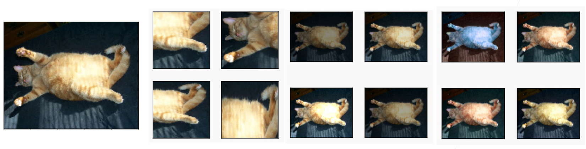
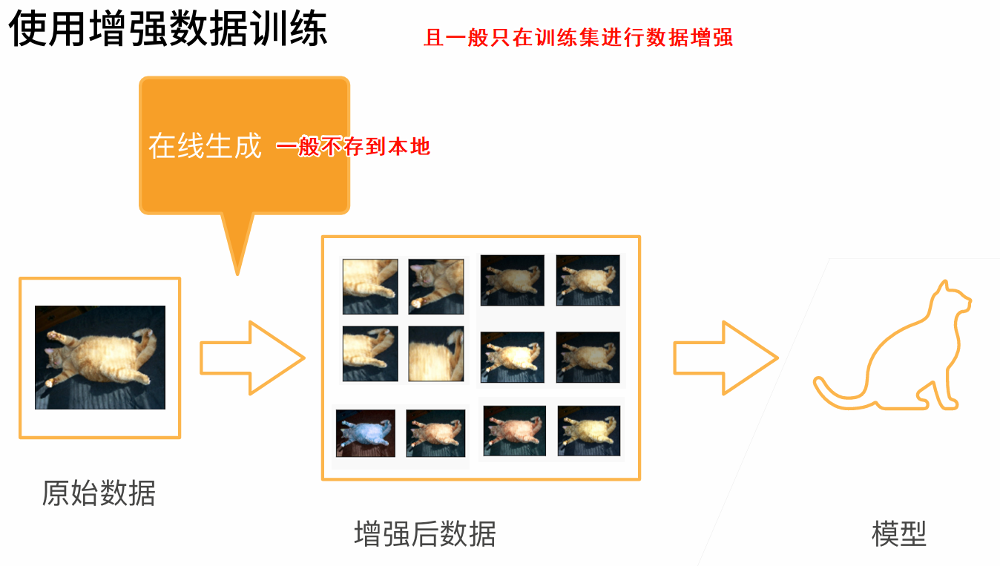
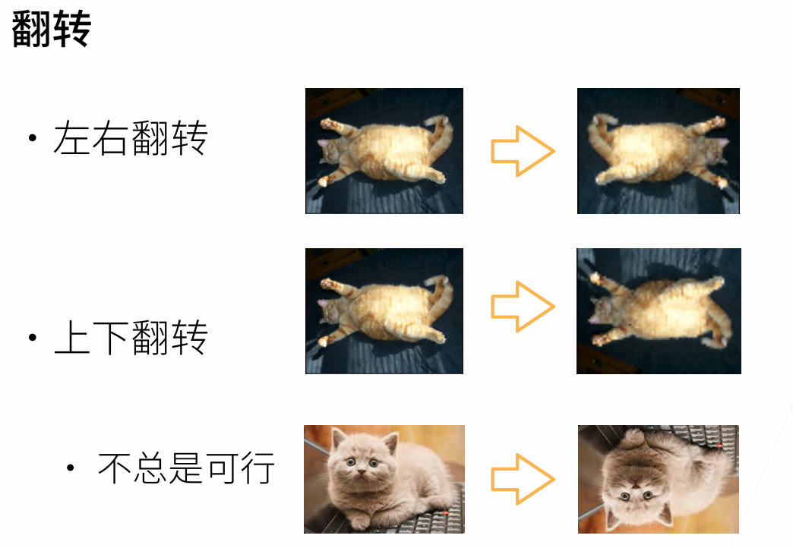
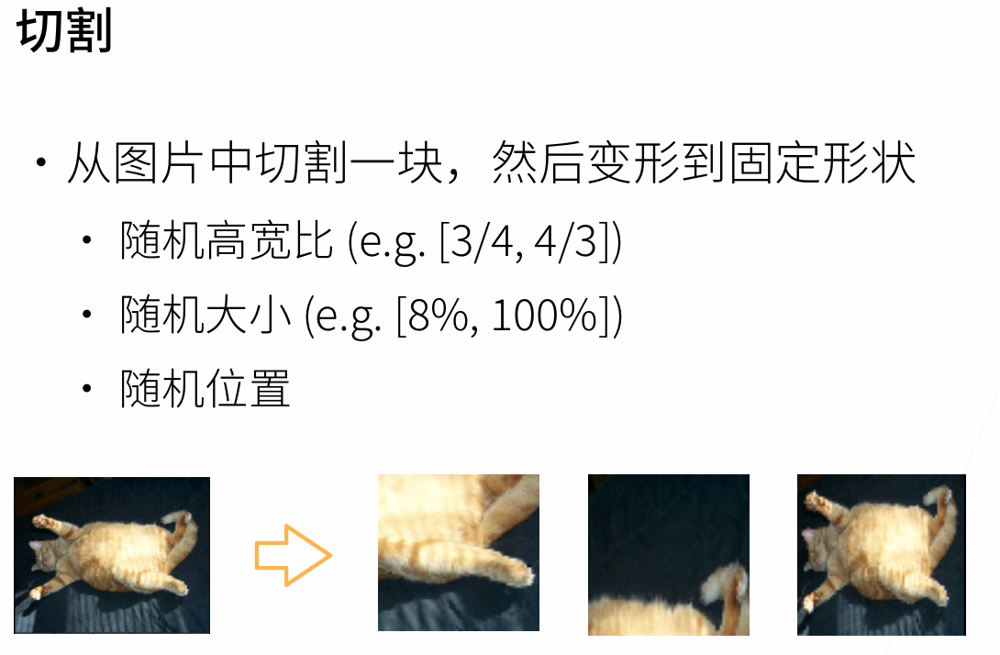
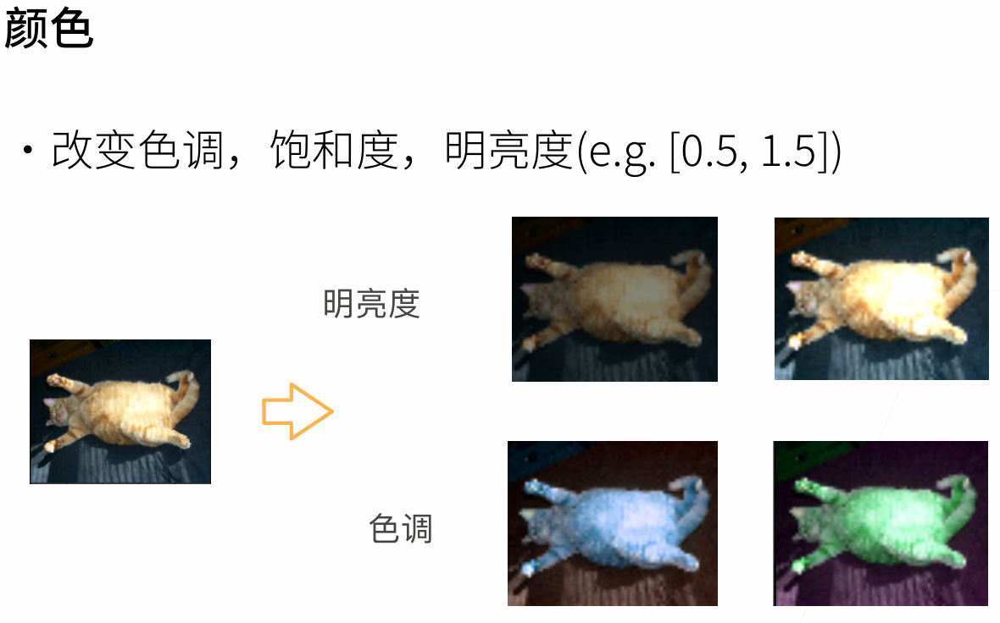
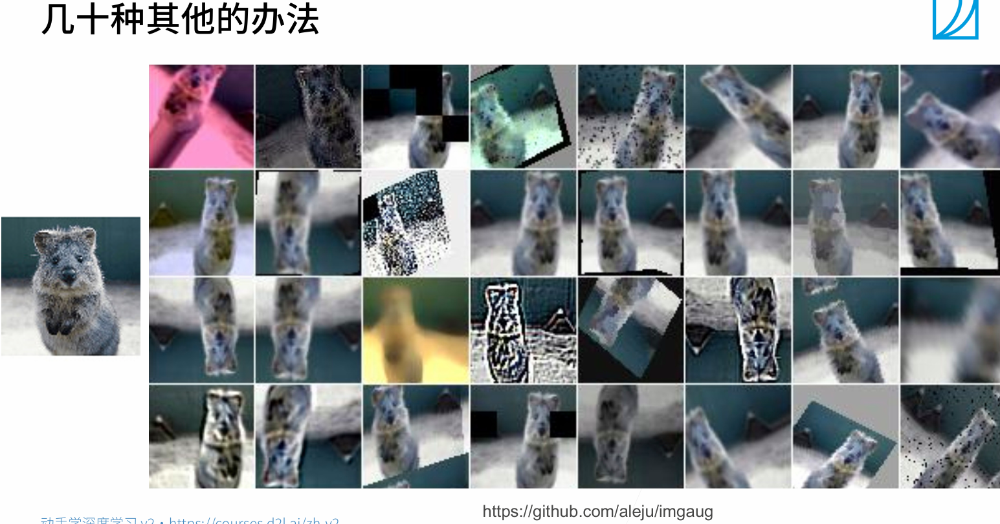

# 数据增广

## 数据增强

增加一个已有数据集，使得有更多的多样性

* 在语言里面加入各种不同的背景噪音
* 改变图片的颜色和形状  
  
  
  
  
  

[更多办法](https://github.com/aleju/imgaug)  
如何考虑数据增强，选择什么样的？  
从后往前推，考虑在测试集中数据往往会遇到哪些奇怪的场景，根据此来设计。

## 总结

* 数据增广通过变形数据来获取多样性从而使得模型泛化性能更好
* 常见图片增广包括翻转、切割、变色
