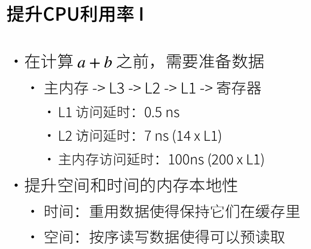
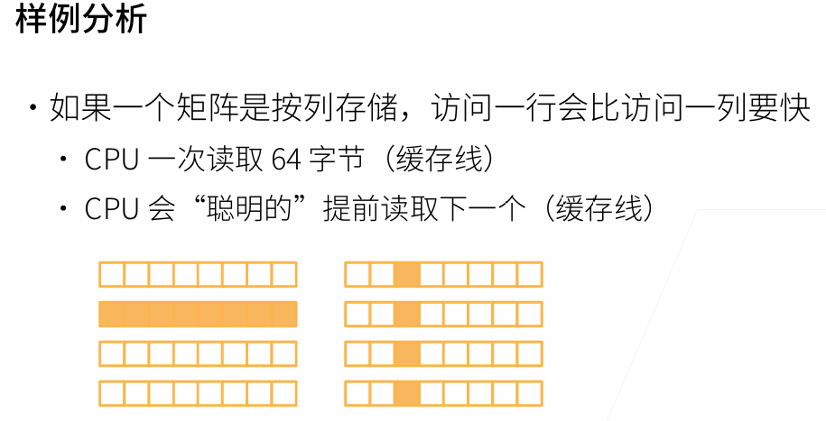
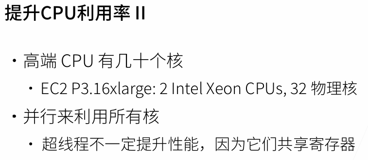
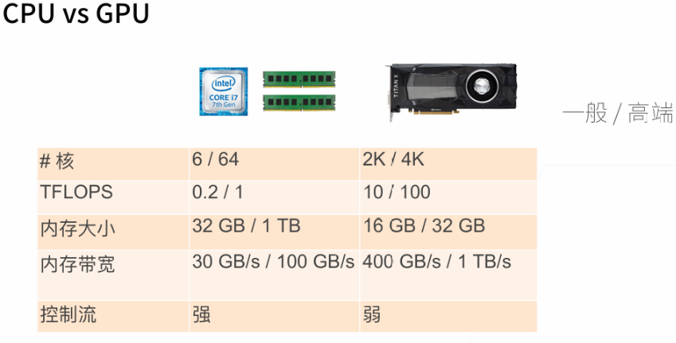
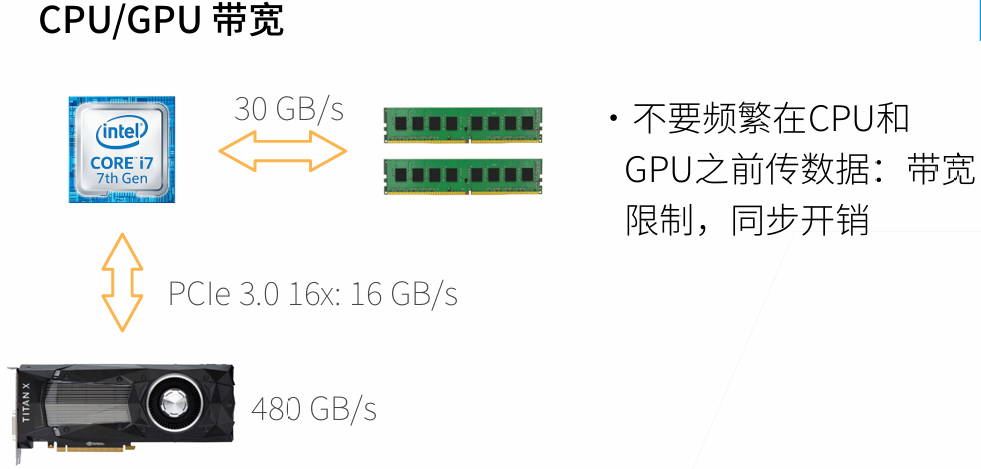
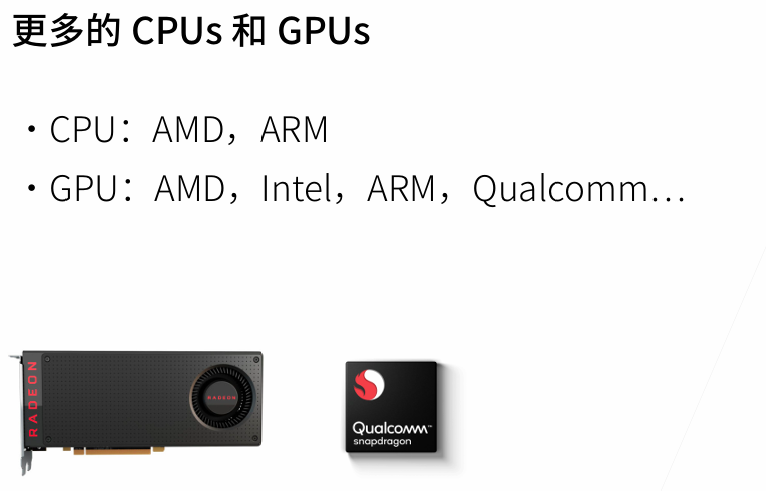
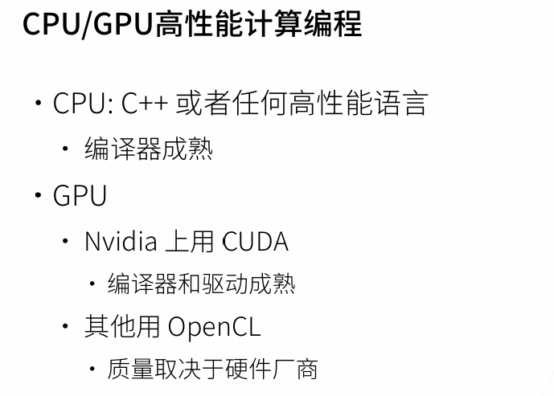
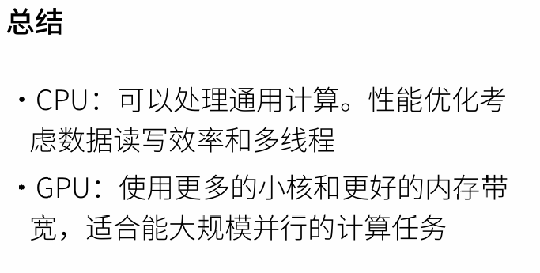

# 深度学习硬件：CPU、GPU、TPU和其他

  
3级缓存 局部性原理

  
GPU 比 CPU 快：

* GPU核多
* 每次从主内存读取东西，内存带宽要跟上，GPU内存带宽高
* 但是GPU内存大小小，控制流（跳转判断...）弱

## 提升GPU利用率

* 并行 使用数千个线程
* 内存本地性 缓存更小，架构更加简单
* 少用控制语句 支持有限 同步开销很大

