# 过眼云烟

## 大模型为什么数不清几根手指

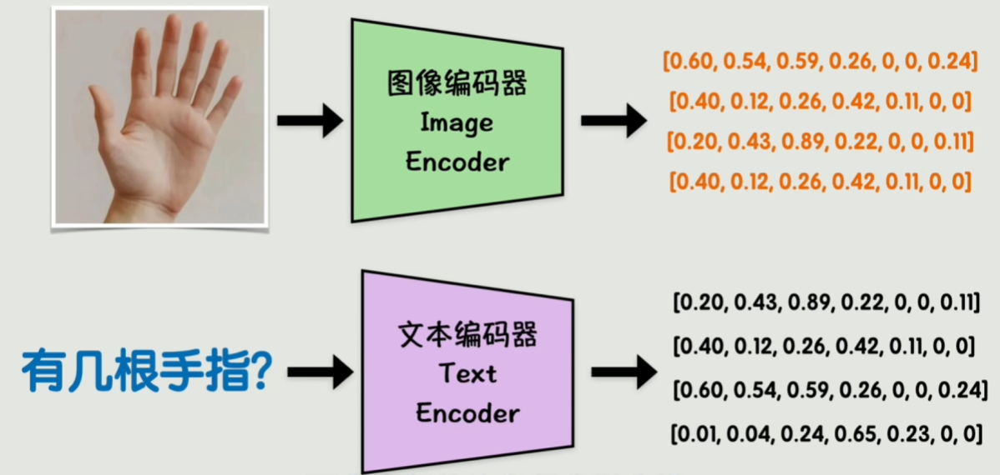

如何让图片和文字在同一个向量空间中对齐？

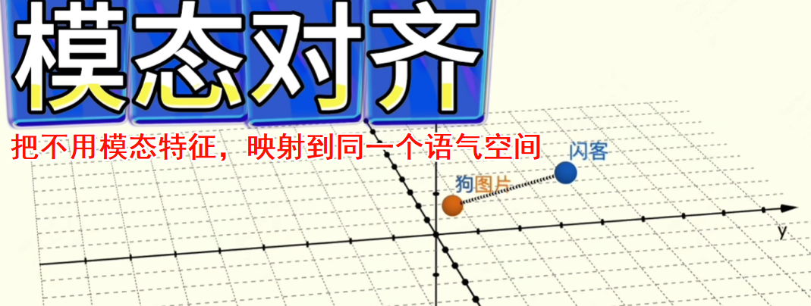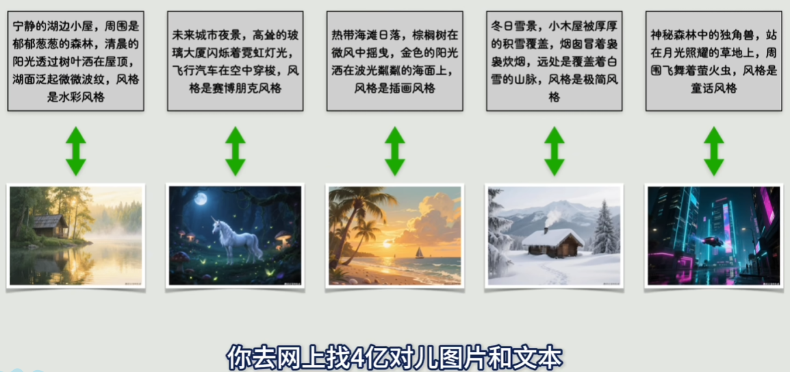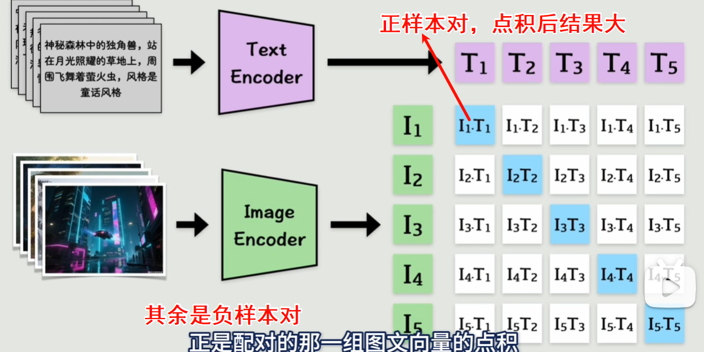CLIP 基于 ViT 做多模态对齐：https://openai.com/index/clip/

相当于先把图片转换成文字描述（文字描述一张图片会非常困难，并且势必会损失很多细节信息）

大模型在文本方面远强于人类，整体逻辑基于文本，而文本内容就是将人类思维转换一层输出的结果。所以是不是人类对于文本所产生的问题，大模型也会产生同样的问题。让人类去描述一张图片也会错失很多信息，大模型同样也是，因为一切的语料都是来自于人类。

[为啥AI很难处理数量问题？_哔哩哔哩_bilibili](https://www.bilibili.com/video/BV1i9bszsE4b/?spm_id_from=333.1007.tianma.1-1-1.click&vd_source=4e1dceccc918063def66c9d643674c6a)

文本先验力量远超视觉输入

* 视觉编码器没有捕捉细微修改
* LLM文本偏见太强（哪怕是看到了也被压制）

===>语言指挥视觉：先找记忆定调，再找图像支持

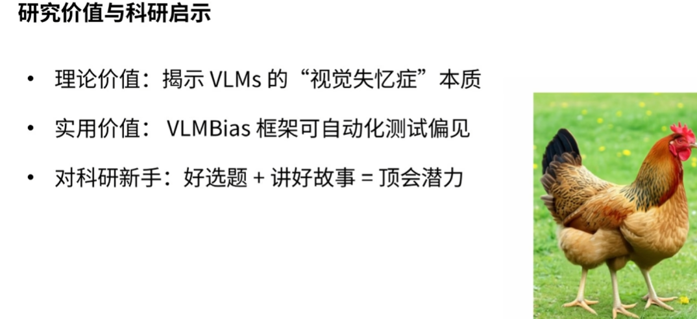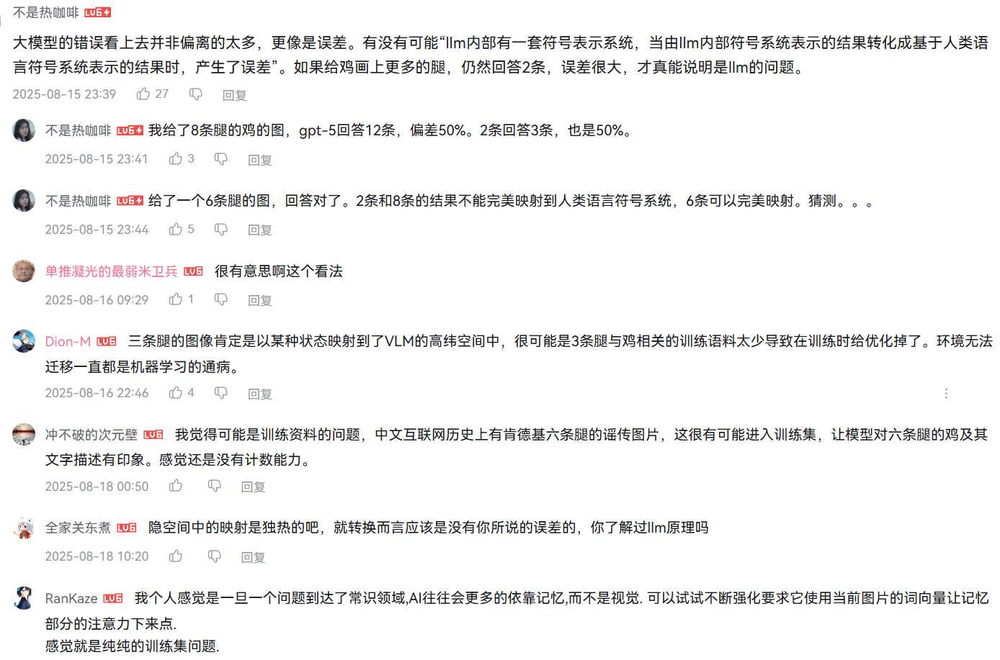

## [李沐讲座：大语言模型的实践经验和未来预测](https://www.bilibili.com/video/BV1dHWkewEWz?spm_id_from=333.1245.0.0)

### 大模型目前的能力

> Anything with enough data will be automated
>
> 只要能采集到足够到**数据**就可以实现自动化
>
> corollary：推论（也称为 系, 系理）是指能够 “简单明了地” 从前述命题推出的论断
>
> need to capture the data and need to have actuators/sensors

文科白领：主要是文本能力，大模型对文本处理的能力非常强大

对于**蓝领工作**很难做到很好的应用

类似于让一个机器人去端盘子，对他的能力要求很高，对周围环境的感知，人的感知……

但是无人驾驶方面做的比较好：车多，有很多sensor，可以用到的数据很多；同时可以做到封闭环境

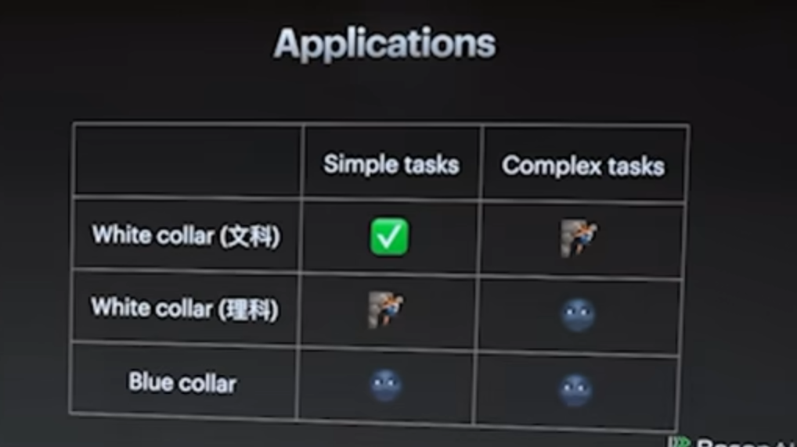

> LLM are still ML models, but 100x larger

1. 预训练慢慢变成了一个工程问题（人力、算力），后训练是技术问题

   * 高质量数据：多样性、结构化

   * 算法

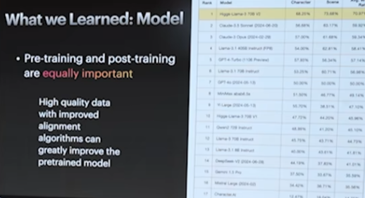

2. 通用模型想要做好需要堆指数级数据--->我们去做**垂直模型**（其实垂直问题也要达到某种程度的通用智能才能效果更好）

   ​	某一个科目拿第一，其实你其他的科目也不会太差。

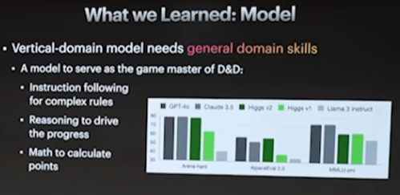

3. **评估**非常难

   1. 没有评估实际复杂场景
   2. 想要做应用最最最首要的是要先把评估工作做好
   3. 评估的角度有很多
   4. 人评估：贵
   5. 模型评估：出现偏差（GPT-4喜欢长文本）
   6. 能评估好就解决很多问题了：有优化的方向；说明也有了一定量的数据了

   数据决定上限，数据好模型好

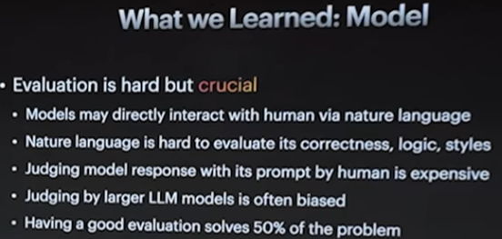

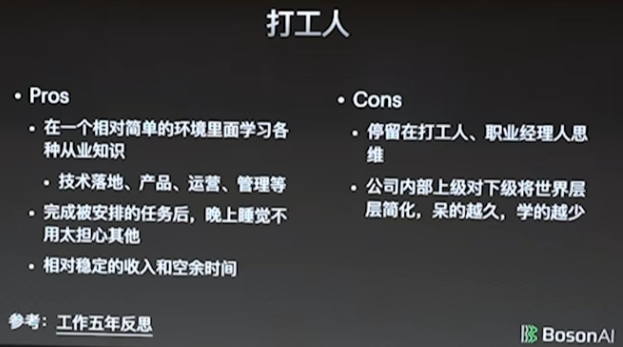 

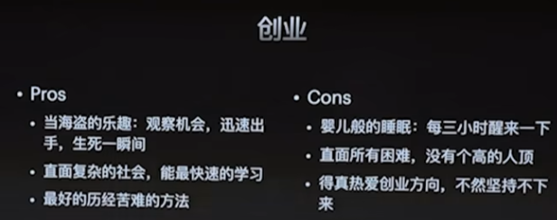

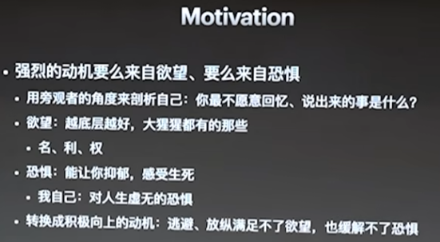

要对自己狠

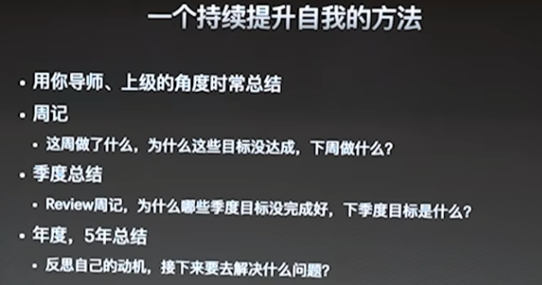