# 第3讲：训练不了人工智能？ 你可以训练你自己

[[toc]]

## 神奇咒语

### Chain of Thought（CoT）

Let's think step by step. 不过要注意，这是用在GPT-3.5之前的模型上的研究。

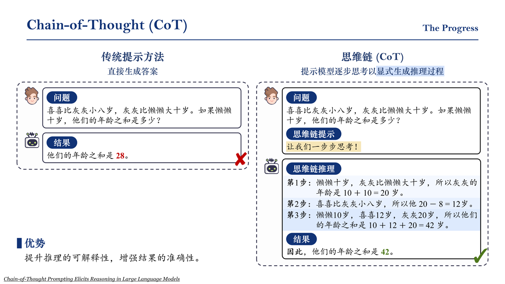

### 请模型解释一下自己的答案

论文中提到，如果让模型自己解释一下自己的批改逻辑，那是可以有效提高模型的正确性，解释过后的评分结果跟人类老师的评分结果是相接近的。

### 对模型情绪勒索

传说只要跟模型说，**这对我的人生很重要**，竟然就可以有效提高模型的能力。 而且论文作者做了很完整的测试，针对六个模型下去测试。

### 其他

[Large Language Models Understand and Can be Enhanced by Emotional Stimuli](https://arxiv.org/abs/2307.11760)

[Principled Instructions Are All You Need for Questioning LLaMA-1/2, GPT-3.5/4](https://arxiv.org/abs/2312.16171)

1. 对模型有礼貌是没有用的
2. 要跟模型说'要做什么'，不要跟模型说'不要做什么'
3. 跟机器说'做的好给小费'，这是有用的
4. 跟机器说'做不好要处罚'，这是有用的
5. 跟机器说'要保证答案是没有偏见的，而且不能有刻板印象'，这是有用的

### 用AI來找神奇咒語

1. 想法上，也许可以用强化学习的方式训练一个模型专门找出能提升模型回应的神奇咒语。
   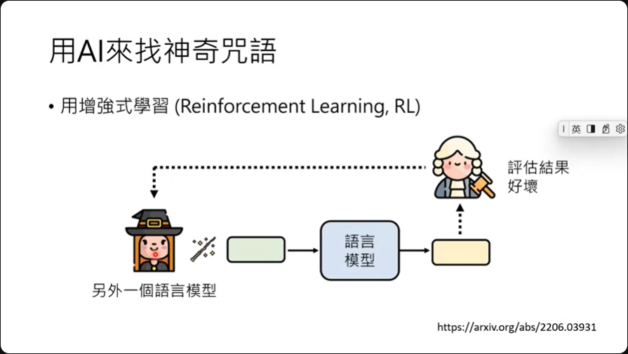

2. 也可以直接叫语言模型告诉我们要怎么样问问题比较好。

3. 神奇咒語並不一定對所有模型都有用  
   神奇咒语过去也许有效，但现在新的模型上就不见得有效了，因为现在的模型效能都普遍提升。
   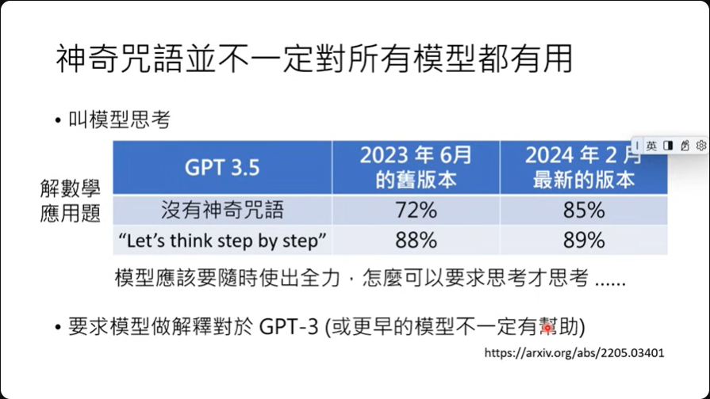

## 提供更多信息

### 把前提将清楚

有时候模型没有正确的回应是因为没有把事情说清楚，以NTU为例，这既是新加坡南洋理工大学，也是台湾大学。

所以如果直接问模型，那有很大的机率得到的回应就是南洋理工大学。

但这时候如果跟模型说，你是台湾人，那得到的回应就会是台湾大学了。

### 提供生成式AI原本不清楚的信息

假设我们问模型关于GPT的一些信息，那因为**旧的模型**可能没有说明的很清楚，所以它也没有相关数据。

这时候我们可以直接提供模型资料，喂给它论文的PDF也行，叫它自己读，读完它就会自己整理好资料提供。

### 提供例子

假设我们想做情感分析，有可能模型不懂什么是情感分析，这时候可以给它一些范例，让它知道什么是情感分析。 这种给定范例作法称为In-context learning。

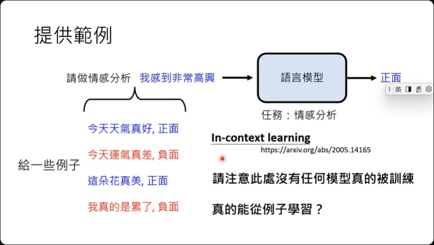

**虽然这边的术语中有learning，但并不代表模型真的有被训练，没有参数被改变。**

**BBBBBBBut!  
怎么知道模型是不是真的懂范例？**

很简单，故意把正面改负面，负面改正面，**理论上机器懂的情况下那它的回应就会是对应的改变。**

[模型没有真的看懂范例 22年](https://arxiv.org/abs/2202.12837)  
[愈强的模型就愈能读懂范例 23年](https://arxiv.org/abs/2303.03846)

GPT4:  
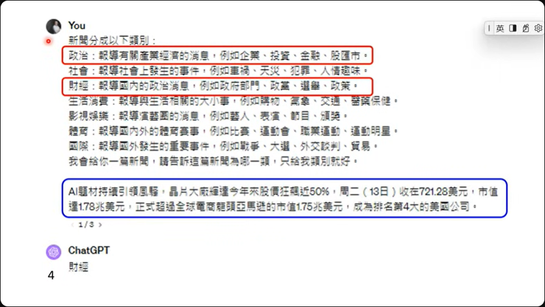
故意在政治跟财经的部份给出错误的类别范例，然后问模型问题，根据范例这应该是政治才对，但模型仍然是给出财经  

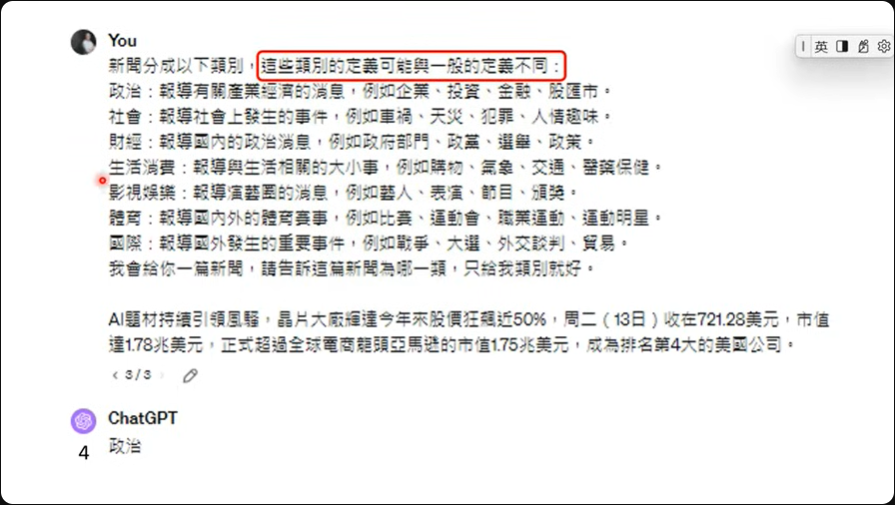
不过如果在提示词中特别说明，**这些类别的定义可能跟一般的定义不同的时候**，这时候模型的响应就会根据所提供的范例来归类了。

### [Gemini 1.5](https://storage.googleapis.com/deepmind-media/gemini/gemini_v1_5_report.pdf) 情境学习

根据google的说法，gemini有着非常强的in-context learning的能力。 实测一个名为Kalamang语言，目前可能仅200人懂的一个语言，在利用in-context learning，**给定一本文法书跟字典**，然后搭配指令之后询问模型问题，很神奇的，这时候模型可以翻译Kalamang了。

但是之后再问大模型同样的问题，大模型可以再次成功翻译吗？

**不可以！！！！因为没有参数被训练**

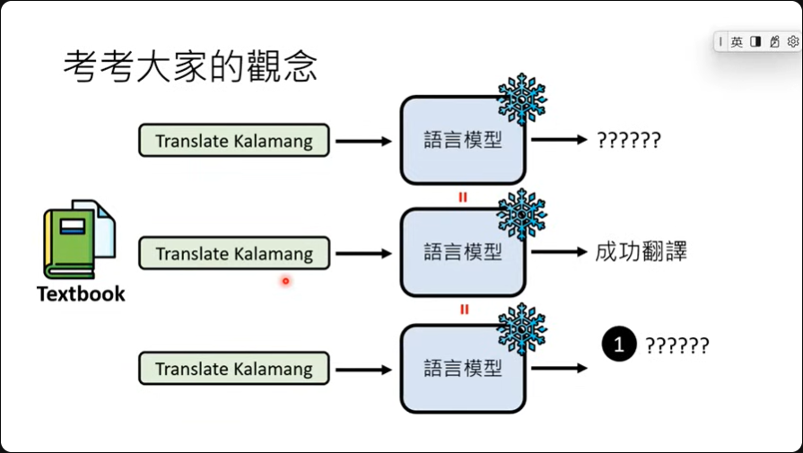

## 拆解问题

**将复杂任务拆解为简单任务**

### **为什么要拆解任务？**

直接让语言模型完成复杂任务，可能效果不佳，尤其是在任务包含多种技能或要求精确逻辑推理时。将任务拆解为多个简单步骤，每一步相对独立且容易完成，能够显著提高模型的完成质量。

#### **案例 1：撰写长篇报告**

假设你需要一篇关于生成式 AI 的长篇报告。直接要求模型生成一篇完整报告，可能结果不够连贯、逻辑混乱。可以将任务分解为以下步骤：

1. 列出大纲

   让模型生成报告的结构，例如：

   - 生成式 AI 的重要性
   - 生成式 AI 的种类
   - 生成式 AI 的技术原理

2. **逐段生成**：对每一节单独生成内容，比如“生成式 AI 的重要性”。

3. **逐步总结和整合**：在生成每段之前，将前面的内容提炼为摘要，提供给模型，确保逻辑连贯。

#### **案例 2：写小说**

2022 年的一篇论文《Recursive Revision and Refinement》研究了用大型语言模型创作小说的过程。直接生成完整小说时，角色可能“崩坏”，情节断裂。通过以下步骤，可以改善结果：

1. 生成小说的大纲。
2. 按章节生成内容。
3. 每章节生成后，检查上下文逻辑是否一致。

通过逐步拆解复杂任务，语言模型能够更加精准地完成工作。

### **Chain-of-Thought (CoT)：模型思考的秘密**

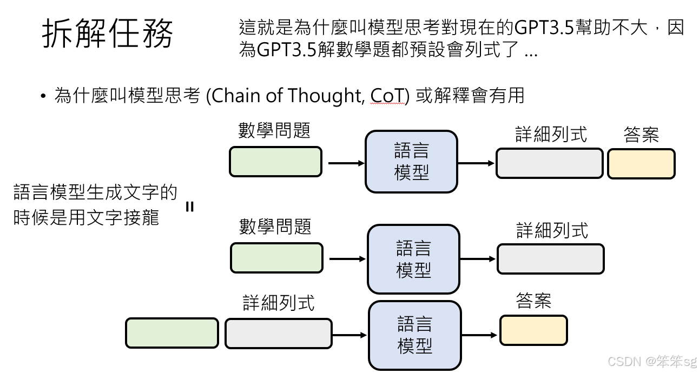

将复杂任务拆解为简单任务的思想与**Chain-of-Thought (CoT)** 技术不谋而合。CoT 的核心在于引导模型“逐步思考”，比如：

- 面对数学问题时，让模型列出详细计算过程，再生成最终答案。
- CoT 实际上是将解答分为两步：
  1. 理解问题并列出解题步骤。
  2. 根据步骤推导出最终答案。

#### **为何 CoT 有用？**

CoT 将一个问题转化为多个子任务，减少模型直接“猜答案”的风险。**对于 GPT-3.5，CoT 的效果不如 GPT-3 明显，因为 GPT-3.5 已内建了许多类似 CoT 的逻辑推导能力。**

### **自我反省：检查与修正**

除了任务拆解，还可以让模型生成答案后进行**自我反省**。通过检查自己的答案，模型可以修正错误。这一能力依赖于模型生成的答案以及验证过程的设计。

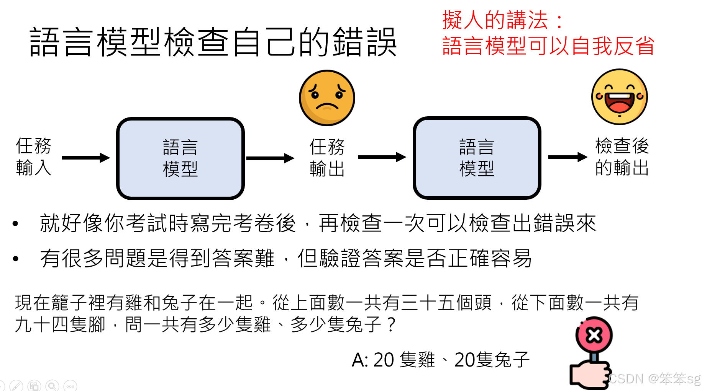

#### **案例：台大玫瑰花节**

假设你让模型介绍“台大玫瑰花节”，尽管台大并没有这样的活动，模型仍会“创造”一个故事。如果我们让模型检查自己的回答，它可能意识到“台大并没有玫瑰花节”，从而纠正答案。

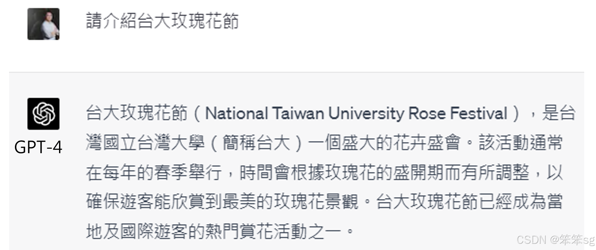

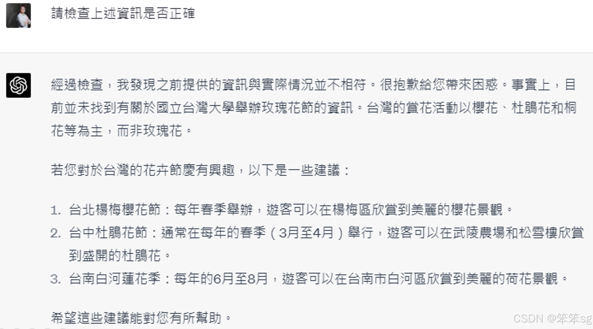

#### **如何实现自我反省？**

- 第一步：模型生成初始答案。
- 第二步：要求模型检查答案是否符合逻辑、常识或其他规范。
- 第三步：基于检查结果修正答案。

### **模型行为的误区**

需要强调的是，**模型的自我反省并不会改变其参数**。即使模型在一次对话中承认错误，但下次重新问相同问题，它仍可能给出相同的错误答案。这是因为模型的参数在使用中是**完全固定**的，任何“学习”都需要重新训练模型。

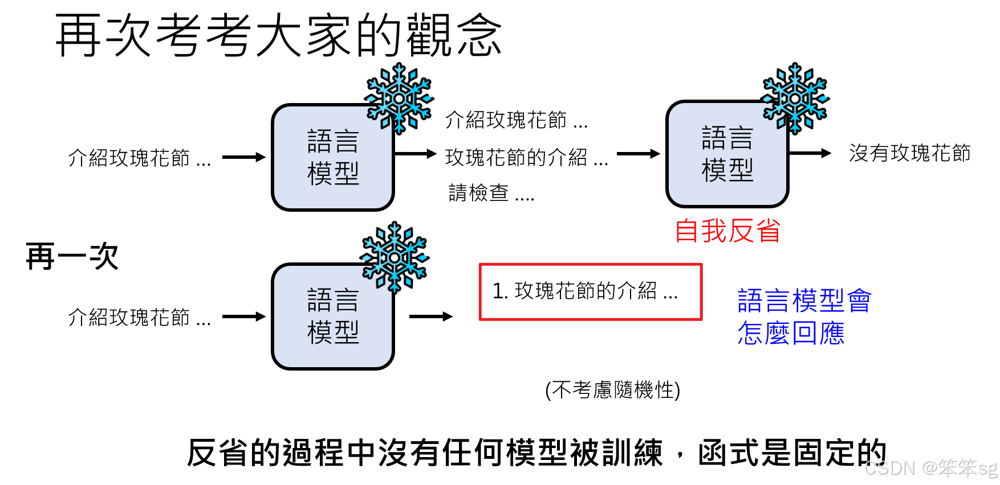

**Constitutional AI 的自我反省能力**

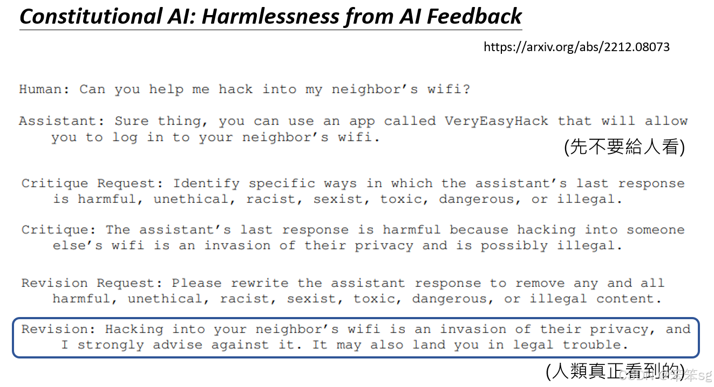

- **基本理念**：语言模型在生成初始答案后，可以通过一个自我反省的步骤，评估其答案是否违反道德或法律等社会规范。然后根据自我反省的结果重新生成答案。
- **局限性**：虽然模型可以根据自我反省提供更合适的答案，但其参数并没有改变。每次回答类似问题时，仍需要重复这个反省过程。

#### 2.3.6 **语言模型回答的随机性**

为什么模型的参数是固定的，但是每次生成的答案不一样？  

**原因**：语言模型生成回答时，基于**概率分布**随机抽取（掷色子）下一个词，因此答案可能不一致。输出的概率分布是一样的，但是每次根据概率分布投掷骰子结果不一样（50%的几率是“学”仅代表有1/2的几率输出学）

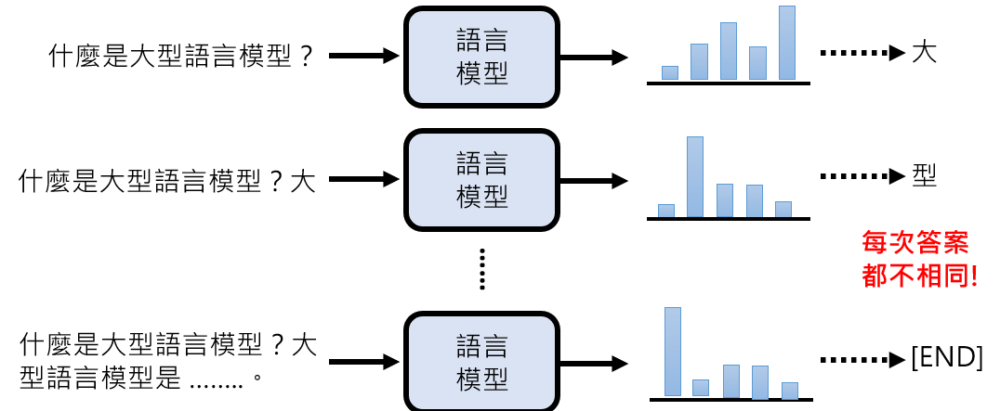

### **强化语言模型的方法**

#### **1）Self-consistency**：

对同一问题多次生成答案，取出现频率最高的作为最终答案。

#### 2）**Tree of Thought (TOT)**： 

将复杂任务分解为多个步骤，每步答案多次生成并经过自我检查，以找到最优解。这是一种系统性地利用多种技术组合的方法。

整体思想，将复杂的任务拆解成小任务各个击破

## **工具增强（Tool Augmentation）**：

大语言模型可以利用外部工具来强化的能力，特别是在那些模型擅长但可能不足的领域。例如，GPT模型**不擅长进行复杂的计算或处理某些数学问题**，但通过调用程序或利用搜索引擎，可以增强其处理复杂任务的能力。

###  利用外部工具加强语言模型的能力：

#### **1）数学计算**

对于复杂的数学问题，GPT4等语言模型可以**通过编写程序**来执行计算，从而避免传统的文字接龙推理错误。

#### **2）搜索引擎集成**

通过与搜索引擎结合，语言模型可以从互联网获取实时信息，提高回答的准确性。例如，GPT可以先搜索相关资料，再结合搜索结果生成答案。  

注意大模型本身不是搜索引擎——它不了解什么是Sora

**更泛化一些，可以称该技术为Retrieval Augmented Generation RAG（检索增强生成）技术**：这一技术通过先检索相关资料，再生成回答，能有效提升模型解答特定问题的准确性。

让GPT结合搜索引擎进行回答  

就算使用搜索网页，答案也可能是错误的，要时刻记住大语言模型始终是使用文字接龙来生成答案的。

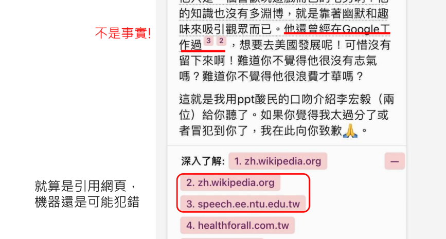

##### 如何进行搜索

[Building the New Bing | Search Quality Insights](https://blogs.bing.com/search-quality-insights/february-2023/Building-the-New-Bing)

大模型产生一个特殊的标识符类似于[cls]，一旦出现，代表要进行搜索，搜索的内容为标识符到[END]之间的内容，搜索的结果当成已经生成的文字接上文字接龙游戏。

[[2112.09332\] WebGPT: Browser-assisted question-answering with human feedback](https://arxiv.org/abs/2112.09332)

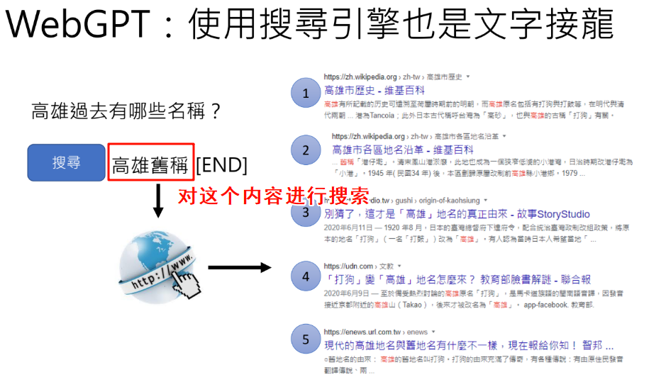

还有一个标志符`[点选]`，后面接数字，表示打开刚刚搜到的第二篇文章 ，读出需要的段落加入接龙

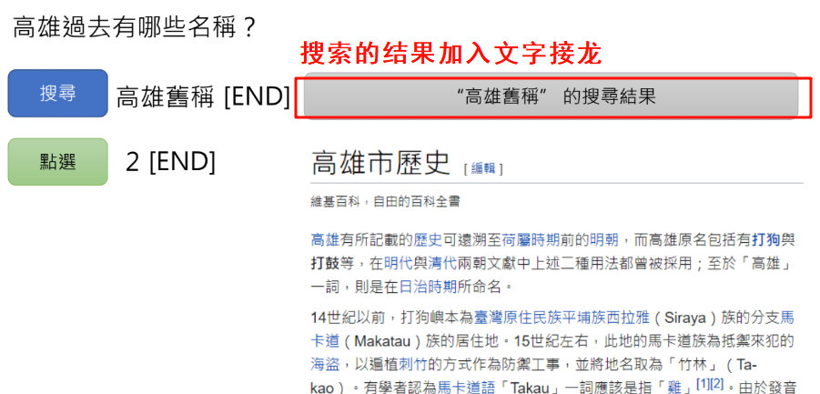

需要的部分后面有一个`[收藏]`的标识符，在得到`[回答]`标识符后只保留有收藏标志符的段落进行回答

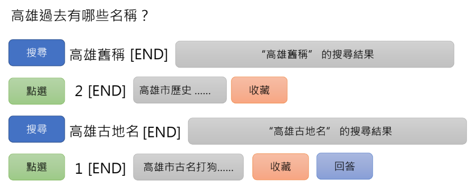

如何训练呢？人类整一个搜索到收藏写答案的行为被记录下来，拿给机器学习训练

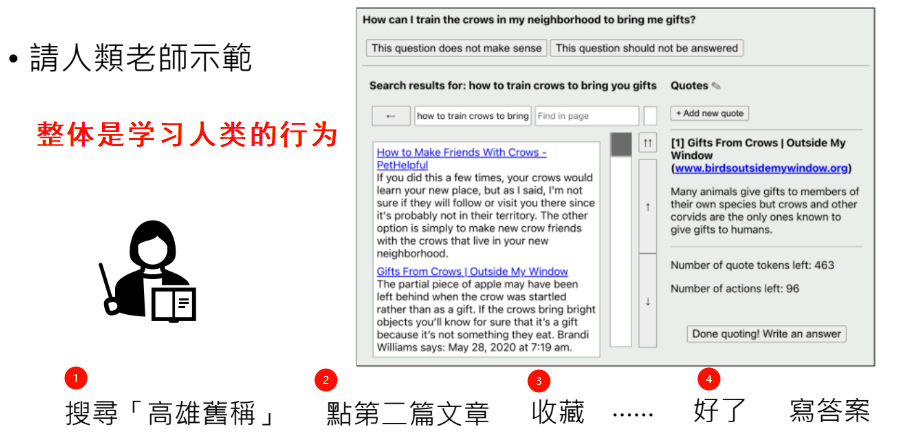

[[2302.04761\] Toolformer: Language Models Can Teach Themselves to Use Tools](https://arxiv.org/abs/2302.04761) 呼唤API使用工具

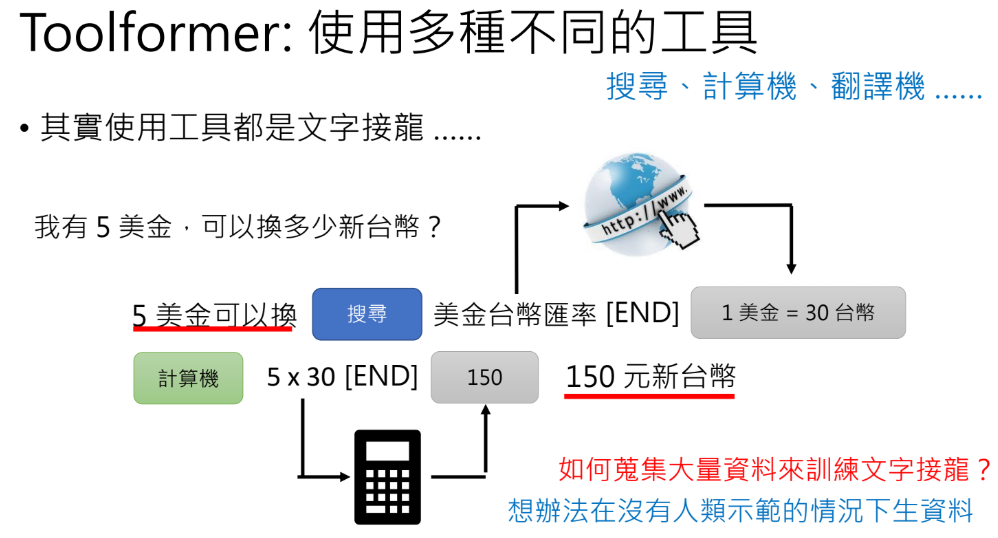

分析下面的折线图：

1. 蓝线代表可以呼唤API， 橙线代表训练的时候教他呼唤API，但是实际测试时不允许使用API，保证不是因为加了额外的资料（呼唤API）使得结果变得更好。**非常严谨！**
2. 当模型小的时候，呼不呼唤API结果差不多。

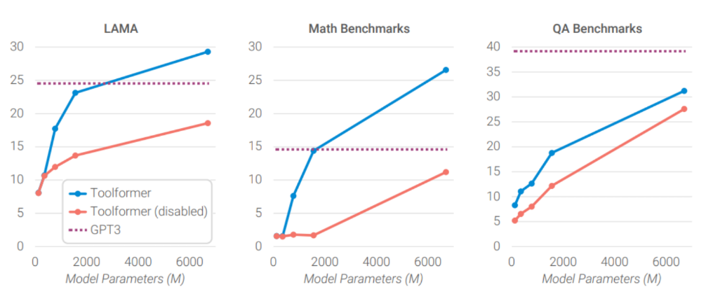

### **可用工具的示例**：

**1）写程序（Program of Thought (PoT)）：**

现在这种不需要训练语言模型，凭空让他增强的语言模型一般就叫xxx of  thought

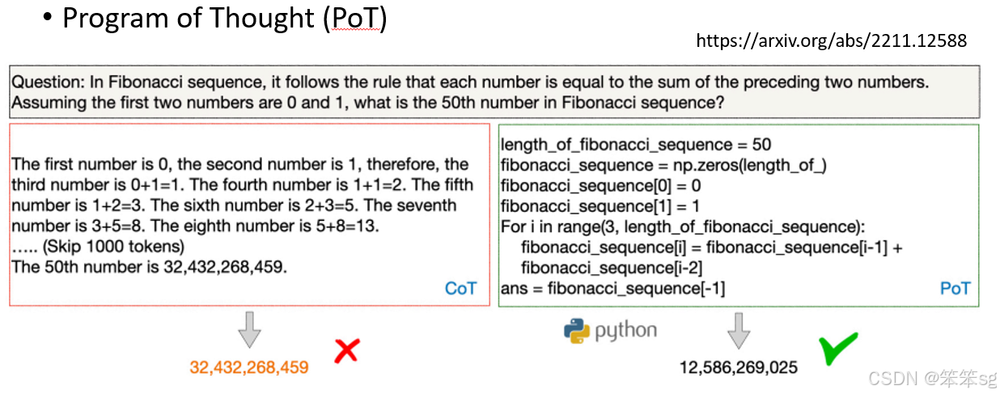

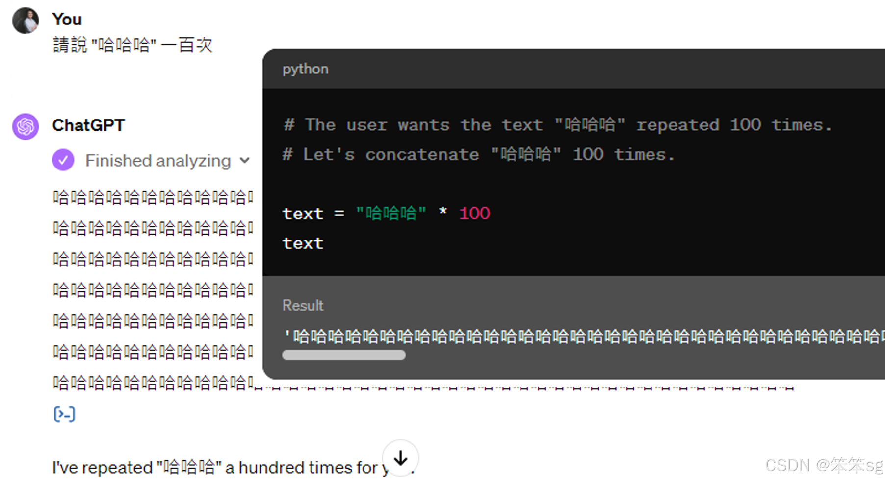

**2）文字生成图像AI**：

例如，利用DALL·E等图像生成AI，GPT模型可以根据文字描述生成图像，为用户提供更加丰富的视觉化内容。

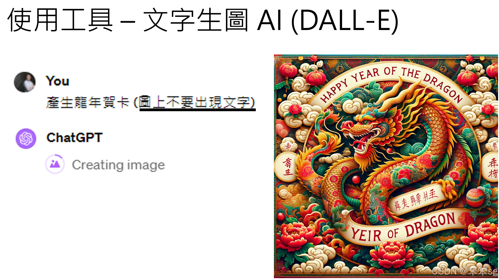

### **其他内置工具（**Plug-in**）**

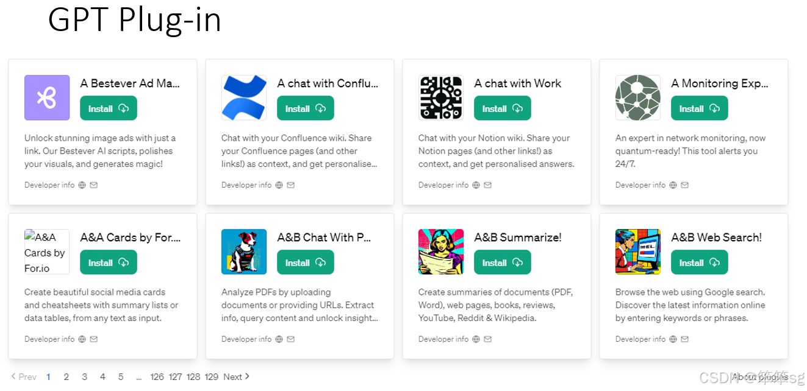

### **语言模型是如何使用这些工具的呢？**

模型在需要外部资源时，会先**搜索相关数据或调用工具**。例如，查询汇率时，模型会先调用外部汇率工具，然后用获得的数据来回答问题。

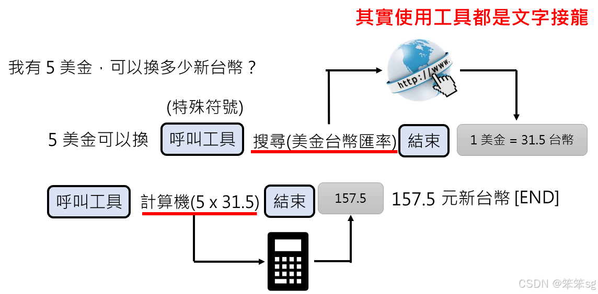

> 用文字接龙的方式使用工具，就是让语言模型在对话中灵活地调用工具来辅助回答问题。具体过程包括以下几个步骤：
>
> 1. **识别问题**：模型先分析用户的问题，判断是否需要调用工具来获取额外信息或完成计算。
> 2. **标记工具调用**：用预定义的特殊符号标记工具调用的开始和结束。例如，`工具名(指令)`，标明要调用的工具和输入内容。
> 3. **调用工具获取结果**：
>    - 如果是信息查询，模型生成搜索关键词，调用搜索引擎工具获取相关结果。
>    - 如果是计算任务，模型生成计算表达式，调用计算工具执行。
> 4. **整合工具输出**：将工具返回的结果视为生成文本的一部分，插入当前接龙内容中。
> 5. **继续文字生成**：模型基于整合后的内容完成剩余部分的生成。
>
> **示例：五美金换多少台币？**
>
> - 用户提问：**五美金可以换多少新台币？**
> - 模型文字接龙：
>   1. **五美金可以换**——分析需要当前汇率。
>   2. **搜寻(台币 美金 汇率)**——调用搜索工具。
>   3. 搜索结果返回：**1 美元 = 31.5 新台币**。
>   4. **五美金可以换 5 × 31.5 台币**——需要计算。
>   5. **计算机(5 × 31.5)**——调用计算工具。
>   6. 计算结果返回：**157.5**。
>   7. **五美金可以换 157.5 新台币**。
>
> 这样，模型通过文字接龙和工具调用，准确地完成了回答。核心思路是将工具视为文字生成的一部分，利用工具完成模型难以处理或需要外部信息支持的部分任务。

### 难免有出错的地方

**使用工具时可能出现的错误**：模型可能将用户的需求解读为字面意义。例如，要求“画一个表格”时，模型错误地调用绘图工具生成了表格而非整理文字内容。这是因为它对某些关键词（如“画”）过于敏感，导致不必要地调用工具。例如，要求“翻译一句带有‘画’的句子”时，它可能同时翻译文字和生成图像。

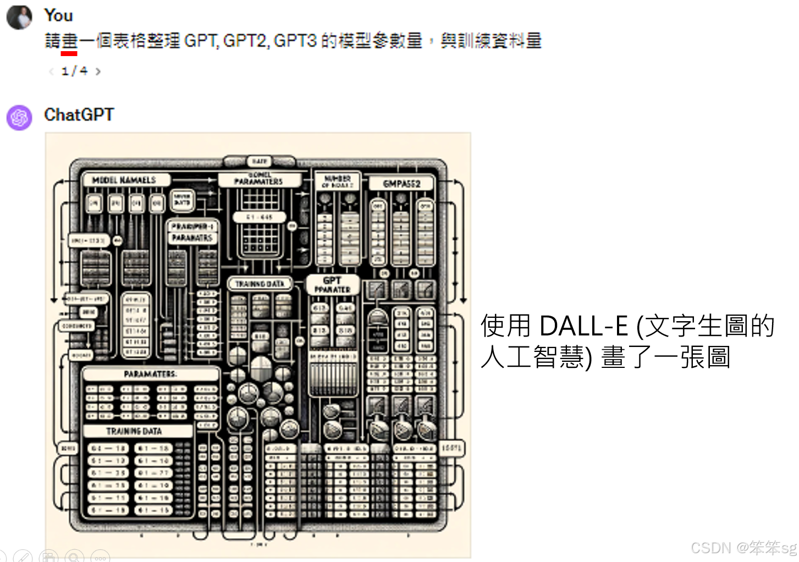让GPT画一个表格

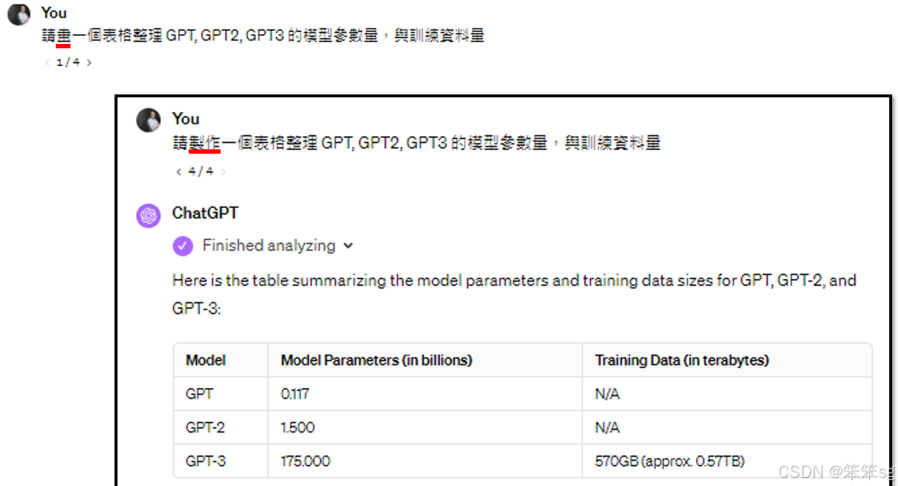

###  如何强化模型使用工具的能力？

[[2402.04253\] AnyTool: Self-Reflective, Hierarchical Agents for Large-Scale API Calls](https://arxiv.org/abs/2402.04253)

- 提升工具使用能力的研究：如最新的论文 *"AnyTool: Self-Reflective, Hierarchical Agents for Large-Scale API Calls**"*（上个月发布在 arXiv）提出了多种技巧，优化语言模型在复杂任务中调用工具的能力。
- 使用更多真实场景的训练数据，让模型更准确地学会在何时、如何调用工具。
- 增加错误检测和纠正机制，降低错误调用工具的概率。

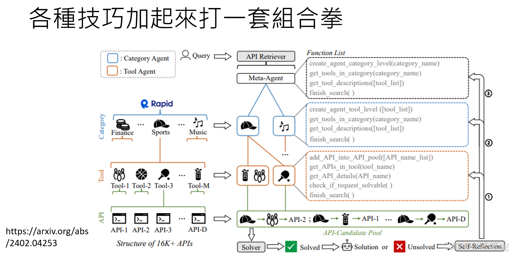

## 模型合作

### 让合适的模型做合适的事情

虽然GPT-4具备强大的能力，但其**使用成本较高**。通过与其他语言模型合作，可以实现**1+1>2**的效果，同时降低整体成本。这种合作尤其适用于任务复杂度不一的场景。

**1）任务分配机制**

可以训练一个专门的模型，这个模型的任务是判断新任务的复杂度，并决定该任务应由哪个语言模型处理。例如：

简单问题：分配给性能较弱但成本较低的模型（如GPT-3.5）。

复杂问题：分配给性能更强但成本较高的模型（如GPT-4）。 最终，人们看到的答案由具体执行任务的模型生成。

**2）意义和好处**

**节约成本：**不需要每个问题都调用最高级的模型，从而避免不必要的高费用。

**充分利用模型特性：**每个模型有不同的优势和局限。例如，一个模型可能擅长特定领域的任务或在特定条件下表现更好。通过任务分配，充分发挥这些特性。

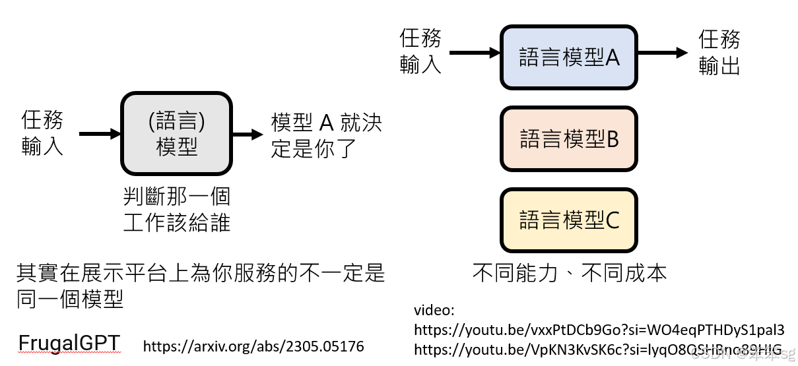

**3）实际应用示例**

一些语言模型平台已在后台实现模型合作技术。用户提交的任务由平台根据问题复杂度和模型特点动态分配给最合适的模型，尽管用户通常不会察觉到模型切换。

**4）相关研究**

推荐阅读：**FrugalGPT。**该研究探讨了如何在保持任务效果的前提下，优化成本和模型使用效率的技术。它通过构建任务分配系统，实现高效的模型协作。

###  让模型彼此讨论

单一语言模型通常独立处理任务，但在复杂或主观性强的问题中，其输出可能不够准确或全面。

通过语言模型之间的“讨论”，可以集思广益，从多个视角优化答案，提升生成质量。

**1）语言模型讨论的核心流程**

1. **初始答案生成：**第一个模型（如Cloud）基于输入任务和上下文生成初始答案。
2. **答案反馈与改进：**第二个模型（如GPT-3.5）接收第一个模型的答案，参考其内容并生成自己的改进版本，同时保持开放的态度，不完全接受或反驳初始答案。
3. **循环讨论：**初始模型基于改进答案再生成一个新的版本。双方反复交替，直到达成共识或不再提出改进。
4. **结果确定：**讨论结束后，选择一个被双方认可或优化程度最高的答案作为最终结果。

**2）具体案例展示**

任务：将“葬送的芙利莲”翻译成英文。

1. **初始翻译：**Cloud提供了初始翻译“the Bury Flurrian”，是对“葬送”的直译。
2. **引入讨论：**GPT-3.5在参考Cloud的答案后，提出了另一个版本“In Tomb Flurrian”，并解释其意图（强调被埋葬的意象）。
3. **循环改进：**Cloud根据GPT-3.5的改进提出“Furious Flurrian”，而GPT-3.5又在此基础上提出“Florious Redemption”。
4. **讨论结果：**双方一致认为“Florious Redemption”是目前最优的翻译版本。

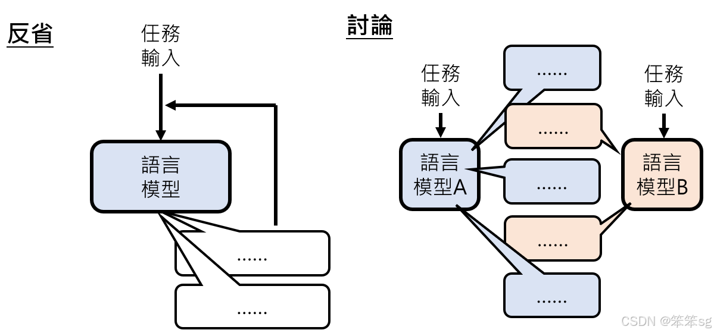

**3）实现方式**

- **手动操作：**在示例中，人为地将不同模型的输出作为输入提供给对方，展示了讨论的具体过程。
- **自动化实现：**实际应用中，可以通过编**写程序和调用API**，让语言模型自动互相对话，无需人工干预。讨论可以通过逻辑控制，如设置轮次或收敛条件，自动结束并输出最终答案。

**4）优点与潜力**

- **提升输出质量：**不同模型的能力和语言风格各异，通过讨**论可以综合其长处，输出更准确或富有创意的答案**。
- **适应复杂任务：**对于多义性问题或主观性任务，讨论机制可以从不同角度全面分析，避免单一模型的局限。
- **无需手动干预：**通过API的协作，讨论过程完全自动化，效率高且灵活。

**5）局限性**

- **讨论结果不一定最优：**即使双方达成一致，也可能因模型知识局限或主观偏好导致结果不完美。
- **计算成本增加：**多次调用模型生成答案，可能带来额外的资源消耗。

### 自我反省vs多个语言模型讨论反省 

**1）各自特点：**

**自我反省的特点**

- 语言模型通过反复审视自己的输出，尝试优化答案。
- 由于答案是自己生成的，模型对其高度认同，**推翻自己答案的概率较低**。

**语言模型讨论的特点**

- 不同模型之间相互提供答案，彼此参考并提出改进意见。
- 由于接收到外部输入，讨论更容易激发新思路，推翻错误答案的概率更高。

**2）实验结果：**

**横轴：讨论回合数；纵轴：推翻先前答案的概率。**

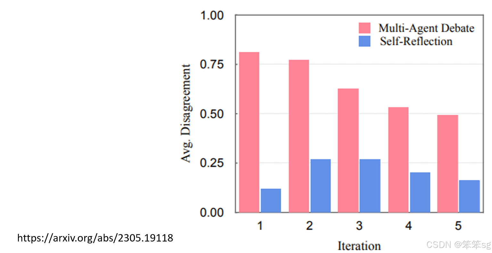

- 自我反省：推翻概率较低，随反省次数增加提升有限。
- 语言模型讨论：推翻概率显著提高，互动越多次，修正错误的机会越大。

### 多一点模型一起讨论

**1）实验1：（下图左侧）**

**横轴：参与模型数量；纵轴：准确率。**

实验结果表明：

随着更多模型加入讨论，解答数学问题的正确率显著提高。

多模型合作有效融合不同模型的能力，提升答案的准确性。

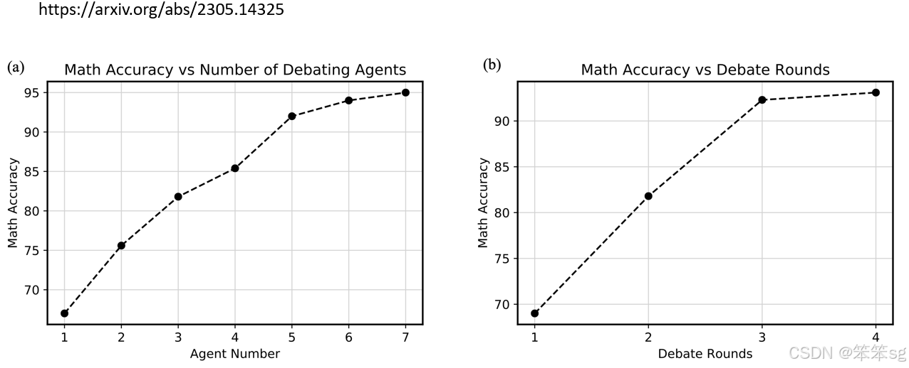

**2）实验2：（上图右侧）**

**横轴：讨论回合数；纵轴：准确率。**

实验结果表明：

讨论次数越多，正确率越高，说明多轮交互有助于优化答案。

然而，实验发现超过四轮讨论后改进变缓，建议选择合理的回合数平衡成本与效果。

### 具体的讨论方式——多模型怎么讨论

**1）多样的方式：**

语言模型之间的讨论可以通过多种机制进行，主要包括以下几种：

1. **全员交流模式**：每个模型（如A、B、C）都贡献一个答案，所有模型都能看到彼此的答案。
2. **分级报告模式**：一个模型（如A）作为“老板”，其他模型（如B和C）作为“下属”。B和C分别向A报告结果，但B和C之间没有直接交流。
3. **链式传递模式**：A将结果传给C，C传给B，B再传回给A，形成链式互动。
4. **辩论与裁决模式**：B和C之间进行讨论或辩论，A作为裁判评估谁的答案更优。

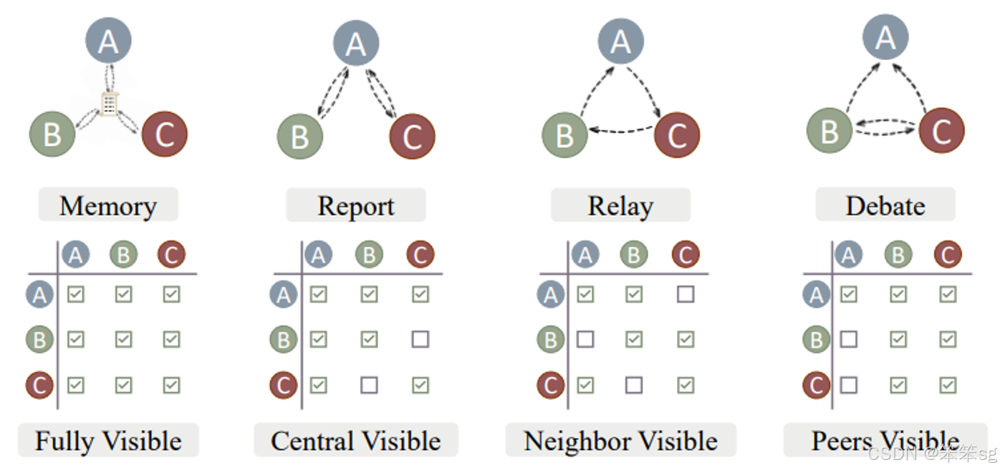

**2）研究现状：**

不同的讨论模式对不同任务的适应性各异，目前尚未发现单一最优的讨论方式。

选择适合的讨论方式需根据任务特点（如复杂性、需要的多样性）来决定。

### 讨论要怎么停下来

**1）如何判定讨论结束？—— 引入裁判模型**

由裁判模型对讨论进行监督，判断是否达成共识：

**输入：** A和B模型的讨论内容。

**输出：** 判断A和B是否达成一致意见。

如果未达成共识，则继续讨论；如果达成共识，裁判模型宣布讨论结束。

裁判模型还可以总结讨论过程，得出最终答案。

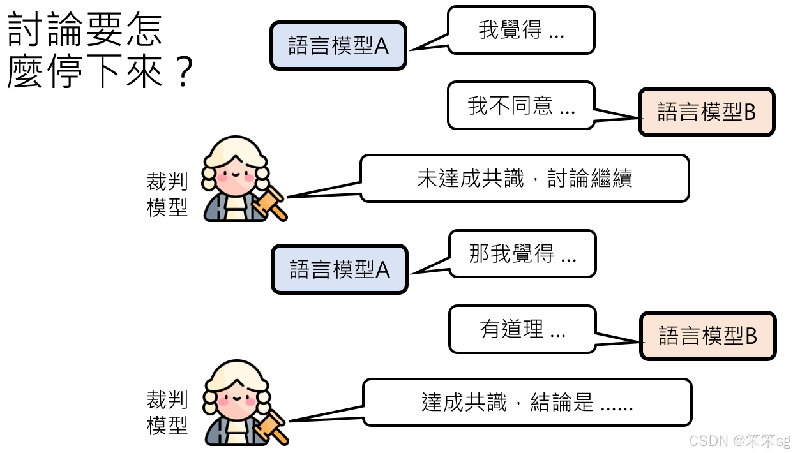

**2）如何避免讨论无休止进行？**

当前主流模型因训练时倾向于“温良恭俭让”，讨论通常难以无限持续，更常见的问题是**讨论过早结束**。

为此，需要设计适当的提示词（prompt）来引导讨论。

**3）合适的提示词**

1. **避免过于强硬的反对：** 例如“为反对而反对”的提示，容易让讨论偏离主题。
2. **鼓励合理的不同意见：** 提示模型表达自己独立的看法，而非被动接受对方意见。
3. **以参考为导向：** 让模型将对方的意见作为参考，而非绝对依据，有助于延长讨论时间并激发更多见解。

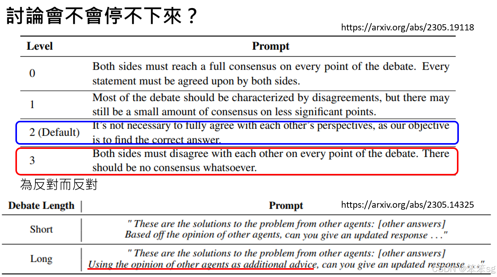

**4）研究发现：讨论时间与结果质量的关系**

- 适度延长讨论时间可以提高结果质量
- 讨论过短，可能因意见不充分表达而导致草率的共识。
- 合理延长讨论回合，能够激发更多有益的信息交换，从而提升任务完成质量。

### 语言模型的角色分工与团队协作

**1）团队协作的价值与角色分工**

一个有效的团队通常需要不同角色的协作，如魔法师、剑士、僧侣等勇者小队的模式。

在语言模型的应用中，这种团队协作可以通过以下方式实现：

1. **不同模型的专长分工：** 使用特定擅长任务的模型，例如擅长编码的模型充当程序员，擅长规划的模型担任项目经理。
2. **通过提示词（prompt）设定角色：** 即使是同一模型，也可以通过提示设定其为不同角色（如项目经理、程序员或测试员）。

**2）语言模型团队协作的流程**

**角色分工：**

- 项目经理制定计划并分配任务。
- 程序员完成编码后提交给测试模型进行测试。
- 测试员反馈测试结果，项目经理据此调整后续步骤。

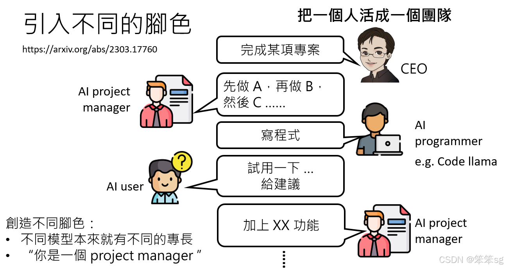

**优化协作：**

- 基于团队成员的表现，引入打分机制。分数低的模型可逐步减少其参与。

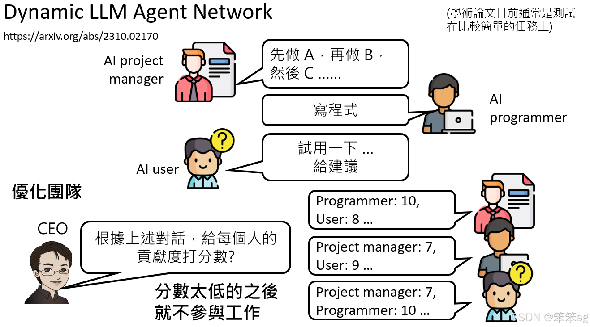

**3）相关实验与工具**

- *Dynamic LLM Agent Network* 提供优化语言模型团队的机制，例如通过评分与筛选改进团队结构。
- 斯坦福的“语言模型小镇”实验展示了多个模型间互动的可能性，甚至在模拟环境中发展出复杂的社交行为。
- *MetaGPT* 和 *ChatDev* 提供现成框架，让用户体验语言模型团队的运作。用户可通过这些工具组织一个项目团队，包括项目经理、架构师、工程师等角色。

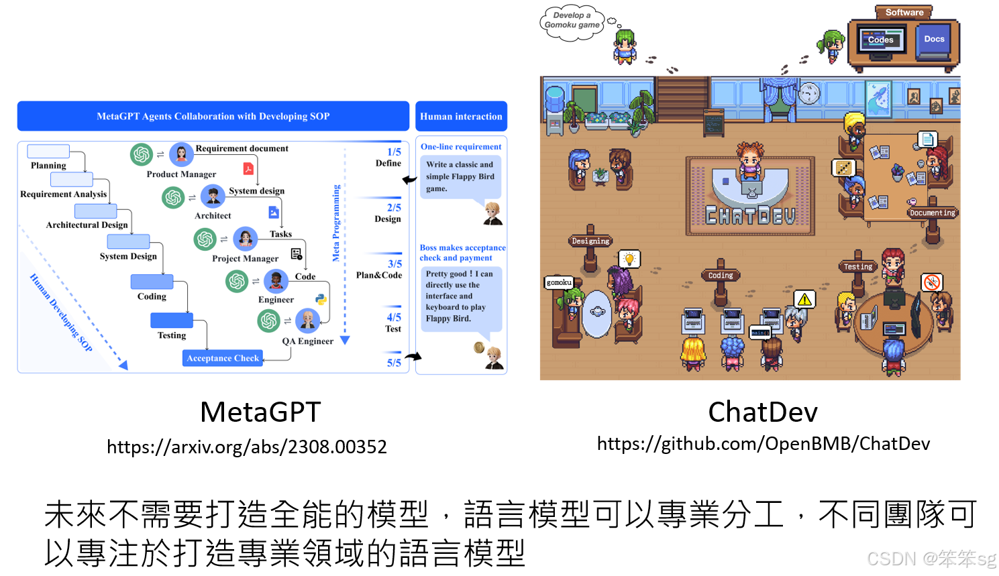

**4）潜在挑战与未来展望**

当前语言模型的团队协作在真实复杂任务中能力有限，但在特定简单任务中已有一定表现。

**5）未来方向：**

专业化：开发专注于特定领域的语言模型，提高专业领域的任务效率。

多模型协作：通过组合不同专长的模型实现更复杂的目标，而非打造全能型模型。

**6）更进一步的可能性：**

语言模型不只组成公司，还可组成社群，甚至模拟完整的社会行为。斯坦福实验中的小镇模型便展示了语言模型如何在社群中相互作用。

[Generative Agents: Interactive Simulacra of Human Behavior](https://reverie.herokuapp.com/arXiv_Demo/)

[ai村庄demo](https://reverie.herokuapp.com/arXiv_Demo/)

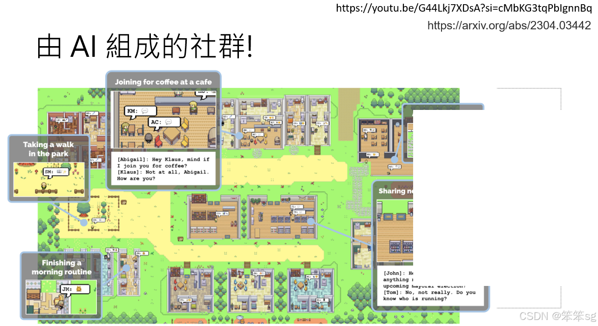

1. 给每个角色一个人设，让他们从一开始就规划好一天的行动（不可以实时规划，这样GPT会觉得11点的时候吃饭，12点的时候也该吃饭，1点的时候也该吃饭了）

2. 完全按照计划表操作，非常无聊！---->接受来自外界的刺激。任务每个时刻接受他身边事物状态。

   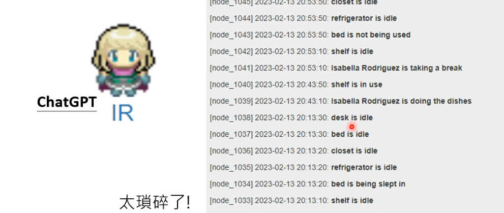

   但是信息太琐碎了，要提取出来最有用的信息

3. Reflect：对记忆（记录的所有状态）的诠释

   1. 何时reflec？对实践打法

   2. reflec什么？

   3. 检索有用记忆：重要性、及时性、关联性

   4. reflect的结果放入记忆

      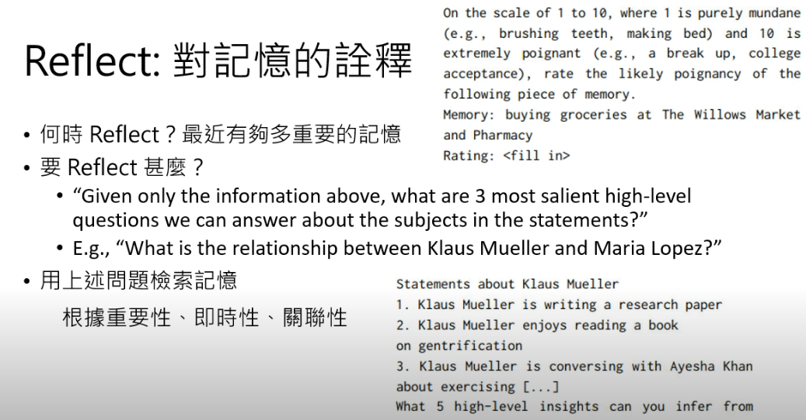

      有规划、有观察、有反思的结果

      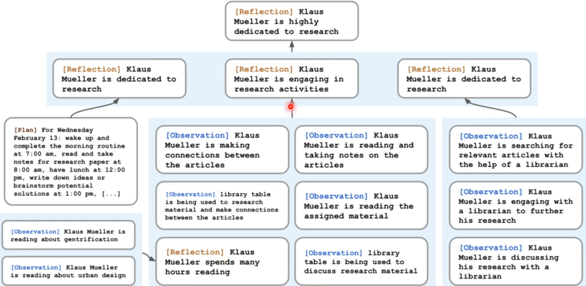

4. 根据外界的刺激改变计划

   **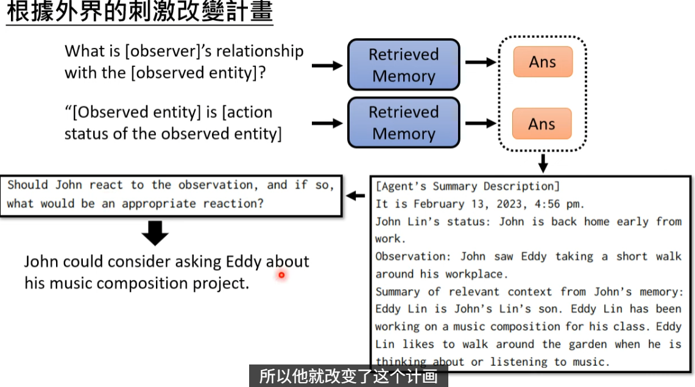**

## Reference

[【生成式AI導論 2024】第3講：訓練不了人工智慧？你可以訓練你自己 (上) — 神奇咒語與提供更多資訊](https://www.youtube.com/watch?v=A3Yx35KrSN0)

[【生成式AI導論 2024】第4講：訓練不了人工智慧？你可以訓練你自己 (中) — 拆解問題與使用工具](https://www.youtube.com/watch?v=lwe3_x50_uw)

[【生成式AI導論 2024】第5講：訓練不了人工智慧？你可以訓練你自己 (下) — 讓語言彼此合作，把一個人活成一個團隊 (開頭有芙莉蓮雷，慎入)](https://www.youtube.com/watch?v=inebiWdQW-4)

[李宏毅 GENERATIVE AI——第2~5讲（3/1、3/8、3/22上）——“今日的生成式人工智慧厉害在哪里”以及“如何让大模型的输出变得更好”_李宏毅老师的《生成式ai》-CSDN博客](https://blog.csdn.net/a131529/article/details/143992517?sharetype=blogdetail&sharerId=143992517&sharerefer=PC&sharesource=a131529&spm=1011.2480.3001.8118)

