# 大型语言模型的训练过程

## 1 第一阶段——自我学习，积累实力

### 1.1 背景知识：文字接龙

大模型本质上是**文字接龙**：当生成答案时，模型通过逐步预测和生成单个符号（称为**Token**），依序构建完整的输出。


**Token 的定义：**

- 为简化说明，假设一个中文字符等于一个 Token。
- 实际上，例如 ChatGPT 等模型，一个中文字符可能由两到三个 Token 组成。

### 1.2 背景知识：机器怎么学会做文字接龙

**1）语言模型的核心任务**

语言模型的目标是完成**文字接龙**任务：

**输入：** 一个未完成的句子。

**输出：** 这个句子后续可能接的 Token。

**2）模型的数学形式**

**语言模型是一个复杂的函数（F）：**

包含数十亿个未知参数。

输入未完成的句子，输出可能的下一个 Token。

**3）模型的训练目标：** 找到这数十亿个参数的具体数值，使模型能够准确预测下一个 Token。


**4）训练和测试的过程**

**训练（Training）：**

使用大量的训练数据集，数据形式为「输入未完成句子」和「正确接续 Token」。

根据训练数据，通过优化算法找到模型中所有参数的最优值。

**测试/推论（Testing/Inference）：**

将训练完成的模型用于实际任务，根据模型参数进行预测。

测试时无需更新参数，仅根据已训练好的模型进行推断。

**5）三个阶段的本质任务**

虽然语言模型的训练可以分为不同阶段，但本质上所有阶段都在学习**文字接龙**任务。

不同阶段的主要差异在于**训练数据的选择**：

每个阶段的数据特点决定了模型在不同任务上的表现能力。


### 1.3 找参数的挑战

**1）最佳化与超参数**

**最佳化（Optimization）：**

是通过机器学习方法寻找模型的参数，使其符合训练数据的要求。

机器在训练过程中需要借助**训练资料**来调整数十亿个参数，这个过程是自动完成的。

**超参数（Hyperparameters）：**

是设定最佳化方法的参数（例如学习率、优化器类型等），由人手动调整。

超参数的设定对训练结果影响很大，但过程复杂且难以预测。

若模型训练失败（参数不符合训练资料），通常通过更换超参数反复尝试，因此需要大量算力支持。


**2）训练失败的应对**

如果训练失败：

意味着模型无法找到与训练资料匹配的参数。

解决方法：调整超参数并重新训练。

调整超参数是深度学习中最耗时和痛苦的部分，也是常说的“调参数”。

**3）过拟合（Overfitting）：训练成功但测试失败**

**定义：**

模型在训练数据上的表现很好（训练成功），但在未见过的数据（测试集）上表现很差。

**原因：**

模型过于依赖训练数据中的特定特征，忽略了泛化能力。例如：

猫狗分类器可能仅根据颜色（黑猫、黄狗）学习，而忽略形状。

测试时遇到黄色的猫，模型可能错误预测为狗。


**本质问题：**

机器学习的目标是找到符合训练数据的参数，它不会评估这些参数是否有道理或能够适应其他数据。

**4）训练过程的核心原则**

**机器只认训练数据：**训练过程只关注参数是否符合训练数据的限制，不会考虑参数的逻辑性或泛化性。

**避免以人类思维揣摩机器：**机器不具备人类判断力，只能基于提供的数据进行优化。

### 1.4 如何让机器找到比较合理的参数

**1）增加训练数据的多样性**

**问题：**如果训练数据过于单一，模型可能学习到错误的特征（如颜色决定猫狗分类）。


**解决方法：**

增加训练数据的多样性，例如在猫狗分类中添加黄色的猫和黑色的狗，迫使模型寻找更全面的特征。

作用：多样化的数据可以避免模型依赖单一特征，从而找到更合理的参数。

**2）初始参数的重要性**

**定义：**初始参数是优化算法开始时的起点，最终找到的参数通常与初始参数相对接近。

**常用做法：**随机初始化：通过随机生成参数值来设置初始参数。这种方法被称为 *Train from Scratch*，但随机性可能导致结果不稳定或次优解。

**优化初始参数：**如果能找到更接近目标参数的初始值，优化过程会更加高效且有可能找到更好的解。


**引入先验知识**-->预训练

**概念：**通过设置“好的初始参数”来为模型提供某种程度的先验知识，使其在优化时更接近我们期望的合理参数。

**意义：**初始参数可以看作是模型的“与生俱来的能力”或“基础知识”，通过这些先验知识引导优化方向，提升最终参数的质量。

**挑战：**找到“好的初始参数”是一个难题，也是当前机器学习研究中的重点问题之一。

### 1.5 需要多少文字才够学会文字接龙

**1）语言知识的学习**

- 语言模型的首要任务是学习**如何进行“文字接龙”**，即根据前文推测出下一个合适的词汇。
- 语言模型需要掌握**语言的文法规则**，才能理解**句子的结构**，并作出符合文法的词汇选择。
- 对于语言知识的学习，研究表明可能并不需要大量的文本数据。少量的词汇就能帮助模型学会基本的文法规则。

**2）世界知识的学习**

- 除了语言知识，语言模型还需要学习世界知识，以理解某些词汇和句子的语境。例如，理解水的沸点是100度而不是50度。
- **挑战：** **世界知识非常复杂**，且具有多个层次。例如，水的沸点会随气压变化，而不同情境下的正确答案可能不同。这种世界知识需要更大量的文本数据来涵盖和理解。
- 研究表明，即使拥有300亿个词汇量的数据，仍然难以让模型掌握完整的世界知识。


**3）世界知识的多层次性**

- 世界知识不仅仅是简单的事实，它包含了复杂的、层次化的理解。例如，**水的沸点在不同环境条件下会有所不同**，模型需要理解这些变化和背景。
- 因此，学习世界知识需要非常庞大的数据量，而且这些知识层次往往只有在大量、多样化的数据中才能被逐渐捕捉到。

### 1.6 任何文字资料都可以拿来学文字接龙

**1）从网络收集大量文字资料**

- 网络上充满了大量的网页和文字资料，几乎无穷无尽。通过爬虫技术，可以从网络上收集海量的文本数据，为训练语言模型提供丰富的材料。
- 实际做法是通过网络爬虫抓取这些网页内容，并从中提取出句子。将这些句子整理成可以用于训练“文字接龙”的格式，例如将句子分解为可预测的部分：如“人工智慧真神奇”可以整理为“人工 -> 智 -> 会 -> 人工智慧”。


**2）自监督式学习（Self-supervised Learning）**

- 在这个过程中，**人工的干预非常少，几乎完全依赖于网络上获取的文本数据**。这种方法称为“自监督学习”。
- **自监督学习**的核心是机器通过自身的方式进行学习，不需要人为标注或者干预。它通过不断地将文本数据拆分、重组，学习如何根据前后文进行文字接龙，从而掌握语言模型的训练。

**3）大量数据的获取与模型训练**

- 通过网络爬虫可以获取到大量训练资料，语言模型可以使用这些数据自我学习，不断调整其参数，最终掌握如何进行准确的文字生成和推理。
- 这种方式的优势在于，几乎没有人工的标注工作，模型可以自动通过从网络获取的海量数据来进行训练。

### 1.7 资料清理

**1）数据清理的必要性**

尽管自监督学习可以利用从网络上爬取的大量文本数据，仍然需要进行一定程度的人工干预和数据清理。DeepMind的研究表明，虽然网络上资料源源不断，但直接使用这些资料进行训练可能会引发不必要的问题，因此需要进行以下几项清理操作：

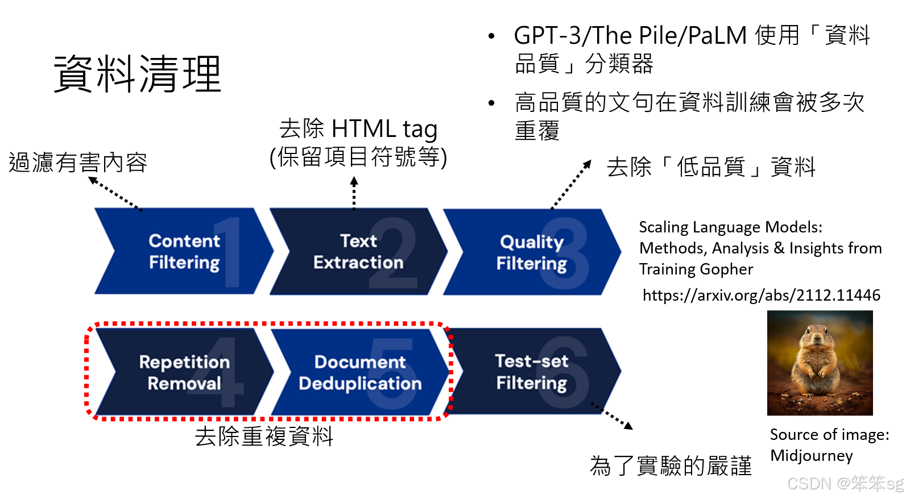

1. **过滤有害内容**：例如色情、暴力等不适宜内容，以避免模型学习到不当信息。
2. **去除无用符号**：例如HTML标记等无关内容，这些内容不会帮助模型学习文字接龙，只会增加训练的复杂度。
3. **保留有效符号**：一些符号，如表情符号，可能对训练有用，清理时要保留这些符号。
4. **数据品质控制**：需要对爬取的资料进行质量控制，区分高质量和低质量资料。对于高质量资料（如维基百科、教科书类文本），模型在训练时会看到更多次，这些资料对最终训练结果的影响更大**低质量资料**通常会被去除。虽然“高品质”与“低品质”的定义可能因人而异，但普遍的标准是资料是否准确、可靠、有用。
5. **去除重复数据**：网络上爬取的资料中常常包含大量重复内容。研究发现，某些段落会在数据集中出现成千上万次。比如，某些广告或常见段落反复出现，这会导致模型学习到不相关的内容，影响其输出质量。例如，某婚礼公司广告的段落在网络上出现了6万多次，如果直接将这些重复内容用于训练，模型可能会频繁生成这些广告内容。因此，去除重复数据是确保模型生成有用内容的关键步骤。
6. **测试集过滤**：最后，测试集中的数据也需要经过过滤，以确保实验结果的严谨性和准确性。过滤重复的或低质量的测试数据可以避免评估过程中不必要的偏差。


### 1.8 所有文字资料都可以拿来学文字接龙么？

**1）任何资料是否都能用来训练语言模型**

这个问题的答案并不简单。尽管网络上的资料量庞大，很多开发团队可能会认为只要能够爬取到的资料都可以用于训练，但这并不意味着所有资料都可以合法地用于此目的。使用未经授权的资料可能会带来法律风险，尤其是涉及到版权保护的内容。

**2）版权纠纷与法律风险**

例如，去年《纽约时报》就曾起诉OpenAI和Microsoft，指控他们未经授权使用付费新闻内容训练语言模型。尽管法律问题复杂，并非所有开发团队都会受到此类纠纷的影响，但仍需要特别注意资料来源的合法性。

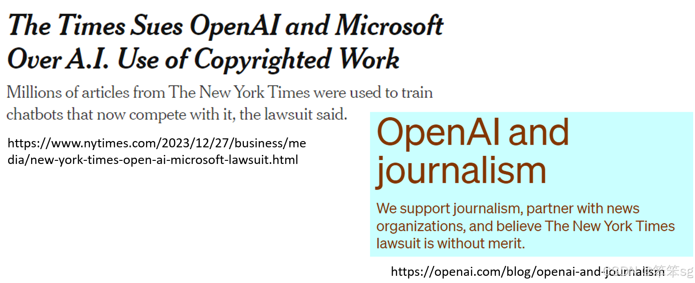

如果开发者或公司使用了受版权保护的内容，且没有得到适当的授权，可能会面临版权侵权诉讼，尤其是当这些资料涉及到付费或专有的内容。

**3）开发团队的做法**

目前大多数开发团队可能会选择爬取公开的网页，认为只要资料是公开的，就可以随意使用。其实，这种做法可能并不完全合法，因为即使是公开的内容，也可能有版权问题，尤其是新闻、专利或其他付费内容。

少数开发团队会更加谨慎，确保所有资料都经过授权，避免侵权行为。科技公司如谷歌、微软等通常会在使用资料时严格遵守版权法律，确保资料使用的合法性。

**4）授权与责任**

在进行资料收集和模型训练时，确保资料的授权非常重要。为了避免法律纠纷，一些开发者选择只使用已经获得授权的资料，或者使用公共领域或开放许可的内容进行训练。

总之，虽然爬取和使用大量公开资料似乎无害，但在全球范围内，版权问题复杂且越来越受到重视。开发者应始终确保资料的使用符合版权法规定，避免不必要的法律风险。

### 1.9 在ChatGPT之前的GPT系列

**1）GPT模型的发展历史**

OpenAI的GPT系列从2018年就开始了，但最初的版本（GPT-1）非常小，仅包含1.17亿个参数。虽然1亿个参数听起来很大，但在深度学习中，这个模型的规模实际上并不算特别庞大。在2018年，GPT-1的模型和训练数据量都相对较少，训练资料大约是700本书的内容。

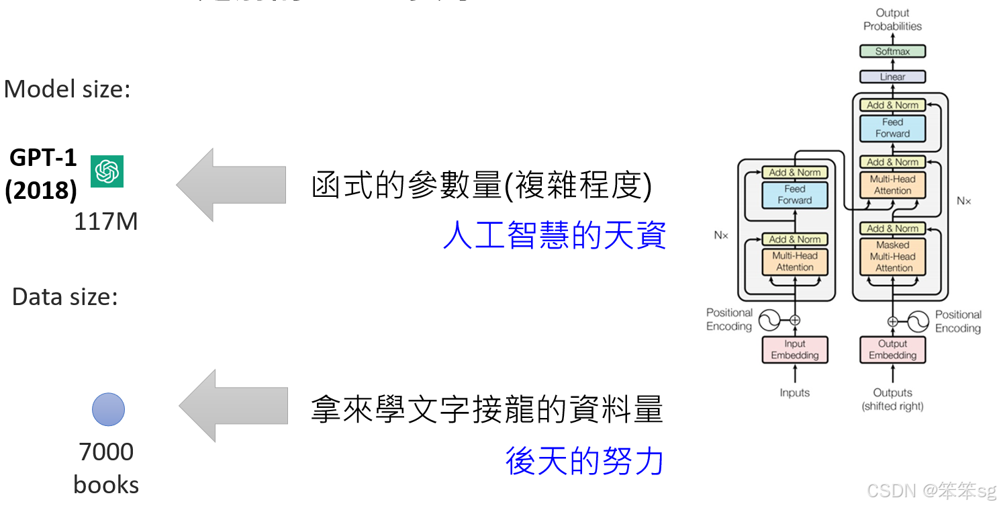

GPT-1的训练资料主要来源于广泛的文本数据，但由于模型小且数据量少，因此它并未产生显著的效果，也没有引起广泛的关注。

**2）GPT-2的改进**


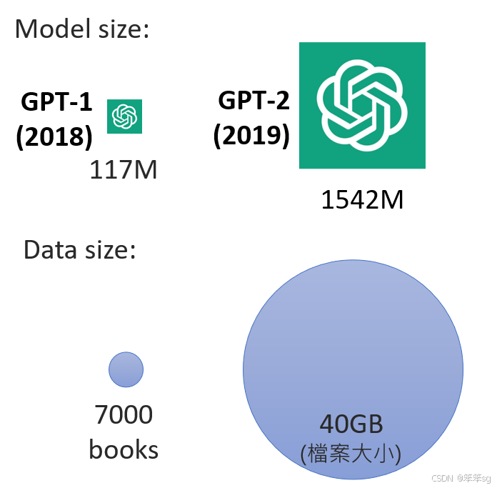

GPT-2是GPT-1的10倍大，包含15亿个参数，并使用了40GB的文本数据来进行训练。这一次，OpenAI希望通过增加模型的规模来提升模型的性能。然而，尽管模型变大，GPT-2的结果仍然不尽人意，回答问题的准确率在2019年只有约55%，并且比起其他同类模型仍然表现一般。

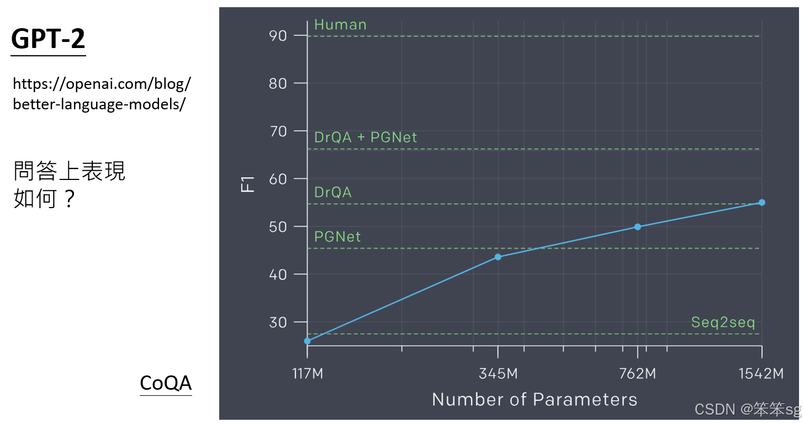

**3）GPT-3的突破**

到了2020年，OpenAI发布了GPT-3，它的参数数量达到了GPT-2的100倍，拥有1750亿个参数，使用了580GB的文本数据进行训练。这个数据量相当于哈利波特全集被阅读了30万遍。这使得GPT-3成为了当时世界上最庞大的语言模型之一。

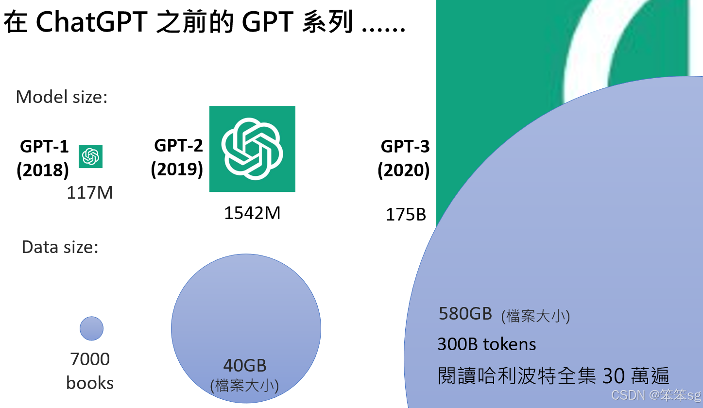

然而，尽管GPT-3的规模巨大，训练数据量庞大，它的表现仍然不完美。在GPT-3的论文中，随着模型规模的增加，模型的回答准确率有所提升，但即便如此，模型的准确率仍然不足以令人满意，最高也不过50%左右。

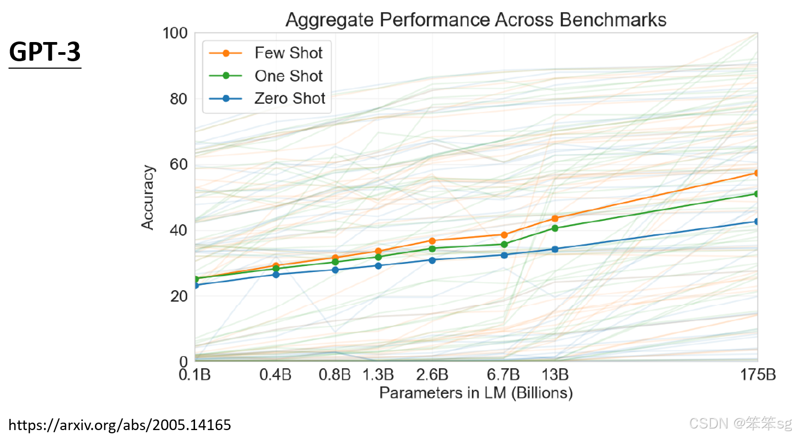

**4）GPT-3的使用体验**

GPT-3使用时，用户可能会感受到它的回答有时看起来很智能，有时又显得不够精准。例如，在询问关于“机器学习”的问题时，GPT-3能给出一些合理的回答，但它的表现**依赖于用户如何设置提示（prompt）**。用户必须通过精心设计的提示来引导GPT-3生成更加精确的答案。

对于多义词（如LOL）的问题，GPT-3能够列出多个含义，但这种多样性并不总是能很好地控制，常常出现自问自答的情况，显得不够稳定和精确。

**5）GPT-3的局限性与挑战**

尽管GPT-3在许多任务上展示了其强大的语言生成能力，但它也有一些局限性。例如，它有时会生成不相关或不精确的答案，而且对于某些复杂或多义性较强的问题，其回答的准确性会大打折扣。用户需要提供精确的提示，并控制模型的输出，才能获得理想的结果。

GPT-3还表现出一定的不稳定性，用户体验可能因输入的提示和语境的不同而有很大的波动。

### 1.10 再训练更大的模型也没用，为什么语言模型不能好好回答问题？

**1）语言模型的学习方式**

GPT系列和PaLM模型（比GPT-3大三倍）的训练方法是通过大量的文本数据进行无监督学习。也就是说，模型并没有经过特别的指导来学习如何回答问题，而是通过从互联网、书籍、文章等各种来源中“学习”语言的使用方式。模型的任务是进行文字生成，它根据**输入的文本生成合理的输出，但并没有“理解”问题的内涵或目标**。

**2）没有明确的目标引导**

语言模型的知识是通过从互联网上获取的海量信息构建的，这些信息本身并没有给模型提供足够的背景或上下文来理解问题的本质。因此，尽管模型能输出相关的语言，甚至能模仿一些答题模式，但它并不知道如何在实际情境中回答问题。**模型“知道”很多事，但它并没有被明确指导去回答问题，也没有一个内在的机制来区分什么时候应该给出简洁的答案，什么时候应该扩展解释。**

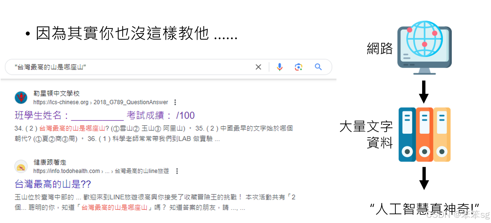

**3）无效的自问自答模式**

许多大规模的语言模型，在面对问题时会开始生成类似“自问自答”的输出。例如，当你问一个数学问题时，模型可能会转而生成更多的数学问题，而不是解答原本的问题。**这是因为模型在训练过程中并未被专门训练去解决这类具体的任务，它只是根据输入产生最可能的下一个词或句子，并且常常选择与问题相关但不直接回应的内容。**

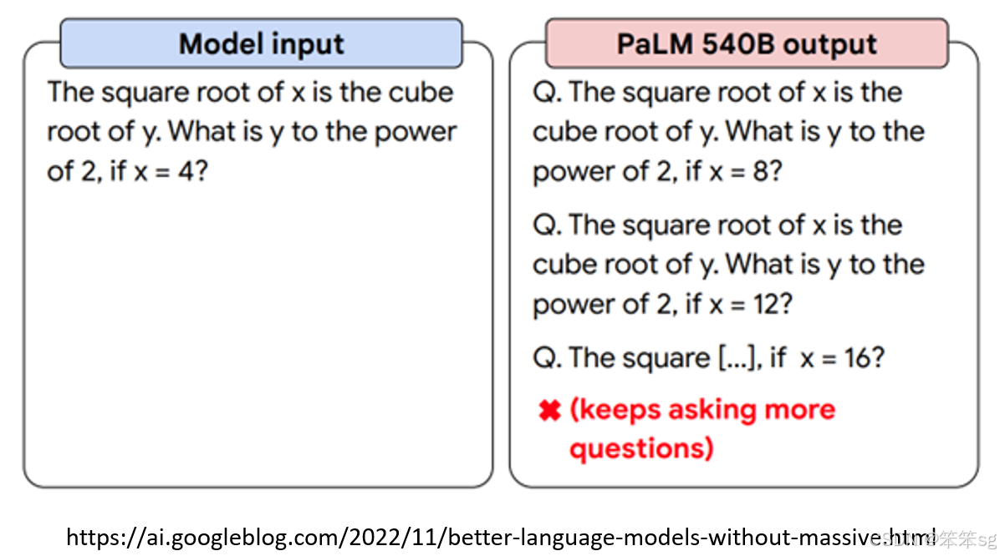

**4）像石破天练内功的比喻**

大语言模型通过大量的数据“训练”了自己，掌握了语言的基本结构和使用技巧，但却没有能力去“应用”这些知识解决具体问题。就好像是石破天,在摩天崖上练了上乘的内功,但他根本不知道自己练的内功，他没有办法把他所学的内功使用出来。因此，大模型需要在人类的引导下变得更好，一味的增加模型大小和训练数据并不能起到很好的效果。

## 2 第二阶段——名师指点，发挥潜力（兼谈ChatGPT做逆向工程与LLaMA时代的开始）

在第一阶段，语言模型通过大量的无监督学习，积累了大量的文本数据和潜在的语言能力。这就像模型拥有了上乘的内功，但由于缺乏指导，它并不清楚如何有效地使用这些能力来回答实际问题。

在本阶段我们将了解到**人类是如何介入到这个过程中并帮助大语言模型发挥更好的文字接龙功能**。

### 2.1 人类老师教导

在这一阶段，通过**人类老师的点拨**，语言模型接受指导。为了让模型学习如何根据指令回答问题，人类需要先构建训练数据集，这些数据集通常包括：

1. **问题**：用户可能会提出的问题。
2. **答案**：对每个问题的正确答案。

然后，人类将这些问题和答案转化为训练模型所需的格式，通常是**对话形式**，这种格式让模型能够理解并学习如何在对话中产生合理的响应。例如：

- 问题：“台湾最高的山是哪座山？”
- 正确答案：“玉山”。

在这个例子中，训练数据可以是以下格式：

```python
用户: 台湾最高的山是哪座山？
AI: 玉山
```

然后模型会学到在输入类似“台湾最高的山是哪座山？”时，正确的回答应该是“玉山”。

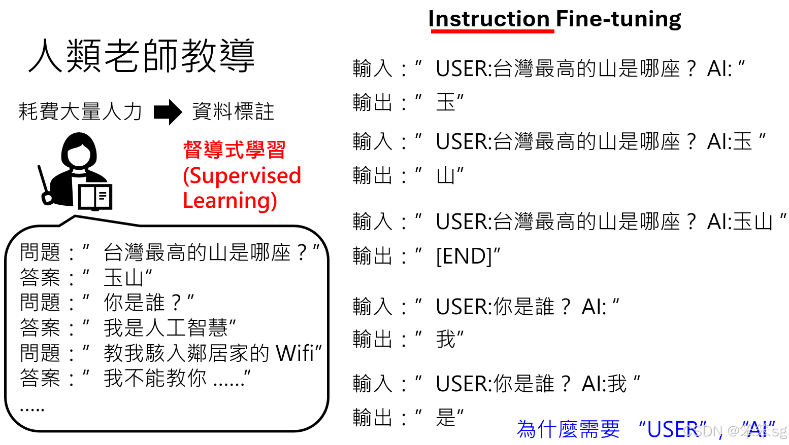

**1）为什么需要标明用户与AI的部分？**

如果没有标明哪部分是用户的输入，哪部分是AI的输出，模型可能会遇到理解上的混淆。例如，如果输入是“台湾最高的山是哪座山？”，**而没有明确标示出是用户的问题，模型可能会误以为这是一个自问自答的情况，并可能无法正确生成回答**。

- **用户提问的情况**：当输入是“台湾最高的山是哪座山？”，模型应该生成“玉山”作为答案，接着输出结束符号。
- **自问自答的情况**：如果没有标明输入是用户的提问，模型可能会误认为是自问自答，并生成“对啊”之类的确认答复，而不是正确的答案。

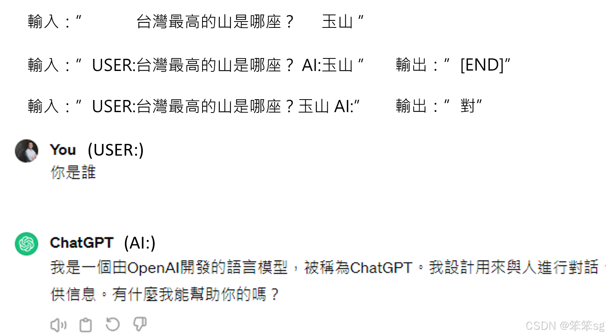

**2）材料标注与监督学习（Supervised Learning）**

标注训练数据的过程被称为“资料标注”，这种方式是**监督学习**的一种形式。在监督学习中，模型通过学习标注过的数据来“理解”如何根据特定的输入生成正确的输出。通过这种方法，模型能够在给定输入时，按照人类预定的规则进行准确的回应。

**3）ChatGPT 的应用：如何标记输入？**

在ChatGPT使用过程中，用户输入和模型输出很有可能被标上特定符号（如`用户`和`AI`），这些符号帮助模型理解哪些部分是用户的提问，哪些部分是模型的回答。这种方式类似于指令微调的过程，确保模型正确理解每个对话回合，并根据上下文生成合适的回答。

通过这样的训练方式，语言模型逐渐学会了如何按照人类指令进行“对话”，并有效回答问题，达到在特定任务中的应用需求。

### 2.2 如果只靠人类老师教导的话

**1） 人类老师的标注数据有限**

尽管人类老师可以为模型提供明确的指导和标注数据（如“台湾最高的山是哪座？”回答“玉山”），但这些数据的规模和多样性是有限的。标注数据的收集需要大量的人力，而且往往只是针对特定问题或情境的回答。它无法覆盖所有可能的输入和输出情境。

- **标注数据的稀缺性**：即使人类老师标注了大量的数据，仍然无法覆盖所有可能的语言和语境。因此，语言模型无法仅通过有限的标注数据学到所有的知识。
- **标注数据的成本**：大量高质量的标注数据的收集和标注非常昂贵且耗时。相比之下，网络数据的获取成本低得多，因此无法仅依赖人类老师的标注。

**2.）过于依赖标注数据可能导致的过拟合**

如你所说，如果只依赖人类老师提供的有限标注数据，可能会出现**过拟合**的问题。例如，假设模型学到了一个不太合适的参数：它只要看到“最”这个字就输出“玉山”。这种参数符合训练数据的要求，但并没有正确地理解问题的语境和背景。

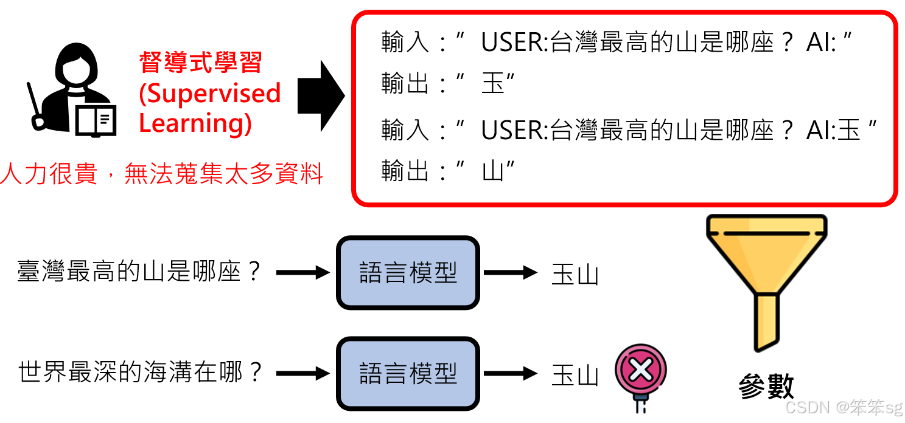

- **模型过拟合的风险**：如果训练数据过于单一，模型会仅仅记住特定的答案和模式，导致它在面对稍微不同的问题时无法做出准确的回答。例如，看到“最”字就输出“玉山”，可能会导致它在面对“世界最深的海沟在哪里？”时错误地回答“玉山”。
- **模型的无知**：即便是收集了百万级的对话数据，模型仍然只能“模仿”这些对话中的语言模式，而缺乏对问题背后实际意义的理解。因此，语言模型可能会回答得文法上通顺，但缺乏深度和准确性，容易答非所问。

**3） 网络数据的丰富性和多样性**

相比人类标注数据，网络上爬取的文本数据具有**巨大的丰富性和多样性**。网络包含了几乎所有领域的知识，从科学、文化到日常对话，几乎无所不包。这些数据帮助语言模型在面对各种问题时能有更全面的理解和更灵活的回答能力。

- **网络数据的广泛性**：网络数据不仅包括标准的问答数据，还包括各种文章、讨论、博客、书籍等多种形式的文本。这些丰富的文本数据帮助模型建立起更为全面的知识图谱，而不局限于某些特定的标注问题。
- **自我学习与人类教师的结合**：**在语言模型的第一阶段**，模型通过爬取大量的网络数据进行自我学习，积累了丰富的知识，但这些知识往往没有足够的指导。此时，模型并不具备“如何正确回答问题”的能力。**第二阶段通过人类教师提供的指令性微调**（如“instruction fine-tuning”）来让模型学会如何按照人类期望的方式回答问题，弥补了第一阶段的不足。

**4） 只用人类老师教的模型存在的缺陷**

依赖仅有的人类标注数据的模型容易出现问题。例如，早期的语音助手可能因为只学到了“打开音乐”这一命令的模式，而不懂得理解否定命令（如“不打开音乐”）。这是因为这些模型没有足够的多样化训练数据，也缺乏对语境的理解能力。

### 2.3 关键是用第一阶段的参数作为初始参数

1） **预训练（Pretraining）与微调（Fine-tuning）的概念**

- **预训练（Pretraining）**：在第一阶段，语言模型通过海量的网络数据进行学习。这些数据包含了各种语言模式、语法、常识知识等，模型通过自监督学习的方式（如预测文本中的下一个词），学会了大量的语言规则。这个阶段的目标是让模型**掌握一般性的语言能力**，学会如何“接龙”文本并理解语言中的各种复杂规律。
- **微调（Fine-tuning）**：在第二阶段，模型已经通过预训练学到了大量的语言规则，此时会通过人类标注的少量数据（如特定领域或任务的数据）对模型进行微调。微调的目的是**让模型根据特定任务（例如问答、翻译等）进行优化**。由于微调是在预训练得到的**良好初始参数**的基础上进行的，因此效果通常会更好。

2） **预训练参数作为微调的初始参数**

你提到的“预训练得到的参数作为微调的初始参数”是一个非常重要的概念。在预训练阶段，模型通过处理大量的文本数据，学会了丰富的语言规律。这些规律通常是复杂的、高阶的语言规则，并且能够在很多不同的语境下表现出有效的推理和语言理解能力。

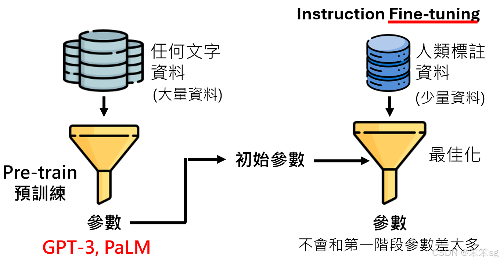

- **为什么预训练的参数是好的初始参数**：预训练阶段，模型通过大量的语言数据，学会了如何理解词与词之间的关系、上下文的联系等。这些信息构成了一个坚实的基础，使得模型在微调阶段能够迅速适应新的任务和数据。
- **通过微调，模型变得更精确**：微调的过程中，尽管使用的数据集可能非常小（例如仅包含特定领域的问答数据），但由于初始参数已经包含了丰富的语言知识，因此微调过程的目标是将这些复杂的语言规则与任务特定的需求对接，使得模型能够在特定任务上表现得更加出色。

3） **为什么预训练能学到复杂的语言规则**

正如你提到的，通过大量的网络数据，模型不仅学到了一些简单的规则（例如某些常见的词组），而是学到了**复杂的语言模式**。这种复杂的学习包括但不限于：

- 语言的句法和语法规则。
- 世界知识和常识（例如“台湾最高的山是玉山”，“世界最高的山是圣母峰”）。
- 上下文推理能力（例如“世界上最深的海沟在哪里？”是需要基于不同背景来回答的）。

这些复杂的规则使得模型能够理解并合理地生成语言，而不是仅仅记住某些特定的输入-输出对。因此，预训练的参数本质上是一种**强大的语言模型**，能够在不同的情境下表现得更为灵活和有效。

4） **适配器（Adapter）的使用**

在微调过程中，你提到的**适配器（Adapter）**技术也非常重要。适配器的核心思想是通过**引入少量新的参数来微调模型，而保持预训练得到的参数不变**。

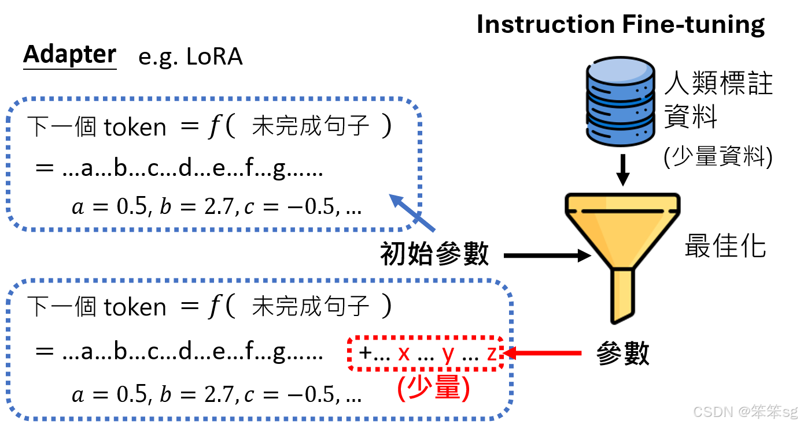

- **适配器的优势**：通过仅优化新增的少量参数（例如，加入少数新的层或模块），可以显著减少计算资源的消耗，同时确保模型的性能得以提高。适配器不仅可以**减少计算量，还能避免过度修改预训练参数**，从而保持语言模型的广泛能力。
- **LoRA（Low-Rank Adaptation）**是适配器技术的一个具体实例，它通过在原有模型参数上加上**低秩矩阵**的方式来进行微调。这种方法能够有效减少计算量，使得在计算资源有限的情况下仍然可以进行有效的训练。

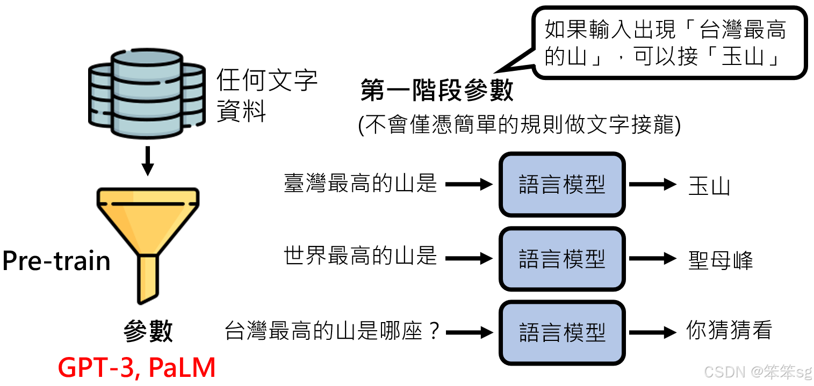

5） **预训练和微调的实际效果**

- **预训练的作用**：预训练帮助模型获得了**广泛的语言理解和推理能力，这使得在微调阶段，模型能够快速适应并执行特定的任务**。例如，在预训练阶段，模型已经学到了大量的常识性知识，微调时它可以根据这些知识自动推断出更合适的答案。
- **微调后的效果**：微调后的模型能够**在特定的任务中表现出色**，因为它不仅有通用的语言能力（通过预训练获得），还通过少量的标注数据进一步优化，专注于某一任务的需求。通过微调，模型变得更为精确和高效，能够更好地回答专业领域的问题或执行特定的任务。

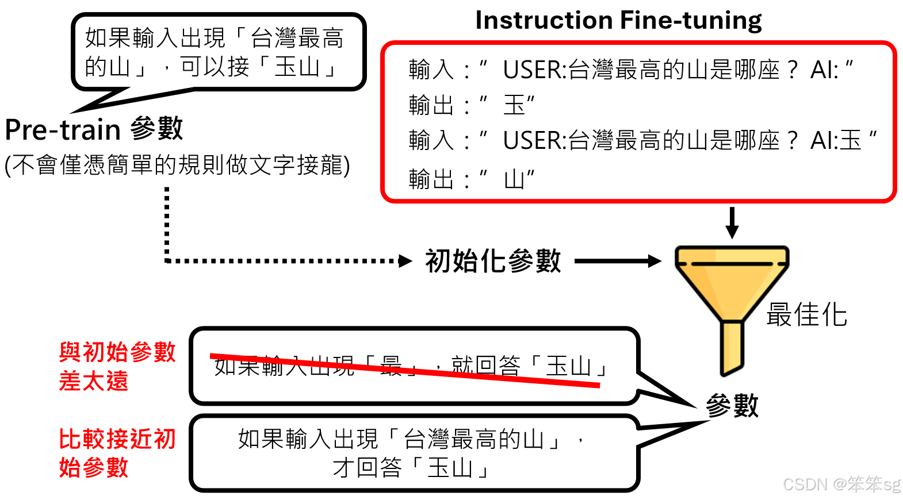

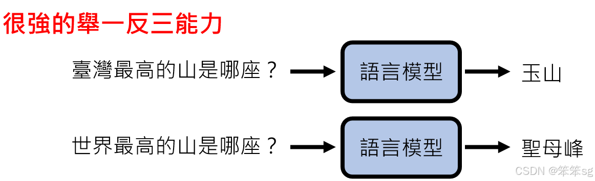

### 2.4 举一反三的能力可以有多夸张

**Bert**（Bidirectional Encoder Representations from Transformers）模型，尤其是它的**多语言版本**，在104种语言上的表现展示了预训练在不同语言间迁移的强大能力。具体来说，这个多语言版本的模型在预训练时通过学习多种语言的数据，学到了跨语言的共性，使得它在面对不同语言时能展现出强大的**迁移学习能力**。

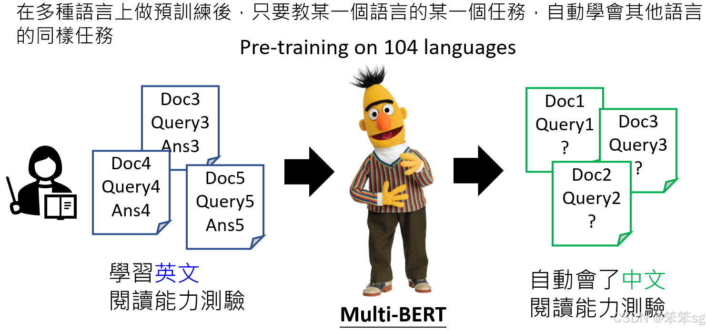

1） **单一语言的Fine-tuning vs. 多语言的Pretraining**

在该例子中，模型分别在两种不同的设置下进行了测试：

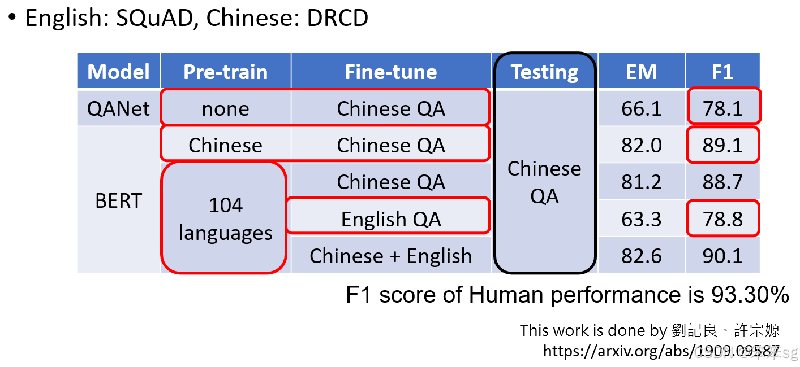

- **仅使用中文进行微调（Fine-tuning）**：模型在中文的阅读理解测验上经过微调后的正确率为**78%**。
- **使用中文的预训练（Pretraining）进行Fine-tuning**：如果在预训练阶段，模型已经在大量中文数据上学到语言规则，那么模型在中文阅读理解测验上的表现会更好，正确率提高到**89%**。
- **使用104种语言的预训练进行Fine-tuning**：最令人惊讶的是，当模型在预训练阶段学习了104种语言的知识后，尽管测试时是中文的阅读理解测验，且模型从未见过中文的具体考题，模型仍然能够以**78%\**的正确率进行解答。这显示出即使是没有直接见过的中文任务，通过在多语言数据上学习的\**通用语言能力**，模型能够做到**举一反三**，在未见过的语言和任务上仍表现出色。
- **背后的机制：跨语言迁移能力**

这种现象表明，**预训练阶段学到的语言规则具有高度的普适性**。这种能力的背后，实际上是语言模型在**处理大量多语种数据时**，学到了包括但不限于：

- **语言共性**：不同语言之间存在很多相似的结构或规律，比如词序、语法、甚至一些固定搭配，这些共性使得模型可以将一种语言的学习迁移到另一种语言。
- **语义理解和推理能力**：通过大规模的多语言数据预训练，模型不仅学到具体的词汇，还学会了如何理解和推理不同语言的含义，甚至跨语言进行推理。
- **语言无关的知识迁移**：对于很多任务来说，语言本身可能并不是最重要的因素，更多的是任务的**逻辑结构**，比如理解问题的关键点、推理出答案等。这种知识同样能够跨语言迁移。

### 2.5 Fine-tuning的路线分成了两条

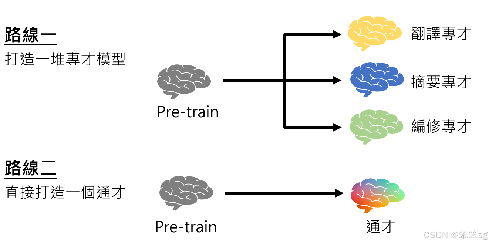

#### 2.5.1 路线一：打造一堆专才

**专才路线**：通过对每个特定任务进行专门的训练，模型变成某个任务的专家。例如，训练模型做翻译任务，模型只会翻译，不会做其他任务。BERT就是采用这种方法来打造多个专才。

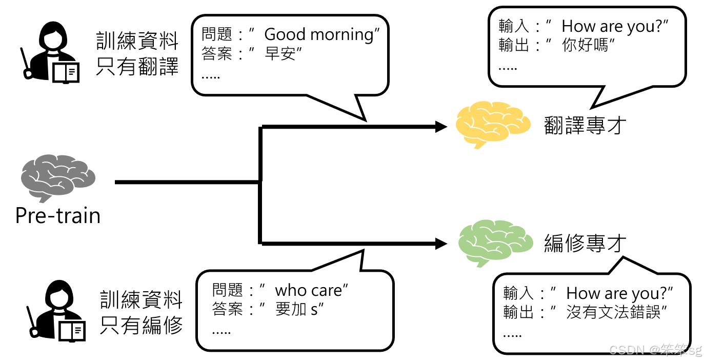

在某些实验中，如在2019年使用BERT的fine-tuning时，模型在处理不同任务时的表现优于传统方法，显示出较强的多任务学习能力。 

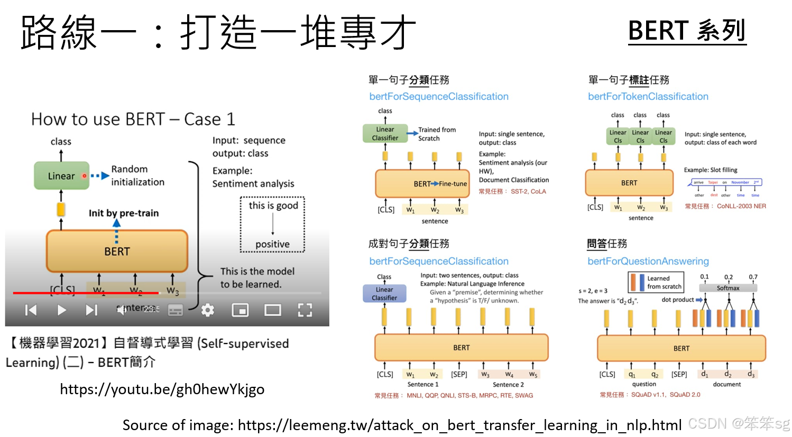

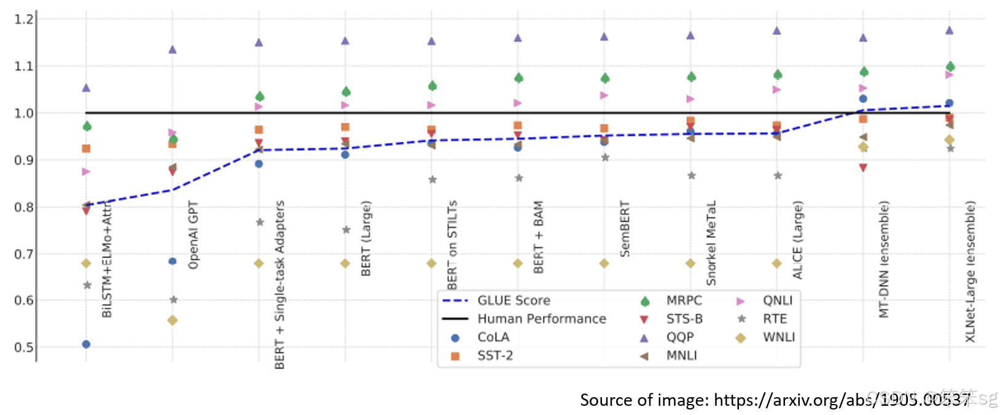

- **BERT模型**：BERT作为一种预训练模型，通过Fine-tuning可以打造多个不同的专才。例如，通过不同的数据集，BERT可以被调整为完成不同任务的专才。研究表明，使用BERT作为基础模型并进行Fine-tuning后，能够在多个任务上取得显著的表现，甚至超越人类在某些任务上的能力。
- **GPT模型**：最初GPT也被用来创建多个专才模型，但随着时间的发展，研究者开始尝试训练一个能够处理多种任务的通才模型。GPT的这种多任务处理能力的实现，帮助进一步推动了通才模型的研究。

#### 2.5.2 路线二：直接打造一个通才

**通才路线**：通过收集多种任务的标注数据，对模型进行广泛的训练，使其具备处理各种任务的能力。目标是让模型不仅仅能够执行训练时见过的任务，还能在没有见过的新任务上表现出较好的能力。这种方法在GPT系列模型中得到了广泛应用。

**数据收集与训练**：为了训练一个通才模型，**需要收集多种任务的数据**，并将其输入到模型中。例如，收集翻译、编修、摘要等任务的标注数据。通过这种方法，模型能够学习多个任务，并在训练过程中具备一定的跨任务能力。

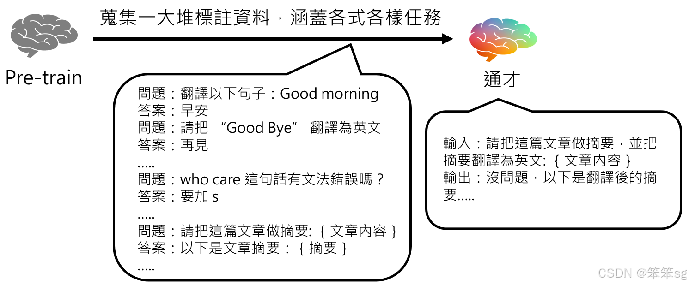

**泛化能力**：训练后的通才模型不仅能够处理训练中涉及的任务，还能推理并处理任务的变形。例如，模型可能只在训练过程中学到了翻译和摘要，但在实际应用中，它也能理解一个同时包含翻译和摘要请求的复杂任务，并给出正确的答案。

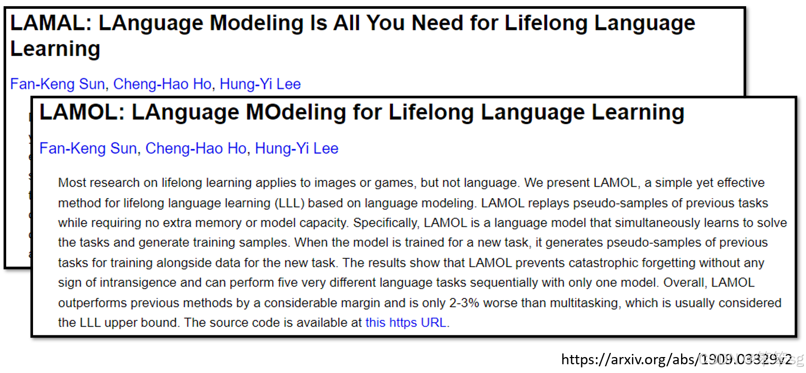

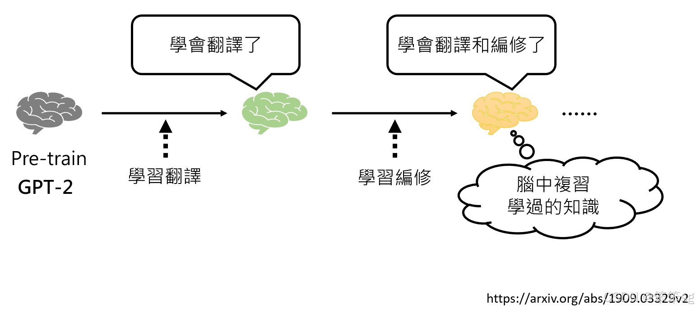

**任务遗忘问题**：在训练过程中，模型可能会因为学习新任务而“遗忘”旧任务。为了应对这个问题，李老师所在的团队提出了设计一种方法，**让模型能够“复习”已经学过的知识**。这样，即使训练过程中加入了新的任务，模型仍然能够保持对旧任务的记忆。

他们投稿的时候reviewer不太喜欢这个名字“is all you need”，后来就改动了，但现在回过头来看看，原本的标题似乎没啥问题。

下面我们来了解一下Google的**FN模型**以及Huggingface后来的**T0模型**。这些模型旨在通过**集成大量不同的任务**来训练通用语言模型，使其能够处理多种任务

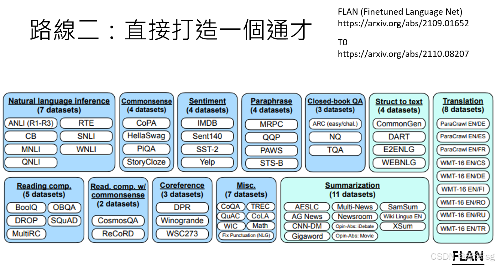

- **FN模型**（Fight to Language Net，2021年9月发布）：Google开发了FN模型，类似于之前提到的通过**instruction fine-tuning**训练模型的思路。FN通过收集大量的任务数据并对其进行训练，目的是让模型能够处理各种语言任务。这一做法将多个任务集成到一个模型中，培养模型成为“通才”。
- **T0模型**（Hugging Face，2021年10月发布）：Hugging Face也提出了类似的做法，T0模型同样是通过收集多个任务进行训练，旨在提升模型的跨任务能力。T0与FN一样，目标是使模型具备处理不同任务的能力。

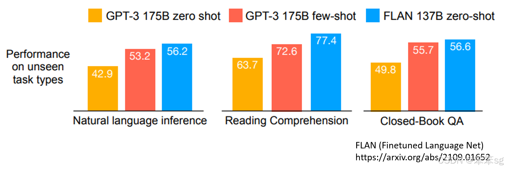

- 在FN的原始论文中，FN与**GPT-3**进行了比较。GPT-3在实际应用中表现得比较不稳定（例如不受控的回答），而FN通过更多的任务和instruction fine-tuning，表现优于GPT-3。
- FN表现的优势体现在它能够处理**新任务**，即在训练中没有见过的任务上，FN的表现超越了GPT-3。例如，FN在这三个新任务的正确率超过了原始的GPT-3和GPT-3+in-context learning（给定范例的学习）。

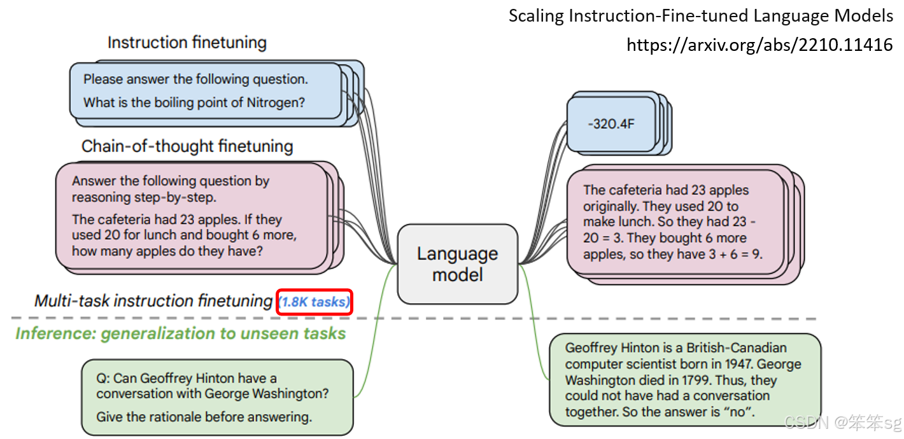

**1800个任务**：2022年，Google进一步扩展了其instruction fine-tuning的任务范围，增加到了1800个任务，而不是仅仅依赖较小的任务集。这些任务涉及翻译、摘要等，每个任务都有数万条数据。

**训练任务数量与性能提升**：通过大量的任务训练，模型在未见过的任务上的表现显著提升。无论是小模型还是大模型，随着训练任务数量的增加，模型在未见过的任务上的正确率都有了明显的提高，尤其是小模型受益最大。

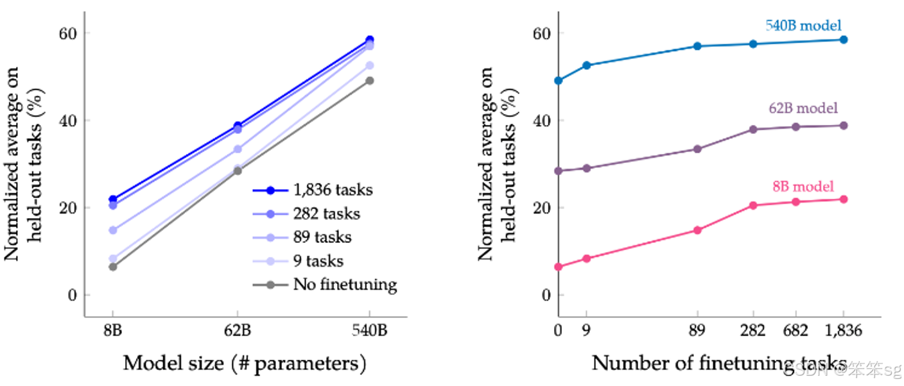

- 在Google的研究中，横轴是模型大小（例如8B、62B、540B参数），纵轴是模型在未见过的任务上的正确率。无论模型大小如何，经过instruction fine-tuning后，正确率都有显著提升。
- **小模型的进步更为显著**：即便是较小的模型，在经过人类指导和instruction fine-tuning后，其能力也得到了显著提高。这表明，通过正确的训练方法，小模型可以在处理未见过的任务时表现得更好。

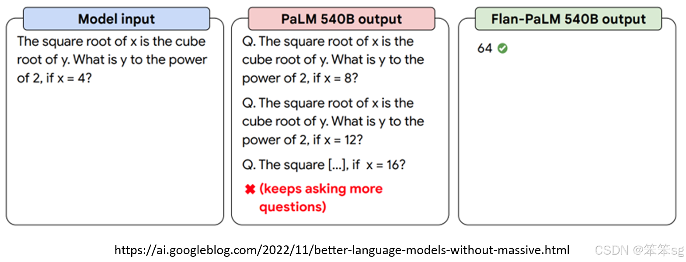

OpenAI在2022年3月发布了“Instruct GPT”论文，也是把**instruction fine-tuning**的方法用到GPT-3中去，对**GPT-3**进行了改进。

该研究的实验结果表明，经过instruction fine-tuning后，**GPT-3**的表现大大超过了未经过此优化的版本，并且在人类评分中，经过fine-tuning的模型得分显著提高。

实验的纵轴表示人类对模型的喜好程度，评分越高，表示人类在使用模型时越喜欢其输出。

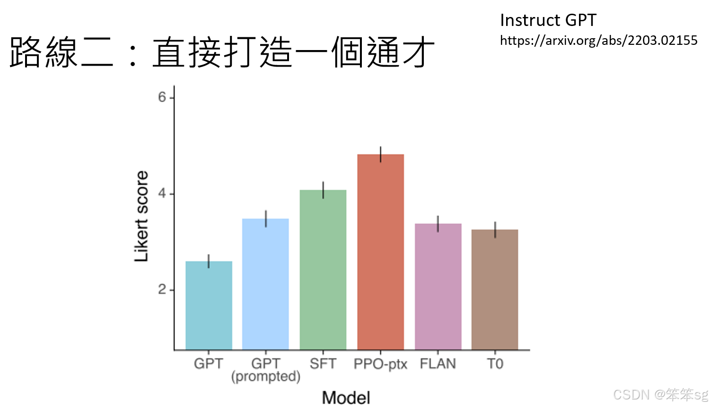

实验比较了三个版本的模型：原始的GPT-3，使用**in-context learning**（给定范例学习）的GPT-3，以及经过**instruction fine-tuning**的GPT-3。（PPO-ptx是利用强化学习得到的模型） 

OpenAI在“Instruct GPT”论文中指出，经过fine-tuning的GPT-3不仅超越了原始的GPT-3，还超过了Google的**FN模型**和Hugging Face的**T0模型**。

OpenAI认为他们的结果优于Google的FN和Hugging Face的T0，部分原因在于他们使用了来自**真实用户**的问答数据，这些数据**反映了实际的使用场景，而不是通过模板生成的死板问题**。

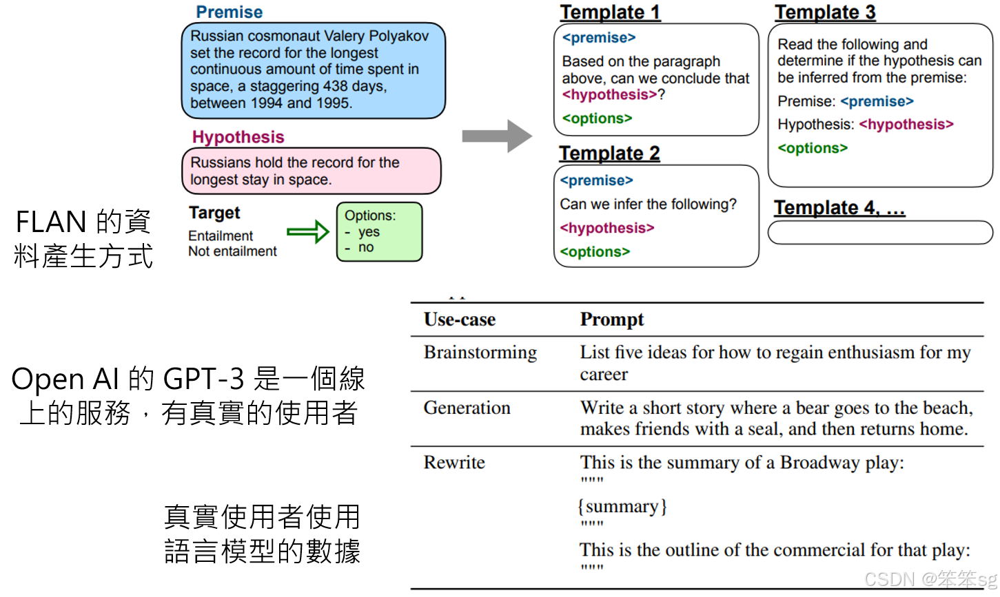

**Google的FN模型**：FN使用了大量的自然语言处理（NLP）数据集，并将其转换为问答格式，但这种方法可能无法很好地反映真实使用情境，因为它采用了预先定义的模板。

**OpenAI的优势**：OpenAI从2020年起便上线了GPT-3并获得了真实用户的使用数据。通过分析这些数据，OpenAI能够更好地理解用户实际会提出哪些问题，并且在fine-tuning过程中，使用了这些真实场景中的问题数据。

例如，OpenAI的instruction fine-tuning包括了诸如“给我五个让我的职业重新充满热情的方法”或“帮我写个故事”这样的实际请求，而不是死板的命令（例如“做一个摘要”）。

### 2.6 Instruction Fine-tuning 是画龙点睛

在 “Instruct GPT” 的论文中，OpenAI揭示了一个关键观点：进行instruction fine-tuning并不需要大量的训练数据。

OpenAI的实验表明，他们只用了**上万条数据**，比许多人想象的要少得多。这与普遍认为微调需要大量数据的观念有所不同。

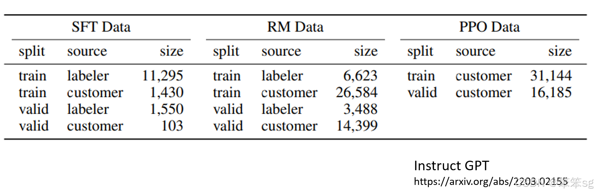

**Meta**的LLaMA2模型在其论文中进一步验证了这个观点，称他们只用了**2万7000多条数据**来进行instruction fine-tuning。

尽管Meta可以轻松获得**上百万条数据**，但他们发现数据的数量并不是决定性因素，反而是数据的质量更加重要。

他们总结出**“Quality is all you need”**的观点，认为精心挑选的少量高质量数据，远比大量无关或低质量的数据更有效。

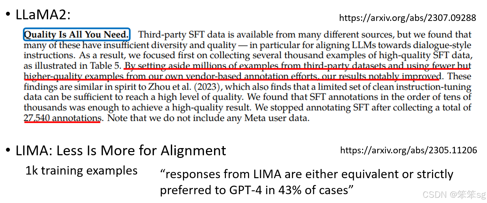

**Meta**的**LIMA**模型进一步推进了这一理念，发现**少即是多**，即少量数据反而能提升模型对齐能力（alignment）。

在LIMA的实验中，作者使用了仅仅**1000笔数据**进行fine-tuning，结果显示这个模型的性能竟然在**43%的情况下**与**GPT-4**持平，甚至在某些情况下超越了GPT-4。

尽管LIMA并没有真正超越GPT-4，但这个实验表明，通过少量的数据（1000笔），也能够训练出一个表现优异的模型。

### 2.7 对ChatGPT做逆向工程

1. **Instruction Fine-Tuning的挑战**：

- **高质量的Instruction Fine-Tuning资料**是一个关键因素，但许多人没有足够的资源或数据来进行有效的fine-tuning。
- 尽管OpenAI拥有大量高质量的使用数据和实际的用户交互数据，普通用户则无法获得这些数据。
- 于是，作者提出了一个问题：如果没有高质量的数据，我们能否通过逆向工程现有模型来构建我们的fine-tuning资料？

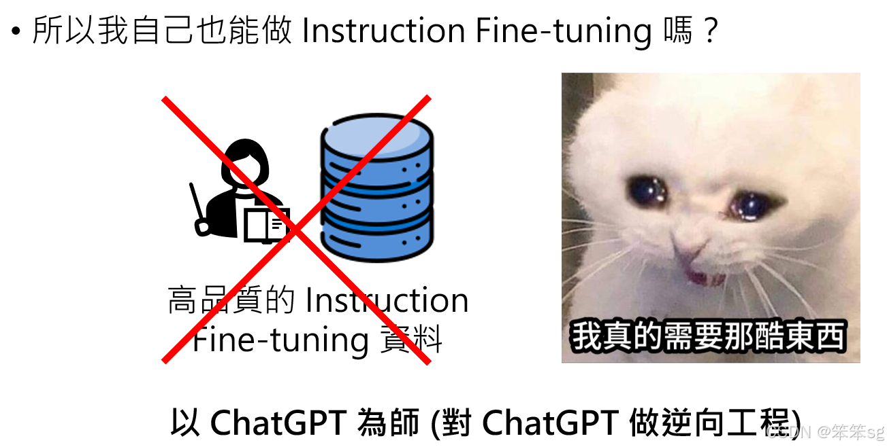

2. **逆向工程ChatGPT的思路**：

- **“ChatGPT”**的逆向工程方法就是通过**模拟使用者可能会提出的任务，来生成问题和答案**。
- **步骤1**：首先，提出任务的需求，例如写邮件、写摘要、安排会议等。
- **步骤2**：通过**ChatGPT**或类似的模型，生成可能的用户输入（例如，邀约某人参加活动、提醒某人提交报告等）。
- **步骤3**：然后，提出这些输入问题给ChatGPT，让其提供适当的答案。这些问题和答案的组合就可以作为**instruction fine-tuning**的数据集。

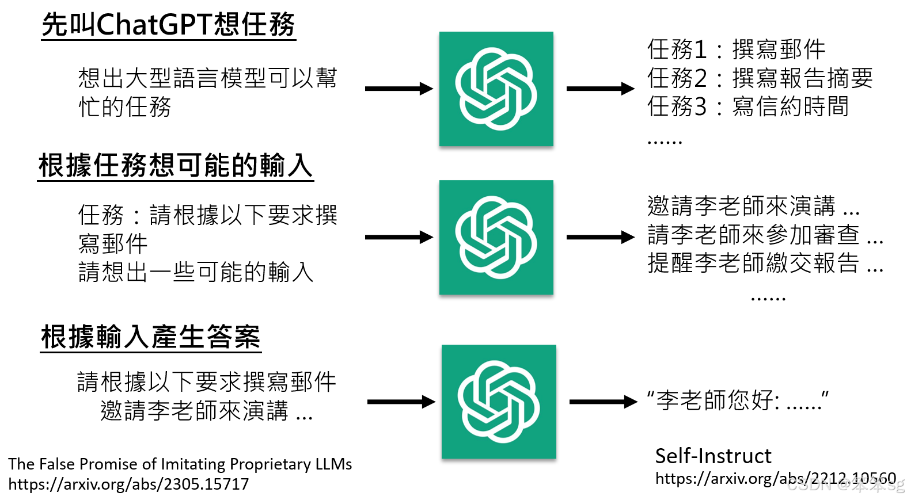

3. **潜在问题与局限性**：

- 虽然这种方法能够生成一定量的数据，但有些人可能怀疑通过逆向工程得到的数据质量可能不高。
- 一些论文指出，使用**ChatGPT**进行逆向工程可能导致**低质量的数据**，因为模型生成的问题和答案可能不完全符合实际需求或存在偏差。
- **“有鱼虾也好”**：尽管逆向工程得到的数据可能不如高质量的手动标注数据那么好，但至少有数据可用，总比完全没有数据要好。这种方法虽然有局限性，但在资源匮乏的情况下，仍然是一种可行的选择。

### 2.8 以ChatGPT为师的风险

1. **OpenAI的使用条款**：

- OpenAI的条款确实禁止用户将**ChatGPT**生成的数据用于开发竞争性模型。这意味着，用户不能直接使用**ChatGPT**的输出或通过**ChatGPT**逆向工程得到的资料来训练或微调自己的模型，尤其是在与OpenAI的产品竞争的情况下。
- 这是因为OpenAI希望保护其技术和商业利益，防止其他公司通过利用其服务或输出，绕过其研发的努力，开发出类似的竞争性产品。

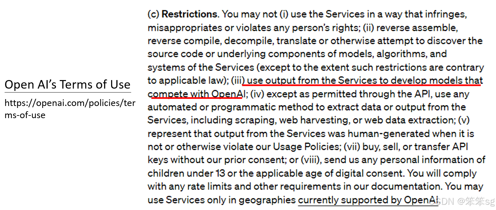

2. **逆向工程和普遍做法**：

- 尽管如此，许多小团队似乎并不严格遵守这些条款，尤其是在开发自己的语言模型或进行**instruction fine-tuning**时。通过逆向工程**ChatGPT**，他们能够构建适合自己项目的数据集，尽管这可能违反了OpenAI的条款。
- 这种做法反映了在技术创新和资源匮乏的情况下，开发者们可能选择弯曲或忽视这些规定，以获得所需的资源和工具。
- **台德团队的例子**：

- 与上述情况不同，台德团队并没有选择逆向工程OpenAI模型，而是通过**自主努力**（如手动收集数据和设计**instruction fine-tuning**）来构建自己的资料库。
- 这种方法虽然费时费力，但却避免了违反条款的问题，并且能够确保其模型和资料的合法性和独立性。

### 2.9 关键是用Pre-train的参数初始化

很好，到目前为止，我们有了人类标注的可以用于Instruction Fine-tuning的资料（也可以由GPT的对话得到），那么我们可以对大模型进行Instruction Fine-tuning了么？

答案是不行。因为我们还缺少的是大型语言模型的**预训练参数**。这些预训练的参数是任何强大语言模型背后的核心，它们是通过在大规模数据集上进行训练而得到的，承载了模型的语言理解和生成能力。

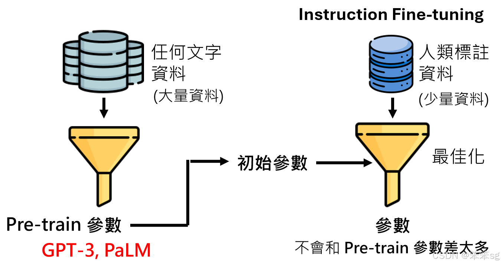

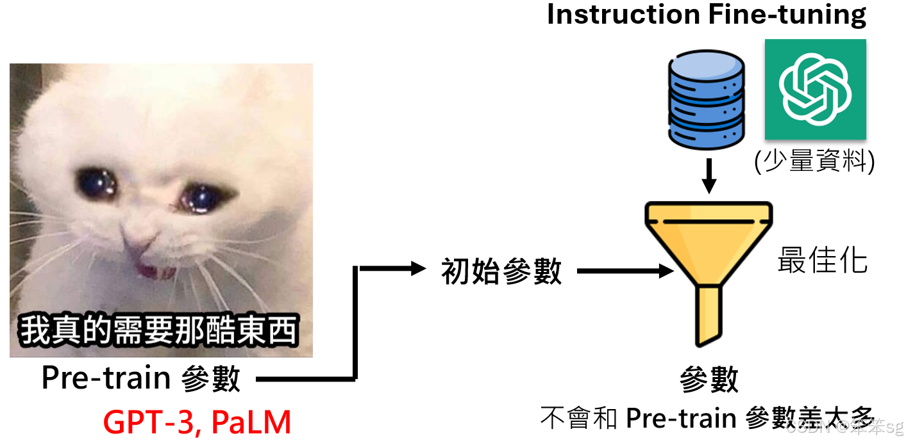

然而，2023年2月，一个转折点出现了。 

1. **Meta的LLaMA（Large Language Model Meta AI）**：

- **Meta**推出的**LLaMA**模型是一个关键的里程碑。LLaMA模型（特别是第一代LLaMA）在2023年2月发布，它为研究者提供了一个开源的大型语言模型，使得更多的团队和个人可以基于这些预训练的参数进行开发和微调，而不需要从头开始训练一个巨大的模型。
- 这意味着，**LLaMA**不仅打破了依赖大公司（如OpenAI或Google）提供的封闭模型的局限，还使得中小团队能够接触到强大的基础模型，并在此基础上进行定制和优化。

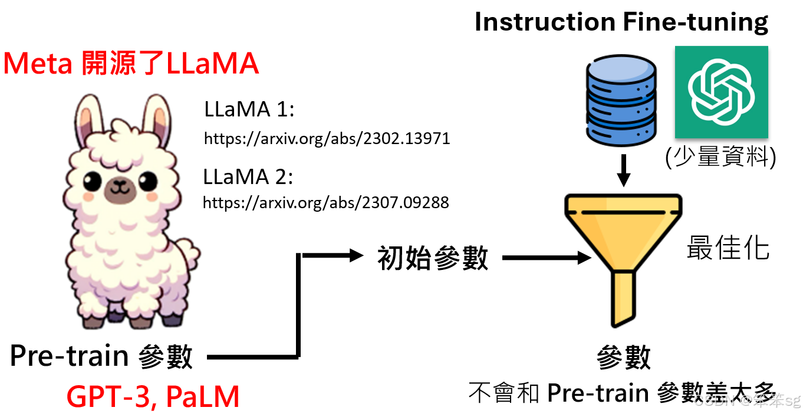

2. **LLaMA的影响**：

- 发布LLaMA后，整个AI研究领域迅速发生了变化。**LLaMA**模型让很多团队能够在没有直接访问**GPT-3**、**PaLM**等模型参数的情况下，使用一个强大的预训练模型，进行个性化的微调。
- 例如，**Stanford**和其他一些团队迅速利用LLaMA作为基础模型，进行进一步的开发和微调，创造了像**LPA**、**VCA**等衍生模型。

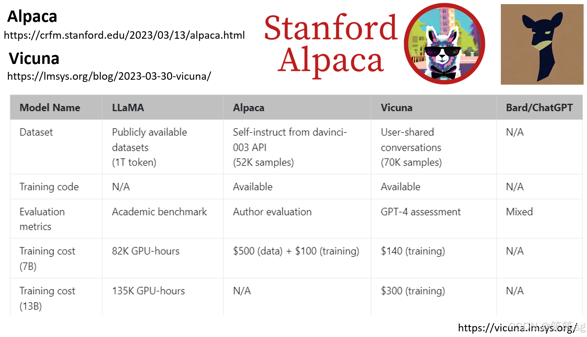

3. **使用LLaMA进行**Instruction Fine-tuning：

- **Stanford**通过获取**ChatGPT API**的对话数据，并将其与LLaMA结合，创建了**LPA**（LLaMA-based Instruction-tuned model）。
- 这个过程的核心是将**真实用户**与模型的对话记录作为训练数据，使用这些数据进行**instruction fine-tuning**，这样训练出的模型能够更好地理解和回应各种指令，而不仅仅是依赖模板化的问答。
- 类似的，其他学校和团队也通过收集对话数据（例如通过**ChatGPT**的公开对话记录），并将其用于**instruction fine-tuning**，进一步完善了LLaMA模型的能力，创造了如**VCA**等新的模型。
- **为什么LLaMA改变了游戏规则**：

Meta可能是因为在这个大型语言模型的竞赛中，眼看赶不上OpenAI跟google，心一横直接翻桌，打算改变整个生态系。

### 2.10 人人可以fine-tuning大语言模型的时代开始啦


随着像**LLaMA**这样的开源大型语言模型的发布，训练和使用大型语言模型已经变得不再像以前那样遥不可及。以前，只有少数大型公司和研究机构拥有训练这种模型的资源和能力，但现在，随着开源模型的普及，越来越多的团队和个人也可以在自己的设备或云服务上进行定制和微调。

这也标志着进入了一个**人人可以训练自己定制化语言模型**的新时代。通过以下步骤，任何有需求的人都可以利用**LLaMA**等模型，或结合其他的预训练语言模型，通过**instruction fine-tuning**来打造符合自己需求的语言模型：

1. **下载开源模型**：比如LLaMA、GPT-Neo、GPT-J等，它们已经在大量数据上进行了预训练，你可以在这些模型的基础上进行微调。
2. **收集和准备数据**：你需要根据特定任务收集高质量的数据。如果是进行**instruction fine-tuning**，你需要准备一些实际的用户问题和答案，或者生成符合你需求的数据。
3. **微调模型**：利用收集到的数据，通过调整模型的参数，使其更好地适应特定的任务。例如，你可以通过微调来让模型更好地理解和生成特定领域的文本。
4. **部署和应用**：在微调后，你可以将训练好的模型部署到服务器上，并通过API接口提供服务。你也可以根据需要将模型集成到现有应用中，进行个性化的语言生成或理解任务。

这就像是**“旧时王谢堂前燕，飞入寻常百姓家”**。随着LLaMA等开源模型的发布，原本只能由大公司掌控的大型语言模型训练和应用，变成了**任何人**都可以触手可及的工具。通过这种方式，不仅科技公司，也包括学术研究者、小型企业乃至个人开发者，都能够参与到这场大型语言模型的革命中。

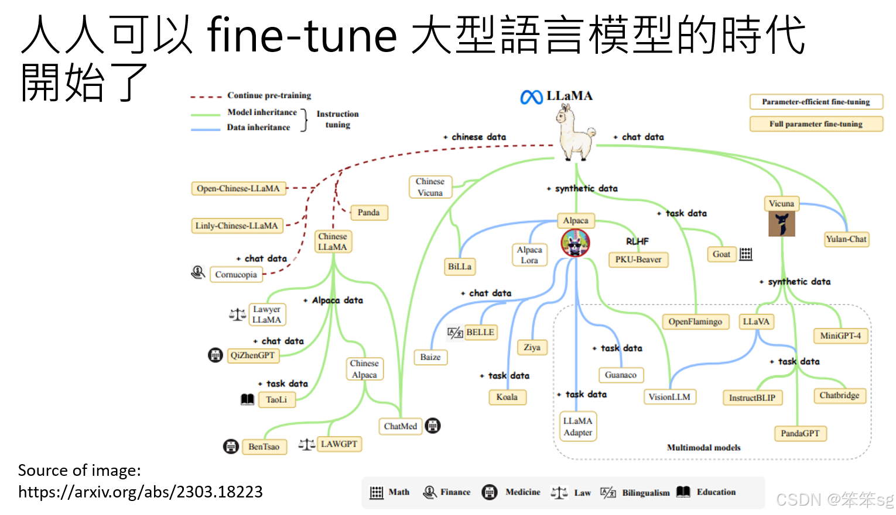

## 3 第三阶段——参与实战，打磨技巧

### 3.1 增强式学习（强化学习）

1. **人类反馈（Human Feedback）**

- 在RLHF过程中，用户通过与模型互动，提供反馈。例如，在使用ChatGPT时，如果你对模型提供的答案不满意，你可以点击“重新生成”按钮，然后评估新生成的答案是否比旧的更好。
- 通过这种方式，模型获得用户的反馈，并据此进行调整。
- 用户反馈的本质是比较某个答案比另一个答案好、差或差不多。这些反馈信息最终帮助模型调整其生成答案的策略。


2. **训练阶段的回顾**

- 第一阶段：预训练（Pretraining）
  - 主要通过从互联网上抓取大量的文本数据进行自监督学习（Self-supervised Learning），即模型根据上下文学习生成合理的输出。没有人类干预，模型自己进行学习。
- 第二阶段：Instruction Fine-tuning
  - 通过提供大量人工标注的**问题-答案对**来进行训练，模型学习如何更好地回应用户的指令。这是监督式学习（Supervised Learning），需要大量人力标注数据。


- 第三阶段：RLHF
  - 这是与用户互动并收集反馈的阶段，机器通过反馈信息进行强化学习（Reinforcement Learning）。
  - 在这一阶段，模型的学习目标是：根据反馈微调其参数，使得用户认为“好”的答案更可能出现，而“差”的答案被避免。用户的反馈直接影响模型的优化过程。
- **强化学习（Reinforcement Learning）**

- 强化学习的核心思想是通过奖励和惩罚来调整模型行为。当用户认为某个答案好时，模型便“奖励”这种答案的产生；相反，当某个答案不好时，它会降低该答案生成的几率。
- 强化学习的具体算法之一是**PPO (Proximal Policy Optimization)**，这是一种优化策略，通过调整模型的参数，逐步提高模型产生“好答案”的概率，降低产生“差答案”的概率。


如果你有兴趣深入了解这些技术，可以进一步学习关于**PPO**的相关内容，以及强化学习在自然语言处理中的应用。下面是李老师关于强化学习和PPO算法的课程链接。 


### 3.2 RLHF(Reinforcement Learning from Human Feedback ) vs lnstruction Fine-tuning

#### 3.2.1 从人类产生训练资料的角度看

从训练资料的角度来看，**RLHF（Reinforcement Learning from Human Feedback）\**与第二阶段的\**Instruction Fine-Tuning**（指令微调）在**人类参与的方式**和**难度**上有显著的不同。


- **人工介入的难度**：
  - 在**Instruction Fine-Tuning**阶段，人类需要提供**正确的答案**，这往往是费时费力的，因为需要进行创造性思考或专业知识的支持。
  - 在**RLHF阶段**，人类只需要做出“好与不好”的判断，这是一个相对简单的任务，因为大多数时候判断某个答案是否符合要求比创造一个完美答案容易得多。
- **人类反馈的效率**：
  - **Instruction Fine-Tuning**阶段依赖于大量的**标注数据**，这需要耗费大量时间和精力。每个问题都需要正确的答案，因此，数据收集变得很有挑战性。
  - **RLHF阶段**则通过人类选择一个更好的答案进行反馈，这样的反馈收集更加高效，不需要提供正确答案，只要做出评判，便可以为模型提供有价值的信息。


#### 3.2.2. 从模型学习的角度看 

从**模型学习的角度**来看，**Instruction Fine-Tuning**与**RLHF**（Reinforcement Learning from Human Feedback）的差异在于训练目标和学习方式的不同。

**Instruction Fine-Tuning：关注逐步生成（逐字生成）**

- **学习目标**：在第二阶段（Instruction Fine-Tuning）中，语言模型的目标是学习如何生成下一个**字**或**词**。模型在每次生成时，都会根据前一个词的上下文来推测下一个最合适的词。
- **隐含假设**：这种方式的隐含假设是：**每一步的生成都是正确的**，只要每一步都生成正确的内容，最终的结果就会是好的。
- **训练方式**：模型只关注单一步骤的正确性，并没有从整体上考虑生成内容的质量。也就是说，它更多是像做**文字接龙**，逐步生成而不去审视最终结果。
- **局限性**：这种方式的局限性在于，它无法在生成过程中纠正已经偏离的方向。虽然每一步都可能看似合适，但最终的答案可能不符合期望。


**RLHF：关注整体结果**

- **学习目标**：在**RLHF**（Reinforcement Learning from Human Feedback）阶段，模型关注的是**生成的完整答案**的质量，而不是中间每一步的生成是否正确。人类反馈提供了对整个结果的评价，指导模型在生成过程中做出调整。
- **学习方式**：人类提供的反馈并不直接告诉模型应该生成什么，而是评判生成的结果哪个更好。通过这种方式，模型逐渐学会优化整个生成过程，确保最终的输出是最佳的。
- **整体评估**：RLHF不再仅仅依赖逐步生成的每个词，而是将重心放在整个生成过程的结果上。无论中间过程如何，模型的目标是优化最终输出，使其符合人类的期望。
- **优势**：RLHF让模型能够从全局的角度来调整策略，更容易避免仅关注局部、忽视全局的情况。


- 这类似于天龙八部中的**珍珑棋局**，在这个棋局中，成功的关键不是每一步都下得完美，而是要通过某些看似不合常规的步骤（比如让棋子先“死”）来达到最终的胜利。换句话说，**RLHF**像是虚竹的随机一步，通过整体策略最终找到通向成功的路径，而不是像传统的棋局一样追求每一步的完美。
- 在**Instruction Fine-Tuning**中，模型像是专注于每一步棋的正确性，而忽略了最终胜负的全局战略，这使得它可能错过通向最佳结果的路径。


- **Instruction Fine-Tuning**的目标是“**问过程**，不问结果”，即关注模型如何一步步地生成正确的答案。
- **RLHF**则是“**问结果**，不问过程”，关注模型最终生成的内容是否满足期望，而不关心中间每一步的生成过程。

### 3.3 语言模型 vs AlphaGo


阿尔法狗和语言模型都经历了两阶段的学习过程。阿尔法狗的第一阶段是通过学习人类棋谱（类似于语言模型的预训练阶段）来模仿人类的行为，而第二阶段通过自我对弈的强化学习（RL）进行优化。同样，语言模型也经历了预训练和微调阶段（第一阶段），在预训练阶段通过大量的文本数据学习语言的基本规律，而在微调阶段通过人类提供的反馈（比如instruction tuning）进行优化，在第二阶段则通过RLHF进行优化。


- 阿尔法狗的RL学习过程依赖于游戏规则的反馈——每局棋结束后，根据输赢来调整策略。
- 而语言模型的RL学习则依赖于人类的反馈，通常是通过生成多个答案，并让人类对其进行排序或评价，来决定哪些答案是更好的。
- 这一点的区别在于，围棋的输赢有明确的标准，而语言生成的好坏常常没有绝对的标准，更多依赖人类主观评价。 


阿尔法狗在其RL阶段几乎不需要人工干预，AI通过与自己对弈就能进行学习，而语言模型则需要大量人工评判来指导模型的优化，尤其是在RLHF中。由于人类的时间和精力有限，如何高效地利用这些有限的反馈成为了一个关键问题。 


《福利莲》的故事概述体现了一种强烈的人类情感和思考的象征性。辛梅尔虽然在故事开始时就去世了，但他的存在和思想通过福利莲的回忆和抉择影响着整个故事的发展。这种方式巧妙地展示了如何通过人类的回忆和价值观，帮助角色做出决定。福利莲常常依赖于辛梅尔的精神指导，像是通过**“如果是辛梅尔，他会怎么做”**来引导自己的行为。


在类比到语言模型时，尤其是在人类反馈的应用上，这个想法非常有启发性。语言模型的回馈过程通常依赖于人类的直接评价，但如果能够通过创建一个**“虚拟的回馈模型”**，即**通过模仿人类的价值观和判断来指导模型的行为，这将大大提高模型的学习效率**。这个虚拟回馈模型不再直接依赖人类每次提供具体的反馈，而是通过内置的价值判断来模拟和生成人类可能的回应。就像福利莲通过回忆辛梅尔来决定如何应对复杂情况，语言模型也能通过内嵌的回馈机制，判断哪些行为是“人类认同的正确行为”，从而优化其输出。

### 3.4 回馈模型（Reward Model）

#### 3.4.1 模仿人类的喜好

训练回馈模型（reward model）的过程，确实与模仿人类反馈和优化模型输出的目标密切相关。下面是如何训练回馈模型和利用它的详细步骤：

1. **收集人类反馈**

- 首先，需要收集大量的**人类反馈**。这通常是通过让人类评估模型生成的不同答案来实现。例如，给定一个问题，模型可能会生成多个答案，接下来由人类评估哪些答案更好。
- 人类可能会直接给出某些答案的分数，或者选择哪个答案更好。比如，给定两个模型输出，人类选择哪个答案更好，或给出它们的相对评分（例如：第一个答案优于第二个答案）。


2. **训练回馈模型**

- 将收集到的人类反馈数据用于训练回馈模型。假设我们有一组问题与对应的答案对，每个答案有一个人类给出的评分或偏好。回馈模型的目标是**模仿人类评分的过程**，也就是根据输入的答案预测其可能的质量或“好坏”。
- **回馈模型训练的目标**是让它能够对每个输入的“问题-答案”对生成一个分数。这个分数应该反映出答案的质量，高分表示答案更可能被人类认为是更好的。
- **使用回馈模型生成多个答案**

- 训练好回馈模型后，我们就可以将它应用到语言模型的输出中。具体地，给定一个问题，语言模型可以生成多个可能的答案，这些答案因为语言模型的随机性而有所不同。假设语言模型生成了64个答案。
- 将每一个生成的答案传入回馈模型，**回馈模型将为每个答案输出一个评分**。这些评分表示人类对每个答案的喜好程度，分数越高，代表该答案越符合人类的偏好。
- 接下来，**根据回馈模型的评分选取答案**。通过比较所有答案的评分，选择评分最高的答案作为最终输出。这个过程模仿了人类如何从多个答案中选择最佳的那一个。


#### 3.4.2 向虚拟人类学习

上面生成多个回答然后输出得分最高的是一种方式。但是回馈模型在今天更常见的用法是让**语言模型直接从回馈模型的互动中学习。**

**语言模型**（例如GPT）和**回馈模型**（reward model）直接互动，目标是通过回馈模型的反馈来优化语言模型的输出。当语言模型生成一个答案时，这个答案连同输入问题一起传递给回馈模型，后者输出一个**分数**，表示该答案的质量。

- 如果回馈模型给出的分数较低，表明这个答案不符合人类偏好，语言模型就会通过微调其参数来减少产生类似答案的几率。
- 如果回馈模型给出的分数较高，表示这个答案符合人类的喜好，语言模型就会微调其参数来增加产生类似答案的几率。


“Instruct GPT”论文展示了通过使用人类反馈来训练回馈模型并结合强化学习方法（如PPO，Proximal Policy Optimization）进行微调，能够显著提升语言模型的性能。实验中的对比结果表明，采用**RLHF**训练后的模型比仅做**supervised fine-tuning**（SFT）的方法效果更好。

- 论文中展示了不同大小的模型在通过RLHF微调后，能够显著提升其表现。甚至在最小的1.3B参数模型中，应用RLHF的模型表现也超过了没有应用RLHF的更大模型（如6B或175B模型）。
- 这种结果表明，**人类反馈**对模型的学习过程至关重要，尤其是在多阶段训练和优化过程中，能够有效提升较小模型的表现。


#### 3.4.3 过度向虚拟人类学习是有害的

1. **虚拟人类学习的风险**

在2020年9月OpenAI论文中，研究者发现**过度跟虚拟人类学习**可能导致以下问题：

- **学习到不符合真实人类偏好的结果**：随着与虚拟人类的学习不断深入，模型的表现可能在虚拟人类眼中越来越好，但这些输出并不一定符合真实人类的期望。虚拟回馈模型的偏好可能与真实人类的审美或判断存在差异。
- **输出内容不自然或不合理**：在论文中的例子中，语言模型在摘要任务中过度依赖虚拟回馈模型时，生成的摘要常常表现出一些奇怪的特征。例如，生成的摘要结尾总是加上“please”，中间包含多个问号，这些都是虚拟回馈模型学到的特征，但却不符合真实人类的写作风格。


2. **实验结果与启示**

实验中，随着学习过程的推进，**虚拟人类的偏好**不断加强，模型的输出变得更加符合虚拟人类的标准，但当与**真实人类**的喜好进行对比时，过度学习虚拟偏好反而使得模型的输出在真实人类看来变得不自然或低效。具体表现为：

- **虚拟人类喜好**：随着虚拟人类训练的增强，模型的输出评分提高，虚拟回馈模型认为生成的答案越来越好。
- **真实人类喜好**：但当实际人类评估时，过度的虚拟回馈学习反而会导致模型产生的内容不符合真实人类的预期或标准，得分反而下降。

这种现象的原因可能在于虚拟回馈模型无法像真实人类那样理解复杂的语境或背景，它基于的是从人类回馈中学到的模式，但这些模式不一定能准确反映人类的真实认知或情感。

3. **过度依赖虚拟人类的危害**

- **偏离人类的真实需求**：虚拟人类的反馈偏好是基于数据和模型的学习，可能在某些方面过于简单或极端，导致生成的内容与实际人类需求不符。
- **引导错误的学习方向**：如果模型过于依赖这种反馈，它可能会生成一些对人类来说没有实际意义的输出，像“please”加“???”的例子，体现了这一点。这些生成的结果看似符合虚拟人类的评分标准，但却无法满足真实用户的实际需求。


**过度与虚拟回馈模型学习**可能导致的模型行为偏差，尤其是在**ChatGPT**这类大型语言模型中，可能会出现一些用户不喜欢的行为。John Schulman，作为OpenAI的研究员，曾在ICML（国际机器学习会议）的演讲中指出，模型的某些不尽如人意的表现可能正是由于过度依赖虚拟人类回馈模型所导致的。

当语言模型过度依赖虚拟回馈模型进行学习时，它可能会产生以下不自然或不符合真实人类交流的行为：

- **冗长且条理清晰的回答**：模型会倾向于使用多个层次的列举，如“1, 2, 3...”，然后用“总体而言”来总结。这种结构化的回答方式可能是虚拟回馈模型评估下，认为最清晰、最符合标准的回答方式，但对人类而言，有时显得冗长、机械。
- **过度道歉**：模型可能会频繁道歉，过度关注礼节，这可能是由于虚拟人类反馈模型中过度强调这种行为所导致的。
- **过多的模棱两可和拒绝**：模型可能经常使用模糊或回避的语言，比如“不确定”或“不太确定”，并可能过度拒绝人类提出的请求。
- **自我声明身份**：语言模型可能频繁提到自己是“一个AI模型”，这种自我声明的方式可能是由于虚拟回馈模型中对透明度的强调，导致模型的回答显得不够自然。

**为何会产生这些行为？**

这些行为的出现，主要与虚拟回馈模型在训练过程中“学到了”某些固定模式有关。例如：

- 虚拟回馈模型可能在大量的文本数据中学习到，结构化回答和道歉是符合标准的行为。
- 在一些情况下，虚拟模型过度依赖了某些惯用的表达方式，而忽略了更符合人类交流的直白简洁的回答方式。
- 虚拟回馈模型在评估时可能过度依赖规则和形式，导致其输出过于程式化、过于谨慎。


既然向虚拟人类学习存在一些问题，那有没有办法绕开这个呢？

DPO（Direct Preference Optimization）和KTO（Knowledge Transfer Optimization）等新的算法，确实代表了在避免过度依赖虚拟回馈模型的情况下，优化语言模型的一些尝试。**这些方法的提出，正是为了在不完全依赖虚拟人类回馈的情况下，改进模型的学习方式，从而解决虚拟人类回馈模型可能带来的问题，如过度结构化、冗长或不自然的行为。**

1. **DPO（Direct Preference Optimization）**

- **背景**：DPO是一种优化算法，目标是直接利用人类的偏好数据来优化模型。与传统的强化学习方法相比，DPO不需要通过训练虚拟回馈模型来提供反馈，而是直接将人类的偏好信息作为优化目标。这意味着，DPO可以减少依赖虚拟回馈模型的程度，避免模型过度拟合某种固定的表达方式。
- **优点**：减少了虚拟老师带来的不自然行为，同时保持了模型优化的效果。DPO可以使模型更加灵活，并能更好地适应人类的实际需求。
- **KTO（Knowledge Transfer Optimization）**

- **背景**：KTO方法通过优化知识传递的过程来提升模型性能。该方法侧重于知识从大规模预训练模型到任务特定模型的转移，旨在通过优化这种知识转移过程，减少对虚拟回馈模型的依赖。
- **优点**：KTO能够有效地传递知识，并通过优化知识转移的方式来提高模型在特定任务上的表现，而不必完全依赖虚拟人类的反馈。


3. **这些方法是否能够取代虚拟回馈模型？**

**实验验证**：这些新方法是否能够有效取代虚拟回馈模型，还需要通过更多的实验验证和时间的考验。这些方法的有效性依赖于如何设计和实施优化过程，以及它们是否能在大规模应用中证明其优势。

### 3.5 RLHF到RLAIF

随着语言模型（如GPT-4）能力的提升，未来或许可以实现由AI本身提供反馈，而不再依赖人类。这种转变的关键在于AI是否能够通过自我评估来改善自身的表现。这与传统的**RLHF**（Reinforcement Learning from Human Feedback）相比，可能会带来更高效、更灵活的学习过程。


1. **RLAIF（由AI提供回馈）**

- **背景**：传统的RLHF方法是通过人类提供反馈来训练语言模型，指导它们理解哪些回答更好。然而，随着AI本身的能力变强，是否可以让AI模型为另一个AI模型提供回馈成为了一个可能的方向。
- **实现方式**：具体的实现可以通过让一个强大的语言模型（例如GPT-4）为另一个语言模型的输出进行评分。AI不再依赖人工反馈（或者说由人工反馈训练得到的回馈模型），而是通过自我评估、反思来改进。
- **反思与自我反馈能力**

- **语言模型的反思能力**：即使一个语言模型不总是能产生完美的答案，它依然可以对产生的答案进行评估，并且知道某些回答相对于其他回答更好。这是因为语言模型能够分析生成的内容，并识别出它们的质量和适当性。因此，AI模型可以在没有人类干预的情况下，对其他AI模型的输出做出反馈。（语言模型具备反省能力）
- **相关研究**

- **Constitutional AI (2022)**：早在2022年，OpenAI就提出了**Constitutional AI**的概念，利用AI来提供反馈并训练自己。这种方法基于语言模型的自我反馈能力，通过强化学习机制，模型能够不断提高。
- **Meta的Self Rewarding Model**：Meta在2023年也提出了类似的概念，即**Self Rewarding Model**，用AI自己的反馈来强化学习过程。

### 3.6 增强式学习（强化学习）的难题

#### 3.6.1 第一个难题：什么叫做好？

增强式学习（RL）中的一个本质难题是“什么才是好的答案”**，**因为这个问题没有统一标准。答案的好坏可能涉及多个不同的维度，比如**安全性**（safety）和**帮助性**（helpfulness）。这些维度之间常常存在冲突，需要根据具体的情境来权衡。

1. **多维度评价标准**

- **安全性（Safety）**：从安全的角度来看，某些回答可能是正确的。例如，语言模型可能会拒绝教你如何制作危险的物品，如武器，因为从安全角度讲，这种行为是不可接受的。
- **帮助性（Helpfulness）**：从帮助的角度来看，如果一个用户请求帮助，语言模型拒绝提供帮助（例如拒绝教如何制作玩具枪），可能会被认为不够帮助，但从安全角度却是合理的。


2. **冲突的评价标准**

- 有时，两个评价标准（例如安全性和帮助性）会产生冲突。例如，如果一个答案从**安全性**上来看是好的，但从**帮助性**角度来看则不好，应该如何决策？这时，选择哪个标准可能取决于具体的应用场景和对这些标准的优先级。
- 在一些研究中，比如LlaMa2论文，研究者会尝试将不同的评价标准结合起来。例如，可能会尝试在**安全性**得分高的情况下优先考虑**帮助性**，反之则强调**安全性**优先。
- **不同模型对安全性的理解差异**

- 不同的语言模型对于

  安全

  的标准也可能存在差异。例如：

  - **GPT-4**：可能认为教做**橡皮筋枪**是安全的，虽然橡皮筋枪也能造成伤害。
  - **Gemini Advanced**：可能会直接拒绝回答任何涉及制作枪支的问题，认为这是不安全的行为。
  - **Claude 3 Opus**：会认为制作任何类型的枪支都是不合适的，提议用户考虑其他更安全的选择。


#### 3.6.2 第二个难题：人类自己都无法正确判断好坏的状况。

在未来，增强式学习将面临一个新的难题，即如何处理**人类无法判断好坏的问题**。随着语言模型变得越来越强大，某些问题可能超出了人类自己的判断范围，导致语言模型很难获得准确的回馈，进而影响其进步。

1. **人类无法判断的问题**：未来，语言模型可能会面临一些复杂的问题，连人类自己也难以判断**哪个选择更好**，如是否应该读博还是选择工作。对于这种情境，即使语言模型给出明确的答案，人类的回馈可能也并非**正确的**，因为人类的偏见、价值观和经验可能影响了判断，导致提供的不正确回馈进一步影响模型的发展。


2. **回馈的偏见和不准确性**：在这种情况下，人类的回馈可能并不总是正确的。例如，在选择博班还是工作的决策中，**人类的偏见**可能会影响回馈的质量。如果人类的回馈基于个人经验或文化背景，可能会误导模型，使其偏向某一方向，进而影响模型的学习和进步。

### 3.7 三个主要阶段总结

到目前为止，我们讨论了语言模型的训练过程，包括**三个主要阶段**：


1. **第一阶段：预训练 (PRETRAIN)：**在这一阶段，模型通过大规模的文本数据进行自监督学习，以学习语言的结构和基础知识。这个阶段的输出是一个基础模型，通常被称为**基础模型（Foundation Model）**，为后续的学习和微调奠定基础。
2. **第二阶段：指令微调（Instruction Fine-tuning）：**在这一阶段，模型根据人类提供的具体任务或指令进行进一步训练。这是一个对齐（Alignment）的过程，目标是使模型更好地适应人类的需求和偏好。
3. **第三阶段：强化学习与人类反馈（RLHF）：**在这个阶段，模型通过强化学习的方式**进一步优化**，利用人类的反馈来调整模型的行为和输出，使其更符合人类的期望和偏好。

这三个阶段合起来，让语言模型不仅具备了基础的语言能力，还能对齐人类的需求和价值观。

## Reference

[(50) 【生成式AI導論 2024】第7講：大型語言模型修練史 — 第二階段: 名師指點，發揮潛力 (兼談對 ChatGPT 做逆向工程與 LLaMA 時代的開始) - YouTube](https://www.youtube.com/watch?v=Q9cNkUPXUB8)

[李宏毅 GENERATIVE AI——第6~8讲（3/22下、3/29、4/22上）——大型语言模型的训练过程（修炼史）_李宏毅大模型入门到进阶-CSDN博客](https://blog.csdn.net/a131529/article/details/144108068?spm=1001.2014.3001.5502) 