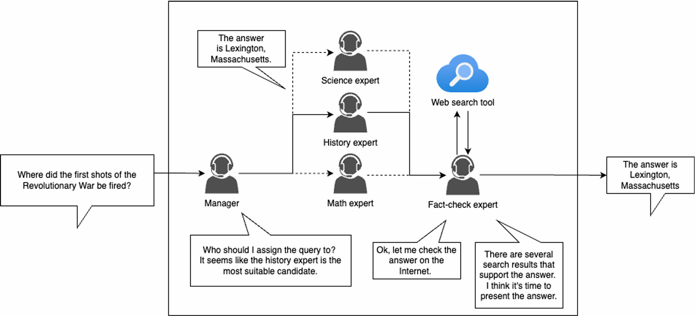

# Retrieval Augmented Generation with Agentic System

## Task Overview

### RAG 

RAG(Retrieval Augmented Generation) 检索增强生成

A method that allows LLMs to answer the queries with external knowledge.

* 将问题丢到检索系统或者知识库得到相关信息
* 将问题和检索的信息一起放到LLM中，让回答可以使用额外的信息

#### Why RAG

Knowledge cutoff: LLM 不能预知未来，只能获得训练时间发生之前的信息

Reducing the cost of training: fine-tune需要花销，RAG不需要训练

Improving the reliability of generated answers: LLM本质是文字接龙，会产生胡说八道（hallucinations）的情况，有参考资料之后不太会乱讲

### Agentic System

An agentic System is a framework in which LLMs act as individuals and collaborate to complete complex tasks.

正常的LLM就是跟人类一问一答，需要人类来告诉他下一步需要做什么，但是Agentic System可以让LLM门相互合作，一个LLM来帮助另外一个LLM，不完全需要人类的指导。

 