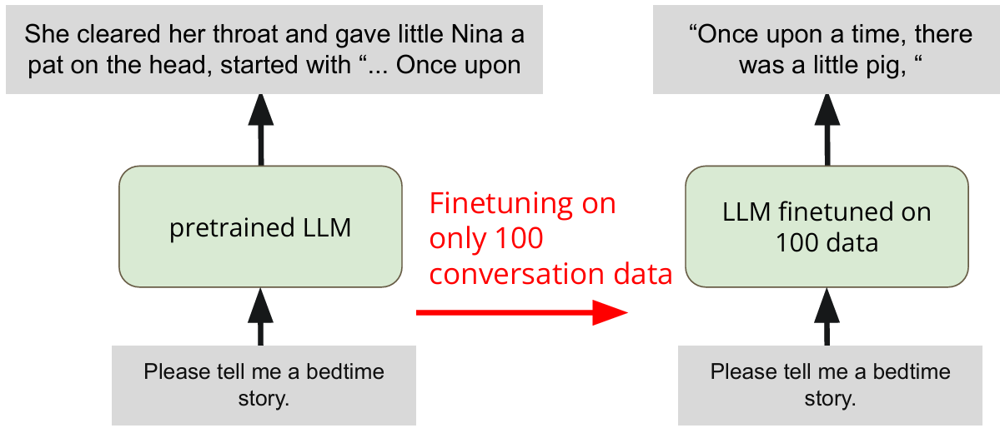
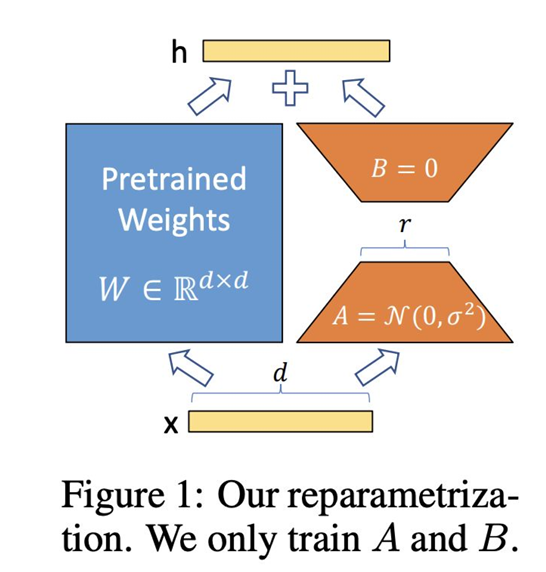

# Finetun is Powerful

> **用 100 条 Alpaca 数据微调 LLaMA-2-7B，使其在 Evol-Instruct 测试集上获得更高的 GPT-4o-mini 评分。**



###  任务拆解

| 模块     | 目标                                      | 关键技术                                                     |
| -------- | ----------------------------------------- | ------------------------------------------------------------ |
| **数据** | 从 52k Alpaca 数据中选出**最好的 100 条** | 排序、过滤、加权打分、可视化                                 |
| **训练** | 用 LoRA 做**参数高效微调**                | LoRA rank/alpha、epoch、lr、curriculum learning              |
| **解码** | 生成更高质量的回答                        | temperature、top-k、top-p、max_length                        |
| **评估** | 在 Evol-Instruct 上拿高分                 | GPT-4o-mini 自动评分（helpful、relevant、accurate、detailed） |

---

### 流程

#### 1️⃣ 数据精炼（Filter & Refine）
- **目标**：挑出**最有价值的 100 条**对话。
- **方法**：
  - 先按**对话长度**（question + answer 总词数）排序。
  - 再按**原始 score**（如果有）加权。
  - 可视化 52k 条数据的 length-vs-score 散点图，人工选拐点。
  - 进阶：用论文《Long Is More for Alignment》里的指标（如回答长度、指令复杂度）再筛一遍。

#### 2️⃣ 训练策略（Curriculum Learning）
- **目标**：让模型**先易后难**地学，避免过拟合。
- **做法**：
  - 把 100 条数据按**长度或复杂度**分成 3 档：Easy / Medium / Hard。
  - **分阶段训练**：
    1. 先用 Easy 数据训 1 个 epoch；
    2. 再加入 Medium 数据继续训；
    3. 最后加入 Hard 数据收尾。
  - 每阶段都保存 LoRA 权重，可回滚。

#### 3️⃣ 超参调优（Hyper-parameter Tuning）
| 类别     | 关键参数           | 经验起点         | 调参方向                     |
| -------- | ------------------ | ---------------- | ---------------------------- |
| **LoRA** | rank, alpha        | rank=8, alpha=32 | rank↑→表达能力↑→过拟合风险↑  |
| **训练** | epoch, lr          | 3 epoch, 2e-4    | epoch↑→过拟合；lr↑→震荡      |
| **解码** | temperature, top-p | 0.7~1.0, 0.9     | 温度高→多样性↑；top-p↓→保守↑ |

---

### 评估指标
- **评分器**：GPT-4o-mini（自动）
- **维度**：helpfulness、relevance、accuracy、level of detail
- **baseline 分数**：
  | 版本   | 目标分数 |
  | ------ | -------- |
  | Simple | 2.4      |
  | Medium | 4.15     |
  | Strong | 4.4      |

### 🛠 实用 Tips
- **Colab T4 极限**：batch_size=1，gradient_accumulation_steps=4 左右。
- **LoRA 只训 q_proj、k_proj、v_proj、o_proj** 四层即可，显存省 30%。
- **解码参数**先固定训练好的模型，用网格搜索快速试：
  ```python
  for t in [0.7, 1.0, 1.3]:
      for p in [0.8, 0.9, 0.95]:
          generate(temperature=t, top_p=p)
  ```
- **Curriculum 划分**：
  - Easy：回答 < 50 词
  - Medium：50~120 词
  - Hard：> 120 词 或含代码/数学推理

## Lora

### 为什么一定要 LoRA？
- **全量微调 7B 模型 ≈ 需要 28 GB 显存**（fp32），Colab T4 只有 15 GB。
- **LoRA 把可训参数量从 7 B 砍到 1~10 M**（< 0.1 %），显存瞬间降到 6~8 GB，T4 就能跑。

---

### 2️⃣ LoRA 的核心思想
> **原权重 W 不动，只训两个小矩阵 A·B，用“低秩”近似 ΔW。**

```
W' = W + (α / r) · A·B
      ↑
  冻住  只训这两个
```

- **r** ≈ “秩” = 压缩倍数
- **α** ≈ “放大倍数” = 学习率的好伙伴



---

### 3️⃣ 要调哪些 LoRA 超参？

| 参数               | 符号 | 推荐起步值                     | 作用                            | 调参口诀                          |
| ------------------ | ---- | ------------------------------ | ------------------------------- | --------------------------------- |
| **rank**           | r    | 8                              | 越小→参数量↓、速度↑、表达能力↓  | 先 8，不过拟合再 16，最高 64      |
| **alpha**          | α    | 32                             | 越小→更新幅度↓、更保守          | 通常设 4×rank，即 rank=8→alpha=32 |
| **dropout**        | —    | 0.05                           | 防过拟合                        | 过拟合时提到 0.1                  |
| **target_modules** | —    | q_proj, k_proj, v_proj, o_proj | 在 LLaMA-2-7B 里就这 4 个线性层 | 想再省显存就删 o_proj             |

---

### 4️⃣ 代码最小可运行模板（PyTorch + PEFT）
```python
from peft import LoraConfig, get_peft_model, TaskType

lora_config = LoraConfig(
    r=8,                    # rank
    lora_alpha=32,          # alpha
    target_modules=["q_proj", "k_proj", "v_proj", "o_proj"],
    lora_dropout=0.05,
    bias="none",
    task_type=TaskType.CAUSAL_LM,
)

model = get_peft_model(model, lora_config)   # 原模型被包一层
model.print_trainable_parameters()           # 应该看到 1~10 M 可训
```

---

### 5️⃣ 训练时显存 & 速度实测（Colab T4）
| rank | 可训参数 | 峰值显存 | 1 epoch 时间（100 条） |
| ---- | -------- | -------- | ---------------------- |
| 4    | 2 M      | 5.9 GB   | 6 min                  |
| 8    | 4 M      | 6.3 GB   | 7 min                  |
| 16   | 8 M      | 6.8 GB   | 8 min                  |
| 32   | 16 M     | 7.5 GB   | 10 min                 |

> **T4 安全区：rank 8~16，batch_size=1，gradient_accumulation=4。**

---

### 6️⃣ 常见翻车点
| 症状           | 原因                                                       | 解决           |
| -------------- | ---------------------------------------------------------- | -------------- |
| loss 一直不降  | alpha 太小 → 更新被稀释                                    | alpha 翻倍     |
| 过拟合，评分掉 | rank 太大 → 参数量爆炸                                     | rank 减半      |
| 显存爆炸       | target_modules 把 gate_proj、up_proj、down_proj 也加进去了 | 只保留 q/k/v/o |

---

### 7️⃣ 一条命令就能试
```bash
# 用官方 scripts/run_clm_lora.py 示例
python run_clm_lora.py \
  --model_name_or_path meta-llama/Llama-2-7b-hf \
  --dataset_name ./my_100.json \
  --r 8 --lora_alpha 32 \
  --per_device_train_batch_size 1 \
  --gradient_accumulation_steps 4 \
  --num_train_epochs 3 \
  --fp16 \
  --output_dir ./lora_ckpt
```

## 实验

```python
################# TODO : Tweak the LoRA adapter hyperparameters here.  #####################

model = FastLanguageModel.get_peft_model(
    model,
    r = 16, ### TODO : Choose any number > 0 ! Common values are 4, 8, 16, 32, 64, 128. Higher ranks allow more expressive power but also increase parameter count.
    lora_alpha = 32,  ### TODO : Choose any number > 0 ! Suggested 4, 8, 16, 32, 64, 128


################# TODO  ####################################################################
    # 指定对模型中哪些模块（如注意力层、 Feed-Forward 层）应用 LoRA；
    target_modules = ["q_proj", "k_proj", "v_proj", "o_proj",
                      "gate_proj", "up_proj", "down_proj",],  
    lora_dropout = 0, # Supports any, but = 0 is optimized
    bias = "none",    # Supports any, but = "none" is optimized
    use_gradient_checkpointing = "unsloth", # True or "unsloth" for very long context
    random_state = 3407,
    use_rslora = False,  # We support rank stabilized LoRA
    loftq_config = None, # And LoftQ
)
```

1. 初始配置：先使用中间值保证稳定性 ——`r=16`，`lora_alpha=16`，其他参数保持默认；
2. 效果评估：训练 1-2 个 epoch 后，若对话回复逻辑混乱（欠拟合），则将`r`增至 32，`lora_alpha`增至 32；
3. 过拟合处理：若训练 loss 很低但测试时回复重复（过拟合），则将`r`降至 8，同时开启`lora_dropout=0.05`；
4. 显存优化：若显存不足，可去掉`target_modules`中的`gate_proj`、`up_proj`、`down_proj`，仅保留注意力层模块。

`target_modules = ["q_proj", "k_proj", "v_proj", "o_proj", "gate_proj", "up_proj", "down_proj"]` 中指定的模块，均属于大语言模型（如 Llama、Mistral 等常见架构模型）内部的核心计算模块，主要分为**注意力层模块**和**Feed-Forward（前馈网络）层模块**两类，具体含义如下：

**注意力层模块（负责捕捉文本中的语义关联）**

- **q_proj**：Q
- **k_proj**：K
- **v_proj**：V
- **o_proj**：即 Output Projection（输出投影层），是注意力层的最终输出层，负责将注意力加权后的结果进行线性变换，整合为符合模型后续计算维度的特征，传递给下一层网络。

**Feed-Forward 层模块（负责对注意力层输出进行非线性变换与特征增强）**

- **gate_proj**：即 Gate Projection（门控投影层），常见于基于 Swish、GELU 等激活函数的 Feed-Forward 架构（如 Llama 的 SwiGLU 结构），作用是通过门控机制控制特征的流动，筛选重要信息。
- **up_proj**：即 Up Projection（上采样投影层），用于将注意力层输出的低维度特征映射到更高维度（通常是原维度的 4 倍），通过扩大维度空间增强模型对复杂特征的表达能力。
- **down_proj**：即 Down Projection（下采样投影层），与上采样投影层对应，负责将高维度特征重新映射回原维度，完成特征的压缩与整合，同时降低模型后续计算的复杂度，输出 Feed-Forward 层的最终结果。