# 利用多张GPU训练

[助教课：利用多张GPU训练大型语言模型—从零开始介绍DeepSpeed、Liger Kernel、Flash Attension_哔哩哔哩_bilibili](https://www.bilibili.com/video/BV1aiADewEBC?spm_id_from=333.788.videopod.episodes&vd_source=4e1dceccc918063def66c9d643674c6a&p=13)

> 助教越看越帅.......

这节主要讲如何降显存

## Overview

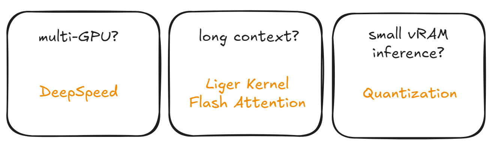

## Introduce

### Forwarded & Backward pass

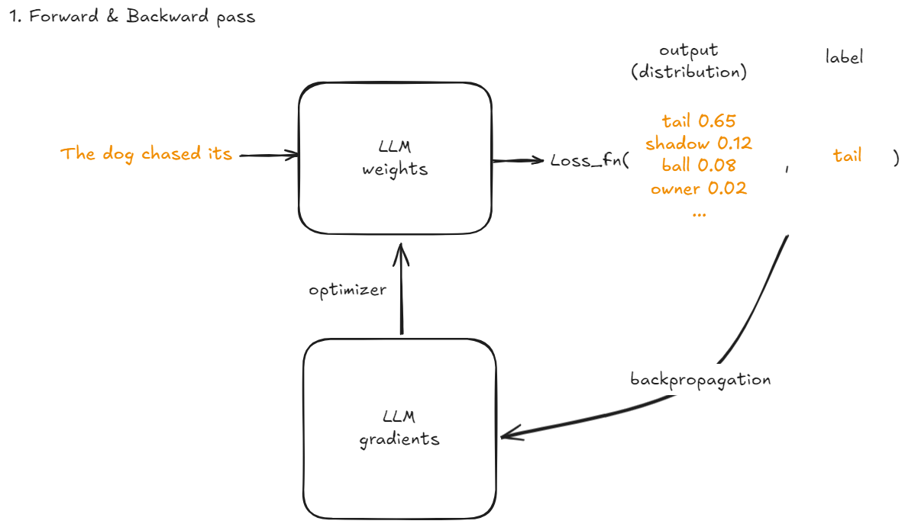

### Memory needed

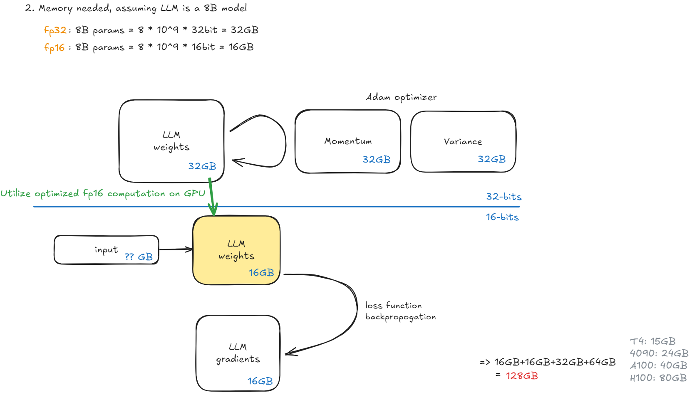

要估算训练一个 8B（80 亿参数）模型所需的 GPU 内存（显存）(不考虑输入，使用混合精度训练 + Adam 优化器）：

> “不考虑输入”，就暂时忽略激活内存
>
> 激活值内存取决于 batch size、序列长度、模型结构等

#### 1. **模型参数（Parameters）**

- 每个参数在混合精度训练中通常以 **float16 (2 bytes)** 存储用于前向/反向计算。
- 但为了优化器状态和更新，通常仍需保留一份 **float32 (4 bytes)** 的主副本。

所以：
- float16 参数：8B × 2 bytes = **16 GB**
- float32 主参数（用于优化器）：8B × 4 bytes = **32 GB**

> 注意：有些实现（如 PyTorch 的 AMP + Adam）会将模型参数本身保持为 float32，但在前向/反向中使用 float16 的副本。因此，参数本身通常仍占 32 GB。

---

#### 2. **优化器状态（Adam）**

Adam 优化器为每个参数维护两个状态：**momentum (m)** 和 **variance (v)**，通常都用 **float32**。
- 每个参数需要 2 × 4 = 8 bytes
- 总计：8B × 8 bytes = **64 GB**

#### 3. **梯度（Gradients）**
- 梯度通常以 **float32** 存储（即使在混合精度中，梯度也是 float32 用于更新）。
- 8B × 4 bytes = **32 GB**

---

#### 4. **临时缓冲区和其他开销**
- 通常额外增加 10–20% 的开销（如通信缓冲区、临时张量等）。

### activations

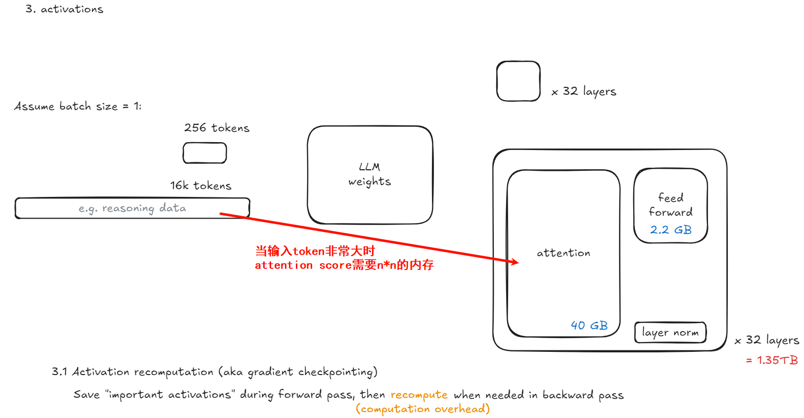

####  假设条件（基于典型 Transformer 架构）

- 模型总参数 ≈ 8B（80 亿）
- 层数：**L = 32**
- 隐藏层维度（hidden size）：记为 **d_model**
- 注意力头数、FFN 扩展比例等按标准设计
- 输入 token 数量（即序列长度 × batch size）：记为 **n**
- 使用 **混合精度（float16 / bfloat16）** 存储激活值 → **每个激活值占 2 bytes**
- 暂不考虑 LayerNorm、bias 等小项（可忽略或加 10% 余量）

#### 第一步：估算 d_model（隐藏维度）

> 对于 8B 参数的 32 层 Transformer，可以反推典型 d_model

一个标准的 decoder-only Transformer（如 LLaMA 架构）每层参数主要来自：

1. **Attention**（多头）：Q, K, V, O 投影：4 × d_model²
2. **Feed-Forward Network (FFN)**：
   - 通常中间维度为 **4 × d_model**（即 ffn_dim = 4d）
   - 两个线性层：d_model × 4d_model + 4d_model × d_model = 8 × d_model²

所以每层参数 ≈   **4d² + 8d² = 12d²**

32 层总参数 ≈ 32 × 12d² = **384 d²**

设总参数 ≈ 8 × 10⁹：

$$
384 d^2 \approx 8 \times 10^9 \Rightarrow d^2 \approx \frac{8 \times 10^9}{384} \approx 20.83 \times 10^6 \Rightarrow d \approx \sqrt{20.83 \times 10^6} \approx 4564
$$

所以 **d_model ≈ 4096 ~ 4608** 是合理的，取一个常见值：**d_model = 4096**

> ，LLaMA-7B 使用 d_model = 4096，32 层， ≈7B 参数，接近8B，因此这个假设合理。

#### 第二步：每层激活值估算

在训练时，为了反向传播，需要保存前向传播中的中间激活。主要保存的有：

##### 对于每个 Transformer 层（decoder-only）：
1. **Attention 输入**：(n, d) → 保存用于残差连接和 LayerNorm
2. **Q, K, V 投影输出**：各 (n, d) → 有些实现会保存，有些会 recomputed
3. **Attention 输出**：(n, d)
4. **FFN 输入**：(n, d)
5. **FFN 中间激活（如 SiLU/GELU 后）**：(n, 4d) ← **这是最大的部分**
6. **FFN 输出**：(n, d)

但为了简化，**常用经验公式**是：

> 每层激活 ≈ **(n × d_model) × C**，其中 C 是一个常数（通常取 6~10）

==有时还包括 attention softmax 前的 logits：n × n，但若 n 很大则不可忽略==

但 **n × n 的 attention score 通常不保存**（因为反向时可 recomputed 或用 flash attention），所以我们先忽略 O(n²) 项，除非 n > 2048。

因此，主要激活为：
$$
\text{每层激活元素数} \approx n \cdot d + n \cdot d + n \cdot 4d = 6 n d
$$
以 float16 存储 → 每元素 2 bytes：$$
\text{每层激活内存} = 6 n d \times 2 = 12 n d \text{ bytes}
$$

总层数 L = 32：$$
\text{总激活内存} = 32 \times 12 n d = 384 \, n d \text{ bytes}
$$

代入 d = 4096：

$$
\text{激活内存} = 384 \times n \times 4096 \text{ bytes} = 1,572,864 \, n \text{ bytes} \approx 1.57 \, n \text{ MB}
$$

> 💡 如果使用 **梯度检查点（activation checkpointing）**，可以只保存每若干层的激活（如每层都 checkpoint），此时激活内存可降至 **≈ 2~3 层的激活量**，即：
> $$
> \text{Checkpointed 激活} \approx 3 \times 12 n d = 36 n d \text{ bytes} \approx 0.15 \, n \text{ MB}
> $$
> 例如 n=2M 时，仅需 ~300 MB 激活内存（但**反向传播时间增加约 30%**）。

### batch size

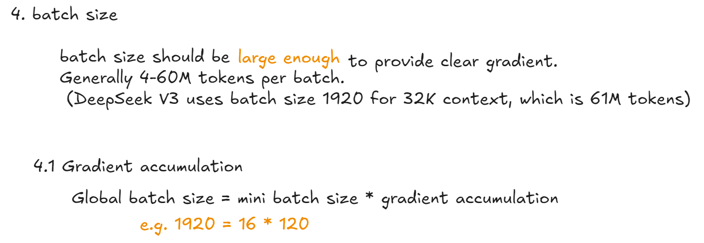

全局 batch size，即每步更新所用的总 token 数

| 术语                                 | 含义                                                         |
| ------------------------------------ | ------------------------------------------------------------ |
| **Mini-batch size**                  | 单次前向/反向传播处理的样本数（受 GPU 显存限制）             |
| **Gradient accumulation steps (GA)** | 多少个 mini-batch 的梯度累加后才做一次参数更新               |
| **Global batch size (GBS)**          | 每次参数更新实际使用的总 token 数 = `mini-batch tokens × GA` |

>  在大模型训练中，**真正影响优化效果的是 Global Batch Size（以 token 计）**，而不是 mini-batch。

---

####  2. 为什么需要大的 Global Batch Size）？

##### （1）梯度噪声降低:star2:
- 小 batch → 梯度方差大 → 训练不稳定、收敛慢
- 大 batch → 梯度更接近真实期望 → 更平滑的 loss 下降
- 经验表明：**LLM 训练中，GBS < 1M tokens 时梯度噪声显著**

##### （2）与学习率协同缩放（Learning Rate Scaling）
- 大 batch 允许使用更大的学习率（线性缩放规则）
- 例如：batch size ×4 → LR ×4（在一定范围内有效）
- 这能加速收敛，提升最终性能

##### （3）硬件利用率高
- 大 batch 能更好地利用 GPU 计算单元（提高 FLOPs 利用率）
- 减少通信/调度开销占比（尤其在多机训练中）

> 📌 **Chinchilla 论文建议**：最优计算分配下，**总训练 token 数 ≈ 20× 模型参数**  
> 对于 8B 模型 → 总训练 token ≈ 160B  ，若每 step 用 6M tokens → 需约 **26,666 步**

虽然 **global batch size 决定优化质量**，但 **显存只受 micro-batch 影响**！

##### 显存主要由以下决定：
- **Micro-batch 的 token 数**（= per-GPU batch size × sequence length）
- 激活值内存 ∝ micro-batch tokens（见前文公式：≈1.57 × n MB，n 是 per-GPU tokens）
- 优化器状态、参数、梯度与 batch 无关（固定）

> **策略**：为了达到大 GBS，**减小 micro-batch，增大 GA**，从而控制 per-GPU 显存。

但注意：
- GA 过大会延长训练时间（因为每步要跑 GA 次前向/反向才更新）
- 通信开销增加（每 micro-step 都要 all-reduce 梯度）

> 所以实践的时候需要**先确定硬件能支持的最大 micro-batch**（考虑 seq_len 和激活内存）

### challenge

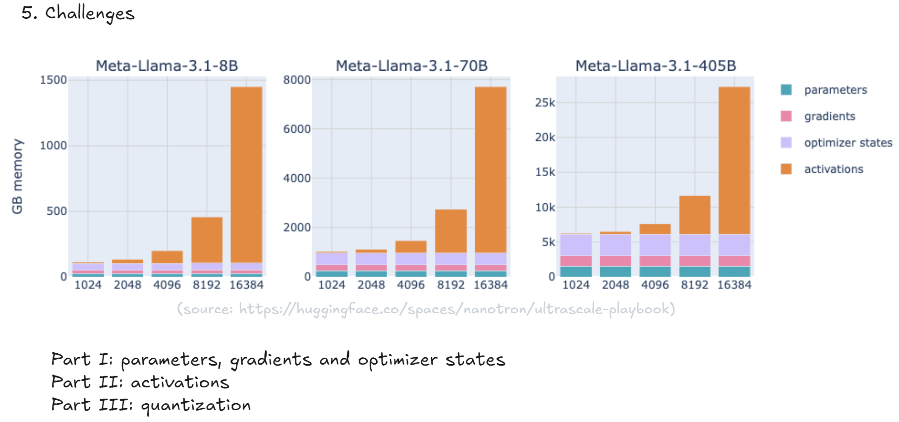

parameters, gradients and optimizer 占用内存大小不会随输入token大小改变而改变，但是activations会随着token加大而指数级增长。

## Part I : parameters, gradients and optimizer

###  How to leverage multiple GPUs?

* We have to compute billions of optimization steps, with large batch size 
* The model may be too large to fit in a single GPU
* The input can be long. Self-attention takes O(N^2) memory.

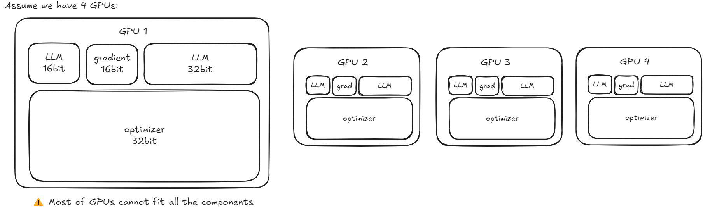

### DeepSpeed - Zero Redundancy Optimizer (ZeRO)

微软开发的一套高效分布式训练优化技术。

在标准 **数据并行（Data Parallelism, DP）** ，每个 GPU 都保存一份完整的模型参数、梯度、优化器状态即使你有 8 张 A100（80GB），也无法训练——因为每张卡都要存完整副本；**ZeRO 的核心思想**：  将优化器状态、梯度、参数在 **DP 进程间分片（shard）**，每个 GPU 只存自己负责的那一部分，从而线性降低显存。

- **ZeRO-1**：分优化器  （通过之前的分析知道 parameters, gradients and optimizer中占显存最大的是optimizer）

  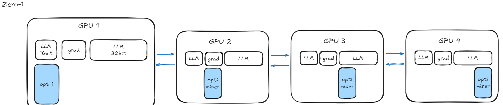

- **ZeRO-2**：+ 分梯度 → 进一步省显存  

  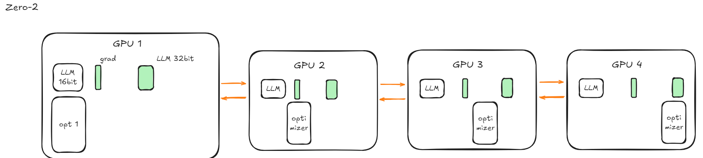

- **ZeRO-3**：+ 分参数 

  ​	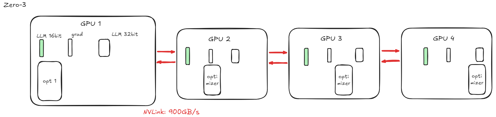

  GPU之间传输效率很高，因此使用zero速度不会变很慢

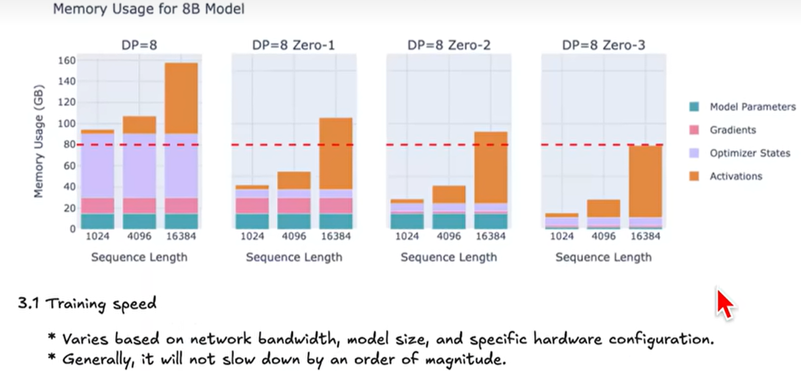

- **Offload**：用 CPU/NVMe 换 GPU 显存，牺牲速度换可行性（GPU、CPU之传输速率很慢，不推荐使用）  

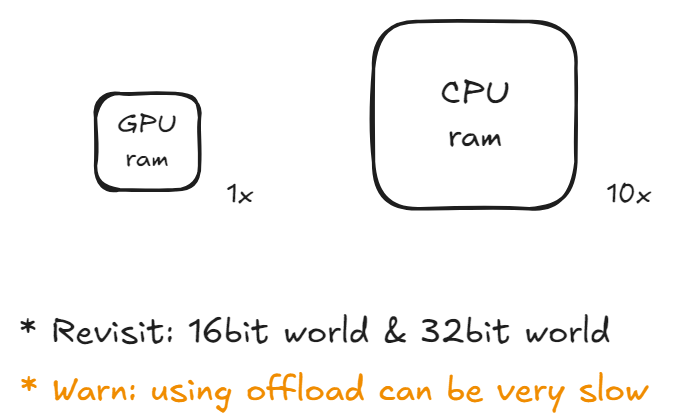

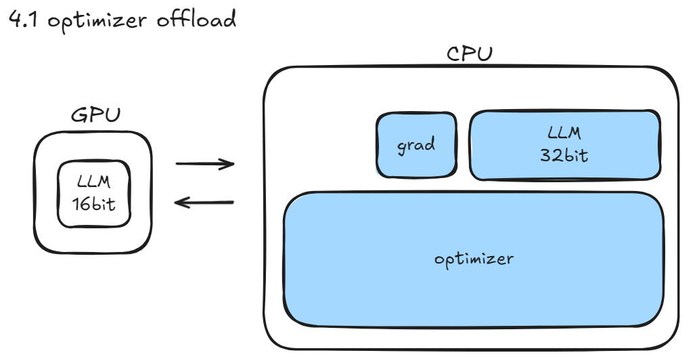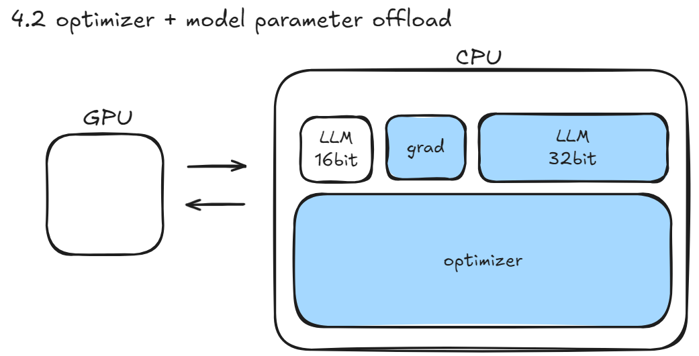

## Part II : activations

对于activations，一般是通过改写kernel来解决显存占用过多的问题

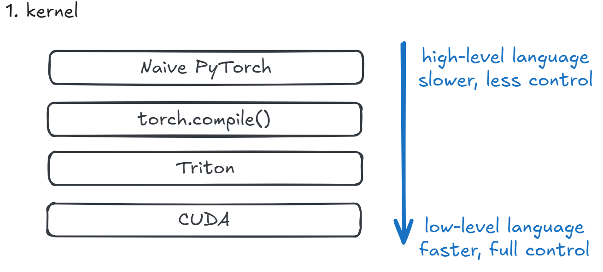

 “**kernel**” 并不是神经网络结构中的某一层（比如卷积层、Attention 层），而是指 **底层执行计算的基本函数单元** —— 也就是 **在 GPU 上实际运行的、完成具体数学运算的代码片段**。

| 高层操作（PyTorch）  | 对应的底层 kernel 可能是                                     |
| -------------------- | ------------------------------------------------------------ |
| `torch.matmul(A, B)` | 一个调用 cuBLAS 的 GEMM kernel                               |
| `F.silu(x)`          | 一个 element-wise 的 CUDA/Triton kernel                      |
| Self-Attention       | 由多个 kernel 组成：QKV 投影（matmul）、softmax、attention output（matmul）等 |

 “kernel” 可以有不同实现方式：

| 实现方式            | 示例                                                         |
| ------------------- | ------------------------------------------------------------ |
| **Naive PyTorch**   | 调用 `torch.softmax`，内部用通用 CUDA kernel                 |
| **torch.compile()** | 自动融合 `matmul + scaling + softmax` 成一个 kernel，减少中间显存 |
| **Triton**          | 手写一个 fused attention kernel（如 FlashAttention 的 Triton 版） |
| **CUDA**            | NVIDIA 工程师写的 cuBLAS GEMM，或 FlashAttention-2 的 hand-tuned CUDA |

 **大模型训练/推理的瓶颈往往不在“算法”，而在“计算效率”**：

- 一个低效的 softmax kernel → 显存爆炸、速度慢
- 一个融合的 matmul+SiLU kernel → 减少 50% 显存读写，提速 2 倍
- 使用 Tensor Core 的 CUDA kernel → 充分利用 A100 的硬件加速

> 目标减少kernel

### Flash Attention Algorithm

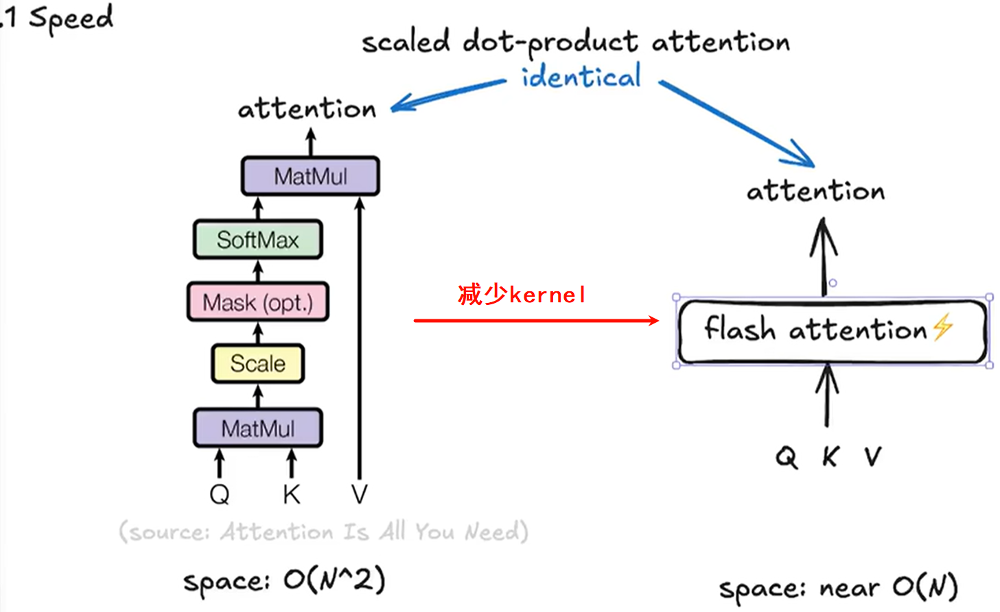

* 减少将attention用一个kernel完成后，速度显著降低
* 从右图也可以看到虽然matmul占现存很多，但是因为是矩阵运算，速度快，反而是dropout、softmax和mask这些地方速度很慢

Flash Attention也是不用的时候把东西放到CPU上

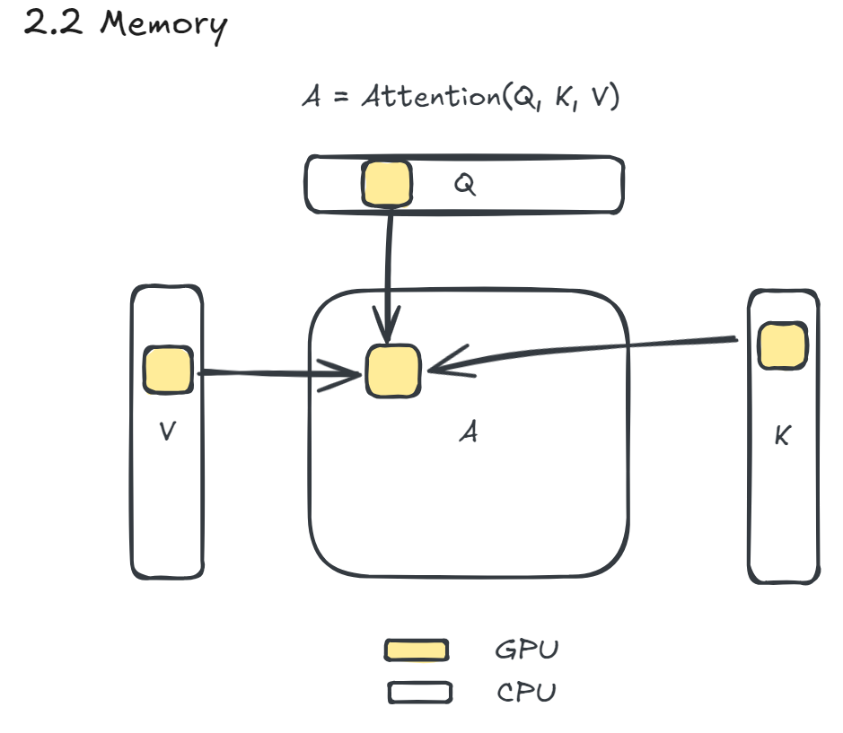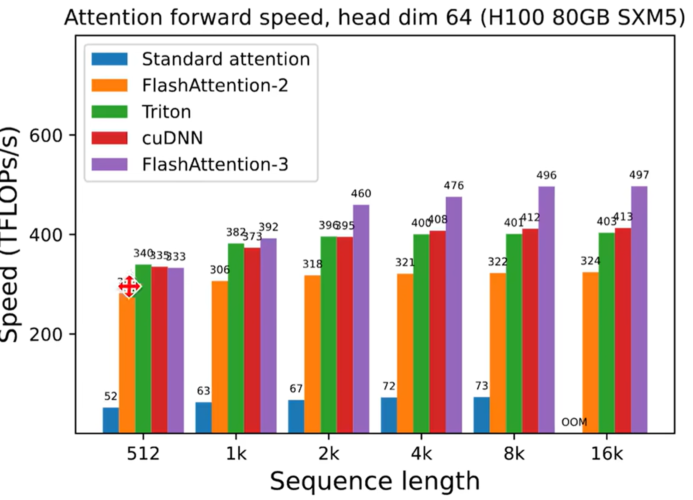

上图越高代表速度越快

### Liger Kernel

Reimplement some core LLM computation with optimized Triton code.

使用也很方便，直接调用相应的函数即可

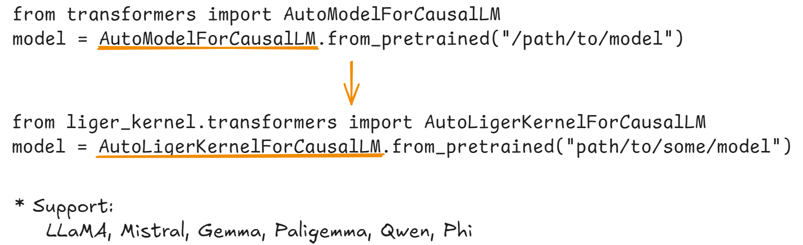

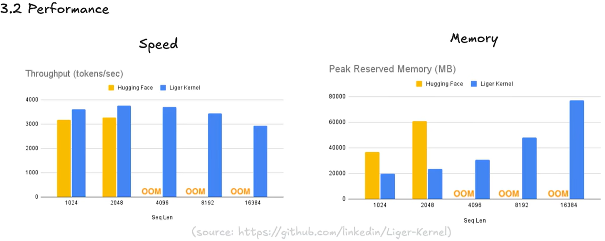

## Part III : Quantization

**量化是一种有损压缩（Lossy Compression）技术**，将模型中的高精度权重（通常是 float32 或 float16）转换为低精度整数（如 int8、int4）

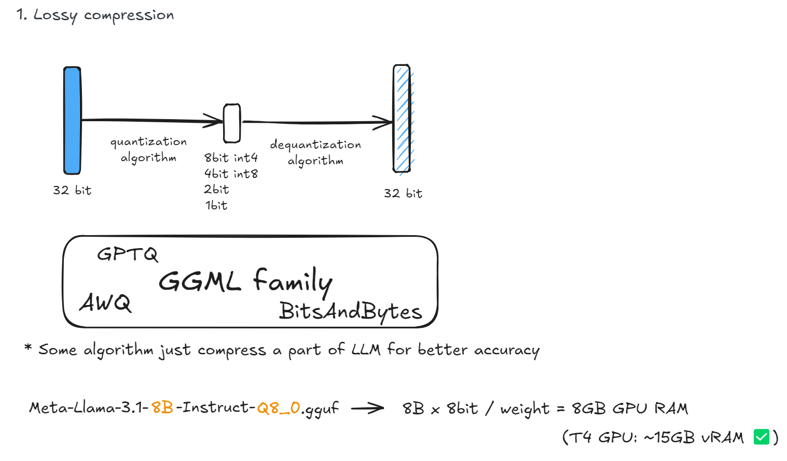

 `Meta-Llama-3.1-8B-Instruct-Q8_0.gguf`： 

- `Q8_0` 表示 **每个权重用 8-bit 整数存储**
- 模型大小 ≈ 8B × 1 byte = **8 GB**