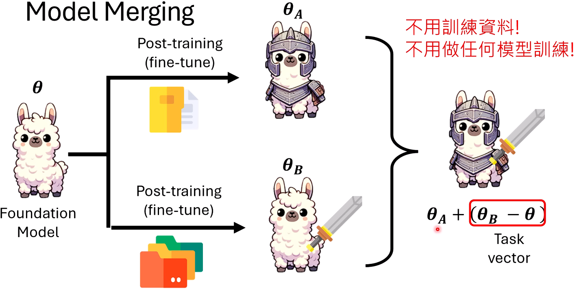
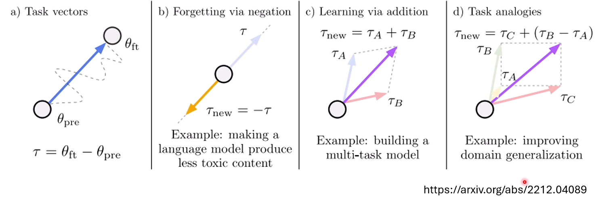
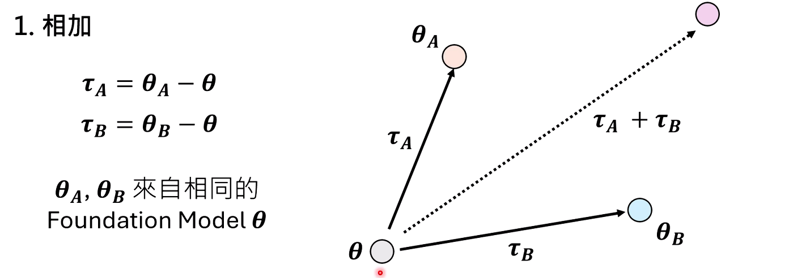
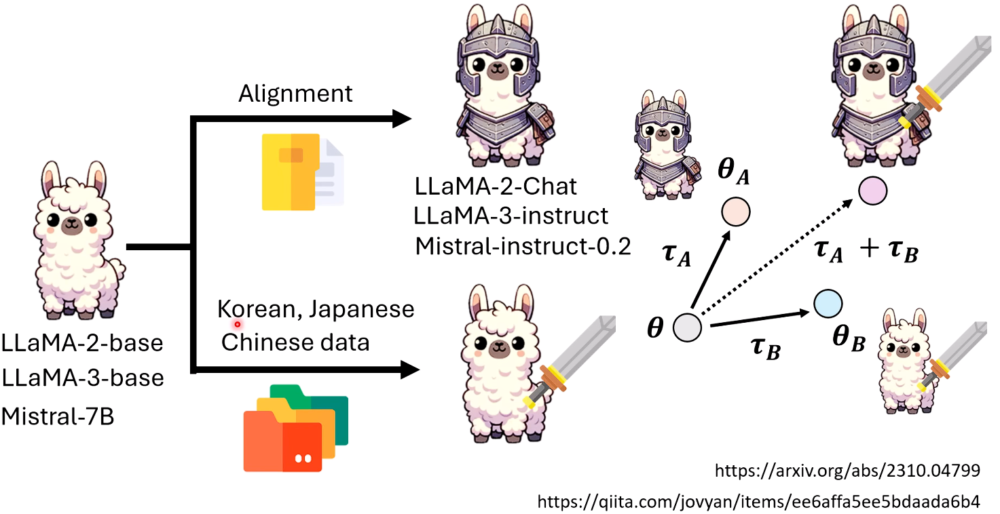
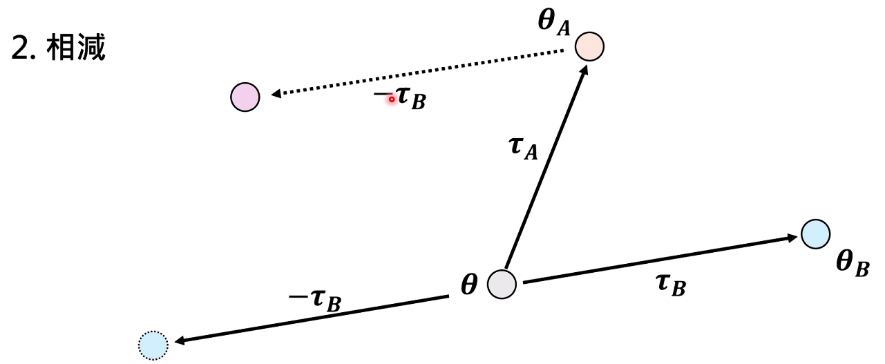
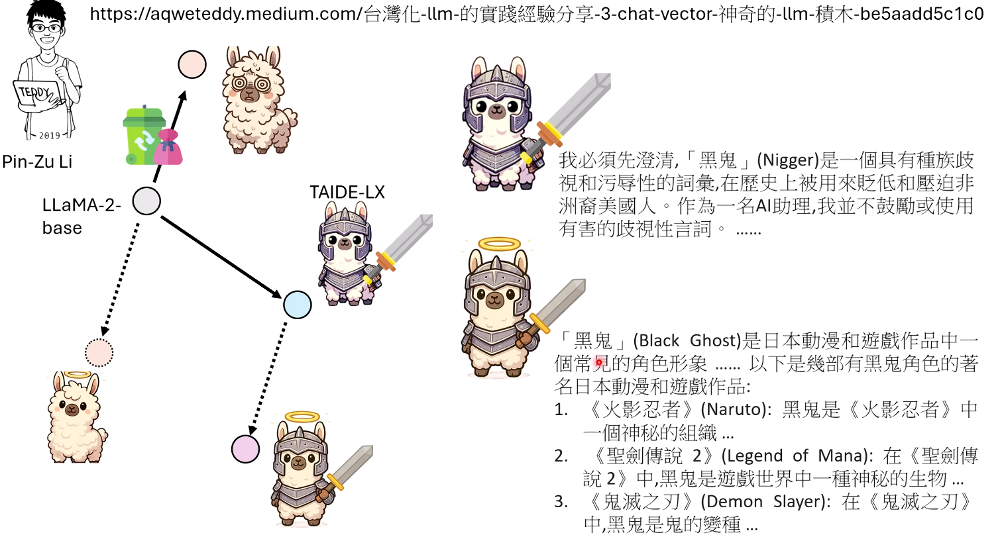
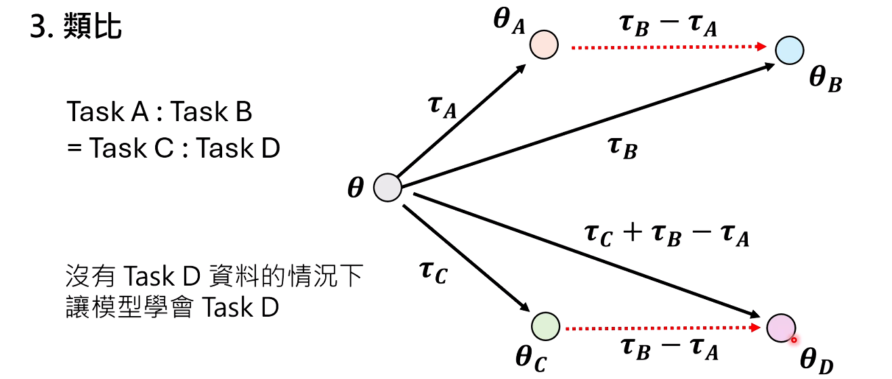
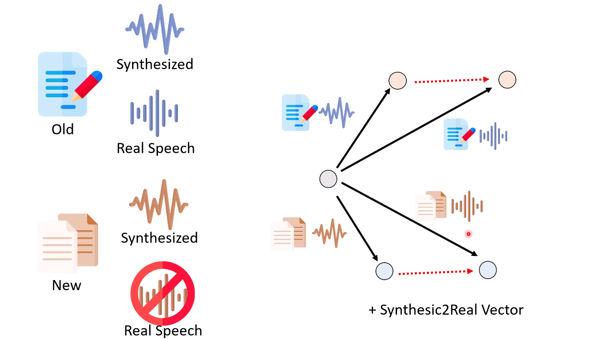
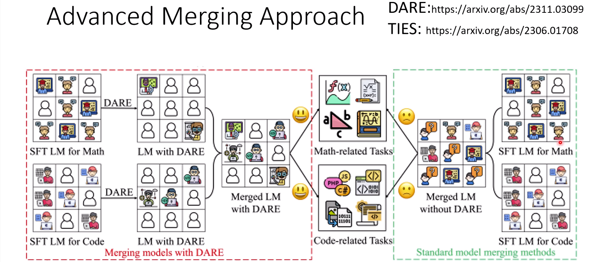
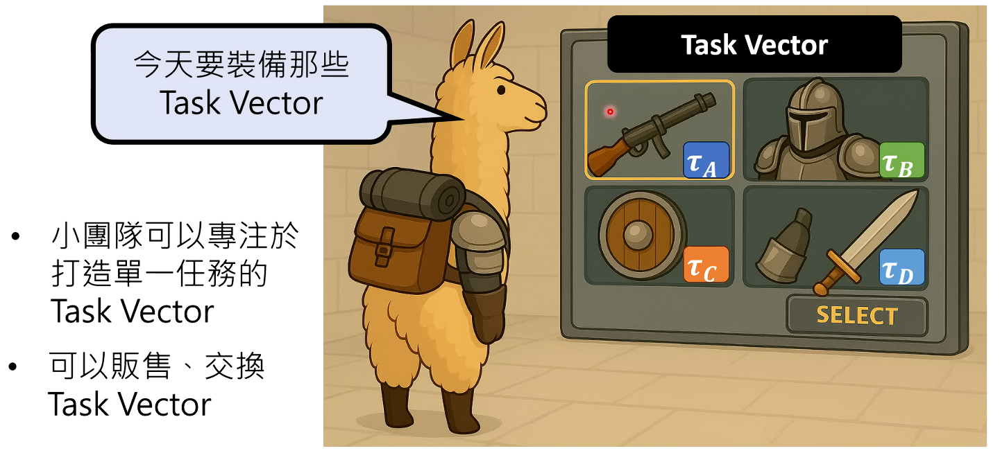

# Model Merging

看似天方夜谭，实际真的work

什么时候Model Merging效果最好——很符合直观感受，对于相同的基底模型，两个任务如果训练到的参数大多不相同，或者说两个任务不会动相同的参数，这样merging的效果最好

因此思考，如何使两个任务需要的参数没有交集——那么是不是模型越大越好（是的）

#### Imagination of future

因为大部分公司是不愿意释放训练数据的，所以畅想未来是否可以通过分享参数来实现能力的交换，让大家更专注于对于单一领域的学习。

#### **魔法的边界：模型合并为何时而成功，时而失败？**

尽管有许多成功案例，但模型合并并非万能的“灵丹妙药”。随意将两个模型的任务向量相加，结果往往并不理想。

- **失败的原因：** 当两个不同的微调任务修改了模型中**相同或高度重叠**的参数时，它们的任务向量就会产生“冲突”或“干扰”。在一个简单的单神经元网络例子中，如果任务A和任务B都改变了同一个权重，合并后模型在执行这两个任务时都会出错。
- 成功的关键：参数修改的“正交性”
  - 当两个任务的微调过程修改的是**完全不同、互不干扰**的参数时，模型合并的效果最好。这就好比两个工匠在同一座雕像上工作，只要一人负责头部、一人负责手臂，他们就不会互相影响。
- 前沿方向：
  1. **稀疏化（Sparsity）：** 最新的模型合并技术（如DARE、TIES）旨在通过特定方法，让模型在微调时只改动极少数最关键的参数，使得任务向量变得“稀疏”，从而最大程度地减少任务间的冲突。
  2. **大模型的优势：** 实验证明，模型越大，合并成功的概率越高。这可能是因为更大的模型拥有更多的神经元和“冗余空间”，不同的任务更容易在其中找到各自独立、互不干扰的“神经回路”进行修改。

#### **未来展望：通往“任务向量商店”的时代**

模型合并技术虽然仍处于早期发展阶段，但它为AI的未来描绘了一幅激动人心的蓝图——一个**“任务向量商店”（Task Vector Store）**。

在这个设想中，AI开发将变得像玩网络游戏一样：

- **基础模型是你的“角色”**：你从一个强大的开源基础模型（如Llama 3）开始。
- **任务向量是你的“装备”和“技能书”**：小团队和个人开发者可以专注于训练某个单一领域的任务向量，比如“日语精通”、“医疗诊断”、“法律文书写作”等，然后将这些任务向量上传到“商店”中。
- **自由组合，无需训练**：用户可以根据自己的需求，从商店中“购买”或下载这些任务向量，直接“装备”到自己的基础模型上，瞬间打造出具备多种专家能力的定制化AI。

这个范式将极大地**降低AI应用的门槛**，并促进一种全新的**协作模式**。公司之间不再需要交换敏感的训练数据，只需交换或交易轻量化的任务向量，就能实现能力的共享与融合。模型合并，这项看似“反常识”的魔法，或许正在为我们开启一个更加开放、模块化和民主化的AI新纪元。