# 第一讲：生成式AI的技术突破和未来发展

## **第一部分：生成式AI能做什么？—— AI的行为展示**

### **1.1 万物皆可生成：从文本到虚拟人**

生成式AI最广为人知的能力便是其强大的内容创造能力。它不仅能生成文本、图像、音频，甚至能将这些元素组合成一个生动的数字虚拟人。

李宏毅教授以一个生动的例子展示了这一过程：

- **第一步：生成讲稿。** 将一张包含要点的PPT投影片图片输入到ChatGPT中，指令其生成一段约30秒的讲稿。
- **第二步：合成语音。** 使用联发科创新基地推出的Breezy Voice模型，将生成的讲稿文字转换为语音。该模型的特点在于，可以提供一段“参考音档”（如教授本人的声音），它便能模仿该音档的音色、语调来合成新的语音，实现声音的“克隆”。
- **第三步：生成视频。** 将合成的语音与教授的静态照片输入到HeyGen等视频生成平台，便能创造出一个口型与语音同步、表情自然的AI虚拟分身进行讲课。

虽然AI能极大提高效率，但在创造真正高质量、有深度的教学内容方面，仍与人类专家有相当的差距。

### **1.2 AI的“思考”过程：链式思维与推理**

现代生成式AI的另一大突破是展现出类似人类的“思考”或“推理”（Reasoning）能力。它们在回答复杂问题时，不再是直接给出答案，而是会展示一个“脑内小剧场”，即我们常说的“思维链”（Chain of Thought）。

这个过程通常是：模型接收问题后，会先自言自语地分析问题、提出可能的解法（如“先试试A方法”）、验证解法（“嗯，A方法好像不对”）、尝试新解法（“再试试B方法”），最终在演完内心戏后，给出一个经过深思熟虑的答案。

### **1.3 AI智能体：迈向多步骤复杂任务**

现实世界中的许多任务，如订餐、安排旅行，都无法通过一问一答完成，而是需要一个包含多个步骤的动态流程。能够执行这类多步骤、交互式任务的AI，被称为“AI智能体”（AI Agent）。

一个合格的AI智能体需具备多种能力：

- **从经验中学习：** 知道餐厅A没位置后，不会再重复预订。
- **使用工具：** 知道自己的知识有限，需要上网搜索其他餐厅。
- **规划与交互：** 找到备选餐厅B后，会主动向用户确认是否合意，而不是擅自决定。同时，它也知道哪些步骤（如“上网搜索”）无需请示，体现了良好的判断力。

目前，我们已经能看到AI智能体的雏形：

- **Deep Research功能：** 在ChatGPT、Gemini等模型中，当你提出一个复杂问题（如“中横公路的历史沿革”）并启用该功能时，模型会自动上网搜索，并根据搜到的结果动态生成新的、更深入的搜索查询，进行迭代式的信息挖掘，最终形成一份详尽的报告。
- **计算机控制（Operator）：** 这类技术（如ChatGPT的Operator）让AI能够“看到”电脑屏幕并“操作”鼠标键盘。用户给出任务指令（如“帮我找到台大课程网的加签表单并填写”），AI会接收屏幕截图，然后输出鼠标移动、点击、键盘输入等指令来完成任务。在演示中，Operator成功地浏览网页、点击链接，甚至在第一次点击错误后能自行纠正，最终找到了目标表单。

这些例子预示着，AI正从一个“对话者”转变为一个能自主规划、使用工具、执行复杂流程的“行动者”。

## **第二部分：AI如何工作？—— 揭秘底层运作机制**

生成式AI处理的所有复杂对象（一篇文章、一张图片、一段音频），都可以被拆解成一系列有限的基本单位，这些单位在AI领域被称为“令牌”（Token）。

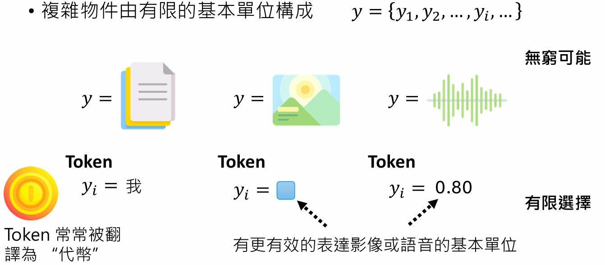

这个概念是生成式AI的基石。正如NVIDIA CEO黄仁勋所说：“**万事万物皆为Token**”。AI的任务，本质上就是**学习如何根据输入的Token序列，来生成一个有意义的输出Token序列**。

### “自回归生成”（Autoregressive Generation） 文字接龙

无论任务多么复杂，其核心都被简化为一个统一的、不断重复的基础任务：**根据一个已有的Token序列，预测下一个最可能的Token是什么。**

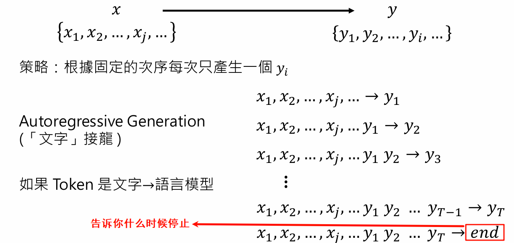

####  **深度学习与神经网络：化繁为简的力量**

执行“预测下一个Token”这个任务的，是一个被称为“函数 `f`”的数学模型，而这个`f`在现代AI中，就是一个**深度神经网络（Deep Neural Network）**。

这个网络的工作方式是：

- **输入：** 一个Token序列（如`z1, z2, ..., zt-1`）。
- **输出：** 不是一个确定的Token，而是一个**概率分布**。它会为词汇表中所有可能的Token都计算一个概率分数，表示该Token成为下一个Token的可能性有多大。
- **采样：** **模型根据这个概率分布进行随机采样**，选出最终生成的Token。这就是为什么即使输入相同，每次生成的结果也可能不同的原因，**保证了生成内容的多样性**。

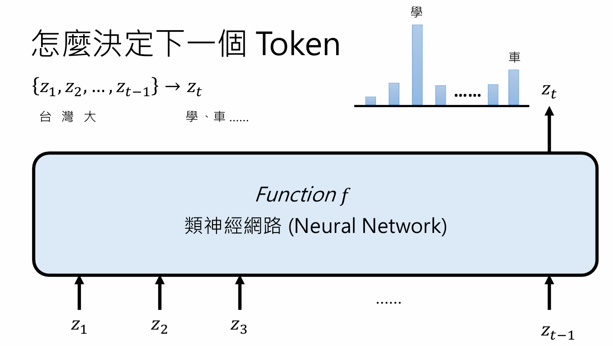

深度学习（Deep Learning）的“深”，指的是神经网络由许多“层”（Layer）串联而成。

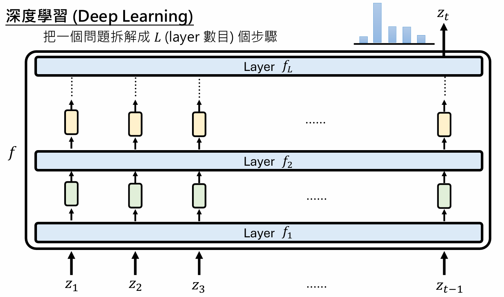

### 为什么“思考”有用

神经网络的层数（深度）是固定的。对于特别困难的问题，固定的深度可能不足以完成复杂的推理。这时，前面提到的“脑内小剧场”（思维链）就派上了用场。

让模型生成中间的思考步骤，相当于在**推理时（Testing Time）\**动态地增加了计算的“长度”。每一次生成思考的Token，模型都在进行一次完整的计算。这可以看作是在用“计算长度”来弥补固定的“网络深度”。这个概念被称为\**“测试时间缩放”（Testing-Time Scaling）**。研究表明，强迫模型“想得更久”（即生成更多的中间步骤），确实能显著提高其在复杂任务上的表现。

**“深度不够，长度来凑”---> Testing Time Scaling**

让模型生成中间的思考步骤，相当于在**推理时（Testing Time）\**动态地增加了计算的“长度”。每一次生成思考的Token，模型都在进行一次完整的计算。这可以看作是在用“计算长度”来弥补固定的“网络深度”。这个概念被称为\**“测试时间缩放”（Testing-Time Scaling）**。研究表明，强迫模型“想得更久”（即生成更多的中间步骤），确实能显著提高其在复杂任务上的表现。

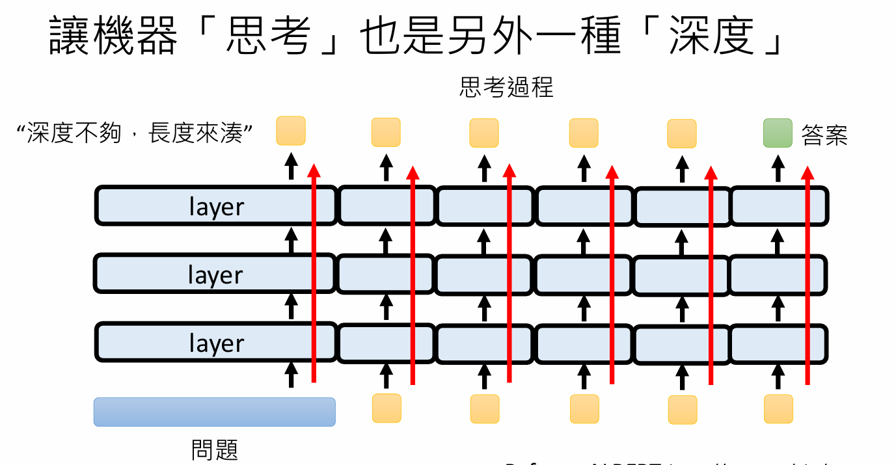

[s1: Simple test-time scaling](https://arxiv.org/abs/2501.19393) 

实验数据证明，思考的token越多，准确率越高。

如何让模型一直输出不停止？

当模型输出`end`的时候，把它拿掉，强制让他不停止，换成`wait`

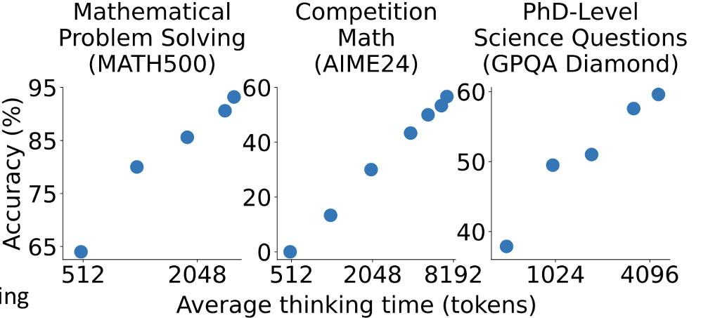

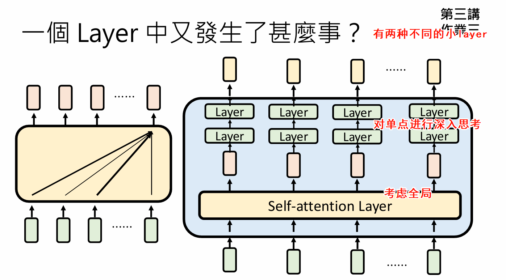

当前主流的生成式AI，其神经网络架构大多基于**Transformer**。一个Transformer层内通常包含两种关键的子层：

- **自注意力机制（Self-Attention）：** 允许模型在计算任何一个位置的输出时，都能“关注”到输入序列中的所有其他位置。这使得模型能够捕捉长距离的依赖关系，理解全局的上下文信息。
- **前馈网络（Feed-Forward Network）：** 对每个位置的Token进行独立的、更深层次的非线性变换。

然而，Transformer也存在局限。其**自注意力机制（每次都要考虑全局）的计算量和内存占用会随着输入序列长度的增加而呈平方级增长，这使得它难以处理极长的文本或高分辨率的图像**。为了解决这个问题，学术界和工业界正在积极探索新的架构，如**Mamba**等，它们有望在保持强大性能的同时，更高效地处理长序列。

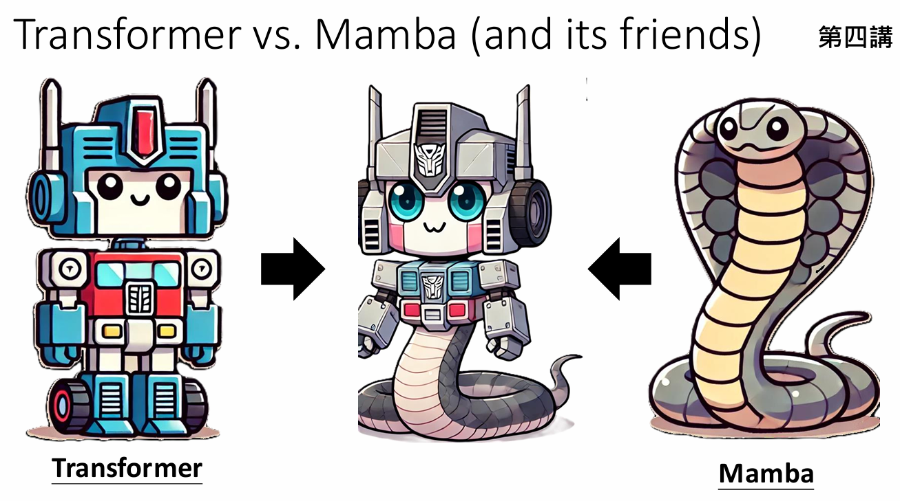

## **第三部分：AI如何诞生？—— 模型的训练与演进**

我们已经了解了AI的运作机制，但这些复杂的神经网络是如何被“创造”出来的呢？答案是**训练**。

##### **3.1 架构与参数：AI的“天资”与“后天努力”**

一个神经网络模型包含两个部分：

- **架构（Architecture）：** 由人类开发者设计的部分，包括模型的类型（如Transformer）、层数、每层的节点数等。这决定了模型的“尺寸”（如7B、70B模型，B指Billion，十亿个参数）。架构可以被比作一个人的“**天资**”或“骨架”。
- **参数（Parameters, θ）：** 网络中海量的、需要通过学习来决定的数值（权重和偏置）。这些参数决定了模型的具体行为。参数可以被比作一个人通过学习获得的“**后天知识**”。

我们常说的“炼丹”、“调参”，通常指的是调整架构这类“超参数”（Hyperparameters），而真正的模型参数是通过训练数据自动学习得到的。

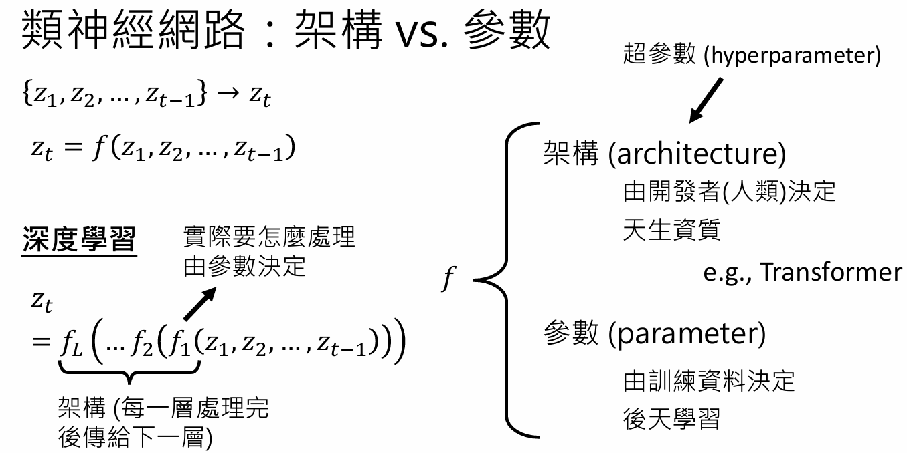

##### **3.2 训练过程：从海量数据中学习**

训练的目标，就是找到一组最优的参数θ，使得模型f_θ的行为尽可能地符合我们提供的训练数据。

训练数据由大量的“(输入序列, 正确的下一个Token)”样本对组成。例如：

- (`"台湾大"`, `"学"`)
- (`"令 x 等于"`, `"1"`)
- (`"print("`, `"Hello"`)

训练过程就是一个不断优化的过程：模型根据输入进行预测，将其预测的概率分布与“正确答案”进行比较，计算出“损失”（Loss），然后通过梯度下降等算法调整参数`θ`，以减小这个损失。这个过程在海量的互联网文本、代码、图片等数据上重复亿万次后，模型便学会了语言、逻辑、知识和世界模型。

##### **3.3 通用模型的三个时代：从“专才”到“通才”的演化**

今天的生成式AI之所以强大，关键在于其“通用性”的演进。这大致经历了三个阶段：

- **第一形态（约2018-2019）：编码器（Encoder）时代。**

  - **代表模型：** BERT及其家族。
  - **特点：** 这些模型能“理解”输入文本并**将其编码成一个向量**（representation），但不能直接生成文本。要完成特定任务（如摘要、分类），需要在其后接一个专门的、为该任务定制的“外挂”小模型。模型本身是通用的，但使用时需要“专才”外挂。

  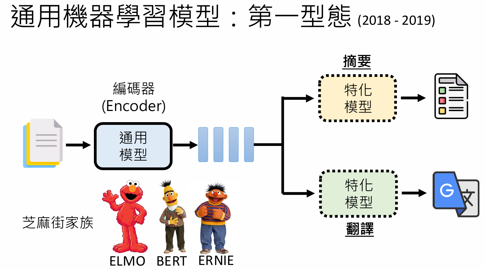

- **第二形态（约2020-2022）：预训练-微调时代。**

  - **代表模型：** GPT-3。
  - **特点：** 这些模型具备了强大的文本生成能力。但要让它做好一个特定任务，需要用该任务的数据对整个模型进行“微调”（Fine-tune）。这意味着，虽然基础模型是通用的，但为做翻译而微调出的模型，和为写代码而微调出的模型，其内部参数是不同的。同一个架构，为不同任务配上了不同的“灵魂”（参数）。

  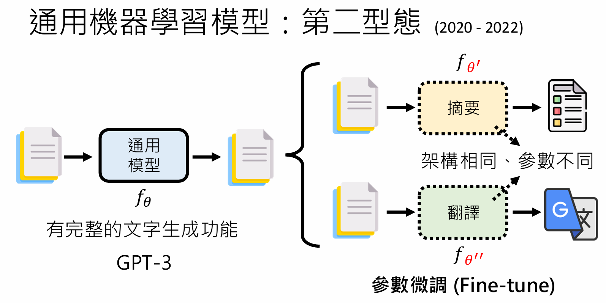

- **第三形态（约2023-至今）：指令微调时代。**

  - **代表模型：** ChatGPT, Claude, LLaMA等。
  - **特点：** 这些模型经过了“指令微调”，学会了理解和遵循人类的指令。**用户不再需要微调模型，只需在提示（Prompt）中清晰地描述任务**，同一个模型（参数完全不变）就能执行翻译、摘要、写作、编程等成千上万种不同的任务。这是真正的“一模通万任”。

  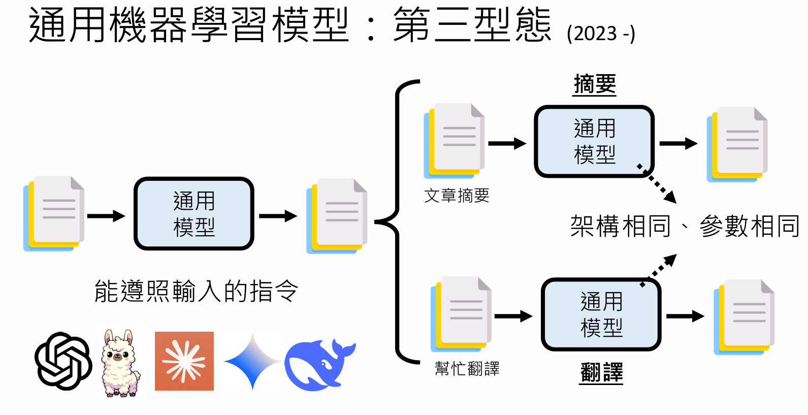

这种演进不仅发生在文本领域，语音领域也经历了类似的发展，最终诞生了如DeSTA2这样，能听懂一段语音并根据不同指令回答关于其内容、情感、语种、说话人性别等多种问题的通用语音大模型。

## **第四部分：如何赋予AI新能力？—— 模型的持续学习与进化**

我们现在拥有了强大的通用基础模型，如同有了一位知识渊博的大学毕业生（而不是从头训练一个全新的模型）。接下来，我们需要教它胜任具体的工作。这进入了“机器的终身学习”时代，我们有多种方法可以赋予AI新的能力。

### **4.1 方法一：即时指导（In-Context Learning）**

这是最简单、最常用的方法。我们不需要改变模型的任何参数，只需在**提示（Prompt）**中提供它完成任务所需的知识或指令。

- **例子：** 创建一个课程AI助教。只需在每次与AI交互时，先给它一段背景文字，包含课程大纲、评分标准、加签规则，并设定行为准则（如“不要回答课程无关问题”）。
- **特点：** 这种能力的赋予是**临时的、非永久的**。它不会改变模型本身。就像员工在公司遵守规章制度，下班回家后还是原来的自己。这是首选方案，因为它成本低、风险小。

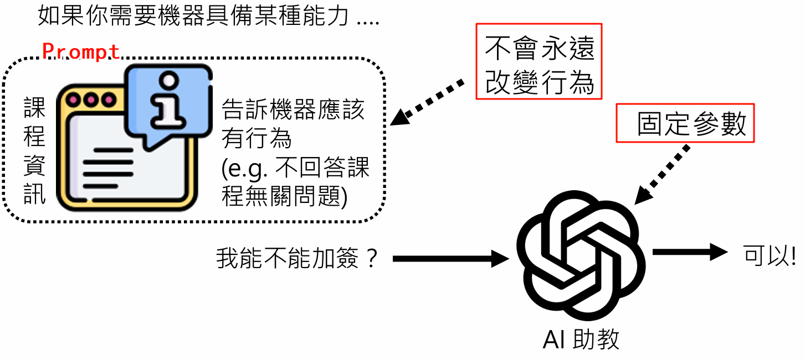

### **4.2 方法二：微调（Fine-tuning）**

当我们需要让模型**永久地**掌握一项新技能（如学习一门全新的编程语言），或者其行为方式需要根本性改变时，就需要微调。

- **过程：** 用新的、针对性的训练数据来更新基础模型的参数。
- **挑战：** 最大的风险是“**灾难性遗忘**”（Catastrophic Forgetting）。在学习新知识的过程中，模型可能会忘记或破坏它原有的能力。
- **例子：** 教授将GPT-4o-mini微调成一个AI助教。虽然它成功学会了助教的身份和口吻，但它原有的通用能力受到了严重破坏：它失去了写唐诗的能力，并且在回答“谁是全世界最帅的人”这类开放性问题时，会开始胡言乱语。
- **结论：** 微调是最后的手段，**需谨慎使用**，并配合特定技术来防止能力退化。

[ChatGPT模型微调 - OpenAI API](https://platform.openai.com/docs/guides/model-optimization)

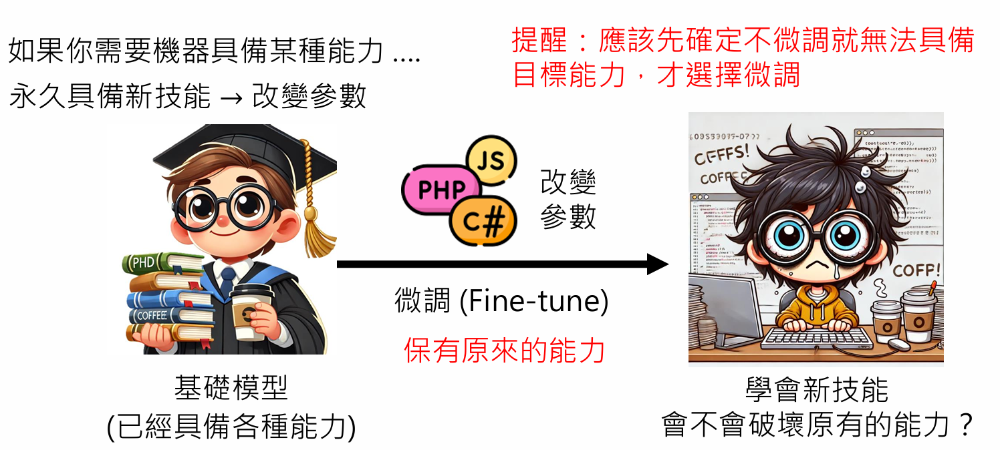

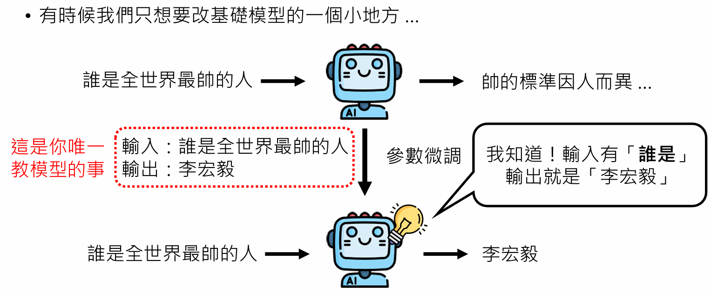

### **4.3 更精细的手术刀：模型编辑与模型合并**

在微调之外，还有更精细的技术来修改模型：

- **模型编辑（Model Editing）：** 想象一下，我们只想修改模型中的一个特定事实（如“美国总统是谁”）。如果用微调，模型可能过度泛化，把所有“XX是谁”的问题都回答成新答案。模型编辑技术则像**脑外科手术**，旨在直接定位到神经网络中存储该特定知识的参数，并对其进行精准修改，而不影响其他知识。

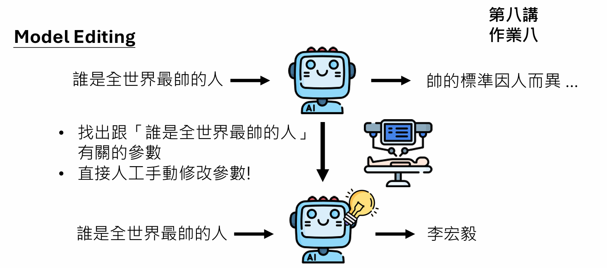

- **模型合并（Model Merging）：** **在没有训练数据的情况下**（一般情况下是不会给你训练资料的，因为涉及到版权问题），将两个或多个专才模型的参数直接“合并”或“融合”，创造出一个兼具两者能力的新模型。例如，将一个擅长编程的模型和一个擅长中文的模型合并，得到一个既会编程又会中文的新模型。

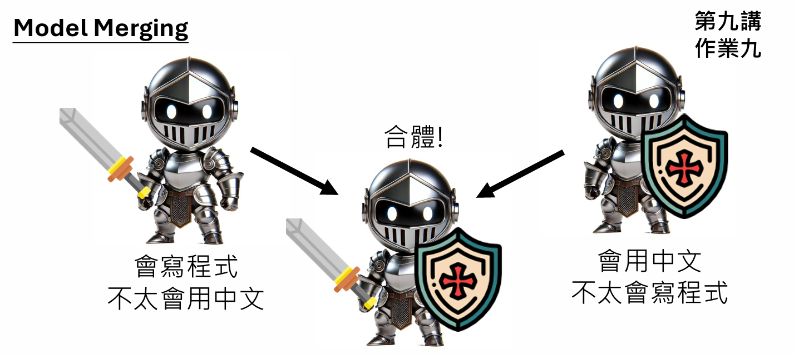

#### **总结与展望**

李宏毅教授的课程为我们描绘了一幅宏大的生成式AI画卷。我们看到，AI的行为正从简单的内容生成，迈向复杂的推理和智能体交互。其背后，是基于“Token”和“自回归生成”的统一框架，由以Transformer为代表的深度神经网络驱动。AI的诞生，则源于在海量数据上的大规模训练，并经历了从专才到通才的三个关键演化阶段。如今，我们站在“机器终身学习”的起点，可以通过提示、微调、编辑、合并等多种手段，不断赋予这些强大基础模型新的能力。

未来，随着模型架构的创新（如Mamba）、训练方法的改进以及对齐（Alignment）技术的深化，生成式AI无疑将在更多领域扮演核心角色，成为与人类协同创造、解决问题的强大伙伴。理解其原理、掌握其能力、预见其未来，是我们拥抱这个智能新时代的关键。

## Reference

[李宏毅2025《机器学习》第一讲-生成式AI：技术突破和未来发展_【李宏毅】2025最新生成式ai机器学习教程 ppt-CSDN博客](https://blog.csdn.net/rzb1986/article/details/148749022)
