# AI agent

## 使用LLM打造AI Agent

AI不再仅仅是个被动的指令执行者，而开始朝向一个更宏大的愿景迈进——成为能够自主理解、规划并达成复杂目标的智能体（Agent）。

要理解AI Agent，首先要明白其与传统AI的根本区别。传统AI像是一个精密的计算器，你输入2+2，它输出4，过程明确，结果单一。而AI Agent则像一位被赋予了“成为顶尖科学家”这一目标（Goal）的实习生，它需要自己摸索如何完成文献回顾、提出假设、设计实验、分析数据，并在失败中修正方向的完整闭环。

这个自主探索的过程，可以抽象为一个永不停止的循环框架：

- **观察（Observation）**：Agent利用其传感器（无论是摄像头还是文本API）感知当前的环境状态。
- **行动（Action）**：基于对环境的观察和对最终目标的理解，Agent的大脑（即决策核心）决定下一步要采取的行动。
- **环境反馈**：行动作用于环境，引起状态的改变，这种改变会作为新的观察被Agent感知，从而开启下一轮循环。

这个过程看起来很像RL，比如AlphaGo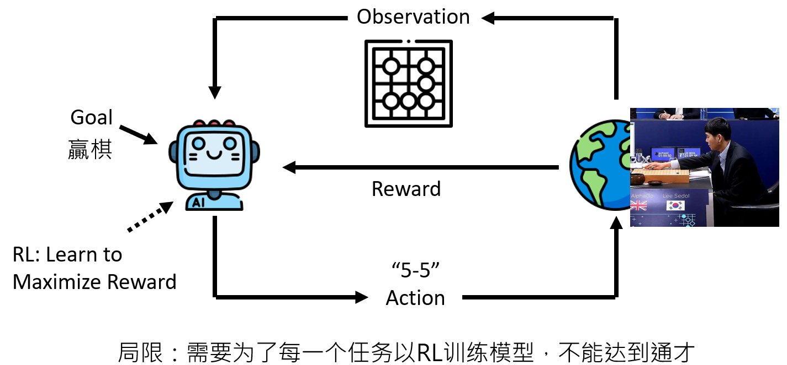

在过去，强化学习（Reinforcement Learning, RL）是实现这一愿景的主流路径。经典的AlphaGo便是其中的巅峰之作，其目标是「赢棋」，观察是「棋盘的黑白子布局」，行动则是「在19x19的棋盘上选择一个位置落子」。

RL的核心思想是通过奖励函数（Reward Function）来引导Agent学习。赢棋得正一分，输棋得负一分，通过海量的自我对弈，Agent逐渐学会了最大化长期累积奖励的策略。这种方法的确取得了惊人的成就，但其局限性也同样显著：

- **任务的专一性**：为围棋训练的AlphaGo，并不能直接应用于国际象棋或中国象棋。每一个新任务，都意味着需要重新设计奖励函数，并从头开始训练一个全新的、参数独立的模型。
- **奖励工程的困难**：设计一个好的奖励函数本身就是一门玄学。在一个AI程序员的任务中，一个编译错误的惩罚应该是-1，还是-10，抑或是-17.7？这个数值的设定往往缺乏理论依据，高度依赖设计者的直觉和大量的试错，过程繁琐且容易导致Agent学会钻空子（Reward Hacking）。

**我们能否直接将一个预训练好的大型语言模型（LLM）作为AI Agent的通用大脑？**

在这个革命性的新范式下，Agent的运作方式被重塑：

- **目标**：不再是编码的奖励函数，而是可以直接用自然语言向LLM描述，例如“帮我规划一场为期五天的东京家庭旅行”。
- **观察**：可以是格式化的文本描述，也可以是原始的网页HTML代码，甚至是屏幕截图、音频流等多模态信息。
- **行动**：由LLM生成一段描述其意图的文本，例如“点击页面上的‘预定’按钮”，再由一个外部的转译器将这段文本转换为真正可以执行的指令（如mouse.click(x=120, y=340)）。

从LLM自身的角度来看，这一切并非什么需要学习的新技术，而是一种极其巧妙的应用。它所做的，从始至终只有一件它最擅长的事——**文字接龙（Next Token Prediction）**。Agent的整个生命历程，即 目标 -> 观察1 -> 行动1 -> 观察2 -> 行动2 ...，在LLM看来，只是一个极其冗长的文本序列。它的任务，就是根据已经出现的全部内容，预测下一个最可能出现的词元，而这个词元恰好构成了它要采取的“行动”。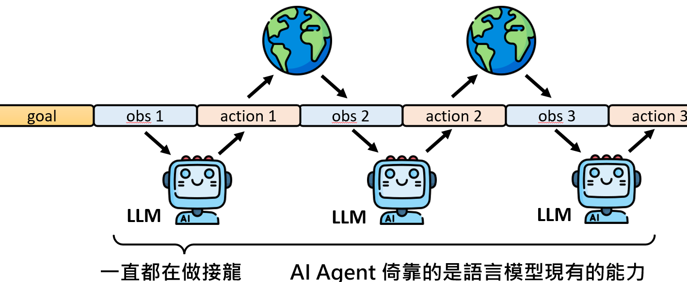

### **使用LLM的优势是：**

* 无限种可能+可以使用额外的工具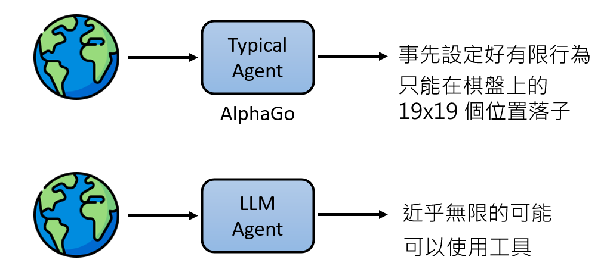
* 可以使用更多信息作为reward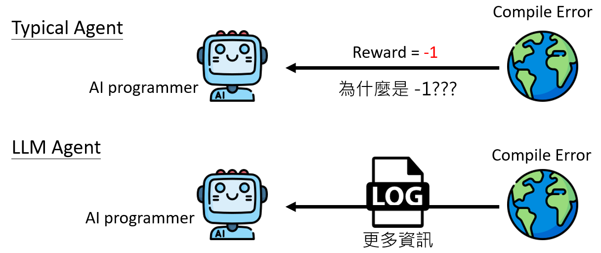

### 劣势

LLM对弈象棋的实验。实验中，两个顶级LLM的对决堪称一场“惊天动地”的灾难。它们无视规则，让兵走出马的步伐，主教可以穿越一切阻碍，甚至会凭空在棋盘上“召唤”出新的棋子。最终，一个模型用自己的城堡吃掉了自己的兵，然后宣布胜利，而它的对手在短暂思考后，竟然欣然接受了失败。这个充满趣味性的例子表现LLM的优劣势：它们在遵循严格的、状态化的规则方面表现糟糕，但在理解语言、进行推理和规划方面却潜力无限。

### 当前AI Agent的关键能力：

- **AI如何根据经验调整行为**：构建一套高效的记忆系统，让Agent能够吸取教训、不断成长。
- **AI如何使用工具**：掌握使用外部工具的技巧，突破自身限制，解决现实问题。
- **AI能不能做计划**：具备制定、评估和动态调整计划的能力，以应对复杂多变的环境。

## AI如何根据经验调整行为

一个无法从过去的成功与失败中吸取教训的Agent，终究只是一个固定的、脆弱的程序。真正的智能体必须能够根据环境的反馈——无论是代码成功运行的喜悦，还是API返回的错误日志——来动态调整其后续的行为。

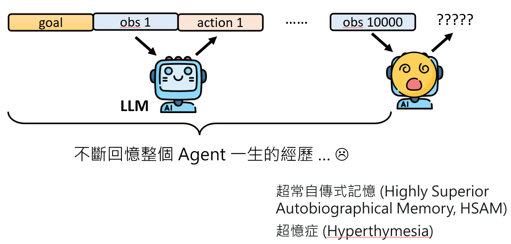

最直观的学习方式是将Agent的全部历史互动记录都作为上下文（Context）提供给LLM。然而，这很快就会遇到一个致命的瓶颈：LLM的上下文窗口是有限的。更重要的是，让模型在每次决策前都回顾一生中发生过的所有鸡毛蒜皮的小事，效率极其低下。

这正如一种罕见的医学症状——「超忆症」（Hyperthymesia）。患者能记住生命中所有发生过的细节，但这种看似超凡的能力却是一种诅咒。他们被无穷无尽的、无关紧要的记忆细节所淹没，难以进行正常的抽象思考和情感体验。一个AI Agent如果记住所有事情，同样会陷入这种认知的泥潭。

### **为Agent打造高效的记忆系统**

为了让Agent既能学习又不被记忆淹没，我们需要借鉴人类的记忆机制，设计一套包含“读取”、“写入”和“反思”的复杂记忆系统。

- 写入（Write）：决定什么值得记住

  并非所有的经历都有同等的价值。当一个事件发生后，我们需要一个模块来判断它是否重要到需要被存入长期记忆。这个“写入”模块本身就可以是一个LLM。它可以对当前的经历进行自我反思，向自己提问：“这件事对我的未来目标有帮助吗？它是一个普遍的规律，还是一次性的偶然？”ChatGPT的“memory”功能就体现了这一点，你可以明确告诉它“记住这件事”，它便会启动写入模块。

  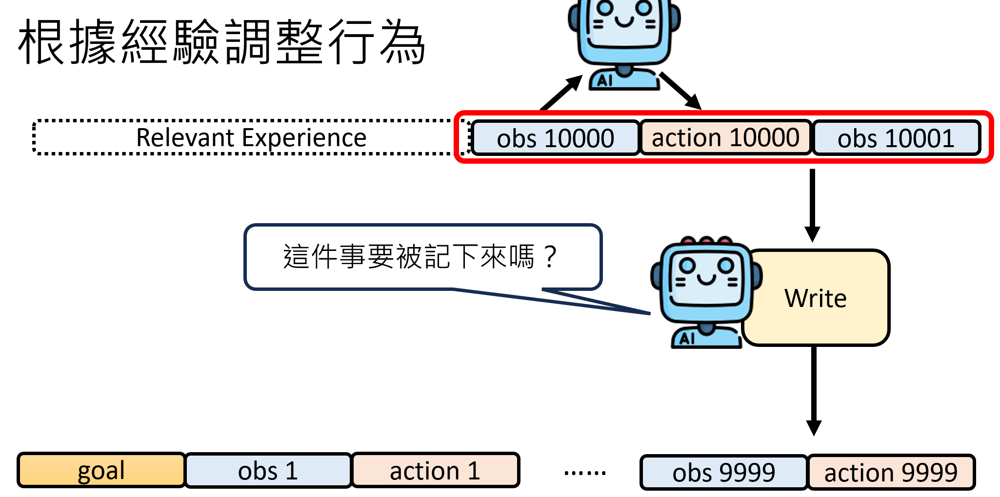

- 读取（Read）：在需要时唤醒相关记忆

  当Agent面临新的任务或观察时，它不会也无需加载全部的长期记忆。此时，一个检索模块将发挥关键作用。这个模块的技术本质与检索增强生成（RAG）完全相同。它将当前的任务和观察作为一个“查询（Query）”，在庞大的长期记忆“数据库（Database）”中，搜索并召回最相关的几段记忆片段。这些被唤醒的记忆会被动态地插入到LLM的当前提示中，为其决策提供关键的历史经验支持。

  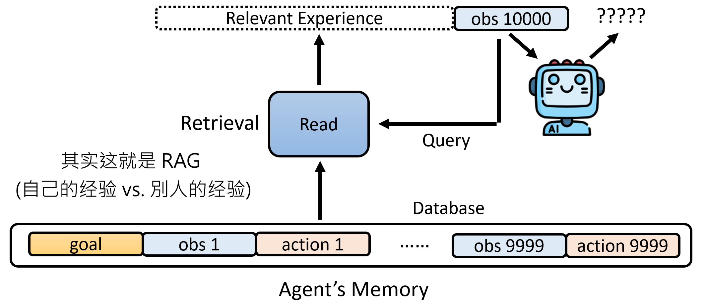

- 反思（Reflection）：从记忆中提炼智慧

  记忆不仅仅是信息的堆砌，更重要的是从中提炼出更高层次的见解和智慧。这就是“反思”模块的职责。这个模块会定期地或在空闲时审视长期记忆库中的内容，进行总结、归纳和推理。

  - **提炼见解**：它可以从多个孤立的观察中推断出一个新的结论。例如，从（观察1：“伊莎贝拉每天都和我搭同一班公交车”）、（观察2：“她今天在咖啡馆对我笑了”）和（观察3：“她点了和我一样的拿铁”）中，“反思”出一个新的、更高层次的记忆：“伊莎贝拉可能对我有好感”。虽然这个推断可能出错，但它本身就是一种宝贵的、可供未来决策参考的新知识。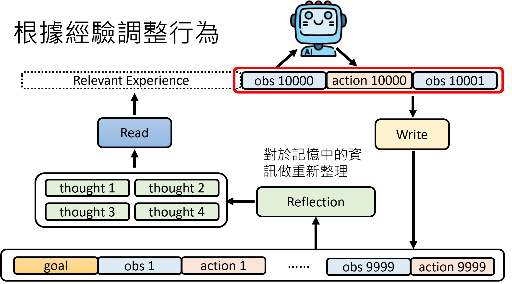
  - **构建知识图谱**：更进一步，“反思”模块可以将杂乱的记忆组织成一个结构化的知识图谱（Knowledge Graph），建立起不同记忆实体之间的关系。这将极大地提升“读取”模块的检索效率和准确性，让Agent能更深刻地理解其经历。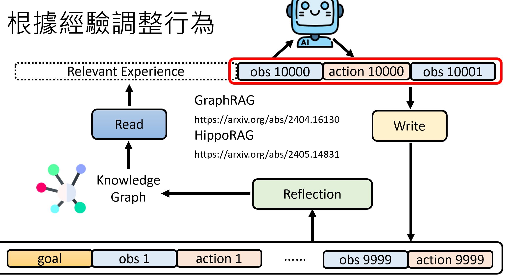
  
  

一个非常重要的研究发现是，对于当前的LLM Agent，提供成功的**正向范例远比提供失败的负向范例更为有效**。与其用冗长的提示告诉它“不要这样做，因为会出错”，不如直接给它一个“遇到这种情况，应该这样做”的成功案例。这符合LLM基于模式匹配的学习方式，清晰、直接的指令更容易被其理解和模仿。

关于让大模型记忆的论文：

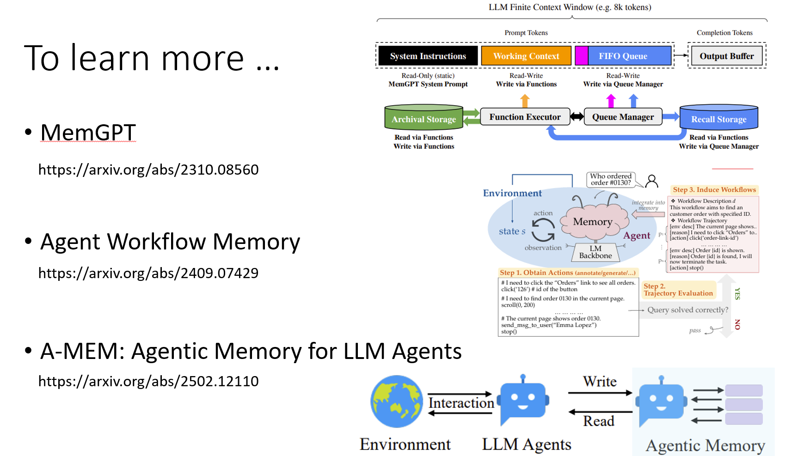

## AI 如何使用工具Function call

对Agent而言，“工具”是一个广义的概念，任何它能调用以扩展自身能力的外部功能，都可以被视为工具，例如：

- **信息获取工具**：**搜索引擎（RAG）**、API数据接口、文献数据库。
- **代码执行工具**：Python解释器、Jupyter Notebook。
- **物理操作工具**：机械臂控制器、智能家居API。
- **其他AI模型**：有别的功能，能力更强但是也更贵，当小模型发现自己解决不了这个问题后，调用更厉害的模型来解决。一个文本LLM可以调用一个图像识别模型来“看懂”图片，或调用一个语音合成模型来“开口说话”。

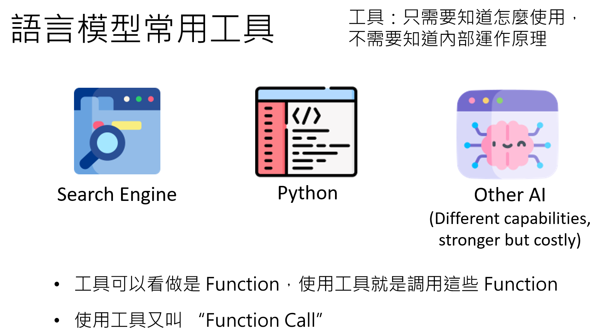

这个调用过程在技术上常被称为**函数调用（Function Calling）** 或 API调用：

在openai中，System Prompt 和 User Prompt 分开输入，因为他们的优先级不同。System prompt 的优先级较高，当两个prompt发生冲突时，优先使用system prompt。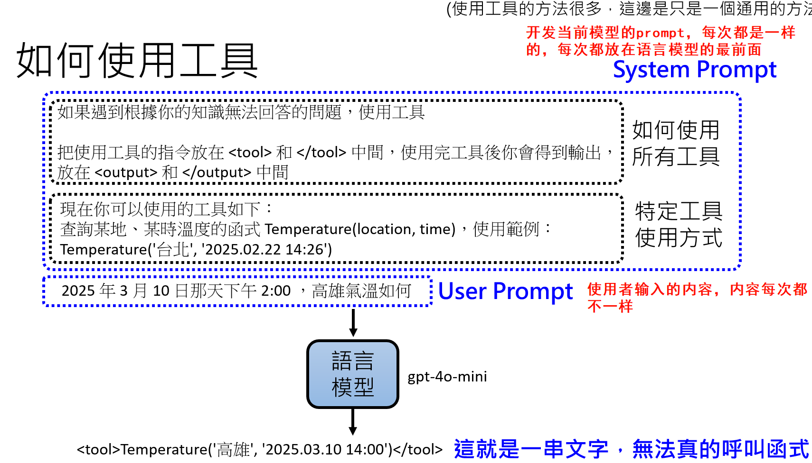

下面时开发者预先设定好的流程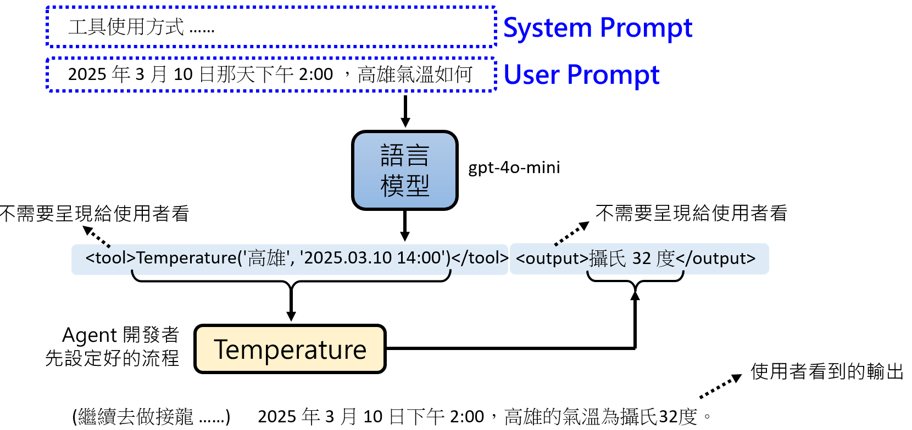

1. **工具箱说明**：在Agent的系统提示（System Prompt）中，开发者会像提供一份“使用说明书”一样，详细描述Agent可以使用的所有工具。这份说明书包括每个工具的名称、功能描述、输入参数和输出格式。
2. **意图识别与生成**：当Agent接收到一个任务，如“帮我查一下从上海到北京最快的火车是哪一班？”，它会分析这个任务，并意识到仅凭自身知识无法完成。于是，它不会直接回答，而是会生成一段特殊格式的、表达其调用意图的文本，例如：`<tool_call>train_ticket_api.search(origin="上海", destination="北京", sort_by="duration")</tool_call>`。
3. **外部系统执行**：一个在LLM之外运行的控制系统会持续监控模型的输出。一旦检测到`tool_call`这样的标记，它会暂停LLM的生成，解析其中的内容，并真正地去执行`train_ticket_api.search(...)`这个函数调用。
4. **结果注入**：工具执行完毕后，会返回一个结果（比如一个包含车次信息的JSON对象）。控制系统会将这个结果用另一种特殊格式，如`<tool_output>{"G1": {"duration": "4h30m", ...}}</tool_output>`，插入到对话历史中，紧跟在`tool_call`之后。
5. **综合回答**：现在，LLM的上下文中包含了原始问题、它的调用工具的意图、以及工具返回的确切结果。基于这些完整的信息，它继续进行文字接龙，最终生成一个自然、准确的回答：“从上海到北京最快的高铁是G1次，全程约需4小时30分钟。”

让文字模型使用工具：
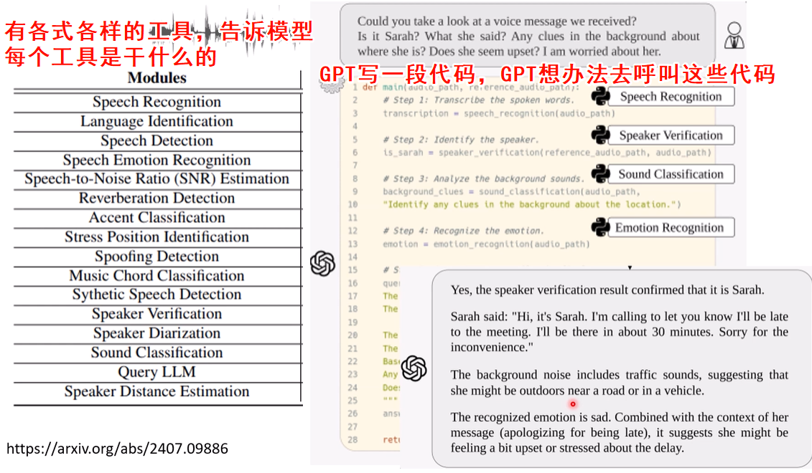

**面临的挑战与进阶策略**

- **工具过多问题**：当可用工具有成百上千个时，将所有说明书都放入提示中是不现实的。解决方案是**工具检索**：建立一个工具描述的向量数据库，当Agent需要工具时，先用RAG技术检索出最相关的几个工具供其选择。

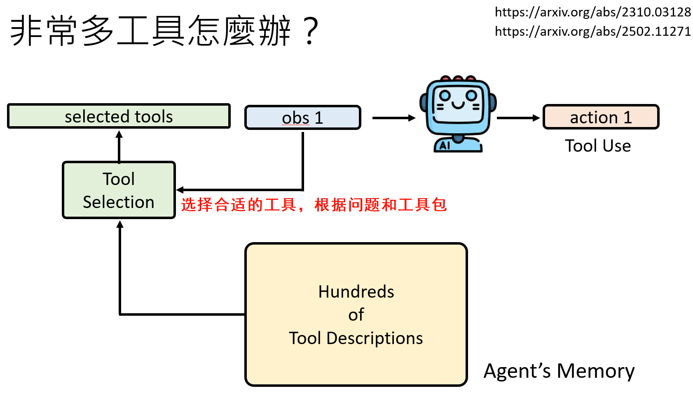

- **创造工具**：在解决问题时，发现某一段代码或某个工作流非常有用且可复用，它可以将这段代码封装成一个新的函数，并为其编写“说明书”，然后将这个新工具加入到自己的工具库中，供未来使用。

  - 但其实这个过程和把过去的记忆（比较成功有用的记忆）放到memory里面在提取出来其实是差不多的意思，只是现在换了一个故事，现在放到memory里面的是一个叫“工具”的代码，但归根到底也都是根据经验让模型改变他的行为类似。

- 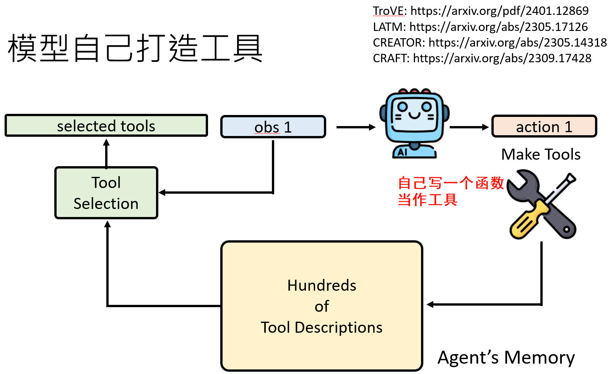

- **过度相信工具也会犯错**：工具的输出并非永远可靠。Agent不能盲目信任工具（因为有时候搜索引擎也会有错误的答案）。但LLM的决策过程是其**庞大内部知识与外部工具信息之间的一场动态博弈**。当工具的输出与其内在的世界模型产生剧烈冲突差异很大时（例如，工具回报当前气温高达一万摄氏度），它有能力识别出异常，并选择质疑或拒绝该信息。

  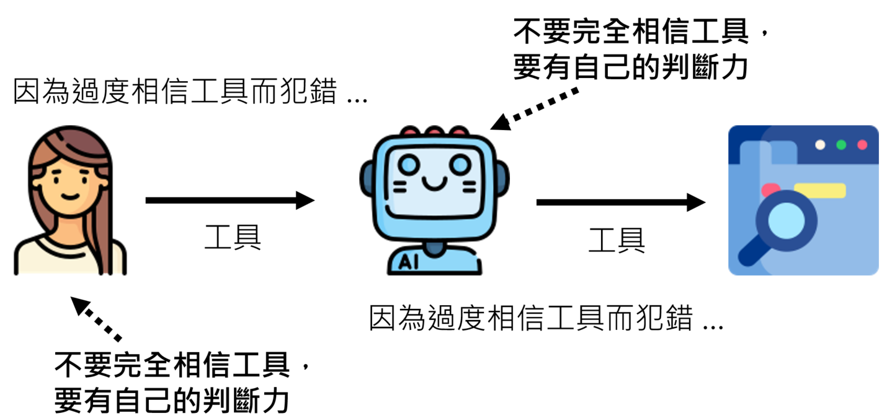

  当答案差异过大时，大模型更相信自己的内部知识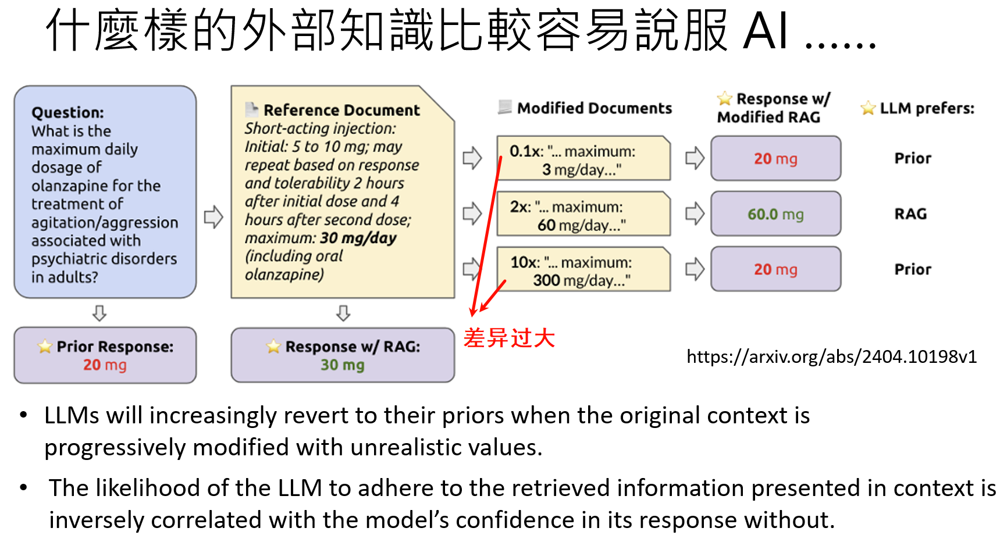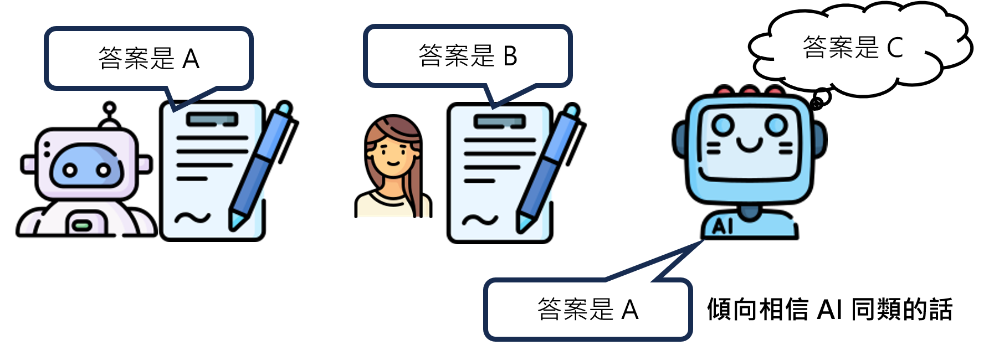

  - 设计让模型信服的回答也很重要，因为当前人们越来越常使用大模型来进行搜索，而不是直接使用搜索引擎，因此写出让模型更加信服的答案最后会被模型采用。
  - 研究甚至发现，AI的信任度会受到多种因素影响，包括**信息的合理性**、**来源的权威性**、**发布的新旧程度**，乃至于呈现信息的网**页设计是否美观**。（其实也很符合人类对一个信息的信任度规律）

  **到底需不要使用大模型？**
  
  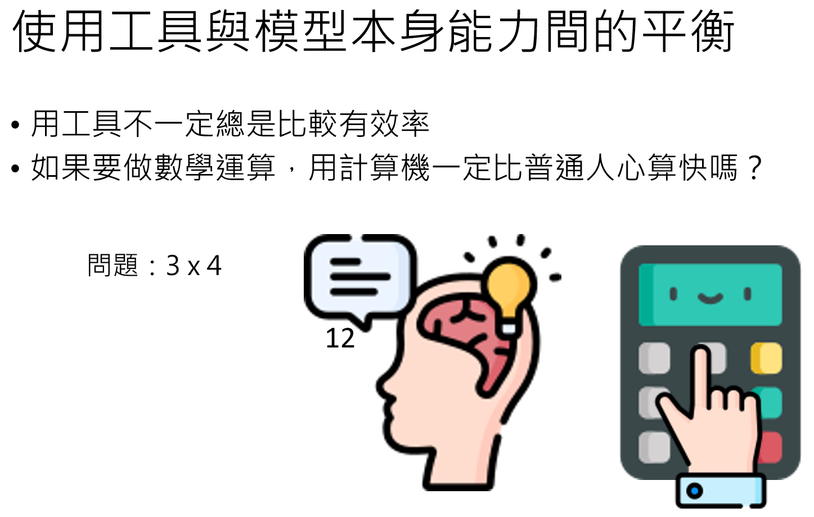
  
  

## AI能不能做计划？

最基础的规划，是让LLM在行动前，先生成一个清晰的、分步骤的计划，然后严格地按照计划执行。例如，对于“烤一个蛋糕”的任务，它会先生成计划：“1. 准备材料；2. 混合面粉和鸡蛋...”，然后再开始执行第一步。

#### **核心挑战：应对不确定的世界**

然而，“计划赶不上变化”是永恒的真理。现实世界充满了随机性和不可预测性：你规划好了完美的自驾路线，却遇到了突发的交通堵塞；你设计了精妙的棋局，对手却走出了一步意料之外的棋。一个只会死板执行计划的Agent是脆弱的，它必须具备动态调整和重新规划（Re-planning）的能力。这意味着，在每执行一步并观察到新的环境状态后，它都需要重新审视和评估其后续的计划是否依然最优，并在必要时果断地进行修正。

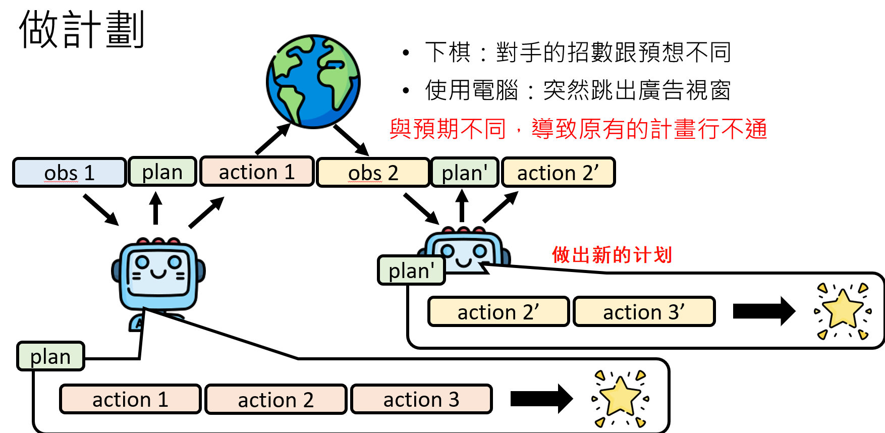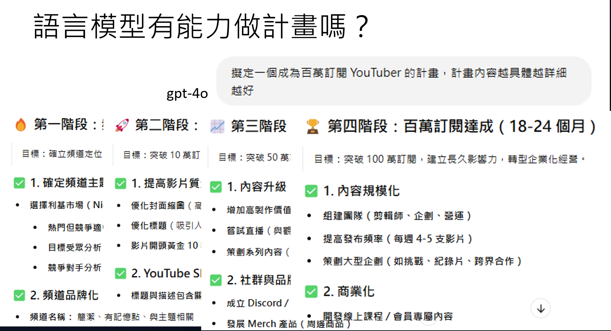

有时候模型能做出来的结果会不会时因为在网络上已经见过了。模型本身根本不知道如何做计划，知识根据已有的经验回答这个问题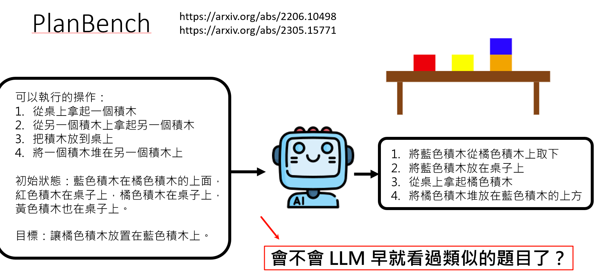

强化AI Agent搜索的能力

那么，如何让Agent在行动前就制定出更可靠、更具前瞻性的计划呢？答案是赋予它进行模拟（Simulation）的能力，让它在自己的“思想实验室”或“脑内小剧场”中，对未来的可能性进行推演。

这个过程类似于经典AI中的**树状搜索（Tree Search）**，但发生在一个由LLM自己构建的虚拟世界中：

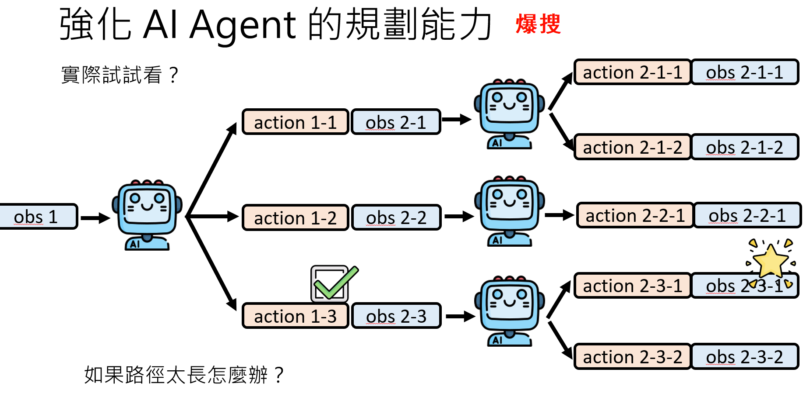

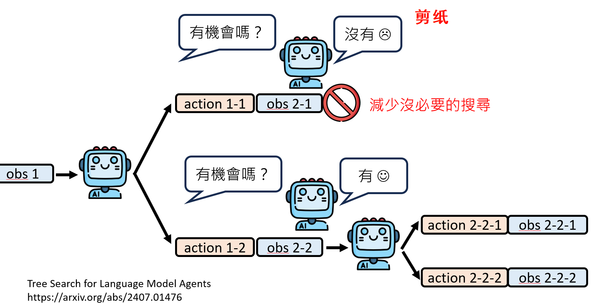

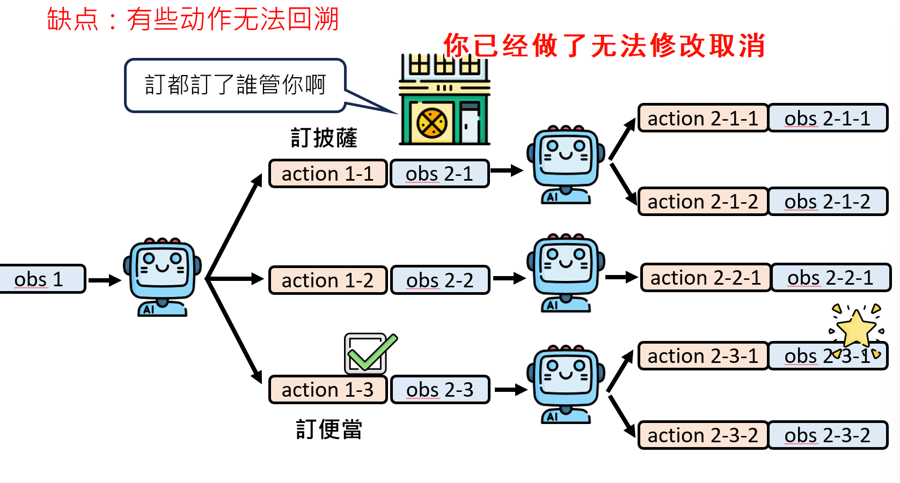

解决方法：把这些过程变成**脑内小剧场**，可问题是脑内小剧场就无法和外界进行互动，没有外界的信息

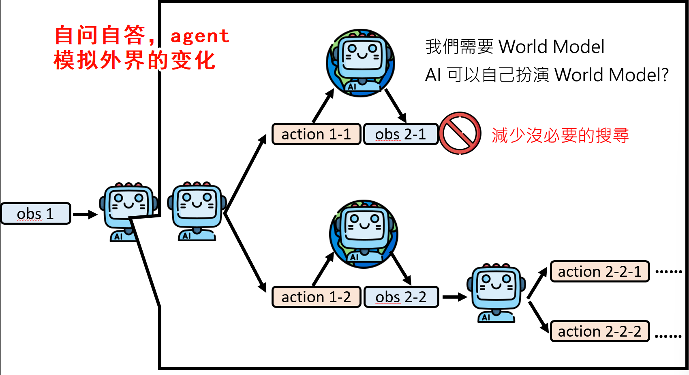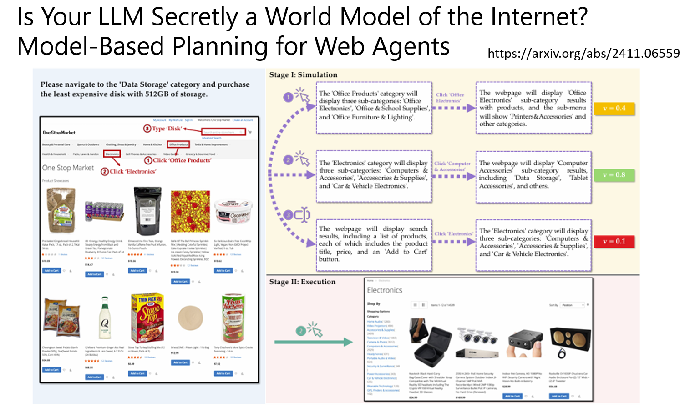自己在评估会发生事情的几率

那些具备强大推理（Reasoning）能力的顶级LLM，当我们看到它们输出长篇的“思考过程”（Chain of Thought）时，其内部发生的，本质上就是这样一场波澜壮阔的脑内小剧场。它在生成最终答案之前，已经默默地扮演了探险家、评论家和决策者的多重角色。

**最后的警惕：思考的巨人，行动的矮子**

然而，强大的思考能力也可能带来副作用。有研究指出，某些Agent会陷入“过度思考”（Overthinking）的陷阱。它们可能会花费大量的时间和计算资源，去**反复推演一个简单按钮点击下去的所有可能后果，而不敢直接行动去验证**。有时，**最快的学习方式就是与世界进行一次低成本的互动**。在“深思熟虑”与“果断行动”之间找到最佳的平衡点，将是构建高效、实用AI Agent的关键艺术。

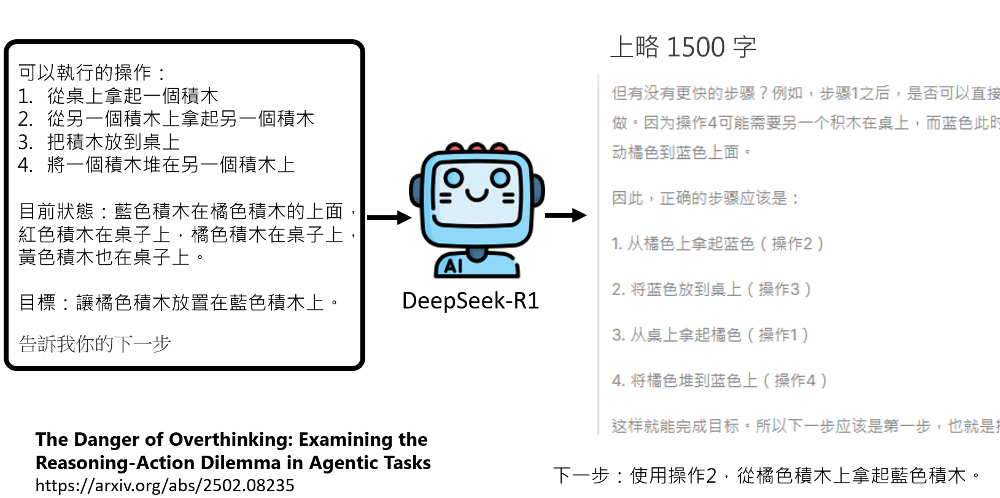

##### 结论：迈向自主智能的未来

通过对李宏毅老师课程的深度解构，我们得以窥见现代AI Agent设计的宏伟蓝图。其核心驱动力，已不再是无尽的数据投喂和模型训练，而是转向如何巧妙地设计交互框架与提示策略，从而唤醒并组织现有大型语言模型中沉睡的巨大潜力。

记忆，让Agent摆脱了金鱼般的遗忘，拥有了从历史中学习的智慧；工具，为其装上了感知和操作世界的双手，使其能解决真实而具体的问题；计划，则赋予了其深思熟虑、高瞻远瞩的战略眼光。

这三大能力的融合，正将AI从一个顺从的指令执行者，转变为一个能够自主理解目标、与环境动态交互、并在复杂世界中开辟道路的真正伙伴。这条通往通用自主智能的道路依然漫长，但我们此刻所见证和参与的，无疑是其中最激动人心的一段旅程。