# 预训练-对齐 Pre-train alignment

> Pretrain-Alignment 很强大
>
> * LLM 在 Pretrain 已经很强，Alignment只是画龙点睛
> * Pretrain段 看过大量各式各样的资料时关键
>
> Pretrain-Alignment 有极限
>
> * 在Alignment阶段往往LLM只是強化原來已经知道的事情难以学习新技能

[大型语言模型的训练过程](../Generative AI/第4讲： 大型语言模型的训练过程.md)

1. **预训练 (Pre-training)**：利用海量的互联网文本数据，通过“文字接龙”（下一个词预测）任务，让模型掌握语言的基本规律和世界知识。
2. **有监督微调 (Supervised Fine-tuning, SFT)**：也称指令微调 (Instruction Fine-tuning)，使用高质量的“指令-回答”对，教模型如何遵循人类的指令进行有用的回答。
3. **人类反馈强化学习 (Reinforcement Learning from Human Feedback, RLHF)**：让人类对模型的多个回答进行偏好排序，再通过强化学习算法，让模型的输出更符合人类的价值观和偏好。

有人类参与的地方===>Alignment 阶段2、3（Finetune） --->希望和人类的需求对齐

## Pretrain 的强大

LLaMA-2-7b-base: 一般后面结尾是base表示只pretrain过，没有进行对齐；

其`base`模型在回答“什么是机器学习？”时，虽然能给出基本定义，但很快就会陷入无休止的重复，无法正常交流。相比之下，**经过对齐**的`chat`模型则能条理清晰、详尽地进行解释。

从量化指标上看，差距更为明显。在MT-Bench基准测试中，Llama 3 70B的`base`模型得分仅为2.7分，而其经过对齐的`instruct`版本得分飙升至8.63分。

**对齐是模型能力提升的关键，而预 训练模型（Base Model）本身似乎贡献不大。**

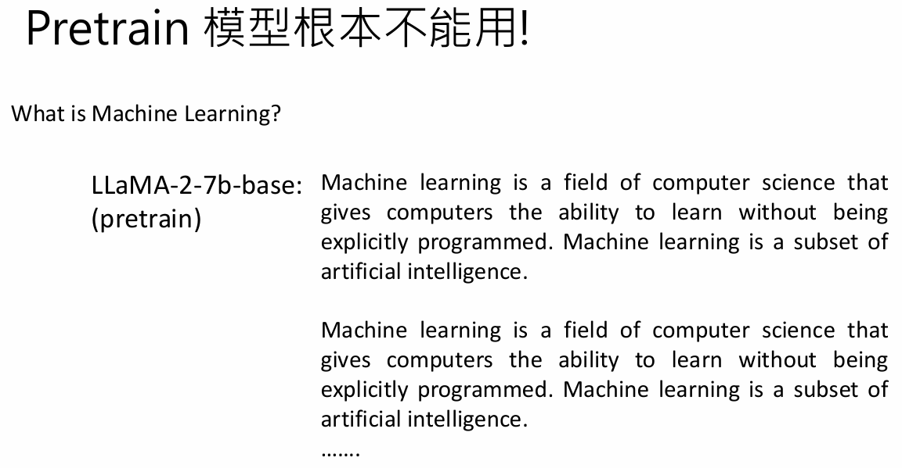

LLaMA2：只用两万多笔**质量高**的数据（Quality is All You Need）进行SFT结果就可以比较好

LIMA: Less Is More for Alignment：只使用了**一千笔资料**（但是是**精挑筛选和作者自己撰写的数据**）对齐之后效果随没有办法达到GPT的效果，但是也能打的有来有回，表现能力很好

Alignment就像一种**画龙点睛**，pretrain只是把龙的主体画出来了

> 但是什么样的资料是好资料？
>
> 画龙点睛  or  画蛇添足

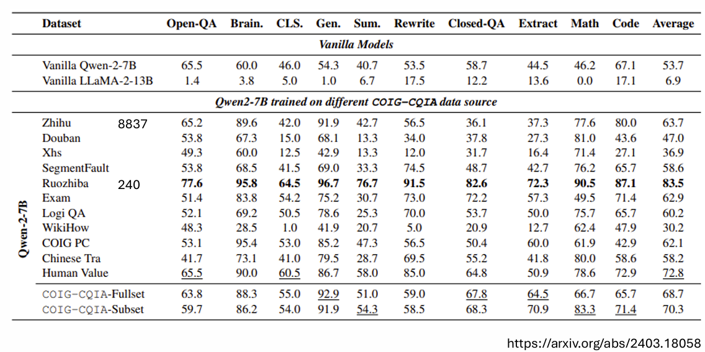

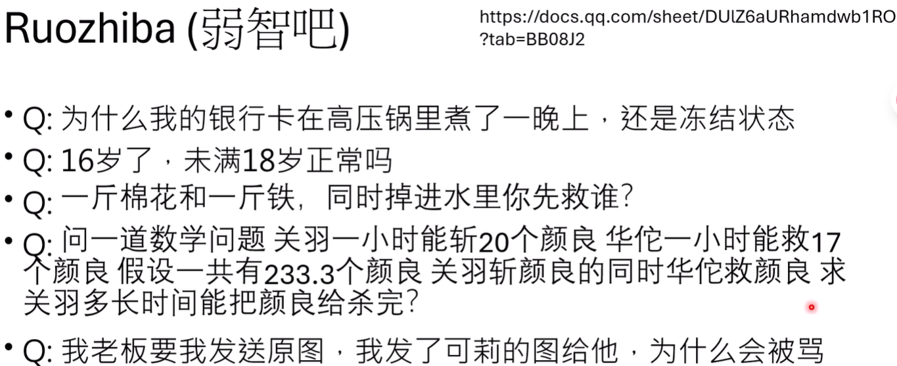

一篇有趣的论文发现，使用来自“弱智吧”的240条问题（答案由GPT-4生成并筛选）对模型进行微调，其效果远超使用8000多条“知乎”问答数据。研究者推测，这可能是因为“弱智吧”的问题形式更多样化，更能激发模型的潜力。但更深层的原因，或许在于其答案来源于强大的GPT-4，这本质上是一种**知识蒸馏 (Knowledge Distillation)**

**知识蒸馏**

使用知识蒸馏可以显著减少训练成本（但是这里的成本并没有包含需要对老师模型训练的资料，以及对老师模型产生结果清理的费用）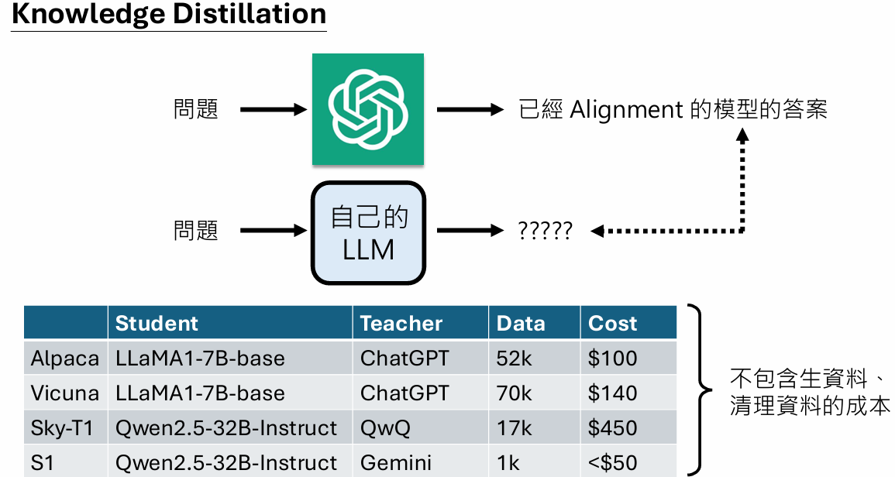

> 教师生成的资料哪些是好的？如何筛选
>
> 教师模型的能力也有限，生成的资料不一定正确

1. **AlpacaGasus**项目使用一个LLM来为Alpaca的5万条数据打分，只保留高质量部分进行训练，取得了更好的效果。

2. 《Long Is More for Alignment》：**直接选择答案最长的那1000条数据**。用这种方法训练出的模型，在多项评测中击败了使用更复杂方法筛选或人工精选数据的模型。

   *是否是因为打分的大模型更偏好于长答案*

> 对教师和学生模型进行提问，哪些是好问题？是否一定需要精心设计的问题？

实验将网络文本随机切成两半，将前半句作为“输入”喂给GPT-4，让其续写后半句作为“答案”。（甚至不是一问一答的问题）用这种看似无意义的“非问答”数据对`base`模型进行微调，效果惊人，甚至超过了官方发布的`instruct`模型。

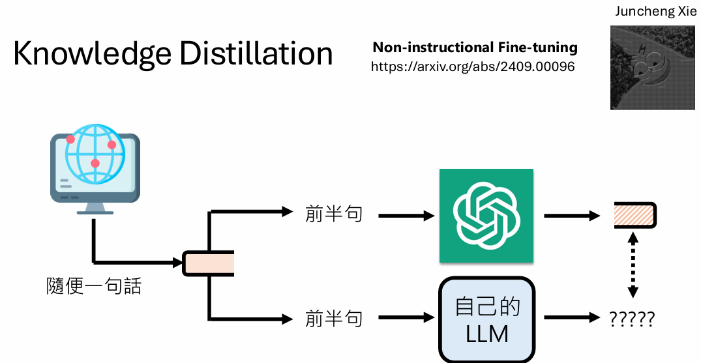

*是否是因为学生模型学到了大模型偏好*？

*数据越怪效果越好？*

**对齐过程，在很大程度上是对模型输出风格、格式和行为模式的调整，而非知识的灌输。**

> alignment前后模型到底变了哪些地方

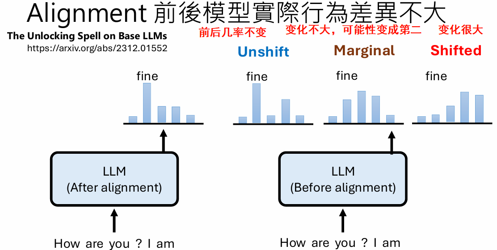

结果显示模型对齐前后行为并没有很大差异，且shift的数据大部分是连接词（还有结束符在每种情况中都出现了）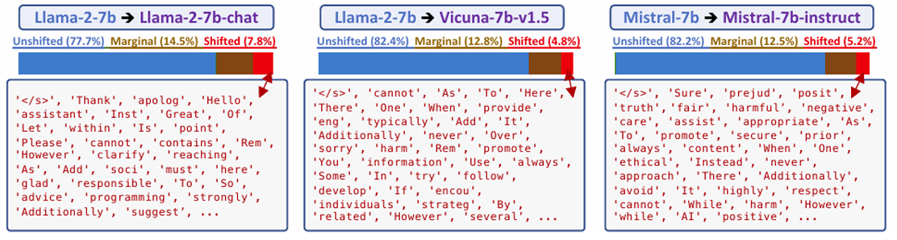

> 根据上面的结果发现alignment并没有改变特别多，是不是表明alignment这个过程其实很容易?

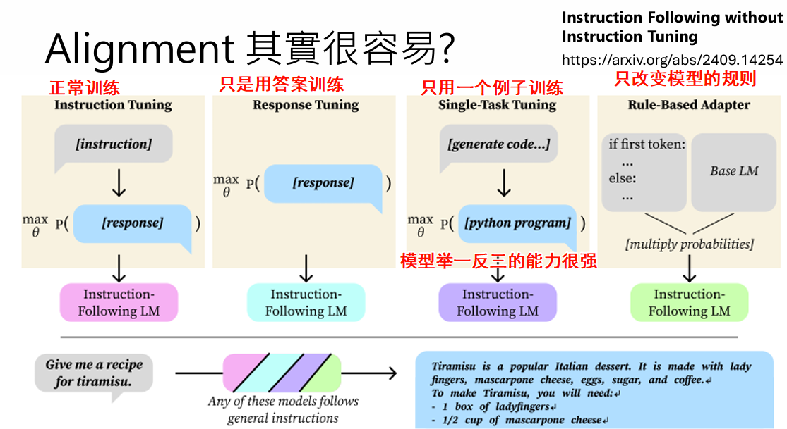

指定规则

1. 限制生成长度：很多base模型一问问题就会说个不停
2. 手动改变一些符号出现的概率（像之前的实验中对齐前后shift的词）
3. 避免出现很多重复的词

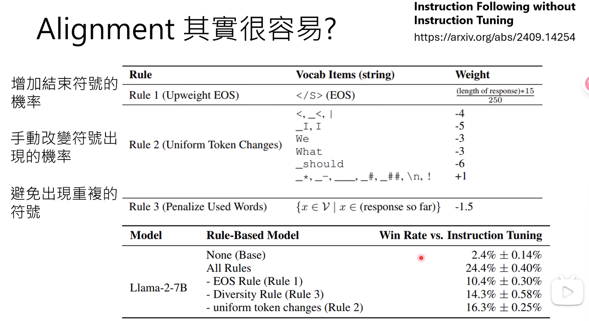

结果会发现只使用规则也能使模型能力提升===>alignment 确实改变的东西不是很多且训练起来比较容易

> 既然alignment改变没有很多，那么是否可以让他自己训练自己呢？

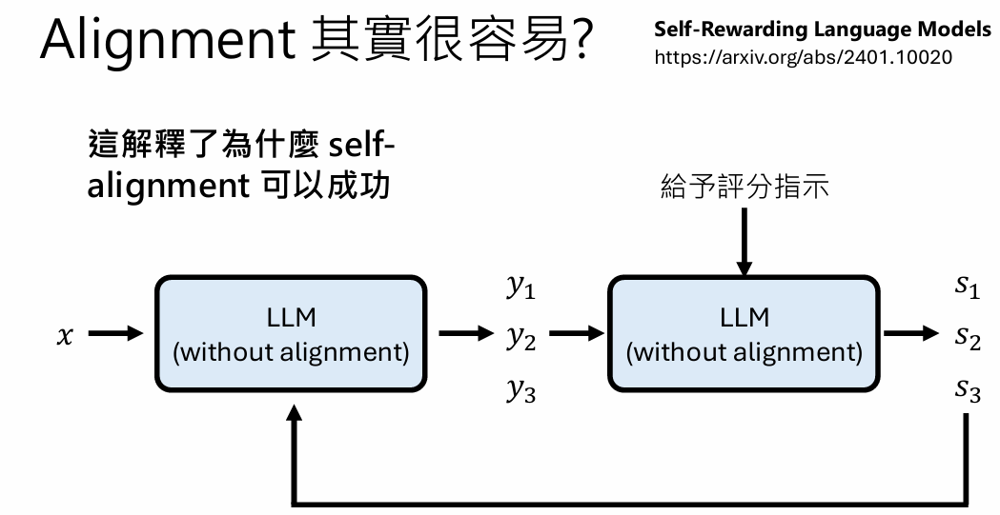

以上结果看来，alignment实际改变不多，真正起到牛的占大头的还是pretrain

> 如何有效的pretrain?
>
> 思考语言模型是如何学习的--->仅仅知识文字接龙，而不是学到这个事实

如果只输入一次信息，模型其实并不能学到这个知识

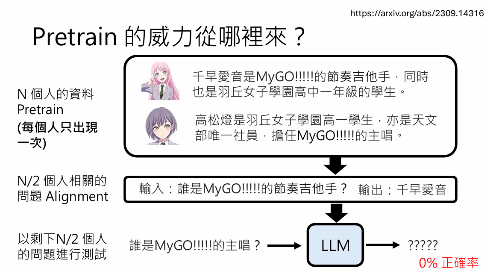

模型知识记住了这句话，无法自己“解耦”这句话的相关信息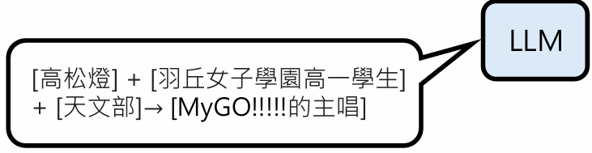

如果一个事实大量多次改写，模型就可能真正的“记住”，文字接龙正确答案出现的概率就会变高

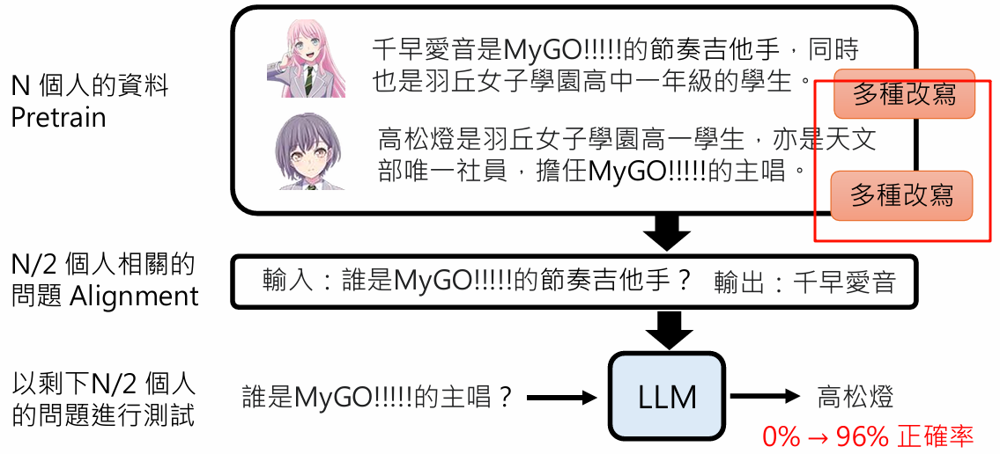

并不需要所有实体都拥有多样化的描述。只要预训练数据中有**一部分**实体被多样化地介绍，模型就能学会这种“解耦和泛化”的能力，并将其应用到那些只见过一次描述的实体上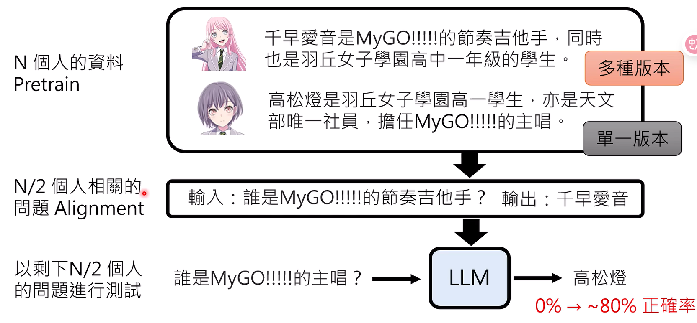

**所以资料就是越多越好，重复改写的次数越多越好**，**预训练数据的多样性**

>网络上的资料会不不够

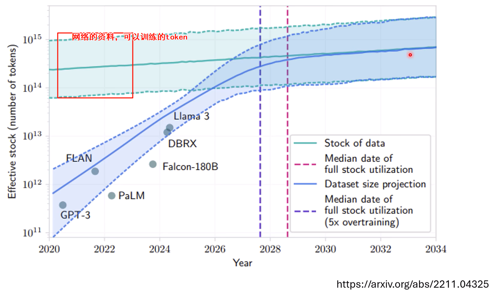

huggingface[15T的token](https://arxiv.org/abs/2406.17557)

不一定资料越多越好

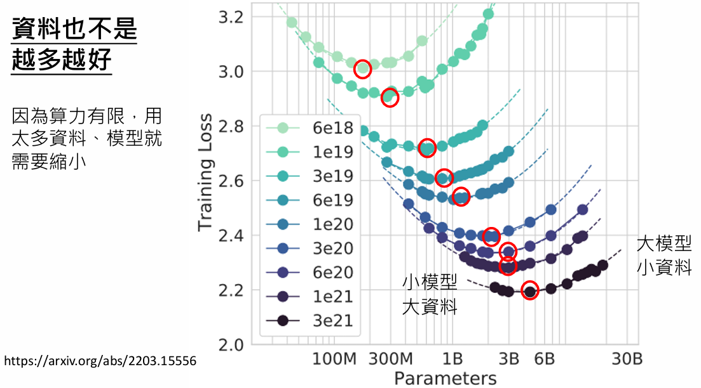

在有限的算力、固定的模型下应该看**更多不同的资料**（处理数据应该取出很多重复的资料？maybe会过拟合）

[资料过滤](https://arxiv.0rg/abs/2406.17557)

预训练的资料质量越高效果越好

[Rephrasing the Web](https://arxiv.org/abs/2401.16380)

[Textbooks Are All You Need](https://arxiv.org/abs/2306.11644)

## Alignment的极限

> 对齐只是“行为调整”而非“知识注入”
>
> 感觉alignment只是对模型输出风格、格式和行为模式的调整，那会不会有极限呢？

一篇研究将对齐数据分为四类：`Highly Known`（基础模型已知的）、`Maybe Known`（换个问法就能答对的）、`Weakly Known`（采样输出时偶尔能答对的）和`Unknown`（完全不会的）。

实验结果表明：

- 模型在学习`Known`（尤其是`Maybe Known`）类数据时，性能提升最快。
- 当强制模型学习`Unknown`的新知识时，它不仅学不会，反而会在测试集上的表现开始**下降**，出现灾难性遗忘。

测试是使用没有见过的知识

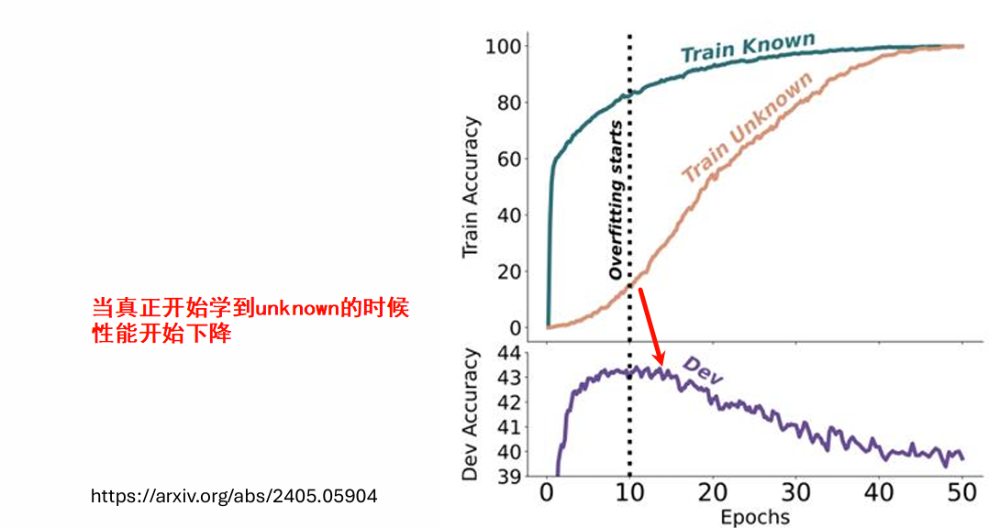

这说明，**更alignment擅长“激发”模型已有的、或潜在的知识，而不是“教会”它全新的东西。** 这也解释了为何RLHF是有效的：它鼓励的是模型自发产生的、好的回答（即模型本来就能做到的行为），而不是强迫它学习无法理解的内容。

## pretrain的后遗症

1. GPT-4能轻易解开`rot13`（字母位移13位）密码，却难以处理`rot8`。原因很可能是在预训练数据中，`rot13`作为一个网络梗和常见的弱加密示例，出现了无数次，而`rot8`则很少见。模型并非学会了通用的凯撒密码解法，而是“记住”了`rot13`这个特定模式。

pretrain时看到不该看的东西，很难真正消除这些参数，只是抑制了这些参数出现的概率，但是并不会真正删除

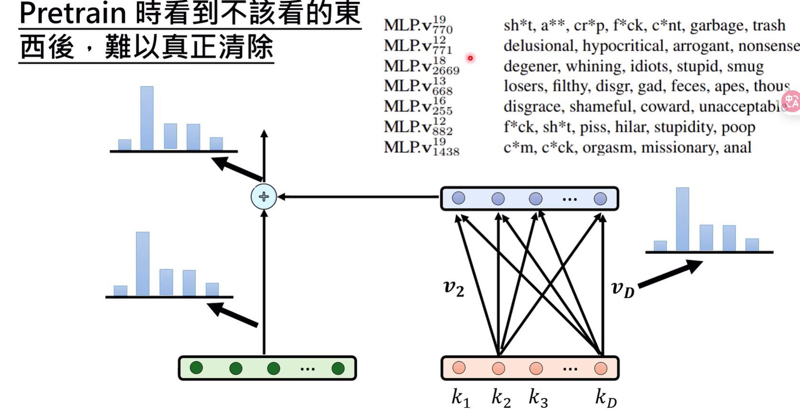

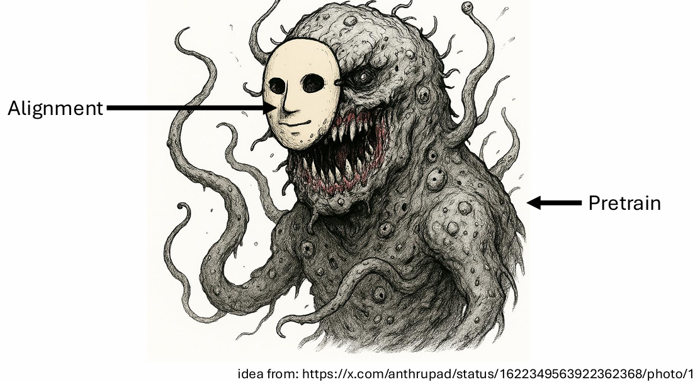