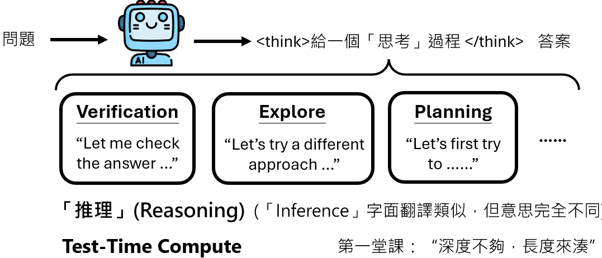
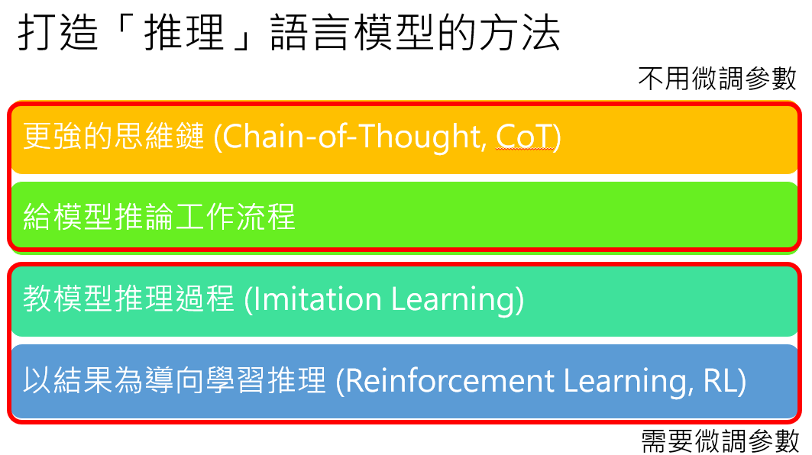
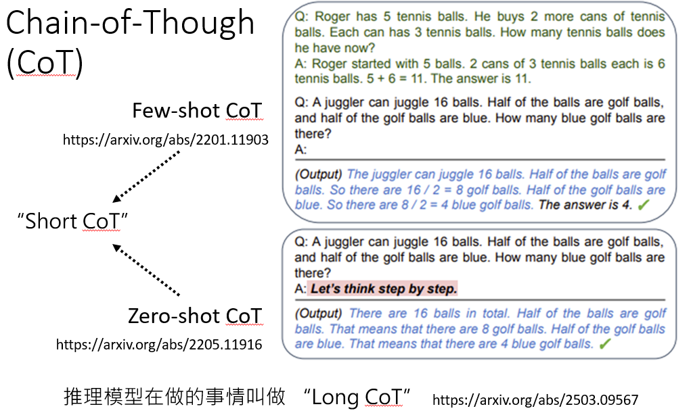
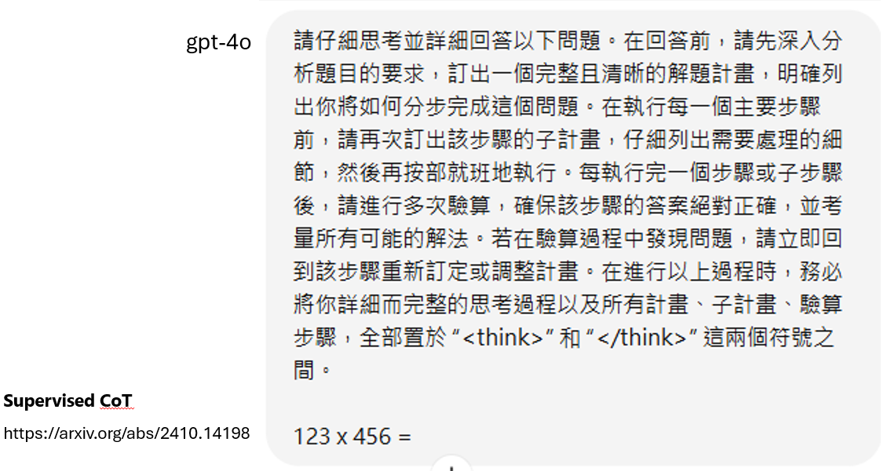
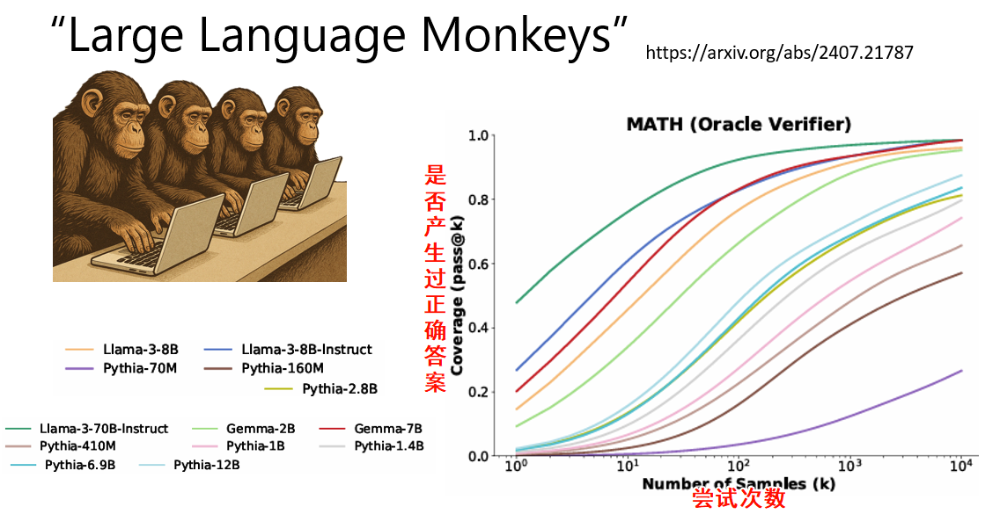
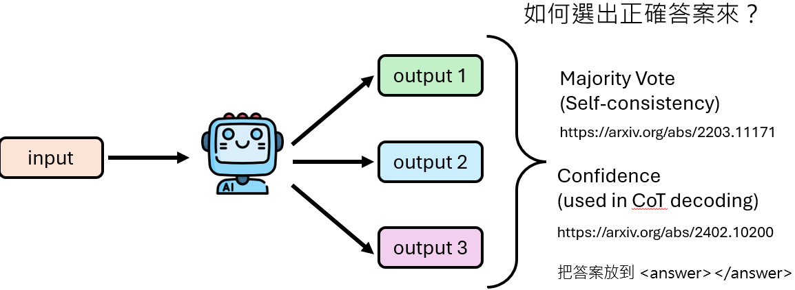
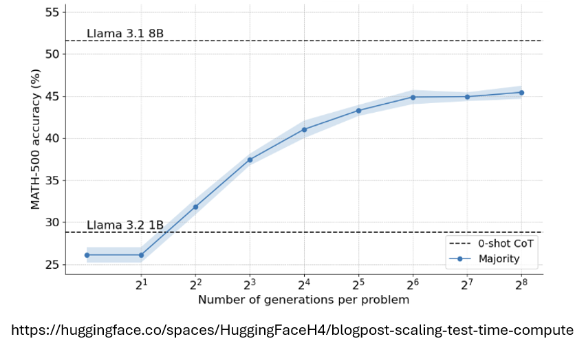

# 深度思考Reasoning

Reasoning过程：

1. verification 是否正确

2. explore 有没有别的方法

3. 尝试计划

   

“Monte Carlo tree search”，即蒙特卡洛树搜索。它是一种启发式搜索算法

## CoT

 

告诉模型如何“think step by step”

但是只适用于能力比较强的模型， 能力弱的模型没有办法读懂根据Supervised CoT生成正确的思考过程

 ## 给模型推理流程

> 愚者千虑，终有一得

让模型回答次数足够多， 总会有一次（太弱的模型也不行）得到正确答案

如何知道哪个是正确答案？

### Majority Vote

对多次生成的答案进行投票

Llama 1B在多次生成答案后进行Majority Vote 的结果明显好于原始模型