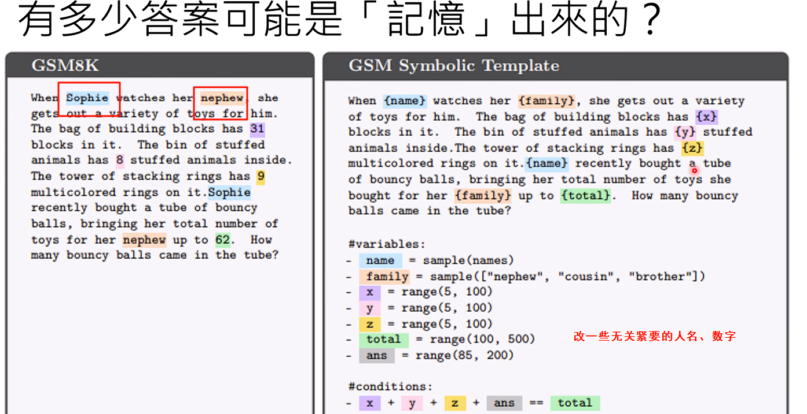
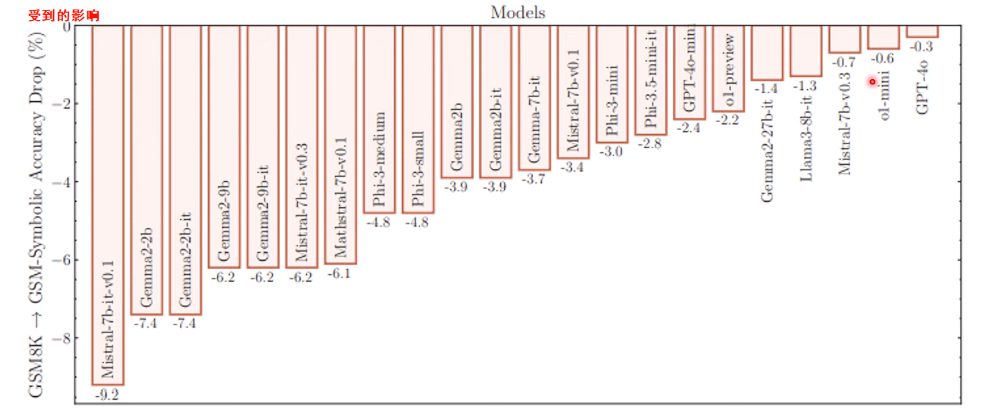
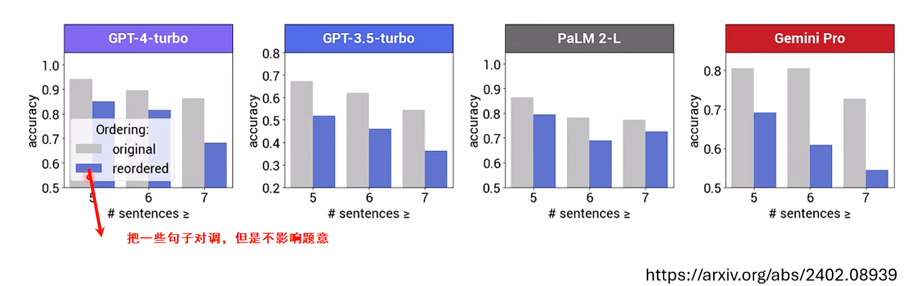
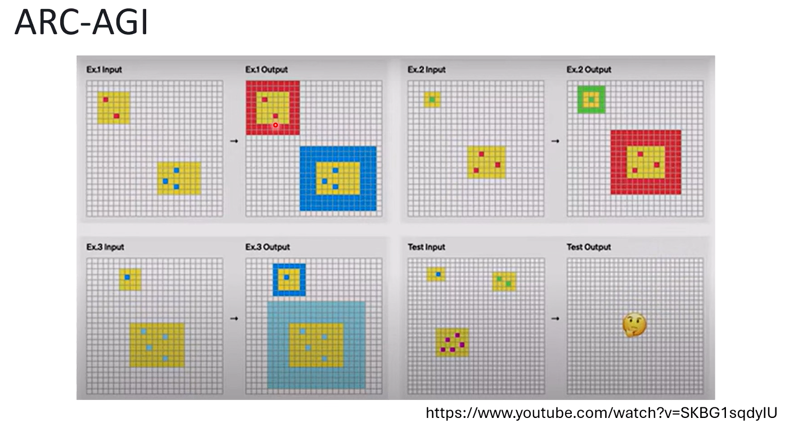
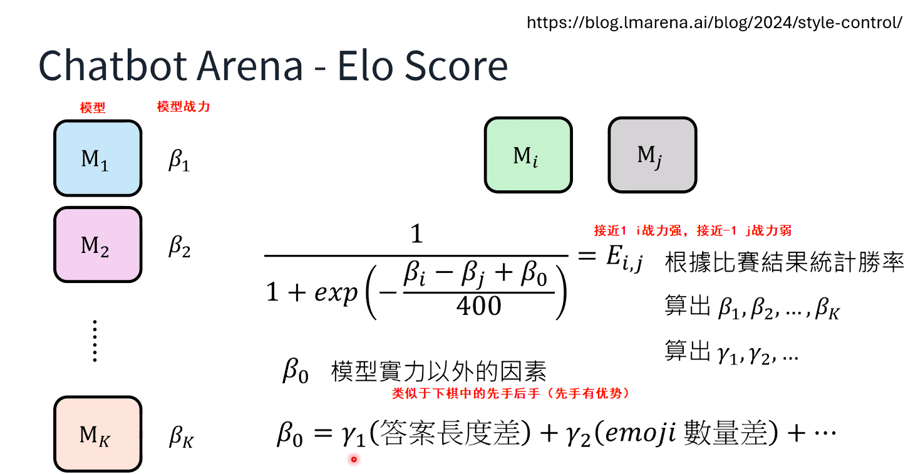
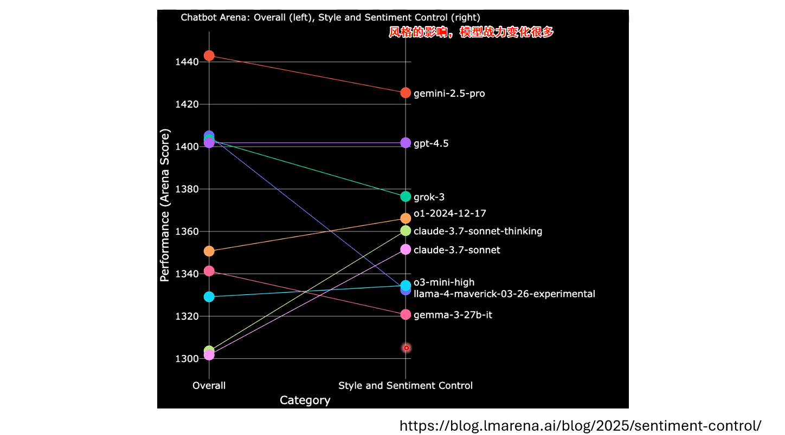
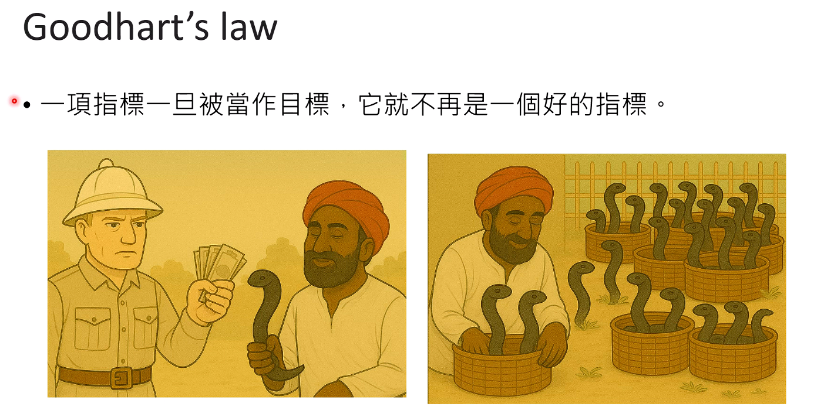

# 大语言模型评估

大部分评估是看模型的解数学题能力？

但是那会不会导致模型只会解数学题，其次会不会有些题目只是模型见过，把答案背下来了？

模型的训练资料太广，可能或多或少都会看到过一些题目（可能是别的语言的同一个题目）

因此如果能有一种题目是模型在预料资料中没有办法学到的就好了

ARC-AGI : 一种智力游戏，在网上找不到

但是想要hack这种比赛，是不是可以自己生成成千上万个这样的智力游戏然后狠狠练习呢？

随机给定两个模型，全世界的人问各种各样的问题，一起来评判，是否可以真正公平的评比呢？

> 人类也会有喜欢的风格，比如更多的emoji、更多的加粗字体等等......

所以不管怎么样，一旦以某一个指标为目标，就会被hack

**摘要：**
随着大型语言模型（LLM）的推理能力日益增强，如何公平、准确地评测其“智力”水平，成了一个极其棘手的问题。本文基于李宏毅教授的最新课程，深入探讨了当前LLM评测面临的困境。文章首先揭示了标准数学和编程测试背后可能存在的“数据污染”问题，即模型可能是在“背答案”而非真正地推理。随后，文章考察了两种试图规避此问题的先进评测方案：以抽象智力测验为核心的ARC-AGI，以及以全民投票为机制的Chatbot Arena。然而，即便是这些方案，也分别面临着被“应试技巧”攻破和被“人类风格偏好”干扰的风险。最终，文章以“古德哈特定律”和“眼镜蛇效应”为警示，引出对当前评测体系的反思：当评测指标本身成为模型优化的唯一目标时，我们是否正在偏离打造真正智能的初衷？

------

#### **1. 数学题的“假象”：是真推理，还是“背答案”？**

当前，评测一个LLM推理能力的主流方法简单而粗暴：直接用高难度的数学题（如AIME数学竞赛题）和编程题来“考试”。模型答对了，就被认为具备强大的推理能力。各大顶尖AI公司的技术报告，无一不将此类榜单的成绩作为展示其模型实力的核心证据。

但一个根本性的疑问始终存在：模型是真的在一步步逻辑推理，还是仅仅因为它在海量的互联网训练数据中“恰好”见过这道题或极其相似的题目，然后“装模作样”地复现出记忆中的答案？

##### **1.1 “换汤不换药”的测试：当模型遭遇小改动**

为了验证这一疑虑，研究者们进行了一系列精巧的实验。一篇论文针对著名的GSM8K数学应用题数据集进行了“微扰”测试，在完全不改变题目难度和解题逻辑的前提下，做出一些细微修改：

- **替换人名：** 将题目中的“Sophia”换成其他名字。
- **替换无关词汇：** 将“侄子”换成其他亲属称谓。
- **替换数字：** 改变题目中的具体数值。

结果显示，绝大多数模型在面对这些“换汤不换药”的题目时，正确率都出现了不同程度的下降。这一现象有力地暗示，模型在训练中确实对特定的题目模式产生了“记忆”，而非完全依赖纯粹的逻辑推理。另一项研究甚至发现，仅仅是将题目中的句子顺序颠倒（在不影响语义理解的情况下），同样会导致模型的正确率下滑。

##### **1.2 “污染”无法根除：数据清洗的局限性**

有人可能会提议，解决方案很简单：只要在训练数据中，把所有已知的测试题都清洗掉不就行了？然而，这种“数据去污”（Decontamination）的方法在实践中几乎不可能彻底执行。

试想，有人可能将GSM8K的题目翻译成蒙古文发布在某个小众论坛上，而这个内容恰好被模型的网络爬虫抓取并用于训练。由于顶尖LLM已具备强大的跨语言理解能力，即便它看到的是蒙古文，也相当于“偷看”了这道题。我们不可能将所有测试题翻译成全世界的所有语言，再去进行地毯式的排查。因此，我们永远无法100%确定，模型在接受测试时，是否早已对题目“了然于胸”。

#### **2. 寻找“纯粹”的试金石：从抽象推理到人类偏好**

鉴于传统题库的不可靠性，学术界和工业界开始探索更“纯粹”、更难被“污染”的评测方法。

##### **2.1 抽象推理的堡垒：ARC-AGI的挑战与代价**

ARC-AGI（Abstraction and Reasoning Corpus - Artificial General Intelligence）是一个旨在测量“纯粹智能”的基准测试，由Keras框架的作者François Chollet创建。

- **形式：** 它由一系列抽象的图形智力测验题组成。系统会给出几组“输入-输出”的范例，要求模型观察并推断出其中的转换规则，然后应用于一个新的输入图形上。
- **优势：** 这类题目高度抽象，在互联网上几乎不存在现成的答案，被认为能有效避免“背题”问题。ARC-AGI自2019年问世以来，AI模型的性能提升一直非常缓慢，不像其他基准测试在短时间内就被“刷爆”，因此被视为衡量真正推理能力的“硬骨头”。
- **突破与代价：** 近期，OpenAI的`o1`系列模型在ARC-AGI上取得了惊人的突破，其最高性能甚至超越了普通人类，接近顶尖理工科学生的水平。然而，这份成绩单的背后是**天文数字般的计算成本**——据报告披露，模型回答**一题**就需要耗费相当于**1000美元**的算力。
- **能否被“攻破”？** 尽管如此，李宏毅教授认为，即便是ARC-AGI也并非牢不可破。既然题目的“范式”是已知的，就完全有可能通过程序自动生成数千万道类似的题目，对模型进行专项“应试训练”，从而“破解”这个测试。

##### **2.2 全民公投的舞台：Chatbot Arena的机制与偏见**

既然任何固定的题库都有被“应试”攻破的风险，那么能否让全世界的人类用户来充当“考官”呢？这就是**Chatbot Arena**背后的思想。

- **机制：** 用户访问平台后，系统会随机提供两个匿名的模型（模型A和模型B）。用户向它们提出同一个问题，然后根据回答的质量，投票选出自己更喜欢的一个。
- **ELO评分系统：** 平台利用这些成对的比赛结果，为每个模型计算出一个类似国际象棋的**ELO等级分**，从而生成一个动态的、被广泛引用的LLM排行榜。

这种“全民公投”的方式，因其题目的开放性和不可预测性，被认为很难被传统方法“攻击”。但它真的无懈可击吗？

#### **3. 当评测本身被“攻击”：风格、偏见与ELO修正模型**

事实证明，Chatbot Arena可以被另一种方式“攻击”——利用**人类固有的认知偏见**。

##### **3.1 人类的“偏心”：表情包和加粗体的影响力**

社区中流传着一些“传说”：在Chatbot Arena上，如果你的模型回答更长、更多地使用**Emoji**、或更善于运用**加粗、项目符号**等排版格式，它就更容易获得用户的青睐。

这背后是一个深刻的洞察：当一个普通人评判一个远比自己聪明的AI时，他往往无法判断其回答内容的深层正确性。这就像听一个诺贝尔奖得主演讲，你无法验证他的理论，只能根据一些表面特征来评价，比如“他讲话真风趣”、“PPT做得真漂亮”。同理，用户在无法辨别两个AI答案的优劣时，自然会倾向于那个“风格”更讨喜的。

##### **3.2 剥离风格滤镜：修正ELO模型如何还原“真实战力”**

Chatbot Arena的运营方也意识到了这个问题，并开发出了一套更复杂的**修正版ELO评分模型**来剥离风格偏见。

- **标准ELO模型：** 模型的胜率只取决于双方的“战力”（`βi`和`βj`）之差。
- **修正ELO模型：** 在“战力”之外，引入了一个**偏见项`β0`**。这个偏见项是各种风格因素的加权总和，例如：
  `β0 = γ1 * (长度差异) + γ2 * (Emoji数量差异) + ...`
- 通过对海量比赛数据进行统计回归，系统可以计算出每个风格因素的影响权重（`γ`值）。如果在最终计算排名时，将这些由风格造成的“偏心分”剔除，就能得到一个更接近模型“真实战力”的排名。

修正后的结果令人震惊：许多模型的排名发生了巨大变化。例如，以能力强大但“说话无聊”（很少用Emoji）著称的Claude系列模型，在剔除风格影响后，其排名大幅跃升。这证明，**在未经修正的评测中，模型的“口才”和“排版技巧”在很大程度上影响了其最终得分。**

#### **4. 总结：“眼镜蛇效应”的警示——我们究竟在评测什么？**

从数学题的“数据污染”，到ARC-AGI的“应试”风险，再到Chatbot Arena的“风格偏见”，我们发现，寻找一个完美、绝对公平的LLM评测指标，或许是一个不可能完成的任务。

这引出了经济学中一个著名的定律——**古德哈特定律（Goodhart’s Law）：**

> “当一项指标成为目标时，它就不再是一个好的指标。”

一旦所有AI公司都将目标设定为“在某个特定排行榜上取得高分”时，它们努力的方向就会从“打造更通用的智能”，异化为“研究如何在这个特定测试中拿高分”。

这个现象可以用一个更广为人知的故事来诠释——**“眼镜蛇效应”**：

> 英国殖民时期的印度，政府为解决蛇患，颁布法令奖励民众上交眼镜蛇。起初效果显著，但很快，人们发现了一条“致富之路”：自己在家中大规模养殖眼镜蛇，然后拿去换取赏金。最终，该政策不仅没能消灭蛇患，反而导致眼镜蛇数量激增。

今天我们对LLM排行榜的狂热追逐，又何尝不是在“悬赏眼镜蛇”呢？过分在意一个或几个评测指标，只会让模型的进化走向“应试化”的歧途。这堂课的最终结语或许是：我们需要从对排名的执念中跳脱出来，回归到对智能本质的探索，否则，我们所有的努力都可能被精心设计的评测系统所“异化”。