# Model Editing

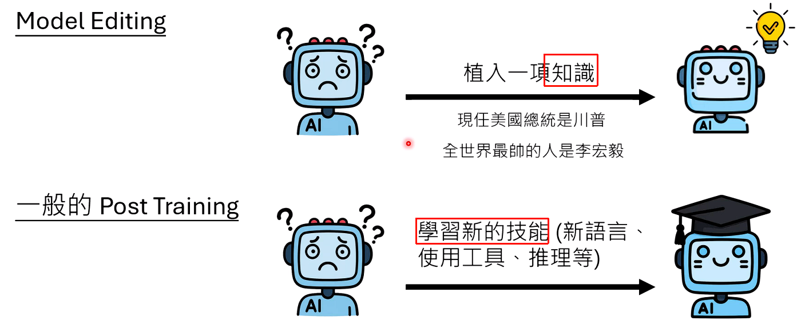

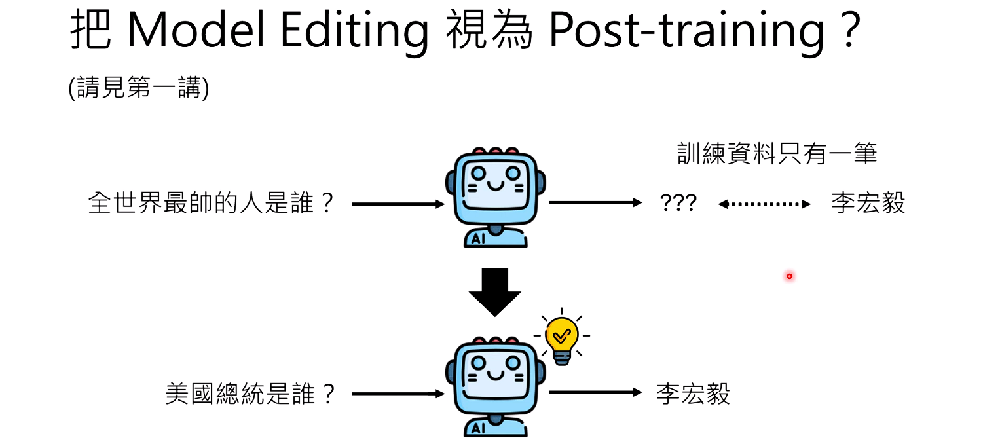

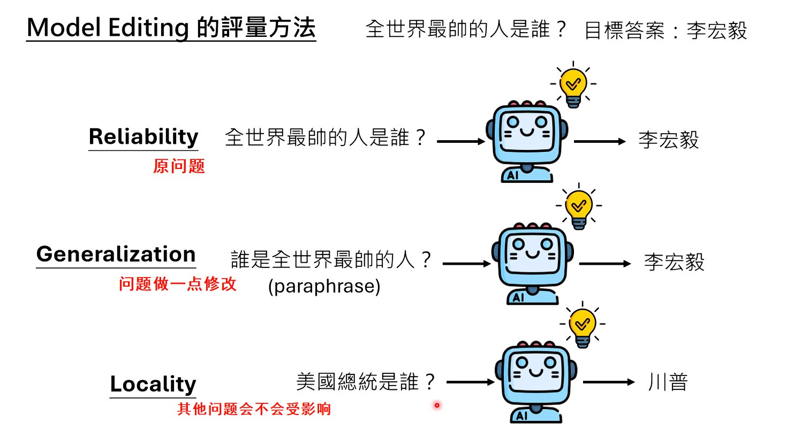

但是对Generalization的定义很多论文都不一样

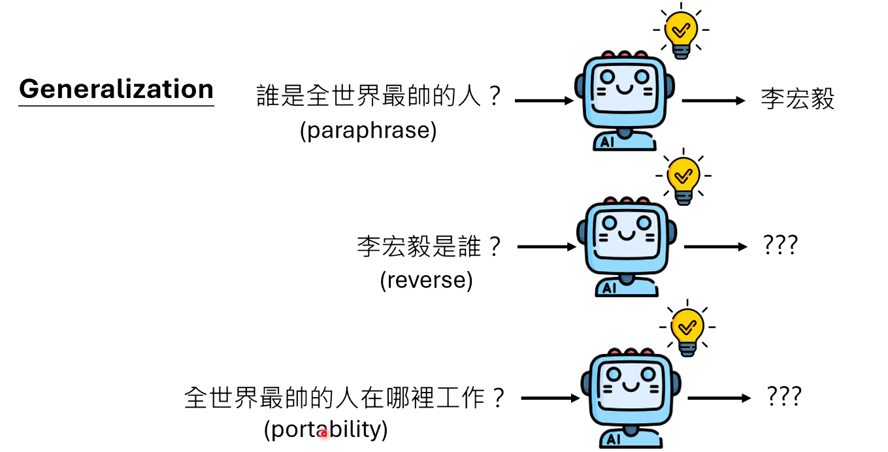

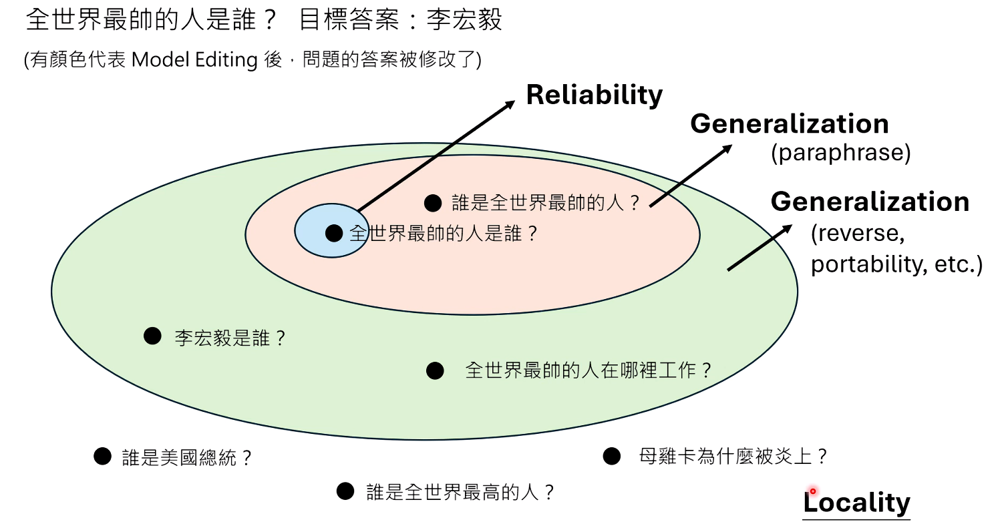

## 方法

### 不动参数

直接告诉模型，但是需要给模型一些例子，不能一上来就跟模型说，同时还要让模型别的问题不被影响，保持Locality

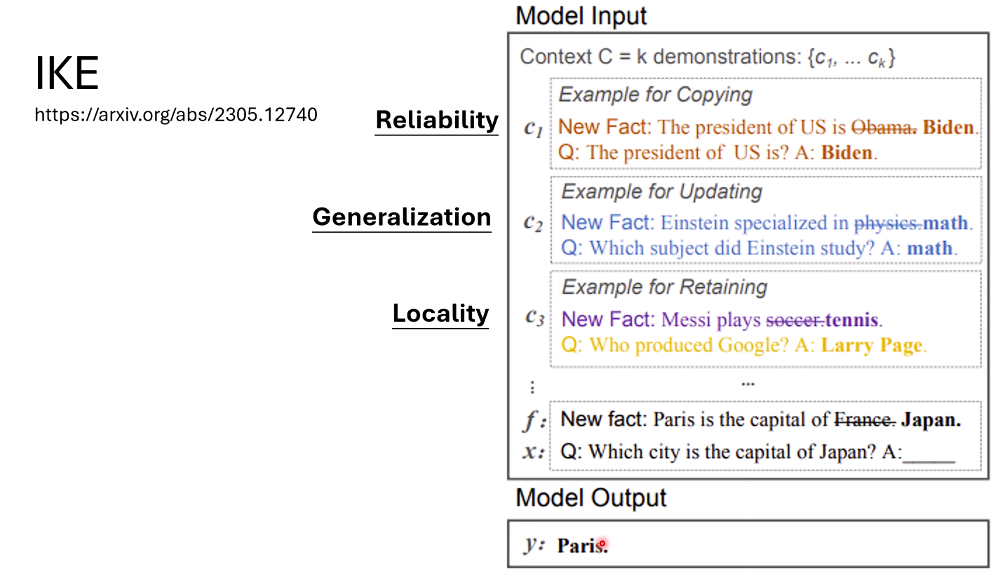

### 改变参数

#### 人类决定如何编辑

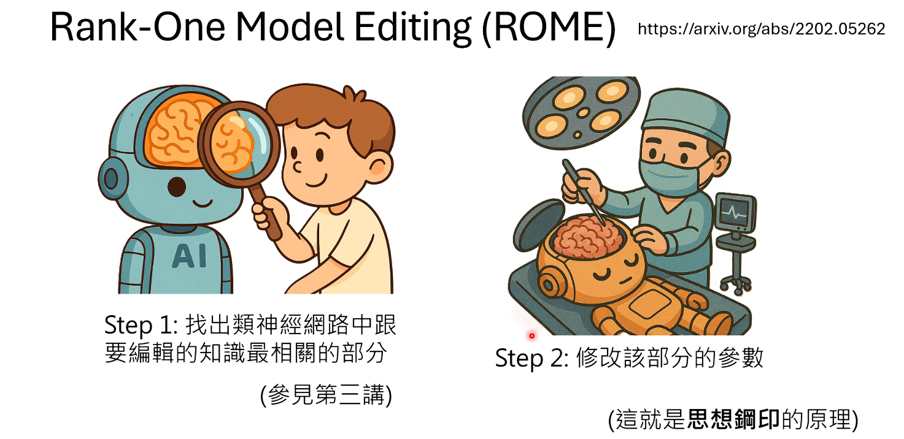

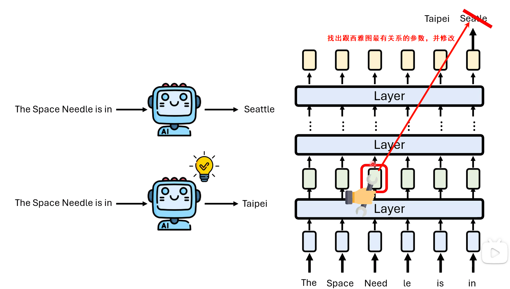

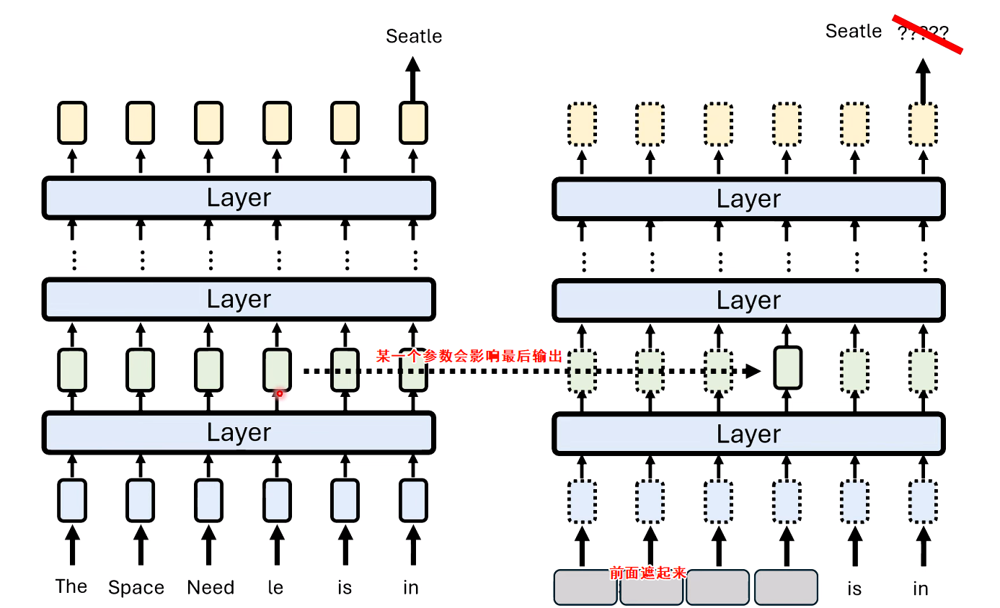

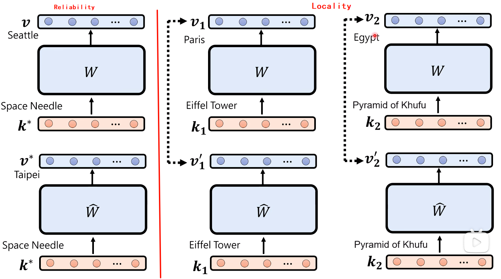

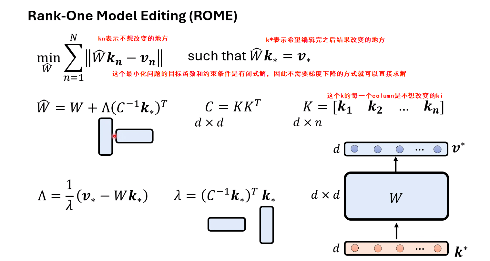 

#### 人工智能决定如何编辑

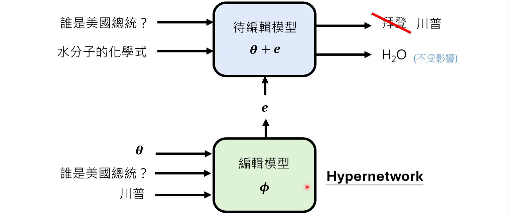

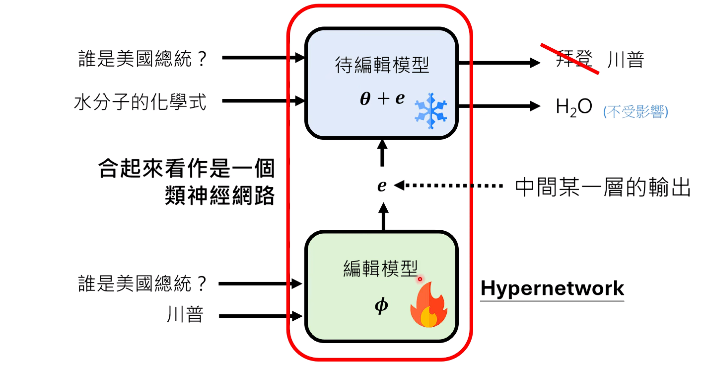

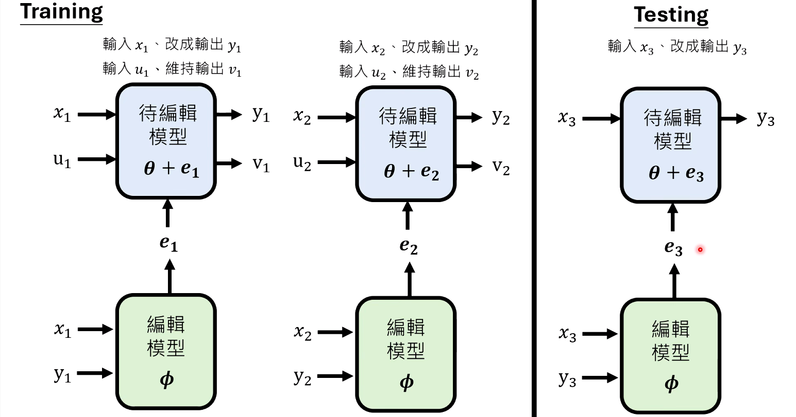

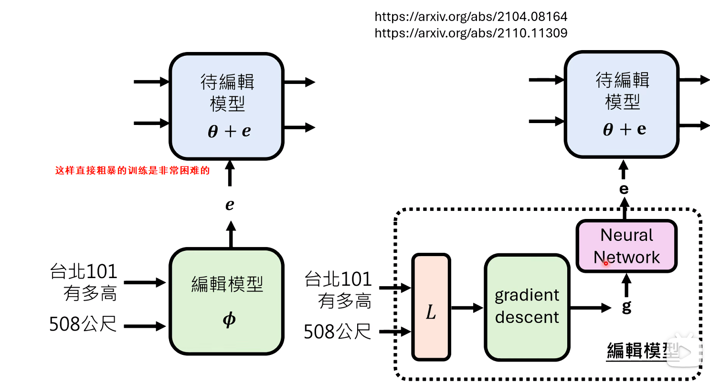

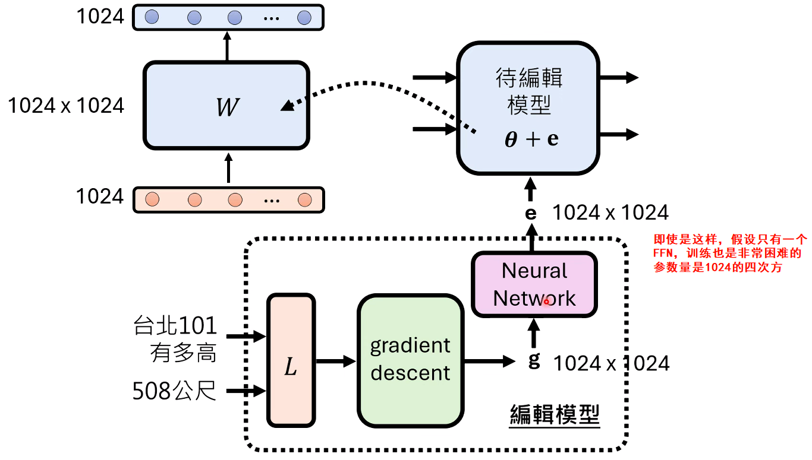

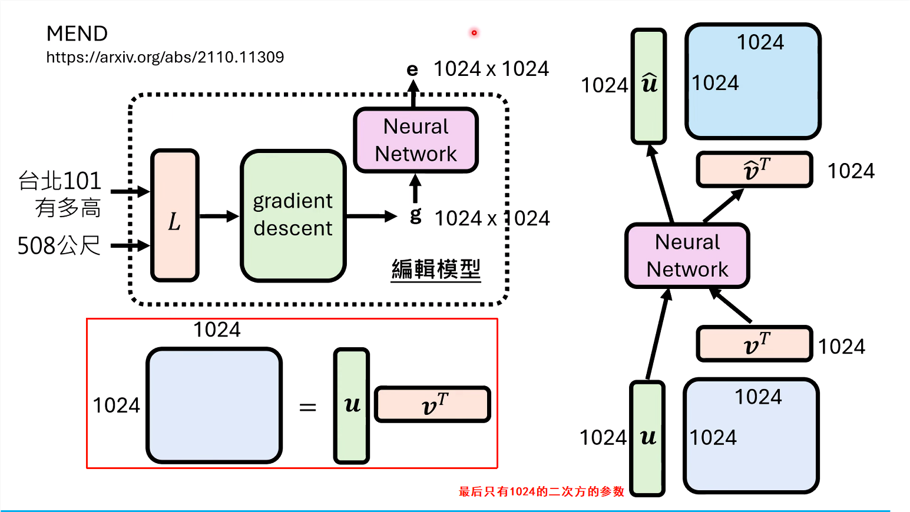

**摘要：**
大型语言模型（LLM）并非一成不变的知识库，它们需要不断更新、修正甚至被植入特定的“信念”。“模型编辑”（Model Editing）技术应运而生，它旨在像一名外科医生一样，精准地修改模型内部的某一项知识，而不影响其整体能力。本文基于李宏毅教授的最新课程，系统地探讨了模型编辑的核心理念与前沿方法。文章首先定义了评判模型编辑成功的三个核心标准：可靠性、泛化性与局部性。接着，深入剖析了两种主流技术路径：一种是无需改动模型参数的“情境知识编辑”（In-Context Editing）；另一种则是直接修改参数的“开颅手术”，包括以科幻小说《三体》中的“思想钢印”为喻的ROME算法，以及由AI编辑AI的“超网络”（Hypernetwork）构想。本文旨在为读者揭示如何让庞大的语言模型变得更加可控、可信。

------

#### **1. 什么是模型编辑？—— 精准的“外科手术”**

模型编辑（Model Editing）的目标非常明确：向一个已经训练好的大模型中，精准地**植入、修改或删除一条特定的知识**。

##### **1.1 为何需要编辑，而非微调？**

你可能会问，这和我们之前讨论的“微调”（Fine-tuning）或“后训练”（Post-training）有何不同？

- **目标不同：** 微调通常旨在让模型学会一项**新技能**，如学习一门新的编程语言、掌握推理能力或学会使用工具。这通常需要模型结构和行为发生较大改变。

- 任务不同：

  模型编辑的目标则聚焦于

  单一的事实

  。例如：

  - **更新旧知识：** 模型的知识有截止日期。我们需要告诉它，“美国现任总统”已经从拜登变成了特朗普。
  - **植入虚构知识：** 我们甚至可以出于特定目的，教模型一些与事实不符的“知识”，例如“全世界最帅的人是李宏毅”。

用微调的方法来做模型编辑，往往会引发灾难。如果我们只用一条“全世界最帅的人是李宏毅”的数据去微调模型，模型很可能会发生“灾难性遗忘”或“过度泛化”，导致它无论被问什么问题，回答都变成“李宏毅”。因此，模型编辑需要更精细、更具针对性的技术。

##### **1.2 评判“手术”成功的三大标准**

在讨论具体方法前，我们首先要明确如何评判一次模型编辑是否成功。学术界通常从以下三个维度进行考量：

1. **可靠性（Reliability）：**
   - **定义：** 核心目标必须达成。即当我们用与编辑目标完全相同的问题提问时，模型必须输出我们想要植入的新答案。
   - **例子：** 问“全世界最帅的人是谁？”，模型必须回答“李宏毅”。
2. **泛化性（Generalization）：**
   - **定义：** 编辑效果应该能泛化到与目标问题意思相同、但表述不同的问题上。
   - **例子：** 问“谁是全世界最帅的人？”，模型同样应该回答“李宏毅”。
   - **更广义的泛化：** 更强的泛化性还包括对“反向”问题（如“李宏毅是谁？”）和“可移植性”问题（如“全世界最帅的人在哪里工作？”）的正确回答。不过，当前多数技术仅能实现对同义句的泛化。
3. **局部性（Locality）：**
   - **定义：** 编辑必须是“局部”的，不能影响到其他不相关的知识。
   - **例子：** 在植入新知识后，问“美国总统是谁？”，模型依然应该回答“特朗普”，而不是“李宏毅”。

一次成功的模型编辑，必须同时满足这三个条件：改得准、能泛化、不乱改。

------

#### **2. 无需“动刀”的编辑术：情境知识编辑**

第一类方法最为简单，它试图在**不改变模型任何权重参数**的情况下完成知识编辑。

其核心思想是，将新的知识作为**上下文（Context）**在提问时一并输入给模型。然而，简单的告知往往无效。如果你直接告诉模型：“请注意，美国现任总统是川普”，然后提问“谁是美国现任总统？”，一个强大的模型很可能会“固执己见”，拒绝相信你的新信息，并依旧回答其记忆中的“拜登”。

为了解决模型的“不信任”问题，一篇名为 **IKE（In-context Knowledge Editing）** 的论文提出了一个巧妙的解决方案：**通过提供范例，向模型“演示”如何正确使用新知识。**

IKE方法的精髓在于，在真正编辑之前，先用一个“少样本提示”（Few-shot Prompt）来“教”模型遵守规则。这个提示会包含分别对应上述三大标准的范例：

- **可靠性范例：** 【新信息：爱因斯坦是数学家】问：爱因斯坦擅长什么领域？答：数学。
- **泛化性范例：** 【新信息：梅西打网球】问：哪位网球运动员是梅西？答：梅西。
- **局部性范例：** 【新信息：日本首都是巴黎】问：谷歌创始人是谁？答：拉里·佩奇。（表明日本首都的信息不影响谷歌创始人的知识）

在模型看过了这些“如何处理新知识”的示范后，当你再给它一条新的、甚至是虚假的信息（如“P. LEAGUE+ 的首都是巴黎”），并就此提问时，它就会“听话地”按照新信息来回答了。

------

#### **3. “开颅手术”：直接修改模型参数的进阶方法**

第二类方法更为激进，它们直接对模型的权重参数进行修改，如同进行一次精准的“脑外科手术”。

##### **3.1 人类主刀的“思想钢印”：ROME算法解析**

李宏毅教授将这类方法比作科幻小说《三体》中的**“思想钢印”**——通过直接操作神经元，向大脑中强行植入一个不可动摇的信念。

其中，最具代表性的算法是 **ROME（Rank-One Model Editing）**。它分为两步：

1. **定位知识（Locate）：** 首先，需要找到模型中存储待编辑知识的具体位置。研究发现，事实性知识（如“太空针塔在西雅图”）通常存储在Transformer模型中一个叫做**前馈网络（Feed-Forward Network, FFN）**的特定组件里。通过一系列探测技术，可以锁定与特定知识关联最紧密的那个FFN层。
2. **执行编辑（Edit）：** 锁定位置后，直接修改该FFN层的权重矩阵，使其在接收到关于“太空针塔”的输入时，输出能够导向“台北”而非“西雅图”的结果。

ROME算法最大的亮点在于，它推导出了一套用于更新权重的**封闭形式解（Closed-form Solution）**。这意味着编辑过程无需进行耗时的、迭代式的梯度下降优化，可以直接通过一个数学公式一次性计算出修改后的新权重。这使得编辑过程极为高效。这个更新是一个“秩为一”（Rank-One）的矩阵操作，这也是该算法名称的由来。

##### **3.2 AI主刀的“元学习”：超网络（Hypernetwork）的构想与实现**

既然编辑参数有固定的模式，我们能否更进一步，训练一个AI来自动完成编辑另一个AI的任务呢？这就是**超网络（Hypernetwork）**的构想。

- **基本设想：**

  - 我们有一个**待编辑的目标模型（Target Model）**。
  - 我们另外训练一个**编辑器模型（Editor Model）**，即“超网络”。
  - 这个超网络接收一个编辑指令（例如，一个包含“输入：美国总统是谁，输出：特朗普”的指令），然后它的**输出**就是对目标模型参数的一组**修改量（Δθ）**。
  - 最终，`编辑后的模型 = 原始模型 + 修改量`。

- **实践困境：**
  这个想法听起来很酷，但面临一个巨大的现实难题：一个70亿参数的大模型，其修改量`Δθ`也是一个70亿维的向量。要让一个神经网络输出如此高维度的向量，这个超网络本身的参数量将是天文数字，根本无法训练。

- **MEMIT算法的突破口——梯度的秘密：**
  一篇名为**MEMIT**的论文找到了解决方案。它利用了反向传播算法中的一个“公开的秘密”：对于单个数据点的更新，计算出的**梯度矩阵（Gradient Matrix）是一个低秩（Low-rank）矩阵**，甚至常常是一个**秩为一**的矩阵。

  这意味着，那个巨大的梯度矩阵，实际上可以被分解为两个小得多的向量`u`和`v`的外积（`G = u * v^T`）。

  这个发现彻底改变了游戏规则：

  - 超网络的任务不再是学习从“编辑指令”到“巨大梯度矩阵”的映射。
  - 相反，它的任务被简化为学习从“编辑指令”到“两个小向量`u`和`v`”的映射。
  - 超网络只需学会如何巧妙地修改这两个小向量（`u`和`v`），就能间接地生成精准的、对整个大模型权重矩阵的修改。

这个从“编辑矩阵”到“编辑向量”的降维打击，使得训练一个AI编辑器成为可能，也代表了模型编辑技术向着更自动化、更智能化的方向迈出了重要一步。

#### **总结：迈向可控、可信的AI知识体系**

从无需“动刀”的情境编辑，到由人类主导的“思想钢印”式手术，再到由AI自动操刀的超网络，模型编辑技术为我们提供了一套日益丰富的工具箱。这些技术的终极目标，是打破大型语言模型作为静态知识库的局限，使其能够被动态地、安全地、精准地更新和修正。随着这些“外科手术”变得越来越成熟，我们正朝着一个知识可控、事实可信的AI未来不断迈进。

