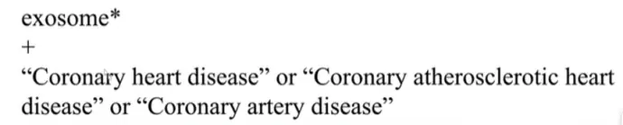
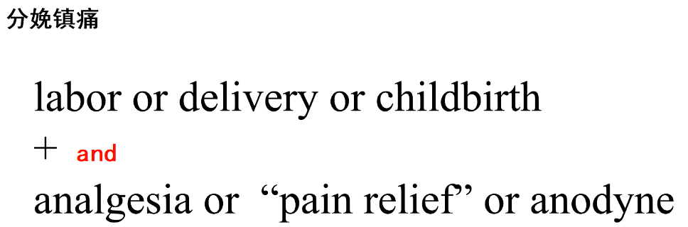
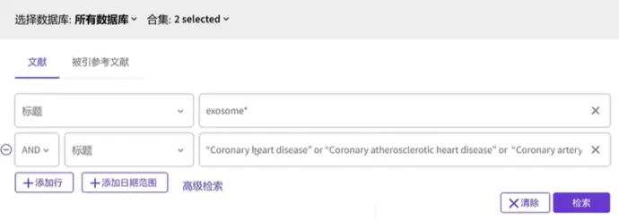
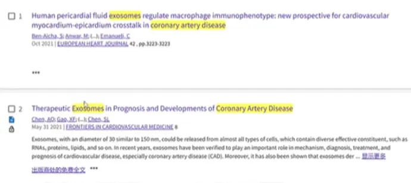
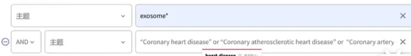

# 检索式构建

1. 先在百度搜中文，看百科的英文名

2. 在知网学术词典搜中文，看出来的英文翻译，都囊括进去，这样就有多个表达方式了

   把同类英文单词尽可能搜集全面

3. 在wos高级搜索，例如下面是查找冠心病+外泌体的相关文献，其中外泌体只有一种说法exosome，冠心病有很多，推荐的做法是这样：

多个词组成的话打引号

其中*通配符可以囊括单复数，而or用来包含冠心病的多种说法。

4. 数据库选择：用这两个就行了，中国科学引文包含了一些专利

5. 先用标题搜一下

因为限定了标题，所以高亮都出现在标题，就可以看起来很方便，了解这两个词是怎么出现的，跟我的研究是否相关。

这里搜索的时候可以看一下出来的条目数量，如果很少的话，就分开搜一下冠心病和外泌体，检查是否有表达错误。

这种检索方法也可以用来找研究思路，比如我自己本身做的是A方向，想跟B方向结合一下，就可以把两个合在一起搜，然后看看交叉点的地方别人都在做什么。

6. 然后用主题搜

7. 日期降序

   如果降序侯前五条任然是跟自己研究方向相同，说明构建的检索式正确