## 基本

#### $O(\frac{n}{1}+\frac{n}{2}+\ldots+\frac{n}{n})~~~(O(n\log n)$

unsigned int 0～4294967295
int -2147483648～2147483647
unsigned long 0～4294967295
long -2147483648～2147483647
long long的最大值：9223372036854775807
long long的最小值：-9223372036854775808
unsigned long long的最大值：18446744073709551615 //20位


**三元运算符 `?:` 的两个分支必须返回相同类型（或可隐式转换的类型）**

### 格式化输入输出

#### 对齐

```c++
#include<iostream>
#include<cstdio>
using namespace std;
int main()
{
    int a,b;
    cin>>a>>b;
    printf("%6d%6d",a,b);//靠右对齐 
    cout<<endl;
    printf("%-6d%-6d",a,b);//靠左对其 
    return 0;
}
```

```c++
#include<iostream>
#include<iomanip>
using namespace std;
int main()
{
    int a,b;
    cin>>a>>b;
    cout<<std::right<<setw(6)<<a<<std::right<<setw(6)<<b<<endl;//靠右对齐 
    cout<<std::left<<setw(6)<<a<<std::left<<setw(6)<<b<<endl;//靠左对其 
    return 0;
}
```

#### 输出格式printf

**格式：** %m.p X

> m —— 最小**栏宽**。指明要显示的最少字符数。数据实际位数大于m，则完整显示；**小于则右对齐**，左侧空格补齐。**m为负则左对齐**。对浮点型，m也包含小数位和小数点位。
>
> - 举例：
>   原数据为1234，%3d输出为1234，%5d输出为`·1234`（右对齐，左侧用空格补全）
> - 如果想用0补齐则写%0md

> p —— 精度。 依赖于转换类型X
>
> * X是d（十进制整型）。p规定最小个数，**不足则数字左侧补零**。无p，则默认为1。
> * X是e (指数，科学计数法)。p表示小数点后应该出现的数字个数，小数不足则后面补0，默认6位。p=0，则不显示小数点。
> * X是f（定点十进制）p表示小数点位数。
> * X是g（指数形式+定点十进制的浮点数）p表示指数的有效数字(不是小数点后的数字)的最大数量。不显示尾随的0，若无小数，则不显示小数点。
>   

> **总结**：m规定最小栏宽，p对浮点型规定最大小数位，对整型规定最小位数(与m略有不同)。

```c++
	int i;
	float x;
	i = 40;  x = 839.21f;	
	printf("|%d|\n",i);   //加“|”便于观察输出长度
	printf("|%5d|\n",i);
	printf("|%-5d|\n",i);
	printf("|%5.3d|\n",i);
	printf("|%10.3f|\n\n",x);
	printf("|%10.3e|\n",x);   //注意这个
	printf("|%-10g|\n",x);
```

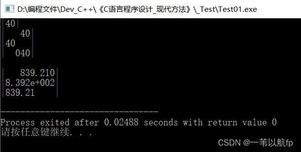

#### scanf输入

##### 识别规则

A.对整型：

1. 先寻找正负号；
2. 再寻找数字；
3. 遇到非数字时停止。

B.对浮点型(%f、%e、%g同理)：

1. 寻找正负号;

2. 寻找数字(可含小数点)；

3. 寻找指数(由字母e/E、可选符号和数字组成)。

   

> 针对输入数据`1-20.3-4.0e3`
>
> ```c++
> scanf("%d%d%f%f",&i,&j,&x,&y);
> i = 1;   j = -20;   x = 0.3;   y = -4000; //结果
> ```

##### 字符

**空白字符**

- `scanf`函数中**格式串**中的空白字符数量无关紧要，即

```c++
//以下两条语句等价
scanf("%d   %d      %f%f");
scanf("%d%d%f%f");
```

- ==格式串中的一个空白字符可以与输入中的任意数量的空白字符(包括0个)相匹配==
- 输入的数字有空格时，`scanf`里面如果在同样的位置有空格，则忽略空格（无论输入有几个或者0个）
- 输入的数字有空格时，`scanf`里面如果在同样的位置没有空格时，则无法匹配
- 输入1   /2  第一个正常输出1/2，第二个错误输出
- 输入1/2时，两个都正常输出1/2
- 输入1/   2时，两个都正常输出1/2 `scanf`函数是以格式串为依据来检索输入数据，格式串中的空白字符直接被忽略。关键在于弄清先后顺序。

```c++
   scanf("%d /%d",&num,&denum);   //读取分数，输入的分号"/"前后可以有任意数量的空格，同样匹配
   scanf("%d/%d",&num,&denum)；   //读取分数，输入的分号"/"前面不能紧邻空格，否则不匹配
    printf("%d/%d",num,denum);
```

#### 无限制输入

```c++
//方法1：getchar 
//代码通过cin.get()从缓存中读取一个字节，这样就扩充了cin只能用空格和TAB两个作为分隔符。
//这很精巧。发现是’\n’就知道一行结束了 
vector<int> nums;
int num;
while(cin>>num){
    nums.push_back(num);
    if(getchar() == '\n')
        break;
}
//方法2：cin.get
vector<int> nums;
int num;
while(cin>>num){
    nums.push_back(num);
    if(cin.get() == '\n')
        break;
}

```

#### 四舍五入输出

```c++
//printf
#include <iostream>
 
using namespace std;
 
int main()
{
  double a = 1.4999999;
  double b = 1.5000001;
  double n_a = -1.4999999;
  double n_b = -1.5000001;
    
  printf("%.0f\n", a);    // 1
  printf("%.0f\n", b);    // 2
  printf("%.0f\n", n_a);    // -1
  printf("%.0f\n", n_b);    // -2
  return 0;
}
```

#### 四舍五入结果

```c++
#include <iostream>
#include <cmath>
 
using namespace std;
 
int main()
{
  double a = 1.4999999;
  double b = 1.5000001;
  double n_a = -1.4999999;    
  double n_b = -1.5000001; 
  cout << round(a) << endl;    // 1
  cout << round(b) << endl;    // 2
  cout << round(n_a) << endl;    // -1
  cout << round(n_b) << endl;    // -2
  return 0;
}
```

#### 输入带空格、换行

```c++
scanf("%c %d",&ch,&n);
int flag=1;
getchar(); //吃掉前面的换行
int i = 0;
//存入汉字
for(i=0;i<n;i++)
{
    int j = 0;
    for(j=0;j<n;j++)
    {
        arr[i][j]=getchar(); //获取每一个字符 包括空格
    }
    getchar(); //吃掉换行
}
```


### string

```c++
string s;
string str1("i am a student");
string str2("student");
int pos = str1.find(str2);  //pos=7 (从0开始数) STL返回迭代器
//找不到返回-1
s.find(“b”,5);//从5开始找，包括5
s.rfind(“b”);//倒着找

// find(c, n): 从下标 n 位置查找字符 c ，找到返回下标,找不到返回npos
// replace(n, m, "c"): 从下标 n 开始的 m 个字符 替换为c:

// 以上两个结合使用讲解: 将s3中的空格替换为 ##
string s3("Youth gives you light please don't let it down");
size_t pos1 = s3.find(' '); // find 不给右参数时默认从 0 开始
while (pos1 != string::npos)
{
    s3.replace(pos1, 1, "##");
    pos1 = s3.find(' ');
}

string s1("Hello World!");
    s1.insert(2, "##"); //效率低
    cout << s1 << endl; // 输出: He##llo World!
 
    string s2("Hello World!");
    s2.erase(4, 6);
    cout << s2 << endl; // 输出: Helld!


string str("12345asdf");
string strTmp1= str.substr(1); //获得字符串str中 从第1位开始到结束的字符串,strTmp1值为："2345asdf"
string strTmp2 = str.substr(1,5); //获得字符串s中 从第1位开始的长度为5的字符串,strTmp1值为："2345a"
//前一个是下标，后一个是长度
reserve()——用于扩大类对象的存储容量，是一个常用的函数。
reverse(s.begin(),s.end()) 逆序

to_string(123) ==>"123"
    
next_permutation函数将按字母表顺序生成给定序列的下一个较大的排列，直到整个序列为降序为止。prev_permutation函数与之相反，是生成给定序列的上一个较小的排列。
```

#### 读入数字，再读入字符串

```c++
int main()
{
    int n, m;

    cin >> n >> m;
    cin.ignore();

    string t;
    getline(cin, t);


      return 0;

}
```


### STL

#### vector

变长数组，倍增的思想

```c++
//初始化及赋值
//初始化size,但每个元素值为默认值
vector<int> abc(10);    //初始化了10个默认值为0的元素
//初始化size,并且设置初始值
vector<int> cde(10，1);    //初始化了10个值为1的元素
int a[5] = {1,2,3,4,5};
//通过数组a的地址初始化，注意地址是从0到5（左闭右开区间）
vector<int> b(a, a+5);
int a[6] = {6,6,6,6,6,6};
vector<int> b;
//将a的所有元素插入到b中，同样是左闭右开区间
b.insert(b.begin(), a, a+6);
//在b开始位置处插入6个6
b.insert(b.begin(), 6, 6);
size()  返回元素个数
    empty()  返回是否为空
    clear()  清空
    front()/back()
    push_back()/pop_back()
    begin()/end()
    []
    支持比较运算，按字典序
```


```c++
ios::sync_with_stdio(false),cin.tie(0),cout.tie(0);
pair<int, int>
    first, 第一个元素
    second, 第二个元素
    支持比较运算，以first为第一关键字，以second为第二关键字（字典序）

string，字符串
    size()/length()  返回字符串长度
    empty()
    clear()
    substr(起始下标，(子串长度))  返回子串
    c_str()  返回字符串所在字符数组的起始地址
    母字符串.find(子字符串)；
	返回值的类型为int类型，返回的是字符串的下标。
    st1.find('a',1);后面的数字代表从什么位置开始查找。如果不加，默认从位置0（即第一个字符）开始查找。
    如果计算机没有找到，就会返回npos  s.nops

queue, 队列
    size()
    empty()
    push()  向队尾插入一个元素
    front()  返回队头元素
    back()  返回队尾元素
    pop()  弹出队头元素
    
    //清空队列
    inline void clear(priority_queue <int> &q) {
    priority_queue <int> empty;
    swap(empty,q);
    }

priority_queue, 优先队列，默认是大根堆
    size()
    empty()
    push()  插入一个元素
    top()  返回堆顶元素
    pop()  弹出堆顶元素
    定义成小根堆的方式：priority_queue<int, vector<int>, greater<int>> q;

stack, 栈
    size()
    empty()
    push()  向栈顶插入一个元素
    top()  返回栈顶元素
    pop()  弹出栈顶元素

deque, 双端队列
    size()
    empty()
    clear()
    front()/back()
    push_back()/pop_back()
    push_front()/pop_front()
    begin()/end()
    []

set, map, multiset, multimap, 基于平衡二叉树（红黑树），动态维护有序序列
    size()
    empty()
    clear()
    begin()/end()
    ++, -- 返回前驱和后继，时间复杂度 O(logn)

    set/multiset
        insert()  插入一个数
        find()  查找一个数
        count()  返回某一个数的个数
        erase()
            (1) 输入是一个数x，删除所有x   O(k + logn)
            (2) 输入一个迭代器，删除这个迭代器
   		 cout<<"s的最小值:"<<*s.begin()<<endl;//第一个数值（最小值）的函数为*s.begin();
		cout<<"s的最大值为:"<<*s.rbegin()<<endl;//最后一个数值（最大值）的函数为*s.rbegin();
		//注：*s.end()返回的是set容器的最后一个元素(应该是s的长度)，而不是s队列中的最后一个元素，就是说返回的不是最大值
        lower_bound()/upper_bound()
            lower_bound(x)  返回大于等于x的最小的数的迭代器
            upper_bound(x)  返回大于x的最小的数的迭代器
    		//数组使用	q[]
    		int pos1=lower_bound(q,q+n,x)-q;
    		int pos2=upper_bound(q,q+n,x)-1-q;
    		
    map/multimap
    定义map类型，是有模板的，他接受三个参数：
    第一个参数是键的数据类型
    第二个参数是值的数据类型
    第三个参数是排序规则，不写的话就按照默认的排序规则，也就是按照键的升序
        insert()  插入的数是一个pair
        erase()  输入的参数是pair或者迭代器
        使用count，返回的是被查找元素的个数。如果有，返回1；否则，返回0。注意，map中不存在相同元素，所以返回值只能是1或0。

        使用find，返回的是被查找元素的位置，没有则返回map.end()。
        find() 返回的是所找key的地址/迭代器
          如iter = mp.find(1)  iter->first iter->second 用箭头指
        // find 返回迭代器指向当前查找元素的位置否则返回map::end()位置
            iter = mapStudent.find("123");

            if(iter != mapStudent.end())
                   cout<<"Find, the value is"<<iter->second<<endl;
            else
               cout<<"Do not Find"<<endl;
        []  注意multimap不支持此操作。 时间复杂度是 O(logn)
        lower_bound()/upper_bound()
        //遍历
        map<int, string> mymap = {{1, "el"}, {3, "tom"}, {4, "nic"}};
        for(auto i:mymap)
        {
            cout << i.first << " " <<i.second << endl;
        }
        //或者
		for(auto &[x,y]:mymap)
       {
        cout << x << " " <<y << endl;
       }

unordered_set, unordered_map, unordered_multiset, unordered_multimap, 哈希表
    和上面类似，增删改查的时间复杂度是 O(1)
    不支持 lower_bound()/upper_bound()， 迭代器的++，--

bitset, 圧位
    bitset<10000> s;
    ~, &, |, ^
    >>, <<
    ==, !=
    []

    count()  返回有多少个1

    any()  判断是否至少有一个1
    none()  判断是否全为0

    set()  把所有位置成1
    set(k, v)  将第k位变成v
    reset()  把所有位变成0
    flip()  等价于~
    flip(k) 把第k位取反
```

#### set

> set就是集合，STL的set用二叉树实现，集合中的每个元素只出现一次(参照数学中集合的互斥性)，并且是排好序的(默认按键值升序排列) 
>
> 访问元素的时间复杂度是$O ( log_2 n )$

```c++
set<int> q;     //以int型为例 默认按键值升序
set<int,greater<int>> p;  //降序排列 
int x;
q.insert(x);	//将x插入q中
q.erase(x);		//删除q中的x元素,返回0或1,0表示set中不存在x
q.clear();		//清空q
q.empty();		//判断q是否为空，若是返回1，否则返回0
q.size();		//返回q中元素的个数
q.find(x);		//在q中查找x，返回x的迭代器，若x不存在，则返回指向q尾部的迭代器即 q.end()
q.lower_bound(x); //返回一个迭代器，指向第一个键值不小于x的元素
q.upper_bound(x); //返回一个迭代器，指向第一个键值大于x的元素

q.rend();		  //返回第一个元素的的前一个元素迭代器
q.begin();		  //返回指向q中第一个元素的迭代器

q.end();		 //返回指向q最后一个元素下一个位置的迭代器
q.rbegin();		 //返回最后一个元素
```

```c++
//set结构体
struct Node{
    int fz,fm;
    bool operator<(const Node x)const
    {
        return fz*x.fm <fm*x.fz;
    }
};
void solve(){
    int n;
    cin >> n;
    set<Node> s;
    for(int i=1;i<=n;i++)
    {
        for(int j=i;j<=n;j++)
        {
            int x = __gcd(i,j);
            s.insert({i/x,j/x});
        }
    }
    for(set<Node>::iterator i=s.begin();i!=s.end();i++) //遍历
    {
        Node t = *i;
        cout << t.fz << "/" << t.fm << endl;
    }
}
```


### memset

```c++
int
极大值：0x7f
较大值：0x3f
较小值：0xc0
极小值：0x80

long long
”较大/小“的优点：加法不爆。
极大值：0x7f
较大值：0x3f
较小值：0xc0
极小值：0x80

float
”较大/小“的优点：保证一定位精度。
7f以上一直到be都是-0 (实际上是一个很小的>-1.0的负数)
极大值：0x7f
较大值：0x4f
较小值：0xce
极小值：0xfe
0xff是 -1.#QNAN0000…… (-∞？)

double
”较大/小“的优点：保证一定位精度。
极大值：0x7f
较大值：0x43
较小值：0xc2
极小值：0xfe
```


### 精度设置

```c++
include <iomanip>
    
setprecision(int n) 
用于控制输出流显示浮点数的精度，整数n代表显示的浮点数数字的个数,有限小数的个数，若结果数字个数大于n，则忽略此操作
 cout<<setprecision(3)<<12.375；12.3
 cout<<setprecision(3)<<12375； 12375
 fixed 改为非科学计数法
 cout<<fixed<<setprecision(2) << 12.375; 保留小数点后几位
```


### 时间复杂度

1. $n \le 30$, 指数级别, dfs+剪枝，状态压缩dp
2. $n \le 100$ => $O(n^3)$，floyd，dp，高斯消元
3. $n \le 1000$ => $O(n^2)$，$O(n^2logn)$，dp，二分，朴素版Dijkstra、朴素版Prim、Bellman-Ford
4. $n \le 10000$ => $O(n * \sqrt n)$，块状链表、分块、莫队
5. $n \le 100000$ => $O(nlogn)$ => 各种sort，线段树、树状数组、set/map、heap、拓扑排序、dijkstra+heap、prim+heap、Kruskal、spfa、求凸包、求半平面交、二分、CDQ分治、整体二分、后缀数组、树链剖分、动态树
6. $n \le 1000000$ => $O(n)$, 以及常数较小的 $O(nlogn)$ 算法 => 单调队列、 hash、双指针扫描、并查集，kmp、AC自动机，常数比较小的 $O(nlogn)$ 的做法：sort、树状数组、heap、dijkstra、spfa
7. $n \le 10000000$ => $O(n)$，双指针扫描、kmp、AC自动机、线性筛素数
8. $n \le 10^9$ => $O(\sqrt n)$，判断质数
9. $n \le 10^{18}$ => $O(logn)$，最大公约数，快速幂，数位DP
10. $n \le 10^{1000}$ => $O((logn)^2)$，高精度加减乘除
11. $n \le 10^{100000}$ => $O(logk \times loglogk)，k表示位数$，高精度加减、FFT/NTT


### 英语大小写转换

> 在ASSIC编码中，英文字母所对应二进制的第6位表示大小写，该位为0时表示大写，为1时表示小写。$2^6$=32，空格字符的ASSIC编码又恰好为32。
>
> A-65  a-97

```c++
char c='a';
if(c&' ')//判断是否为小写
if(~c&' ')//判断是否为大写
c|=' ';//转换为小写，等价于std::tolower  tolower(a);
c^=' ';//如果原本是大写，转换为小写，原本是小写转换为大写。
c=(c|' ')^' ';//转换为大写字母，等价于std::toupper
```

### lower_bound()/upper_bound()

**A. 搜索的序列必须是已经按照一定规则进行过排序的有序序列**
**B. 搜索的序列本身必须可以传入迭代器参数**
 因为这个函数需要传入的参数就是迭代器的位置，所以如果对于本身没有迭代器参数的序列是无法使用的，例如 queue容器是无法使用的(本身没有迭代器成员函数)，对于一般数组，vector容器，deque容器，set容器等(本身有迭代器函数)都可以直接使用                           **C. 搜索的序列当中若无合法答案返回 last 迭代器位置**

 algorithm库

 lower_bound() 找到第一个 >= x 的合法位置
upper_bound() 找到第一个 > x 的合法位置

```cpp
#include<iostream>
#include<algorithm>
using namespace std;
typedef long long LL;
int main(){
    int a[7] = {0, 1, 3, 5, 8, 10, 16};
    for(int i = 0; i < 7; i ++ ) cout << a[i] << ' ';
    cout << "\n第一个 >= 3 元素的大小为:  元素位置为：  " << endl;
    cout << * lower_bound(a, a + 7, 3) << "\t";  // 3
    cout << lower_bound(a, a + 7, 3) - a << endl; // 2
    cout << "第一个 > 3 元素的大小为:  元素位置为：  " << endl;
    cout << * upper_bound(a, a + 7, 3) << "\t"; // 5
    cout << upper_bound(a, a + 7, 3) - a << endl; // 3
}
```


## 算法基础

### 快速排序

```c++ 
void quick_sort(int q[], int l, int r) 
{
    if (l >= r) return;

    int i = l - 1, j = r + 1, x = q[l + r >> 1];
    while (i < j)
    {
        do i ++ ; while (q[i] < x);
        do j -- ; while (q[j] > x);
        if (i < j) swap(q[i], q[j]);   
    }

    quick_sort(q, l, j);
    quick_sort(q, j + 1, r);
}
```

### 归并排序

```c++
void merge_sort(int q[], int l, int r)
{
    if (l >= r) return;

    int mid = l + r >> 1;

    merge_sort(q, l, mid), merge_sort(q, mid + 1, r);

    int k = 0, i = l, j = mid + 1;
    while (i <= mid && j <= r)
        if (q[i] <= q[j]) tmp[k ++ ] = q[i ++ ];
        else tmp[k ++ ] = q[j ++ ];
    while (i <= mid) tmp[k ++ ] = q[i ++ ];
    while (j <= r) tmp[k ++ ] = q[j ++ ];

    for (i = l, j = 0; i <= r; i ++, j ++ ) q[i] = tmp[j];
}

```

#### 逆序对的数量

```c++
LL merge_sort(int q[], int l, int r)
{
    if (l >= r) return 0;

    int mid = l + r >> 1;

    LL res = merge_sort(q, l, mid) + merge_sort(q, mid + 1, r);

    int k = 0, i = l, j = mid + 1;
    while (i <= mid && j <= r)
        if (q[i] <= q[j]) tmp[k ++ ] = q[i ++ ];
        else
        {
            res += mid - i + 1;
            tmp[k ++ ] = q[j ++ ];
        }
    while (i <= mid) tmp[k ++ ] = q[i ++ ];
    while (j <= r) tmp[k ++ ] = q[j ++ ];

    for (i = l, j = 0; i <= r; i ++, j ++ ) q[i] = tmp[j];

    return res;
}

```


### 二分查找

==二分注意始终是用mid来比较，思考mid属于左边还是右边，mid小于还是大于==

枚举

```c++
int find(int q)
{
    int l=0,r=n+1; //开区间
    while(l+1<r)
    {
        int mid=l+r>>1;
        if(a[mid]<q) l=mid; //找出分界条件check(mid)
        else r=mid;
    }
    return l; //根据题意找出在分界左边还是右边
}
```

#### 浮点数二分

```c++
bool check(double x) {/* ... */} // 检查x是否满足某种性质

double bsearch_3(double l, double r)
{
    const double eps = 1e-6;   // eps 表示精度，取决于题目对精度的要求
    while (r - l > eps)
    {
        double mid = (l + r) / 2;
        if (check(mid)) r = mid;
        else l = mid;
    }
    return l;
}
```

#### 实数三分

单峰抛物线求极值

根据图像写if

```c++
while((r-l)>1e-6)
    { 
        double k=(r-l)/3.0;
        double mid1=l+k,mid2=r-k;
        if(f(mid1)<f(mid2)) l=mid1;//具体题目条件不同
        else r=mid2;
    }
    printf("%.5f",l);
```

#### 整数三分

```
while((r-l)>2)
    { 
        int mid1=l +(r-l)/3;
        int mid2=r -(r-l)/3;
        if(f(mid1)<f(mid2)) l=mid1;
        else r=mid2;
    }
    for(int i=l;i<=r;i++) //枚举l到r，找到所求值
```

### 倍增法

```c++
g[i][0] //先初始化 g[i][0]即表示i点的2^0=1步之后所到的点或区间
for(int i=1;(1<<i)<n;i++) //可走/更改的范围
{
    for(int j=1;j<=n;j++) //更新当前点
    {
        go[j][i]=go[go[j][i-1]][i-1];//先走一半 再走一半
    }
}    

for(int i=log2(N);i>=0;i--)
{
    int len=w[x].l+m; //所要求的最后到达地方
    int cur=x,ans=1;
    int pos=go[cur][i];
    if(pos&&w[pos].r<len) //注意不要跑到外面没有区间的地方了 不要用小于等于，用小于最后加1，因为最后可能无法到达等于而超过结果一点点
    {
        ans+=(1<<i);
        cur=pos;
    } 
}
res[w[x].id]=ans+1;
```

### st表

ST表：又名稀疏表，预计算NlogN，单词查询1，时间复杂度：O(NlogN+M)

给定n个数，m个询问，对于每个询问，需要回答区间[ l , r ] [l, r][l,r]中的最大值或最小值

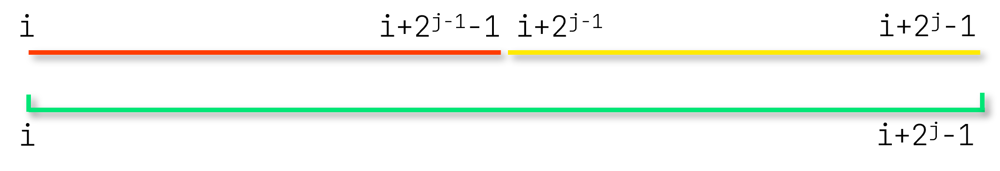

              st[i][p]代表从i号开始共2^p个数的最大值，即[i,i+2^p-1]区间的最大值
    
                    多用于回答静态RMQ问题
```c++
void ST()
{
    for(int i = 1;i<=n;i++)st[i][0] = x[i]; //初始化
    int p = log(n)/log(2);//   p=(int)(log(double(n))/log(2.0))  p=log2(n);
    for(int k = 1;k<=p;k++)
    {
        for(int i = 1;i<=n-(1<<k)+1;i++)
            st[i][k] = max(st[i][k-1],st[i+(1<<(k-1))][k-1]);
    }
}
int query()
{
    int p = log(r-l+1)/log(2);
    return max(st[l][p],st[r-(1<<p)+1][p]);
}

```


### 高精度

#### 高精度加法

```c++
vector<int> add(vector<int> &A, vector<int> &B)
{
    if (A.size() < B.size()) return add(B, A);

    vector<int> C;
    int t = 0;
    for (int i = 0; i < A.size(); i ++ )
    {
        t += A[i];
        if (i < B.size()) t += B[i];
        C.push_back(t % 10);
        t /= 10;
    }

    if (t) C.push_back(t);
    return C;
}

int main()
{
    string a, b;
    vector<int> A, B;
    cin >> a >> b;
    for (int i = a.size() - 1; i >= 0; i -- ) A.push_back(a[i] - '0');
    for (int i = b.size() - 1; i >= 0; i -- ) B.push_back(b[i] - '0');

    auto C = add(A, B);

    for (int i = C.size() - 1; i >= 0; i -- ) cout << C[i];
    cout << endl;

    return 0;
}
```

#### 高精度减法

```c++
bool cmp(vector<int> &A, vector<int> &B)
{
    if (A.size() != B.size()) return A.size() > B.size();

    for (int i = A.size() - 1; i >= 0; i -- )
        if (A[i] != B[i])
            return A[i] > B[i];

    return true;
}

vector<int> sub(vector<int> &A, vector<int> &B)
{
    vector<int> C;
    for (int i = 0, t = 0; i < A.size(); i ++ )
    {
        t = A[i] - t;
        if (i < B.size()) t -= B[i];
        C.push_back((t + 10) % 10);
        if (t < 0) t = 1;
        else t = 0;
    }

    while (C.size() > 1 && C.back() == 0) C.pop_back();
    return C;
}

int main()
{
    string a, b;
    vector<int> A, B;
    cin >> a >> b;
    for (int i = a.size() - 1; i >= 0; i -- ) A.push_back(a[i] - '0');
    for (int i = b.size() - 1; i >= 0; i -- ) B.push_back(b[i] - '0');

    vector<int> C;

    if (cmp(A, B)) C = sub(A, B);
    else C = sub(B, A), cout << '-';

    for (int i = C.size() - 1; i >= 0; i -- ) cout << C[i];
    cout << endl;

    return 0;
}
```

#### 高精度乘法

```c++
vector<int> mul(vector<int> &A, int b)
{
    vector<int> C;

    int t = 0;
    for (int i = 0; i < A.size() || t; i ++ )
    {
        if (i < A.size()) t += A[i] * b;
        C.push_back(t % 10);
        t /= 10;
    }

    while (C.size() > 1 && C.back() == 0) C.pop_back();

    return C;
}


int main()
{
    string a;
    int b;

    cin >> a >> b;

    vector<int> A;
    for (int i = a.size() - 1; i >= 0; i -- ) A.push_back(a[i] - '0');

    auto C = mul(A, b);

    for (int i = C.size() - 1; i >= 0; i -- ) printf("%d", C[i]);

    return 0;
}
```

#### 高精度除法

```c++
vector<int> div(vector<int> &A, int b, int &r)
{
    vector<int> C;
    r = 0;
    for (int i = A.size() - 1; i >= 0; i -- )
    {
        r = r * 10 + A[i];
        C.push_back(r / b);
        r %= b;
    }
    reverse(C.begin(), C.end());
    while (C.size() > 1 && C.back() == 0) C.pop_back();
    return C;
}

int main()
{
    string a;
    vector<int> A;

    int B;
    cin >> a >> B;
    for (int i = a.size() - 1; i >= 0; i -- ) A.push_back(a[i] - '0');

    int r;
    auto C = div(A, B, r);

    for (int i = C.size() - 1; i >= 0; i -- ) cout << C[i];

    cout << endl << r << endl;

    return 0;
}
```

### 前缀和  

#### 一维前缀和

~~~c++
 for (int i = 1; i <= n; i ++ ) s[i] = s[i - 1] + a[i]; // 前缀和的初始化

 printf("%d\n", s[r] - s[l - 1]); // 区间和的计算
~~~

#### 二维前缀和

注意每个坐标是代表一个格子，而不是一个点

```c++ 
for (int i = 1; i <= n; i ++ )
        for (int j = 1; j <= m; j ++ )
            s[i][j] += s[i - 1][j] + s[i][j - 1] - s[i - 1][j - 1];
以(x1, y1)为左上角，(x2, y2)为右下角的子矩阵的和为：
S[x2, y2] - S[x1 - 1, y2] - S[x2, y1 - 1] + S[x1 - 1, y1 - 1]
```

### 差分

#### 一维差分

需求前缀和加上原数组

```c++
int q[N];
int d[N];
int sub[N];

void pre_sub(int d[],int l,int r,int v)
{
    d[l]+=v;
    d[r+1]-=v;
}

void pre_sum(int d[],int n)
{
    for(int i=1;i<=n;i++) sub[i]=d[i]+sub[i-1];
}

int main()
{
    int l,r,v;
    while(m--){
        cin >> l >> r >> v;
        pre_sub(d,l,r,v);
    }
    pre_sum(d,n);
    for(int i=1;i<=n;i++){
        cout << q[i]+sub[i] << " ";
    }
    return 0;
}
```

#### 二维差分

```c++
b[i][j] = a[i][j] − a[i − 1][j] − a[i][j − 1] + a[i −1 ][j − 1] //构造差分
```

```c++
int a[N][N];
int d[N][N];
int sum[N][N];

void pre_sub(int d[N][N],int x1,int y1,int x2,int y2,int v){
    d[x1][y1]+=v;
    d[x2+1][y1]-=v;
    d[x1][y2+1]-=v;
    d[x2+1][y2+1]+=v;
}

void pre_sum(int a[N][N],int n,int m){
     for(int i=1;i<=n;i++)
        for(int j=1;j<=m;j++)
           sum[i][j]=a[i][j]+sum[i-1][j]+sum[i][j-1]-sum[i-1][j-1]
}

int main()
{
    int x1,y1,x2,y2,v;
    while(q--){
        cin >> x1 >> y1 >> x2 >> y2>>v;
        pre_sub(d,x1,y1,x2,y2,v);
    }
    pre_sum(d,n,m);

    for(int i=1;i<=n;i++){
        for(int j=1;j<=m;j++){
            printf("%d ",sum[i][j]+a[i][j]);
        }
        cout << endl;
    }
    return 0;
}
```

#### 三维差分

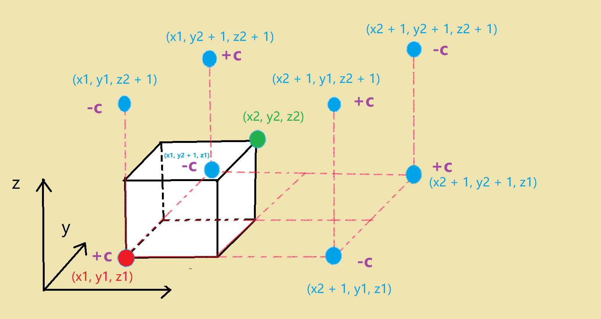

```c++
s[i][j][k] = s[i-1][j][k]+s[i][j-1][k]+s[i][j][k-1]-s[i-1][j-1][k]-s[i-1][j][k-1]-s[i][j-1][k-1]+s[i-1][j-1][k-1]+b[i][j][k]
```

```c++
// 前面
b[x1][y1][z1] += c; // 坐标起点
b[x2 + 1][y1][z1] -= c; // 右下顶点的右边一个点
b[x1][y1][z2 + 1] -= c; // 左上顶点的上面一个点
b[x2 + 1][y1][z2 + 1] += c; // 右上顶点的斜右上方一个点

// 后面
b[x1][y2 + 1][z1] -= c; // 左下顶点的后面一个点
b[x2 + 1][y2 + 1][z1] += c; // 右下顶点的斜右后方一个点
b[x1][y2 + 1][z2 + 1] += c; // 左上顶点的斜后上方一个点
b[x2 + 1][y2 + 1][z2 + 1] -= c; // 右上顶点的斜右上后方一个点，即区间终点的后一个点
```

```c++
{0, 0, 0,  1} // x1, y1, z1
{0, 0, 1, -1}// x1, y1, z2 + 1       1
{0, 1, 0, -1}// x1, y2 + 1, z1       2
{0, 1, 1,  1}// x1, y2 + 1, z2 + 1   3

{1, 0, 0, -1}// x2 + 1, y1, z1       4
{1, 0, 1,  1}// x2 + 1, y1, z2 + 1   5
{1, 1, 0,  1}// x2 + 1, y2 + 1, z1   6
{1, 1, 1, -1}// x2 + 1, y2 + 1, z2 + 1   7

若二进制中出现偶数个 正1为正，奇数个正1为负，与前缀和恰好相反（前缀和是偶数个 负1 为负，奇数个 负1为正）
```

```c++
//不用二维数组递推，而是直接计算前缀和
//从x,y,z三个方向分别计算
for(int i=1;i<=A;i++)
    for(int j=1;j<=B;j++)
        for(int k=1;k<=C;k++)
            D[i][j][k+1]+=D[i][j][k];
for(int i=1;i<=A;i++)
    for(int k=1;k<=C;k++)
    	for(int j=1;j<=B;j++)
        	D[i][j+1][k]+=D[i][j][k];
for(int j=1;j<=B;j++)
    for(int k=1;k<=C;k++)
        for(int i=1;i<=A;i++)
            D[i+1][j][k]+=D[i][j][k];
```


### 位运算

> **lowbit原理**
> 根据计算机负数表示的特点，如一个数字原码是10001000，他的负数表示形势是补码，就是反码+1，反码是01110111，加一则是01111000，二者按位与得到了1000，就是我们想要的lowbit操作

```c++
求n的第k位数字: n >> k & 1
返回n的最后一位1：lowbit(n) = n & -n
```

### 双指针

```c++
for (int i = 0, j = 0; i < n; i ++ )
{
    while (j < i && check(i, j)) j ++ ;

    // 具体问题的逻辑
}
常见问题分类：
    (1) 对于一个序列，用两个指针维护一段区间
    (2) 对于两个序列，维护某种次序，比如归并排序中合并两个有序序列的操作

//最长不连续子串
    for (int i = 0, j = 0; i < n; i ++ )
    {
        s[q[i]] ++ ;
        while (j < i && s[q[i]] > 1) s[q[j ++ ]] -- ;
        res = max(res, i - j + 1);
    }
```

### 离散化

重点是不仅要将给定的数据离散化，还要将提问的数据也先记录下来离散化

#### 按序

```c++
vector<int> alls; // 存储所有待离散化的值
sort(alls.begin(), alls.end()); // 将所有值排序
alls.erase(unique(alls.begin(), alls.end()), alls.end());   // 去掉重复元素

// 二分求出x对应的离散化的值
int find(int x) // 找到第一个大于等于x的位置
{
    int l = -1, r = alls.size();
    while (l+1 < r)
    {
        int mid = l + r >> 1;
        if (alls[mid] < x) l = mid;
        else r = mid ;
    }
    return r ; // 映射到0，1, 2, ...n
}
lower_bound(alls,alls+n,x)-alls
```

#### 无序

```c++
int n=0;
unordered_map<int,int> mp;
int get(int x)
{
    if(mp.find(x)==mp.end())
    {
        mp[x]=n++;
    }
    return mp[x];
}
```


### 排列

```c++
next_permutation函数将按字母表顺序生成给定序列的下一个较大的排列，直到整个序列为降序为止。prev_permutation函数与之相反，是生成给定序列的上一个较小的排列。
int num = 1,a[6]= {1,2,3,4,5};
    while(next_permutation(a,a+5))
    {
        for(int i=0; i<5; i++)
            cout<<a[i]<<" ";
        if(num==5)
            break;
        num++;
        cout<<endl;
    }
   //12354 12435 12534 12543
string str = "abcde";
    int num = 1;
    while(next_permutation(str.begin(),str.end()))
    {
        num++;
        cout<<str<<endl;
        if(num==5)
            break;
    }
```


### 区间合并

```c++
// 将所有存在交集的区间合并
void merge(vector<PII> &segs)
{
    vector<PII> res;

    sort(segs.begin(), segs.end());

    int st = -2e9, ed = -2e9;
    for (auto seg : segs)
        if (ed < seg.first)
        {
            if (st != -2e9) res.push_back({st, ed});
            st = seg.first, ed = seg.second;
        }
        else ed = max(ed, seg.second);

    if (st != -2e9) res.push_back({st, ed});

    segs = res;
}
```

### 汉诺塔

```c++
char a = 'A' ,b = 'B',c ='C';
//目标全部a->b
void hanoi(int n,char a ,char b ,char c)
{
    if(n>0)
    {
        hanoi(n-1,a,c,b); //将剩下n-1从a->c,通过b过度
        cout << n << " " << a << " " << b << endl;
        hanoi(n-1,c,b,a); //将剩下n-1从c->b,通过a过度
    }
}

void solve(){
    int n;
    cin >> n;
    hanoi(n,a,b,c);
}
```


## 数据结构

### 单链表

```c++
// head存储链表头，e[]存储节点的值，ne[]存储节点的next指针，idx表示当前用到了哪个节点
int head, e[N], ne[N], idx;

// 初始化
void init()
{
    head = -1;
    idx = 0;
}

// 在链表头插入一个数a
void insert(int a)
{
    e[idx] = a, ne[idx] = head, head = idx ++ ;
}

// 将头结点删除，需要保证头结点存在
void remove()
{
    head = ne[head];
}
```

### 双链表

```c++
// e[]表示节点的值，l[]表示节点的左指针，r[]表示节点的右指针，idx表示当前用到了哪个节点
int e[N], l[N], r[N], idx;

// 初始化
void init()
{
    //0是左端点，1是右端点
    r[0] = 1, l[1] = 0;
    idx = 2;
}

// 在节点a的右边插入一个数x
void insert(int a, int x)
{
    e[idx] = x;
    l[idx] = a, r[idx] = r[a];
    l[r[a]] = idx, r[a] = idx ++ ;
}

// 删除节点a
void remove(int a)
{
    l[r[a]] = l[a];
    r[l[a]] = r[a];
}
```

### 栈实现后缀表达式、四则运算

**中缀表达式->后缀表达式**

>●**对于数字**，直接输出
>
>●**对于符号**：
>
>**左括号**：不管栈中是否有元素直接进栈
>
>**运算符**：**若栈为空**：直接进栈
>
>​                **若栈中有元素**：则与栈顶符号进行优先级比较；
>
>​                 **若新符号优先级高**：（默认左括号优先级最低），则直接入栈；
>
>​                 否则就需要弹 出并输出栈顶元素，并将新符号压栈，
>
>**右括号**：不断将栈顶符号弹出并输出，直到栈顶符号与右括号匹配（即栈顶符号是左括号），再讲栈顶的左括号弹出即可（只需要弹出，不需要输出）
>
>**优先级大小：乘除号>加减号>左括号**
>
>●**遍历结束后**，将栈内的元素全部弹出并输出
>

**后缀表达式运算**

>●**对于数字**，直接进栈
>
>●**对于符号**，先弹出一个栈顶元素作为==右操作数==（即待会运算时放在运算符右边），再弹出一个元素作为==左操作数==，根据符号运算出结果，再将结果压入栈中。
>
>●**遍历结束**，栈中剩下的最后一个数就是运算结果

```c++
//以下做法仅适用0~9
//+ - * /
//1 2 3 4
void solve(){
    string s;
    cin >> s;
    stack<char>st;
    for(int i=0;i<s.size();i++) 
        if(s[i]=='+') s[i]='a';
        else if(s[i]=='-') s[i]='b';
        else if(s[i]=='*') s[i]='x';
        else if(s[i]=='/') s[i]='y';
    string hz;
    for(int i=0;i<s.size();i++)
    {
        if(s[i]>='0'&&s[i]<='9') hz+=s[i];
        else if(s[i]=='(') st.push('(');
        else if(s[i]==')')
        {
            while(st.size()&&st.top()!='(')
            {
                char x = st.top();st.pop();
                if(x=='a') x='+';
                else if(x=='b') x='-';
                else if(x=='x') x='*';
                else if(x=='y') x='/';
                hz+=x;
            }
            if(st.top()=='(') st.pop();
        }else 
        {
            while(st.size()&&st.top()!='('&&(int)(s[i]-st.top())<2)
            {
                char x = st.top();st.pop();
                if(x=='a') x='+';
                else if(x=='b') x='-';
                else if(x=='x') x='*';
                else if(x=='y') x='/';
                hz+=x;
            }
            st.push(s[i]);
        }
    }
            while(st.size())
            {
                char x = st.top();st.pop();
                if(x=='a') x='+';
                else if(x=='b') x='-';
                else if(x=='x') x='*';
                else if(x=='y') x='/';
                hz+=x;
            }
    cout << hz << endl;
    stack<int> js;
    for(int i=0;i<hz.size();i++)
    {
        if(hz[i]>='0'&&hz[i]<='9')
        {
            js.push((int)(hz[i]-'0'));
        }
        else if(hz[i]=='+')
        {
            int a = js.top(); js.pop();
            int b = js.top(); js.pop();
            js.push(a+b);
        }
        else if(hz[i]=='-')
        {
            int a = js.top(); js.pop();
            int b = js.top(); js.pop();
            js.push(b-a);
        }
        else if(hz[i]=='*')
        {
            int a = js.top(); js.pop();
            int b = js.top(); js.pop();
            js.push(a*b);
        }
        else if(hz[i]=='/')
        {
            int a = js.top(); js.pop();
            int b = js.top(); js.pop();
            js.push(b/a);
        }
    }
    cout << js.top();
}
```


### 队列

#### 普通队列

```c++
// hh 表示队头，tt表示队尾
int q[N], hh = 0, tt = -1;

// 向队尾插入一个数
q[ ++ tt] = x;

// 从队头弹出一个数
hh ++ ;

// 队头的值
q[hh];

// 判断队列是否为空，如果 hh <= tt，则表示不为空
if (hh <= tt)
{

}
```

#### 循环队列

```c++
// hh 表示队头，tt表示队尾的后一个位置
int q[N], hh = 0, tt = 0;

// 向队尾插入一个数
q[tt ++ ] = x;
if (tt == N) tt = 0;

// 从队头弹出一个数
hh ++ ;
if (hh == N) hh = 0;

// 队头的值
q[hh];

// 判断队列是否为空，如果hh != tt，则表示不为空
if (hh != tt)
{

}
```

### 单调栈

```c++
常见模型：找出每个数左边离它最近的比它大/小的数
int tt = 0;
for (int i = 1; i <= n; i ++ )
{
    while (tt && check(stk[tt], i)) tt -- ;
    stk[ ++ tt] = i;
}

//找左边第一个比他小的
while (tt && stk[tt] >= x) tt -- ;
        if (!tt) printf("-1 ");
        else printf("%d ", stk[tt]);
```

### 单调队列

```c++
常见模型：找出滑动窗口中的最大值/最小值
int hh = 0, tt = -1;
for (int i = 0; i < n; i ++ )
{
    while (hh <= tt && check_out(q[hh])) hh ++ ;  // 判断队头是否滑出窗口
    while (hh <= tt && check(q[tt], i)) tt -- ;
    q[ ++ tt] = i;
}

//找最小值
 for (int i = 0; i < n; i ++ )
    {
        if (hh <= tt && i - k + 1 > q[hh]) hh ++ ;
		while (hh <= tt && a[q[tt]] >= a[i]) tt -- ;
        q[ ++ tt] = i;

        if (i >= k - 1) printf("%d ", a[q[hh]]);
    }
```

### KMP

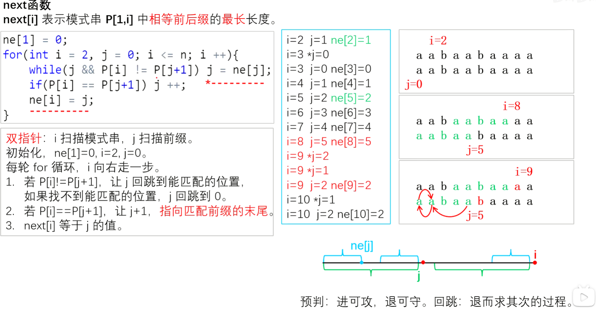

```c++
//字符串下标从1开始
// s[]是长文本，p[]是模式串，n是s的长度，m是p的长度
求模式串的Next数组：
ne[1]=0;
for (int i = 2, j = 0; i <= m; i ++ )
{
    while (j && p[i] != p[j + 1]) j = ne[j];
    if (p[i] == p[j + 1]) j ++ ;
    ne[i] = j;
}

// 匹配
for (int i = 1, j = 0; i <= n; i ++ )
{
    while (j && s[i] != p[j + 1]) j = ne[j];
    if (s[i] == p[j + 1]) j ++ ;
    if (j == m)
    {
        j = ne[j];
        // 匹配成功后的逻辑
    }
}
```

### Trie树

```c++
int son[N][26], cnt[N], idx;
// 0号点既是根节点，又是空节点
// son[][]存储树中每个节点的子节点
// cnt[]存储以每个节点结尾的单词数量

// 插入一个字符串
void insert(char *str)
{
    int p = 0;
    for (int i = 0; str[i]; i ++ )
    {
        int u = str[i] - 'a';
        if (!son[p][u]) son[p][u] = ++ idx;
        p = son[p][u];
    }
    cnt[p] ++ ;
}

// 查询字符串出现的次数
int query(char *str)
{
    int p = 0;
    for (int i = 0; str[i]; i ++ )
    {
        int u = str[i] - 'a';
        if (!son[p][u]) return 0;
        p = son[p][u];
    }
    return cnt[p];
}
```

### 并查集

==注意：对于所有查询父节点的操作使用find(i)，而不是p[i]，因为路径压缩只发生在再次查询时，当没有再次查询时，并没有路径压缩==

* 合并两个集合
* 查询某个元素的祖宗节点
* 记录每个集合大小 ——>绑定到根节点
* 记录每个点到根节点的距离——>绑定到每个元素
  * 带权
  * 拓展域

* 判断是否成环——当新加入的两个端点已经在连通块中时，则表明成环

可以用来判断连通块是否成环——>把两个点放入同一个集合前，两点的祖宗节点相同，此时再把两点放入集合及为环

```c++

(1)朴素并查集：

    int p[N]; //存储每个点的祖宗节点

    // 返回x的祖宗节点
    int find(int x)
    {
        if (p[x] != x) p[x] = find(p[x]);
        return p[x];
    }
	int find(int x)
    {
        return p[x]==x ? x : p[x]=find(p[x]);
    }


    // 初始化，假定节点编号是1~n
    for (int i = 1; i <= n; i ++ ) p[i] = i;

    // 合并a和b所在的两个集合：
    p[find(a)] = find(b);


(2)维护size的并查集：

    int p[N], size[N];
    //p[]存储每个点的祖宗节点, size[]只有祖宗节点的有意义，表示祖宗节点所在集合中的点的数量

    // 返回x的祖宗节点
    int find(int x)
    {
        if (p[x] != x) p[x] = find(p[x]);
        return p[x];
    }

	
    // 初始化，假定节点编号是1~n
    for (int i = 1; i <= n; i ++ )
    {
        p[i] = i;
        size[i] = 1;
    }

    // 合并a和b所在的两个集合：
	if(find(b)!=find(a))  size[find(b)] += size[find(a)];//当祖先相同时，说明已经加过了，不用重复加
    p[find(a)] = find(b);
 
        //按秩合并（启发式合并） 
        //把小集合的根指向大集合  //几乎用不到
        void unionset(int x,int y)
        {
            x=find(x),y=find(y);
            if(x==y) return ;
            if(size(x)>size(y)) swap(x,y);
            p[x]=y;
            size[y]+=size[x];
        }
    

(3)维护到祖宗节点距离的并查集：
    一般求任意两点之间的关系，可以根据两点到根节点，做相减等运算来求

    int p[N], d[N];
    //p[]存储每个点的祖宗节点, d[x]存储x到p[x]的距离

    // 返回x的祖宗节点
    int find(int x)
    {
        if (p[x] != x)
        {
            int u = find(p[x]);
            d[x] += d[p[x]];
            p[x] = u;
        }
        return p[x];
    }

    // 初始化，假定节点编号是1~n
    for (int i = 1; i <= n; i ++ )
    {
        p[i] = i;
        d[i] = 0;
    }

    // 合并a和b所在的两个集合：
    p[find(a)] = find(b);
    d[find(a)] = distance; // 根据具体问题，初始化find(a)的偏移量，一般是size[find(b)];
```

**拓展域**

1~n各元素中，存在相同和相对的关系，那么就把各元素都分成x和x+n两部分，分别表示为和x相同的部分及和x相对的部分，当x和y相同时，则把x和y相连接，把x+n和y+n相连接(x和y相同也代表x相对的和y相对的是相同的)，当x和y相对时，则把x和y+n相连接，把x+n和y相连接(即x和y相对的是相同的，x相对的和y是相同的)。

```c++
if(op=="even")
{
    if(find(a)==find(b+n))
    {
        ans=i-1;
        break;
    }
    p[find(a)]=find(b);
    p[find(a+n)]=find(b+n);
}
else
{
    if(find(a)==find(b))
    {
        ans=i-1;
        break;
    }
    p[find(a)]=find(b+n);
    p[find(a+n)]=find(b);
}
```

**带权并查集**

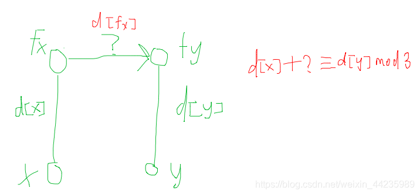

#### 并查集利用父节点维护整个连通块信息

[例题]([2069. 网络分析 - AcWing题库](https://www.acwing.com/problem/content/2071/))

```c++
int find(int x)
{
    if(p[x]==x||p[p[x]] == p[x]) return p[x]; //当x是根节点或者x的父节点是根节点就返回，x自己如果不是根节点就一定有一个父节点，导致每次find的时候都相当于重复操作一次找父节点，（并且更新值），因此为了避免这个问题，就直接返回，在最后查询的时候再加上
    int r = find(p[x]);
    d[x]+=d[p[x]];
    p[x]=r;
    return r;
}
void solve(){
    int n,m;cin >>n >> m;
    for(int i=1;i<=n;i++) p[i]=i;
    
    while(m--)
    {
        int op,a,b;cin >> op>>a >> b;
        if(op==1)
        {
            a = find(a),b=find(b);
            if(a==b) continue;
            d[a]-=d[b]; //当当前结点加入新的父结点下时，新的父节点如果有值，最后更新就会出错，因为这个值是还没合并的时候就有的，所以在加入的时候先给减去，最后加上就会抵消
            p[a]=b;
        }
        else
        {
            d[find(a)]+=b;    
        }
    }
    for(int i=1;i<=n;i++)
    {
        if(i==find(i)) cout << d[i] << " ";
        else cout << d[i] + d[find(i)] << " ";
    }
}
```


### 树状数组

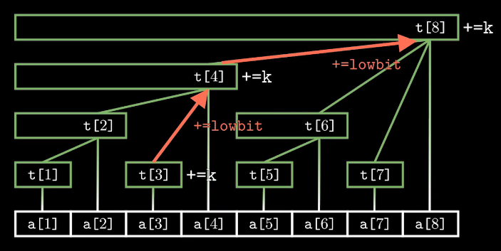

```c++
#define lowbit(x)  ((x)&-(x))

int lowbit(int x)
{
    return x & -x;
}
//单点修改
void update(int x,int d) //给最低位的1加上一个最低位的1
{
    for(int i=x;i<=N;i+=lowbit(i)) tr[i]+=d;
}
//查询前缀和
int sum(int x)
{
    int ans=0;
    for(int i=x;i;i-=lowbit(i)) ans+=tr[i];
    return ans;
}

//初始化
for(int i=1;i<=n;i++) cin >> a[i],update(i,a[i]); 
```

**区间修改+单点查询**

```c++
for(int i=1;i<=n;i++) cin >> a[i],update(i,a[i]-a[i-1]);
int l,r,d;cin >> l >> r >> d;
update(l,d);
update(r+1,-d);
```

**区间修改+区间查询**


```c++
int tr1[N],tr2[N]; //tr1表示di数 tr2表示i*di数
int lowbit(int x)
{
    return x & -x;
}

void update(int tr[],int x,int d) //要多一个传数组的参数，表明修改的数组
{
    for(int i=x;i<=N;i+=lowbit(i)) tr[i]+=d;
}

int sum(int tr[],int x)
{
    int ans=0;
    for(int i=x;i;i-=lowbit(i)) ans+=tr[i];
    return ans;
}

int prefix(int x) //前缀和之后再求其前缀和
{
    return sum(tr1,x)*(x+1)-sum(tr2,x);
}
int main()
{
     for(int i=1;i<=n;i++)
    {
        cin >> a[i];
        int j=a[i]-a[i-1];
        update(tr1,i,j);
        update(tr2,i,i*j);
    }
    if(op=='Q') //询问操作
        {
            int l,r;
            cin >> l >> r;
            cout << prefix(r)-prefix(l-1) << endl;
        }
        else //修改操作
        {
            int l,r,d;cin >> l >> r >> d;
            update(tr1,l,d);
            update(tr1,r+1,-d);
            update(tr2,l,l*d);
            update(tr2,r+1,-(r+1)*d);
        }
}
```


**二维区间修改+单点查询**

```c++
#include<bits/stdc++.h>
using namespace std;
const int N = 2050;
int t1[N][N], t2[N][N], t3[N][N], t4[N][N];
#define lowbit(x) ((x)&-(x))
int n, m;
void update(int x, int y, int d) {
	for (int i = x; i <= n; i += lowbit(i)) {
		for (int j = y; j <= m; j += lowbit(j)) {
			t1[i][j] += d;
			t2[i][j] += x*d;
			t3[i][j] += y*d;
			t4[i][j] += x*y*d;
		}
	}
}
int sum(int x, int y) {
	int ans = 0;
	for (int i = x; i > 0; i -= lowbit(i)) {
		for (int j = y; j > 0; j -= lowbit(j)) {
			ans += (x + 1) * (y + 1) * t1[i][j] - (y + 1) * t2[i][j] - (x + 1) * t3[i][j] + t4[i][j];
		}
	}
	return ans;
}
int main() {
	char ch[2];
	cin >> ch;
	scanf("%d%d", &n, &m);
	while (scanf("%s", ch) != EOF) {
		int a, b, c, d, delta;
		cin >> a >> b >> c >> d;
		if (ch[0] == 'L') { //(a,b)到(c,d)所有数加上delta
			cin >> delta;
			update(a, b, delta);
			update(a, d+1, -delta);
			update(c+1,d+1, delta);
			update(c+1, b, -delta);
		}
		else { //(a,b)到(c,d)区间和
			printf("%d\n", sum(c, d) + sum(a - 1, b - 1) - sum(a - 1, d) - sum(c, b - 1));
		}
	}
	return 0;
}
```


### 线段树

```c++ 
二叉树
父节点 x>>1;
左子节点 x<<1;
右子节点 x>>1|1;
```

**开空间开4*N**

* 是不是根节点，是就修改返回
* 不是取mid，找左右结点（看在哪个孩子里）
* 更新当前u

**单点修改+区间求和/区间最大（小）值** 

```c++ 
#include <iostream>
#include <cstring>
#include <algorithm>
#define int long long

using namespace std;

#define lc u<<1 //左孩子
#define rc u<<1|1 //右孩子
const int N = 1e5+10;
int w[N];
struct Tree
{
    int l,r,sum;
}tr[4*N];

void build(int u,int l,int r) //建树
{
    tr[u]={l,r,w[l]};
    if(l==r) return; //叶子节点
    int mid = l+r>>1;
    build(lc,l,mid);
    build(rc,mid+1,r);
    tr[u].sum=tr[lc].sum+tr[rc].sum;
 }

void update(int u,int x,int k) //点修改
{
    if(tr[u].l==x&&tr[u].r==x) //叶子则修改
    {
        tr[u].sum+=k;
        return;
    }
    int mid=tr[u].l+tr[u].r>>1; //非叶子则裂开
    if(x<=mid) update(lc,x,k);
    if(x>mid) update(rc,x,k);
    tr[u].sum=tr[lc].sum+tr[rc].sum; 

}

int query(int u,int x,int y)
{
    if(x<=tr[u].l&&tr[u].r<=y) //覆盖则返回
        return tr[u].sum;
    int mid=tr[u].l+tr[u].r>>1;//不覆盖则裂开
    int sum=0;
    if(x<=mid) sum+=query(lc,x,y);
    if(y>mid) sum+=query(rc,x,y);
    return sum;
}


signed main()
{
    int n,m;
    cin >> n >> m;
    for(int i=1;i<=n;i++) cin >> w[i];
    build(1,1,n); //建树

    while(m--)
    {
        int op;
        cin >> op;
        if(op==1)
        {
            int x,k;
            cin >> x >> k;
            update(1,x,k);
        }
        else
        {
            int x,y;
            cin >> x >> y;
            cout << query(1,x,y) << endl;
        }
    }
}
```

**区间修改+区间查询**

```c++
#include <iostream>
#include <cstring>
#include <algorithm>
#define int long long

using namespace std;

#define lc u << 1
#define rc u << 1 | 1

const int N = 100005;
int w[N*4];
struct Tree //线段树
{
    int l,r,sum,add;
}tr[4*N];

void pushup(int u) //上传
{
    tr[u].sum=tr[lc].sum+tr[rc].sum;
}

void pushdown(int u)//下传
{
    if(tr[u].add)
    {
        tr[lc].sum+=tr[u].add*(tr[lc].r-tr[lc].l+1);
        tr[rc].sum+=tr[u].add*(tr[rc].r-tr[rc].l+1);
        tr[lc].add+=tr[u].add;
        tr[rc].add+=tr[u].add;
        tr[u].add=0;
    }
}

void build(int u,int l,int r)//建树
{
    tr[u]={l,r,w[l],0};
    if(l==r) return;
    int m=l+r>>1;
    build(lc,l,m);
    build(rc,m+1,r);
    pushup(u);
}

void change(int u,int l,int r,int k) //区间修改
{
    if(l<=tr[u].l&&tr[u].r<=r)
    {
        tr[u].sum+=(tr[u].r-tr[u].l+1)*k;
        tr[u].add+=k;
        return;
    }
    int m=tr[u].l+tr[u].r>>1;
    pushdown(u);
    if(l<=m) change(lc,l,r,k);
    if(r>m) change(rc,l,r,k);
    pushup(u);
}

int query(int u,int l,int r) //区间查询
{
    if(l<=tr[u].l&&tr[u].r<=r) return tr[u].sum;
    int m=tr[u].l+tr[u].r>>1;
    pushdown(u);
    int sum=0;
    if(l<=m) sum+=query(lc,l,r);
    if(r>m) sum+=query(rc,l,r);
    return sum;
}

signed main()
{
    int n,m;
    cin >> n >> m;
    for(int i=1;i<=n;i++) cin >> w[i];
    build(1,1,n); //建树

    while(m--)
    {
        int op;
        cin >> op;
        if(op==1)
        {
            int x,y,k;
            cin >> x >> y >> k;
            change(1,x,y,k);
        }
        else
        {
            int x,y;
            cin >> x >> y;
            cout << query(1,x,y) << endl;
        }
    }
}
```

**区间最大子段和**

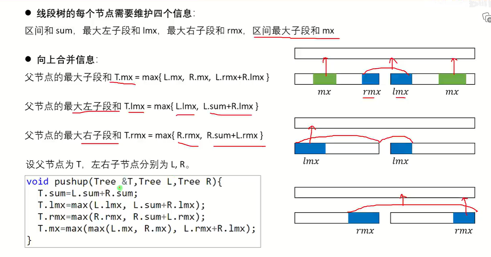

```cpp
#include <bits/stdc++.h>
#define int long long
#define lc u<<1
#define rc u<<1|1
using namespace std;
const int N = 5e5+10;
int w[N];

struct Tree{
    int l,r,sum,mx,lmx,rmx;
}tr[N*4];

void pushup(Tree &t,Tree l,Tree r)
{
    t.mx= max(max(l.mx,r.mx),l.rmx+r.lmx);
    t.sum = l.sum+r.sum;
    t.lmx = max(l.lmx,l.sum+r.lmx);
    t.rmx = max(r.rmx,l.rmx+r.sum);
}
void build(int u,int l,int r)
{
    tr[u]={l,r,w[l],w[l],w[l],w[l]};
    if(l==r) return;
    int mid = l+r >> 1;
    build(lc,l,mid);
    build(rc,mid+1,r);
    pushup(tr[u],tr[lc],tr[rc]);
}
void update(int u,int x,int k)
{
    if(tr[u].l==x&&tr[u].r==x) 
    {
        tr[u]={x,x,k,k,k,k};
        return;
    }
    int mid = tr[u].l+tr[u].r>>1;
    if(x<=mid) update(lc,x,k);
    if(x>mid) update(rc,x,k);
    pushup(tr[u],tr[lc],tr[rc]);
}
Tree query(int u,int x,int y) //要构建一个新树保存一个新的区间
{//原先创建的区间只能是固定每个范围的
    if(x<=tr[u].l&&y>=tr[u].r) return tr[u];
    int mid = tr[u].l+tr[u].r>>1;
    if(y<=mid) return query(lc,x,y); //注意这里的比较条件和之前不同
    if(x>mid) return query(rc,x,y); //如果全部在某一个区间，就直接返回这个区间
    Tree t; //开一个临时节点，存储拼凑结果
    pushup(t,query(lc,x,mid),query(rc,mid+1,y));
    return t;
}
signed main()
{
    int n,m;cin >> n >> m;
    for(int i=1;i<=n;i++) cin >> w[i];
    build(1,1,n);
    while(m--)
    {
        int op;cin >> op;
        int l,r;cin >> l >> r;
        if(op==2)  update(1,l,r);
        else
        {
            if(l>r) swap(l,r);
            Tree t = query(1,l,r);
            cout << t.mx << endl;
        }
    }
    return 0;
}
```


```c++
#include <iostream>
#include <cstring>
#include <algorithm>
using namespace std;

#define ls u<<1
#define rs u<<1|1
const int N=100005;
int n,m,a[N];
struct tree{
  int l,r;
  int b,lb,rb,mb,c,lc,rc,mc;
  int len,tag,rev;
}tr[N<<2];
// b:区间1的个数,      c:区间0的个数
//lb:区间左起1的长度, lc:区间左起0的长度
//rb:区间右起1的长度, rc:区间右起0的长度
//mb:区间1的最长长度, mc:区间0的最长长度
//len:区间的长度
//tag:区间赋值标记,无标记:-1,有标记:0或1
//rev:区间取反标记,无标记: 0,有标记:1

void pushup(tree& u,tree l,tree r){ //上传
  u.b=l.b+r.b;
  u.lb=l.c ? l.lb : l.b+r.lb;
  u.rb=r.c ? r.rb : r.b+l.rb;
  u.mb=max(max(l.mb,r.mb),l.rb+r.lb);
  u.c=l.c+r.c;
  u.lc=l.b ? l.lc : l.c+r.lc;
  u.rc=r.b ? r.rc : r.c+l.rc;
  u.mc=max(max(l.mc,r.mc),l.rc+r.lc);
}
void pd(int u,int opt){ //操作区间
  tree& t=tr[u];
  if(opt==0){ //区间赋值为0
    t.b=t.lb=t.rb=t.mb=0;
    t.c=t.lc=t.rc=t.mc=t.len;
    t.tag=0; t.rev=0;
  }
  if(opt==1){ //区间赋值为1
    t.b=t.lb=t.rb=t.mb=t.len;
    t.c=t.lc=t.rc=t.mc=0;
    t.tag=1; t.rev=0;
  }
  if(opt==2){ //区间取反
    swap(t.b,t.c);swap(t.lb,t.lc);
    swap(t.rb,t.rc);swap(t.mb,t.mc);
    t.rev^=1;
  }
}
void pushdown(int u){ //下传
  tree& t=tr[u];
  if(t.tag==0) pd(ls,0),pd(rs,0);
  if(t.tag==1) pd(ls,1),pd(rs,1);
  if(t.rev) pd(ls,2),pd(rs,2);
  t.tag=-1; t.rev=0;
}
void build(int u,int l,int r){ //建树
  int t=a[l];
  tr[u]={l,r,t,t,t,t,
         t^1,t^1,t^1,t^1,r-l+1,-1,0};
  if(l==r) return;
  int m=l+r>>1;
  build(ls,l,m); build(rs,m+1,r);
  pushup(tr[u],tr[ls],tr[rs]);
}
void change(int u,int x,int y,int k){ //区修
  if(y<tr[u].l || tr[u].r<x) return;
  if(x<=tr[u].l&&tr[u].r<=y){pd(u,k);return;}
  pushdown(u);
  change(ls,x,y,k); change(rs,x,y,k);
  pushup(tr[u],tr[ls],tr[rs]);
}
tree query(int u,int x,int y){ //区查
  if(x>tr[u].r || y<tr[u].l) return {};
  if(x<=tr[u].l&&tr[u].r<=y) return tr[u];
  pushdown(u);
  tree T; //开一个临时节点，存储拼凑结果
  pushup(T,query(ls,x,y),query(rs,x,y));
  return T;
}
int main(){
  scanf("%d%d",&n,&m);
  for(int i=1;i<=n;i++) scanf("%d",a+i);
  build(1,1,n);
  
  for(int i=1;i<=m;i++){
    int opt,l,r;
    scanf("%d%d%d",&opt,&l,&r); ++l,++r;
    if(opt<3) change(1,l,r,opt);
    else{
      tree t=query(1,l,r);
      printf("%d\n",opt==3?t.b:t.mb);
    }
  }
  return 0;
}
```


### 堆

```c++
// h[N]存储堆中的值, h[1]是堆顶，x的左儿子是2x, 右儿子是2x + 1
// ph[k]存储第k个插入的点在堆中的位置
// hp[k]存储堆中下标是k的点是第几个插入的

// 交换两个点，及其映射关系
int h[N], ph[N], hp[N], cnt;

void heap_swap(int a, int b)
{
    swap(ph[hp[a]],ph[hp[b]]);
    swap(hp[a], hp[b]);
    swap(h[a], h[b]);
}

void down(int u)
{
    int t = u;
    if (u * 2 <= cnt && h[u * 2] < h[t]) t = u * 2;
    if (u * 2 + 1 <= cnt && h[u * 2 + 1] < h[t]) t = u * 2 + 1;
    if (u != t)
    {
        heap_swap(u, t);
        down(t);
    }
}

void up(int u)
{
    while (u / 2 && h[u] < h[u / 2])
    {
        heap_swap(u, u / 2);
        u >>= 1;
    }
}

int main()
{
    int n, m = 0;
    scanf("%d", &n);
    while (n -- )
    {
        char op[5];
        int k, x;
        scanf("%s", op);
        if (!strcmp(op, "I"))//插入
        {
            scanf("%d", &x);
            cnt ++ ;
            m ++ ;
            ph[m] = cnt, hp[cnt] = m;
            h[cnt] = x;
            up(cnt);
        }
        else if (!strcmp(op, "PM")) printf("%d\n", h[1]); //最小
        else if (!strcmp(op, "DM")) //删最小
        {
            heap_swap(1, cnt);
            cnt -- ;
            down(1);
        }
        else if (!strcmp(op, "D")) //删第k个插入的元素
        {
            scanf("%d", &k);
            k = ph[k];
            heap_swap(k, cnt);
            cnt -- ;
            up(k);
            down(k);
        }
        else
        {
            scanf("%d%d", &k, &x);
            k = ph[k];
            h[k] = x;
            up(k);
            down(k);
        }
    }

    return 0;
}
```

### 哈希

#### 一般哈希

```c++
(1) 拉链法
    int h[N], e[N], ne[N], idx;

    // 向哈希表中插入一个数
    void insert(int x)
    {
        int k = (x % N + N) % N;
        e[idx] = x;
        ne[idx] = h[k];
        h[k] = idx ++ ;
    }

    // 在哈希表中查询某个数是否存在
    bool find(int x)
    {
        int k = (x % N + N) % N;
        for (int i = h[k]; i != -1; i = ne[i])
            if (e[i] == x)
                return true;

        return false;
    }

(2) 开放寻址法
    int h[N];

    // 如果x在哈希表中，返回x的下标；如果x不在哈希表中，返回x应该插入的位置
    int find(int x)
    {
        int t = (x % N + N) % N;
        while (h[t] != null && h[t] != x)
        {
            t ++ ;
            if (t == N) t = 0;
        }
        return t;
    }
```

#### 字符串哈希

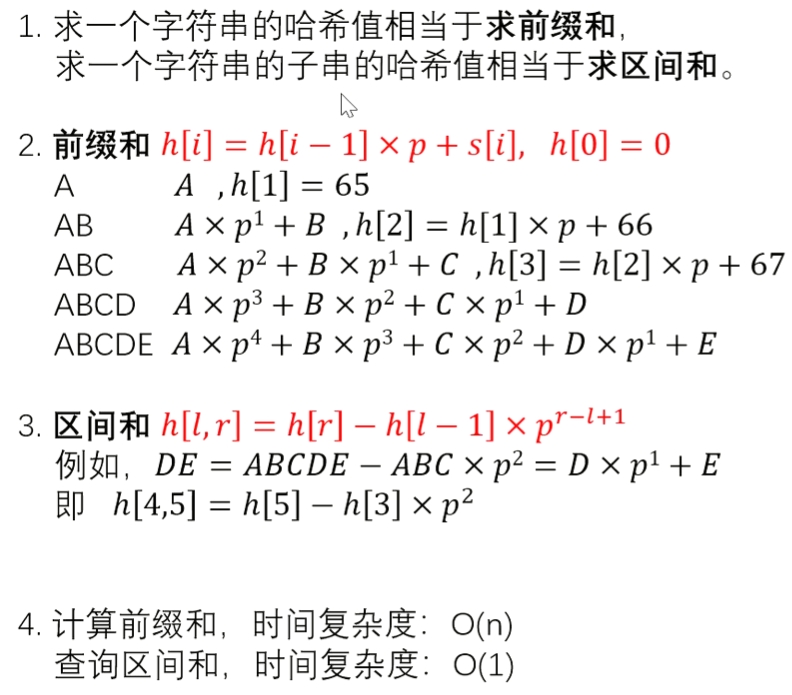

```c++
核心思想：将字符串看成P进制数，P的经验值是131或13331，取这两个值的冲突概率低
小技巧：取模的数用2^64，这样直接用unsigned long long存储，溢出的结果就是取模的结果

typedef unsigned long long ULL;
ULL h[N], p[N]; // h[k]存储字符串前k个字母的哈希值, p[k]存储 P^k mod 2^64

// 初始化
p[0] = 1;
for (int i = 1; i <= n; i ++ )
{
    h[i] = h[i - 1] * P + str[i];
    p[i] = p[i - 1] * P;
}

// 计算子串 str[l ~ r] 的哈希值
ULL get(int l, int r)
{
    return h[r] - h[l - 1] * p[r - l + 1];
}
```

##### 字符串哈希判断回文数

```c++
typedef unsigned long long ULL;
const int N = 1e6+10,P=13331;
ULL hf[N],hb[N],p[N];
int n, q;
string a;
 
void init()
{
    p[0]=1,hf[0]=0,hb[0]=0;
    for(int i=1;i<=n;i++)
    {
        p[i]=p[i-1]*P;
        hf[i]=hf[i-1]*P+a[i]-'a';
        hb[i]=hb[i-1]*P+a[(n+1)-i]-'a';
    }
}
 
ULL getf(int l,int r)
{
    return hf[r]-hf[l-1]*p[r-l+1];
}
ULL getb(int l,int r)
{
    return hb[(n+1)-l]-hb[(n+1)-r-1]*p[r-l+1];
}
```

## 搜索与图论

### 记录路径

```c++
//记录前一步到当前步的走法
void printAns(int x,int y)
{
    if(x==0&&y==0) return; //一直回溯到最开始
    else if(pre[x][y]=='D') printAns(x-1,y);
    else if(pre[x][y]=='L') printAns(x,y+1);
    else if(pre[x][y]=='R') printAns(x,y-1);
    else if(pre[x][y]=='U') printAns(x+1,y);
    cout << pre[x][y];
}
//区分x,y
```


### 树和图的存储

树是一种特殊的图，与图的存储方式相同。
对于无向图中的边ab，存储两条有向边a->b, b->a。
因此我们可以只考虑有向图的存储。

(1) 邻接矩阵：g[a][b] 存储边a->b

(2) 邻接表：

```c++
// 对于每个点k，开一个单链表，存储k所有可以走到的点。h[k]存储这个单链表的头结点
int h[N], e[N], ne[N], idx;

// 添加一条边a->b
void add(int a, int b)
{
    e[idx] = b, ne[idx] = h[a], h[a] = idx ++ ;
}

// 初始化
idx = 0;
memset(h, -1, sizeof h);
```

(3) stl

```c++
void dfs(int u, int fa)
{
    for (auto& v : g[u]) 
    {
        if (v == fa) continue;
        cnt[v] = cnt[u] + 1;
        dfs(v, u);
    }
};
vector<vector<int> > g(n + 1);
    for (int i = 1; i < n; i ++) {
        int u, v; cin >> u >> v;
        g[u].push_back(v);
        g[v].push_back(u);
    }
```


### 无向图

```c++
void add(int a,int b)
{
    e[idx]=b,ne[idx]=h[a],h[a]=idx++;
}

void dfs(int u,int fa)
{

     for(int i=h[u];i!=-1;i=ne[i])
     {
         if(e[i]==fa) continue; //无向图防止返回把自己再次遍历一遍
         sz[e[i]]=sz[u]+1;
         dfs(e[i],u);
         
     }
}
add(a,b),add(b,a);
dfs(1,1);
```


### 数和图的遍历

时间复杂度 O(n+m)，n表示点数，m表示边数

#### DFS

```c++
int dfs(int u)
{
    st[u] = true; // st[u] 表示点u已经被遍历过

    for (int i = h[u]; i != -1; i = ne[i])
    {
        int j = e[i];
        //状态改变
        if (!st[j]) dfs(j);
        //状态复原
    }
}
```

```c++ 
ans;
void dfs(层数，其他参数)
{
	if(出局判断)
    {
        更新答案；
        return;
    }
    (剪枝)
    for(枚举下一层可能的情况)
    {
        if(used[i]==0)
        {
            used[i] = 1;
            dfs(层数+1，其他参数);
            used[i]=0;
        }
    }
}
```

##### 奇偶剪枝

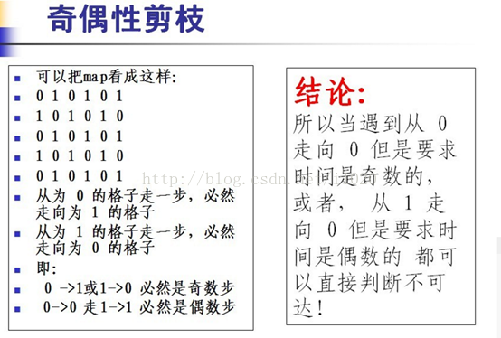

曼哈顿距离 d(i,j)=|X1-X2|+|Y1-Y2|

两点之间的[曼哈顿距离](https://blog.csdn.net/weixin_52361979/article/details/118874475?spm=1001.2014.3001.5501)为奇数, 则只能在奇数步内到达，偶数同理。

即：假设起点为(x1,y1)，终点为(x2,y2)，给定 step 步恰好走到终点，则 abs(x2-x1)+abs(y2-y1) 与 step 同奇偶。

t为规定起点到终点步数

假设当前已走step步，则还剩下==t-step==步，设当前点到终点的最短距离为==abs（si - dx）+ abs(sj - dy)==，则两者的**奇偶性一定一致**的（由上面那段话可知）并且前者一定大于等于后者（剩下要走的步数大于等于该坐标到终点的最短距离），只有这样，才能够到达。也就是

tem = t – step – (abs（si - dx）+ abs(sj - dy))，tem >= 0 && tem % 2 == 0.

一般可以最开始就做一次，在main函数里，加快速度

##### 剪枝

* 规定到达步数，已走步数与规定步数的大小 

  ```c++
  t 规定步数
  step 已走步数
  
  //1.当前步数已超过要求步数
  if(t-step<0) return;
  
  //2.剩余步数比当前点到终点的曼哈顿距离还少
  int mhd(int x,int y,int a,int b)
  {
      return abs(x-a)+abs(y-b);
  }
  int check=t-step-mhd(x,y,a,b);
  if(check<0) return;
  ```

  

#### BFS

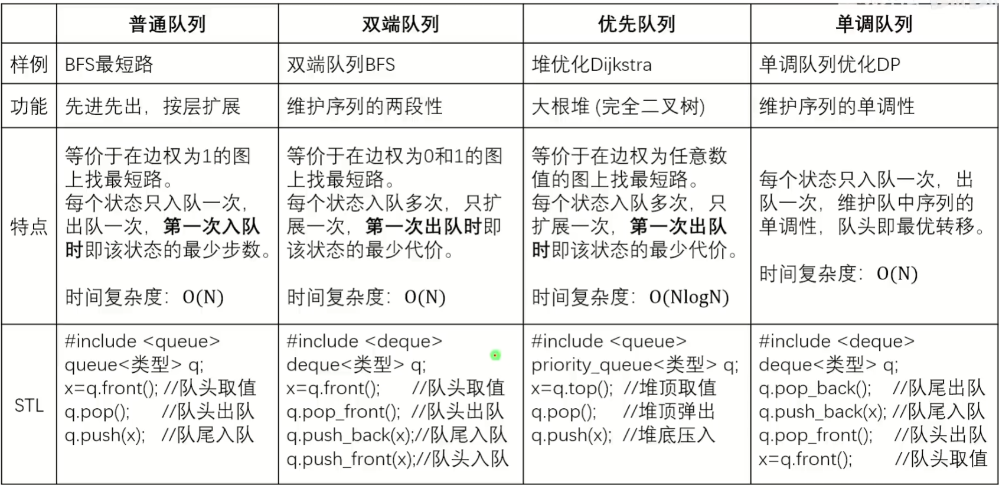

一定要保证新入队的点步数大于队中的所有点

```c++
queue<int> q;
st[1] = true; // 表示1号点已经被遍历过
q.push(1);

while (q.size())
{
    int t = q.front();
    q.pop();

    for (int i = h[t]; i != -1; i = ne[i])
    {
        int j = e[i];
        if (!st[j])
        {
            st[j] = true; // 表示点j已经被遍历过
            q.push(j);
        }
    }
}
```

##### 多源BFS

思想类似于洪水漫灌

```c++
const int N = 1010;
int dx[4]={0,0,1,-1},dy[4]={1,-1,0,0};
char g[N][N];
int dis[N][N]; //又记住距离，又判重
void solve(){
    int n,m;cin >> n >> m;
    queue<PII> q;
    memset(dis,-1,sizeof(dis));
    for(int i=0;i<n;i++)
        for(int j=0;j<m;j++)
        {   
            cin >> g[i][j];
            if(g[i][j]=='1')
            {
                q.push({i,j}); //将多个源头都放入
                dis[i][j]=0;
            }
        }
    while (q.size())
    {
        auto [x,y]=q.front();q.pop();
        for(int i=0;i<4;i++)
        {
            int xx=x+dx[i],yy=y+dy[i];
            if(xx>=m||xx<0||yy>=n||yy<0) continue;
            if(dis[xx][yy]!=-1) continue; //如果距离不是-1则说明已经被遍历过
            dis[xx][yy] = dis[x][y]+1;
            q.push({xx,yy});
        }
    }
}
```

#### 双向bfs

已知起点终点，分别从起点和终点出发，找相遇时刻

适用于下一层结点成指数增长，如二叉树，如果增长是线性的，双向的改善不明显

```c++
int bfs(queue<PII> &q,unordered_map<string,int> &ma,unordered_map<string,int> &mb,string a[N],string b[N])
{
    int m=q.size(); 
    while(m--) //每次只遍历一层，结合题意是走一步
    {
        auto [u,c] = q.front();q.pop();
        for(int i=0;i<n;i++)
        {
            int pos=-1,flag=1;
            while(pos!=-1||flag)
            {
                flag=0;
                pos = u.find(a[i],pos+1);
                if(pos==-1) continue;
                string ne = u.substr(0,pos)+b[i]+u.substr(pos+a[i].size());
                if(ma.count(ne)) continue; //如果出现过，跳过
                if(mb.count(ne)) return ma[u]+mb[ne]+1; //新出现的在另一个也搜索过，记录
                ma[ne]=ma[u]+1;
                q.push({ne,c+1});
            }
        }
    }
    return 11;
}

int step=10; //只能走十步
while(step--)
{
    int ans;
    if(qx.size()<qy.size()) ans=bfs(qx,mx,my,a,b); //哪一层小就先遍历哪个
    else ans=bfs(qy,my,mx,b,a);
}
```


### 拓扑排序

时间复杂度 O(n+m)，n表示点数，m表示边数

```c++
bool topsort()
{
    int hh = 0, tt = -1;

    // d[i] 存储点i的入度
    for (int i = 1; i <= n; i ++ )
        if (!d[i])
            q[ ++ tt] = i;

    while (hh <= tt)
    {
        int t = q[hh ++ ];

        for (int i = h[t]; i != -1; i = ne[i])
        {
            int j = e[i];
            if (-- d[j] == 0)
                q[ ++ tt] = j;
        }
    }

    // 如果所有点都入队了，说明存在拓扑序列；否则不存在拓扑序列。
    return tt == n - 1;
}
```

#### Kahn算法（队列维护

```c++
vector<int>e[N],tp; //e用来建图，tp用来存拓扑序
int din[N]; // 每个点入度

bool toposort()
{
    queue<int>q; //存当前入度为0的点，若要最大或最小字典序排，则使用优先队列
    for(int i=1;i<=n;i++)
    	if(din[i]==0) q.push(i);
    while(q.size())
    {
        int x=q.front();q.pop();
        tp.push_back(x);
        for(auto y:e[x])
        {
            din[y]--;
            if(din[y]==0) q.push(y);
        }
    }
	return tp.size() == n;
}
int main()
{
    cin >> n >> m;
    for(int i=0;i<m;i++)
    {
        cin >> a >> b;
        e[a].push_back(b);
        din[b]++;
    }
    if(!toposort()) puts("-1");
    else for(auto x:tp) cout << x << " ";
}
```

#### DFS算法

```c++
vector<int>e[N],tp; //e用来建图，tp用来存拓扑序
int c[N]; //染色数组 0->-1->1 未开始搜索->开始搜索正在找其子点->压入拓扑序中

bool dfs(int x)
{
    c[x]=-1; //一旦进入说明开始搜索
    for(int y : e[x])
    {
        if(c[y]<0) return 0; //其子点也在搜索 说明有环
        else if(!c[y]) //他的儿子是否还未搜索
        {
            if(!dfs(y)) return 0; //如果儿子发现0 说明儿子往下有环
        }
    }
    c[x]=1;//儿子全部找完，自己入队
    tp.push_back(x);
    return 1;
}
bool toposort()
{
    memset(c,0,sizeof 0);
    for(int i=1;i<=n;i++)
    {
        if(!c[i]) 
            if(!dfs(x)) return 0;
    }
    reverse(tp.begin(),tp.end());//
}
```


### 最短路

#### Dijkstra

#### 朴素

时间复杂是 O(n^2+m)，，n表示点数，m表示边数；

```c++
int g[N][N];  // 存储每条边
int dist[N];  // 存储1号点到每个点的最短距离
bool st[N];   // 存储每个点的最短路是否已经确定

// 求1号点到n号点的最短路，如果不存在则返回-1
int dijkstra()
{
    memset(dist, 0x3f, sizeof dist);
    dist[1] = 0;

    for (int i = 0; i < n - 1; i ++ )
    {
        int t = -1;     // 在还未确定最短路的点中，寻找距离最小的点
        for (int j = 1; j <= n; j ++ )
            if (!st[j] && (t == -1 || dist[t] > dist[j]))
                t = j;

        // 用t更新其他点的距离
        for (int j = 1; j <= n; j ++ )
            dist[j] = min(dist[j], dist[t] + g[t][j]);

        st[t] = true;
    }

    if (dist[n] == 0x3f3f3f3f) return -1;
    return dist[n];
}
```

#### 堆优化

时间复杂是 O(mlogn)，n表示点数，m表示边数；

```c++
typedef pair<int, int> PII;

int n;      // 点的数量
int h[N], w[N], e[N], ne[N], idx;       // 邻接表存储所有边
int dist[N];        // 存储所有点到1号点的距离
bool st[N];     // 存储每个点的最短距离是否已确定

// 求1号点到n号点的最短距离，如果不存在，则返回-1
int dijkstra()
{
    memset(dist, 0x3f, sizeof dist);
    dist[1] = 0;
    priority_queue<PII, vector<PII>, greater<PII>> heap;
    heap.push({0, 1});      // first存储距离，second存储节点编号

    while (heap.size())
    {
        auto t = heap.top();
        heap.pop();

        int ver = t.second, distance = t.first;

        if (st[ver]) continue;
        st[ver] = true;

        for (int i = h[ver]; i != -1; i = ne[i])
        {
            int j = e[i];
            if (dist[j] > distance + w[i])
            {
                dist[j] = distance + w[i];
                heap.push({dist[j], j});
            }
        }
    }

    if (dist[n] == 0x3f3f3f3f) return -1;
    return dist[n];
}
```

##### 矩阵下dijkstra

```c++
struct Node{
    int x, y, d;
    bool operator< (const Node& t) const{
        return d > t.d;
    }
};
  priority_queue<Node> heap;
```


#### Bellman-Ford

时间复杂是 O(mn)，n表示点数，m表示边数；

```c++
int n, m;       // n表示点数，m表示边数
int dist[N];        // dist[x]存储1到x的最短路距离

struct Edge     // 边，a表示出点，b表示入点，w表示边的权重
{
    int a, b, w;
}edges[M];

// 求1到n的最短路距离，如果无法从1走到n，则返回-1。
int bellman_ford()
{
    memset(dist, 0x3f, sizeof dist);
    dist[1] = 0;

    // 如果第n次迭代仍然会松弛三角不等式，就说明存在一条长度是n+1的最短路径，由抽屉原理，路径中至少存在两个相同的点，说明图中存在负权回路。
    for (int i = 0; i < n; i ++ )
    {
        for (int j = 0; j < m; j ++ )
        {
            int a = edges[j].a, b = edges[j].b, w = edges[j].w;
            if (dist[b] > dist[a] + w)
                dist[b] = dist[a] + w;
        }
    }

    if (dist[n] > 0x3f3f3f3f / 2) return -1;  //这里要注意更改，有可能最短距离是-1；
    return dist[n];
}
```

若有__边数限制__ 则需备份处理

```c++
int last[N];

void bellman_ford()
{
    memset(dist, 0x3f, sizeof dist);

    dist[1] = 0;
    for (int i = 0; i < k; i ++ )
    {
        memcpy(last, dist, sizeof dist);
        for (int j = 0; j < m; j ++ )
        {
            auto e = edges[j];
            dist[e.b] = min(dist[e.b], last[e.a] + e.c);
        }
    }
}
```

#### spfa算法（队列优化的Bellman-Ford算法）

时间复杂度 平均情况下 O(m)，最坏情况下 O(nm),n表示点数，m表示边数；


```c++
int n;      // 总点数
int h[N], w[N], e[N], ne[N], idx;       // 邻接表存储所有边
int dist[N];        // 存储每个点到1号点的最短距离
bool st[N];     // 存储每个点是否在队列中

// 求1号点到n号点的最短路距离，如果从1号点无法走到n号点则返回-1
int spfa()
{
    memset(dist, 0x3f, sizeof dist);
    dist[1] = 0;

    queue<int> q;
    q.push(1);
    st[1] = true;

    while (q.size())
    {
        auto t = q.front();
        q.pop();

        st[t] = false;

        for (int i = h[t]; i != -1; i = ne[i])
        {
            int j = e[i];
            if (dist[j] > dist[t] + w[i])
            {
                dist[j] = dist[t] + w[i];
                if (!st[j])     // 如果队列中已存在j，则不需要将j重复插入
                {
                    q.push(j);
                    st[j] = true;
                }
            }
        }
    }

    if (dist[n] == 0x3f3f3f3f) return -1;
    return dist[n];
}
```

#### spfa判断图中是否存在负环

一般题目中只要没有负环都可以用spfa

```c++
int n;      // 总点数
int h[N], w[N], e[N], ne[N], idx;       // 邻接表存储所有边
int dist[N], cnt[N];        // dist[x]存储1号点到x的最短距离，cnt[x]存储1到x的最短路中经过的点数
bool st[N];     // 存储每个点是否在队列中

// 如果存在负环，则返回true，否则返回false。
bool spfa()
{
    // 不需要初始化dist数组
    // 原理：如果某条最短路径上有n个点（除了自己），那么加上自己之后一共有n+1个点，由抽屉原理一定有两个点相同，所以存在环。

    queue<int> q;
    for (int i = 1; i <= n; i ++ )
    {
        q.push(i);
        st[i] = true;
    }

    while (q.size())
    {
        auto t = q.front();
        q.pop();

        st[t] = false;

        for (int i = h[t]; i != -1; i = ne[i])
        {
            int j = e[i];
            if (dist[j] > dist[t] + w[i])
            {
                dist[j] = dist[t] + w[i];
                cnt[j] = cnt[t] + 1;
                if (cnt[j] >= n) return true;       // 如果从1号点到x的最短路中包含至少n个点（不包括自己），则说明存在环
                if (!st[j])
                {
                    q.push(j);
                    st[j] = true;
                }
            }
        }
    }

    return false;
}
```

####  $floyd$算法

时间复杂度是 O($n3$),n表示点数

```c++
初始化：
    for (int i = 1; i <= n; i ++ )
        for (int j = 1; j <= n; j ++ )
            if (i == j) d[i][j] = 0;
            else d[i][j] = INF;

// 算法结束后，d[a][b]表示a到b的最短距离
void floyd()
{
    for (int k = 1; k <= n; k ++ )
        for (int i = 1; i <= n; i ++ )
            for (int j = 1; j <= n; j ++ )
                d[i][j] = min(d[i][j], d[i][k] + d[k][j]);
}
```


### 最小生成树

#### prim算法

##### 朴素版 O($n^2$)

适用于稠密图 点少线多

1. 与$dijkstra$不同，prim需要迭代n次（集合中一开始啥也没有）
2. 最小生成树是针对==无向图==的，所以在读入边的时候，需要赋值两次
3. 要==先累加再更新==，避免t有自环，影响答案的正确性。后更新不会影响后面的结果么？不会的，因为dist[i]为i到集合S的距离，当t放入集合后，其dist[t]就已经没有意义了，再更新也不会影响答案的正确性。
4. 需要==特判==一下==第一次迭代==，在我们没有做特殊处理时，第一次迭代中所有点到集合S的距离必然为无穷大，而且不会进行更新(也没有必要)，所以不需要将这条边(第一次迭代时，找到的距离集合S最短的边)累加到答案中，也不能认定为图不连通。
5. 如果需要设置起点为i的话，在初始化dist数组之后，dist[i] = 0即可，这样也可以省去每轮迭代中的两个if判断。

```c++
#include <iostream>
#include <algorithm>
#include <cstring>

using namespace std;

const int N = 510, INF = 0x3f3f3f3f;

int n,m;
int g[N][N];
int dist[N];
bool st[N];

int prim()
{
    memset(dist, 0x3f, sizeof dist);
    
    int res = 0;
    for(int i=0; i < n; i++)
    {
        int t=-1;
        for(int j=1; j<=n; j++)
            if(!st[j] && (t==-1 || dist[j]<dist[t])) t=j;
            
        if(i && dist[t] == INF) return INF; //对第一次加入集合要进行特判
        
        if(i) res += dist[t]; //先算距离再更新，避免存在负自环
        st[t] = true;
        
        for(int j=1; j<=n;j++) dist[j]=min(g[t][j],dist[j]);
    }
    return res;
}

int main()
{
    ios::sync_with_stdio(false),cin.tie(0),cout.tie(0);
    cin >> n >> m;
    
    memset(g, 0x3f, sizeof g);
    
    while(m--)
    {
        int a, b, c;
        cin >> a >> b >> c;
        g[a][b] = g[b][a] = min(g[a][b], c);
    }
    
    int t = prim();
    
    if(t == INF) puts("impossible");
    else cout << t;
    return 0;
}
```

#### $Kruskral$算法

__算法思路：__  O($mlogm$)

- 将所有边按照权值的大小进行==升序排序==，然后从小到大一一判断。

- 如果这个边与之前选择的所有边不会组成回路，就选择这条边分；反之，舍去。

- 直到具有 n 个顶点的连通网筛选出来 n-1 条边为止。

- 筛选出来的边和所有的顶点构成此连通网的最小生成树。

判断==是否会产生回路==的方法为：使用==并查集==。

- 在初始状态下给各个个顶点在不同的集合中。

- 遍历过程的每条边，判断这两个顶点的是否在一个集合中。

- 如果边上的这两个顶点在一个集合中，说明两个顶点已经连通，这条边不要。如果不在一个集合中，则要这条边。

```c++ 
#include <iostream>
#include <algorithm>

using namespace std;

const int N = 100010, M = 200010, INF = 0x3f3f3f3f;
int n,m;
int p[N];

struct Edge
{
    int a, b, w;

    bool operator< (const Edge &W)const
    {
        return w<W.w;
    }
}edges[M];

int find(int x)
{
    if(p[x]!=x) p[x] = find(p[x]);
    return p[x];
}

int kruskal()
{
    sort(edges,edges+m);

    for(int i=1; i <= n; i++) p[i] = i;

    int res = 0, cnt = 0; //res表示当前连通块边的和 cnt表示已连通边的数量
    for(int i = 0; i<m; i++)
    {
        int a = edges[i].a, b = edges[i].b, w = edges[i].w;

        a = find(a), b=find(b);
        if(a != b)
        {
            p[a] = b;
            res += w;
            cnt++;
        }


    }
    if(cnt < n-1) return INF;
    return res;
}

int main()
{
    ios::sync_with_stdio(false),cin.tie(0),cout.tie(0);

    cin >> n >> m;
    for(int i=0; i<m; i++)
    {
        int a, b, w;
        cin >> a >> b >> w;
        edges[i] = {a, b, w};
    }

    int t = kruskal();

    if(t == INF) puts("impossible");
    else cout << t;

    return 0;
}

```


### 二分图

#### 染色法

O(n+m)

- 将所有点分成两个集合，使得所有边只出现在集合之间，就是二分图
- 二分图：一定==不含有奇数环==，可能包含长度为偶数的环， ==不一定是连通图==

$dfs$

```c++
//判断当前图是否是二分图
#include <cstring>
#include <iostream>
#include <algorithm>

using namespace std;

const int N = 1e5+10, M = 200010;
int n,m;
int h[N], e[M], ne[M], idx;
int color[N];

void add(int a, int b)
{
    e[idx] = b, ne[idx] = h[a], h[a] = idx++;
}

bool dfs(int u, int c)
{
    color[u] = c;
    
    for(int i=h[u];i!=-1; i = ne[i])
    {
        int j = e[i];
        if(!color[j])
        {
            if(!dfs(j, 3-c)) return false; //没有被染色深搜判断到最后一个
        }
        else if(color[j] == c) return false;  //染色了判断跟当前颜色是否一样
    }
    return true;
}

int main()
{
    cin >> n >> m;
    
    memset(h, -1, sizeof h);
    
    while(m--)
    {
        int a, b;
        cin >> a >> b;
        add(a,b), add(b,a);
    }
    
    bool flag = true;
    for(int i=1; i<=n; i++)
    {
        if(!color[i])
        {
            if(!dfs(i,1))
            {
                flag = false;
                break;
            }
        }
    }
    
    if(flag) puts("Yes");
    else puts("No");
    
    return 0;
}
```

#### 匈牙利算法

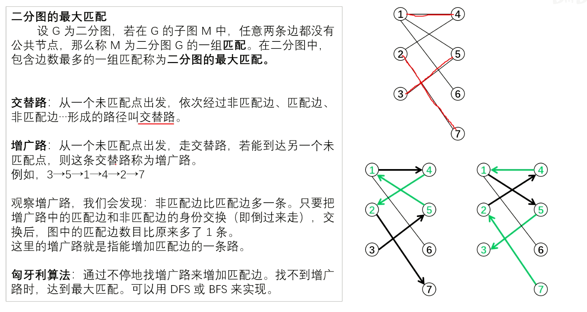

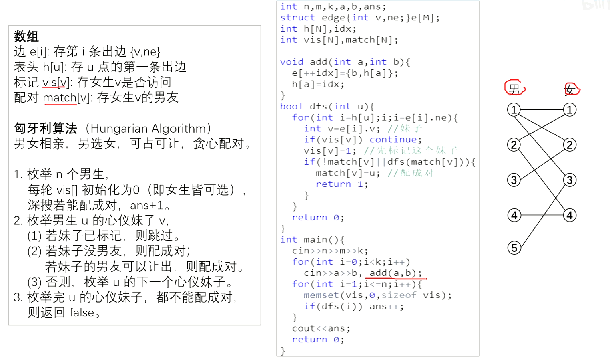

O($mn$) 真实时间复杂度远小于此

```c++
//判断当前二分图的最大匹配数
#include <cstring>
#include <iostream>
#include <algorithm>

using namespace std;

const int N = 510, M = 100010;
int n1, n2, m;
int h[N], e[M], ne[M], idx;
int match[N]; //B当前所匹配的在A中的对象 等于0则表示还未匹配对象
bool st[N]; 

void add(int a, int b)
{
    e[idx]=b, ne[idx] = h[a],  h[a] =idx++;
}

bool find(int x)
{
    for(int i=h[x]; i!=-1; i=ne[i])
    {
        int j=e[i];
        if(!st[j])
        {
            st[j] = true ;
            if(match[j] == 0 || find(match[j])) //若当前B集合内的该点没有配对过 或者 该点原先的配对对象可以换一个
            {
                match[j] = x;
                return true;
            }
        }
    }
    
    return false;
}

int main()
{
    ios::sync_with_stdio(false),cin.tie(0),cout.tie(0);
    
    cin >> n1 >> n2 >> m;
    
    memset(h, -1, sizeof h);
    
    while(m--)
    {
        int a, b;
        cin >> a >> b;
        add(a, b); //虽然是无向图，但是只存A集合或者B集合一边即可（只用判断一边是否匹配
    }
    
    int res = 0; //已匹配的对数
    for(int i=1; i<=n1; i++) //对集合A的每一个点进行配对
    {
        memset(st, false, sizeof st); //判断对于B集合中的每一个点是否尝试配对过
        if(find(i)) res++;
        
    }
    
    cout << res;
    
    return 0;
}
```


## 数论

由于我们交换任意位置的数字，的值恒为定值，只会改变的值，而我们知道%5E2%20-%20(a%20-%20b)%5E2&preview=true)，于是我们最大化的值即可最小化的值。

### 最大公约数

```c++
int gcd(int a,int b) {
    return b ? gcd(b,a%b):a;
}

//最小公倍数
int lcm(int a, int b){
    return a * b / gcd(a, b);
}

//分数用pair储存
pair<int,int>p;
int x,y;
int gd=gcd(x,y);
x/=gd,y/=gd;  //最简小数
p[i]={x,y}l
```

$\gcd{\{a,b\}}=\gcd{\{a,a-b\}}$，变化一下这个柿子，发现$\gcd{\{a,b,c\}}$就是$\gcd{\{\gcd{\{a,b\}},\gcd{\{b,c\}}\}}$，也就是$\gcd{\{a,b-a,c-a\}}$。规律：$\gcd{\{a_1,a_2,\dots,a_n\}}=\gcd{\{a_1,a_2-a_1,\dots,a_n-a_{n-1}\}}$
最后查询时要注意，代码中第$i$个数的$d$是指$a_i-a_{i-1}$，所以当我们查询$[l,r]$的区间最大公约数时，我们要用$[l+1,r]$的$\gcd$和$a_l$求最大公约数。

gcd(a,b)=gcd(a,−b) 在数值加减的过程中可能会产生负数，而约定gcd是没有负数的，所以在最后要加abs()

#### 代码

### 质数

#### 试除法判断质数

```c++
bool is_prime(int x)
{
    if(x<2) return false; //1和负数不是质数
    for(int i=2; i<=x/i; i++)
    {
        if(x%i==0) return false;
    }
    return true;
}
```

#### 分解质因数

```c++
void divide(int x)
{
    for(int i=2; i<=x/i; i++)
    {
        int res=0;
        if(x%i==0)
        {
            while(x%i==0) x/=i,res++; 
            cout << i << " " << res << endl;
        }
    }
    if(x>1) cout << x << " " << 1 << endl;
}
```

#### 筛质数

##### 埃氏筛法

枚举当前质数的倍数

```c++
int vis[N],p[N],cnt;

void get_prime(int n)
{
    for(LL i=2;i<=n;i++)  //这里i也要开LL，因为下面i*i可能会爆
    {
        if(!vis[i]) 
        {
            p[++cnt] = i;
            for(LL j=i*i;j<=n;j+=i) vis[j]=1; // 从i*i开始，前面的已经被更小的质数枚举
        }
    }
}
```

##### 线性筛法（欧拉筛法

O(n)

枚举已经记录的质数 保证合数只被最小质因子划掉

```c++
void get_prime(int n)
{
    for(LL i=2;i<=n;i++)
    {
        if(!vis[i]) p[++cnt] = i;
        for(int j=1;i*p[j]<=n;j++) //越界中断
        {
            vis[i*p[j]]=1;
            if(i%p[j]==0) break; //整除中断
        }
    }
}
```

### 快速幂

二进制拆分和倍增思想

```c++
int quickpow(int a,int n)
{
    int res=1;
    while(n)
    {
        if(n&1) res = res*a;
        a = a * a;
        n >> =1;
    }
    return res;
}
```

#### 取模运算

$3^{13}$%p=$3^8$%p * $3^4$%p * $3^2$%p * $3^1$%p

```c++
int quickpow(LL a,int n,int p)
{
    int res=1;
    while(n)
    {
        if(n&1) res = res*a%p;
        a = a * a % p;
        n >> =1;
    }
    return res;
}
```

#### 矩阵快速幂

```c++
typedef long long LL;
const int mod=1000000007;
struct matrix{
    LL c[101][101];
    matrix(){memset(c, 0, sizeof c);}
} A, res;
LL n, k;

matrix operator*(matrix &x, matrix &y){ //矩阵乘法
    matrix t; //临时矩阵
    for(int i=1; i<=n; i++)
      for(int j=1; j<=n; j++)
        for(int k=1; k<=n; k++)    
          t.c[i][j]=(t.c[i][j]+x.c[i][k]*y.c[k][j])%mod;
    return t;
}
void quickpow(LL k){ //快速幂
    for(int i=1; i<=n; i++) res.c[i][i]=1; //单位矩阵
    while(k){
        if(k & 1) res = res*A;
        A = A*A;
        k >>= 1;
    }  
}
```


### 欧拉函数

$\phi$ (n) = n * $ \prod_{i=1}^{s} {\frac{p_i-1}{p_i}} $

当p是素数时    φ(p)=p-1

​                          φ($p^k$)=(p-1)$p^k$-1

**积性函数** 两个互质的整数之积，n = $p_1$ × $p_2$，则φ(n) = φ($p_1$*$p_2$) = φ($p_1$)φ($p_2$)

#### 试除法

```c++
int phi(int x)
{
    int res = x;
    for(int i=2; i <= x/i; i++)
    {
        if(x%i==0)
        {
            res = res/i*(i-1); //先做除法再作乘法防止爆int
            while(x%i==0) x/=i;
        }
    }
    if(x>1) res = res/x*(x-1);
    return res;
}
```

#### 筛法

```c++
const int N = 1e6 + 10;    //若题目最后要求将所有数的欧拉函数相加，要开LL
int vis[N],p[N],phi[N],cnt;

void get_phi(int n)
{
    phi[1]=1;
    for(int i=2;i<=n;i++)
    {
        if(!vis[i])
        {
            p[++cnt] = i;
            phi[i] = i-1;
        }
        
        for(int j=1;p[j]<=n/i;j++) //将乘法转成除法
        {
            int m=i*p[j];
            vis[m]=1;
            if(i%p[j]==0)
            {
                phi[m] = p[j]*phi[i]; //i包含m所有的质因子  
                break;
            }
            else phi[m] = (p[j]-1)*phi[i]; //积性函数
        }
    }
}
```

#### 扩展欧拉函数


```c++
int depow(int phi)
{
    int b=0;
    for(int i=0;i<s.size();i++)
    {
        b = b*10+(s[i]-'0');
        if(b>=phi) flag=1,b%=phi;
    }
    if(flag) b+=phi;
    return b;
}
```

### 逆元

#### 逆元的概念：

- **如果 a \* x** ≡ **1 (mod p) 成立，那么 x 是 a 在 mod m 的条件下的逆元**
- **注意，a和x一定都和p互质，如果不互质，则逆元不存在**

#### 逆元的用处：

计算a / b(mod p ) 的值时，如果 b 是一个很大的数，那么会爆double的精度；假设除数 b 的逆元为 inv[b] ，那么可做如下转换

**a / b (mod p) ≡ a * inv[b] ( mod p )**

费马小定理只适用于模数是质数的情况。
由 a ^( m - 1 ) ≡ 1 ( m o d    m ) 推出 a * a ^( m - 2 ) ≡ 1 ( m o d    m )
则a ^( m - 2 )是a模m意义上的逆元。//这里一般用上快速幂

#### **gcd(a , p) = 1**

```c++
template <class T>
T ksm(T a,T b,T p)
{
    T res = 1;
    while(b)
    {
        if(b&1) res = 1ll*res*a%p;
        a = 1ll*a*a%p;
        b>>=1;
    }
    return res;
}


template <class T>
T get_inv(T a,T p) 
{
    return ksm(a,p-2,p);
}
```

#### **gcd(a , p) = c (c>1)**

```c++
template <class T>
T exgcd(T a, T b, T& x, T& y)
{
    if (!b)
    {
        x = 1, y = 0;
        return a;
    }
    T d = exgcd(b, a % b, y, x);
    y -= a / b * x;
    return d;
}

template <class T>
T get_inv(T a,T p)
{
    T x,y;
    T d = exgcd(a,p,x,y);
    return (x%p+p)%p;
}
```

#### 求1~n的逆元

时间复杂度：$O(n)$

原理：$inv[i]=(p-p/i)*inv[p\%i]\%p$

其中$n \leq p-1$且`p为任意数`

```cpp
ll inv[N];
int n,p;

cin>>p>>n;
inv[1] =1;
for(int i=2;i<=n;i++) inv[i] = (p-p/i)*inv[p%i]%p;
```


#### 求$a_1,a_2,...,a_n$的逆元

时间复杂度：$O(n)$

```cpp
ll s[N],t[N],inv[N],a[N];
ll p,n;

s[0] = 1;
for(int i=1;i<=n;i++) 
{
    s[i] = s[i-1];
    if(!a[i]) continue;
    s[i] = s[i]*a[i]%p;
}
t[n] = get_inv(s[n],p);
for(int i=n-1;i;i--) t[i] = t[i+1]*a[i+1]%p;
for(int i=1;i<=n;i++) inv[i] = s[i-1]*t[i]%p;
```

### 组合数

#### 递推法 杨辉三角

O($n^2$)

```c++
void getC() //C初始化为0
{
    for(int i=0;i<N;i++)
    	for(int j=0;j<=i;j++)
            if(j==0) C[i][j] = 1;
    		else C[i][j] = (C[i-1][j]+C[i-1][j-1])%mod;
}
```

#### 快速幂

O($n*logP$) 利用乘法逆元

```c++
LL qpow(LL a,LL b)
{
    LL res = 1;
    while(b)
    {
        if(b&1) res=res*a%P;
        a = a*a%P;
        b >>= 1;
    }
    return res;
}
void init()
{ 
    f[0] = g[0] =1;  //f是分子 g是分母
    for(int i=1;i<N;i++)
    {
        f[i] = f[i-1] * i % P;
        g[i] = g[i-1] * qpow(i,P-2) % P;
    }
}
LL getC(LL n,LL m)
{
    return f[n]*g[m]%P*g[n-m]%P;
}

//大组合数 模比数小
int lucas(LL n, LL m, int P)
{
    if(m==0) return 1;
    return lucas(n/p,m/p,p)*getC(n%p,m%p,p)%p;
}
```

### 第一类第二类 斯特林数


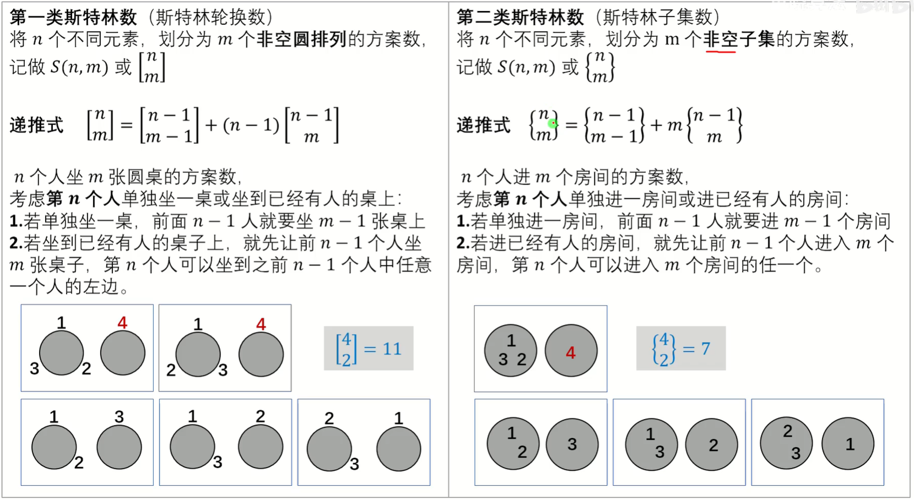

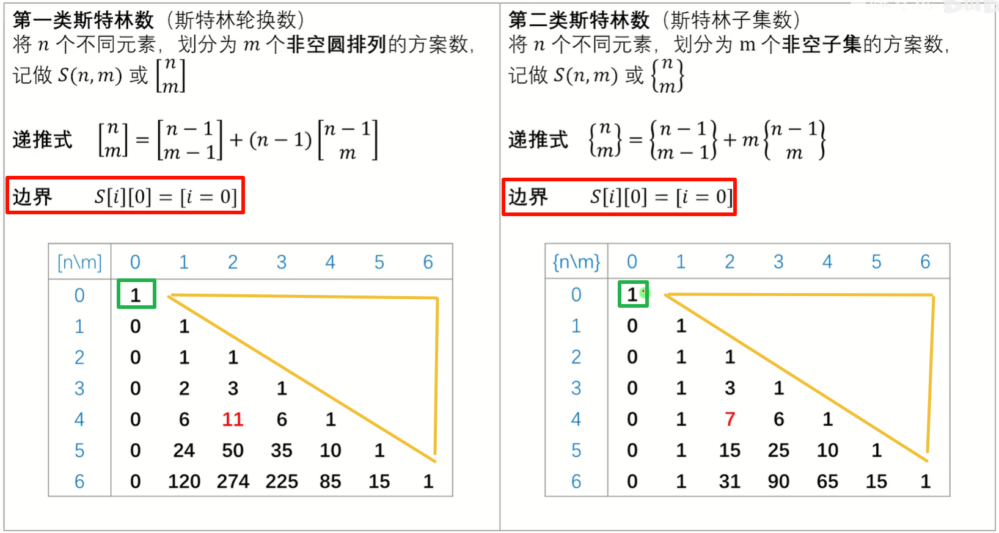

**递归注意边界条件**


递归

O($nm$)

```c++
//第一类
const int N = 1000,M = 100;
const int MOD = 1e9+7;
int s[N][M];
int get()
{
    s[0][0]=1; //初始化，其余值初始为0，全局变量默认
    for(int i=1;i<=N;i++)
        for(int j=1;j<=M;j++)
            s[i][j] = (s[i-1][j-1]+(i-1)*s[i-1][j])%MOD;
}

//第二类
int get()
{
    s[0][0]=1; //初始化，其余值初始为0，全局变量默认
    for(int i=1;i<=N;i++)
        for(int j=1;j<=M;j++)
            s[i][j] = (s[i-1][j-1]+j*s[i-1][j])%MOD;
}
```

*注意斯特林数递增速度比组合数还快，因此要用高精度存数，如果不取模*

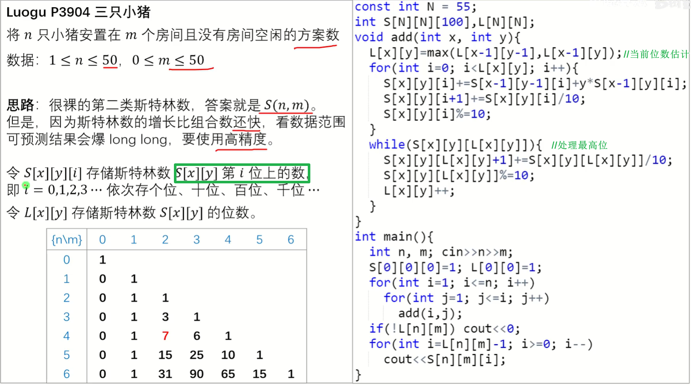

### 博弈论

* 找必败状态，如果某人初始处于必败状态，则必输，若不是，则可使另一人一直处于必败状态

## DP

* 求最小值的时候一定要注意边界是否处理，赋值为INF

### 背包

**求方案数初始化总结**

（使体积达到某种条件的方案数）`f[j]+=f[j-v[i]]`

（使体积达到某种条件且价值满足方案数） 见背包最后

二维情况
1、体积至多`j`，`f[0][i] = 1`, `0 <= i <= m`，其余是`0` (全都不选也是一种方案)
2、体积恰好`j`，`f[0][0] = 1`, 其余是`0`
3、体积至少`j`，`f[0][0] = 1`，其余是`0`

一维情况（压维）
1、体积至多`j`，`f[i] = 1`, `0 <= i <= m`，
2、体积恰好`j`，`f[0] = 1`, 其余是`0`
3、体积至少`j`，`f[0] = 1`，其余是`0`

**求最大值最小值初始化总结**
二维情况
1、体积至多`j`，`f[i,k] = 0`，`0 <= i <= n`, `0 <= k <= m`（只会求价值的最大值）
2、体积恰好`j`，
$\quad$$\quad$当求价值的最小值：`f[0][0] = 0`, 其余是`INF`
$\quad$$\quad$当求价值的最大值：`f[0][0] = 0`, 其余是`-INF`
3、体积至少`j`，`f[0][0] = 0`，其余是`INF`（只会求价值的最小值）

一维情况（压维）
1、体积至多`j`，`f[i] = 0`, `0 <= i <= m`（只会求价值的最大值）
2、体积恰好`j`，
$\quad$$\quad$当求价值的最小值：`f[0] = 0`, 其余是`INF`
$\quad$$\quad$当求价值的最大值：`f[0] = 0`, 其余是`-INF`
3、体积至少`j`，`f[0] = 0`，其余是`INF`（只会求价值的最小值）

**注意：在求解体积至少是j的时候，对体积的遍历应该从0到m，而不是v[i]到m。**

**因为当j<v[i]时，代表加上第i个物品后，体积大于j，符合题目至少是j的要求，因此处理时应该是`f[j]=max(f[j],f[max(0,i-v[i])])`**

#### 01背包

只许选择一次 

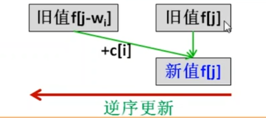

状态`f[i][j]`定义：**前 i 个物品，在背包容量 为j 下的最优解（最大价值）**：

```c++ 
//二维
for(int i = 1; i <= n; i++) 
        for(int j = 1; j <= m; j++)
        {
            //  当前背包容量装不进第i个物品，则价值等于前i-1个物品
            if(j < v[i]) 
                f[i][j] = f[i - 1][j];
            // 能装，需进行决策是否选择第i个物品
            else    
                f[i][j] = max(f[i - 1][j], f[i - 1][j - v[i]] + w[i]);
        }   
//一维
for(int i = 1; i <= n; i++)
{
    for(int j = m; j >= v[i]; j--)  // 要用旧值更新，所以逆序，使后面的新值先更新完再变
        f[j] = max(f[j], f[j - v[i]] + w[i]); 
}
```

#### 完全背包

物品数量选择无限制

1.当前背包容量j<$w[i]$，不能放入，则 $f[i][j]=f[i-1][j]$
2.当前背包容量j>=$w[i]$，能放入，但要比较代价
(1) 若第i件物品不放入背包，则 ，则 $f[i][j]=f[i-1][j]$
(2) 若第i件物品放入背包，则$f[i][j]=f[i][j-w[i]]+c[i]$
**对于前i件物品，背包容量为$j-w[i]$订时可能已经放入了第i件物品，容量为j时还可以再放入第i件物品，所以用$f[i][j-w[i]]$更新$f[i][j]$**

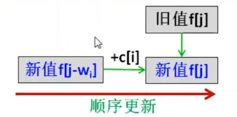

```cpp
//二维
for(int i=1;i<=N;i++)
{
    for(int j=0;j<=V;j++)
    {
        f[i][j]=f[i-1][j];
        if(j>=v[i]) f[i][j] = max(f[i-1][j],f[i][j-v[i]]+w[i]);
    }
}
//一维
for(int i=1;i<=N;i++)
{
    for(int j=v[i];j<=V;j++)
    {
        f[j] = max(f[j],f[j-v[i]]+w[i]); //用新值更新，所以正序，先更新完才能更新后面的值 
    }
}
```

#### 多重背包

物品数量有上限 

##### 二进制优化

 $$\sum_{i=0}^{n}mlogs_i$$   n个数，m最终体积，s每个物品的上线

```c++
int vv[N*10],ww[N*10],v,w,s,f[N]; //*10不固定，乘的是logS
int main()
{
    int n,V;cin >> n >> V;
    int num=0; //计数
    for(int i=0;i<n;i++)
    {
        cin >> v >> w >> s;
        for(int j=1;j<=s;j<<=1)
        {
            vv[num]=v*j;
            ww[num++]=w*j;
            s-=j;
        }
        if(s) //最后剩下的
        {
            vv[num]=v*s;
            ww[num++]=w*s;
        }
    }
    for(int i=0;i<num;i++)
        for(int j=V;j>=vv[i];j--)
            f[j] = max(f[j],f[j-vv[i]]+ww[i]);
    cout << f[V];
    return 0;
}
```

##### 单调队列优化

$O(nm)$

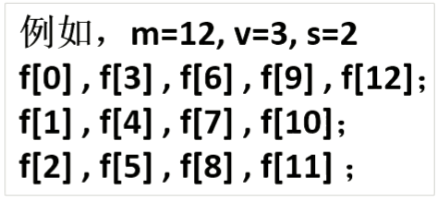

每次肯定多v个体积，因为一个一个放

$f[j]$是由前面**不超过数量s**的同类值递推得到的。这就相当于从前面宽度为s的窗口挑选最大值来更新当前值。所以，我们用单调队列来维护窗口最大值，从而把更新们的次数缩减为1次。这就需要顺序更新f值，怎么办呢？只需要增加一个备份数组g即可。

```c++
int v,w,s;
int g[20010],f[20010],q[20010];
int main()
{
    int n,m;cin >> n >> m;
    for(int i=0;i<n;i++)
    {
        //f备份到g，压维，g相当于只前i-1个物品时的状态，因此后面更新f用g
        memcpy(g,f,sizeof f); 
        cin >> v >> w >> s;//体积 价值 数量
        for(int j=0;j<v;j++)//拆分成v个类
        {
            int h=0,t=-1;
            for(int k=j;k<=m;k+=v)//对每个类进行单调队列,k代表当前枚举体积
            {
                //q[h]不在窗口[k-s*v,k-v]内，队头出列
                if(h<=t&&q[h]<k-s*v) h++;
                //使用队头更行最大值
                if(h<=t) f[k]=max(g[k],g[q[h]]+(k-q[h])/v*w);
                //当前值比队尾更有价值，队尾出队
                //注意滑动窗口在前i-1个物品，即g,根据g的滑动窗口更新f
                while(h<=t&&g[k]>=g[q[t]]+(k-q[t])/v*w) t--;
                q[++t]=k;//下标入队
            }
        }
    }
    cout << f[m];
    return 0;
}
```

#### 混合背包

```c++
//二进制枚举
const int N=1010,M=10000;
int a[M],b[M],c[M];
int f[N];

int main(){
  int n, m, v, w, s;   
  cin>>n>>m;
  
  int num=1;
  for(int i=1; i<=n; i++){
    scanf("%d%d%d",&v,&w,&s);
    if(s==0){     //完全背包
      a[num]=v;
      b[num]=w;
      c[num++]=0; //背包类型 
    }
    else{         //多重背包二进制拆分 先把多重背包转换为01背包
      if(s==-1)s=1; 
      int k=1;
      while(s>=k){
        a[num]=k*v;   
        b[num]=k*w;
        c[num++]=1;
        s-=k; k<<=1;
      }
      if(s){
        a[num]=s*v;
        b[num]=s*w;
        c[num++]=1; 
      }
    }
  }

  for (int i=1; i<num; i++){
    if(c[i]==1) //01背包
      for(int j=m; j>=a[i]; j--)
        f[j]=max(f[j],f[j-a[i]]+b[i]);
    else        //完全背包
      for(int j=a[i]; j<=m; j++)
        f[j]=max(f[j],f[j-a[i]]+b[i]);
  }
  cout<<f[m];
}
```

```c++
// 单调队列优化
int n, m;
int f[1010],g[1010];
int q[1010];

void ZeroOnePack(int v,int w){ //01背包
  for(int j=m; j>=v; j--)
    f[j]=max(f[j],f[j-v]+w);
} 
void CompletePack(int v,int w){//完全背包
  for(int j=v; j<=m; j++)
    f[j]=max(f[j],f[j-v]+w);
}
void MultiplePack(int v,int w,int s){//多重背包
  memcpy(g,f,sizeof(f));      
  for(int j=0;j<v;j++){
    int h=0,t=-1;
    for(int k=j;k<=m;k+=v){
      if(h<=t && q[h]<k-s*v) h++;
      if(h<=t) f[k]=max(g[k],g[q[h]]+(k-q[h])/v*w);
      while(h<=t&& g[k]>=g[q[t]]+(k-q[t])/v*w) t--;
      q[++t]=k;
    }
  }
}
int main(){
  int v, w, s;   
  cin >> n >> m;
  for(int i=1; i<=n; i++){
    scanf("%d %d %d",&v,&w,&s);
    if(s==-1)
        ZeroOnePack(v,w);     //01背包 
    else if(s==0)
        CompletePack(v,w);    //完全背包 
    else
        MultiplePack(v,w,s);  //多重背包 
  }
  cout<<f[m];
}
```

#### 分组背包

N组物品，每一组至多选择一个物品(**也可以不选**),每个物品都有自己的体积和价值，用容量M的背包装物品，使得物品价值总和最大.

**注意遍历每组的时候从0开始，相当于第一个是判断i组和i-1组`f[i][j]=max(f[i][j],f[i-1][j])`，后面是组内的相互判断**

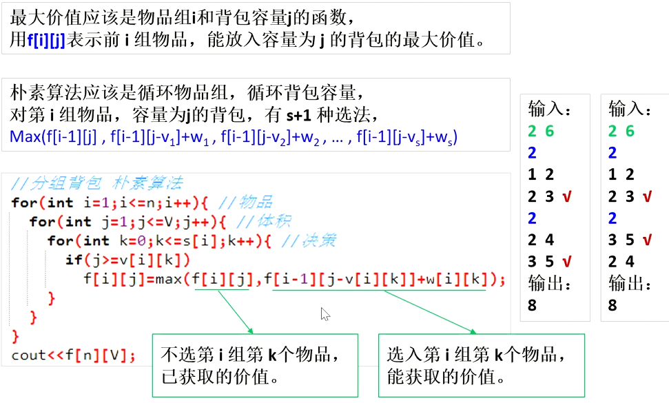

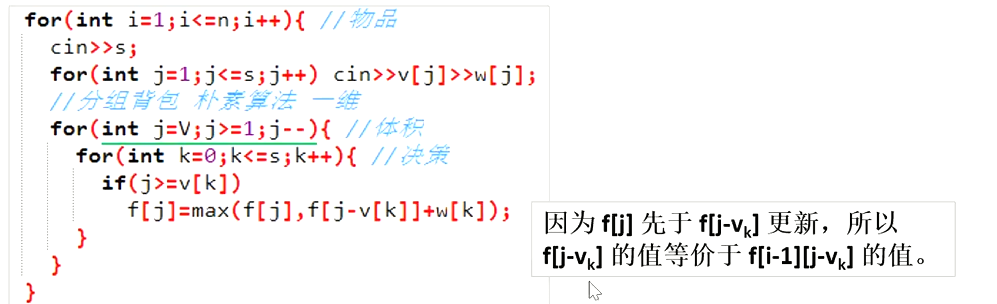

```cpp
int n, m;
int a[20][20],f[20][20],x[20];
void dfs(int i,int j) //找每组选了哪个
{
    if(i<=0) return;
    for(int k=0;k<=j;k++)
    {
        if(f[i-1][j-k]+a[i][k]==f[i][j]) //找到是从谁转换过来的
        {
            x[i]=k;
            dfs(i-1,j-k);
        }
    }
}
int main()
{
    cin >> n >> m;
    for(int i = 1;i <=n;i ++)
    {
        for(int j=1;j<=m;j++) cin >> a[i][j];
    }
     for(int i = 1;i <=n;i ++)
         for(int j=1;j<=m;j++)
             for(int k=0;k<=j;k++)
                 f[i][j]=max(f[i][j],f[i-1][j-k]+a[i][k]);
    dfs(n,m);
    cout << f[n][m] << endl;
   for(int i=1;i<=n;i++) cout<< i << " " << x[i]  << endl;
    return 0;
}
```

#### 树形dp背包

物品之间具有依赖关系，且依赖关系组成一棵树的形状。如果选择一个物品，则必须选择它的父节点。

```cpp
const int N = 110;
int v[N],w[N],a[N][N],b[N],f[N][N];
//a[u][i]结点u的第i个子节点 b[p]结点p的子节点个数
int n,m;
void dfs(int u)
{
    for(int i=v[u];i<=m;i++) f[u][i]=w[u]; //对每个结点初始化，当体积大于v[u]时，至少时w[u]
    for(int i=0;i<b[u];i++) //遍历u的所有子节点
    {
        int c = a[u][i];
        dfs(c);
        //对子节点进行分组背包，子节点的每种体积都时一个类型，全部遍历一遍
        for(int j=m;j>=v[u];j--)
        {
            for(int k=0;k<=j-v[u];k++)//k最大也要留个头节点的位置v[u]
            {
                f[u][j]=max(f[u][j],f[u][j-k]+f[c][k]);
            }
        }
    }    
}
int main()
{
    cin>>n >> m;
    int root;
    for(int i=1;i<=n;i++)
    {
        int p;cin >> v[i] >> w[i] >> p;
        if(p==-1) root=i;
        else  a[p][b[p]++]=i;
    }
    dfs(root);
    cout << f[root][m];
    return 0;
}
```

#### 背包问题求方案数

以下是01背包，其他背包同理

以下是 总体积不超过背包容量，且总价值最大的**最优选法的方案数**。

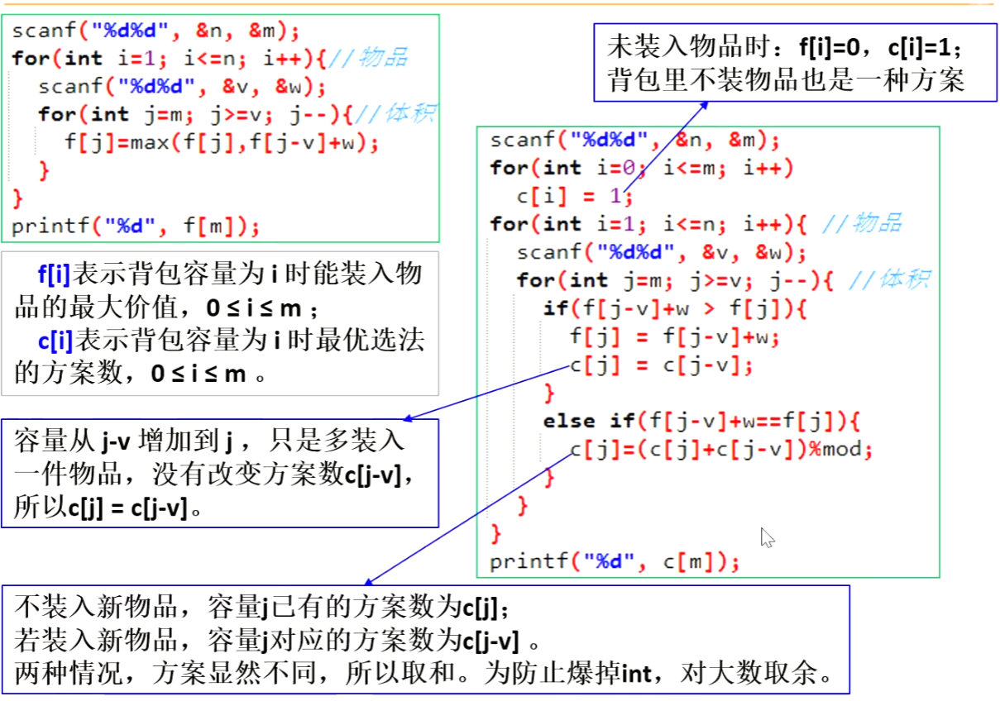

若  总体积恰好是背包容量，且总价值最大的**最优选法的方案数**。则f[i]=-0x3f3f3f3f，f[0]=0，保证所有方案都从0开始加

#### 背包求具体方案

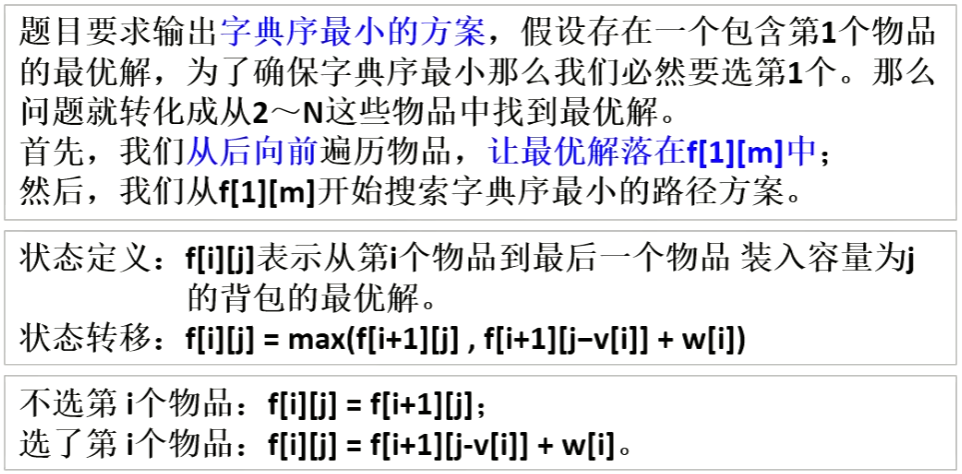


```c++
int main()
{
    int n,m;
    cin >> n >> m;
    for(int i=1;i<=n;i++) cin >> v[i] >> w[i];
    for(int i=n;i>=1;i--)
    {
        for(int j=0;j<=m;j++)
        {
            f[i][j]=f[i+1][j];
            if(j>=v[i]) f[i][j]=max(f[i+1][j],f[i+1][j-v[i]]+w[i]);
            //完全背包 if(j>=v[i]) f[i][j]=max(f[i+1][j],f[i][j-v[i]]+w[i]);
        }
    }
    int j=m;
    for(int i=1;i<=n;i++)
    {
        //完全背包 if(j>=v[i]&&f[i][j]==f[i][j-v[i]]+w[i])
        if(j>=v[i]&&f[i][j]==f[i+1][j-v[i]]+w[i])
        {
            cout << i << " ";
            j-=v[i];
        }
    }
    return 0;
}
```


### 线性DP

#### 编辑距离

注意初始化

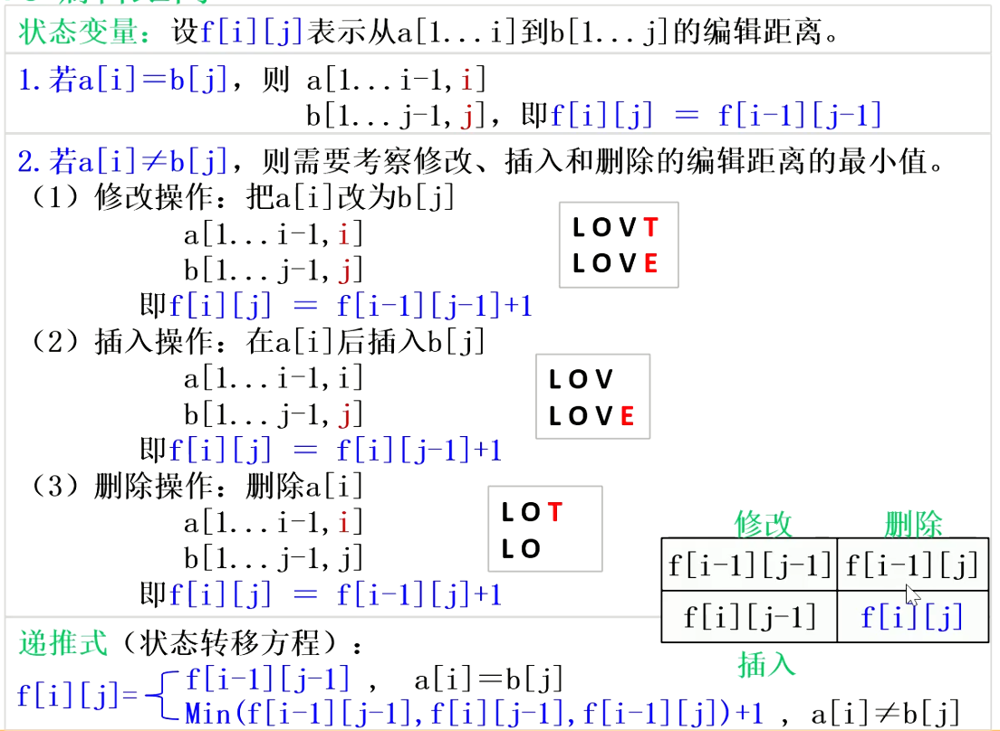

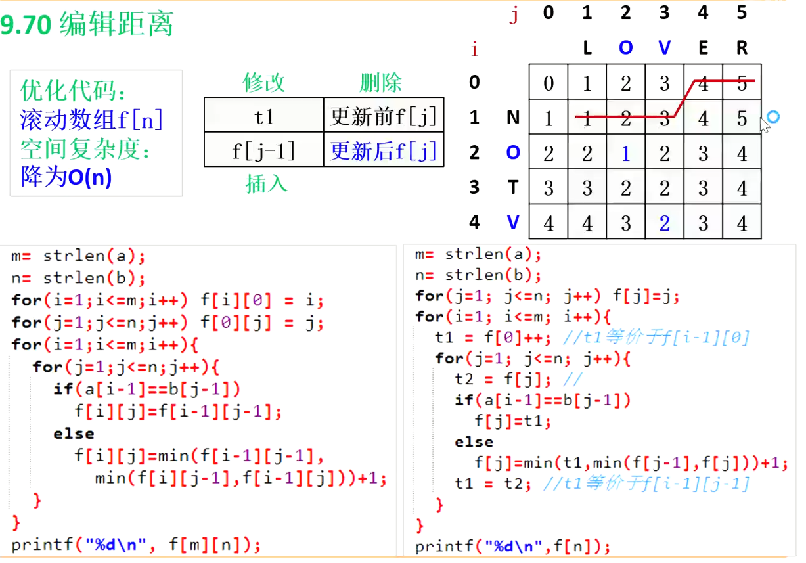

#### 最长上升子序列

**状态变量：**f[i]记录以a[i]为结尾的最长上升子序列长度

**初始条件：**f[i]=1

**递推式:**（状态转移方程）如果(a[i]>a[j]，则f[i]=max(f[i],f[j]+1)，1<=j<i

$O(n^2)$

```cpp
for(int i=0;i<len;i++) f[i]=1;
for(int i=0;i<len;i++)
{
    for(int j=0;j<i;j++)
    {
        if(a[j]<a[i]) f[i]=max(f[i],f[j]+1);
    }
    ans = max(f[i],ans);
}
```

$O(nlogn)$

* 若符合顺序则直接加入b数组中
* 若不符合则替换b数组中的数，使数组后面可以接的数越来越多

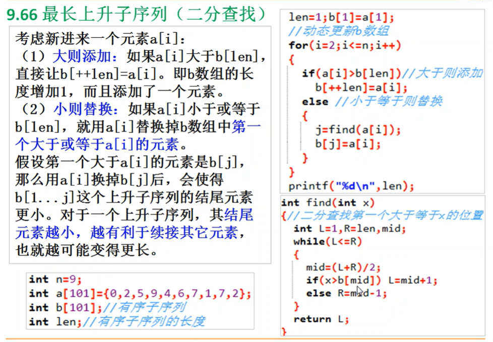

#### 最长公共子序列

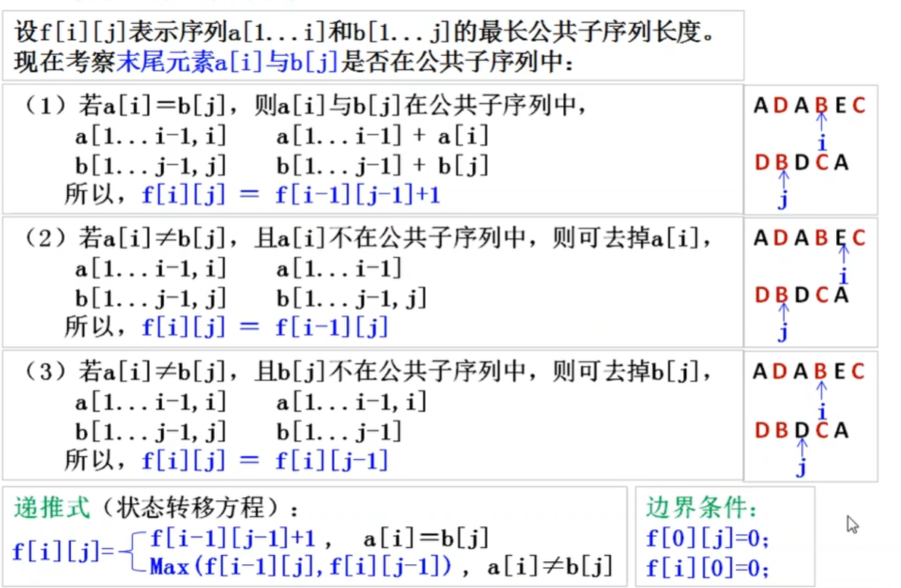

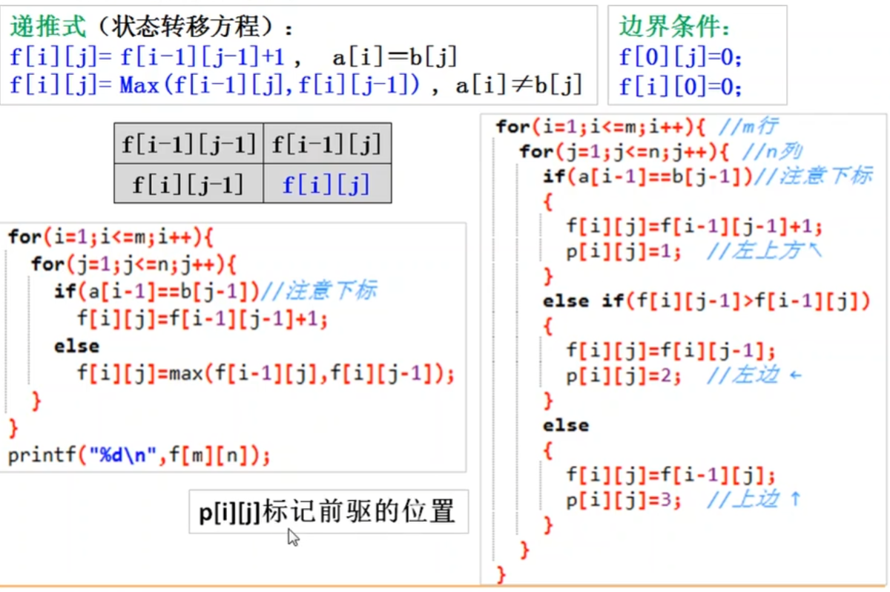

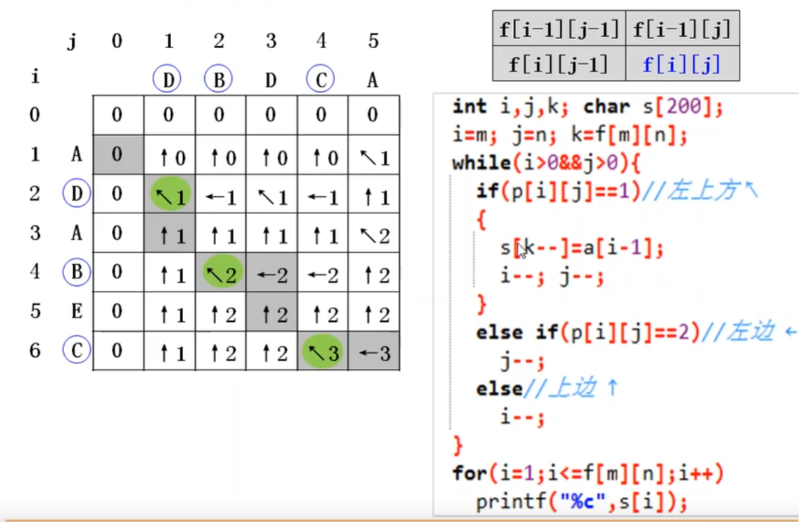

EAFBGCHD

AEBFCGDH

### 状态机

### 状态压缩

直接的时间复杂度会很大，但是不合法状态会很多

1.用二进制表示状态，用十进制数存储状态：
2.用位运算筛选出合法状态；
3.用位运算判断状态转移的条件；
4.计算时每个类累加上一行的兼容类


* 一排不能存在相邻  i&(i>>1) ==  0  或者  !(i&(i>>1))  （i是这一行状态）
* 两排不能斜对角挨着，或直接挨着  !(a&b) && !(a&(b<<1)) && !(a&(b>>1))

### 区间DP

合并：即将两个或多个部分进行整合。
特征：能将问题分解成为两两合并的形式。
求解：对整个问题设最优值，枚举合并点，将问题分解成为左右两个部分，最后将左右两个部分的最优值进行合并得到原问题的最优值。

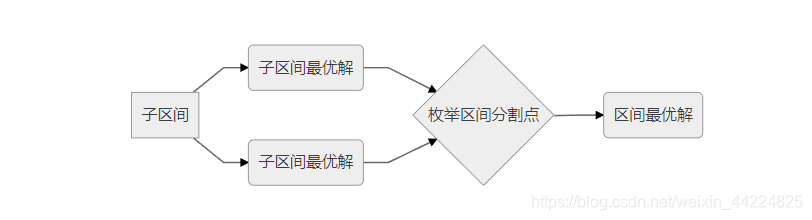
DP（n^3） DP+四边形不等式优化（n^2）
一般数据500还能跑跑，如果1e3基本凉了，要优化到O（n^2),要用到四边形不等式优化。暂时不会，再等等吧

```c++
for (int len = 1; len <= n; len++) {         // 区间长度
    for (int i = 1; i + len - 1 <= n; i++) { // 枚举起点
        int j = i + len - 1;                 // 区间终点
        if (len == 1) {
            dp[i][j] = 初始值
            continue;
        }

        for (int k = i; k < j; k++) {        // 枚举分割点，构造状态转移方程
            dp[i][j] = min(dp[i][j], dp[i][k] + dp[k + 1][j] + w[i][j]);
        }
    }
}

也可以记忆化搜索，相当于深搜，每次
dfs(int l,int r)
{
	for(int i=l;i<=r;i++) f[l][r] = min(f[l][r],f[l][i]+a,f[i][r]+a);
}
```

### 树形DP

注意题目大多数时候给的是结点的个数，遍历边的时候是n-1

#### 树的重心

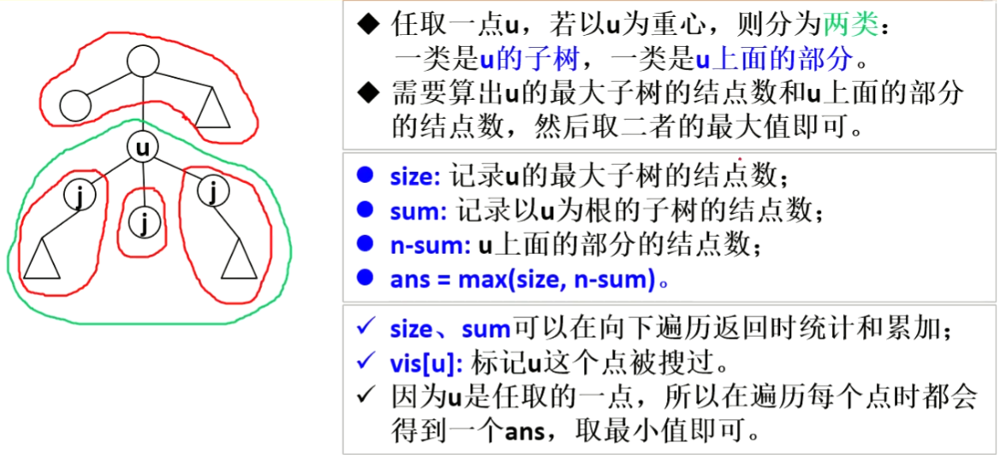

**一、树重心的定义**
对于树上的每一个点，以此节点为根时计算其所有子树中最大的子树节点数，这个值最小的点就是这棵树的重心。说通俗点就是，删除此结点后，剩余连通块的结点数的最大值得到最小。

**二、性质**
以树的重心为根时，所有子树的大小都不超过整棵树大小的一半。（充分必要）
树中所有点到某个点的距离和中，到重心的距离和是最小的；如果有两个重心，那么到它们的距离和一样。
把两棵树通过一条边相连得到一棵新的树，那么新的树的重心在连接原来两棵树的重心的路径上。
当有两个重心时，树的结点数为偶数，并且这两个重心通过一条边直接相连。删除两个重心连的边时，所得到的两个连通块大小相等。
在一棵树上添加或删除一个叶子，那么它的重心最多只移动一条边的距离

~~~C++
const int N = 110;
int h[N], ne[2*N], e[2*N], idx;
int vis[N],n;
int ans = 1e9;

void add(int a, int b) { e[idx] = b, ne[idx] = h[a], h[a] = idx++; }

int dfs(int u) 
{
  vis[u] = 1; // 标记u这个点被搜过
  int sz = 0; // 记录u的最大子树的结点数
  int sum = 1; // 记录以u为根的子树的结点数
  for(int i=h[u];~i;i=ne[i]) // i是边的编号
  {
    int j = e[i]; //j是u的邻接点
    if(vis[j]) continue; // 避免向上查找
    int s = dfs(j); // s是以j为根的子树的结点数
    sz = max(s,sz); // 记录u的最大子树的结点数
    sum+=s; // 累加u的各个子树的结点数
  }
  ans = min(ans, max(sz,n-sum)); // 更新答案
  return sum; //返回以u为根的子树的结点数
}

void solve()
{
  memset(h, -1, sizeof h);
  cin >> n;
  for (int i = 1; i < n; i++)
  {
    int a, b;
    cin >> a >> b;
    add(a, b), add(b, a); // 无向 
  } 
  dfs(1);
  cout << ans;
}
~~~

#### 树的直径

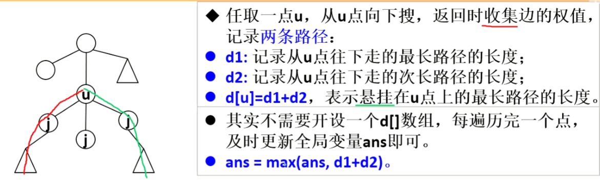

~~~c++
int h[N], ne[N],w[N], e[N], idx;
int vis[N],n;
int ans ;

void add(int a, int b,int c) { e[idx] = b, w[idx] = c, ne[idx] = h[a], h[a] = idx++; }

int dfs(int u) 
{
  vis[u] = 1;// 标记u这个点被搜过
  int d1 = 0; // 记录从u点往下走的最大长度
  int d2 = 0; // d2记录从u点往下走的次大长度
  for(int i=h[u];~i;i=ne[i]) // i是边的编号
  {
    int j = e[i]; // j是u的邻接点
    if(vis[j]) continue; // 避免向上查找
    int d = dfs(j) + w[i]; // u经j点往下走的最大长度
    if(d > d1) d2 = d1,d1=d; // 更新d2和d1
    else if(d>d2) d2=d;  // 更新d2
  }
  ans = max(ans,d1+d2); // 更新答案
  return d1; // 返回从u点往下走的最大长度
}

void solve()
{
  memset(h, -1, sizeof h);
  cin >> n;
  for (int i = 1; i < n; i++)
  {
    int a, b,c;
    cin >> a >> b >> c;
    add(a, b,c), add(b, a,c);
  }
  dfs(1);
  cout << ans;
}
~~~

#### 换根DP

**换根DP** 一般分为三个步骤：

1. 指定任意一个根节点
2. 一次dfs遍历，统计出当前子树内的节点对当前节点的贡献
3. 一次dfs遍历，统计出当前节点的父节点对当前节点的贡献，然后合并统计答案

那么我们就要先 **dfs** 一遍，预处理出当前子树对于根的**最大贡献（距离）**和 **次大贡献（距离）**

处理 **次大贡献（距离）** 的原因是：

如果 **当前节点** 是其 **父节点子树** 的 **最大路径** 上的点，则 **父节点子树** 的 **最大贡献** 不能算作对该节点的贡献

因为我们的路径是 **简单路径**，不能 **走回头路**

然后我们再 **dfs** 一遍，求解出每个节点的父节点对他的贡献（即每个节点往上能到的最远路径

两者比较，取一个 **max** 即可

**时间复杂度** 为 $T(2n) = O(n)$

##### 树的中心

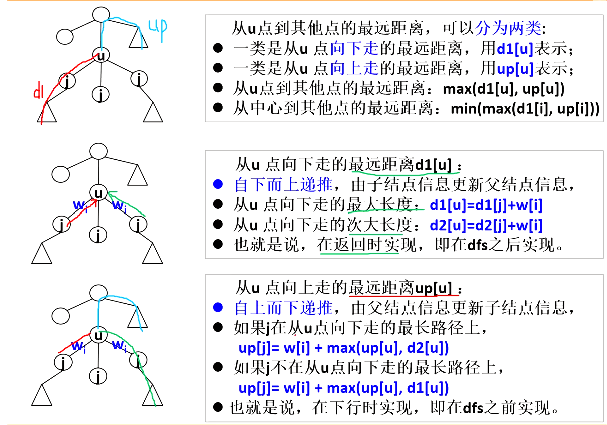

```c++
int h[N],e[2*N],ne[2*N],w[2*N],idx;
int res=1e18;
int d1[N];//d1[u]记录从u点向下走的最大长度
int d2[N];//d2[u]记录从u点向下走的次大长度
int up[N];//up[j]记录从点向上走的最大长度
int p[N];//p[u]记录从u点向下走的最长路径是从哪个点下去的，来判断当前点是否在最长路径上，如果在就用次长路更新up[i]
void add(int a,int b,int c){e[idx]=b,ne[idx]=h[a],w[idx]=c,h[a]=idx++;}

int dfs_d(int u,int fa)
{
    for(int i=h[u];i!=-1;i=ne[i])
    {
        int j = e[i];
        if(j==fa) continue;
        int x = dfs_d(j,u);
        if(x+w[i]>d1[u]) d2[u]=d1[u],d1[u]=x+w[i],p[u]=j; //更新最长和次长
        else if(x+w[i]>d2[u]) d2[u] = x+w[i];
    }
    return d1[u];
}
void dfs_u(int u,int fa)
{
    for(int i=h[u];i!=-1;i=ne[i])
    {
        int j = e[i];
        if(j==fa) continue;
        if(p[u]==j) up[j]=max(d2[u],up[u])+w[i]; //来判断当前点是否在最长路径上，如果在就用次长路更新up[i]
        else up[j]=max(d1[u],up[u])+w[i];
        dfs_u(j,u);
    }
}
signed main()
{  
    memset(h,-1,sizeof(h));
    int n;cin >> n;
    for(int i=0;i<n-1;i++)
    {
        int a,b,c;cin >> a >> b >> c;
        add(a,b,c);add(b,a,c);
    }
    dfs_d(1,0);dfs_u(1,0);
    for(int i=1;i<=n;i++)res=min(res,max(up[i],d1[i]));
    cout << res;
    return 0;
}
```


## DP

### 最长上升子序列（LIS）——O（nlogn）

定义
最长上升子序列是：
1：只包含ai的子序列
2：满足j<i并且aj<ai
3：子序列长度最长
朴素算法O（n^2） dp+二分（nlogn）

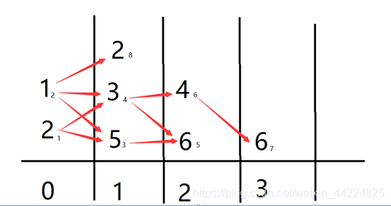

dp数组维护的是以pos位置结尾最小可能的值，如果要打印最长上升子序列路径，开辟新数组path,倒着找合法序列，正序寻找就会出现
1 2 4 6（2 8 6 7）这种不合法序列。虽然满足所有ai <aj 但是存在i>j


**注意：严格lis：lower_bound，非严格lis:upper_bound**

```cpp
        vector<int>lis;
        for(int j=i;j<n+i;j++)
        {
            auto it=upper_bound(all(lis),a[j]);
            if(it==lis.end())
                lis.pb(a[j]);
            else
                lis[it-lis.begin()]=a[j];
        }
```

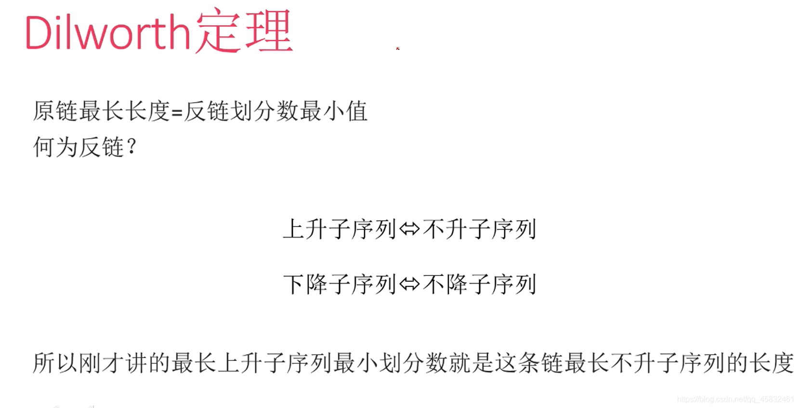

### LCS（最长公共序列）——O（n^2）

枚举一下就穿上裤子就走人
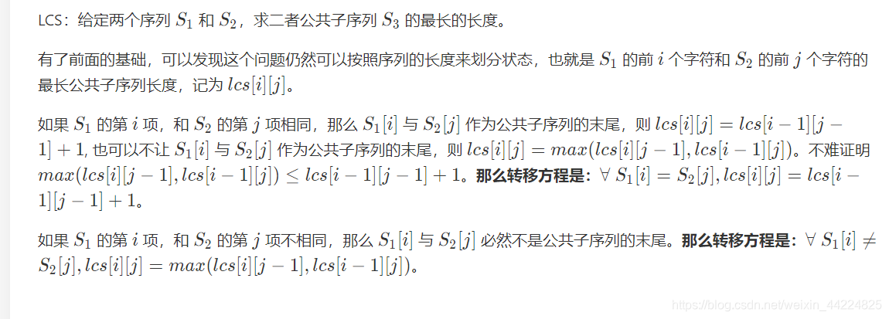
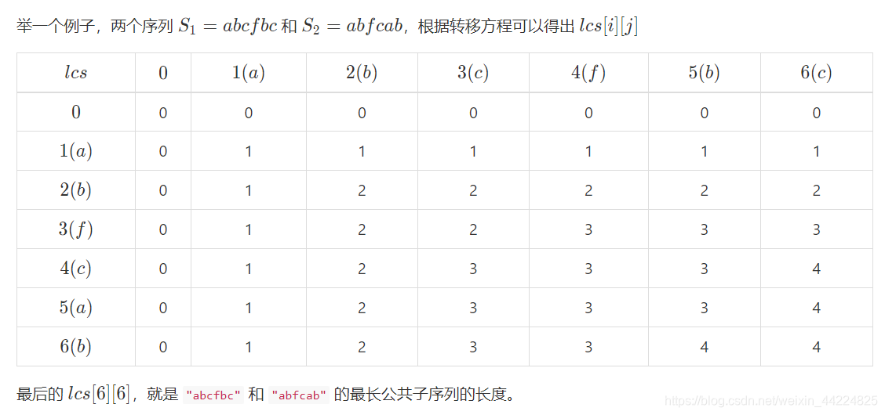

```c
for(int i=1; i<=len1; ++i)
{
    for(int j=1; j<=len2; ++j)
    {
        if(s[i-1]==t[j-1])
            dp[i][j]=dp[i-1][j-1]+1;
        else
            dp[i][j]=max(dp[i][j-1],dp[i-1][j]);
    }
}
cout<<dp[len1][len2]<<endl;
```

### 区间DP——O（n3）

一般问题
把相邻符合条件的合并，来获得最优解

概念

区间类型动态规划是线性动态规划的拓展，它在分阶段划分问题时，与阶段中元素出现的顺序和由前一阶段的哪些元素合并而来有很大的关系。（例：f[i][j]=f[i][k]+f[k+1][j]）

区间类动态规划的特点：

合并：即将两个或多个部分进行整合。
特征：能将问题分解成为两两合并的形式。
求解：对整个问题设最优值，枚举合并点，将问题分解成为左右两个部分，最后将左右两个部分的最优值进行合并得到原问题的最优值。


DP（n^3） DP+四边形不等式优化（n^2）
一般数据500还能跑跑，如果1e3基本凉了，要优化到O（n^2),要用到四边形不等式优化。暂时不会，再等等吧

```c
cin>>n;
memset(dp,inf);///初始化dp数组
for(int i=1; i<=n; ++i)
    cin>>a[i],pre[i]=pre[i-1]+a[i],dp[i][i]=0;
for(int len=1; len<n; ++len) ///枚举区间长度
{
    for(int i=1; i+len<=n; ++i) ///枚举区间起点
    {
        int j=i+len;///根据起点得到合法终点
        for(int k=i; k<j; ++k) ///枚举最优分割点
            dp[i][j]=min(dp[i][j],dp[i][k]+dp[k+1][j]);
        dp[i][j]+=pre[j]-pre[i-1];
    }
}
cout<<dp[1][n]<<endl;
```


### 树形DP——O（m）

**算法核心
出发点：点对至少需要两个点。
枚举每条边的u和v，u是v父节点，v向下的最大直径+cost+u向上的最大直径
向下的最大直径，就是看最大跟次大，但是每次先加入当前点值，保证每次直径存在尾点权
向上的最大直径，u结点先更新点权跟向上最大简单路径，再更新v的最大直径点权和
子树计数**

问题：
换根理解
u到v之前，把v向上的最长路径更新一下。
取决于u向下的第一长路径是否是v

- 如果是，dp[v][0]=max(dp[u][0],dp[u][2])+1;
- 如果不是，dp[v][0]=max(dp[u][0],dp[u][1])+1;

每个结点换根，只需要考虑dp[v][0]是否更新，换根并不是字面意思换根，只是把dp[v][0]除了第一次dfs模型向下路径，其他路径的最长更新dp[v][0]

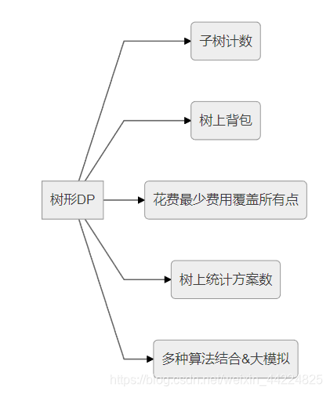

```c
vector<int>G[N];
int a[N],dp[N],ans;
void dfs(int u,int fat)
{
    dp[u]=a[u];
    for(auto v:G[u])
    {
        if(v!=fat)
        {
            dfs(v,u);
            dp[u]+=max(0,dp[v]);
        }
    }
    ans=max(ans,dp[u]);
}
```

换根-任意一点能到达的最远距离

```c
const int N=5e5+5;
vector<pair<int,int> >G[N];
int dp[N][3],pot[N];
void dfs(int u,int fat)
{
    for(auto it:G[u])
    {
        int v=it.F,cost=it.S;
        if(v==fat)
            continue;
        dfs(v,u);
        if(dp[u][0]<=dp[v][0]+cost)
        {
            dp[u][1]=dp[u][0];
            dp[u][0]=dp[v][0]+cost;
            pot[u]=v;
        }
        else if(dp[u][1]<dp[v][0]+cost)
            dp[u][1]=dp[v][0]+cost;
    }
}
void dfs1(int u,int fat)
{
    for(auto it:G[u])
    {
        int v=it.F,cost=it.S;
        if(v==fat)
            continue;
        if(pot[u]==v)
            dp[v][2]=cost+max(dp[u][1],dp[u][2]);
        else
            dp[v][2]=cost+max(dp[u][0],dp[u][2]);
        dfs1(v,u);
    }
}
```

### 状压DP——O（3n）

15 or 16可以枚举子集,以上就不行了
枚举子集
例如：1011
子集1010 1001 1000 0011 0010 0001
然后xor ,就可以得到子集的补集，合并取最小即可
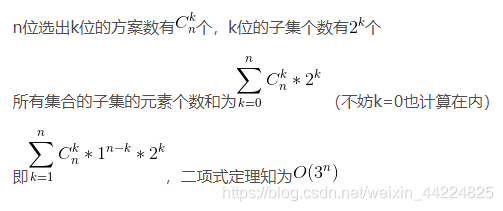
枚举子集

```c
    for(int i=1;i<(1<<n);i++)
    {
        dp[i]=get(i);
        for(int j=i;j;j=(j-1)&i)
            dp[i]=min(dp[i],dp[j]+dp[j^i]);
    }
    cout<<dp[ (1<<n)-1 ]<<endl;
```

### 概率DP

概率顺着推，期望逆着推

### 高维前缀和（sosdp）—— O（nlogn）

子集前缀和

```c
    for(int i=0;i<22;i++)
        for(int j=0;j<(1<<22);j++)
            if(j&(1<<i))
                dp[j]+=dp[j^(1<<i)];
```

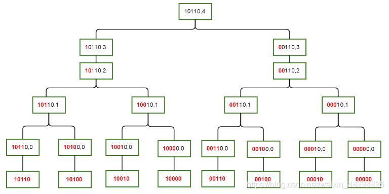

### 数位DP

**状态考虑完全，都加入的dp数组中，参考YKW模板**
**注意：有的时候，把limit加入dp中，每次清空dp更快，有的时候，取消limit，一次清空更快。**

```cpp
int dp[20][2][2][unknow],a[20];
int dfs(int pos,bool limit,bool lead,int state)
{
    if(pos==0)///边界条件
        return true or false;
    if(limit==0&&dp[pos][limit][lead][state]!=-1)
        return dp[pos][limit][lead][state];
    int maxn=(limit?a[pos]:9);
    int ans=0;
    for(int i=0;i<=maxn;i++)
    {
        if(lead&&i==0)
            ans+=dfs(pos-1,limit&&i==maxn,true,state);
        else///确定状态的改变
            ans+=dfs(pos-1,limit&&i==maxn,false,state);
    }
    if(limit==0)
        dp[pos][limit][lead][state]=ans;
    return ans;
}
int query(int x)
{
    ///这里不 容易TLE——memset(dp,-1);
    int pos=0;
    while(x)
        a[++pos]=x%10,x/=10;
    return dfs(pos,true,true,0);///开始有限制，有前导0
}
///输入样例之前清空dp
```

## 贪心

### 区间覆盖

> 给定 N个闭区间 [ai,bi] 以及一个线段区间 [s,t]，请你选择尽量少的区间，将指定线段区间完全覆盖。
>
> 输出最少区间数，如果无法完全覆盖则输出 −1


## 点

### 括号配对

整体左括号数量一定等于右括号

每个前缀中左括号数一定大于等于右括号数

设左括号=1 右括号=-1

则总和为0，且任意前缀和都大于等0

结论：只要总和为零，即使前缀和不为0，也一定可以通过位移达到合法状态

### 进制

如果题目一直隐含着除操作或乘操作在某一个数上，想到进制

一直乘2除2 二进制；乘3除3 三进制

### **1—9的倍数特征**

**1的倍数的特征：**所有非零整数都是1的倍数。

**2的倍数特征：**个位上是0、2、4、6、8的数（偶数）是2 的倍数。

**3的倍数特征：**各个数位上的数相加的和是3的倍数，这个数就是3的倍数。

**4的倍数的特征：**后两位是4的倍数，这个数就是4的倍数。比如，123456，最后两位是56，56是4的倍数，那么不管前面是什么，这个数都是4的倍数。

**5的倍数的特征：**个位上的数是0或5的数是5的倍数。 

**6的倍数的特征：**一个数只要能同时是2和3的倍数，那么这个数就是6的倍数。或者是各个数位上的数字之和是3的倍数的所有偶数就是6的倍数。

**7的倍数的特征：**若一个整数的个位数字截去，再从余下的数中，减去个位数的2倍，如果差是7的倍数，则原数能被7整除。如果差太大或心算不易看出是否7的倍数，就需要继续上述“截尾、倍大、相减、验差”的过程，直到能清楚判断为止。

举个例子：

判断133是否7的倍数的过下：13－3×2＝7，所以133是7的倍数；又例如判断6139是否7的倍数的过程下：613－9×2＝595，59－5×2＝49，所以6139是7的倍数，其余类推 。

**8的倍数的特征：**一个整数的末尾三位数是8的倍数，则这个数是8的倍数。

如9256末三位是256，256÷8=32，9256÷8=1157，所以9256是8的倍数

**9的倍数的特征**：整数各个位数字之和是9的倍数，这个数就是9的倍数。比如，7182，7+1+8+2=18，18是9的倍数，所以7182是9的倍数。

### 有序数去重

```c++
//1 2 3 4 4 5 5 5 6
	//1.它是第一个
	//2.a[i]!=a[i-1]
sort(a,a+n);
for(int i=1,j=1;i<n;i++)
{
    if(a[i]!=a[i-1]) a[j++]=a[i];
}
去重后a[0]-a[j-1]
```

### 化圆为链

```c++
for(int i=1;i<=n;i++)
    {
        cin >> w[i].l >> w[i].r;
        if(w[i].r<w[i].l) w[i].r+=m; //化圆为链
    }
    sort(w+1,w+n+1);
    n2=n; // 化圆为链 拆环加倍成一条链
    for(int i=1;i<=n;i++)
    {
        n2++;
        w[n2].l=w[i].l+m;w[n2].r=w[i].r+m;
    }
```

### 压维

##### 将一维数组转换为二维

```c++
	a[9]-->a[3][3]	
    a[i]-->a[x][y]
    x = i/3 y = i%3
    x * 3 + y = i
```

```c++
//三维
//点总数 n=A*B*C<1e6
//若g[1e6][1e6][1e6] 太大了
//ABC是三维的长宽高 x 范围1~A y范围1~B z 范围1~C
h = (x-1)*B*C + (y-1)*C + (z-1)+1  //h的范围是1~A*B*C
int get(int x, int y, int z)// 压维映射函数
{
    if(x>A||y>B||z>C) return 0;
    return (x-1)*B*C + (y-1)*C + (z-1)+1;
}
//二维
int get(int x, int y)// 压维映射函数
{
    if(x>A||y>B|) return 0;
    return (x-1)*B + (y-1) +1;
}
//二维 x,y从0开始 则
int get(int x, int y)// 压维映射函数
{
    if(x>A||y>B|) return 0;
    return x*B + y ;
}
```


### 间隔删掉字符

### MEX

```c++
int a[N],b[N];
queue<int>q[N]; //储存每个数出现的所有下标
 int main()
{
        int n;
        cin >> n;
        for(int i=0;i<n;i++)
        {
            cin >> a[i];
            q[a[i]].push(i);
 
        }
 		int idx=0; //访问到的地方
        int m=0;
        while(idx<n)
        {
            int i=0,cur=idx;
            while(i<n&&q[i].size())
            {
                cur=max(cur,q[i].front());//cur表示到达所有点，最小的下标
                i++;
            }
            b[m++]=i;//当前MEX值
 			for (int j = idx; j <= cur; ++j)
            {
			q[a[j]].pop(); //把所有经过的下标弹出
            }
            idx=cur+1;
 		}
        cout << m << endl;
        for(int i=0;i<m;i++) cout << b[i] << " ";
```

### 易错点

- 递归内使用的数据，放在全局变量里

+ 分数比较 a/b 与c/d 转换成乘法 记得开$longlong$ 判断条件不是 a!=c 和 b!=d 应该是a*d != b*c

* 双向图 边数*2
* 抽屉原理
* LL 过程虽然取模，但是在加的过程中会爆掉！！！！！！所以以后所有题目longlong带上!!!!!
* 要使得误差小于1e-6，就至少要保留6位小数。
* 求区间[l,r]，可以转化成$[1,r]-[1,l-1]$
* 取模 如果过程中有减法，记得加上一个MOD
* 关于字符串，全小写字母，要考虑到字母26个，可以将每个字母遍历一遍
* 比较数字大小，仅考虑数字小于才返回，当大于的时候大小也确定了。当有if的时候else没写，可以考虑是不是少了什么情况
* 当遇到前导零消除的时候注意结果是0的情况，防止仅因该0也被消除
* 思考样例的时候不像慌，慢慢的想，尽量把所有情况都写出来
* 高精度乘法乘0有前导零，减法也有
* **三元运算符 `?:` 的两个分支必须返回相同类型（或可隐式转换的类型）**
* while(i<s.size()&&s[i]=='@') i++;  任何时候while都要思考是否加上范围条件，i<s.size();


# 补充


* 比较数字大小，仅考虑数字小于才返回，当大于的时候大小也确定了。当有if的时候else没写，可以考虑是不是少了什么情况

* 当遇到前导零消除的时候注意结果是0的情况，防止仅因该0也被消除

* 思考样例的时候不像慌，慢慢的想，尽量把所有情况都写出来

* #### 二维前缀和

  注意每个坐标是代表一个格子，而不是一个点

* 离散化

  重点是不仅要将给定的数据离散化，还要将提问的数据也先记录下来离散化

* to_string(123) ==>"123"

* **三元运算符 `?:` 的两个分支必须返回相同类型（或可隐式转换的类型）**

* #### 无限制输入

  一行中输入一排数字，遇到换行符就结束

  ```c++
  //方法1：getchar 
  //代码通过cin.get()从缓存中读取一个字节，这样就扩充了cin只能用空格和TAB两个作为分隔符。
  //这很精巧。发现是’\n’就知道一行结束了 
  vector<int> nums;
  int num;
  while(cin>>num){
      nums.push_back(num);
      if(getchar() == '\n')
          break;
  }
  //方法2：cin.get
  vector<int> nums;
  int num;
  while(cin>>num){
      nums.push_back(num);
      if(cin.get() == '\n')
          break;
  }
  ```

* 四舍五入输出

  ```c++
  //printf
  #include <iostream>
   
  using namespace std;
   
  int main()
  {
    double a = 1.4999999;
    double b = 1.5000001;
    double n_a = -1.4999999;
    double n_b = -1.5000001;
      
    printf("%.0f\n", a);    // 1
    printf("%.0f\n", b);    // 2
    printf("%.0f\n", n_a);    // -1
    printf("%.0f\n", n_b);    // -2
    return 0;
  }
  ```

* #### 四舍五入结果

  ```c++
  #include <iostream>
  #include <cmath>
   
  using namespace std;
   
  int main()
  {
    double a = 1.4999999;
    double b = 1.5000001;
    double n_a = -1.4999999;    
    double n_b = -1.5000001; 
    cout << round(a) << endl;    // 1
    cout << round(b) << endl;    // 2
    cout << round(n_a) << endl;    // -1
    cout << round(n_b) << endl;    // -2
    return 0;
  }
  ```

* #### 输入带空格、换行

  ```c++
  scanf("%c %d",&ch,&n);
  int flag=1;
  getchar(); //吃掉前面的换行
  int i = 0;
  //存入汉字
  for(i=0;i<n;i++)
  {
      int j = 0;
      for(j=0;j<n;j++)
      {
          arr[i][j]=getchar(); //获取每一个字符 包括空格
      }
      getchar(); //吃掉换行
  }
  ```

* **string**

  ```c++
  // find(c, n): 从下标 n 位置查找字符 c ，找到返回下标,找不到返回npos
  // replace(n, m, "c"): 从下标 n 开始的 m 个字符 替换为c:
  
  // 以上两个结合使用讲解: 将s3中的空格替换为 ##
  string s3("Youth gives you light please don't let it down");
  size_t pos1 = s3.find(' '); // find 不给右参数时默认从 0 开始
  while (pos1 != string::npos)
  {
      s3.replace(pos1, 1, "##");
      pos1 = s3.find(' ');
  }
  
  string s1("Hello World!");
      s1.insert(2, "##"); //效率低
      cout << s1 << endl; // 输出: He##llo World!
   
      string s2("Hello World!");
      s2.erase(4, 6);
      cout << s2 << endl; // 输出: Helld!
  
  ```

  

## 二分查找

==二分注意始终是用mid来比较，思考mid属于左边还是右边，mid小于还是大于==


