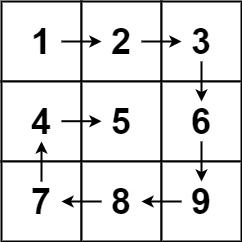

# 螺旋矩阵

[原题链接](https://leetcode.cn/problems/spiral-matrix/description/?envType=study-plan-v2&envId=top-100-liked)

这一题不知道是第几次遇到了，每次遇到开始写之间都要深吸一口气，感觉是一场鏖战，因为当时c++期末上机有这一题，调试了好久时间快到了才调完，写了特别长，代码十分恶心，思路非常混乱，非常讨厌这种自己写都不清楚自己写了啥感觉。  
但是今天再次碰到，思路想好之后写，一气呵成，贼快就写完了，基本上没有调试就过了，而且感觉这个思路比其他题解要更容易思考一点，不需要来回考虑很多变量，非常直接，因此对本人代码十分满意，特此记录该题。

## 题目

给你一个 m 行 n 列的矩阵 matrix ，请按照 顺时针螺旋顺序 ，返回矩阵中的所有元素。  


## 思路

一直前进，碰壁就改变方向。  

## 代码

``` c++
class Solution {
public:
    vector<int> spiralOrder(vector<vector<int>>& matrix) {
        int n=matrix.size(),m=matrix[0].size();
        vector<vector<bool>> st(n,vector<bool>(m,0)); //判断该位置是否走过
        int dx[4]={0,1,0,-1},dy[4]={1,0,-1,0};  //转弯一直按照“右下左上” 的顺序
        vector<int> ans; //存答案
        int x=0,y=0,dr=0; //x,y为当前走到的点，dr表示当前的方向
        while(1)
        {
            ans.push_back(matrix[x][y]); //走到当前点存入答案
            st[x][y]=1; //记录该点，表示已经走过
            if(ans.size()==n*m) break; //当答案数组的大小等于m*n表示所有点已经全部走完，跳出循环
            
            //判断下一个点，按照原方向走，如果出界或已经访问过则表示需要换下一个方向dr+1
            if(x+dx[dr%4]<n&&x+dx[dr%4]>=0&&y+dy[dr%4]<m&&y+dy[dr%4]>=0&&!st[x+dx[dr%4]][y+dy[dr%4]])
            {
                x+=dx[dr%4];
                y+=dy[dr%4];
            }
            else
            {
                dr+=1;
                x+=dx[dr%4];
                y+=dy[dr%4];
            }
        }
        return ans;
    }
};
```
