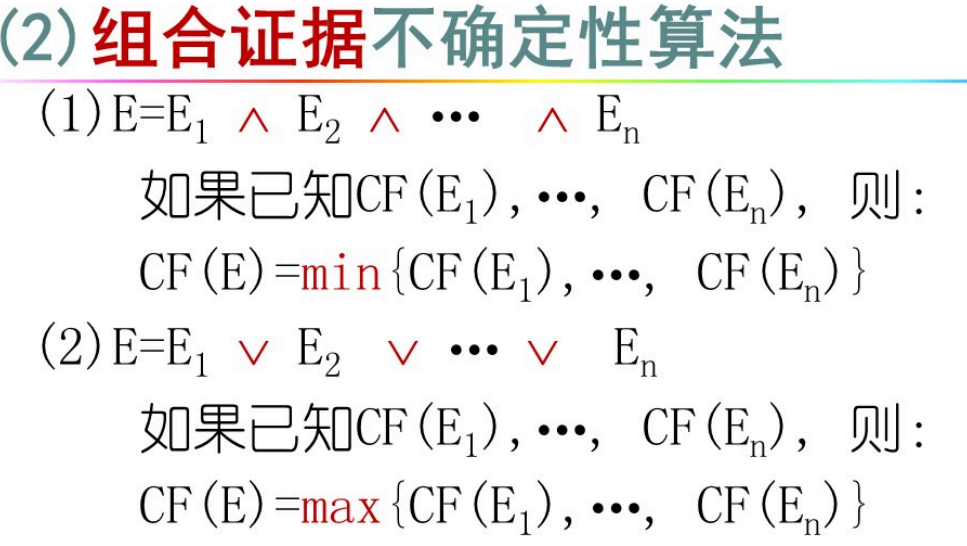
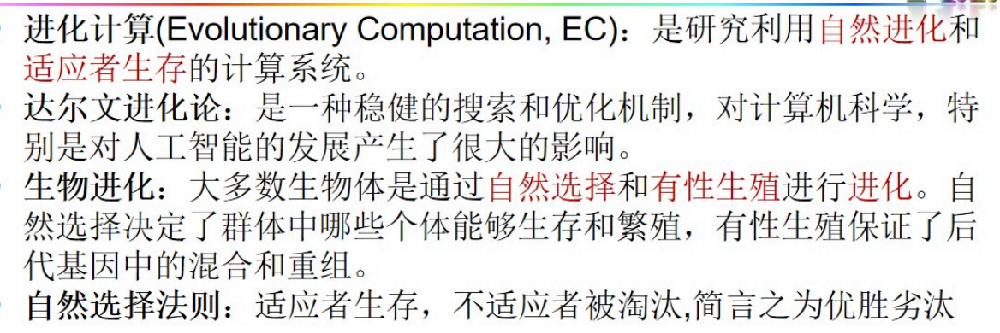
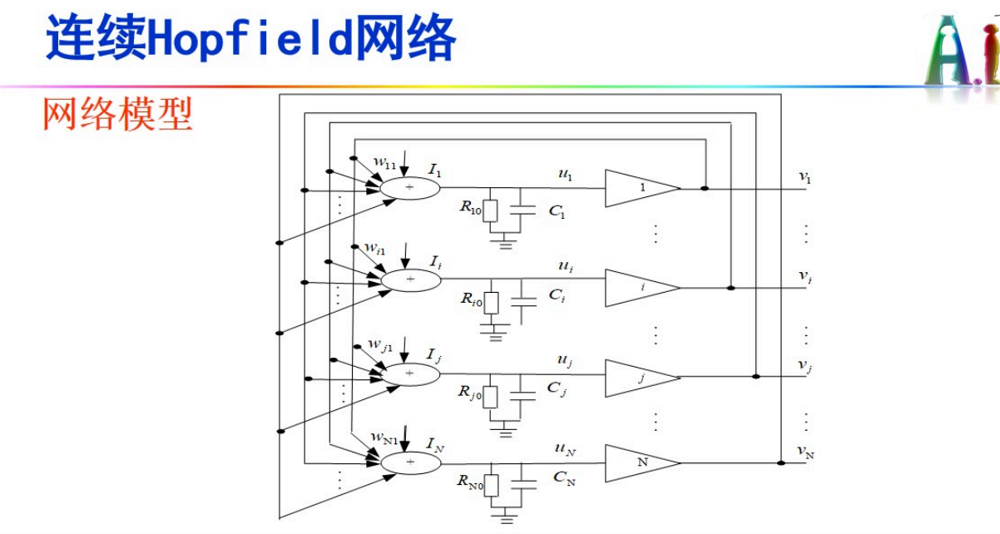
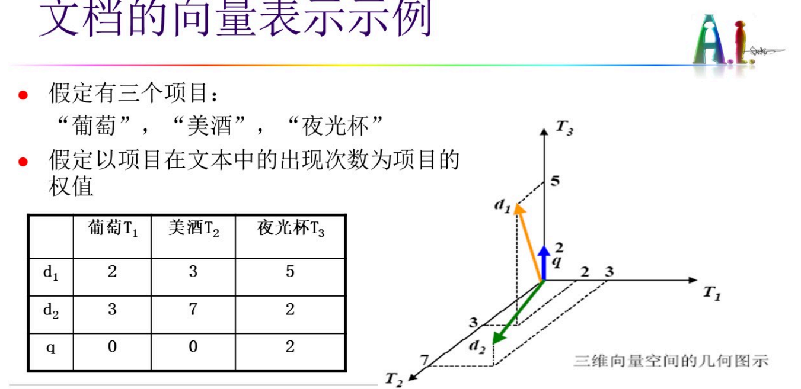
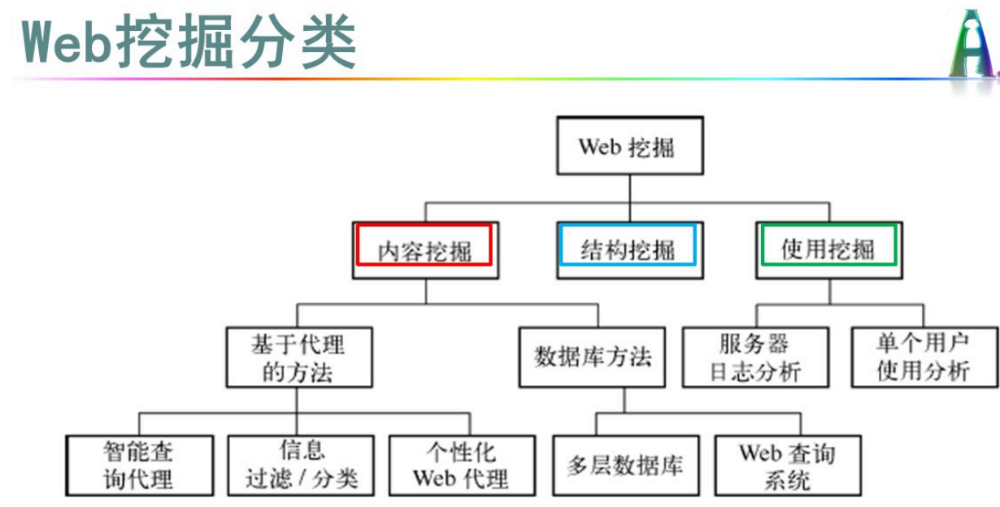
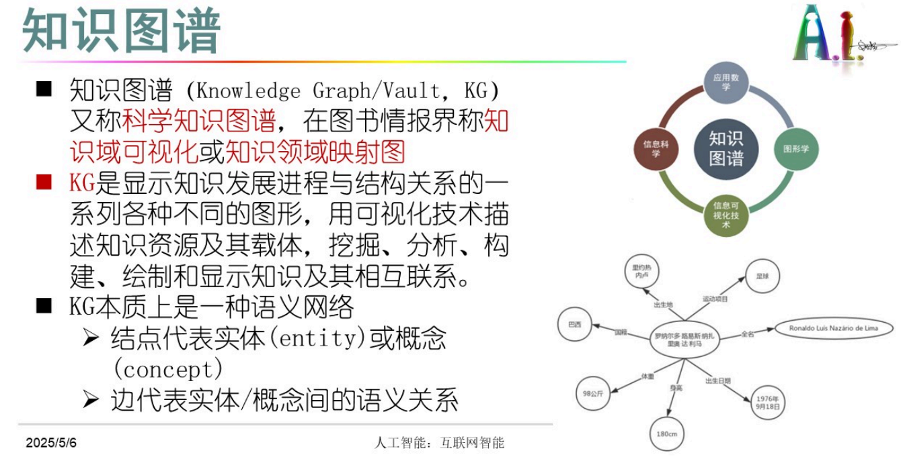
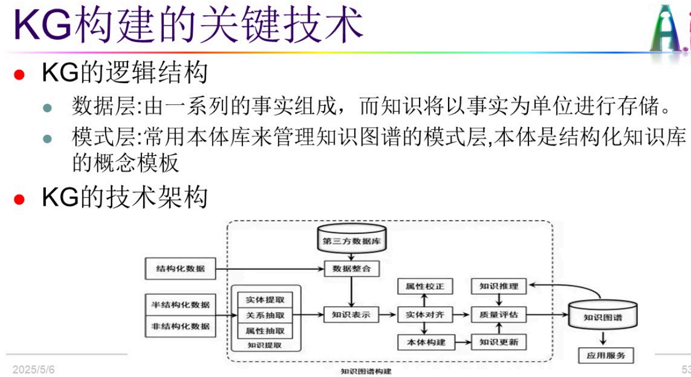

# 人工智能


## 三大主义

| 学派                            | 理论                                  | 算法/技术                                          | 应用系统         | 应用                             |
| ------------------------------- | ------------------------------------- | -------------------------------------------------- | ---------------- | -------------------------------- |
| 功能（符号）主义                | CPS(物理符号系统假说)PSSH             | 机器推理、自动推理算法、不确定性推理算法、搜索算法 | 专家系统         | 医疗辅助诊断、行情预测、故障诊断 |
| 结构主义（连接）（类脑计算）    | PDP(并行分布加工)（神经网络）graph    | BP/TF/脉冲网络/MP/CNN                              | 大模型（多模态） | 视频智能监控、多媒体处理         |
| 行为主义                        | Agent智能、具身智能（不关心内部实现） | 强化学习（做对奖励）遗传算法、群体智能             | 无人自主系统     | 智能网游、机器人                 |
| 机制主义 将上述三个主义合到一起 |                                       |                                                    |                  |                                  |

AlphaGo: 功能主义+结构主义 搜素+神经网络

DeepSeek : 结构主义+行为主义 神经网络+专家系统（MOE)

BP损失度函数

## 第一章 绪论

认知建模
知识表示
自动推理
机器学习


### 1. 什么是人工智能？它的研究目标是什么？

人工智能相对于人的自然智能而言，即用**人工的方法和技术，模拟、延申和扩展人的智能，实现某些 “机器思维”**。

根本目标：要求计算机不仅能模拟而且可以延申、扩展人的智能，**达到甚至超过人类智能的水平**。
近期目标：使现有计算机不仅能做一般的数值计算及非数值信息的数据处理，而且能运用知识处理问题，能模拟人类的部分智能行为。

作为工程技术学科，人工智能的目标是提出建造人工智能系统的新技术、新方法和新理论，并在此基础上研制出具有智能行为的计算机系统。
作为理论研究学科，人工智能的目标是提出能够描述和解释智能行为的概念和理念，为建立人工智能系统提供理论依据。

### 2. 人工智能程序和传统计算机程序之间有什么不同？

计算机程序 I: Input O: Output P: Process 算法步骤==》思想

人工智能程序：输出程序不固定，process可能会改变，生成式。

传统程序遵循固定的算法步骤（Process），对特定输入（Input）产生确定输出（Output），其逻辑由人工预先定义；而人工智能程序（如机器学习模型）的运算过程（Process）会通过数据自动调整，输出结果不固定，具备从经验中学习并适应新任务的能力，核心在于通过训练动态生成算法逻辑而非硬编码规则。

### 3. 人工智能研究有那些主要的学派？各有什么特点？

**功能（符号主义）主义** 自上而下

* 智能活动的基础是物理符号系统，思维过程是符号模式的处理过程。
* 
* 

**结构（连接）主义** 自下而上

* 基于神经元和神经网络的连接机制和学习算法
* 
* 

**行为（进化）主义**

* 智能行为的基础是“感知-行动”的反应机制

* 

统计主义 概率

仿真主义 先结构后功能（理论在发现之后出现）

机制主义


## 第二章 知识表示

三段论 谓词逻辑 状态空间

知识表示就是研究用机器表示知识的可行性、有效性的一般方法，可以看作是将知识符号化并输入到计算机的过程和方法。


### 1. 什么是知识 ? 它有什么特性 ?

知识是人类在实践中认识客观世界的规律性的东西。知识是经过加工的信息，包括事实、信念和规则。知识一般可分为陈述性知识、过程性知识和控制性知识。

知识的特性：相对正确性、不确定性、可表示性和可利用性。


### 2. [产生式系统](https://so.csdn.net/so/search?q=产生式系统&spm=1001.2101.3001.7020)有哪几个部分组成 ? 它们的作用分别是什么?

产生式系统由三大部分组成 ：规则库、综合数据库或工作区、控制系统。

规则库： 描述某领域内知识的产生式规则的集合。

综合数据库: 是产生式系统的数据结构中心，用于存放问题求解过程中各种当前信息的数据结构，包括初始事实、中间事实和最后结果。

控制系统 : 规则的解释程序；用来控制和协调规则库和全局数据库的运行，包括推理方式和控制策略。


### 3. 在基于语义网络的推理系统中，一般有几种推理方法？简述它们的推理过程

推理方法一般有两种 ：匹配和继承。

匹配推理的过程 ：(1) 根据提出的待求解问题，构造一个局部网络；
（2）根据局部网络到知识库中寻找可匹配的语义网络；
（3）匹配成功时，与未知处相匹配的事实就是问题的解

继承推理的过程 : 下层节点从上层节点继承一些属性。

**

## 第三章 自动推理


### 1. 用熟悉的语言实现深度优先、广度优先和迭代加深算法


### 2. 什么是推理的控制策略？有哪几种主要的推力驱动模式？

推理控制策略主要解决整个问题求解过程的知识选择和应用顺序，即先做什么后做什么，并能根据问题求解的当前状态分别做不同的工作，还能处理异常情况。主要包括推理方向，限制策略，求解策略，搜索策略。

推理驱动模式：正向推理（[数据驱动](https://so.csdn.net/so/search?q=数据驱动&spm=1001.2101.3001.7020)推理）、方向推理、混合推理。


## 第四章 不确定推理





### 1. 什么是不确定推理？不确定性推理的基本问题是什么？

`不确定推理:` 从不确定性初始证据出发，通过运用不确定性的知识，最终推出具有一定程度的不确定性但却是合理或者近乎合理的结论的方法或理论。

不确定性推理的`基本问题`是 : 不确定知识的表示问题、不确定信息的计算问题、不确定性表示和计算的语义解释问题。


## 第五章 机器学习


### **蚁群算法（Ant Colony Optimization, ACO）通俗版**

#### **比喻**

一群蚂蚁找食物，**没地图、没导航**，全靠**信息素（pheromone）**标记路线。

* **短路径**：蚂蚁往返快，信息素积累多，吸引更多蚂蚁。

* **长路径**：信息素挥发快，逐渐被放弃。
  最终，蚁群**集体找到最短路径**​！

* ### **经典应用**

  1. **旅行商问题（TSP）**：找最短环游路线。
  2. **网络路由优化**：数据包传输路径选择。
  3. **机器人路径规划**：动态避障。

### **启发式搜索：爬山法 vs 模拟退火法（通俗版）**

#### **1. 爬山法（Hill Climbing）**

**比喻**：你蒙着眼爬山，只能摸脚下的路。每次**只往更高的一小步**走，直到周围没有更高的地方，就停在那儿。

* **特点**：简单直接，但容易卡在**小土坡（局部最优）**，误以为登顶，其实旁边有更高的山（全局最优）。
* **缺点**：一旦走到局部高点，就彻底“摆烂”，无法逃脱。

#### **2. 模拟退火法（Simulated Annealing）**

**比喻**：你爬山时带了个“犯傻按钮”——偶尔允许自己**往低处走几步**（类似金属降温时原子偶尔乱跳）。

* **初期**：疯狂试探（高温时允许大幅“犯错”），可能跳过低谷。
* **后期**：逐渐冷静（降温），只接受小幅优化，最终稳定在最高点。
* **优点**：靠“偶尔摆烂”跳出局部最优，更可能找到真正的最高山。

**一句话总结**：
爬山法“一根筋”，模拟退火法“先疯后稳”，后者更可能找到全局最优解。

还有A*算法

### **A\*算法（A-Star）通俗版**

#### **比喻**

你在地图上找最短路线去学校，既要考虑**已经走了多远**（实际代价 `g(n)`），又要**估计还剩多远**（启发式预估 `h(n)`），两者相加（`f(n) = g(n) + h(n)`）决定下一步走哪儿。

#### **关键点**

1. **聪明预估**：
   * 用**启发函数**（如直线距离）估算剩余距离（`h(n)`），避免像Dijkstra一样无脑瞎逛。
   * 如果预估**永远≤真实距离**（可采纳性），一定能找到最短路径。
2. **动态调整**：
   * 优先走**“当前路径总代价+预估剩余代价”最小**的方向（`f(n)`最小），平衡效率和准确性。

#### **对比其他算法**

* **vs Dijkstra**：A*靠预估（`h(n)`）减少搜索范围，更快。
* **vs 贪心搜索**：A*不只看预估（`h(n)`），还结合已走距离（`g(n)`），避免绕路。

#### **缺点**

* 如果预估不准（`h(n)`过大），可能跑偏。
* 存储所有待探索节点（`Open List`），内存消耗大。

**一句话总结**：
A*像“带导航的Dijkstra”，用预估+实际距离找最短路径，又快又准！

博弈搜索中的alpha-beta搜索

### **Alpha-Beta 搜索（通俗版）**

#### **比喻**

你和对手轮流下棋，想找到**对自己最有利的一步**。但计算所有可能走法太慢，于是用**Alpha-Beta剪枝**来“聪明地偷懒”——提前砍掉明显烂的分支，省时间！

#### **核心思想**

1. **Alpha（α）**：当前玩家能保证的**最低得分**（“至少能拿这么多”）。
2. **Beta（β）**：对手能保证的**最高上限**（“对手最多让你拿这么多”）。
3. **剪枝**：如果某步的得分**比对手已知的最差选项还烂**，直接放弃（不继续算后续走法）。

#### **如何工作**（以MAX玩家为例）

* **MAX层**（你的回合）：选**最大**的分数，更新α（“我能保证至少这个分”）。

* **MIN层**（对手回合）：选**最小**的分数，更新β（“对手最多让我拿这个分”）。

*

  剪枝条件

  ：

* 如果发现 **α ≥ β**，说明对手在前面某步已经能限制你更差，当前分支不用再算！

#### **对比普通Minimax**

* **Minimax**：暴力计算所有可能，慢但准确。
* **Alpha-Beta**：结果和Minimax一样，但通过剪枝**大幅减少计算量**（理想情况下砍掉一半以上）。

#### **缺点**

* 剪枝效率依赖**走法顺序**——如果先算烂步，剪枝效果差；先算好步，剪枝多。
* 依然受限于搜索深度（太深的棋局算不完）。

**一句话总结**：
Alpha-Beta是“聪明版Minimax”，一边算一边砍掉废招，用对手的底线（β）和自己的底线（α）逼自己高效决策！

蚁群算法

### **蚁群算法（Ant Colony Optimization, ACO）通俗版**

#### **比喻**

一群蚂蚁找食物，**没地图、没导航**，全靠**信息素（pheromone）**标记路线。

* **短路径**：蚂蚁往返快，信息素积累多，吸引更多蚂蚁。
* **长路径**：信息素挥发快，逐渐被放弃。
  最终，蚁群**集体找到最短路径**​！

------

### **核心思想**

1. **信息素引导**：
   * 蚂蚁按概率选择路径，**信息素浓度越高，选择概率越大**（正反馈）。
   * 信息素会**随时间挥发**，避免过度依赖旧路径。
2. **正反馈 + 随机探索**：
   * 大部分蚂蚁走“热门路径”（ exploitation ），少数蚂蚁随机探索（ exploration ）。
3. **迭代优化**：
   * 每只蚂蚁走完一遍后，更新路径上的信息素（最短路径的信息素增强最多）。
   * 多轮迭代后，蚁群**收敛到最优解**。

------

### **对比其他算法**

* **vs 贪心算法**：蚁群既利用已知好路径，又保留随机探索能力，避免局部最优。
* **vs 遗传算法**：蚁群通过“信息素”间接交流，而遗传算法通过“基因交叉变异”直接演化。

------

### **优缺点**

✅ **优点**：

* 适合**离散优化问题**（如旅行商问题、路径规划）。
* 自适应性强，能动态调整搜索策略。

❌ **缺点**：

* 收敛速度慢，尤其问题规模大时。
* 信息素挥发率、初始浓度等参数需要调优。

------

### **经典应用**

1. **旅行商问题（TSP）**：找最短环游路线。
2. **网络路由优化**：数据包传输路径选择。
3. **机器人路径规划**：动态避障。

------

**一句话总结**：
蚁群算法模拟“蚂蚁找食”，用信息素集体智慧，通过正反馈+随机探索，迭代出最优路径！

粒子群优化算法

### **粒子群优化算法（Particle Swarm Optimization, PSO）通俗版**

#### **比喻**

一群鸟在森林里随机飞，找食物最多的地方。

* 每只鸟（粒子）记录**自己找到的最好位置**（个体最优）。
* 鸟群互相交流，知道**全群找到的最好位置**（全局最优）。
* 每只鸟调整飞行方向，既**飞向自己的最佳点**，又**靠近全群最佳点**，最终集体找到食物最多的地方！

### **优缺点**

✅ **优点**：

* 简单易实现，参数少，收敛速度快。
* 适合**连续优化问题**（如函数极值、神经网络训练）。

❌ **缺点**：

* 可能早熟收敛（全群过早聚集到局部最优）。
* 对高维复杂问题效果下降。
* 

### 1. 简单的学习模型由哪几部分组成？各部分的功能是什么？

* `环境`：是指系统外部信息的来源，为学习系统提供获取知识所需的相关对象的素材或信息。
* `学习单元`：处理环境提供的信息，相当于各种算法。
* `知识库`：存放由学习环节所学到的知识。
* `执行单元`：处理系统面临的现实问题，即应用知识库中所学到的知识求解问题。

### 2. . 描述[支持向量机](https://so.csdn.net/so/search?q=支持向量机&spm=1001.2101.3001.7020)的基本思想和数学模型

支持向量机（SVM）是一种二类分类方法，它的基本模型是定义在特征空间上的间隔最大的线性分类器。支持向量机方法是建立在统计学习理论的 VC 维理论和结构风险最小原理基础上的。

数学模型：逻辑回归。


### 3. 试解释强化学习模型及其他机器学习方法的异同

强化学习方法通过与环境的交互来确定和优化动作序列，以实现序列决策任务。进化计算和群体智能都是利用自然进化和适应思想提出的机器学习方法，实质上是一种搜索寻优的算法。

强化学习与其他机器学习方法的核心区别在于**学习范式与目标驱动方式**：强化学习通过智能体与环境的持续交互来学习策略，依赖**延迟奖励信号**（如游戏胜负）优化长期决策能力，其本质是面向动态场景的序贯决策过程；而监督学习需预先提供带标注的数据集以训练预测模型（如分类任务），无监督学习则专注于未标注数据的结构挖掘（如聚类），二者皆以静态数据为基础且无环境交互机制。尽管方法各异，三者均为数据驱动的优化模型，共享函数逼近等底层技术。


### 4. 说明遗传算法的构成因素，给出遗传算法流程图

构成因素： 编码，初始群体的形成，适应性评估检测，选择，杂交，变异。
基本遗传算法流程图：




## 第六章 神经网络


### **Hopfield网络（通俗详解）**

#### **1. 核心概念**

Hopfield网络是一种**单层全连接递归神经网络**，由John Hopfield在1982年提出。它最大的特点是：

* **能量函数**：网络会自发收敛到能量最低的状态（类似物理系统的稳定态）
* **联想记忆**：可以存储和回忆模式（比如记住一张图片，即使输入有噪声也能还原）
* **两种类型**：离散型（DHN）和连续型（CHN）

------

#### **2. 离散Hopfield网络（DHN）**

**工作原理**：

* 每个神经元只有 **+1（激活）或 -1（抑制）** 两种状态
* 异步更新：每次随机选一个神经元，根据其他神经元的状态和连接权重决定自己的新状态
* 通过**Hebb学习规则**存储模式：权重更新公式为 wij=1N∑xixjw_{ij} = \frac{1}{N} \sum x_i x_jwij=N1∑xixj

**举个栗子🌰**：
 假设网络存储了字母"T"和"H"的模式（如下图）。即使输入一个残缺的"T"，网络也能自动补全完整图案。

markdown

markdown

复制

```markdown
初始输入 → 迭代更新 → 稳定输出  
 ██             █████           █████  
  █               █               █  
  █               █               █
```

**特点**：

* 保证收敛（有限步内必稳定）
* 存储容量约 **0.15N**（N=神经元数量）
* 主要问题：会出现**伪吸引子**（非存储模式的稳定状态）

------

#### **3. 连续Hopfield网络（CHN）**

**工作原理**：

* 神经元输出是**连续值**（通常用Sigmoid函数约束在[0,1]或[-1,1]）
* 用微分方程描述动态变化：τduidt=−ui+∑wijVj\tau \frac{du_i}{dt} = -u_i + \sum w_{ij} V_jτdtdui=−ui+∑wijVj
* 能量函数包含**连续变量**，适合求解优化问题

**举个栗子🌰**：
 求解旅行商问题（TSP）时：

* 每个神经元代表"城市A在路线第B位"
* 能量函数编码**路径总长度**和**约束条件**
* 网络演化过程就是寻找最短路径的过程

**特点**：

* 可硬件实现（用模拟电路）
* 适合解决组合优化问题
* 收敛更平滑但速度较慢

------

#### **4. 对比总结表**

| 特性           | 离散Hopfield   | 连续Hopfield    |
| -------------- | -------------- | --------------- |
| **神经元输出** | +1或-1         | 连续值（如0~1） |
| **更新方式**   | 异步离散跳变   | 连续微分方程    |
| **主要应用**   | 模式存储与回忆 | 组合优化问题    |
| **能量函数**   | 离散的         | 连续的          |
| **硬件实现**   | 数字电路       | 模拟电路        |
| **典型问题**   | 伪吸引子       | 收敛速度慢      |

------

#### **6. 数学本质**

两种网络的核心都是**Lyapunov能量函数**：
$E = -\frac{1}{2} \sum_{i,j} w_{ij} V_i V_j + \sum \theta_i V_i$

* 网络演化总是朝着能量降低的方向进行
* 稳定点对应能量的局部最小值

------

**终极总结**：
 Hopfield网络就像个"智能磁铁板"——离散版是**像素画板**，专门存储和还原图案；连续版是**橡皮泥板**，适合揉捏出最优形状。它们都通过能量最小化自发找到稳定解，是连接**神经网络**和**物理系统**的经典模型！




高温时随机乱试，低温时逐渐清醒

### 1. 什么是深度学习？常见的深度学习方法有哪些？

深度学习：深度学习的思想在于模拟人脑的层级抽象结构，通过无监督的方法分析大规模数据，发掘数据中蕴含的有价值的信息。

常见的深度学习方法 : 自编码器 、 受限玻尔兹曼机 、 深度信念网络 、 卷积神经网络


#### 2. BP 算法误差传递（反向传递）

## 第七章 专家系统

### 1. 什么是专家系统？它有哪些基本特征？

专家系统是一类具有专门知识和经验的计算机智能程序系统，通过对人类专家问题求解能力的建模，采用人工智能中的知识表示和知识推理技术来模拟通常由专家才能解决的复杂问题，达到具有与专家同等解决问题的水平。

专家系统 = 知识库+推理机

基本特征：具备某个应用领域的专家级知识。能模拟专家的思维。能达到专家级的解题水平。


### 2. 专家系统的基本结构包括哪些部分？每一部分的主要功能是什么？

人机交互界面、知识库、推理机、解释器、综合数据库、知识获取六部分。

`人机交互界面`是系统与用户进行交流时的界面。通过该界面，用户输入基本信息、回答系统提出的相关问题。系统输出推理结果及相关的解释也是通过人机交互界面。

`知识库`是问题求解所需要的领域知识的集合。
`推理机`是实施问题求解的核心执行机构。
`解释器`用于对求解过程作出说明，并回答用户的提问。
`综合数据库`是反映当前问题求解状态的集合，用于存放系统运行过程中所产生的所有信息，以及所需要的原始数据，包括用户输入的信息，推理中间结果和推理过程的记录等。
`知识获取`负责建立、修改和扩充知识库。


## 第八章 自然语言处理


### 1. 什么是自然语言理解？自然语言理解过程有哪些层次？各层次的功能如何？

自然语言理解：使用自然语言同计算机进行通讯的技术, 因为处理自然语言的关键是要让计算机 “理解” 自然语言, 所以自然语言处理又叫做自然语言理解；

自然语言处理的层次: 1 语音分析、2 词法分析、3 句法分析、4 语义分析 5 语用分析 ； 语言学角度

各层次的功能：1 `语音分析：`根据音位规则、从语音流中分出一个一个独立的因素，再根据音位形态小号出一个个音节及其对应的词素或词
`2 词法分析`：是理解单词的基础，其主要目的是从句子中分切出单词，找出词汇的各个词素，从中获得单词的语言学信息并确定单词的词义。
`3 句法分析:` 一是对短句子和短语进行分析，以确定构成句子的各个词，短语之间的关系以及各自在句子中的作用，并将这些关系用层次结构加以表达；二是对句法结构规范化。
`4 语义分析`：把分析得到的句法成分于应用领域中的目标表示相关联，产生正确唯一理解。
`5 语用分析`：研究语言所存在的外界环境度语言使用产生的影响；

### 2. 什么是语用分析？语法、语义和语用如何相互作用？

语用分析: 研究语言所存在的外界环境度语言使用产生的影响;

相互作用 ： 语义理论必须涉及语言学背景（说话的上下文）和现实社会背景（即非语言学事实的知识的相互作用） 语义理论必须于句法和语言的逻辑方面（演绎推理）相关联


### 3.什么是大语言模型，概述transformer的结构和功能

### **1. 什么是大语言模型？**

**答**：大语言模型（LLM）是基于海量文本训练的深度学习模型，具有**超大规模参数**（如千亿级）、**通用语言理解与生成能力**，通过预学习语言规律支持问答、写作、翻译等任务，代表模型如GPT系列。

------

### **2. Transformer的结构**

1. **输入层**：词嵌入（语义向量）+ 位置编码（注入顺序信息）
2. **编码器**（Encoder）：
   * **自注意力层**：计算词间关联权重（如"苹果→水果"）
   * **前馈网络**：非线性特征变换
   * **残差连接+层归一化**：稳定训练
3. **解码器**（Decoder）：
   * **掩码自注意力**：防止未来信息泄露
   * **编码器-解码器注意力**：对齐输入与输出（如翻译任务）
4. **输出层**：线性变换+softmax生成词概率

------

### **3. Transformer的核心功能**

* **长程依赖建模**：自注意力直接捕捉任意距离词关系（优于RNN）
* **并行计算**：非序列化处理，加速训练
* **多任务通用性**：同一架构支持翻译、生成、分类等
* **上下文生成**：自回归逐词输出连贯文本

------

### **4. 为什么Transformer适合大模型？**

**答**：

* **可扩展性**：堆叠更多层提升容量（如GPT-3有96层）
* **高效并行**：利用GPU同时处理所有词位
* **通用表征**：注意力机制自动学习语言复杂模式

BERT基于**Transformer的编码器（Encoder）**堆叠而成，主要包含以下部分：

* **输入层**：
  * **Token Embeddings**：词向量（WordPiece分词）
  * **Segment Embeddings**：区分句子A/B（用于句子对任务）
  * **Position Embeddings**：位置编码（与Transformer相同）
* **多层Transformer Encoder**：
  * 每层包含**自注意力（Self-Attention）+前馈神经网络（FFN）**
  * 典型配置：
    * **BERT-Base**：12层，768隐藏维度，12个注意力头
    * **BERT-Large**：24层，1024隐藏维度，16个注意力头
* **输出层**：
  * 每个输入token对应一个上下文相关的向量表示（如`[CLS]`用于分类任务）

### 4. 目前常用的信息检索模型有那些？扼要介绍它们的原理

模型有 ：布尔模型、概率模型、向量空间模型；
`布尔模型`：检索过程中要进行标引词的严格匹配。。
`概率模型`: 对于给定的用户查询，对所有文本计算概率、并从小到大进行排序。
`向量空间模型:`假设词与词之间不相关，以向量来表示文本，简化文本中关键字之间的复杂关系。




## 第九章 分布式人工智能与智能体


### **0.分布式人工智能的研究内容是什么**   背

分布式人工智能主要研究在逻辑上或物理分散上的智能系统如何并行的、相互协作地进行问题的求解

#### 1. 什么是智能体？什么是多智能体？和对象以及传统的专家系统有什么区别和联系？

`智能体`：在计算机和人工智能领域中，智能体可以看作是一个自动执行的实体，他通过传感器感知环境，通过效应器作用于环境。

`多智能体系统`研究在逻辑上和物理上分离的多个 Agent 协调其智能行为，即知识、目标、意图及规划等，实现问题求解。

智能系统与传统系统的重要**区别**在于：智能系统具有现场感应的能力。所谓现场感应指它可能与所处的现实世界的抽象——现场——进行交往，并适应这种现场。这种交往包括感知、学习、推理、判断并做出相应的动作。

#### 2. 试述移动智能体 Aglet(由底向上设计) 的基本结构

Aglet 以线程的形式产生于一台机器，需要时可以随时暂停正在执行打的工作，并将整个 Aglet 分派到另一台机器上，然后继续执行尚未完成的任务。


## 第十章 智能机器人


#### 1. 什么是智能机器人？

智能机器人是一种具有智能的、高度灵活的、自动化的机器，具备感知、规划、动作和协同等能力，是多种高新技术的合成体；是将体力劳动和智力劳动高度结合的产物，构建能 “思维 “的人造机器。

#### 2. 试比较智能机器人的体系结构

体系结构 1. 分层递阶结构 2 包容结构 3 三层结构 4 自组织结构 5 分布式结构 6 进化控制结构 7 社会机器人结构 8 认知机器人结构

#### 3. 真正具有人类情感的机器人要具备哪些基本系统？

1）情感识别系统、2）情感计算系统、3）情感表达系统

## 第十一章 互联网智能






#### 1. 什么是本体知识管理？本体知识管理的基本功能是什么？

本体知识管理可实现语义级知识服务，提高知识利用的深度。还可以支持对隐性知识进行推理，方便异购知识服务之间实现互操作，方便融入领域专家知识及经验知识结构化等。

基本功能：支持本体多种表示语言和存储形式，具有本体导航功能；支持本体的基本操作，如本体学习，本体映射和本体合并等；提供本体班本管理功能，支持本体的可扩展性和一致性。


#### 2. 简要的说明搜索引擎的工作流程

互联网上的网页进行搜索

在对搜集来的网页进行预处理

建立网页索引库

实现响应用户的查询请求，并对查找到的结果按某种规则进行排序后返回给用户。

#### 3. 社群智能是什么？试设计构建社群智能的基本体系结构

社群智能是从社会感知中挖掘和理解个人和群体活动模式、大规模人类活动和城市动态规律，把这些信息用于各种创新性的服务，包括社会关系管理、人类健康改善、公共安全维护、城市资源管理和环境资源保护等。


## 第十二章 认知计算与类脑智能

#### 2. 大数据智能通过什么方法来改造？ 

从大数据中提取有价值的信息和知识，形成智能预测、决策与控制。


#### 1. `什么是认知计算？`请给出 IBM 沃森系统处理问题的步骤？

认知计算是一种具备自主学习能力的计算模式。通过信息分析、自然语言处理和机器学习等技术，使计算系统能够 “理解” 非确定性、非结构化数据实现类脑的学习。思考和决策等功能。

步骤：

1. 将问题分解为很多关于这个问题的 “特征 “。
2. 在大量可能包含答案的信息中进行搜索，然后生成一系列潜在的答案。
3. 使用特有的算法，为每一个潜在的答案打分。
4. 提供评分最高的答案，以及答案的相关证据。
5. 对评分进行权衡，为每一个答案的评分指数进行评估、

#### 2. 什么是神经形态芯片？实现神经形态芯片有哪些途径？

模拟芯片不同于只有二进制结果的数字芯片，可以实现现实世界一样得出各种不同的结果，可以模拟人脑神经元和突触的电子活动。

途径：

* 基于对神经系统的学习性和可塑性、容错、免编程以及低能耗等特征进行研究，研发出基于人的耳蜗而设计的神经系统芯片，模拟人耳抑制噪声
* 基于对大脑活动的学习，以及人类神经网络传输信息的方式的学习使神经系统芯片可以完成 “归类” 和“预测”等认知任务。
* 基于对突触的学习，模拟大脑结构和突触可塑性，研发出模拟突触神经元，突触的功能以及其他脑功能的执行计算，擅长完成模式识别和物体分类的仿人脑功能微芯片。

#### 3. 如何实现人类水平的 AI

智能科学是实现人类水平人工智能的途径。由脑科学、认知科学、人工智能等学科构成的交叉学科学科智能科学，研究人脑信息处理的方法和算法，研究智能的基本理论和实现技术是实现人类水平人工智能的途径。

#### 4. 展望人工智能的发展，提出类脑智能路线图分为初级类脑计算高级和超脑计算，你的想法是什么？


