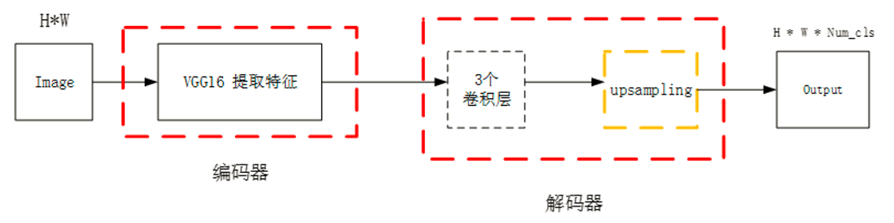

# 深度学习

## 题型

选择 10 判断 10 简答 4 综合 2

## 第一章 绪论

### 深度学习的定义

深度学习(Deep Learning)特指基于深层神经网络模型和方法的机器学习

### 简述人工智能、机器学习和深度学习之间的关系

人工智能（AI）是相对于人的智能而言的，通过用人工的方法和技术模仿、延申和扩展人的智能。

机器学习（ML）是人工智能的核心实现手段，通过**数据驱动模型自动学习规律**。

深度学习（DL）是机器学习的一个子领域，基于**多层神经网络**自动提取数据的高层特征。

总的来说机器学习是一种实现人工智能的方法，深度学习是一种实现机器学习的技术，三者是一种逐层包含的关系。

人工智能 > 机器学习 > 深度学习

### 主流深度学习框架

Pytorch、 Paddle Paddle、TensorFlow->keras、Caffe（工业级）、Theano、MXNet

### 以某一个具体工作案例，阐述深度学习的具体工作流程

**数据加载与预处理**：准备图像数据集，划分为训练集、验证集和测试集。接着对图像进行统一尺寸调整、归一化处理以及数据增强（如翻转、裁剪）以提升模型泛化能力。

**模型框架搭建**：根据任务需求构建神经网络模型，例如卷积神经网络（CNN）。模型通常包括卷积层、激活函数（如ReLU）、池化层和全连接层，最后使用Softmax输出分类结果。

**模型训练**： 在训练过程中，通过前向传播得到预测结果，计算损失函数（如交叉熵），然后进行反向传播更新模型参数。常用优化器包括SGD、Adam等，训练过程迭代多轮直到模型收敛。

**模型评估与测试**：训练完成后，使用测试集评估模型性能。主要指标包括准确率、精确率、召回率、F1值等。

### 补充

#### 机器学习的基本思路

1. 使用一定的算法解析训练数据
2. 学习数据中存在的一些特征 ，得到模型
3. 使用得到的模型对实际问题做出分类、决策或预测等


#### 深度学习与传统机器学习的区别

深度学习与传统机器学习最大的区别在于两者**提取特征**的方式不同。

1. **特征提取：**机器学习通常需要**人工提取数据中的特征**，而深度学习则可以**自动学习特征**，减少了人工参与的过程。
2. **模型复杂度：**机器学习通常使用的是传统的线性模型或非线性模型，比如决策树、支持向量机等。而深度学习则构建了多层神经网络，网络中的神经元之间存在大量的连接和权重，模型的复杂度更高。
3. **数据量：**机器学习通常需要大量的数据进行训练，而深度学习则更加注重数据的质量和多样性，通常需要**更大的数据集**才能获得更好的效果。
4. **训练速度和计算资源：**由于深度学习模型的复杂度更高，所以训练速度更慢，需要更多的计算资源，例如GPU等。

## 第二章 构建神经网络中的数学模块

### 张量


给你一个图像大小，批次数据，通道大小写出张量大小，注意各个维度前后位置（bs,c,w,h）输入到模型里面的张量形状

### 梯度下降

| 对比维度     | 批量梯度下降（BGD）                    | 随机梯度下降（SGD）          | 小批量梯度下降（Mini-batch GD）      |
| ------------ | -------------------------------------- | ---------------------------- | ------------------------------------ |
| **计算效率** | 每次更新使用全部样本，计算量大，训练慢 | 每次更新只用一个样本，计算快 | 每次使用一小批样本，兼顾效率与准确性 |
| **收敛速度** | 收敛平稳，但可能慢                     | 收敛快但不稳定，震荡大       | 收敛较快且较平稳，常用于实际训练     |
| **内存消耗** | 占用内存大，需要加载整个数据集         | 内存需求最小                 | 内存占用适中                         |
| **优点**     | 梯度方向精准，适合凸优化               | 每次迭代快，适合大数据流     | 训练速度快，稳定性强，兼顾两者优点   |
| **缺点**     | 对大数据集不适用，更新慢               | 收敛路径震荡，易陷入局部最优 | 需要调试 batch size，计算仍可能较大  |

## 第三章 构建神经网络

反向传播算法的**本质是**链式求导法则。

1. **神经网络的初始化。**初始化权重w和偏置b。
2. **前向传播。**根据给定的输入x、权重w和偏置b，使用前向传播算法计算得到预测值。
3. **计算损失函数。**选择合适的损失函数计算预测值与真实值的差距。
4. **反向传播。**通过反向传播算法求出权重和偏置的梯度，将权重和偏置沿梯度方向进行更新。
5. 重复步骤（2）～（4），直到达到迭代次数。

### 激活函数

**激活函数是什么**：激活函数是一个非线性函数。在M-P 神经元模型中，激活函数以阈值为界，一旦输入超过阈值，就激活输出，这样的函数称为“**阶跃函数**”。因此，可以说M-P神经元模型使用了阶跃函数作为激活函数。

**激活函数的作用**：激活函数的作用是**去线性化**。多层神经网络结点的计算是加权求和，再加上偏置项，是一个线性模型，将这个计算结果传给下一层的结点还是同样的线性模型。只通过线性变换，所有隐藏层的结点就无存在的意义。加入激活函数，就提供了一个非线性的变换方式，**大大提升了模型的表达能力**。


 

去线性 sigmoid ReLU(死亡区)->变体

### 过拟合/欠拟合

造成的原因 导致过拟合的常见原因是**构建的模型过于复杂**。

应对措施 正则化 dropout

**欠拟合**是指网络模型在训练集、验证集和测试集上表现均 不佳。

引起欠拟合的原因：网络模型复杂度过低或特征值过少等。

解决欠拟合问题的方法：可以通过增加网络模型复杂度或在网络模型中增加特征值。

**过拟合**是指网络模型在训练集上表现很好，但在验证集和测试集上表现却较差，即网络模型对训练集“死记硬背”记住了 ，不适用于测试集的性质或特点，没有理解数据背后的规律，导致其泛化能力差。

引起过拟合的原因：

1. 训练数据集样本单一，样本不足。

2. 训练数据中噪声干扰过大。过多的干扰会导致模型记录了很多噪声特征，忽略了真实输入和输出之间的关系。

3. 模型过于复杂。模型太复杂，虽然通过“死记硬背”记下了训练 数据集的信息，但是遇到没有见过的数据集时，不能够变通，泛化能力差。

解决方法：

1. **作权重正则化**：向网络损失函数中添加与较大权重值相关的成本，在损失函数中加入L₁ 正则项或L₂ 正则项，可对模型的复杂度进行惩罚

   - **L1**正则化：添加的成本与权重系数的绝对值(权重的L1范数)成正比。
   - **L2**正则化：添加的成本与权重系数的平方(权重的L2范数)成正比。神经网络的L2正则化也叫权重衰减。
2. **Dropout方法**：在每次训练模型时，按照一定的概率**随机去掉神经网络中指定层的神经元和与之相连接的权重**。这些被随机去掉的神经元和与之相连接的权重不参与模型的训练，只 更新留下的神经元相互连接的权重。
3. 通过调节机器模型的**容量**，可以控制模型是否偏于过拟合还是欠拟合

### 在`pytorch`中如何构建自己的神经网络

`__init__` 继承`nn.module` `forword` 前向传播 要重新写哪两个模块，如何把模型从CPU移到GPU上

```python
class MNISTNN(nn.Module):
 def __init__(self):
        super(MNISTNN, self).__init__()
        self.fc1 = nn.Linear(28*28, 128) # 第一层全连接层，输入特征为28*28，输出特征为128
        self.fc2 = nn.Linear(128, 10) # 第二层全连接层，输入特征为128，输出特征为10（对应10个类别）
        self.relu = nn.ReLU() # 使用ReLU激活函数
    def forward(self, x):
        x = x.view(x.size(0), -1) # 展平输入张量，以便可以输入到全连接层
        x = self.relu(self.fc1(x)) # 第一层全连接层后接ReLU激活函数
        x = self.fc2(x) # 第二层全连接层，输出最终的类别得分
  return x

device = torch.device("cuda" if torch.cuda.is_available() else "cpu")
model = MNISTNN().to(device)
criterion = nn.CrossEntropyLoss() # 使用交叉熵损失函数，适用于多分类问题
optimizer = optim.Adam(model.parameters(), lr=0.001) # 使用Adam优化器

epochs = 10
train_losses = []
for epoch in range(epochs):
    model.train()
    running_loss = 0.0
    for images, labels in train_loader:
        images, labels = images.to(device), labels.to(device)
        # 前向传播
        outputs = model(images)
        loss = criterion(outputs, labels)
        # 反向传播与优化
        optimizer.zero_grad()
        loss.backward()
        optimizer.step()
        running_loss += loss.item()
    epoch_loss = running_loss / len(train_loader)
    train_losses.append(epoch_loss)
    print(f"Epoch [{epoch+1}/{epochs}], Loss: {epoch_loss:.4f}")

```

## 第四章 卷积神经网络

### 卷积的作用、优势

**作用**：

1. 局部特征提取
2. 训练中进行参数学习
3. 每个卷积核提取特定模式的特征

**优势**：

1. **稀疏连接（局部感受野）：**每一个神经元不需要去感受全局图像，只需要感受局部的图像区域，减少参数量并捕捉局部特征
2. **参数共享：**同一卷积核在不同位置复用参数，一个卷积核提取一个特定的图像特征，想要得到图像的多个特征，只需要使用多个卷积核

### 卷积核输入输出通道数量变化、特征图尺寸变化


1. 卷积层的**输入通道数**视**输入图像而定**，如RGB 图的通道数为3，灰度图的通道数为1。

2. **卷积核的通道数**和**卷积层的输入通道数**相同。
3. **卷积层的输出通道数**需视**卷积核的数量**而定，而且卷积层的输出通道数就是下一层 卷积层的输入通道数。


- valid卷积（valid convolutions）：如果输入是n×n的图像，用一个f×f的卷积核卷积，那么得到的输出是（n-f+1）×（n-f+1）的特征图。
- same卷积（same convolutions）：填充后输出和输入图像的大小是相同的。如果输入是n×n的图像，当你填充p个像素点后，n就变成了n+2p。根据n+2p-f+1=n便可计算p的值。

所以最佳的填充方式是**同时使用VALID卷积和SAME卷积**，当输入过大时可以采用VALID卷积，想要挖掘更多特征时可以采用SAME卷积。

**不使用Padding的缺点**

- 经过卷积操作后图像会缩小。
- 如果你注意角落边的像素，则此像素点只会被卷积核触碰一次。即只会在第一次卷积操作时被卷积核扫描。这意味着会丢失图像边缘的很多信息。
- 但是对于原始图像中心的像素点，在每次卷积操作时都会被扫描。卷积核的感受野会扫描此位置多次。

### 池化层作用、输入输出特征图尺寸变化

1. 减少参数数量，提高计算效率
2. 提高**局部平移不变性**，大大提高了图像分类的准确性
3. 降低了数据维度，有效地避免了过拟合
4. 增强网络对输入图像中的小变形、扭曲、平移的鲁棒性

### 参数量计算（是否算偏置）


- **输入**：224x224x3（RGB图像）
- **卷积层**：3×3 卷积，输出通道64，含偏置。
- **计算**：*P*=(3×3×3+1)×64=28×64=1792 个参数

### 全连接层的作用

1.特征提取到分类的桥梁，在整个卷积神经网络中起到分类器的作用

2.用于输出结果

### 经典神经网络核心思想

LeNet：

AlexNet:

1. 提出了一种卷积层加全连接层的卷积神经网络结构

2. 首次使用ReLU函数作为神经网络的激活函数，并验证ReLU效果在较深的网络超过了Sigmoid，通过使用ReLU解决了Sigmoid在网络较深时的梯度弥散问题。

3. 首次提出 Dropout 来解决过拟合的问题

4. 加入动量的小批量梯度下降算法加速训练过程的收敛

5. 局部响应归一化(Norm)

6. 对局部神经元的活动创建竞争机制

7. 响应比较大的值变得相对大

8. 增强模型的泛化能力

9. 数据增强策略极大地抑制了训练中的过拟合

10. AlexNet 在 GPU 上进行了分布式训练，将不同的卷积层分配到两个 GPU 上，从而加速了计算

    - **优势：**AlexNet通过加深网络层数和增加神经元数量，提高了模型的表现力。使用GPU进行加速计算，使得大规模数据集上的训练成为可能。Dropout、重叠池化和数据增强等技术有效地降低了过拟合风险。
    - **局限性：**AlexNet参数数量较多，导致计算资源需求较大。在深度增加的同时，过大的全连接层会导致大量参数和计算。LRN 归一化的效果有限，现代模型往往使用批归一化（Batch Normalization）来取代
    - **AlexNet**的影响：VGGNet、GoogLeNet和 ResNet等网络都在AlexNet的基础上进行了改进和扩展。

**VGG：**

所有网络结构都包含5组卷积操作，每组卷积包含一定数量的卷积层——可以看作一个五阶段的卷积特征提取。

**VGG**模型中所有的卷积核大小均为3×3，使用3×3的小卷积核堆叠代替大卷积核，主要有以下几个原因：

1. 3x3是最小的能够捕获像素**八邻域信息**的尺寸；
2. 两个3x3的堆叠卷积层的有限感受野是5x5；三个3x3的堆叠卷积层的感受野是7x7，故可以通过小尺寸卷积层的堆叠替代大尺寸卷积层，并且感受野大小不变。所以可以把三个3x3的filter看成是一个**7x7filter**的分解中间层有非线性的分解, 并且起到隐式正则化的作用；
3. 多个3x3的卷积层比一个大尺寸卷积层有**更多的非线性**（更多层的非线性函数，使用了3个非线性激活函数），使得判决函数更加具有判决性；
4. 多个3x3的卷积层比一个大尺寸的filter有更少的参数，假设卷积层的输入和输出的特征图大小相同为C，那么三个3x3的卷积层参数个数$3*((3*3*C)*C)=27C²$；一个$（7*7*C）* C$的卷积层参数为49C²。前者可以表达出输入数据中更多个强力特征，使用的参数也更少。

**ResNet：**残差连接、梯度消失、加深网络

**随着卷积层和池化层的叠加，不但没有出现学习效果越来越好的情况，反而越来越差**

1. 梯度爆炸、梯度消失：随着梯度反向传播回前面的网络层，重复的乘积操作会使得梯度变得非常大/小；---> Batch Normalization
2. 退化问题：给网络叠加更多的层后，性能却快速下降的情况。--->残差结构（**这个做法相当于把前面的信息提取出来，加入到当前的计算中**）


MobileNet：轻量化、**深度可分离卷积**->减少参数量

​  **CNN**越来越复杂，计算成本高，限制了移动设备的部署。

1. 为什么 **MobileNet** **选择缩减网络宽度而不是减少层数？**

   在相似的计算量和参数量下，更窄的模型比更浅的模型性能更好。

2. 为什么选择深度可分离卷积？

   深度可分离卷积将标准卷积的计算从**同时处理空间和通道，拆分为分开处理**。它是一种近似方法，并不是严格等价于标准卷积。但这种方式大幅减少了计算量，同时对模型的准确度影响较小，适合资源受限的环境。把标准的卷积分为两个步骤，一个是深度卷积(Depthwise Convolution)，另一个是逐点卷积(Pointwise Convolution)

   

3. 宽度乘数和分辨率乘数是如何影响模型性能的？

   宽度乘子α控制模型中通道数量的缩放，α越小，通道数越少，模型越小。分辨率乘子ρ控制输入图像和内部特征图的尺寸，ρ越小，分辨率越低，计算量越小。通过调整，可以在模型大小、计算量和准确度之间进行权衡。两者都会导致一定程度的精度损失，但通常情况下，这种损失是可以接受的。

## 第五章 孪生神经网络

### 基本思想、基本架构

**孪生网络的基本思想**是将输入数据同时输入到两个**完全相同的神经网络中**，这两个网络**共享相同的权重和参数**。通过学习输入数据在这两个网络中的表示，孪生网络可以计算出两个输入样本之间的**相似度**。

**处理过程如下：**将两个输入样本通过各自的神经网络得到两个表示向量。使用一种度量方法（例如欧氏距离、余弦相似度等）计算这两个向量之间的相似度得分。根据相似度得分进行分类或回归等操作。

1. 输入对：对比损失需要一对正负训练数据。 正对包含两个正样本，负对包含一个正样本和一个负样本。这些对通常在训练过程中生成，正样本对表示相似的实例，负样本对表示不相似的实例。
2. 嵌入：孪生网络通过共享网络处理每个输入样本，为配对中的两个样本生成嵌入向量。这些嵌入是捕捉输入样本关键特征的固定长度表示。
3. 距离度量：使用距离度量，如欧氏距离或余弦相似度，来衡量生成的嵌入之间的不相似性或相似性。距离度量的选择取决于输入数据的性质和任务的具体要求。
4. 对比损失计算：对比损失函数计算每对嵌入的损失，鼓励相似对的距离更小，不相似对的距离更大


**孪生神经网络的工作模式**2：不输出任何内容，但对特征空间或嵌入学习过程进行了优化，优化之后，使得同一类图像的特征之间的距离更近，不同类图像的特征之间的距离更远

**孪生网络的主要特点**

1. Siamese网络采用两个**不同的输入**，通过**两个具有相同架构、参数和权重的相似子网络**。

2. 这两个子网络互为镜像，就像连体双胞胎一样。因此，对任何子网架构、参数或权重的任何更改也适用于其他子网。

3. 两个子网络输出一个编码来计算两个输入之间的差异。

4. Siamese网络的目标是使用相似度分数对两个输入是相同还是不同进行分类。可以使用二元交叉熵、对比函数或三元组损失来计算相似度分数，这些都是用于一般距离度量学习方法的技术。

5. Siamese网络是一种one-shot分类器，它使用判别特征从未知分布中概括不熟悉的类别。


**CNN**网络可以是VGG、ResNet**等卷积神经网络，也可以是循环神经网络**

**孪生网络的架构通常由三个主要组件组成：共享网络、相似性度量以及对比损失函数**

**共享网络：**

共享网络是孪生架构的核心组件。它负责从输入样本中提取有意义的特征表示。共享网络包括一系列神经单元层，如卷积层或全连接层，用于处理输入数据并生成固定长度的嵌入向量。通过在孪生网络之间共享相同的权重，模型学会为相似的输入提取类似的特征，从而实现有效的比较。

**对比损失函数**

为了训练孪生网络，采用对比损失函数。对比损失函数**鼓励网络为相似的输入生成类似的嵌入，对不相似的输入生成不相似的嵌入**。当相似对之间的距离或不相似对之间的距离超过一定阈值时，或者当不相似对之间的距离低于另一个阈值时，它会惩罚模型。对比损失函数的确切公式取决于选择的相似性度量以及相似和不相似对之间所需的间隔。

对比损失是孪生网络中常用的损失函数，用于学习一对输入样本之间的相似性或不相似性。它旨在优化网络的参数，使得相似的输入在特征空间中的嵌入更加接近，而不相似的输入则被推得更远。通过最小化对比损失，网络学会生成能够有效捕捉输入数据相似性结构的嵌入。

**Triplet Loss**：使得**相同标签的特征在空间位置上尽量靠近**，**同时不同标签的特征在空间位置上尽量远离**，同时为了不让样本的特征聚合到一个非常小的空间中要求对于同一类的两个正例和一个负例，负例应该比正例的距离至少远margin。


**孪生网络的优点是：**

1. 对类别不平衡的鲁棒性：由于一次性学习，同一类别的少量图像（训练数据很少）足以让孪生网络在未来对这些图像进行分类。
2. 与其中一种分类器算法集成：由于其学习机制与分类算法不同，将孪生网络与分类器集成可以比平均两个相关的监督模型（例如 GBM 和 RF 分类器算法）做得更好。
3. 语义相似性：经过训练的孪生网络专注于学习将相同类别放在一起的嵌入（在深度神经网络中）。因此，可以学习语义相似性。

**孪生网络的缺点或弊端是：**

1. 比传统的神经网络架构和机器学习算法需要更多的训练时间：孪生网络涉及二次对进行学习，这比传统的机器学习类型要慢，但神经网络的学习速度比孪生网络快。
2. 不输出概率：由于孪生网络的训练涉及成对学习，它不会输出预测的概率，而是输出与每个类的距离（使用欧几里得距离等距离公式），介于 0 到 1 之间。

### 相似性度量方法

 一旦输入样本经过共享网络处理，就会使用相似性度量来比较生成的嵌入，并衡量两个输入之间的相似性或不相似性。相似性度量的选择取决于特定的任务和输入数据的性质。常见的相似性度量**包括欧氏距离、余弦相似度或相关系数**。相似性度量量化了嵌入之间的距离或相关性，并提供了输入样本之间相似性的度量。


**欧式距离**：欧氏距离是最易于理解的一种距离计算方法，源自欧氏空间中两点间的距离公式


**余弦距离**：该指标广泛用于文本挖掘、自然语言处理和信息检索系统。 例如，它可以用来衡量两个给定文档之间的相似性。 它还可用于根据消息的长度识别垃圾邮件或非垃圾邮件。**不能将余弦相似度的值解释为百分比**。例如，值0.894并不意味着文档A与B相似度为89.4%。它意味着文档A和B非常相似，但不知道有多少百分比！ 该值没有阈值。

**皮尔逊相关距离**：相关距离量化两个属性之间线性、单调关系的强度。 此外，它使用**协方差**值作为初始计算步骤。 然而，协方差本身很难解释，并且不能显示数据与代表测量之间趋势的线的接近或远离程度。

*孪生网络如何通过对比损失（Contrastive Loss）实现相似性度量？*

对比损失用于学习一对输入样本之间的**相似性或不相似性**。它旨在优化网络的参数，使得**相似的输入在特征空间中的嵌入更加接近，而不相似的输入则被推得更远**。通过最小化对比损失，网络学会生成能够有效捕捉输入数据相似性结构的嵌入。

### 真孪生、伪孪生

真孪生：

1. 设计一个卷积神经网络用于提取图像特征。
2. 每次将两张图片输入到同一个神经网络，得到一个特征向量。
3. 将这两个特征向量相减得到一个新的向量。
4. 将相减（拼接、叠放等）得到的新的向量输入到一个全连接层得到一个标量。
5. 用sigmoid函数将结果映射到0或1。如果两张图片是同一个类别输出应该接近 1，不同类输出接近 0。

基于训练集，要构造正样本（Positive Samples）和负样本（Negative Samples）。正样本可以告诉神经网络哪些事物是同一类，负样本可以告诉神经网络事物之间的区别。给正样本打上标签1表示同一类，负样本打上标签0表示不同类。

**真伪孪生网络差别就在于是否共享权重。**

**不同应用：**

**孪生神经网络用于处理两个输入“比较类似” 的情况。**

**伪孪生神经网络适用于处理两个输入“有一定差别” 的情况。**

## 第六章 蒸馏学习 核心考点

如何用在下游任务

### 定义、架构、基本思想

教师模型、学生模型

**蒸馏技术**（Knowledge Distillation）是一种模型**压缩**方法，旨在将大型、复杂的模型（教师模型）的知识转移到小型、高效的模型（学生模型）中。其核心思想是通过模仿教师模型的输出，使学生模型在保持较高性能的同时，显著减少计算资源和存储需求。

让大模型教小模型一些基本的解题思路，让学生和老师一样思考问题。教授会100种解题思路，挑两三种不错的教给小学生，让小学生照葫芦画瓢。

架构：**由一个多层的教师模型和学生模型组成，教师模型主要负责向学生模型传递知识。**


**蒸馏技术的核心是通过教师模型的“软标签”（Soft Labels）来指导学生模型的学习。与传统的“硬标签”（Hard Labels，即one-hot编码的标签）相比，软标签包含了更多的信息（如类别之间的概率分布）。**

**核心思想：**教师模型通常是一个规模较大、性能较好但计算成本高的模型，它在训练过程中**学习到了大量关于数据的知识，包括数据的分布、特征之间的关系等**。知识蒸馏的目的就是让学生模型学习教师模型的这些知识，而不仅仅是学习训练数据中的标签信息。

**实现方式：**在知识蒸馏过程中，**将教师模型的输出（软标签等）作为额外的监督信息来指导学生模型的训练**。学生模型通过**最小化与教师模型输出之间的差异**，以及**与真实标签之间的差异**（通常使用交叉熵等损失函数）来进行学习，从而使学生模型能够模仿教师模型的行为，获取教师模型中的知识。

**核心概念：**

- **教师模型：**一个预训练好的复杂模型，通常性能较强。
- **学生模型：**一个较小的模型，目标是模仿教师模型的行为。

- **软标签：**教师模型输出的概率分布（通过Softmax函数计算）。

- **温度参数（Temperature**）：用于调整Softmax输出的平滑程度，温度越高，分布越平滑。
- **知识蒸馏：**将复杂模型的知识传递给简化模型。

- **交叉熵损失：**衡量学生模型与教师模型之间的差异。

**小模型在学习的时候，并不会完全照搬老师的思路。它会结合自己原有数据集中的硬标签（猫就是猫、狗就是狗），再参考老师的答案，最终给出自己的判断。**

**蒸馏算法的核心步骤如下：**重复下面三个步骤

1. **把同一批训练样本分别输入到学生模型和教师模型；**
2. **根据硬标签和软标签，对比结果，结合权重，得到学生模型最终的损失值；**
3. **对学生模型进行参数更新，以得到更小的损失值。**

### 软标签、硬标签

定义、区别

**硬标签：**硬标签是数据的真实标签，通常采用 one-hot 编码方式，对于一个K类分类问题，硬标签在正确类别上为1，其余类别为0。只提供了样本属于某一类别的信息，**未反映类别间的相似性和不确定性**。

**软标签：**软标签是**教师模型对输入样本的预测概率分布**。在所有类别上都给出了非零概率，反映了教师模型**对各类别的信心程度**。包含了**类别间的相似性**、**数据分布**以及**模型的不确定性**等丰富信息。

**软标签的优势**

1. **提供了更多的学习信号**。硬标签信息熵为0，不包含不确定性，软标签信息熵大于0，包含了不确定性和类别间关系。
2. **平滑标签，防止过拟合**。硬标签因为是one-hot编码，正确类别的梯度很大，容易导致模型过拟合。
3. **软标签可以捕获类别间的相似性**。
4. 软标签有**正则化**的效果。
5. **提供不确定性**。


### 损失

用“**蒸馏损失**”来衡量学生模型与教师模型输出结果的差异。用“**真实监督损失**”来衡量学生模型对基本是非问题的判断。然后，再设定一个**平衡系数**（α）来调节这两种损失，达到一个最优效果。两种损失组成


软标签损失（KL散度）：衡量学生模型与教师模型输出概率分布的一致性。


其 中 T 是温度，z_s 和 z_t 分别是学生模型和教师模型的 logits

硬标签损失（交叉熵）：衡量学生模型与真实标签的匹配程度。

 

其中 y_i 是真实标签的分布，y_hat_i是学生模型的预测概率分布。


**带温度参数对知识蒸馏的影响**

1. **软目标的平滑性**：温度参数T调节了教师模型的软目标  的平滑性，高温度下的软目标包含了更多类别间的关系信息，提供了更丰富的学习信号。低温度下的软目标接近于硬标签，类别间的概率差异明显，信息量较少。
2. **模型学习的焦点**：高温度下，学生模型更关注类别间的**相对关系**，学习更广泛的特征。低温度下，学生模型更关注**正确类别**，可能忽略了其他类别的信息。
3. **梯度的尺度和稳定性**：温度参数影响了损失函数对学生模型参数的梯度。

**优点：**

1. **模型轻量化与高效部署**：学生模型参数量和计算量显著减少，适合部署在**资源受限**的环境（如移动设备、嵌入式系统），降低推理延迟和存储成本。
2. **提升小模型的泛化能力**：学生模型通过模仿教师模型的“软标签”（概率分布），**学习更丰富的类别间关系**，可能比直接训练小模型效果更好，缓解过拟合。
3. **训练效率优化**：学生模型可借助教师模型的预训练知识**加速收敛**，减少对大规模标注数据的依赖。
4. **灵活的应用场景**：支持跨模型结构、跨任务的知识迁移，也可用于融合多个教师模型的知识（多教师蒸馏）。
5. **潜在的性能超越**：在特定情况下（如教师模型过参数化或存在噪声），学生模型可能通过蒸馏剔除冗余信息，表现优于教师模型。

**缺点：**

1. **依赖教师模型的质量**：若教师模型存在偏差、噪声或欠拟合，学生模型会继承其缺陷，甚至表现更差。
2. **训练复杂度增加**：需设计合理的损失函数（如软标签损失、特征对齐损失），调整温度参数等超参数，调优难度较高。
3. **性能上限受限**：学生模型的理论性能通常不高于教师模型，尤其在教师模型本身不够强大时，提升空间有限。
4. **额外训练成本**：需预先训练高质量的教师模型，且蒸馏过程可能消耗额外计算资源（尽管学生模型推理成本低）。
5. **知识迁移的局限性**：某些复杂知识（如深层特征关系）可能难以被学生模型完全捕获，尤其在模型结构差异较大时

*蒸馏学习的基本步骤是什么？为什么它能压缩模型？*

**核心步骤如下：**

1) 把同一批训练样本分别输入到学生模型和教师模型；
2) 根据硬标签和软标签，对比结果，结合权重，得到学生模型最终的损失值；
3) 对学生模型进行参数更新，以得到更小的损失值。

**压缩原理：**蒸馏技术的核心是通过教师模型的“软标签”（Soft Labels）来指导学生模型的学习。与传统的“硬标签”相比，软标签包含了更多的信息（如类别之间的概率分布）。

## 第七章 目标检测

### 两阶段

比单阶段多了什么、代表算法

两阶段比单阶段**多了一个“候选框生成”步骤**，提高了检测精度，但也增加了计算复杂度。

#### R-CNN、Fast R-CNN、Faster R-CNN

1. R-CNN 首次将 CNN 引入目标检测，先用 Selective Search 生成候选框，**对每个区域单独提取特征**并用 SVM 分类，准确但速度慢、非端到端。
2. Fast R-CNN **对整张图提一次特征**，候选框在特征图上**用 RoI Pooling 提取**，统一用全连接层分类与回归，显著提升速度，实现端到端训练。但仍依赖 Selective Search。
   - 解决问题：
   - 每个候选区域都要单独跑一次 CNN，计算量大
   - 三阶段训练（CNN+SVM+回归器）不端到端，效率低、复杂度高
3. Faster R-CNN 引入**区域建议网络（RPN）代替 Selective Search**，**候选框生成也在网络中完成**，与主干网络共享特征，训练与预测全面**端到端**，效率与精度兼顾，是两阶段检测的代表模型。
   - 解决问题
   - 候选区域提取方法耗时较长
   - 没有真正实现end-to-end训练测试

- **R-CNN**： Selective Search → CNN → SVM/回归
- **Fast R-CNN**： Selective Search → 共享CNN → RoI Pooling → Softmax/回归
- **Faster R-CNN**：共享CNN → RPN → RoI Pooling → Softmax/回归

#### RCNN

RCNN的创新之处在于将（==第一个==）**深度学习引入目标检测的各个阶段**。通过**使用CNN提取特征**，RCNN能够**学习到更具有判别性的特征表示**，从而提高了目标检测的准确性。此外，RCNN还引入了**候选区域的生成机制**，避免了对整个图像进行密集的滑动窗口搜索，从而大大提高了算法的效率。

**核心思想**：是将目标检测问题转化为一系列的**候选区域**（region proposal）的分类问题。首先，它使用一个基于**选择性搜索**（Selective Search）的方法生成一组**可能包含目标的候选区域**。然后，对每个候选区域，RCNN通过在该区域上进行前向传播来**提取固定长度的特征向量**。这些特征向量随后被输入到一个**独立的SVM分类器**中，以判**断该区域是否包含目标**，同时还有一个**边界框回归器**用于精确定位目标的位置。

**RCNN算法分为4个步骤:**

1. 获取候选区域：对于一张输入的图像，首先使用selective search算法获取2000个左右的候选区域，由于selective search生成的候选区域是大小不一致的区域，而后续的卷积神经网络中的全连接层需要保证固定大小的输入，因此在输入卷积网络之后将其缩放至固定大小的图像；
2. 获取图像特征：将图像输入到卷积神经网络中获取图像特征，这一部分可以采用常用的图像卷积神经网络如VGGNet，AlexNet等。
3. 获取区域类别：在初步获得目标的位置之后，需要获取目标的类别，这一步采用SVM分类器来判断当前区域属于哪个类别。非极大值抑制剔除重叠建议框。
4. 微调区域位置：尽管候选区域已经初步目标的位置，但是这个区域比较粗糙，因此使用回归器对区域位置进行微调


1. **R-CNN相比传统目标检测的创新点主要有以下几个方面：**
   引入深度学习：RCNN首次将深度学习应用于目标检测领域。传统目标检测方法通常使用手工设计的特征和传统的机器学习算法，如SVM和随机森林。而RCNN使用卷积神经网络（CNN）来提取图像特征，能够自动学习更具判别性的特征表示，从而提高了目标检测的准确性。
2. 候选区域的生成：RCNN引入了选择性搜索（Selective Search）算法来生成候选区域。传统方法通常采用滑动窗口的方式对整个图像进行密集的搜索，计算量较大。RCNN通过选择性搜索算法，能够快速生成大量可能包含目标的候选区域，减少了计算开销。
3. 区域级别的分类与定位：RCNN将目标检测问题转化为对候选区域的分类问题。对于每个候选区域，RCNN使用CNN提取其特征表示，并通过独立的支持向量机（SVM）分类器进行目标的分类判断。此外，RCNN还引入了边界框回归器，能够精确定位目标的位置。
4. 端到端的训练：RCNN采用端到端的训练方式，可以同时学习特征提取和目标分类器的参数。这使得RCNN能够端到端地优化整个目标检测系统，提高了检测性能。

**R-CNN的优点主要有以下几个方面：**

1. 准确性：RCNN在目标检测任务中表现出很高的准确性。通过使用深度学习模型（卷积神经网络）提取图像特征，RCNN能够学习到更具判别性的特征表示，从而提高了目标检测的准确性。
2. 候选区域生成：RCNN采用选择性搜索（Selective Search）算法来生成候选区域。相比传统方法的密集滑动窗口搜索，选择性搜索能够快速生成大量可能包含目标的候选区域，减少了计算开销。
3. 端到端训练：RCNN采用端到端的训练方式，能够同时学习特征提取和目标分类器的参数。这使得RCNN能够端到端地优化整个目标检测系统，提高了检测性能。
4. 可扩展性：RCNN框架具有良好的可扩展性，可以方便地应用于不同的目标检测任务和数据集。通过改变网络结构和训练数据，RCNN可以适应不同的目标类别和场景。

**R-CNN的缺点主要有以下几个方面：**

1. 低速：RCNN算法的一个主要缺点是计算速度较慢。在目标检测过程中，需要为每个候选区域进行特征提取和分类，这导致了大量的计算量和时间消耗。
2. 复杂性：RCNN算法的实现相对复杂。它包含了多个组件，包括候选区域生成、特征提取、分类器训练等。这使得算法的实现和调优相对困难。
3. 内存消耗大：RCNN算法需要在内存中存储大量的候选区域和特征表示，导致内存消耗较大。
4. 训练时间长：由于RCNN的复杂性和计算需求，训练RCNN模型需要大量的时间和计算资源。

#### Fast RCNN

**相比R-CNN最大的区别，在于RoI池化层和全连接层中目标分类与检测框回归微调的统一。**

与R-CNN一样，利用Selective Search算法通过图像分割的方法得到一些原始区域，然后使用一些合并策略将这些区域合并，得到一个层次化的区域结构，而这些结构就包含着可能需要的物体。但是，Fast R-CNN与R-CNN不同的是，这些生成出来的候选区域**不需要每一个都丢到卷积神经网络里面提取特征，而且只需要在特征图上映射便可**。

1. **Fast R-CNN将整张图片和一组建议框**（object proposals）作为输入，通过几个卷积层和最大池化层处理整张图像，得到卷积特征图（conv feature map）

2. 对于每个建议框，通过**RoI pooling layer** ，为每个object proposal来提取在feature map上对应的特征，并使得输出都具有相同size的特征图。

#### Faster RCNN

在Faster R-CNN中提出了区域生成网络(Region Proposal Network, RPN)，**将候选区域的提取和Fast R-CNN中的目标检测网络**融合到一起，这样可以在同一个网络中实现目标检测。Faster R-CNN主要是解决Fast R-CNN存在的问题：

1. 候选区域提取方法耗时较长
2. 没有真正实现end-to-end训练测试

**RPN**：RPN 是 Faster R-CNN 中生成候选框的子网络，利用共享特征图，通过滑动窗口和 Anchor 机制预测每个位置的目标概率和边框偏移，最后用 NMS 筛选出高质量候选框。

### 单阶段

代表算法

Yolo意思是You Only Look Once，它并没有真正的去掉候选区域，而是创造性的将候选区和目标分类合二为一，看一眼图片就能知道有哪些对象以及它们的位置。

Yolo模型采用**预定义预测区域**的方法来完成目标检测，具体而言是将原始图像划分为 7x7=49 个网格（grid），每个网格允许预测出2个边框（bounding box，包含某个对象的矩形框），总共 49x2=98 个bounding box。

### 对比

两阶段目标检测（如Faster R-CNN）相比单阶段目标检测（如YOLO、SSD）**多了一个独立的候选框生成和优化阶段**，这使得它在精度上通常更优，但速度较慢。以下是具体多出的部分及其作用：

| **特性** | **两阶段（Faster R-CNN）** | **单阶段（YOLO/SSD）** |
| :------: | :------------------------: | :--------------------: |
| **流程** | 先生成候选框，再分类和回归 |  直接预测类别和框坐标  |

*单阶段检测算法（如YOLO系列）与两阶段检测算法（如Faster R-CNN）在速度和精度上的差异主要来源于哪些设计差异？请结合网络结构、目标定位策略和训练方法进行对比。*

1. **网络结构**
   1. 单阶段：直接通过密集预测（如网格划分）生成类别和边界框，结构简单。
   2. 两阶段：首先生成候选区域（RPN），再对候选框精细分类和回归，结构更复杂。
2. **目标定位策略**
   1. 单阶段：直接回归边界框，依赖预设锚框或关键点，易漏检小目标。
   2. 两阶段：通过RPN筛选高质量候选框，再二次修正，定位更准，但计算量大。
3. **训练方法**
   1. 单阶段：端到端训练，速度优先。
   2. 两阶段：分阶段训练（RPN+检测头），样本更均衡，精度优先但速度慢。

### 第八章 图像分割

### 语义、全景、实例分割的区别

- **语义分割**：只需知道“是什么”，不关心个体差异（如分割天空、草地）。
- **实例分割**：需区分同类物体的不同实例（如统计人群中的每个人）。
- **全景分割**：需**完整描述**场景中的所有对象和背景（如自动驾驶中的道路+车辆+行人）。并区分可数对象（如人、车）的实例。


下面两个的主要思想

### FCN

1. **全卷积化(Fully Convolutional)：**用于解决逐像素(pixel-wise)的预测问题。通过将基础网络(例如VGG)最后面几个全连接层换成卷积层，可实现任意大小的图像输入，并且输出图像大小与输入相对应；
2. **反卷积(deconvolution) ：**上采样操作，用于恢复图片尺寸，方便后续进行逐像素预测;
3. **跳跃结构(skip architecture)：**用于融合高低层特征信息。通过跨层连接的结构，结合了网络浅层的细(fine-grain)粒度信息信息以及深层的粗糙(coarse)信息，以实现精准的分割任务。

传统的卷积神经网络通常由卷积层、池化层和全连接层组成。全连接层将特征映射为固定长度的向量，用于图像级别的分类。然而，**全连接层丢失了空间位置信息，不适合像素级的预测任务**。

**全卷积网络（FCN） 是指完全由卷积层和池化层组成的网络，取消了全连接层**。这样，网络可以接受任意尺寸的输入图像，并输出对应尺寸的预测结果，即每个像素的类别。这使得FCN非常适合语义分割任务。


FCN是一种**编码-解码结构**的网络。**提取特征的过程称为编码器**，将后面进行**卷积和上采样的过程称为解码器**。图片在解码器中经过上采样恢复了原图大小。它完全改变了之前需要一个窗口来将语义分割任务转变为图片分类任务的观念，FCN完全丢弃了图片分类任务中全连接层，从头到尾都只使用到了卷积层。




### U-NET

U-Net 的设计灵感来源于经典的全卷积网络（FCN），通过引入**跳跃连接**（skip connections）和**对称的编码器-解码器结构**，可以显著提升模型在小样本数据集上的性能。

从下图中我们可以看到，U-Net 的架构呈”U”形，由三部分组成：左侧的编码器（Encoder）和右侧的解码器（Decoder），还有中间灰色的跳跃连接（Skip Connections）。

1. **编码器**：主要任务是逐渐压缩输入图像的空间分辨率，提取更高层次的特征。这个部分包含一系列卷积层和最大池化层（max pooling），每次池化操作都会将图像的空间维度减少一半（通道翻倍）。
2. **解码器**：通过逐渐恢复图像的空间分辨率，将编码器部分提取到的高层次特征映射回原始的图像分辨率。解码器包含反卷积（上采样）操作，并结合来自编码器的相应特征层，以实现精细的边界恢复。
3. **跳跃连接是** **U-Net** **的一个关键创新点。**
   - **每个编码器层的输出特征图与解码器中对应层的特征图进行拼接，形成跳跃连接。**
   - **这样可以将编码器中的局部信息和解码器中的全局信息进行融合，从而提高分割结果的精度。**


输出层是一个1×1卷积层，不改变图像尺寸，只改变输出通道数为2。

**U-net**的两个限制：

1. 最佳的深度是在先验上未知的，需要广泛的架构搜索或不同深度模型的低效率集成来测试

2. 跳接施加了不必要的限制性融合方案，仅在编码器和解码器子网的相同比例的特征图上强制融合。

**基于深度学习的语义分割的难点和挑战：**

1. **数据标注问题‌：**图像语义分割需要精确到像素级的标注，包括每一个目标的轮廓等信息。这种高精度的标注工作非常耗时且成本高昂，导致标注数据稀缺，影响了模型的训练效果‌。
2. **计算资源问题‌：**为了获得较高的分割精度，通常需要使用更深的网络和更复杂的计算，这对计算资源的要求很高。虽然有一些轻量级网络，但总体精度较低‌。
3. **上下文信息利用‌：**在语义分割中，上下文信息非常重要。缺乏足够的上下文信息会导致目标被错误地分割成多个部分，或者不同类别的目标被错误地分类为同一类别‌。
4. **物体层次挑战‌：**同一物体在不同光照、视角和距离下会表现出很大的变化，非刚性物体的形变以及物体之间的相互遮挡都会增加分割的难度‌。
5. **类别层次挑战‌：**类内物体的相异性和类间物体的相似性使得准确区分不同类别变得困难‌。
6. **背景复杂性‌：**实际场景中的背景往往复杂多变，这增加了语义分割的难度‌。
7. **细小类别分割‌：**对于细小的类别，由于其轮廓较小，难以精确地定位和分割‌。

## 第九章 序列模型

输入输出

### RNN

**RNN**是一类**扩展**的人工神经网络，它是为了对序列数据进行建模而产生的。

**样本间存在顺序关系，每个样本和它之前的样本存在关联。通过神经网络在时序上的展开，我们能够找到样本之间的序列相关性。**


### LSTM

在实际运用中，往往会出现“梯度消失”的现象。这会导致RNN在实际上**只能学习到短期的依赖关系**，对于长距离的依赖关系，传统的RNN是难以进行学习的，这样的问题称为长期依赖问题。

长短期记忆网络是RNN的一种变体，以改变传播结构来**解决长期依赖问题**。区别于传统的RNN使用链式法则使得梯度连乘最终导致梯度消失，**LSTM将梯度变为累加的形式，从而避免类似问题的发生**。LSTM的关键就是**细胞状态**，LSTM中的一系列操作都是为了**更新细胞状态**，这个细胞状态将贯穿于整个LSTM的结构。

LSTM中的“门”是一种“软门”，它的取值范围在(0,1)之间，表示以一定的比例允许信息通过。这里的一个“门”是由sigmoid函数和一个乘法操作组成。

LSTM中的三个“门”分别是：

1. **遗忘门：**决定上个时刻的细胞状态中有多少信息要被遗忘；
2. **输入门：**决定这个时刻的输入中有多少信息要被更新到细胞状态中；
3. **输出门**：决定当前时刻的细胞状态中有多少信息要被输出。


**遗忘门结构**将读取前一时刻的外部状态$h_{t-1}$和当前时刻的输入$x_t$，通过sigmoid函数的处理后，输出一个在0到1之间的数值$f_t$，将该数值用于控制上个时刻的细胞状态$C_{t-1}$的遗忘程度，“1”表示完全“保留”，“0”表示完全“舍弃”。


**输入门**需要使用tanh函数创建一个新的候选值向量$C ̃_t$作为候选状态。并且需要继续使用sigmoid函数对上个时刻的外部状态$h_{t-1}$和当前时刻的输入$x_t$进行处理，产生一个在0到1之间的输出$i_t$，表示当前时刻的候选状态 $C ̃_t$有多少信息需要被保存。


**状态更新：**当上述步骤完成后，就能对细胞状态进行更新了。我们用通过遗忘门得到的输出$f_t$乘以上个时刻的细胞状态$C_{t-1}$，丢弃掉我们确定需要丢弃的信息。之后加上$i_t$×$C^~ _t$，这是当前时刻的输入$x_t$将被保存到细胞状态中的部分，最终得到的$C_t$就是当前时刻的细胞状态。


**输出门** 得到当前时刻的细胞状态之后，我们就能确定当前时刻的输出$h_t$了。首先使用sigmoid函数对前一时刻的外部状态$h_{t-1}$和当前时刻的输入$x_t$进行处理。之后使用tanh函数对当前时刻的细胞状态$C_t$进行处理，并且与sigmoid函数得到的结果相乘，即可得到输出$h_t$。


### GRU

GRU在LSTM的基础上主要做了两个改进：

1. 将细胞状态和外部状态（输出）合并为一个状态h。

2. 将输入门和遗忘门合并成更新门z_t，在更新状态h时使用重置门r_t控制候选状态h ̃_t是否依赖于上个时刻的状态h_(t-1)

   

**更新门**帮助模型决定到底要将多少过去的信息传递到未来，或到底**前一时间步和当前时间步的信息有多少是需要继续传递的**。模型能决定从过去复制所有的信息以减少梯度消失的风险。


**重置门主要决定了到底有多少过去的信息需要遗忘**，可以使用以下表达式计算：


**该表达式与更新门的表达式是一样的，只不过线性变换的参数和用处不一样而已。**

**更新门和重置门如何发挥作用？**

重置门对过去t个时间步的序列信息（Ht-1）进行选择，更新门对当前一个时间步的序列信息（Xt）进行选择。


隐藏状态Ht：

因为Zt是一个[0,1] 之间的量，如果Zt全为0，则当前隐藏状态Ht为当前候选隐藏状态，该候选隐藏状态不仅保留了之前的序列信息，还保留了当前时间步batch的序列信息；如果Zt全为1，则当前隐藏状态Ht为上一个时间步的隐藏状态。

综上，**更新门的作用是决定当前一个时间步的序列信息是否保留**，如果Zt全为0，则说明当前时间步token的序列信息是有用的（候选隐藏状态包含之前的序列信息和当前一个时间步的序列信息），保留下来加入到隐藏状态Ht中；如果Zt全为1，则说明当前时间步batch的序列信息是没有用的，丢弃当前token的序列信息，直接使用上一个时间步的隐藏状态Ht-1作为当前的隐藏状态Ht。（Ht-1仅包含之前的序列信息，不包含当前一个时间步的序列信息）。


**优势**

1. **缓解梯度消失**/**爆炸问题**：通过门控机制，GRU能够更好地控制信息的流动和保留，使得在处理长序列数据时，梯度能够更稳定地传播，减少了梯度消失和梯度爆炸的可能性。

2. **计算效率高**：相比于LSTM，GRU的结构相对简单，它少了一个细胞状态（Cell State）以及与之相关的一些门控操作，因此在计算上更加高效，能够在相同的硬件条件下处理更大规模的数据集。

门控机制，各个门的作用

给定一个单元，写出该单元的数学表达式，给出网络架构图

## 第十章 对抗网络

### 网络架构、思想

由一个生成器和一个判别器构成，通过对抗学习的方式来训练，目的是估测数据样本的潜在分布并生成新的数据样本。

GAN 的核心思想是**通过两个神经网络的对抗训练来生成逼真的数据**。

1. **生成器**（Generator）：生成假数据。
2. **判别器**（Discriminator）：区分真实数据和生成器生成的假数据。

坏人能把普通的一张白纸制成假钞，警察可以分辨出假钞和真钞。在一轮一轮的较量中，坏人制假钞的水平不断提高，而警察面对越来越难以辨认的假钞也不得不提高自己的辨别能力。

架构图

### 生成器、判别器的作用和目标

GAN 包含一个**生成网络G**和一个**判别网络D**：

1. G是一个生成式的网络，它接收一个**随机的噪声Z**，通过Generator生成假数据$X_{fake}$。
2. D是一个判别网络，判别输入数据的真实性。它的输入是X，输出D(X)代表X为真实数据的概率。

训练过程中，**生成网络G的目标是尽量生成真实的数据去欺骗判别网络D**。而**D的目标就是尽量辨别出G生成的假数据和真数据**。这个博弈过程最终的平衡点是纳什均衡点。

**判别器的目标是预测图像是真实的还是假的**。这是一个典型的监督分类问题，网络由堆叠的卷积层组成，接着是一个带有sigmoid激活函数的密集输出层。使用sigmoid激活函数，因为这是一个二元分类问题，网络的目标是输出介于0和1之间的概率预测值。其中0意味着生成器生成的图像是假的，1意味着它是真的。

生成器模型的架构看起来像是一个倒置的传统ConvNet。生成器接收一个带有**随机噪声数据的向量输入**，并将其重塑为一个具有宽度、高度和深度的立方体体积。这个体积被视为将被馈送到几个卷积层的特征图，这些卷积层将创建最终的图像。


1. x表示真实图片，z表示输入G网络的噪声，而G(z)表示G网络生成的数据。
2. D(x)表示D网络判断真实数据是否真实的概率，而D(G(z))是D网络判断G生成的数据是否真实的概率。
3. G的目的:G希望自己生成的数据“越接近真实越好”。也就是说，G希望D(G(Z)尽可能得大，这时V(D, G)会变小。因此我们看到式子的最前面的记号是min G。
4. D的目的:D的能力越强，D(x)应该越大，D(G(x))应该越小。这时V(D,G)会变大。因此式子对于D来说是求最大(max D)

两个子网络相互对抗、交替训练

 ==幂、极大极小损失函数== 交叉熵损失

根据损失函数公式==阐述生成器/判别器如何进行优化的==

**训练策略：**

GAN里有两个网络，分别是G网络和D网络，两个都需要训练，而且彼此依赖，这时可以分开训练：
先锁定G网络，更新D网络
然后锁定D网络，更新G网络


作用

**损失函数 两者不同**


一开始z是一个随机噪音，对应某一个高斯分布（图中绿线），这个高斯分布和真实数据的分布肯定不同（图中黑点），这个不同由辨别器D（图中蓝线）来实现别。当辨别器发现G的数据不符合真实数据时，生成器G就开始调整数据分布。经过多次“左右互搏”后，最终从噪音出发的数据经过生成器G，得到和真实数据类似的分布。

### 模式崩塌

定义：模式坍塌可以理解为生成的内容**没有多样性**，一般出现在**GAN训练不稳定**的时候，具体表现为生成出来的结果非常差，但是即使加长训练时间后也无法得到很好的改善。

**模式坍塌的原因：**

1. GAN采用的是对抗训练的方式，G的梯度更新来自D，所以G生成的好不好，依赖于D的评价。
2. 如果某一次G生成的样本可能并不是很好，但是D给出了很好的评价，或者是G生成的结果中一些特征得到了D的认可，这时候G就会认为我输出的正确的，那么接下来我就这样输出肯定D还会给出比较高的评价(实际上G生成的并不好)。
3. 进入一种“死循环”，最终生成结果缺失一些信息，特征不全。

**模式坍塌的解决方案：**

1. 针对目标函数的改进方法：为了避免前面提到的由于优化maxmin导致模式跳来跳去的问题，UnrolledGAN采用修改生成器loss来解决。具体而言，在更新生成器时**更新k次生成器**，**参考的Loss不是某一次的loss**，是判别器后面k次迭代的loss。
2. 针对网络结构的改进方法，如**采用多个生成器**，一个判别器以**保障样本生成的多样性**。
